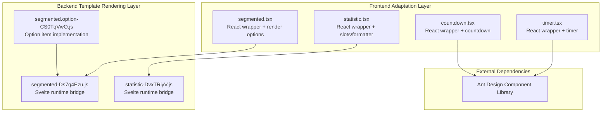
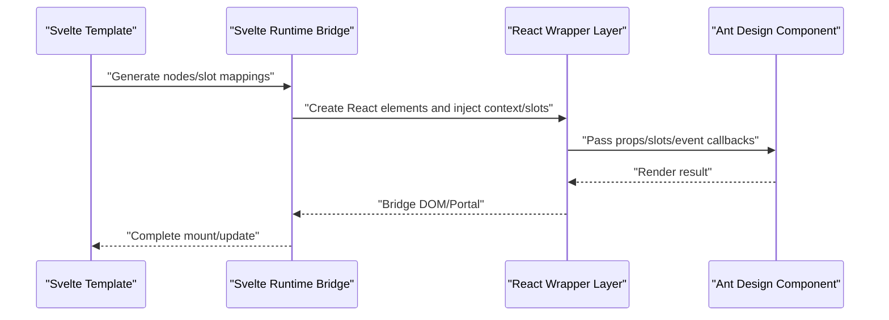
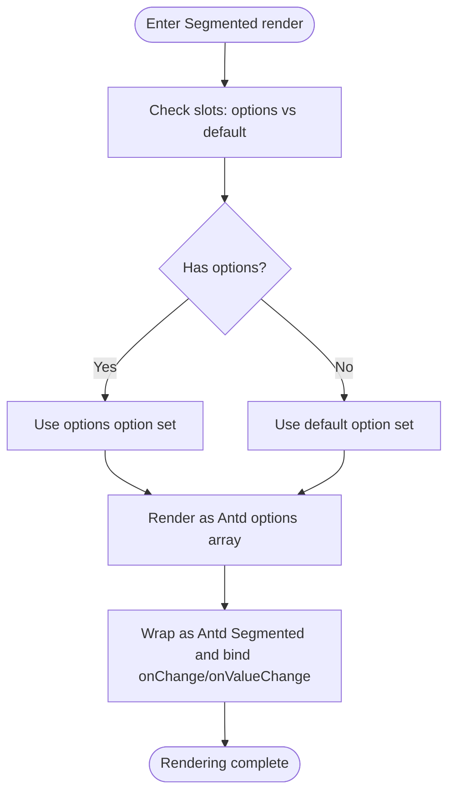
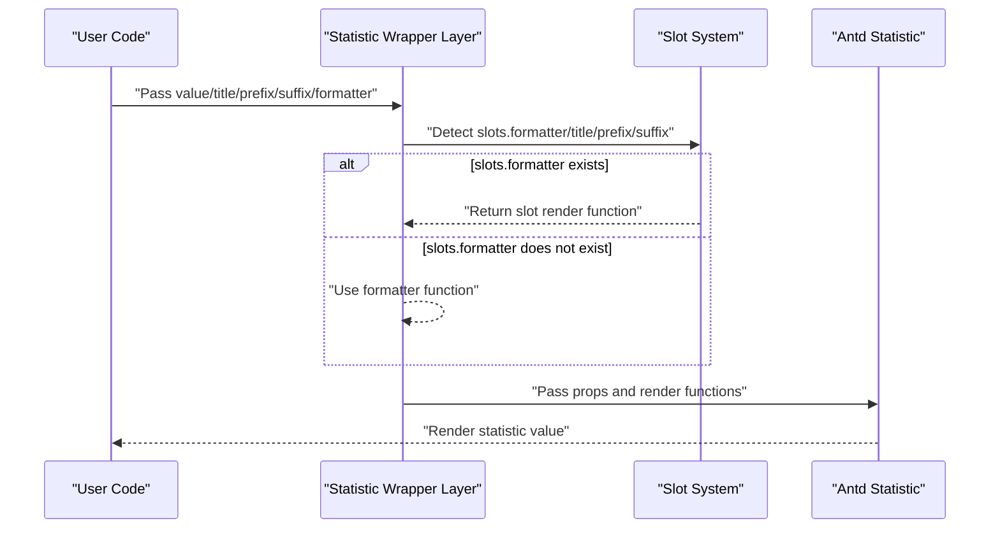
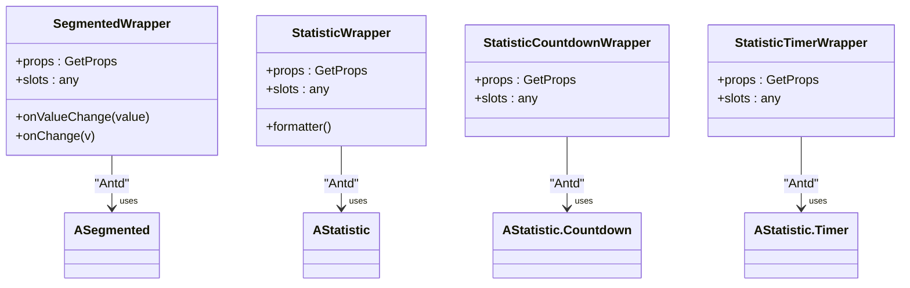
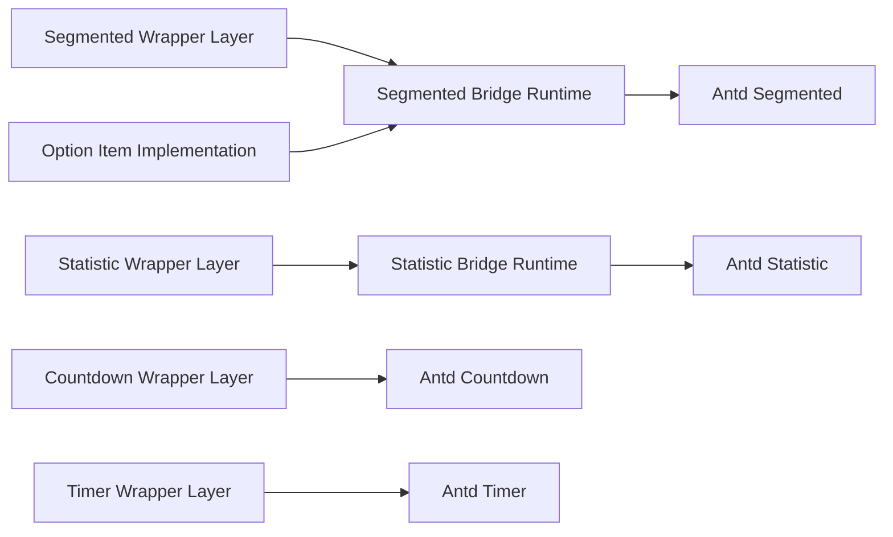

# Segmented and Statistic

<cite>
**Files Referenced in This Document**
- [frontend/antd/segmented/segmented.tsx](file://frontend/antd/segmented/segmented.tsx)
- [backend/modelscope_studio/components/antd/segmented/templates/component/segmented-Ds7q4Ezu.js](file://backend/modelscope_studio/components/antd/segmented/templates/component/segmented-Ds7q4Ezu.js)
- [backend/modelscope_studio/components/antd/segmented/option/templates/component/segmented.option-CS0TqVwO.js](file://backend/modelscope_studio/components/antd/segmented/option/templates/component/segmented.option-CS0TqVwO.js)
- [frontend/antd/statistic/statistic.tsx](file://frontend/antd/statistic/statistic.tsx)
- [backend/modelscope_studio/components/antd/statistic/templates/component/statistic-DvxTRiyV.js](file://backend/modelscope_studio/components/antd/statistic/templates/component/statistic-DvxTRiyV.js)
- [frontend/antd/statistic/countdown/statistic.countdown.tsx](file://frontend/antd/statistic/countdown/statistic.countdown.tsx)
- [frontend/antd/statistic/timer/statistic.timer.tsx](file://frontend/antd/statistic/timer/statistic.timer.tsx)
- [docs/components/antd/segmented/README-zh_CN.md](file://docs/components/antd/segmented/README-zh_CN.md)
- [docs/components/antd/statistic/README-zh_CN.md](file://docs/components/antd/statistic/README-zh_CN.md)
</cite>

## Table of Contents

1. [Introduction](#introduction)
2. [Project Structure](#project-structure)
3. [Core Components](#core-components)
4. [Architecture Overview](#architecture-overview)
5. [Detailed Component Analysis](#detailed-component-analysis)
6. [Dependency Analysis](#dependency-analysis)
7. [Performance Considerations](#performance-considerations)
8. [Troubleshooting Guide](#troubleshooting-guide)
9. [Conclusion](#conclusion)
10. [Appendix](#appendix)

## Introduction

This document focuses on two frontend components: **Segmented** and **Statistic**. The former is used for selecting among multiple mutually exclusive options; the latter is used for displaying numeric values, titles, prefixes/suffixes, and supports countdown and timer functionality. This document systematically explains the design and usage of these two components from the perspectives of architecture, data flow, processing logic, integration points, error handling, and performance characteristics, with visual diagrams for better understanding.

## Project Structure

- Components are composed of a frontend adaptation layer (React wrapper + Svelte pre-processing) and a backend template rendering layer (Svelte runtime bridge).
- Segmented injects option collections via context, supporting combined use with "option" groups; the Statistic component supports flexible extension through slots and function-based formatters.
- The documentation side provides basic demo entry points for quick onboarding.

**Diagram Source**

- [frontend/antd/segmented/segmented.tsx:1-47](file://frontend/antd/segmented/segmented.tsx#L1-L47)
- [backend/modelscope_studio/components/antd/segmented/templates/component/segmented-Ds7q4Ezu.js:695-719](file://backend/modelscope_studio/components/antd/segmented/templates/component/segmented-Ds7q4Ezu.js#L695-L719)
- [backend/modelscope_studio/components/antd/segmented/option/templates/component/segmented.option-CS0TqVwO.js:441-447](file://backend/modelscope_studio/components/antd/segmented/option/templates/component/segmented.option-CS0TqVwO.js#L441-L447)
- [frontend/antd/statistic/statistic.tsx:1-34](file://frontend/antd/statistic/statistic.tsx#L1-L34)
- [backend/modelscope_studio/components/antd/statistic/templates/component/statistic-DvxTRiyV.js:685-715](file://backend/modelscope_studio/components/antd/statistic/templates/component/statistic-DvxTRiyV.js#L685-L715)
- [frontend/antd/statistic/countdown/statistic.countdown.tsx:1-27](file://frontend/antd/statistic/countdown/statistic.countdown.tsx#L1-L27)
- [frontend/antd/statistic/timer/statistic.timer.tsx:1-29](file://frontend/antd/statistic/timer/statistic.timer.tsx#L1-L29)

**Section Source**

- [docs/components/antd/segmented/README-zh_CN.md:1-8](file://docs/components/antd/segmented/README-zh_CN.md#L1-L8)
- [docs/components/antd/statistic/README-zh_CN.md:1-9](file://docs/components/antd/statistic/README-zh_CN.md#L1-L9)

## Core Components

- Segmented
  - Supports passing an options array via props or injecting option collections via "option" slots.
  - Provides a combination of the onValueChange callback and the native onChange event.
  - Supports disabled state and block-level display (achieved by hiding children).
- Statistic
  - Supports combined use of title, prefix, suffix, and formatter as both slots and props.
  - Supports custom formatter functions and ReactSlot slot rendering.
- Statistic Sub-components
  - Countdown: accepts timestamps or millisecond values and automatically converts them to milliseconds.
  - Timer: a timer display based on the current time.

**Section Source**

- [frontend/antd/segmented/segmented.tsx:10-44](file://frontend/antd/segmented/segmented.tsx#L10-L44)
- [frontend/antd/statistic/statistic.tsx:8-31](file://frontend/antd/statistic/statistic.tsx#L8-L31)
- [frontend/antd/statistic/countdown/statistic.countdown.tsx:6-24](file://frontend/antd/statistic/countdown/statistic.countdown.tsx#L6-L24)
- [frontend/antd/statistic/timer/statistic.timer.tsx:10-26](file://frontend/antd/statistic/timer/statistic.timer.tsx#L10-L26)

## Architecture Overview

The following diagram shows the complete call chain from the Svelte template to the React wrapper and then to the Ant Design component, and how slots and context participate in rendering.

**Diagram Source**

- [backend/modelscope_studio/components/antd/segmented/templates/component/segmented-Ds7q4Ezu.js:695-719](file://backend/modelscope_studio/components/antd/segmented/templates/component/segmented-Ds7q4Ezu.js#L695-L719)
- [backend/modelscope_studio/components/antd/statistic/templates/component/statistic-DvxTRiyV.js:685-715](file://backend/modelscope_studio/components/antd/statistic/templates/component/statistic-DvxTRiyV.js#L685-L715)
- [backend/modelscope_studio/components/antd/segmented/option/templates/component/segmented.option-CS0TqVwO.js:441-447](file://backend/modelscope_studio/components/antd/segmented/option/templates/component/segmented.option-CS0TqVwO.js#L441-L447)

## Detailed Component Analysis

### Segmented Analysis

- Option Configuration and "Option Group" Combination
  - Injects "options/default" slot groups via context; options takes priority, falling back to default.
  - Uses useMemo to cache the option list and avoid unnecessary re-renders.
- Controlled and Uncontrolled Modes
  - Externally, value/onChange can be passed directly for controlled mode; onValueChange is also provided as an internal value change callback.
- Disabled State and Block-Level Display
  - Structural consistency is maintained by hiding children, without affecting the outer layout.
- Dynamic Updates and Style Customization
  - Option items achieve dynamic slot and context injection via the bridge runtime, with style and event forwarding support.

**Diagram Source**

- [frontend/antd/segmented/segmented.tsx:15-44](file://frontend/antd/segmented/segmented.tsx#L15-L44)
- [backend/modelscope_studio/components/antd/segmented/templates/component/segmented-Ds7q4Ezu.js:695-719](file://backend/modelscope_studio/components/antd/segmented/templates/component/segmented-Ds7q4Ezu.js#L695-L719)

**Section Source**

- [frontend/antd/segmented/segmented.tsx:10-44](file://frontend/antd/segmented/segmented.tsx#L10-L44)
- [backend/modelscope_studio/components/antd/segmented/templates/component/segmented-Ds7q4Ezu.js:695-719](file://backend/modelscope_studio/components/antd/segmented/templates/component/segmented-Ds7q4Ezu.js#L695-L719)
- [backend/modelscope_studio/components/antd/segmented/option/templates/component/segmented.option-CS0TqVwO.js:441-447](file://backend/modelscope_studio/components/antd/segmented/option/templates/component/segmented.option-CS0TqVwO.js#L441-L447)

### Statistic Analysis

- Value Display, Unit Settings, and Formatting
  - Supports dual-channel (slot + prop) for title/prefix/suffix; formatter supports both function and slot forms.
- Countdown and Timer
  - Both countdown and timer convert value to milliseconds to ensure consistency with what the Antd component expects.
- Combining Slots and Function-Based Formatters
  - When slots.formatter is present, the slot render takes priority; otherwise it falls back to the function-based formatter.

**Diagram Source**

- [frontend/antd/statistic/statistic.tsx:8-31](file://frontend/antd/statistic/statistic.tsx#L8-L31)
- [backend/modelscope_studio/components/antd/statistic/templates/component/statistic-DvxTRiyV.js:685-715](file://backend/modelscope_studio/components/antd/statistic/templates/component/statistic-DvxTRiyV.js#L685-L715)

**Section Source**

- [frontend/antd/statistic/statistic.tsx:8-31](file://frontend/antd/statistic/statistic.tsx#L8-L31)
- [frontend/antd/statistic/countdown/statistic.countdown.tsx:6-24](file://frontend/antd/statistic/countdown/statistic.countdown.tsx#L6-L24)
- [frontend/antd/statistic/timer/statistic.timer.tsx:10-26](file://frontend/antd/statistic/timer/statistic.timer.tsx#L10-L26)

### Component Class Relationship Diagram (Code Level)

**Diagram Source**

- [frontend/antd/segmented/segmented.tsx:10-44](file://frontend/antd/segmented/segmented.tsx#L10-L44)
- [frontend/antd/statistic/statistic.tsx:8-31](file://frontend/antd/statistic/statistic.tsx#L8-L31)
- [frontend/antd/statistic/countdown/statistic.countdown.tsx:6-24](file://frontend/antd/statistic/countdown/statistic.countdown.tsx#L6-L24)
- [frontend/antd/statistic/timer/statistic.timer.tsx:10-26](file://frontend/antd/statistic/timer/statistic.timer.tsx#L10-L26)

## Dependency Analysis

- Inter-Component Coupling
  - Segmented and option items establish a loosely-coupled relationship via context; option items do not directly depend on the controller but are uniformly scheduled by the bridge layer.
  - The Statistic component and its sub-components (countdown/timer) share the same bridge and slot mechanism.
- External Dependencies
  - All components depend on the Ant Design component library to ensure consistent UI behavior and styling.
- Potential Circular Dependencies
  - The current structure uses a unidirectional dependency of "bridge layer → React wrapper layer → Antd"; no signs of circular dependencies have been observed.

**Diagram Source**

- [backend/modelscope_studio/components/antd/segmented/templates/component/segmented-Ds7q4Ezu.js:695-719](file://backend/modelscope_studio/components/antd/segmented/templates/component/segmented-Ds7q4Ezu.js#L695-L719)
- [backend/modelscope_studio/components/antd/segmented/option/templates/component/segmented.option-CS0TqVwO.js:441-447](file://backend/modelscope_studio/components/antd/segmented/option/templates/component/segmented.option-CS0TqVwO.js#L441-L447)
- [backend/modelscope_studio/components/antd/statistic/templates/component/statistic-DvxTRiyV.js:685-715](file://backend/modelscope_studio/components/antd/statistic/templates/component/statistic-DvxTRiyV.js#L685-L715)
- [frontend/antd/statistic/countdown/statistic.countdown.tsx:15-21](file://frontend/antd/statistic/countdown/statistic.countdown.tsx#L15-L21)
- [frontend/antd/statistic/timer/statistic.timer.tsx:17-23](file://frontend/antd/statistic/timer/statistic.timer.tsx#L17-L23)

**Section Source**

- [backend/modelscope_studio/components/antd/segmented/templates/component/segmented-Ds7q4Ezu.js:695-719](file://backend/modelscope_studio/components/antd/segmented/templates/component/segmented-Ds7q4Ezu.js#L695-L719)
- [backend/modelscope_studio/components/antd/statistic/templates/component/statistic-DvxTRiyV.js:685-715](file://backend/modelscope_studio/components/antd/statistic/templates/component/statistic-DvxTRiyV.js#L685-L715)

## Performance Considerations

- Rendering Optimization
  - Segmented uses useMemo to cache the options array, reducing unnecessary re-renders.
  - The Statistic component uses slot render functions when slots.formatter is present, avoiding extra prop passing overhead.
- DOM Display Strategy
  - By setting children to invisible (display: none) and inserting the actual nodes in the bridge layer using "contents", layout jitter risk is reduced.
- Time Parameter Conversion
  - Countdown and Timer uniformly convert input values to milliseconds, avoiding performance fluctuations caused by different units from external callers.

**Section Source**

- [frontend/antd/segmented/segmented.tsx:30-38](file://frontend/antd/segmented/segmented.tsx#L30-L38)
- [frontend/antd/statistic/countdown/statistic.countdown.tsx:17-17](file://frontend/antd/statistic/countdown/statistic.countdown.tsx#L17-L17)
- [frontend/antd/statistic/timer/statistic.timer.tsx:19-19](file://frontend/antd/statistic/timer/statistic.timer.tsx#L19-L19)

## Troubleshooting Guide

- Options not displayed or not taking effect
  - Confirm that the "option group" slots (options/default) are correctly used and that slot elements are properly mounted.
  - Check that both onValueChange and onChange are bound to ensure the complete value change event chain.
- Slot content not rendered
  - Confirm that slots.formatter/title/prefix/suffix are correctly passed in and that the bridge layer has enabled the corresponding slot rendering.
- Countdown/Timer value anomalies
  - Confirm whether the input value unit is in seconds (internally converted to milliseconds) to avoid multiplying by 1000 twice.
- Style or event forwarding issues
  - Check the bridge layer context merge logic to confirm that styles and events are not being dropped during the bridge phase.

**Section Source**

- [frontend/antd/segmented/segmented.tsx:26-29](file://frontend/antd/segmented/segmented.tsx#L26-L29)
- [frontend/antd/statistic/statistic.tsx:18-28](file://frontend/antd/statistic/statistic.tsx#L18-L28)
- [frontend/antd/statistic/countdown/statistic.countdown.tsx:17-20](file://frontend/antd/statistic/countdown/statistic.countdown.tsx#L17-L20)
- [frontend/antd/statistic/timer/statistic.timer.tsx:19-22](file://frontend/antd/statistic/timer/statistic.timer.tsx#L19-L22)

## Conclusion

The Segmented and Statistic components achieve high consistency with Ant Design components and flexible extensibility through a unified bridge and slot mechanism. Segmented emphasizes dynamic option injection and event callback combinations; Statistic provides powerful flexibility in formatting and slot rendering. With the architecture diagrams and flowcharts in this document, developers can more efficiently apply these two components in form and dashboard scenarios.

## Appendix

- Demo Entry Points
  - Basic demos for Segmented and Statistic can be found in the documentation, making it easy to quickly verify component behavior.

**Section Source**

- [docs/components/antd/segmented/README-zh_CN.md:5-8](file://docs/components/antd/segmented/README-zh_CN.md#L5-L8)
- [docs/components/antd/statistic/README-zh_CN.md:7-9](file://docs/components/antd/statistic/README-zh_CN.md#L7-L9)
