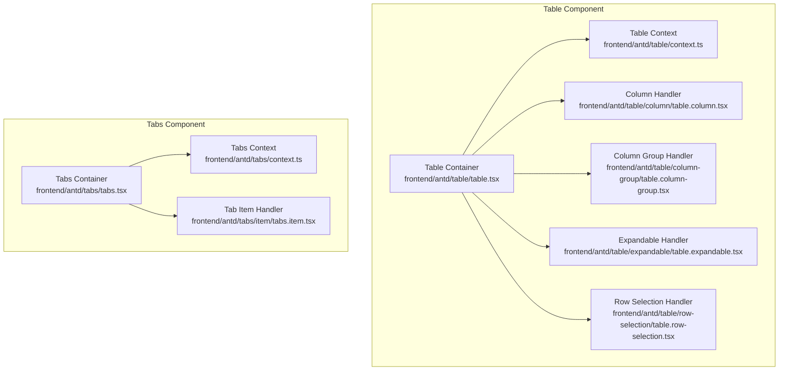
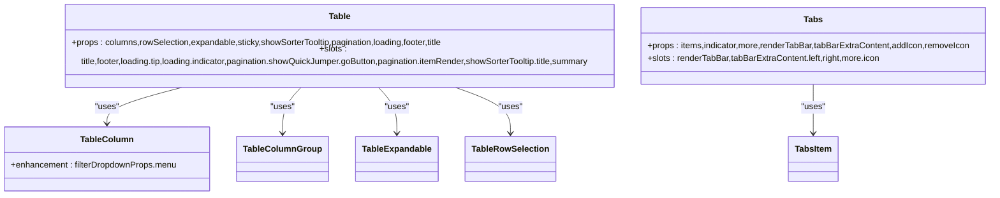
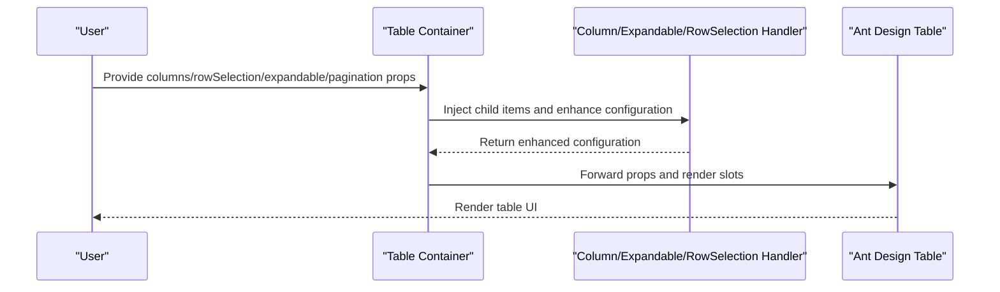
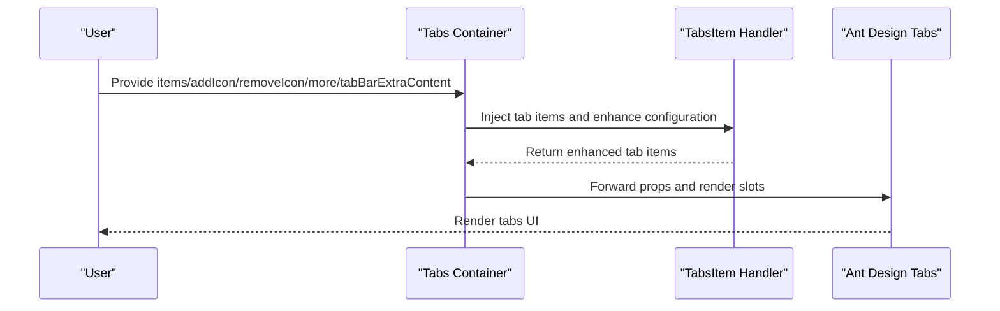
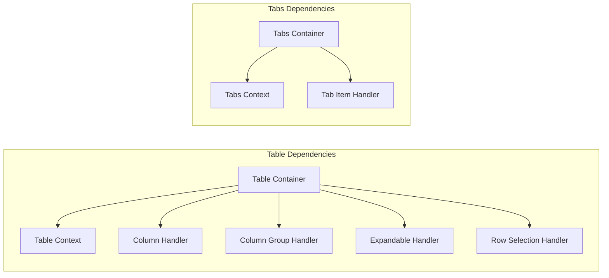

# Table and Tabs

<cite>
**Files Referenced in This Document**
- [table.tsx](file://frontend/antd/table/table.tsx)
- [context.ts](file://frontend/antd/table/context.ts)
- [table.column.tsx](file://frontend/antd/table/column/table.column.tsx)
- [table.column-group.tsx](file://frontend/antd/table/column-group/table.column-group.tsx)
- [table.expandable.tsx](file://frontend/antd/table/expandable/table.expandable.tsx)
- [table.row-selection.tsx](file://frontend/antd/table/row-selection/table.row-selection.tsx)
- [tabs.tsx](file://frontend/antd/tabs/tabs.tsx)
- [tabs.context.ts](file://frontend/antd/tabs/context.ts)
- [tabs.item.tsx](file://frontend/antd/tabs/item/tabs.item.tsx)
</cite>

## Table of Contents

- [Table and Tabs](#table-and-tabs)
  - [Table of Contents](#table-of-contents)
  - [Introduction](#introduction)
  - [Project Structure](#project-structure)
  - [Core Components](#core-components)
  - [Architecture Overview](#architecture-overview)
  - [Detailed Component Analysis](#detailed-component-analysis)
    - [Table Component](#table-component)
    - [Tabs Component](#tabs-component)
    - [Navigation Strategies in Complex Layouts](#navigation-strategies-in-complex-layouts)
  - [Dependency Analysis](#dependency-analysis)
  - [Performance Considerations](#performance-considerations)
  - [Troubleshooting Guide](#troubleshooting-guide)
  - [Conclusion](#conclusion)
  - [Appendix](#appendix)

## Introduction

This document provides a systematic review of the **Table** and **Tabs** component systems, covering their advanced capabilities and engineering implementation. Key topics include: Table's column definitions (column), column groups (column_group), expandable rows (expandable), and row selection (row_selection); Tabs' tab items, position control, disabled state, and dynamic addition/removal. It also provides practical recommendations for large dataset handling, virtual scrolling, sorting, filtering, and pagination integration; as well as extension ideas for Tabs' lazy content loading, tab icons, close buttons, and drag-to-reorder. Finally, it covers navigation strategies for responsive design and complex layouts.

## Project Structure

Both components use a layered design of "container component + item handler":

- The container component handles prop forwarding, slot rendering, context merging, and function wrapping;
- Item handlers (such as TableColumn, TabsItem, etc.) are responsible for injecting child elements into the container and enhancing configuration where necessary (such as menus, dropdowns, icons, etc.).

**Diagram Source**

- [table.tsx:28-276](file://frontend/antd/table/table.tsx#L28-L276)
- [context.ts](file://frontend/antd/table/context.ts)
- [table.column.tsx:20-97](file://frontend/antd/table/column/table.column.tsx#L20-L97)
- [table.column-group.tsx:7-19](file://frontend/antd/table/column-group/table.column-group.tsx#L7-L19)
- [table.expandable.tsx:7-11](file://frontend/antd/table/expandable/table.expandable.tsx#L7-L11)
- [table.row-selection.tsx:13-35](file://frontend/antd/table/row-selection/table.row-selection.tsx#L13-L35)
- [tabs.tsx:12-118](file://frontend/antd/tabs/tabs.tsx#L12-L118)
- [tabs.context.ts](file://frontend/antd/tabs/context.ts)
- [tabs.item.tsx:7-11](file://frontend/antd/tabs/item/tabs.item.tsx#L7-L11)

**Section Source**

- [table.tsx:28-276](file://frontend/antd/table/table.tsx#L28-L276)
- [tabs.tsx:12-118](file://frontend/antd/tabs/tabs.tsx#L12-L118)

## Core Components

- Table Container: handles unified processing and slot rendering for columns, rowSelection, expandable, sticky, showSorterTooltip, pagination, loading, footer, title, and other props.
- Column Handler: enhances column configuration with support for filter dropdown menus, custom popup rendering, menu expand icons, and overflow indicators.
- Column Group Handler: groups a set of columns as a logical unit, facilitating header merging and style control.
- Expandable Handler: injects expandable configuration into the table.
- Row Selection Handler: injects custom selection items (e.g., "Select All", "Invert Selection") into rowSelection.
- Tabs Container: handles unified processing and slot rendering for items, indicator, renderTabBar, more, tabBarExtraContent, addIcon, removeIcon, and other props.
- Tab Item Handler: injects individual tab items into Tabs' items.

**Section Source**

- [table.tsx:28-276](file://frontend/antd/table/table.tsx#L28-L276)
- [table.column.tsx:20-97](file://frontend/antd/table/column/table.column.tsx#L20-L97)
- [table.column-group.tsx:7-19](file://frontend/antd/table/column-group/table.column-group.tsx#L7-L19)
- [table.expandable.tsx:7-11](file://frontend/antd/table/expandable/table.expandable.tsx#L7-L11)
- [table.row-selection.tsx:13-35](file://frontend/antd/table/row-selection/table.row-selection.tsx#L13-L35)
- [tabs.tsx:12-118](file://frontend/antd/tabs/tabs.tsx#L12-L118)
- [tabs.item.tsx:7-11](file://frontend/antd/tabs/item/tabs.item.tsx#L7-L11)

## Architecture Overview

The following diagram shows the dependency relationships and division of responsibilities between the Table and Tabs containers and their item handlers.

**Diagram Source**

- [table.tsx:28-276](file://frontend/antd/table/table.tsx#L28-L276)
- [table.column.tsx:20-97](file://frontend/antd/table/column/table.column.tsx#L20-L97)
- [table.column-group.tsx:7-19](file://frontend/antd/table/column-group/table.column-group.tsx#L7-L19)
- [table.expandable.tsx:7-11](file://frontend/antd/table/expandable/table.expandable.tsx#L7-L11)
- [table.row-selection.tsx:13-35](file://frontend/antd/table/row-selection/table.row-selection.tsx#L13-L35)
- [tabs.tsx:12-118](file://frontend/antd/tabs/tabs.tsx#L12-L118)
- [tabs.item.tsx:7-11](file://frontend/antd/tabs/item/tabs.item.tsx#L7-L11)

## Detailed Component Analysis

### Table Component

- Column Definition (column)
  - Supports directly passing columns or injecting via TableColumn;
  - Recognizes and converts special placeholders (such as EXPAND_COLUMN, SELECTION_COLUMN);
  - Enhances filterDropdownProps with support for menu items, dropdown rendering, popup rendering, menu expand icons, and overflow indicators.
- Column Group (column_group)
  - Groups a set of columns as a logical unit for header merging and style control;
  - Only the default slot is allowed.
- Expandable Rows (expandable)
  - Injects expandable configuration via TableExpandable;
  - Supports custom rendering of expanded content.
- Row Selection (row_selection)
  - Injects rowSelection via TableRowSelection;
  - Supports custom selection items via selections (e.g., "Select All", "Invert Selection").
- Sorting, Filtering, and Pagination
  - Supports slot-based title for showSorterTooltip;
  - Supports slot-based jump button and page item rendering for pagination;
  - Supports tip and indicator slots for loading;
  - Supports container getter function for sticky;
  - Supports slot-based rendering for footer and summary.
- Large Datasets and Virtual Scrolling
  - It is recommended to combine external virtual scrolling solutions (e.g., fixed height + scrollable container) to reduce DOM node count;
  - Use onScroll with pagination/infinite scrolling to avoid rendering large numbers of rows at once.
- Responsive Design
  - Use sticky and column width settings to prioritize key columns on small screens;
  - Use the column's responsive configuration or a custom breakpoint strategy.

**Diagram Source**

- [table.tsx:66-271](file://frontend/antd/table/table.tsx#L66-L271)
- [table.column.tsx:28-93](file://frontend/antd/table/column/table.column.tsx#L28-L93)
- [table.expandable.tsx:9-10](file://frontend/antd/table/expandable/table.expandable.tsx#L9-L10)
- [table.row-selection.tsx:21-32](file://frontend/antd/table/row-selection/table.row-selection.tsx#L21-L32)

**Section Source**

- [table.tsx:28-276](file://frontend/antd/table/table.tsx#L28-L276)
- [table.column.tsx:20-97](file://frontend/antd/table/column/table.column.tsx#L20-L97)
- [table.column-group.tsx:7-19](file://frontend/antd/table/column-group/table.column-group.tsx#L7-L19)
- [table.expandable.tsx:7-11](file://frontend/antd/table/expandable/table.expandable.tsx#L7-L11)
- [table.row-selection.tsx:13-35](file://frontend/antd/table/row-selection/table.row-selection.tsx#L13-L35)

### Tabs Component

- Tab Items
  - Inject individual tab items via TabsItem;
  - Supports basic props such as disabled, closable, and closeIcon.
- Position Control and Dynamic Add/Remove
  - Control tab addition/removal via the dynamic items array;
  - indicator controls the bottom bar style with size function support;
  - addIcon/removeIcon support slot-based icons.
- Lazy Content Loading
  - It is recommended to render only the active panel's content on activation, avoiding rendering all panels at once;
  - Load data and components on demand in the onChange event.
- Tab Icons and Close Button
  - Customize icons via addIcon/removeIcon slots;
  - closable and closeIcon control whether tabs can be closed and the close icon appearance.
- Drag-to-Reorder
  - Can be implemented using an external drag library combined with onChange;
  - Be careful to maintain consistency between items order and activeKey.
- More Menu and Extra Content
  - more.icon supports a slot-based icon;
  - tabBarExtraContent supports slot-based content on both the left and right sides.

**Diagram Source**

- [tabs.tsx:26-115](file://frontend/antd/tabs/tabs.tsx#L26-L115)
- [tabs.item.tsx:9-10](file://frontend/antd/tabs/item/tabs.item.tsx#L9-L10)

**Section Source**

- [tabs.tsx:12-118](file://frontend/antd/tabs/tabs.tsx#L12-L118)
- [tabs.item.tsx:7-11](file://frontend/antd/tabs/item/tabs.item.tsx#L7-L11)

### Navigation Strategies in Complex Layouts

- Responsive Navigation
  - On narrow screens, enable the Tabs more menu to move less-used tabs into a dropdown;
  - Use sticky or fixed headers to keep navigation always visible.
- Nested Usage
  - When nesting child tabs or subtables inside tabs, be mindful of hierarchy and interaction conflicts;
  - Use independent contexts and namespaces to avoid event bubbling and state pollution.
- Navigation Consistency
  - Use onChange and activeKey uniformly to manage the current active state;
  - For asynchronously loaded data, display a skeleton screen first, then switch to real content.

## Dependency Analysis

- Table Side
  - The Table container depends on context providers (Column, Expandable, RowSelection) to collect child items;
  - TableColumn enhances filterDropdownProps and reuses the menu context;
  - TableRowSelection injects selections.
- Tabs Side
  - The Tabs container relies on the Items context to collect tab items;
  - TabsItem injects individual tab items.

**Diagram Source**

- [context.ts](file://frontend/antd/table/context.ts)
- [table.tsx:41-275](file://frontend/antd/table/table.tsx#L41-L275)
- [tabs.context.ts](file://frontend/antd/tabs/context.ts)
- [tabs.tsx:24-117](file://frontend/antd/tabs/tabs.tsx#L24-L117)

**Section Source**

- [table.tsx:41-275](file://frontend/antd/table/table.tsx#L41-L275)
- [tabs.tsx:24-117](file://frontend/antd/tabs/tabs.tsx#L24-L117)

## Performance Considerations

- Table
  - Large datasets: use fixed height + virtual scrolling (e.g., external library) to reduce DOM node count;
  - Pagination/infinite scrolling: combine with backend pagination to avoid rendering everything at once;
  - Column rendering: only render necessary columns, hide non-critical ones;
  - Event binding: use throttle/debounce for onRow/onHeaderRow.
- Tabs
  - Lazy content loading: only render on activation;
  - Dynamic add/remove: batch update items to avoid frequent re-renders;
  - Icons and slots: use lightweight components and avoid complex computations.

## Troubleshooting Guide

- Slots not taking effect
  - Confirm that slot key names match container declarations (such as pagination.showQuickJumper.goButton, more.icon, etc.);
  - Check that slots are correctly wrapped inside child items.
- Props not taking effect
  - Confirm that function-type props are wrapped with useFunction;
  - Check that object-type props (such as sticky, showSorterTooltip, pagination) are correctly merged.
- Style anomalies
  - Check whether getPopupContainer/getContainer returns the correct mount node;
  - Confirm that the ReactSlot render target container inside slots exists and is visible.

**Section Source**

- [table.tsx:76-108](file://frontend/antd/table/table.tsx#L76-L108)
- [tabs.tsx:36-39](file://frontend/antd/tabs/tabs.tsx#L36-L39)

## Conclusion

This document systematically reviews the capability boundaries and extension points of the Table and Tabs components from an architectural and implementation perspective. Through the collaboration of container components and item handlers, prop forwarding, slot rendering, and configuration enhancement are achieved. Combined with large dataset handling, virtual scrolling, lazy loading, and responsive strategies, they can provide a stable and maintainable navigation experience in complex layouts.

## Appendix

- Key Implementation Points
  - Table: slotting and function wrapping for columns, rowSelection, expandable, sticky, showSorterTooltip, pagination, loading, footer, and title;
  - Tabs: slotting and function wrapping for items, indicator, renderTabBar, more, tabBarExtraContent, addIcon, and removeIcon.
- Extension Recommendations
  - Table: introduce virtual scrolling with pagination integration; customize column groups and expandable content based on business scenarios;
  - Tabs: combine with routing and state management to implement dynamic add/remove and persistence; support drag-to-reorder and the more menu.
