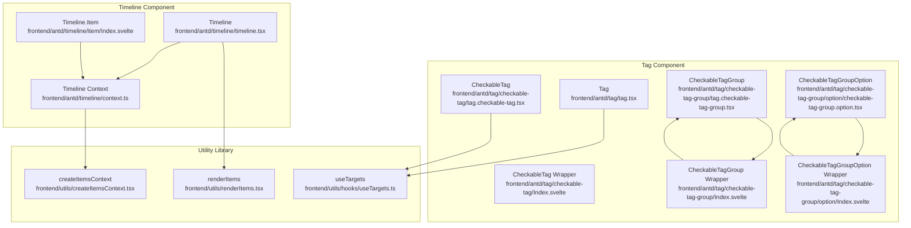
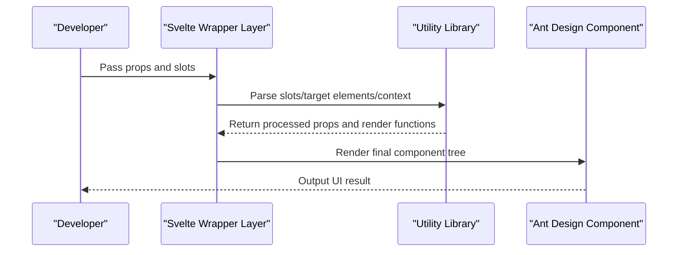
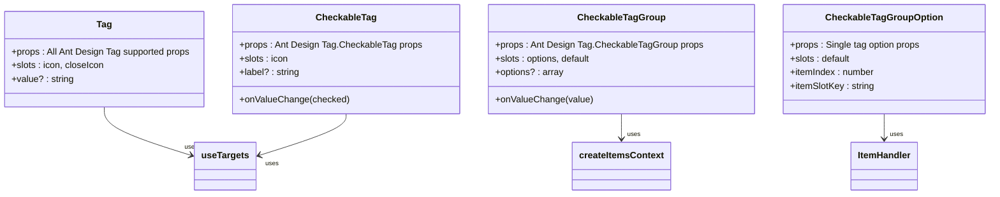
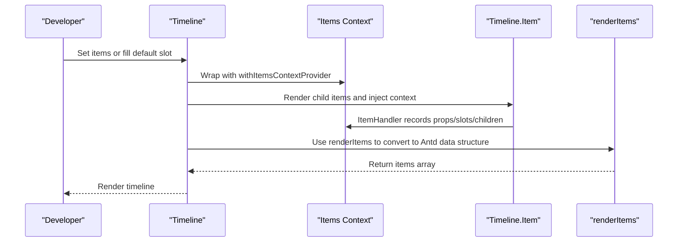
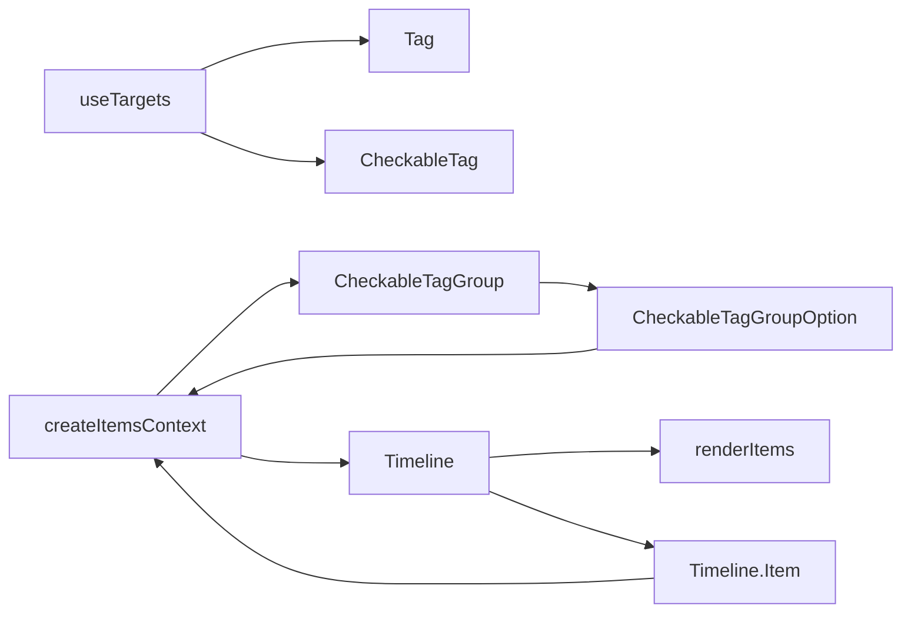

# Tag and Timeline

<cite>
**Files Referenced in This Document**
- [frontend/antd/tag/tag.tsx](file://frontend/antd/tag/tag.tsx)
- [frontend/antd/tag/checkable-tag/tag.checkable-tag.tsx](file://frontend/antd/tag/checkable-tag/tag.checkable-tag.tsx)
- [frontend/antd/tag/checkable-tag/Index.svelte](file://frontend/antd/tag/checkable-tag/Index.svelte)
- [frontend/antd/tag/checkable-tag-group/tag.checkable-tag-group.tsx](file://frontend/antd/tag/checkable-tag-group/tag.checkable-tag-group.tsx)
- [frontend/antd/tag/checkable-tag-group/Index.svelte](file://frontend/antd/tag/checkable-tag-group/Index.svelte)
- [frontend/antd/tag/checkable-tag-group/context.ts](file://frontend/antd/tag/checkable-tag-group/context.ts)
- [frontend/antd/tag/checkable-tag-group/option/checkable-tag-group.option.tsx](file://frontend/antd/tag/checkable-tag-group/option/checkable-tag-group.option.tsx)
- [frontend/antd/tag/checkable-tag-group/option/Index.svelte](file://frontend/antd/tag/checkable-tag-group/option/Index.svelte)
- [frontend/antd/timeline/timeline.tsx](file://frontend/antd/timeline/timeline.tsx)
- [frontend/antd/timeline/item/Index.svelte](file://frontend/antd/timeline/item/Index.svelte)
- [frontend/antd/timeline/context.ts](file://frontend/antd/timeline/context.ts)
- [frontend/utils/createItemsContext.tsx](file://frontend/utils/createItemsContext.tsx)
- [frontend/utils/renderItems.tsx](file://frontend/utils/renderItems.tsx)
- [frontend/utils/hooks/useTargets.ts](file://frontend/utils/hooks/useTargets.ts)
- [docs/components/antd/tag/demos/checkable_tag.py](file://docs/components/antd/tag/demos/checkable_tag.py)
- [docs/components/antd/timeline/demos/basic.py](file://docs/components/antd/timeline/demos/basic.py)
</cite>

## Update Summary

**Changes Made**

- Added the CheckableTagGroup component system, including the CheckableTagGroup main component and CheckableTagGroupOption child component
- Updated Timeline component documentation to reflect the simplified implementation of the Timeline.Item component
- Enhanced batch operation capabilities and dynamic option management for tag groups
- Improved context management and option handling mechanisms for CheckableTagGroup

## Table of Contents

1. [Introduction](#introduction)
2. [Project Structure](#project-structure)
3. [Core Components](#core-components)
4. [Architecture Overview](#architecture-overview)
5. [Detailed Component Analysis](#detailed-component-analysis)
6. [Dependency Analysis](#dependency-analysis)
7. [Performance Considerations](#performance-considerations)
8. [Troubleshooting Guide](#troubleshooting-guide)
9. [Conclusion](#conclusion)
10. [Appendix](#appendix)

## Introduction

This document focuses on the **Tag** and **Timeline** components, systematically explaining their design philosophy, data flow, interaction behavior, and extensibility. Key topics include:

- Tag: interaction states for regular and checkable tags, color configuration, dynamic tag management, click events, delete functionality, and batch operation recommendations.
- **New**: CheckableTagGroup component system supporting batch tag selection, dynamic option management, and grouped operations.
- Timeline: time nodes (Items), direction control, node customization, and style customization; as well as implementation paths for reversed display, custom icons, and line style adjustments.

## Project Structure

- The component layer uses a pattern of "frontend Svelte wrapper + backend Python component bridge"; the frontend adapts Ant Design's React components into Svelte components via sveltify, and introduces the Items context and slot rendering mechanism where necessary.
- The utility layer provides general capabilities such as items context, slot rendering, and target element resolution, supporting dynamic item management for complex container components (such as Timeline).

**Diagram Source**

- [frontend/antd/tag/tag.tsx:1-35](file://frontend/antd/tag/tag.tsx#L1-L35)
- [frontend/antd/tag/checkable-tag/tag.checkable-tag.tsx:1-35](file://frontend/antd/tag/checkable-tag/tag.checkable-tag.tsx#L1-L35)
- [frontend/antd/tag/checkable-tag/Index.svelte:1-77](file://frontend/antd/tag/checkable-tag/Index.svelte#L1-L77)
- [frontend/antd/tag/checkable-tag-group/tag.checkable-tag-group.tsx:1-51](file://frontend/antd/tag/checkable-tag-group/tag.checkable-tag-group.tsx#L1-L51)
- [frontend/antd/tag/checkable-tag-group/Index.svelte:1-79](file://frontend/antd/tag/checkable-tag-group/Index.svelte#L1-L79)
- [frontend/antd/tag/checkable-tag-group/option/checkable-tag-group.option.tsx:1-14](file://frontend/antd/tag/checkable-tag-group/option/checkable-tag-group.option.tsx#L1-L14)
- [frontend/antd/tag/checkable-tag-group/option/Index.svelte:1-74](file://frontend/antd/tag/checkable-tag-group/option/Index.svelte#L1-L74)
- [frontend/antd/timeline/timeline.tsx:1-50](file://frontend/antd/timeline/timeline.tsx#L1-L50)
- [frontend/antd/timeline/item/Index.svelte:1-65](file://frontend/antd/timeline/item/Index.svelte#L1-L65)
- [frontend/antd/timeline/context.ts:1-7](file://frontend/antd/timeline/context.ts#L1-L7)
- [frontend/utils/createItemsContext.tsx:1-274](file://frontend/utils/createItemsContext.tsx#L1-L274)
- [frontend/utils/renderItems.tsx:1-114](file://frontend/utils/renderItems.tsx#L1-L114)
- [frontend/utils/hooks/useTargets.ts:1-52](file://frontend/utils/hooks/useTargets.ts#L1-L52)

**Section Source**

- [frontend/antd/tag/tag.tsx:1-35](file://frontend/antd/tag/tag.tsx#L1-L35)
- [frontend/antd/tag/checkable-tag/tag.checkable-tag.tsx:1-35](file://frontend/antd/tag/checkable-tag/tag.checkable-tag.tsx#L1-L35)
- [frontend/antd/tag/checkable-tag/Index.svelte:1-77](file://frontend/antd/tag/checkable-tag/Index.svelte#L1-L77)
- [frontend/antd/tag/checkable-tag-group/tag.checkable-tag-group.tsx:1-51](file://frontend/antd/tag/checkable-tag-group/tag.checkable-tag-group.tsx#L1-L51)
- [frontend/antd/tag/checkable-tag-group/Index.svelte:1-79](file://frontend/antd/tag/checkable-tag-group/Index.svelte#L1-L79)
- [frontend/antd/tag/checkable-tag-group/option/checkable-tag-group.option.tsx:1-14](file://frontend/antd/tag/checkable-tag-group/option/checkable-tag-group.option.tsx#L1-L14)
- [frontend/antd/tag/checkable-tag-group/option/Index.svelte:1-74](file://frontend/antd/tag/checkable-tag-group/option/Index.svelte#L1-L74)
- [frontend/antd/timeline/timeline.tsx:1-50](file://frontend/antd/timeline/timeline.tsx#L1-L50)
- [frontend/antd/timeline/item/Index.svelte:1-65](file://frontend/antd/timeline/item/Index.svelte#L1-L65)
- [frontend/antd/timeline/context.ts:1-7](file://frontend/antd/timeline/context.ts#L1-L7)
- [frontend/utils/createItemsContext.tsx:1-274](file://frontend/utils/createItemsContext.tsx#L1-L274)
- [frontend/utils/renderItems.tsx:1-114](file://frontend/utils/renderItems.tsx#L1-L114)
- [frontend/utils/hooks/useTargets.ts:1-52](file://frontend/utils/hooks/useTargets.ts#L1-L52)

## Core Components

- Tag
  - Regular tag: supports text and icons, closeIcon slot, and value field fallback rendering.
  - CheckableTag: two-way binding for checked state, supports label text fallback, icon slot, and change callback.
  - **New**: CheckableTagGroup: supports batch tag selection, dynamic option management, and grouped operations.
- Timeline
  - Supports dynamic items injection and default slot fallback; supports pending/pendingDot slots; internally collects child items via the Items context and renders them.

**Section Source**

- [frontend/antd/tag/tag.tsx:7-32](file://frontend/antd/tag/tag.tsx#L7-L32)
- [frontend/antd/tag/checkable-tag/tag.checkable-tag.tsx:7-32](file://frontend/antd/tag/checkable-tag/tag.checkable-tag.tsx#L7-L32)
- [frontend/antd/tag/checkable-tag-group/tag.checkable-tag-group.tsx:8-48](file://frontend/antd/tag/checkable-tag-group/tag.checkable-tag-group.tsx#L8-L48)
- [frontend/antd/timeline/timeline.tsx:9-47](file://frontend/antd/timeline/timeline.tsx#L9-L47)

## Architecture Overview

Both Tag and Timeline bridge Ant Design's React components into the Svelte ecosystem via sveltify, while leveraging slots and context to achieve flexible dynamic rendering and prop forwarding.

**Diagram Source**

- [frontend/antd/tag/tag.tsx:12-32](file://frontend/antd/tag/tag.tsx#L12-L32)
- [frontend/antd/tag/checkable-tag/tag.checkable-tag.tsx:13-32](file://frontend/antd/tag/checkable-tag/tag.checkable-tag.tsx#L13-L32)
- [frontend/antd/tag/checkable-tag-group/tag.checkable-tag-group.tsx:14-46](file://frontend/antd/tag/checkable-tag-group/tag.checkable-tag-group.tsx#L14-L46)
- [frontend/antd/timeline/timeline.tsx:15-46](file://frontend/antd/timeline/timeline.tsx#L15-L46)

## Detailed Component Analysis

### Tag Component

- Regular Tag
  - Key points: supports icon/closeIcon slots; when target child nodes are present, child nodes take rendering priority over the children + value fallback.
  - Use cases: category labels, status badges, closable temporary tags.
- CheckableTag
  - Key points: supports checked/value props and onValueChange callback; supports label text fallback; onChange is triggered in the callback chain.
  - Use cases: multi-select filtering, preference settings, category checkboxes.
- **New**: CheckableTagGroup
  - Key points: supports an options array or default slot fallback; injects context via ItemHandler, recording each child item's props, slots, and nested children.
  - Use cases: batch tag selection, category filtering, multi-option group management.

**Diagram Source**

- [frontend/antd/tag/tag.tsx:7-32](file://frontend/antd/tag/tag.tsx#L7-L32)
- [frontend/antd/tag/checkable-tag/tag.checkable-tag.tsx:7-32](file://frontend/antd/tag/checkable-tag/tag.checkable-tag.tsx#L7-L32)
- [frontend/antd/tag/checkable-tag-group/tag.checkable-tag-group.tsx:8-48](file://frontend/antd/tag/checkable-tag-group/tag.checkable-tag-group.tsx#L8-L48)
- [frontend/antd/tag/checkable-tag-group/option/checkable-tag-group.option.tsx:7-13](file://frontend/antd/tag/checkable-tag-group/option/checkable-tag-group.option.tsx#L7-L13)
- [frontend/utils/hooks/useTargets.ts:5-51](file://frontend/utils/hooks/useTargets.ts#L5-L51)
- [frontend/antd/tag/checkable-tag-group/context.ts:3-4](file://frontend/antd/tag/checkable-tag-group/context.ts#L3-L4)

**Section Source**

- [frontend/antd/tag/tag.tsx:7-32](file://frontend/antd/tag/tag.tsx#L7-L32)
- [frontend/antd/tag/checkable-tag/tag.checkable-tag.tsx:7-32](file://frontend/antd/tag/checkable-tag/tag.checkable-tag.tsx#L7-L32)
- [frontend/antd/tag/checkable-tag-group/tag.checkable-tag-group.tsx:8-48](file://frontend/antd/tag/checkable-tag-group/tag.checkable-tag-group.tsx#L8-L48)
- [frontend/antd/tag/checkable-tag-group/option/checkable-tag-group.option.tsx:7-13](file://frontend/antd/tag/checkable-tag-group/option/checkable-tag-group.option.tsx#L7-L13)
- [frontend/utils/hooks/useTargets.ts:5-51](file://frontend/utils/hooks/useTargets.ts#L5-L51)
- [frontend/antd/tag/checkable-tag-group/context.ts:3-4](file://frontend/antd/tag/checkable-tag-group/context.ts#L3-L4)

#### Interaction and State

- Regular Tag
  - Click events: handled by Antd native events; onClick and other events can be forwarded via props.
  - Delete: achievable by combining the closeIcon slot with the closeIcon prop.
- CheckableTag
  - Checked state: two-way binding via value/checked; onValueChange callback for state synchronization.
  - Batch operations: manage the value of multiple CheckableTags in a parent container and update them in bulk.
- **New**: CheckableTagGroup
  - Checked state: supports single-select and multi-select modes; onValueChange returns a selected value array or a single value.
  - Dynamic options: dynamically add/remove tag options via the options prop or default slot.
  - Group management: supports nested tag groups and batch operations at the group level.

**Section Source**

- [frontend/antd/tag/checkable-tag/tag.checkable-tag.tsx:23-26](file://frontend/antd/tag/checkable-tag/tag.checkable-tag.tsx#L23-L26)
- [frontend/antd/tag/checkable-tag/Index.svelte:69-71](file://frontend/antd/tag/checkable-tag/Index.svelte#L69-L71)
- [frontend/antd/tag/checkable-tag-group/tag.checkable-tag-group.tsx:39-42](file://frontend/antd/tag/checkable-tag-group/tag.checkable-tag-group.tsx#L39-L42)
- [frontend/antd/tag/checkable-tag-group/Index.svelte:71-73](file://frontend/antd/tag/checkable-tag-group/Index.svelte#L71-L73)

#### Color Configuration and Dynamic Management

- Color: supports preset color palettes and custom hex values via the color prop.
- Dynamic: combining backend component bridging and frontend prop forwarding enables runtime dynamic switching of colors and text.
- **New**: Tag group color: supports setting a unified color theme for the entire tag group while preserving per-tag color overrides.

**Section Source**

- [docs/components/antd/tag/demos/checkable_tag.py:10-15](file://docs/components/antd/tag/demos/checkable_tag.py#L10-L15)

#### Application in Search Results

- Recommendation: add Tags to search result entries as category/status identifiers; use CheckableTag for multi-dimensional filtering; use closeIcon to remove filter conditions in one click.
- **New**: Use CheckableTagGroup for advanced filtering: supports multi-dimensional tag combination filtering, batch operations, and saving filter conditions.

### Timeline Component

- Timeline Body
  - Supports an items array or default slot fallback; pending/pendingDot slots can customize the "in progress" state.
  - Internally collects child items via the Items context, then uses renderItems to convert them into the data structure required by Antd.
- **Updated**: Timeline Item (Timeline.Item)
  - **Simplified implementation**: removed complex prop handling logic, directly forwarding all props and slots.
  - Injects context via ItemHandler, recording each child item's props, slots, and nested children.
  - Supports a custom dot slot to replace the timeline node icon.

**Diagram Source**

- [frontend/antd/timeline/timeline.tsx:13-46](file://frontend/antd/timeline/timeline.tsx#L13-L46)
- [frontend/antd/timeline/context.ts:3-4](file://frontend/antd/timeline/context.ts#L3-L4)
- [frontend/utils/createItemsContext.tsx:171-184](file://frontend/utils/createItemsContext.tsx#L171-L184)
- [frontend/utils/renderItems.tsx:8-113](file://frontend/utils/renderItems.tsx#L8-L113)
- [frontend/antd/timeline/item/Index.svelte:49-64](file://frontend/antd/timeline/item/Index.svelte#L49-L64)

**Section Source**

- [frontend/antd/timeline/timeline.tsx:13-46](file://frontend/antd/timeline/timeline.tsx#L13-L46)
- [frontend/antd/timeline/context.ts:3-4](file://frontend/antd/timeline/context.ts#L3-L4)
- [frontend/utils/createItemsContext.tsx:171-184](file://frontend/utils/createItemsContext.tsx#L171-L184)
- [frontend/utils/renderItems.tsx:8-113](file://frontend/utils/renderItems.tsx#L8-L113)
- [frontend/antd/timeline/item/Index.svelte:49-64](file://frontend/antd/timeline/item/Index.svelte#L49-L64)

#### Direction Control and Style Customization

- Direction control: use the mode prop (such as alternate) to control alternating display of timeline nodes.
- Style customization: supports the color prop for node coloring; the dot slot allows custom node icons; pending/pendingDot slots customize the "in progress" state.

**Section Source**

- [docs/components/antd/timeline/demos/basic.py:18-38](file://docs/components/antd/timeline/demos/basic.py#L18-L38)

#### Reversed Display and Timeline Style Adjustments

- Reversed display: reverse order can be achieved via mode or external layout; for complete reversal, reverse the items array before passing it in at the parent layer.
- Line styles: Antd Timeline's default styles can be adjusted via theme variables or overriding class names; custom styles can also be wrapped in a parent container.

#### Custom Node Icons

- Custom icons: inject any icon component via the dot slot in Timeline.Item to achieve personalized visual node expression.

**Section Source**

- [docs/components/antd/timeline/demos/basic.py:27-37](file://docs/components/antd/timeline/demos/basic.py#L27-L37)

#### Visualization in Project Progress

- Recommendations: express milestones, task nodes, version releases, and other events as Timeline.Items; use color to mark priority/status; use dot slot for status icons; use pending/pendingDot slots to highlight the current phase.

## Dependency Analysis

- Tag Component
  - useTargets: resolves target elements among child nodes to determine whether to fall back to children + value.
  - **New**: createItemsContext: provides context support for tag groups to manage option lists and state.
- Timeline Component
  - createItemsContext: provides the Items context responsible for collecting and merging child items.
  - renderItems: converts the Item structure in context into the items array required by Antd.
  - useItems: reads the collected items in Timeline and passes them to Antd Timeline.

**Diagram Source**

- [frontend/utils/hooks/useTargets.ts:5-51](file://frontend/utils/hooks/useTargets.ts#L5-L51)
- [frontend/antd/tag/tag.tsx:12-32](file://frontend/antd/tag/tag.tsx#L12-L32)
- [frontend/antd/tag/checkable-tag/tag.checkable-tag.tsx:13-32](file://frontend/antd/tag/checkable-tag/tag.checkable-tag.tsx#L13-L32)
- [frontend/antd/tag/checkable-tag-group/context.ts:1-7](file://frontend/antd/tag/checkable-tag-group/context.ts#L1-L7)
- [frontend/antd/tag/checkable-tag-group/tag.checkable-tag-group.tsx:6-6](file://frontend/antd/tag/checkable-tag-group/tag.checkable-tag-group.tsx#L6-L6)
- [frontend/antd/timeline/timeline.tsx:7-7](file://frontend/antd/timeline/timeline.tsx#L7-L7)
- [frontend/utils/createItemsContext.tsx:97-106](file://frontend/utils/createItemsContext.tsx#L97-L106)
- [frontend/antd/timeline/item/Index.svelte:13-13](file://frontend/antd/timeline/item/Index.svelte#L13-L13)

**Section Source**

- [frontend/utils/hooks/useTargets.ts:5-51](file://frontend/utils/hooks/useTargets.ts#L5-L51)
- [frontend/antd/tag/tag.tsx:12-32](file://frontend/antd/tag/tag.tsx#L12-L32)
- [frontend/antd/tag/checkable-tag/tag.checkable-tag.tsx:13-32](file://frontend/antd/tag/checkable-tag/tag.checkable-tag.tsx#L13-L32)
- [frontend/antd/tag/checkable-tag-group/context.ts:1-7](file://frontend/antd/tag/checkable-tag-group/context.ts#L1-L7)
- [frontend/antd/tag/checkable-tag-group/tag.checkable-tag-group.tsx:6-6](file://frontend/antd/tag/checkable-tag-group/tag.checkable-tag-group.tsx#L6-L6)
- [frontend/antd/timeline/timeline.tsx:7-7](file://frontend/antd/timeline/timeline.tsx#L7-L7)
- [frontend/utils/createItemsContext.tsx:97-106](file://frontend/utils/createItemsContext.tsx#L97-L106)
- [frontend/antd/timeline/item/Index.svelte:13-13](file://frontend/antd/timeline/item/Index.svelte#L13-L13)

## Performance Considerations

- Rendering Optimization
  - useTargets only recalculates sorting and filtering of child nodes when children change, avoiding unnecessary re-renders.
  - renderItems controls context update frequency via memoizedEqualValue and useMemoizedFn.
  - **New**: CheckableTagGroup ensures option cloning via clone: true parameter to avoid state pollution.
- Context Stability
  - withItemsContextProvider and useItems keep context references stable via useMemo and useRef, reducing subtree re-renders.
  - **New**: Tag group context provides stable option management via createItemsContext.
- Slot Clone Strategy
  - renderItems supports clone/forceClone parameters to control node cloning on demand, balancing performance with scope isolation.

**Section Source**

- [frontend/utils/hooks/useTargets.ts:5-51](file://frontend/utils/hooks/useTargets.ts#L5-L51)
- [frontend/utils/createItemsContext.tsx:113-156](file://frontend/utils/createItemsContext.tsx#L113-L156)
- [frontend/utils/renderItems.tsx:62-94](file://frontend/utils/renderItems.tsx#L62-L94)
- [frontend/antd/tag/checkable-tag-group/tag.checkable-tag-group.tsx:33-36](file://frontend/antd/tag/checkable-tag-group/tag.checkable-tag-group.tsx#L33-L36)

## Troubleshooting Guide

- Tag not displaying value
  - Check whether children contain recognizable target nodes; if target nodes are present, they will take rendering priority over the value fallback.
  - Reference path: [frontend/antd/tag/tag.tsx:22-29](file://frontend/antd/tag/tag.tsx#L22-L29)
- CheckableTag not triggering onValueChange
  - Confirm that onValueChange is correctly passed; onChange is triggered before onValueChange, ensure the callback chain is complete.
  - Reference path: [frontend/antd/tag/checkable-tag/tag.checkable-tag.tsx:23-26](file://frontend/antd/tag/checkable-tag/tag.checkable-tag.tsx#L23-L26)
- **New**: CheckableTagGroup options not displayed
  - Confirm that CheckableTagGroupOption is correctly used and content is injected via slots; check that the tag group context is active.
  - Reference path: [frontend/antd/tag/checkable-tag-group/option/Index.svelte:55-73](file://frontend/antd/tag/checkable-tag-group/option/Index.svelte#L55-L73)
- **New**: Tag group value not updating
  - Confirm that the onValueChange callback correctly handles the return value; check the tag group's value prop binding.
  - Reference path: [frontend/antd/tag/checkable-tag-group/Index.svelte:71-73](file://frontend/antd/tag/checkable-tag-group/Index.svelte#L71-L73)
- Timeline not displaying any nodes
  - Confirm that Timeline.Item is correctly used and content is injected via slots; check that the Items context is active.
  - Reference path: [frontend/antd/timeline/item/Index.svelte:49-64](file://frontend/antd/timeline/item/Index.svelte#L49-L64)
- Custom dot not taking effect
  - Ensure the dot slot is correctly declared inside Timeline.Item; check that slotKey matches the context.
  - Reference path: [frontend/antd/timeline/item/Index.svelte:58-63](file://frontend/antd/timeline/item/Index.svelte#L58-L63)

**Section Source**

- [frontend/antd/tag/tag.tsx:22-29](file://frontend/antd/tag/tag.tsx#L22-L29)
- [frontend/antd/tag/checkable-tag/tag.checkable-tag.tsx:23-26](file://frontend/antd/tag/checkable-tag/tag.checkable-tag.tsx#L23-L26)
- [frontend/antd/tag/checkable-tag-group/option/Index.svelte:55-73](file://frontend/antd/tag/checkable-tag-group/option/Index.svelte#L55-L73)
- [frontend/antd/tag/checkable-tag-group/Index.svelte:71-73](file://frontend/antd/tag/checkable-tag-group/Index.svelte#L71-L73)
- [frontend/antd/timeline/item/Index.svelte:49-64](file://frontend/antd/timeline/item/Index.svelte#L49-L64)
- [frontend/antd/timeline/item/Index.svelte:58-63](file://frontend/antd/timeline/item/Index.svelte#L58-L63)

## Conclusion

- The Tag component achieves flexible content fallback and icon extension through slot and target element resolution; CheckableTag provides a concise two-way binding and callback mechanism, suitable for multi-select and filtering scenarios.
- **New**: CheckableTagGroup provides powerful batch tag selection capabilities through a complete context system and option management, suitable for complex filtering and grouping scenarios.
- The Timeline component uses the Items context and renderItems to convert complex nested structures into the array form required by Antd, offering good extensibility and customization capabilities.
- In real business scenarios, combining backend component bridging and frontend prop forwarding can achieve linked display of dynamic tags and progress timelines.

## Appendix

- Example References
  - CheckableTag demo: [docs/components/antd/tag/demos/checkable_tag.py:1-19](file://docs/components/antd/tag/demos/checkable_tag.py#L1-L19)
  - Timeline basic demo: [docs/components/antd/timeline/demos/basic.py:1-41](file://docs/components/antd/timeline/demos/basic.py#L1-L41)
- **New**: CheckableTagGroup Examples
  - Tag group basic usage: supports options array and dynamic option management
  - Tag group batch operations: supports multi-select mode and batch state management
  - Tag group nested usage: supports integrating tag group components in forms and filters
