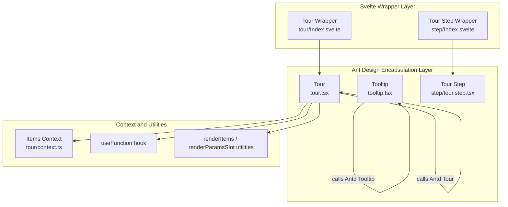
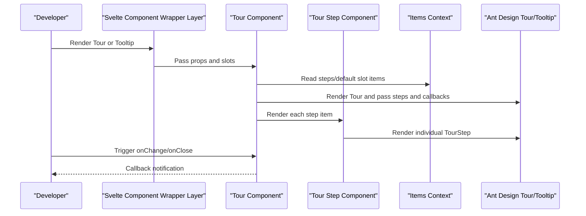
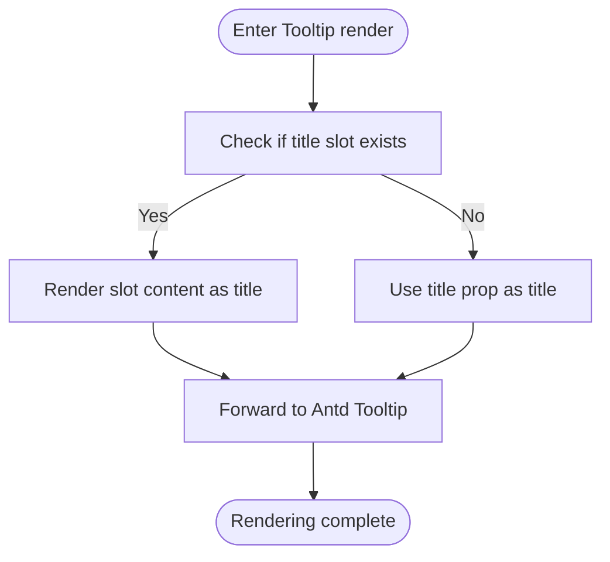
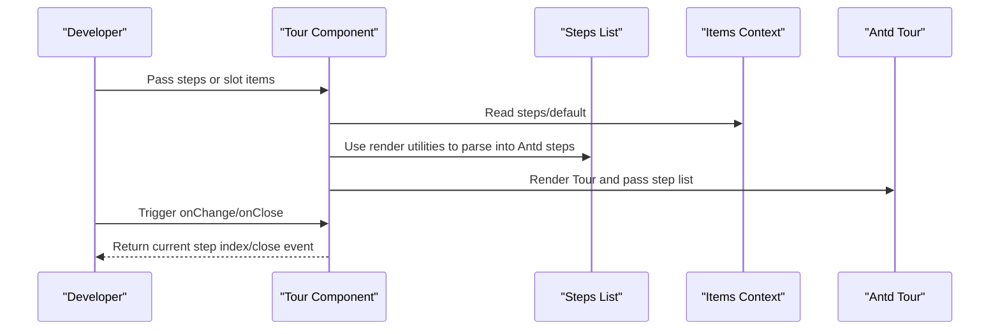
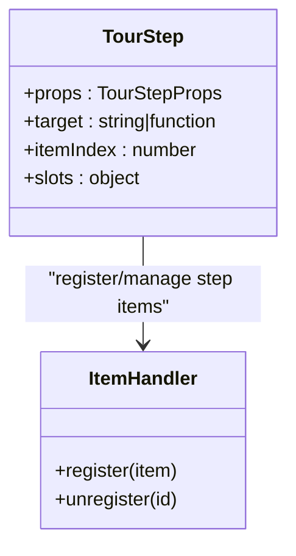
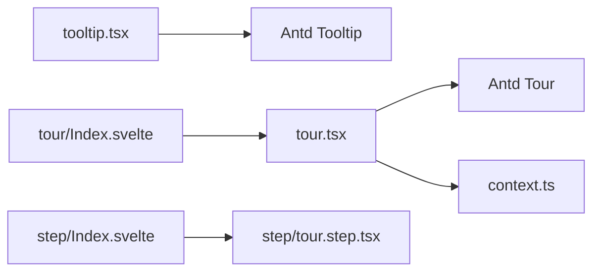

# Tooltip and Tour

<cite>
**Files Referenced in This Document**
- [tooltip.tsx](file://frontend/antd/tooltip/tooltip.tsx)
- [tour.tsx](file://frontend/antd/tour/tour.tsx)
- [context.ts](file://frontend/antd/tour/context.ts)
- [Index.svelte (Tour)](file://frontend/antd/tour/Index.svelte)
- [Index.svelte (Tour Step)](file://frontend/antd/tour/step/Index.svelte)
- [tour.step.tsx](file://frontend/antd/tour/step/tour.step.tsx)
- [README.md (Tooltip docs)](file://docs/components/antd/tooltip/README.md)
- [README.md (Tour docs)](file://docs/components/antd/tour/README.md)
</cite>

## Table of Contents

1. [Introduction](#introduction)
2. [Project Structure](#project-structure)
3. [Core Components](#core-components)
4. [Architecture Overview](#architecture-overview)
5. [Detailed Component Analysis](#detailed-component-analysis)
6. [Dependency Analysis](#dependency-analysis)
7. [Performance Considerations](#performance-considerations)
8. [Troubleshooting Guide](#troubleshooting-guide)
9. [Conclusion](#conclusion)
10. [Appendix](#appendix)

## Introduction

This document covers the encapsulation and usage of the **Tooltip** and **Tour** Ant Design components in this repository. Key topics include:

- Tooltip: trigger modes, position offset, delayed display, multi-line text support, nested usage, HTML content support, and accessibility optimization
- Tour: step configuration, path planning, focus areas, user interaction control, conditional logic, user preference memory, and guided flow customization

## Project Structure

This project uses Svelte + React preprocessing (svelte-preprocess-react) to expose Ant Design's React components to the Svelte ecosystem as Svelte components. Tooltip and Tour encapsulations are located under frontend/antd, and Tour's Step subcomponent is located at frontend/antd/tour/step.

Diagram Source

- [tooltip.tsx:1-29](file://frontend/antd/tooltip/tooltip.tsx#L1-L29)
- [tour.tsx:1-87](file://frontend/antd/tour/tour.tsx#L1-L87)
- [context.ts:1-7](file://frontend/antd/tour/context.ts#L1-L7)
- [Index.svelte (Tour):1-60](file://frontend/antd/tour/Index.svelte#L1-L60)
- [Index.svelte (Tour Step):1-82](file://frontend/antd/tour/step/Index.svelte#L1-L82)
- [tour.step.tsx:1-14](file://frontend/antd/tour/step/tour.step.tsx#L1-L14)

Section Source

- [tooltip.tsx:1-29](file://frontend/antd/tooltip/tooltip.tsx#L1-L29)
- [tour.tsx:1-87](file://frontend/antd/tour/tour.tsx#L1-L87)
- [context.ts:1-7](file://frontend/antd/tour/context.ts#L1-L7)
- [Index.svelte (Tour):1-60](file://frontend/antd/tour/Index.svelte#L1-L60)
- [Index.svelte (Tour Step):1-82](file://frontend/antd/tour/step/Index.svelte#L1-L82)
- [tour.step.tsx:1-14](file://frontend/antd/tour/step/tour.step.tsx#L1-L14)

## Core Components

- Tooltip: a lightweight wrapper for Ant Design Tooltip that preserves the title prop and slot-based title rendering capability, and safely injects callback functions into the React component via useFunction.
- Tour: an enhanced wrapper for Ant Design Tour that supports injecting steps, close icons, indicators, and action areas via slots; internally uses the Items context and render utilities to parse the step list; and provides onChange/onClose callback bridging.

Section Source

- [tooltip.tsx:7-26](file://frontend/antd/tooltip/tooltip.tsx#L7-L26)
- [tour.tsx:11-84](file://frontend/antd/tour/tour.tsx#L11-L84)

## Architecture Overview

The following diagram shows the call chain and data flow for Tooltip and Tour in this repository:

Diagram Source

- [tour.tsx:17-83](file://frontend/antd/tour/tour.tsx#L17-L83)
- [context.ts:1-7](file://frontend/antd/tour/context.ts#L1-L7)
- [Index.svelte (Tour):46-59](file://frontend/antd/tour/Index.svelte#L46-L59)
- [Index.svelte (Tour Step):61-81](file://frontend/antd/tour/step/Index.svelte#L61-L81)
- [tour.step.tsx:7-11](file://frontend/antd/tour/step/tour.step.tsx#L7-L11)

## Detailed Component Analysis

### Tooltip Component

- Trigger Modes
  - Supports standard mouse-hover triggering via Ant Design Tooltip's native behavior.
  - Dynamic content rendering can be achieved via slot-based titles, making it easy to embed HTML structures or complex components in the title.
- Position Offset
  - Fine-tuned using Ant Design Tooltip's native offset parameters to meet different layout requirements.
- Delayed Display
  - Use Ant Design Tooltip's delay parameters to avoid flickering or accidental triggers from frequent interactions.
- Multi-line Text Support
  - Naturally supports multi-line text and rich text via the slot-based title and Ant Design Tooltip's line-break mechanism.
- Nested Usage
  - Other interactive elements (such as buttons or links) can be nested inside Tooltip to achieve composite interactions.
- HTML Content Support
  - HTML fragments can be rendered in Tooltip by injecting React nodes into the title via a slot.
- Accessibility Optimization
  - Maintain native semantic tags and keyboard reachability; ensure that the title content is readable and understandable.

Diagram Source

- [tooltip.tsx:17-19](file://frontend/antd/tooltip/tooltip.tsx#L17-L19)

Section Source

- [tooltip.tsx:7-26](file://frontend/antd/tooltip/tooltip.tsx#L7-L26)

### Tour Component

- Step Configuration
  - Supports directly passing a steps array, or injecting steps/default items via slots; internally, render utilities uniformly parse them into the step format required by Ant Design Tour.
- Path Planning
  - Step navigation is implemented via Ant Design Tour's built-in navigation logic; the current step index can be obtained via onChange, and combined with business logic to implement conditional decisions and path changes.
- Focus Areas
  - Each step can bind a target element selector or function for locating the focus area; dynamic target element computation is supported.
- User Interaction Control
  - Provides closeIcon, indicatorsRender, and actionsRender slots for customizing the close icon, indicators, and action area.
  - Use the onClose callback to perform cleanup or record user preferences on close.
- Conditional Logic
  - In onChange, determine whether to allow the next step or skip certain steps based on the current step and business state.
- User Preference Memory
  - Persist user preferences (e.g., "don't show again") in onClose, and decide whether to show the Tour on next initialization based on preferences.
- Guided Flow Customization
  - Combine slots and callbacks to implement custom guide text, styles, and interaction behavior.

Diagram Source

- [tour.tsx:33-48](file://frontend/antd/tour/tour.tsx#L33-L48)
- [tour.tsx:49-78](file://frontend/antd/tour/tour.tsx#L49-L78)
- [context.ts:1-7](file://frontend/antd/tour/context.ts#L1-L7)

Section Source

- [tour.tsx:11-84](file://frontend/antd/tour/tour.tsx#L11-L84)
- [context.ts:1-7](file://frontend/antd/tour/context.ts#L1-L7)

#### Tour Step Component

- Role
  - Serves as the container for a single step, responsible for mapping externally passed props and slots to Ant Design TourStep.
- Key Points
  - Supports target functions or selectors for locating focus areas.
  - Supports bridging interactive props such as next_button_click/prev_button_click.
  - Integrates with the Items context via ItemHandler for step item registration and management.

Diagram Source

- [tour.step.tsx:7-11](file://frontend/antd/tour/step/tour.step.tsx#L7-L11)
- [context.ts:1-7](file://frontend/antd/tour/context.ts#L1-L7)

Section Source

- [Index.svelte (Tour Step):1-82](file://frontend/antd/tour/step/Index.svelte#L1-L82)
- [tour.step.tsx:1-14](file://frontend/antd/tour/step/tour.step.tsx#L1-L14)

## Dependency Analysis

- Tooltip depends on Ant Design Tooltip, adapted from React component to Svelte via sveltify.
- Tour depends on Ant Design Tour, and also introduces the Items context and render utilities to convert slots into step arrays.
- The Svelte wrapper layer handles prop and slot forwarding, class name and visibility control, and async loading of the underlying component.

Diagram Source

- [tooltip.tsx:1-29](file://frontend/antd/tooltip/tooltip.tsx#L1-L29)
- [tour.tsx:1-87](file://frontend/antd/tour/tour.tsx#L1-L87)
- [context.ts:1-7](file://frontend/antd/tour/context.ts#L1-L7)
- [Index.svelte (Tour):1-60](file://frontend/antd/tour/Index.svelte#L1-L60)
- [Index.svelte (Tour Step):1-82](file://frontend/antd/tour/step/Index.svelte#L1-L82)
- [tour.step.tsx:1-14](file://frontend/antd/tour/step/tour.step.tsx#L1-L14)

Section Source

- [tooltip.tsx:1-29](file://frontend/antd/tooltip/tooltip.tsx#L1-L29)
- [tour.tsx:1-87](file://frontend/antd/tour/tour.tsx#L1-L87)
- [context.ts:1-7](file://frontend/antd/tour/context.ts#L1-L7)
- [Index.svelte (Tour):1-60](file://frontend/antd/tour/Index.svelte#L1-L60)
- [Index.svelte (Tour Step):1-82](file://frontend/antd/tour/step/Index.svelte#L1-L82)
- [tour.step.tsx:1-14](file://frontend/antd/tour/step/tour.step.tsx#L1-L14)

## Performance Considerations

- Use useMemo to cache the step array and avoid unnecessary re-renders.
- Render Tour and Step only when visible to reduce DOM overhead.
- Use slots and dynamic rendering judiciously to avoid rendering too many complex nodes at once.
- In onChange/onClose, avoid heavy synchronous operations; use async processing where necessary.

## Troubleshooting Guide

- Title not displayed or empty
  - Check whether title is correctly passed or whether the title slot is used; confirm that the slot content has been correctly rendered.
- Steps not taking effect
  - Confirm that the steps or slot items are correctly injected; check whether the Items context is correctly provided.
- Target element cannot be focused
  - Check the target selector or function return value; ensure the element is rendered on the page and accessible.
- Callbacks not triggered
  - Confirm that onChange/onClose are correctly passed; check whether useFunction is correctly wrapping the callbacks.

Section Source

- [tour.tsx:33-48](file://frontend/antd/tour/tour.tsx#L33-L48)
- [tour.tsx:49-78](file://frontend/antd/tour/tour.tsx#L49-L78)
- [Index.svelte (Tour):46-59](file://frontend/antd/tour/Index.svelte#L46-L59)
- [Index.svelte (Tour Step):69-73](file://frontend/antd/tour/step/Index.svelte#L69-L73)

## Conclusion

The encapsulation of Tooltip and Tour in this repository follows the principles of "lightweight, extensible, and easy to integrate": while preserving Ant Design's native capabilities, it enhances step configuration, interaction customization, and rendering flexibility through slots and context mechanisms. In practice, it is recommended to configure step paths, target areas, and user preferences based on business scenarios to achieve a better user experience.

## Appendix

- Demo and Documentation Entry Points
  - Tooltip documentation demo entry: [Tooltip docs:1-8](file://docs/components/antd/tooltip/README.md#L1-L8)
  - Tour documentation demo entry: [Tour docs:1-8](file://docs/components/antd/tour/README.md#L1-L8)
