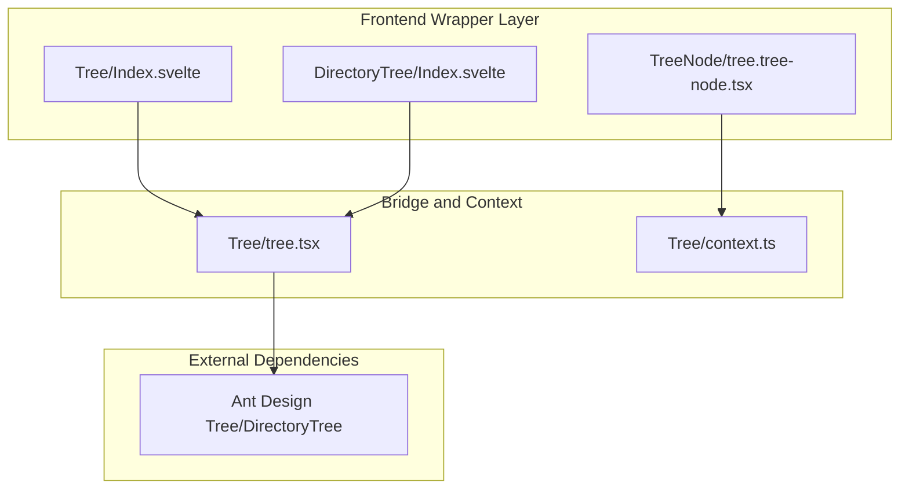
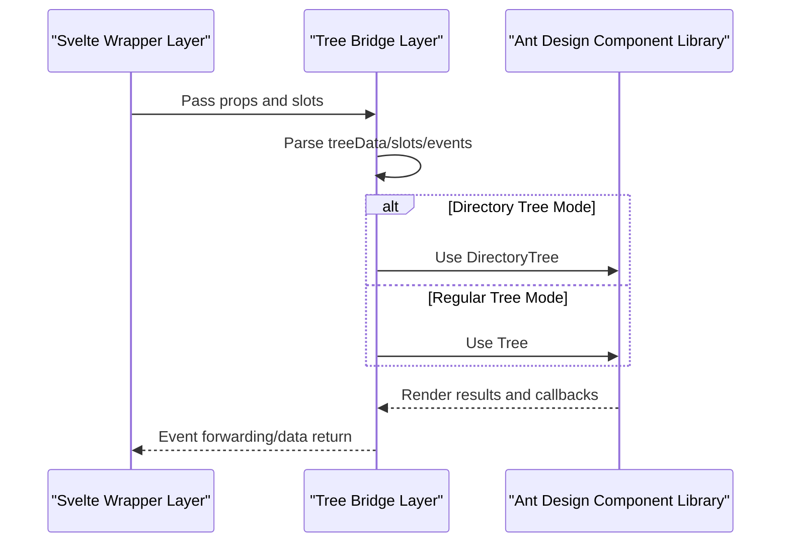
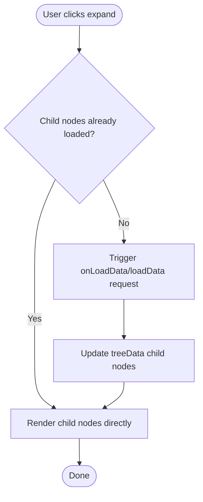
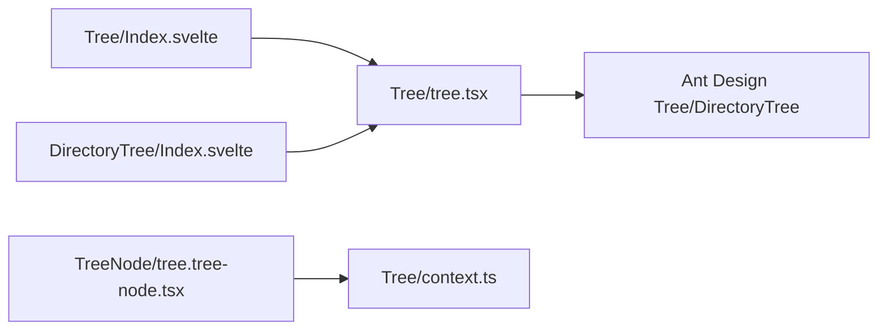

# Tree

<cite>
**Files Referenced in This Document**
- [tree.tsx](file://frontend/antd/tree/tree.tsx)
- [Index.svelte](file://frontend/antd/tree/Index.svelte)
- [context.ts](file://frontend/antd/tree/context.ts)
- [tree.tree-node.tsx](file://frontend/antd/tree/tree-node/tree.tree-node.tsx)
- [directory-tree/Index.svelte](file://frontend/antd/tree/directory-tree/Index.svelte)
- [folder.tsx](file://frontend/antdx/folder/folder.tsx)
- [context.ts (folder context)](file://frontend/antdx/folder/context.ts)
</cite>

## Table of Contents

1. [Introduction](#introduction)
2. [Project Structure](#project-structure)
3. [Core Components](#core-components)
4. [Architecture Overview](#architecture-overview)
5. [Detailed Component Analysis](#detailed-component-analysis)
6. [Dependency Analysis](#dependency-analysis)
7. [Performance Considerations](#performance-considerations)
8. [Troubleshooting Guide](#troubleshooting-guide)
9. [Conclusion](#conclusion)
10. [Appendix](#appendix)

## Introduction

This document systematically reviews the design and implementation of the **Tree** component, covering its basic structure, node expand/collapse, DirectoryTree special capabilities, asynchronous data source loading, selection modes and multi-select/half-select, disabled configuration, search filtering, node dragging, right-click context menu, batch operations, virtual scrolling and large dataset optimization, dynamic CRUD operations, as well as typical applications and performance strategies in file management, organizational structures, and classification systems.

## Project Structure

The Tree component is composed of a Svelte frontend wrapper layer and a React component bridge layer, and supports declarative nesting and data injection for tree nodes via an "item context" mechanism. DirectoryTree, as a specialized form of Tree, reuses the same bridge layer and enables the directory tree component.

Diagram Source

- [Index.svelte:1-80](file://frontend/antd/tree/Index.svelte#L1-L80)
- [directory-tree/Index.svelte:1-83](file://frontend/antd/tree/directory-tree/Index.svelte#L1-L83)
- [tree.tree-node.tsx:1-22](file://frontend/antd/tree/tree-node/tree.tree-node.tsx#L1-L22)
- [tree.tsx:1-150](file://frontend/antd/tree/tree.tsx#L1-L150)
- [context.ts:1-7](file://frontend/antd/tree/context.ts#L1-L7)

Section Source

- [Index.svelte:1-80](file://frontend/antd/tree/Index.svelte#L1-L80)
- [directory-tree/Index.svelte:1-83](file://frontend/antd/tree/directory-tree/Index.svelte#L1-L83)
- [tree.tsx:1-150](file://frontend/antd/tree/tree.tsx#L1-L150)
- [context.ts:1-7](file://frontend/antd/tree/context.ts#L1-L7)

## Core Components

- Tree Wrapper: responsible for bridging Ant Design's Tree/DirectoryTree to the Svelte ecosystem, supporting slot extension, event forwarding, async loading, dragging, and title rendering.
- Tree Node: injects child nodes via ItemHandler as "default" slots, forming a tree structure.
- DirectoryTree: enables directory tree mode on top of Tree, providing folder-style interaction and behavior.
- Item Context: uniformly manages the collection and injection of "items" such as tree nodes and directory icons.

Section Source

- [tree.tsx:14-148](file://frontend/antd/tree/tree.tsx#L14-L148)
- [tree.tree-node.tsx:7-18](file://frontend/antd/tree/tree-node/tree.tree-node.tsx#L7-L18)
- [directory-tree/Index.svelte:65-82](file://frontend/antd/tree/directory-tree/Index.svelte#L65-L82)
- [context.ts:3-4](file://frontend/antd/tree/context.ts#L3-L4)

## Architecture Overview

The following diagram shows the call chain from Svelte to React, as well as the switching logic between DirectoryTree and regular Tree.

Diagram Source

- [tree.tsx:52-115](file://frontend/antd/tree/tree.tsx#L52-L115)
- [Index.svelte:67-78](file://frontend/antd/tree/Index.svelte#L67-L78)
- [directory-tree/Index.svelte:66-81](file://frontend/antd/tree/directory-tree/Index.svelte#L66-L81)

## Detailed Component Analysis

### Basic Structure and Data Model

- Data Source Origins
  - Explicit treeData: directly pass the tree node array required by AntD.
  - Slot treeData/default: collect child nodes via item context, automatically converting to treeData.
- Key Fields
  - Identification and hierarchy: key/value/title etc. used for identification and display.
  - Expanded state: expandedKeys controls initial expansion; onExpand callback responds to user actions.
  - Selection and checking: selectedKeys/checkedKeys support single/multi-select; half-select is calculated via internal algorithm.
  - Disabled: disabled field disables node interaction.
- Slot Extensions
  - switcherIcon/switcherLoadingIcon: custom expand/loading icons.
  - showLine.showLeafIcon: custom connection line leaf icon.
  - icon: node icon.
  - draggable.icon/nodeDraggable: drag icon and node-level draggable toggle.
  - titleRender: custom title render function.

Section Source

- [tree.tsx:56-126](file://frontend/antd/tree/tree.tsx#L56-L126)
- [context.ts:3-4](file://frontend/antd/tree/context.ts#L3-L4)

### Expand/Collapse and Async Loading

- Expand/Collapse
  - Get the current expanded set via onExpand, and implement hierarchical expansion combined with treeData's children.
- Async Loading
  - Provide lazy loading hooks via loadData/onLoadData, requesting child node data on demand.
  - DirectoryTree mode also supports async loading, suitable for large directory scenarios.

Diagram Source

- [tree.tsx:114-114](file://frontend/antd/tree/tree.tsx#L114-L114)
- [tree.tsx:137-139](file://frontend/antd/tree/tree.tsx#L137-L139)

Section Source

- [tree.tsx:38-42](file://frontend/antd/tree/tree.tsx#L38-L42)
- [tree.tsx:114-114](file://frontend/antd/tree/tree.tsx#L114-L114)

### DirectoryTree Special Features

- Mode Switching
  - Toggle between Tree and DirectoryTree via the directory prop.
- Event Mapping
  - dragStart/dragEnter/dragOver/dragLeave/dragEnd: drag lifecycle events.
  - rightClick: right-click context menu trigger.
  - loadData: directory tree specific lazy loading hook.
- Folder Style
  - More aligned with file system browsing experience, supporting directory hierarchy and icon mapping.

Section Source

- [tree.tsx:52-52](file://frontend/antd/tree/tree.tsx#L52-L52)
- [directory-tree/Index.svelte:18-25](file://frontend/antd/tree/directory-tree/Index.svelte#L18-L25)
- [directory-tree/Index.svelte:50-58](file://frontend/antd/tree/directory-tree/Index.svelte#L50-L58)

### Selection Modes, Multi-select and Half-select

- Single-select/Multi-select
  - Implement single or multi-select via selectedKeys/onChange.
- Multi-select Linkage
  - Checking parent nodes affects child nodes; unchecking affects parent node state.
- Half-select State
  - When some child nodes are checked, the parent node shows a half-selected state for quick identification of partial selection.
- Disabled Nodes
  - The disabled field prevents nodes from being selected or checked.

Section Source

- [tree.tsx:134-142](file://frontend/antd/tree/tree.tsx#L134-L142)

### Search Filtering

- Filter Function
  - filterTreeNode accepts a node and input value, returning a boolean to decide whether to display.
- Practical Recommendations
  - Combine expanded state and highlight matching items to improve discoverability.

Section Source

- [tree.tsx:132-132](file://frontend/antd/tree/tree.tsx#L132-L132)

### Node Dragging

- Drag Toggle
  - draggable can be a boolean or object; nodeDraggable supports node-level draggable control.
- Icon Customization
  - draggable.icon customizes the drag handle icon.
- Event Forwarding
  - dragStart/dragEnd etc. events are triggered by the underlying component for business layer integration.

Section Source

- [tree.tsx:102-112](file://frontend/antd/tree/tree.tsx#L102-L112)
- [tree.tsx:48-50](file://frontend/antd/tree/tree.tsx#L48-L50)

### Right-click Context Menu and Batch Operations

- Right-click Context Menu
  - rightClick event can be used to pop up a context menu.
- Batch Operations
  - Combine multi-select and right-click context menu for batch actions like copy, move, and delete.
- Safety
  - Intercept disabled nodes to prevent accidental operations.

Section Source

- [directory-tree/Index.svelte:23-23](file://frontend/antd/tree/directory-tree/Index.svelte#L23-L23)
- [tree.tsx:134-142](file://frontend/antd/tree/tree.tsx#L134-L142)

### Dynamic CRUD Operations

- Add/Modify
  - Update treeData or maintain selectedKeys/checkedKeys in controlled mode.
- Delete
  - Remove the corresponding node and synchronize cleanup of selection state.
- Query
  - Link filterTreeNode with search input for instant filtering.

Section Source

- [tree.tsx:59-79](file://frontend/antd/tree/tree.tsx#L59-L79)

### Virtual Scrolling and Large Dataset Optimization

- Virtual Scrolling
  - Enabling virtual scrolling in super-large trees can significantly reduce DOM count and improve rendering performance.
- Other Optimizations
  - Lazy loading (loadData/onLoadData) renders only visible levels.
  - Use disabled and hidden nodes judiciously to reduce rendering burden.
  - Avoid frequent recalculation of treeData; use shallow comparison and caching where possible.

Section Source

- [tree.tsx:114-114](file://frontend/antd/tree/tree.tsx#L114-L114)

### Application Scenarios and Best Practices

- File Management
  - DirectoryTree + dragging + right-click context menu + async loading to build a file browser-like experience.
- Organizational Structure
  - Departments/teams as nodes, supporting collapse and search for easy navigation.
- Classification Systems
  - Multi-level classification tree, combined with half-select and batch operations to improve editing efficiency.

Section Source

- [directory-tree/Index.svelte:65-82](file://frontend/antd/tree/directory-tree/Index.svelte#L65-L82)
- [tree.tsx:52-52](file://frontend/antd/tree/tree.tsx#L52-L52)

## Dependency Analysis

- Component Coupling
  - Tree/Index.svelte and DirectoryTree/Index.svelte both depend on the Tree bridge layer.
  - Tree nodes inject into the context via ItemHandler, forming a tree structure.
- External Dependencies
  - Ant Design Tree/DirectoryTree provides core interaction and rendering.
- Slots and Events
  - High customizability is achieved through slots and event forwarding.

Diagram Source

- [Index.svelte:10-10](file://frontend/antd/tree/Index.svelte#L10-L10)
- [directory-tree/Index.svelte:10-10](file://frontend/antd/tree/directory-tree/Index.svelte#L10-L10)
- [tree.tsx:1-11](file://frontend/antd/tree/tree.tsx#L1-L11)
- [tree.tree-node.tsx:5-5](file://frontend/antd/tree/tree-node/tree.tree-node.tsx#L5-L5)
- [context.ts:3-4](file://frontend/antd/tree/context.ts#L3-L4)

Section Source

- [Index.svelte:1-80](file://frontend/antd/tree/Index.svelte#L1-L80)
- [directory-tree/Index.svelte:1-83](file://frontend/antd/tree/directory-tree/Index.svelte#L1-L83)
- [tree.tsx:1-150](file://frontend/antd/tree/tree.tsx#L1-L150)
- [tree.tree-node.tsx:1-22](file://frontend/antd/tree/tree-node/tree.tree-node.tsx#L1-L22)
- [context.ts:1-7](file://frontend/antd/tree/context.ts#L1-L7)

## Performance Considerations

- Rendering Optimization
  - Use virtual scrolling and lazy loading to avoid rendering a large number of nodes at once.
- Data Structure
  - Keep treeData flat and stable in reference to reduce unnecessary re-renders.
- Event Throttling
  - Throttle/debounce high-frequency events (such as drag and scroll).
- Selection and Half-select
  - Use checkedKeys and half-select state judiciously to avoid recursive calculations layer by layer.

## Troubleshooting Guide

- Cannot expand nodes
  - Check whether treeData's children are correctly set or whether async loading is implemented.
- Drag not working
  - Confirm that draggable is an object and includes nodeDraggable or that draggable.icon is correctly injected.
- Right-click context menu not appearing
  - Confirm that the rightClick event is bound and works in directory tree mode.
- Selection state anomaly
  - Check whether selectedKeys/checkedKeys are updated synchronously with treeData.

Section Source

- [tree.tsx:102-112](file://frontend/antd/tree/tree.tsx#L102-L112)
- [tree.tsx:134-142](file://frontend/antd/tree/tree.tsx#L134-L142)
- [directory-tree/Index.svelte:23-23](file://frontend/antd/tree/directory-tree/Index.svelte#L23-L23)

## Conclusion

This Tree component provides complete encapsulation of Ant Design Tree/DirectoryTree through the combination of a Svelte wrapper layer and React bridge layer, with good extensibility and customizability. Combined with async loading, virtual scrolling, and rich interaction capabilities, it is suitable for complex scenarios such as file management, organizational structures, and classification systems.

## Appendix

- Relationship Between DirectoryTree and Folder Component
  - DirectoryTree is used for the directory mode of the tree; the folder component (antdx/folder) provides richer file system capabilities (such as icon mapping and content services), and the two can be used complementarily.

Section Source

- [directory-tree/Index.svelte:65-82](file://frontend/antd/tree/directory-tree/Index.svelte#L65-L82)
- [folder.tsx:48-86](file://frontend/antdx/folder/folder.tsx#L48-L86)
- [context.ts (folder context):3-13](file://frontend/antdx/folder/context.ts#L3-L13)
