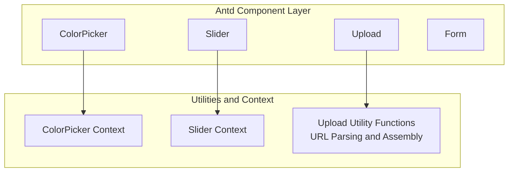
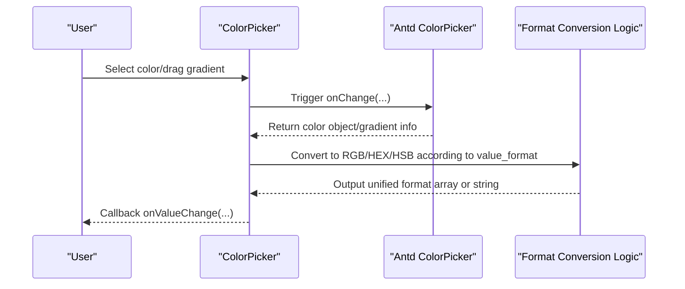
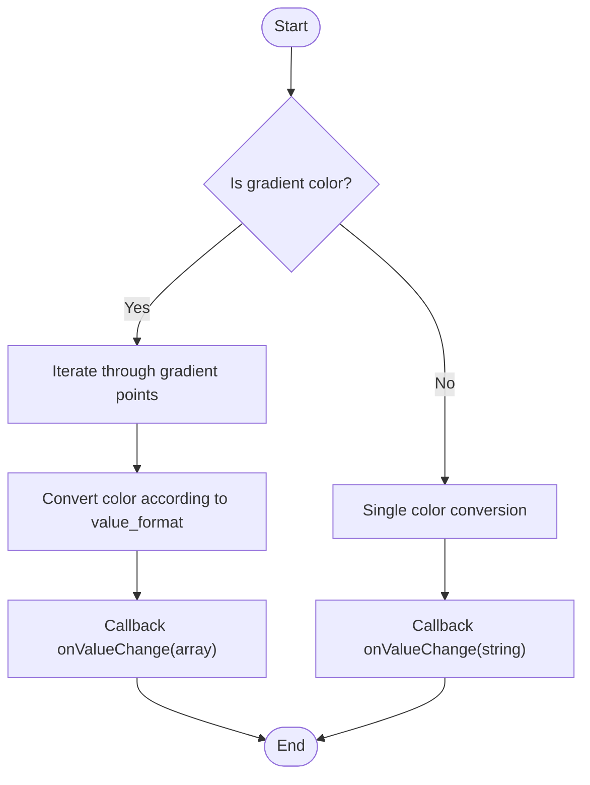
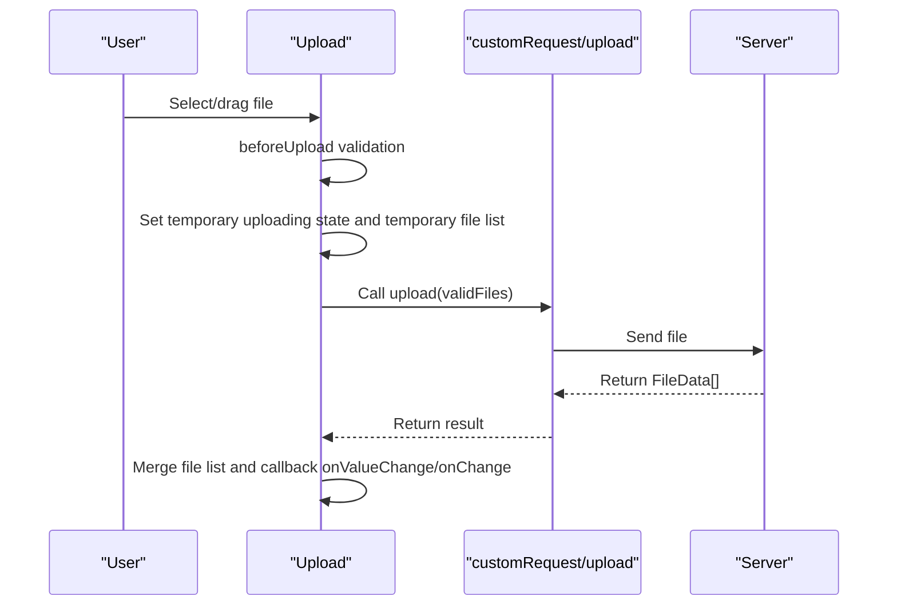
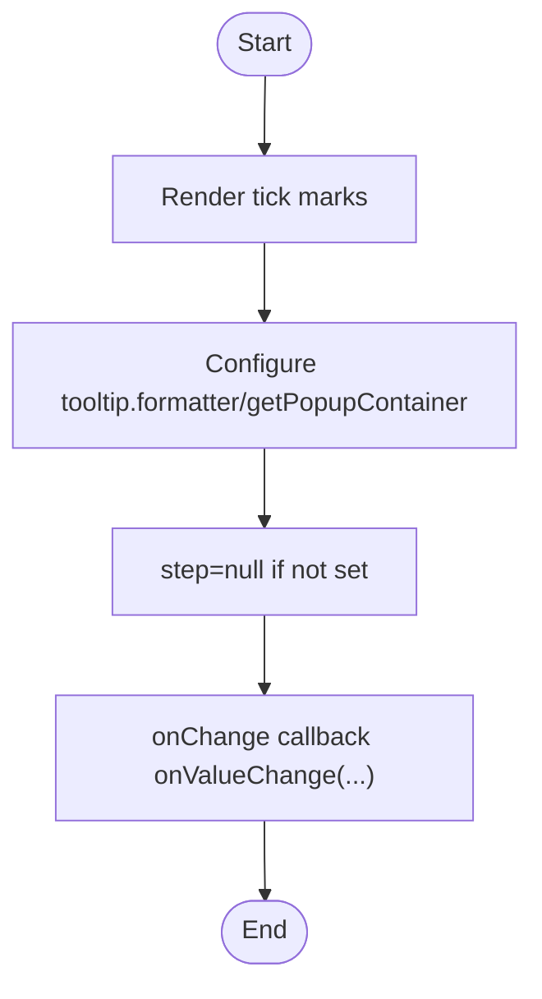
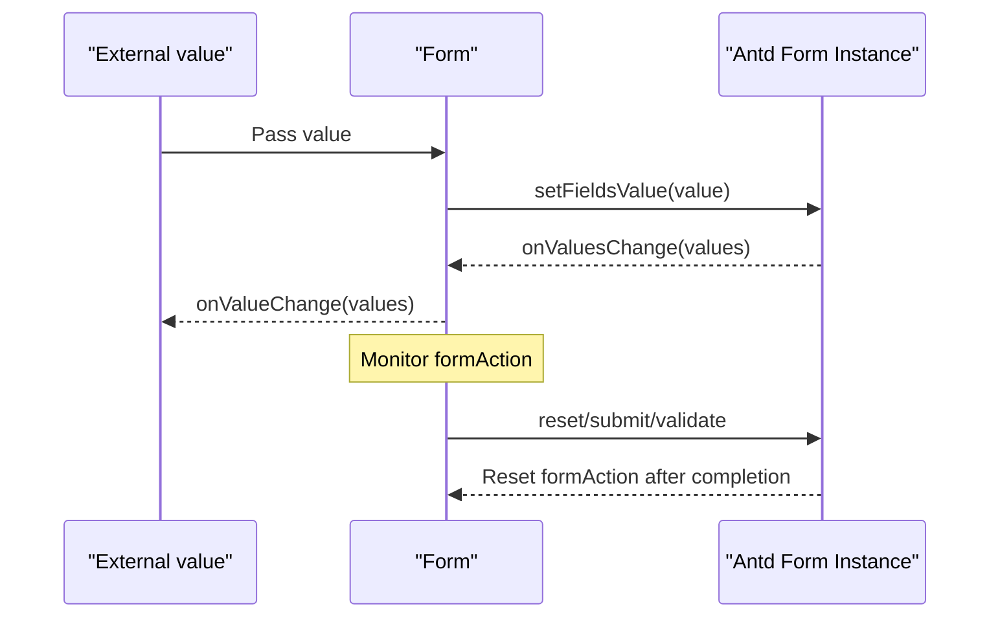
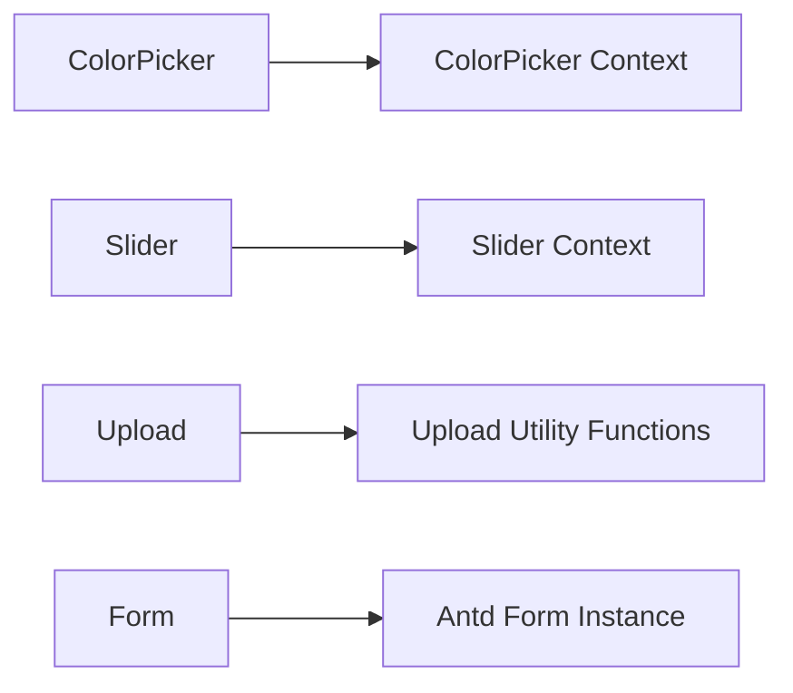

# Color and File Components

<cite>
**Files referenced in this document**
- [color-picker.tsx](file://frontend/antd/color-picker/color-picker.tsx)
- [context.ts (ColorPicker)](file://frontend/antd/color-picker/context.ts)
- [upload.tsx](file://frontend/antd/upload/upload.tsx)
- [upload.ts (utility functions)](file://frontend/utils/upload.ts)
- [slider.tsx](file://frontend/antd/slider/slider.tsx)
- [context.ts (Slider)](file://frontend/antd/slider/context.ts)
- [form.tsx](file://frontend/antd/form/form.tsx)
- [README.md (ColorPicker docs)](file://docs/components/antd/color_picker/README.md)
- [README.md (Upload docs)](file://docs/components/antd/upload/README.md)
- [README.md (Slider docs)](file://docs/components/antd/slider/README.md)
- [README.md (Form docs)](file://docs/components/antd/form/README.md)
</cite>

## Table of Contents

1. [Introduction](#introduction)
2. [Project Structure](#project-structure)
3. [Core Components](#core-components)
4. [Architecture Overview](#architecture-overview)
5. [Detailed Component Analysis](#detailed-component-analysis)
6. [Dependency Analysis](#dependency-analysis)
7. [Performance Considerations](#performance-considerations)
8. [Troubleshooting Guide](#troubleshooting-guide)
9. [Conclusion](#conclusion)
10. [Appendix](#appendix)

## Introduction

This document focuses on color, file, and advanced input components: ColorPicker, Upload, Slider, and Form. Content covers:

- Color format conversion (RGB, HEX, HSB), gradient color handling and preset palettes
- Upload configuration, drag-and-drop upload, file preview, progress display and error handling
- Overall form design patterns, field validation, dynamic forms and nested forms
- Accessibility and keyboard navigation support
- Performance optimization strategies such as large file handling, concurrent uploads, and error retry
- Data flow management and best practices for complex form scenarios

## Project Structure

These components are located in the frontend Svelte + Ant Design ecosystem, bridging Ant Design components for Svelte use via sveltify, and encapsulating state and callbacks where necessary to adapt to the Gradio data domain.

Diagram Source

- [color-picker.tsx:1-106](file://frontend/antd/color-picker/color-picker.tsx#L1-L106)
- [upload.tsx:1-282](file://frontend/antd/upload/upload.tsx#L1-L282)
- [slider.tsx:1-97](file://frontend/antd/slider/slider.tsx#L1-L97)
- [form.tsx:1-79](file://frontend/antd/form/form.tsx#L1-L79)

Section Source

- [color-picker.tsx:1-106](file://frontend/antd/color-picker/color-picker.tsx#L1-L106)
- [upload.tsx:1-282](file://frontend/antd/upload/upload.tsx#L1-L282)
- [slider.tsx:1-97](file://frontend/antd/slider/slider.tsx#L1-L97)
- [form.tsx:1-79](file://frontend/antd/form/form.tsx#L1-L79)

## Core Components

- ColorPicker
  - Supports RGB/HEX/HSB three color format outputs
  - Gradient color parsing and multi-point color mapping
  - Preset palette rendering and custom panel/text slots
- Upload
  - Custom request hook and progress formatting
  - File list normalization, maximum count control
  - Drag-and-drop/click upload, preview and icon rendering slots
- Slider
  - Tick mark rendering (supports label slots)
  - Step and tooltip container customization
- Form
  - Value domain binding and change notification
  - Manually trigger reset/submit/validate actions
  - Required mark and feedback icon slots

Section Source

- [color-picker.tsx:11-103](file://frontend/antd/color-picker/color-picker.tsx#L11-L103)
- [upload.tsx:21-279](file://frontend/antd/upload/upload.tsx#L21-L279)
- [slider.tsx:37-94](file://frontend/antd/slider/slider.tsx#L37-L94)
- [form.tsx:15-76](file://frontend/antd/form/form.tsx#L15-L76)

## Architecture Overview

Components use a "bridge + decoration" architecture: with Ant Design native components as the core, wrapped via sveltify and injected with value change callbacks, slot rendering, and context injection to achieve seamless integration with the Gradio data domain.

Diagram Source

- [color-picker.tsx:71-95](file://frontend/antd/color-picker/color-picker.tsx#L71-L95)

Section Source

- [color-picker.tsx:1-106](file://frontend/antd/color-picker/color-picker.tsx#L1-L106)

## Detailed Component Analysis

### ColorPicker

- Key features
  - Color format conversion: one of RGB/HEX/HSB, output according to value_format
  - Gradient color handling: iterate through gradient points, convert each to the specified format and return as array
  - Preset palette: supports passing presets or injecting via context
  - Slot extension: slot-based rendering for panelRender and showText
- Key flow

Diagram Source

- [color-picker.tsx:71-95](file://frontend/antd/color-picker/color-picker.tsx#L71-L95)

- Context and preset palette
  - Inject marks/presets and other item sets via createItemsContext
  - Preset palette prefers externally passed values; otherwise renders from context

- Accessibility and keyboard navigation
  - Based on Ant Design native component, follows its accessibility specifications
  - Recommended to supplement aria-label, aria-describedby and other attributes on the business side

Section Source

- [color-picker.tsx:1-106](file://frontend/antd/color-picker/color-picker.tsx#L1-L106)
- [context.ts (ColorPicker):1-7](file://frontend/antd/color-picker/context.ts#L1-L7)
- [README.md (ColorPicker docs):1-9](file://docs/components/antd/color_picker/README.md#L1-L9)

### Upload

- Key features
  - Custom upload: upload(files) -> Promise<FileData[]>
  - File list normalization: converts non-UploadFile forms to UploadFile structure
  - Maximum count control: when maxCount=1, replace; otherwise append
  - Progress and icons: supports custom progress formatting and icon rendering slots
  - Preview and image recognition: custom previewFile/isImageUrl
- Key flow

Diagram Source

- [upload.tsx:147-227](file://frontend/antd/upload/upload.tsx#L147-L227)

- Utility functions: URL retrieval
  - getFetchableUrl: concatenates relative paths to accessible URLs
  - getFileUrl: returns a usable URL based on FileData/string/other types

- Performance and reliability
  - Disables interaction during upload to avoid repeated triggering
  - Temporary file list improves user experience, replaced by real results after completion
  - Restores uploading state after error capture

Section Source

- [upload.tsx:1-282](file://frontend/antd/upload/upload.tsx#L1-L282)
- [upload.ts (utility functions):1-45](file://frontend/utils/upload.ts#L1-L45)
- [README.md (Upload docs):1-9](file://docs/components/antd/upload/README.md#L1-L9)

### Slider

- Key features
  - Tick mark rendering: supports label/children slots and property forwarding
  - Tooltip container and formatting: tooltip.formatter and getPopupContainer
  - Step control: explicitly pass null for step when not set
- Key flow

Diagram Source

- [slider.tsx:68-89](file://frontend/antd/slider/slider.tsx#L68-L89)

Section Source

- [slider.tsx:1-97](file://frontend/antd/slider/slider.tsx#L1-L97)
- [context.ts (Slider):1-7](file://frontend/antd/slider/context.ts#L1-L7)
- [README.md (Slider docs):1-9](file://docs/components/antd/slider/README.md#L1-L9)

### Form

- Key features
  - Value domain binding: value -> setFieldsValue; onValuesChange -> onValueChange
  - Form actions: trigger corresponding behavior via formAction='reset'|'submit'|'validate'
  - Slots: requiredMark, feedbackIcons
- Key flow

Diagram Source

- [form.tsx:32-45](file://frontend/antd/form/form.tsx#L32-L45)

Section Source

- [form.tsx:1-79](file://frontend/antd/form/form.tsx#L1-L79)
- [README.md (Form docs):1-14](file://docs/components/antd/form/README.md#L1-L14)

## Dependency Analysis

- Inter-component coupling
  - ColorPicker/Slider inject item sets via their respective Items contexts, reducing coupling with external data
  - Upload relies on utility functions for URL parsing, avoiding scattered logic within the component
  - Form only handles bridging and action dispatching, without directly processing business data
- External dependencies
  - Ant Design native components as the base UI
  - Gradio client types (FileData) for the upload data domain

Diagram Source

- [color-picker.tsx:1-106](file://frontend/antd/color-picker/color-picker.tsx#L1-L106)
- [slider.tsx:1-97](file://frontend/antd/slider/slider.tsx#L1-L97)
- [upload.tsx:1-282](file://frontend/antd/upload/upload.tsx#L1-L282)
- [form.tsx:1-79](file://frontend/antd/form/form.tsx#L1-L79)

Section Source

- [color-picker.tsx:1-106](file://frontend/antd/color-picker/color-picker.tsx#L1-L106)
- [slider.tsx:1-97](file://frontend/antd/slider/slider.tsx#L1-L97)
- [upload.tsx:1-282](file://frontend/antd/upload/upload.tsx#L1-L282)
- [form.tsx:1-79](file://frontend/antd/form/form.tsx#L1-L79)

## Performance Considerations

- ColorPicker
  - Gradient color conversion is completed in onChange to avoid additional rendering overhead
  - Preset palette caches rendering results via useMemo
- Upload
  - Temporary file list reduces UI jitter
  - Disables interaction during upload to prevent concurrent submissions
  - Supports custom progress formatting to avoid frequent redraws
- Slider
  - Tick marks are rendered on demand to reduce DOM nodes
  - step is explicitly passed as null to avoid invalid computation
- Form
  - Value changes are only called back in onValuesChange to avoid full synchronization

[This section provides general performance recommendations and does not require specific file references]

## Troubleshooting Guide

- ColorPicker
  - If gradient colors are not correctly converted, check whether value_format is consistent with the expectation
  - If the preset palette is not displayed, confirm whether context injection or presets property is correctly passed in
- Upload
  - Cannot upload: confirm that the upload function's return value is consistent with the FileData structure
  - Progress not updating: check whether progress.format is correctly passed in
  - Icon/preview anomaly: verify iconRender/itemRender slots and custom functions
- Slider
  - Tick marks not displayed: confirm whether marks or context items are correctly injected
  - Step invalid: ensure step has not been overridden to undefined
- Form
  - Values not syncing: confirm whether two-way binding of value and onValueChange is effective
  - Action invalid: check whether formAction has been reset to null

Section Source

- [color-picker.tsx:1-106](file://frontend/antd/color-picker/color-picker.tsx#L1-L106)
- [upload.tsx:1-282](file://frontend/antd/upload/upload.tsx#L1-L282)
- [slider.tsx:1-97](file://frontend/antd/slider/slider.tsx#L1-L97)
- [form.tsx:1-79](file://frontend/antd/form/form.tsx#L1-L79)

## Conclusion

The above components are built on Ant Design, combined with context injection and utility functions, to achieve high-performance, extensible and maintainable advanced input capabilities. Through a unified value change callback and slot mechanism, they can meet the needs of complex forms and file handling scenarios. It is recommended to combine error boundaries, loading states, and accessibility attributes in actual projects to further improve stability and user experience.

[This section is a summary and does not require specific file references]

## Appendix

- Examples and documentation entry points
  - ColorPicker: see examples and descriptions in the docs directory
  - Upload: see examples and descriptions in the docs directory
  - Slider: see examples and descriptions in the docs directory
  - Form: see examples and descriptions in the docs directory

Section Source

- [README.md (ColorPicker docs):1-9](file://docs/components/antd/color_picker/README.md#L1-L9)
- [README.md (Upload docs):1-9](file://docs/components/antd/upload/README.md#L1-L9)
- [README.md (Slider docs):1-9](file://docs/components/antd/slider/README.md#L1-L9)
- [README.md (Form docs):1-14](file://docs/components/antd/form/README.md#L1-L14)
