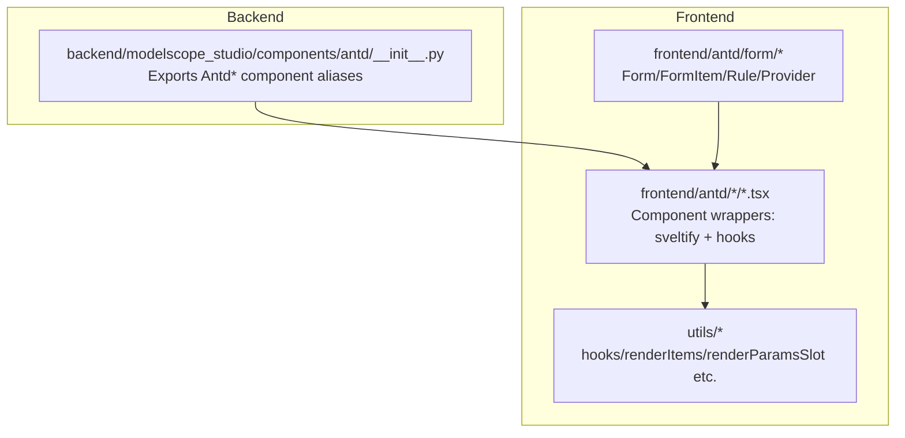
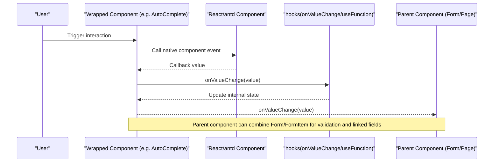
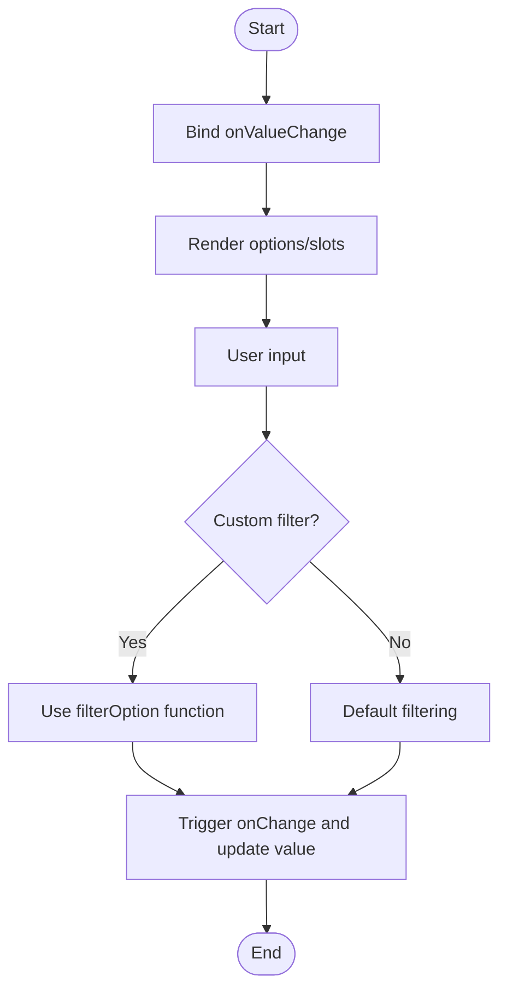
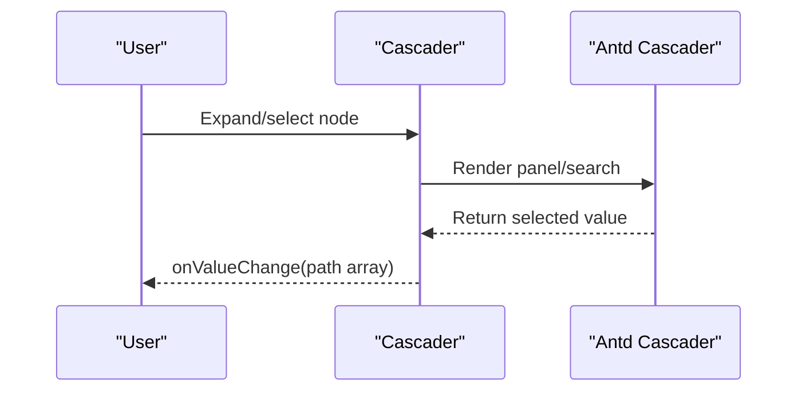
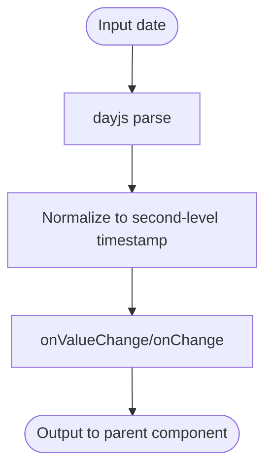
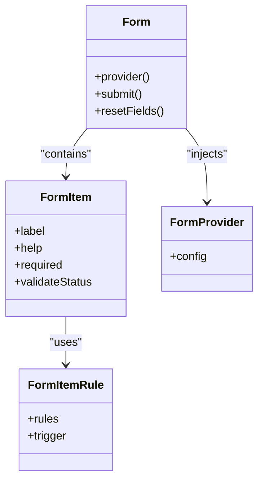
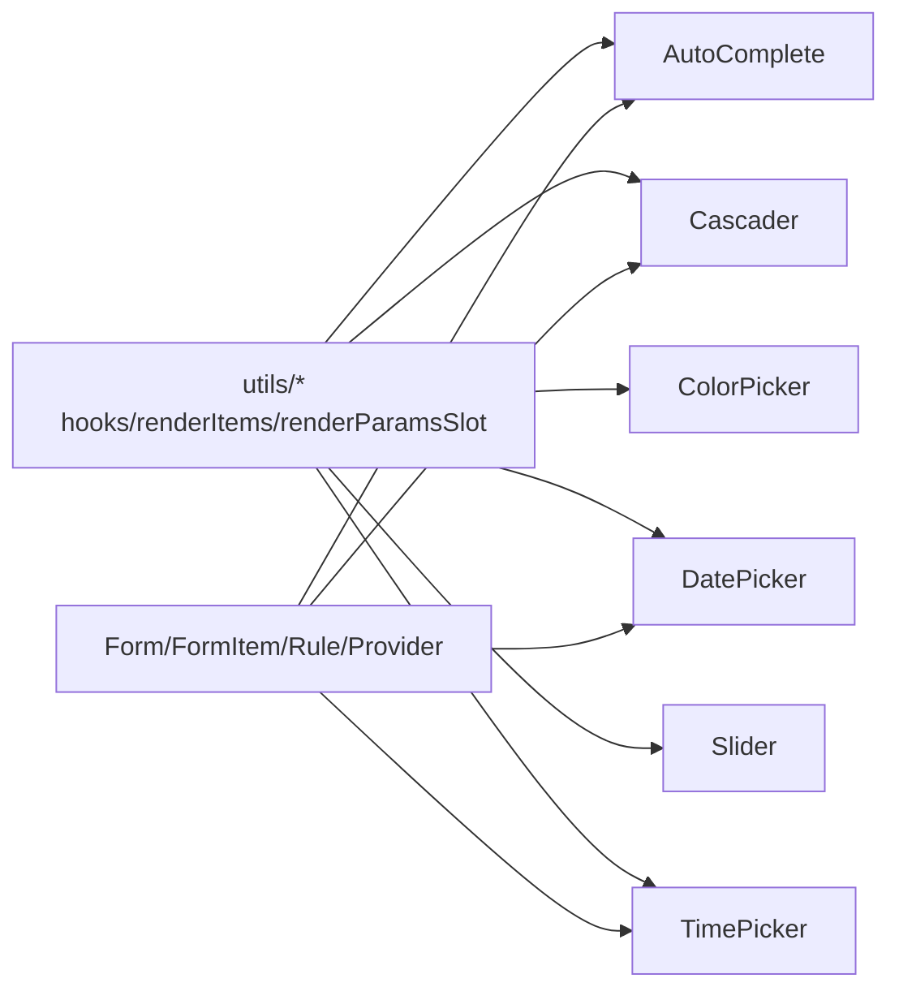
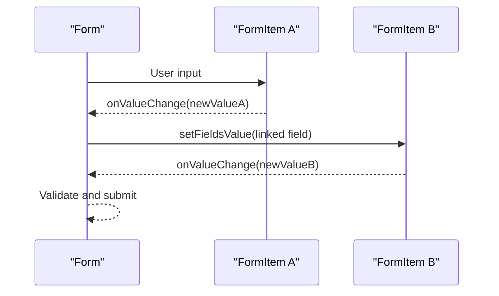

# Data Entry Components

<cite>
**Files referenced in this document**
- [backend/modelscope_studio/components/antd/__init__.py](file://backend/modelscope_studio/components/antd/__init__.py)
- [frontend/antd/auto-complete/auto-complete.tsx](file://frontend/antd/auto-complete/auto-complete.tsx)
- [frontend/antd/cascader/cascader.tsx](file://frontend/antd/cascader/cascader.tsx)
- [frontend/antd/checkbox/checkbox.tsx](file://frontend/antd/checkbox/checkbox.tsx)
- [frontend/antd/color-picker/color-picker.tsx](file://frontend/antd/color-picker/color-picker.tsx)
- [frontend/antd/date-picker/date-picker.tsx](file://frontend/antd/date-picker/date-picker.tsx)
- [frontend/antd/radio/radio.tsx](file://frontend/antd/radio/radio.tsx)
- [frontend/antd/rate/rate.tsx](file://frontend/antd/rate/rate.tsx)
- [frontend/antd/slider/slider.tsx](file://frontend/antd/slider/slider.tsx)
- [frontend/antd/switch/switch.tsx](file://frontend/antd/switch/switch.tsx)
- [frontend/antd/time-picker/time-picker.tsx](file://frontend/antd/time-picker/time-picker.tsx)
- [frontend/antd/form/form.tsx](file://frontend/antd/form/form.tsx)
- [frontend/antd/form/item/form.item.tsx](file://frontend/antd/form/item/form.item.tsx)
- [frontend/antd/form/item/rule/form.item.rule.tsx](file://frontend/antd/form/item/rule/form.item.rule.tsx)
- [frontend/antd/form/provider/form.provider.tsx](file://frontend/antd/form/provider/form.provider.tsx)
- [frontend/antd/input/input.tsx](file://frontend/antd/input/input.tsx)
- [frontend/antd/input/otp/input.otp.tsx](file://frontend/antd/input/otp/input.otp.tsx)
- [frontend/antd/input/password/input.password.tsx](file://frontend/antd/input/password/input.password.tsx)
- [frontend/antd/input/search/input.search.tsx](file://frontend/antd/input/search/input.search.tsx)
- [frontend/antd/input/textarea/input.textarea.tsx](file://frontend/antd/input/textarea/input.textarea.tsx)
- [frontend/antd/input-number/input-number.tsx](file://frontend/antd/input-number/input-number.tsx)
- [frontend/antd/select/select.tsx](file://frontend/antd/select/select.tsx)
- [frontend/antd/select/option/select.option.tsx](file://frontend/antd/select/option/select.option.tsx)
- [frontend/antd/transfer/transfer.tsx](file://frontend/antd/transfer/transfer.tsx)
- [frontend/antd/tree-select/tree-select.tsx](file://frontend/antd/tree-select/tree-select.tsx)
- [frontend/antd/upload/upload.tsx](file://frontend/antd/upload/upload.tsx)
</cite>

## Table of Contents

1. [Introduction](#introduction)
2. [Project Structure](#project-structure)
3. [Core Components](#core-components)
4. [Architecture Overview](#architecture-overview)
5. [Component Details](#component-details)
6. [Dependency Analysis](#dependency-analysis)
7. [Performance and Large Data Optimization](#performance-and-large-data-optimization)
8. [Accessibility and Keyboard Navigation](#accessibility-and-keyboard-navigation)
9. [Complex Form Design Patterns and Data Flow](#complex-form-design-patterns-and-data-flow)
10. [Troubleshooting Guide](#troubleshooting-guide)
11. [Conclusion](#conclusion)

## Introduction

This document is intended for scenarios where Ant Design components are used for data entry in the frontend. It systematically covers the wrapping and usage of AutoComplete, Cascader, Checkbox, ColorPicker, DatePicker, Form, Input, InputNumber, Mentions, Radio, Rate, Select, Slider, Switch, TimePicker, Transfer, TreeSelect, Upload, and other components. Key areas covered include:

- Data binding: how to implement controlled/uncontrolled two-way binding via onValueChange
- Validation rules: combining Form.Item with FormItem.Rule
- Formatting options: internal format conversion and unified external output for date/time components
- Complex form design patterns: multi-step, linked fields, dynamic fields, conditional rendering
- Accessibility and keyboard navigation: semantic labels, focus management, keyboard navigation
- Performance optimization: virtual scrolling, lazy loading, debounce/throttle, batch updates

## Project Structure

This project uses a dual-layer architecture of "backend component export + frontend Svelte/React wrapping":

- The backend layer exports Ant Design components as Python classes, enabling unified invocation and documentation generation within the Python ecosystem
- The frontend layer is based on Svelte/React wrapping, providing slot injection, context injection, function hooks, value change bridging, and other capabilities to achieve a consistent API experience with the backend

Diagram Source

- [backend/modelscope_studio/components/antd/**init**.py:1-150](file://backend/modelscope_studio/components/antd/__init__.py#L1-L150)
- [frontend/antd/auto-complete/auto-complete.tsx:1-151](file://frontend/antd/auto-complete/auto-complete.tsx#L1-L151)
- [frontend/antd/form/form.tsx](file://frontend/antd/form/form.tsx)
- [frontend/antd/form/item/form.item.tsx](file://frontend/antd/form/item/form.item.tsx)
- [frontend/antd/form/item/rule/form.item.rule.tsx](file://frontend/antd/form/item/rule/form.item.rule.tsx)
- [frontend/antd/form/provider/form.provider.tsx](file://frontend/antd/form/provider/form.provider.tsx)

Section Source

- [backend/modelscope_studio/components/antd/**init**.py:1-150](file://backend/modelscope_studio/components/antd/__init__.py#L1-L150)

## Core Components

This section gives an overview of the components covered in this document and their responsibilities:

- Form system: Form, FormItem, FormItem.Rule, FormProvider
- Input types: Input, Input.TextArea, Input.Search, Input.Password, Input.OTP, InputNumber
- Selection types: Select, Select.Option, Cascader, TreeSelect, Transfer
- Date/time types: DatePicker, TimePicker
- Slider and rating: Slider, Rate
- Toggle and selection: Switch, Radio, Checkbox
- Color: ColorPicker
- Mentions: Mentions (supports keyword mentions and dynamic rendering of options, including the Option sub-component)

Section Source

- [frontend/antd/form/form.tsx](file://frontend/antd/form/form.tsx)
- [frontend/antd/form/item/form.item.tsx](file://frontend/antd/form/item/form.item.tsx)
- [frontend/antd/form/item/rule/form.item.rule.tsx](file://frontend/antd/form/item/rule/form.item.rule.tsx)
- [frontend/antd/form/provider/form.provider.tsx](file://frontend/antd/form/provider/form.provider.tsx)
- [frontend/antd/input/input.tsx](file://frontend/antd/input/input.tsx)
- [frontend/antd/input/otp/input.otp.tsx](file://frontend/antd/input/otp/input.otp.tsx)
- [frontend/antd/input/password/input.password.tsx](file://frontend/antd/input/password/input.password.tsx)
- [frontend/antd/input/search/input.search.tsx](file://frontend/antd/input/search/input.search.tsx)
- [frontend/antd/input/textarea/input.textarea.tsx](file://frontend/antd/input/textarea/input.textarea.tsx)
- [frontend/antd/input-number/input-number.tsx](file://frontend/antd/input-number/input-number.tsx)
- [frontend/antd/select/select.tsx](file://frontend/antd/select/select.tsx)
- [frontend/antd/select/option/select.option.tsx](file://frontend/antd/select/option/select.option.tsx)
- [frontend/antd/cascader/cascader.tsx](file://frontend/antd/cascader/cascader.tsx)
- [frontend/antd/tree-select/tree-select.tsx](file://frontend/antd/tree-select/tree-select.tsx)
- [frontend/antd/transfer/transfer.tsx](file://frontend/antd/transfer/transfer.tsx)
- [frontend/antd/date-picker/date-picker.tsx](file://frontend/antd/date-picker/date-picker.tsx)
- [frontend/antd/time-picker/time-picker.tsx](file://frontend/antd/time-picker/time-picker.tsx)
- [frontend/antd/slider/slider.tsx](file://frontend/antd/slider/slider.tsx)
- [frontend/antd/rate/rate.tsx](file://frontend/antd/rate/rate.tsx)
- [frontend/antd/switch/switch.tsx](file://frontend/antd/switch/switch.tsx)
- [frontend/antd/radio/radio.tsx](file://frontend/antd/radio/radio.tsx)
- [frontend/antd/checkbox/checkbox.tsx](file://frontend/antd/checkbox/checkbox.tsx)
- [frontend/antd/color-picker/color-picker.tsx](file://frontend/antd/color-picker/color-picker.tsx)

## Architecture Overview

Frontend components universally use sveltify to wrap Ant Design native components, and complete the following via hooks:

- Value change bridging: useValueChange bridges onChange and onValueChange to ensure the external side consistently receives value
- Function parameterization: useFunction wraps incoming functions as stable references to avoid closure traps
- Slot rendering: renderItems/renderParamsSlot support flexible combinations of children and slots
- Context injection: withItemsContextProvider injects items into child components (such as Option/Marks/Preset)

Diagram Source

- [frontend/antd/auto-complete/auto-complete.tsx:32-148](file://frontend/antd/auto-complete/auto-complete.tsx#L32-L148)
- [frontend/antd/cascader/cascader.tsx:39-204](file://frontend/antd/cascader/cascader.tsx#L39-L204)
- [frontend/antd/checkbox/checkbox.tsx:4-19](file://frontend/antd/checkbox/checkbox.tsx#L4-L19)
- [frontend/antd/color-picker/color-picker.tsx:24-103](file://frontend/antd/color-picker/color-picker.tsx#L24-L103)
- [frontend/antd/date-picker/date-picker.tsx:40-231](file://frontend/antd/date-picker/date-picker.tsx#L40-L231)
- [frontend/antd/radio/radio.tsx:6-29](file://frontend/antd/radio/radio.tsx#L6-L29)
- [frontend/antd/rate/rate.tsx:12-42](file://frontend/antd/rate/rate.tsx#L12-L42)
- [frontend/antd/slider/slider.tsx:37-94](file://frontend/antd/slider/slider.tsx#L37-L94)
- [frontend/antd/switch/switch.tsx:6-39](file://frontend/antd/switch/switch.tsx#L6-L39)
- [frontend/antd/time-picker/time-picker.tsx:37-198](file://frontend/antd/time-picker/time-picker.tsx#L37-L198)

## Component Details

### AutoComplete

- Data binding: receives string value via onValueChange; onChange passes through native callback
- Slots: supports children, dropdownRender, popupRender, notFoundContent, allowClear.clearIcon
- Options: supports rendering via options or slots.children
- Filtering: filterOption can customize filter logic or use default behavior

Diagram Source

- [frontend/antd/auto-complete/auto-complete.tsx:32-148](file://frontend/antd/auto-complete/auto-complete.tsx#L32-L148)

Section Source

- [frontend/antd/auto-complete/auto-complete.tsx:1-151](file://frontend/antd/auto-complete/auto-complete.tsx#L1-L151)

### Cascader

- Data binding: onValueChange receives an array (path value); onChange passes through
- Slots: suffixIcon, prefix, removeIcon, expandIcon, displayRender, tagRender, dropdownRender, popupRender, showSearch.render, maxTagPlaceholder
- Search: showSearch supports object configuration and slot rendering
- Dynamic loading: onLoadData corresponds to native loadData

Diagram Source

- [frontend/antd/cascader/cascader.tsx:19-204](file://frontend/antd/cascader/cascader.tsx#L19-L204)

Section Source

- [frontend/antd/cascader/cascader.tsx:1-207](file://frontend/antd/cascader/cascader.tsx#L1-L207)

### Checkbox

- Data binding: onValueChange receives a boolean value
- Events: onChange passes through native event

Section Source

- [frontend/antd/checkbox/checkbox.tsx:1-22](file://frontend/antd/checkbox/checkbox.tsx#L1-L22)

### ColorPicker

- Data binding: onValueChange receives a string or gradient color array; value_format controls the output format (rgb/hex/hsb)
- Slots: panelRender, showText
- Gradient: when isGradient(), outputs each color segment according to value_format

Section Source

- [frontend/antd/color-picker/color-picker.tsx:1-106](file://frontend/antd/color-picker/color-picker.tsx#L1-L106)

### DatePicker

- Data binding: onValueChange receives a second-level timestamp (including array scenario); onChange/onPanelChange passes through
- Internal format: unified dayjs conversion, external output as second-level timestamp
- Slots: renderExtraFooter, cellRender, panelRender, prevIcon/prefix/nextIcon/suffixIcon/superNextIcon/superPrevIcon, allowClear.clearIcon
- Presets: presets are rendered via renderItems

Diagram Source

- [frontend/antd/date-picker/date-picker.tsx:14-38](file://frontend/antd/date-picker/date-picker.tsx#L14-L38)
- [frontend/antd/date-picker/date-picker.tsx:126-170](file://frontend/antd/date-picker/date-picker.tsx#L126-L170)

Section Source

- [frontend/antd/date-picker/date-picker.tsx:1-234](file://frontend/antd/date-picker/date-picker.tsx#L1-L234)

### Form / FormItem / FormItem.Rule / FormProvider

- Form: container that provides Provider injection and layout capability
- FormItem: field container holding label, help, required, validateStatus, etc.
- FormItem.Rule: validation rules supporting required, regex, custom functions, async validation
- FormProvider: global configuration and context

Diagram Source

- [frontend/antd/form/form.tsx](file://frontend/antd/form/form.tsx)
- [frontend/antd/form/item/form.item.tsx](file://frontend/antd/form/item/form.item.tsx)
- [frontend/antd/form/item/rule/form.item.rule.tsx](file://frontend/antd/form/item/rule/form.item.rule.tsx)
- [frontend/antd/form/provider/form.provider.tsx](file://frontend/antd/form/provider/form.provider.tsx)

Section Source

- [frontend/antd/form/form.tsx](file://frontend/antd/form/form.tsx)
- [frontend/antd/form/item/form.item.tsx](file://frontend/antd/form/item/form.item.tsx)
- [frontend/antd/form/item/rule/form.item.rule.tsx](file://frontend/antd/form/item/rule/form.item.rule.tsx)
- [frontend/antd/form/provider/form.provider.tsx](file://frontend/antd/form/provider/form.provider.tsx)

### Input / TextArea / Search / Password / OTP

- Unified pattern: all receive the latest value via onValueChange; onChange passes through native event
- Extensions: Search, Password, OTP each provide specific behavior and styles

Section Source

- [frontend/antd/input/input.tsx](file://frontend/antd/input/input.tsx)
- [frontend/antd/input/otp/input.otp.tsx](file://frontend/antd/input/otp/input.otp.tsx)
- [frontend/antd/input/password/input.password.tsx](file://frontend/antd/input/password/input.password.tsx)
- [frontend/antd/input/search/input.search.tsx](file://frontend/antd/input/search/input.search.tsx)
- [frontend/antd/input/textarea/input.textarea.tsx](file://frontend/antd/input/textarea/input.textarea.tsx)

### InputNumber

- Data binding: onValueChange receives a numeric value; onChange passes through
- Use cases: step control, range, precision control

Section Source

- [frontend/antd/input-number/input-number.tsx](file://frontend/antd/input-number/input-number.tsx)

### Select / Option

- Data binding: onValueChange receives string/number/array; onChange passes through
- Sub-items: Option is injected via renderItems, supporting disabled, grouping, etc.

Section Source

- [frontend/antd/select/select.tsx](file://frontend/antd/select/select.tsx)
- [frontend/antd/select/option/select.option.tsx](file://frontend/antd/select/option/select.option.tsx)

### Slider / Marks

- Data binding: onValueChange receives number or number[]; onChange passes through
- Marks: rendered via slots.children or slots.label

Section Source

- [frontend/antd/slider/slider.tsx:1-97](file://frontend/antd/slider/slider.tsx#L1-L97)

### Radio

- Data binding: onValueChange receives a boolean value; onChange passes through
- Theme: style variables injected via token.lineWidth

Section Source

- [frontend/antd/radio/radio.tsx:1-32](file://frontend/antd/radio/radio.tsx#L1-L32)

### Rate

- Data binding: onValueChange receives a numeric value; onChange passes through
- Slots: character supports custom rating icons

Section Source

- [frontend/antd/rate/rate.tsx:1-45](file://frontend/antd/rate/rate.tsx#L1-L45)

### Switch

- Data binding: onValueChange receives a boolean value; onChange passes through
- Slots: checkedChildren, unCheckedChildren

Section Source

- [frontend/antd/switch/switch.tsx:1-42](file://frontend/antd/switch/switch.tsx#L1-L42)

### TimePicker

- Data binding: onValueChange receives a second-level timestamp; onChange/onPanelChange/onCalendarChange passes through
- Internal format: unified dayjs conversion

Section Source

- [frontend/antd/time-picker/time-picker.tsx:1-201](file://frontend/antd/time-picker/time-picker.tsx#L1-L201)

### Transfer

- Data binding: onValueChange receives target list key values; onChange passes through
- Use cases: multi-select move, sorting, search

Section Source

- [frontend/antd/transfer/transfer.tsx](file://frontend/antd/transfer/transfer.tsx)

### TreeSelect

- Data binding: onValueChange receives string/array; onChange passes through
- Sub-items: TreeNode is injected via renderItems

Section Source

- [frontend/antd/tree-select/tree-select.tsx](file://frontend/antd/tree-select/tree-select.tsx)

### Upload

- Data binding: onValueChange receives a file list; onChange passes through
- Use cases: drag and drop, preview, size/type restrictions

Section Source

- [frontend/antd/upload/upload.tsx](file://frontend/antd/upload/upload.tsx)

## Dependency Analysis

- Inter-component coupling: most components are decoupled through hooks and utility functions, reducing coupling to specific implementations
- Slots and context: withItemsContextProvider and renderItems allow child components to be uniformly injected and rendered
- Event bridging: useValueChange aligns onChange with onValueChange, ensuring parent components subscribe consistently

Diagram Source

- [frontend/antd/auto-complete/auto-complete.tsx:1-151](file://frontend/antd/auto-complete/auto-complete.tsx#L1-L151)
- [frontend/antd/cascader/cascader.tsx:1-207](file://frontend/antd/cascader/cascader.tsx#L1-L207)
- [frontend/antd/color-picker/color-picker.tsx:1-106](file://frontend/antd/color-picker/color-picker.tsx#L1-L106)
- [frontend/antd/date-picker/date-picker.tsx:1-234](file://frontend/antd/date-picker/date-picker.tsx#L1-L234)
- [frontend/antd/slider/slider.tsx:1-97](file://frontend/antd/slider/slider.tsx#L1-L97)
- [frontend/antd/time-picker/time-picker.tsx:1-201](file://frontend/antd/time-picker/time-picker.tsx#L1-L201)
- [frontend/antd/form/form.tsx](file://frontend/antd/form/form.tsx)
- [frontend/antd/form/item/form.item.tsx](file://frontend/antd/form/item/form.item.tsx)
- [frontend/antd/form/item/rule/form.item.rule.tsx](file://frontend/antd/form/item/rule/form.item.rule.tsx)
- [frontend/antd/form/provider/form.provider.tsx](file://frontend/antd/form/provider/form.provider.tsx)

## Performance and Large Data Optimization

- List rendering
  - Use virtual scrolling: in Select/Cascader/TreeSelect, prioritize virtualization solutions to reduce the number of DOM nodes
  - Lazy loading: Cascader's onLoadData only requests data when expanded, avoiding loading everything at once
- Input performance
  - Debounce/throttle: add debounce to AutoComplete's filterOption or search-type inputs
  - Batch updates: use batch submission in Form to reduce re-render counts
- Date and time
  - Use dayjs internally, output second-level timestamps externally to avoid repeated parsing
  - Render presets and panels with memoization to reduce unnecessary recalculations
- Graphics and colors
  - ColorPicker computes output in gradient scenarios according to value_format, avoiding repeated formatting

## Accessibility and Keyboard Navigation

- Semantic labels: Radio/Checkbox/Switch, etc. provide clear aria attributes and label associations
- Keyboard navigation: DatePicker/TimePicker/Select/Slider support standard operations such as Tab/Enter/arrow keys
- Focus management: getPopupContainer mounts the overlay inside a container to avoid focus loss
- Screen readers: FormItem provides help/status text to assist in describing errors and prompt information

## Complex Form Design Patterns and Data Flow

- Multi-step forms: use FormProvider global configuration combined with onPanelChange and linked fields
- Conditional rendering: dynamically show/hide sections based on field values, combined with FormItem's required and Rule
- Dynamic fields: inject Option/TreeNode/Mark via renderItems to implement dynamic add/edit/delete
- Linked fields and computation: trigger side effects in onValueChange (such as calculating total price, filling in address), and update other fields via Form.setFieldsValue

Diagram Source

- [frontend/antd/form/form.tsx](file://frontend/antd/form/form.tsx)
- [frontend/antd/form/item/form.item.tsx](file://frontend/antd/form/item/form.item.tsx)
- [frontend/antd/form/item/rule/form.item.rule.tsx](file://frontend/antd/form/item/rule/form.item.rule.tsx)

## Troubleshooting Guide

- Event not triggered
  - Check whether onValueChange is passed in correctly; confirm whether onChange has been overridden
- Value not updating
  - In controlled mode, confirm whether the parent component calls setState in time; check the dependencies of useValueChange
- Slot not working
  - Confirm whether slots.key is consistent with the component's contract; check renderParamsSlot's key
- Validation not working
  - Check FormItem.Rule's trigger and rules configuration; confirm the timing of Form.validateFields call
- Date anomaly
  - Confirm that the input is a second-level timestamp; check the dayjs conversion chain and defaultValue/defaultPickerValue

Section Source

- [frontend/antd/auto-complete/auto-complete.tsx:32-148](file://frontend/antd/auto-complete/auto-complete.tsx#L32-L148)
- [frontend/antd/date-picker/date-picker.tsx:126-170](file://frontend/antd/date-picker/date-picker.tsx#L126-L170)
- [frontend/antd/time-picker/time-picker.tsx:109-143](file://frontend/antd/time-picker/time-picker.tsx#L109-L143)
- [frontend/antd/form/item/rule/form.item.rule.tsx](file://frontend/antd/form/item/rule/form.item.rule.tsx)

## Conclusion

This project achieves high consistency and strong extensibility for Ant Design components on the frontend through unified wrapping patterns and hooks utilities. With a clear practical path centered on data binding, validation rules, formatting options, and complex form design, it is recommended to combine virtual scrolling, lazy loading, and debounce strategies in actual business scenarios to continuously optimize performance, while improving accessibility and keyboard navigation to enhance the user experience.
