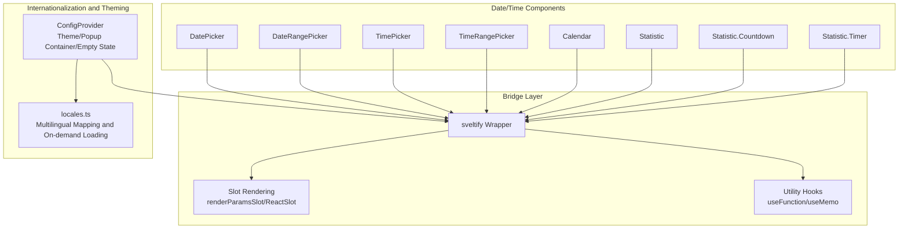
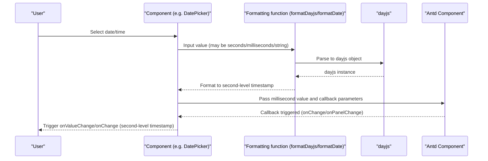
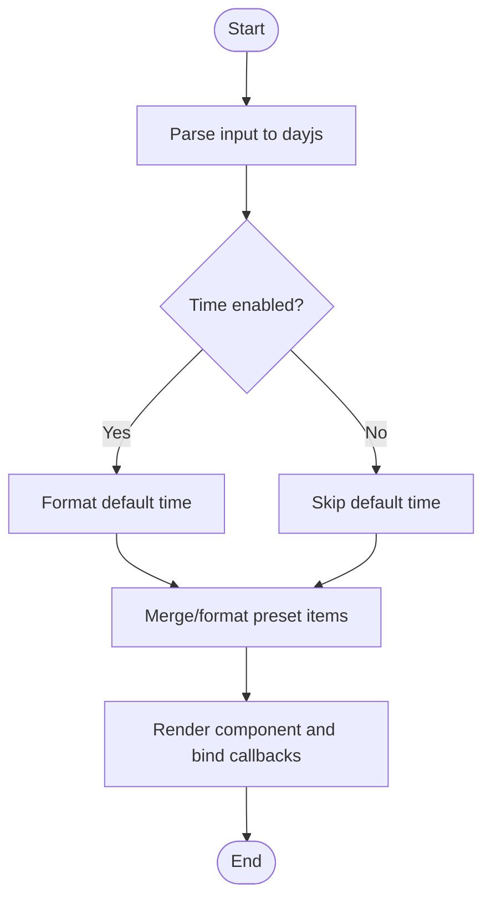
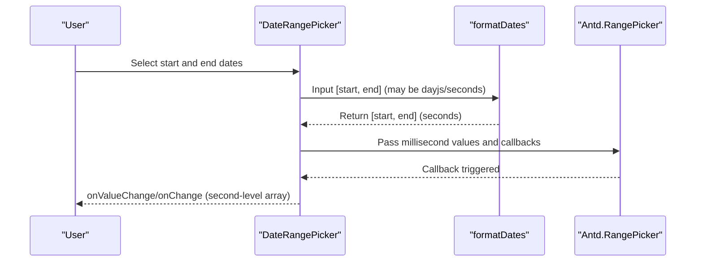
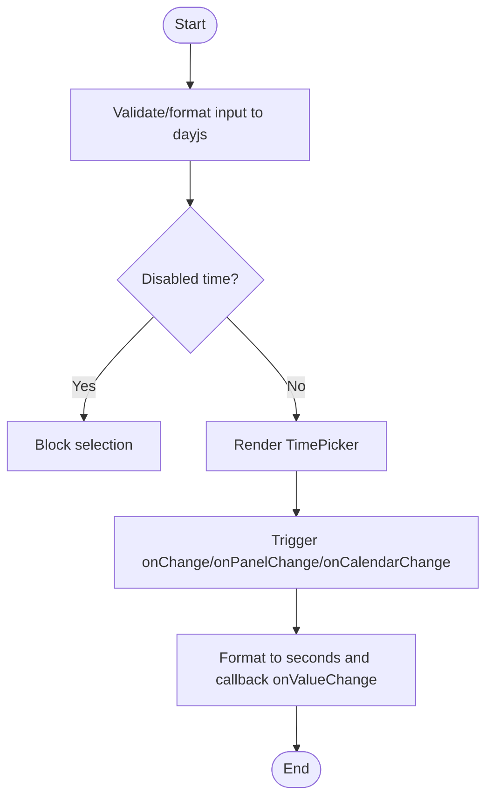
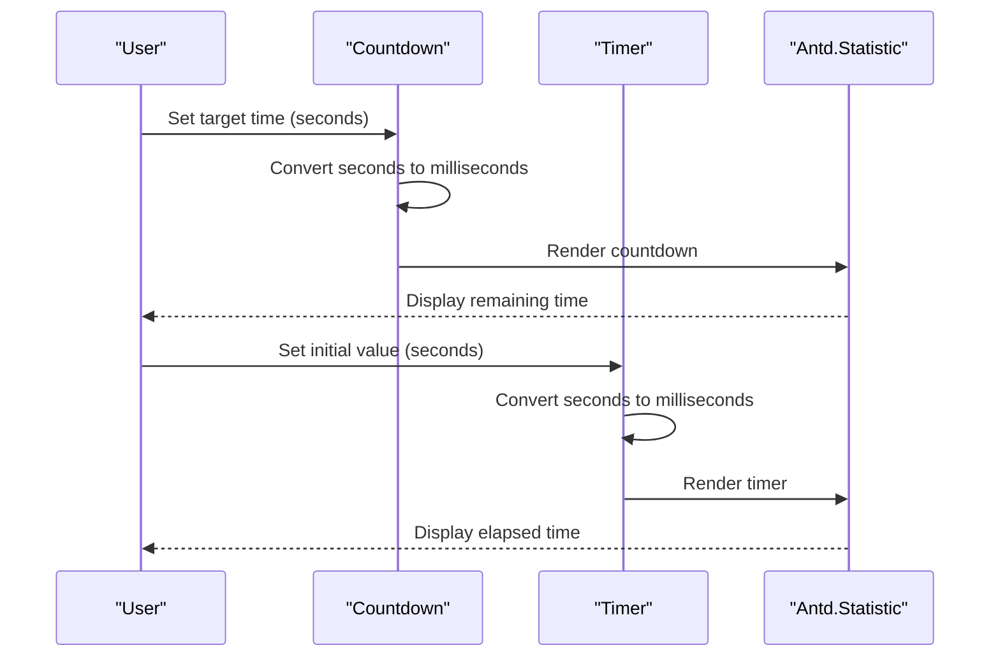
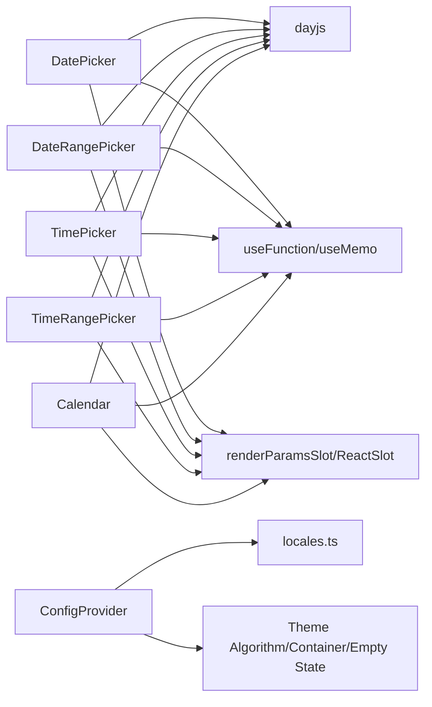

# DateTime Components

<cite>
**Files referenced in this document**
- [frontend/antd/date-picker/date-picker.tsx](file://frontend/antd/date-picker/date-picker.tsx)
- [frontend/antd/date-picker/context.ts](file://frontend/antd/date-picker/context.ts)
- [frontend/antd/date-picker/preset/date-picker.preset.tsx](file://frontend/antd/date-picker/preset/date-picker.preset.tsx)
- [frontend/antd/date-picker/range-picker/date-picker.range-picker.tsx](file://frontend/antd/date-picker/range-picker/date-picker.range-picker.tsx)
- [frontend/antd/time-picker/time-picker.tsx](file://frontend/antd/time-picker/time-picker.tsx)
- [frontend/antd/time-picker/range-picker/time-picker.range-picker.tsx](file://frontend/antd/time-picker/range-picker/time-picker.range-picker.tsx)
- [frontend/antd/calendar/calendar.tsx](file://frontend/antd/calendar/calendar.tsx)
- [frontend/antd/statistic/statistic.tsx](file://frontend/antd/statistic/statistic.tsx)
- [frontend/antd/statistic/countdown/statistic.countdown.tsx](file://frontend/antd/statistic/countdown/statistic.countdown.tsx)
- [frontend/antd/statistic/timer/statistic.timer.tsx](file://frontend/antd/statistic/timer/statistic.timer.tsx)
- [frontend/antd/config-provider/config-provider.tsx](file://frontend/antd/config-provider/config-provider.tsx)
- [frontend/antd/config-provider/locales.ts](file://frontend/antd/config-provider/locales.ts)
</cite>

## Table of Contents

1. [Introduction](#introduction)
2. [Project Structure](#project-structure)
3. [Core Components](#core-components)
4. [Architecture Overview](#architecture-overview)
5. [Detailed Component Analysis](#detailed-component-analysis)
6. [Dependency Analysis](#dependency-analysis)
7. [Performance Considerations](#performance-considerations)
8. [Troubleshooting Guide](#troubleshooting-guide)
9. [Conclusion](#conclusion)
10. [Appendix](#appendix)

## Introduction

This document systematically covers the "date and time" related components and capabilities in the ModelScope Studio frontend, including:

- DatePicker and DateRangePicker
- TimePicker and TimeRangePicker
- Calendar
- Countdown and Timer within Statistic
- Date formatting, timezone and time unit conversion, range selection, quick options (presets), and disabled date/time
- Localization (ConfigProvider) and internationalization configuration (locales)
- Validation rules and business scenario applications
- Accessibility and keyboard navigation
- Handling patterns and best practices for complex date/time scenarios

## Project Structure

The frontend implementation around date/time components is primarily located in the antd-prefixed directory, using Svelte + React wrapping (sveltify) to bridge Ant Design components, with ConfigProvider providing unified theming and internationalization.

Diagram Source

- [frontend/antd/date-picker/date-picker.tsx:40-231](file://frontend/antd/date-picker/date-picker.tsx#L40-L231)
- [frontend/antd/date-picker/range-picker/date-picker.range-picker.tsx:29-245](file://frontend/antd/date-picker/range-picker/date-picker.range-picker.tsx#L29-L245)
- [frontend/antd/time-picker/time-picker.tsx:37-198](file://frontend/antd/time-picker/time-picker.tsx#L37-L198)
- [frontend/antd/time-picker/range-picker/time-picker.range-picker.tsx:26-207](file://frontend/antd/time-picker/range-picker/time-picker.range-picker.tsx#L26-L207)
- [frontend/antd/calendar/calendar.tsx:17-99](file://frontend/antd/calendar/calendar.tsx#L17-L99)
- [frontend/antd/statistic/statistic.tsx:8-31](file://frontend/antd/statistic/statistic.tsx#L8-L31)
- [frontend/antd/statistic/countdown/statistic.countdown.tsx:6-24](file://frontend/antd/statistic/countdown/statistic.countdown.tsx#L6-L24)
- [frontend/antd/statistic/timer/statistic.timer.tsx:10-26](file://frontend/antd/statistic/timer/statistic.timer.tsx#L10-L26)
- [frontend/antd/config-provider/config-provider.tsx:53-151](file://frontend/antd/config-provider/config-provider.tsx#L53-L151)
- [frontend/antd/config-provider/locales.ts:89-863](file://frontend/antd/config-provider/locales.ts#L89-L863)

Section Source

- [frontend/antd/date-picker/date-picker.tsx:1-234](file://frontend/antd/date-picker/date-picker.tsx#L1-L234)
- [frontend/antd/date-picker/range-picker/date-picker.range-picker.tsx:1-248](file://frontend/antd/date-picker/range-picker/date-picker.range-picker.tsx#L1-L248)
- [frontend/antd/time-picker/time-picker.tsx:1-201](file://frontend/antd/time-picker/time-picker.tsx#L1-L201)
- [frontend/antd/time-picker/range-picker/time-picker.range-picker.tsx:1-211](file://frontend/antd/time-picker/range-picker/time-picker.range-picker.tsx#L1-L211)
- [frontend/antd/calendar/calendar.tsx:1-102](file://frontend/antd/calendar/calendar.tsx#L1-L102)
- [frontend/antd/statistic/statistic.tsx:1-34](file://frontend/antd/statistic/statistic.tsx#L1-L34)
- [frontend/antd/statistic/countdown/statistic.countdown.tsx:1-27](file://frontend/antd/statistic/countdown/statistic.countdown.tsx#L1-L27)
- [frontend/antd/statistic/timer/statistic.timer.tsx:1-29](file://frontend/antd/statistic/timer/statistic.timer.tsx#L1-L29)
- [frontend/antd/config-provider/config-provider.tsx:1-154](file://frontend/antd/config-provider/config-provider.tsx#L1-L154)
- [frontend/antd/config-provider/locales.ts:1-863](file://frontend/antd/config-provider/locales.ts#L1-L863)

## Core Components

- DatePicker: supports date and time selection, range selection, preset shortcuts, disabled date/time, panel switch callbacks, custom popup containers, etc.
- TimePicker: supports time selection, range selection, disabled time, panel switching, and calendar linked callbacks.
- Calendar: provides a full month view, supports custom cell rendering, header rendering, and valid range restriction.
- Statistic: basic statistic display; both Countdown and Timer accept values in seconds and internally auto-convert to milliseconds to pass to the underlying component.

Section Source

- [frontend/antd/date-picker/date-picker.tsx:40-170](file://frontend/antd/date-picker/date-picker.tsx#L40-L170)
- [frontend/antd/date-picker/range-picker/date-picker.range-picker.tsx:29-177](file://frontend/antd/date-picker/range-picker/date-picker.range-picker.tsx#L29-L177)
- [frontend/antd/time-picker/time-picker.tsx:37-143](file://frontend/antd/time-picker/time-picker.tsx#L37-L143)
- [frontend/antd/time-picker/range-picker/time-picker.range-picker.tsx:26-146](file://frontend/antd/time-picker/range-picker/time-picker.range-picker.tsx#L26-L146)
- [frontend/antd/calendar/calendar.tsx:17-94](file://frontend/antd/calendar/calendar.tsx#L17-L94)
- [frontend/antd/statistic/statistic.tsx:8-31](file://frontend/antd/statistic/statistic.tsx#L8-L31)
- [frontend/antd/statistic/countdown/statistic.countdown.tsx:6-21](file://frontend/antd/statistic/countdown/statistic.countdown.tsx#L6-L21)
- [frontend/antd/statistic/timer/statistic.timer.tsx:10-23](file://frontend/antd/statistic/timer/statistic.timer.tsx#L10-L23)

## Architecture Overview

Components are uniformly wrapped through sveltify around Ant Design components, using dayjs for date parsing and formatting. They expose a unified second-level timestamp interface externally, then internally convert to milliseconds to pass to the underlying component. ConfigProvider handles theme algorithms, popup containers, empty state rendering, and internationalization (Antd language packs and dayjs language packs).

Diagram Source

- [frontend/antd/date-picker/date-picker.tsx:14-38](file://frontend/antd/date-picker/date-picker.tsx#L14-L38)
- [frontend/antd/date-picker/range-picker/date-picker.range-picker.tsx:14-27](file://frontend/antd/date-picker/range-picker/date-picker.range-picker.tsx#L14-L27)
- [frontend/antd/time-picker/time-picker.tsx:11-35](file://frontend/antd/time-picker/time-picker.tsx#L11-L35)
- [frontend/antd/time-picker/range-picker/time-picker.range-picker.tsx:11-24](file://frontend/antd/time-picker/range-picker/time-picker.range-picker.tsx#L11-L24)

## Detailed Component Analysis

### DatePicker

- Data flow and formatting
  - Input supports number (seconds), string, dayjs objects; internally unified to dayjs.
  - Output is uniformly a second-level timestamp for easy backend or cross-component passing.
- Key capabilities
  - showTime supports object form, and defaultValue will also be formatted.
  - disabledDate/disabledTime customize disabled logic.
  - presets shortcuts: injected via context, supports dynamic rendering and formatting.
  - cellRender/panelRender slot-based rendering.
  - getPopupContainer customizes popup container.
- Event callbacks
  - onValueChange: unified value change callback (second-level).
  - onChange/onPanelChange: both native callback and secondary wrapped callback are available.

Diagram Source

- [frontend/antd/date-picker/date-picker.tsx:91-161](file://frontend/antd/date-picker/date-picker.tsx#L91-L161)

Section Source

- [frontend/antd/date-picker/date-picker.tsx:1-234](file://frontend/antd/date-picker/date-picker.tsx#L1-L234)
- [frontend/antd/date-picker/context.ts:1-7](file://frontend/antd/date-picker/context.ts#L1-L7)
- [frontend/antd/date-picker/preset/date-picker.preset.tsx:1-14](file://frontend/antd/date-picker/preset/date-picker.preset.tsx#L1-L14)

### DateRangePicker

- Data flow
  - Input/output are both two-element arrays [start, end], with elements as second-level timestamps.
  - Default value, current value, and panel value are all formatted and mapped as arrays using dayjs.
- Key capabilities
  - showTime's defaultValue supports array mapping.
  - presets also support array formatting.
  - separator supports slot-based separator.
- Event callbacks
  - onValueChange, onChange, onPanelChange, onCalendarChange all return second-level arrays.

Diagram Source

- [frontend/antd/date-picker/range-picker/date-picker.range-picker.tsx:21-27](file://frontend/antd/date-picker/range-picker/date-picker.range-picker.tsx#L21-L27)
- [frontend/antd/date-picker/range-picker/date-picker.range-picker.tsx:165-177](file://frontend/antd/date-picker/range-picker/date-picker.range-picker.tsx#L165-L177)

Section Source

- [frontend/antd/date-picker/range-picker/date-picker.range-picker.tsx:1-248](file://frontend/antd/date-picker/range-picker/date-picker.range-picker.tsx#L1-L248)

### TimePicker

- Data flow
  - Input supports number (seconds), string, dayjs; uniformly formatted to dayjs.
  - Output is a second-level value (number or string), ensuring consistency via onValueChange.
- Key capabilities
  - disabledTime/disabledDate controls available time slots.
  - cellRender/panelRender supports slots.
  - onCalendarChange and onPanelChange.
- Event callbacks
  - onValueChange receives second-level values; onChange/onPanelChange are also formatted before callback.

Diagram Source

- [frontend/antd/time-picker/time-picker.tsx:88-143](file://frontend/antd/time-picker/time-picker.tsx#L88-L143)

Section Source

- [frontend/antd/time-picker/time-picker.tsx:1-201](file://frontend/antd/time-picker/time-picker.tsx#L1-L201)

### TimeRangePicker

- Data flow
  - Input/output are [start, end] arrays with elements as second-level timestamps.
  - Default value, current value, and panel value are all formatted as array mappings.
- Key capabilities
  - disabledTime/disabledDate controls available time slots.
  - separator supports slot-based separator.
- Event callbacks
  - onValueChange, onChange, onPanelChange, onCalendarChange all return second-level arrays.

Section Source

- [frontend/antd/time-picker/range-picker/time-picker.range-picker.tsx:1-211](file://frontend/antd/time-picker/range-picker/time-picker.range-picker.tsx#L1-L211)

### Calendar

- Data flow
  - Input/output are uniformly second-level timestamps; internally converted to milliseconds for Antd Calendar.
- Key capabilities
  - validRange restricts the valid range.
  - cellRender/fullCellRender/headerRender support slots.
  - onSelect/onPanelChange/onChange uniformly callback second-level values.
- Note
  - disabledDate is not directly exposed; it can be controlled by passing values from external logic.

Section Source

- [frontend/antd/calendar/calendar.tsx:1-102](file://frontend/antd/calendar/calendar.tsx#L1-L102)

### Statistic / Countdown / Timer

- Statistic
  - Supports slot-based title/prefix/suffix/formatter.
- Statistic.Countdown
  - Input value supports seconds or milliseconds; internally converts seconds to milliseconds.
  - Supports slot-based title/prefix/suffix.
- Statistic.Timer
  - Input value supports seconds or milliseconds; internally converts seconds to milliseconds.
  - Supports slot-based title/prefix/suffix.

Diagram Source

- [frontend/antd/statistic/countdown/statistic.countdown.tsx:11-21](file://frontend/antd/statistic/countdown/statistic.countdown.tsx#L11-L21)
- [frontend/antd/statistic/timer/statistic.timer.tsx:13-23](file://frontend/antd/statistic/timer/statistic.timer.tsx#L13-L23)

Section Source

- [frontend/antd/statistic/statistic.tsx:1-34](file://frontend/antd/statistic/statistic.tsx#L1-L34)
- [frontend/antd/statistic/countdown/statistic.countdown.tsx:1-27](file://frontend/antd/statistic/countdown/statistic.countdown.tsx#L1-L27)
- [frontend/antd/statistic/timer/statistic.timer.tsx:1-29](file://frontend/antd/statistic/timer/statistic.timer.tsx#L1-L29)

## Dependency Analysis

- Components to utilities
  - Uses dayjs for date parsing and formatting.
  - Uses useFunction/useMemo to stabilize callbacks and computations.
  - Uses renderParamsSlot/ReactSlot for slot-based rendering.
- Components to context
  - DatePicker presets are injected and consumed via createItemsContext.
- Internationalization and theming
  - ConfigProvider is responsible for:
    - Theme algorithms (dark/compact).
    - Popup containers and target container functions.
    - Empty state rendering.
    - Internationalization: Antd language packs and dayjs language packs loaded on demand.
  - locales.ts provides mapping from language codes to language packs with async loading.

Diagram Source

- [frontend/antd/date-picker/date-picker.tsx:1-11](file://frontend/antd/date-picker/date-picker.tsx#L1-L11)
- [frontend/antd/date-picker/range-picker/date-picker.range-picker.tsx:1-7](file://frontend/antd/date-picker/range-picker/date-picker.range-picker.tsx#L1-L7)
- [frontend/antd/time-picker/time-picker.tsx:1-6](file://frontend/antd/time-picker/time-picker.tsx#L1-L6)
- [frontend/antd/time-picker/range-picker/time-picker.range-picker.tsx:1-6](file://frontend/antd/time-picker/range-picker/time-picker.range-picker.tsx#L1-L6)
- [frontend/antd/calendar/calendar.tsx:1-6](file://frontend/antd/calendar/calendar.tsx#L1-L6)
- [frontend/antd/config-provider/config-provider.tsx:1-11](file://frontend/antd/config-provider/config-provider.tsx#L1-L11)
- [frontend/antd/config-provider/locales.ts:1-10](file://frontend/antd/config-provider/locales.ts#L1-L10)

Section Source

- [frontend/antd/date-picker/date-picker.tsx:1-234](file://frontend/antd/date-picker/date-picker.tsx#L1-L234)
- [frontend/antd/date-picker/range-picker/date-picker.range-picker.tsx:1-248](file://frontend/antd/date-picker/range-picker/date-picker.range-picker.tsx#L1-L248)
- [frontend/antd/time-picker/time-picker.tsx:1-201](file://frontend/antd/time-picker/time-picker.tsx#L1-L201)
- [frontend/antd/time-picker/range-picker/time-picker.range-picker.tsx:1-211](file://frontend/antd/time-picker/range-picker/time-picker.range-picker.tsx#L1-L211)
- [frontend/antd/calendar/calendar.tsx:1-102](file://frontend/antd/calendar/calendar.tsx#L1-L102)
- [frontend/antd/config-provider/config-provider.tsx:1-154](file://frontend/antd/config-provider/config-provider.tsx#L1-L154)
- [frontend/antd/config-provider/locales.ts:1-863](file://frontend/antd/config-provider/locales.ts#L1-L863)

## Performance Considerations

- Formatting and caching
  - Use useMemo to cache formatted dayjs values to avoid repeated computation.
  - useFunction stabilizes callback references to reduce unnecessary re-renders.
- On-demand loading
  - ConfigProvider async-loads Antd and dayjs language resources when locale changes, reducing initial bundle size.
- Rendering optimization
  - Slot-based rendering only mounts when needed, reducing irrelevant node overhead.
- Recommendations
  - For wide range selection or frequent updates, apply throttle/debounce at the parent level as much as possible.
  - When there are many preset items, consider lazy loading and virtualized rendering.

## Troubleshooting Guide

- Date not displayed or displayed incorrectly
  - Check whether the input is a second-level timestamp; the component internally converts it to milliseconds.
  - Confirm that the dayjs language has been correctly set (ConfigProvider sets it automatically).
- Internationalization not taking effect
  - Confirm that the locale parameter format conforms to the specification (e.g., zh_CN, en_US); locales.ts contains the corresponding mapping.
  - If the language pack fails to load, check network and build configuration.
- Preset items not displayed
  - Confirm that preset items have been injected via context, and ensure the value format is dayjs.
- Disabled logic not working
  - disabledDate/disabledTime should be functions; ensure stable references by wrapping with useFunction.
- Callback not triggered
  - Confirm that using onValueChange and onChange simultaneously does not cause state inconsistency.
  - Check whether getPopupContainer correctly returns the container.

Section Source

- [frontend/antd/config-provider/config-provider.tsx:96-105](file://frontend/antd/config-provider/config-provider.tsx#L96-L105)
- [frontend/antd/date-picker/date-picker.tsx:86-90](file://frontend/antd/date-picker/date-picker.tsx#L86-L90)
- [frontend/antd/time-picker/time-picker.tsx:83-87](file://frontend/antd/time-picker/time-picker.tsx#L83-L87)

## Conclusion

This date/time component system is built on Ant Design and provides complete capabilities from dates and times to calendar, countdown, and timer through a unified formatting and slot-based mechanism. With ConfigProvider's theming and internationalization support, it can meet complex business requirements in multi-language and multi-theme scenarios. It is recommended to follow the "unified second-level timestamp" data contract in actual use, combined with useMemo/useFunction for performance optimization, and extend UI expressiveness through slot-based customization.

## Appendix

### Localization and Internationalization Configuration

- ConfigProvider
  - Supports themeMode to switch dark/compact algorithms.
  - Supports getPopupContainer/getTargetContainer to customize containers.
  - Supports renderEmpty for custom empty state.
  - The locale parameter supports language codes; locales.ts provides mapping and async loading.
- locales.ts
  - Provides 80+ language code mappings with on-demand loading of Antd and dayjs language packs.
  - Default language is en_US; dayjs default language is en.

Section Source

- [frontend/antd/config-provider/config-provider.tsx:53-151](file://frontend/antd/config-provider/config-provider.tsx#L53-L151)
- [frontend/antd/config-provider/locales.ts:89-863](file://frontend/antd/config-provider/locales.ts#L89-L863)

### Accessibility and Keyboard Navigation

- Recommendations
  - Use standard semantic labels and native interactions to ensure keyboard accessibility.
  - Mount popup layers inside focusable containers via getPopupContainer.
  - Preserve focus management and accessibility attributes in custom cellRender/headerRender.
  - For countdown/timer, provide clear titles and unit hints for screen reader recognition.

### Complex Scenario Handling Patterns and Best Practices

- Cross-timezone scenarios
  - Recommended to uniformly store and transmit UTC second-level timestamps, and perform localized display in the presentation layer based on ConfigProvider's dayjs language and locale settings.
- Range selection
  - Use DateRangePicker/TimeRangePicker and validate start/end order and validity at the parent level.
- Preset shortcuts
  - Inject preset items via DatePickerPreset, ensure values are in dayjs format to avoid display anomalies from format inconsistencies.
- Validation rules
  - Combine disabledDate/disabledTime with min/max date restrictions to form a "disable + validate" dual safeguard.
- Performance
  - In large list/high-frequency update scenarios, prioritize useMemo/useCallback to stabilize props and callbacks to reduce re-renders.
