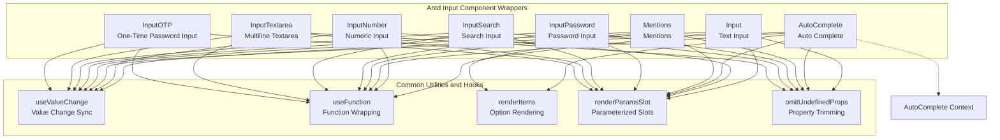
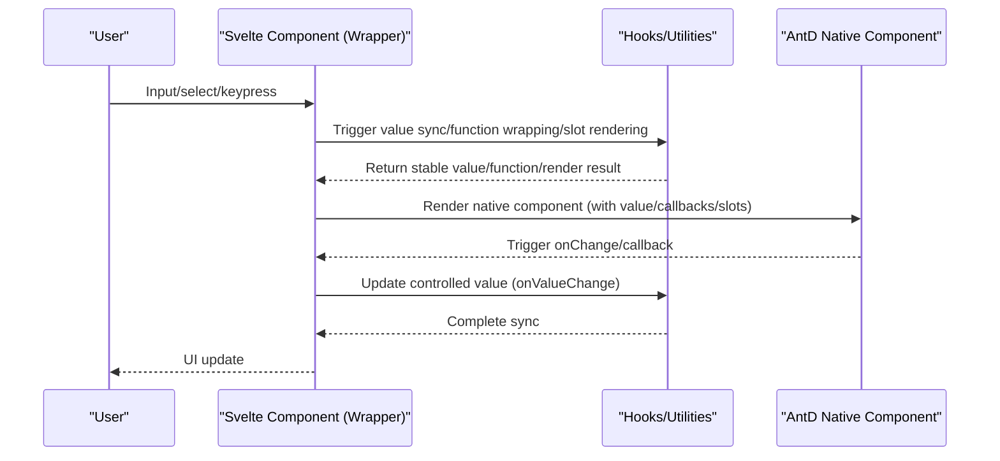
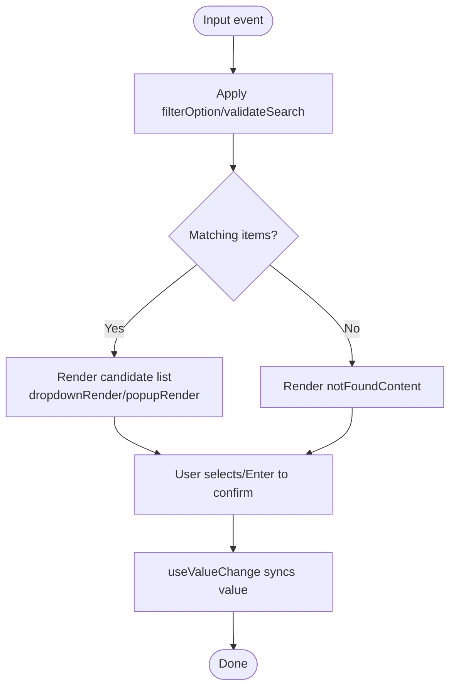
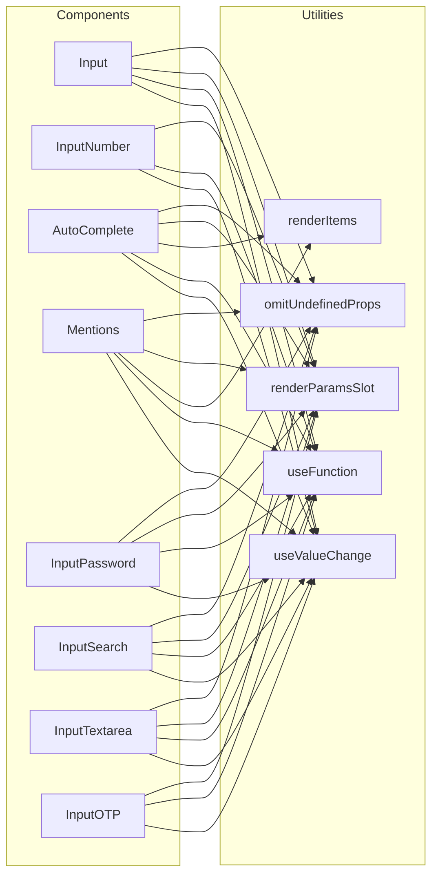

# Input Components

<cite>
**Files referenced in this document**
- [input.tsx](file://frontend/antd/input/input.tsx)
- [input-number.tsx](file://frontend/antd/input-number/input-number.tsx)
- [auto-complete.tsx](file://frontend/antd/auto-complete/auto-complete.tsx)
- [mentions.tsx](file://frontend/antd/mentions/mentions.tsx)
- [input.password.tsx](file://frontend/antd/input/password/input.password.tsx)
- [input.search.tsx](file://frontend/antd/input/search/input.search.tsx)
- [input.textarea.tsx](file://frontend/antd/input/textarea/input.textarea.tsx)
- [input.otp.tsx](file://frontend/antd/input/otp/input.otp.tsx)
- [context.ts](file://frontend/antd/auto-complete/context.ts)
- [hooks/useValueChange.ts](file://frontend/utils/hooks/useValueChange.ts)
- [hooks/useFunction.ts](file://frontend/utils/hooks/useFunction.ts)
- [renderItems.ts](file://frontend/utils/renderItems.ts)
- [renderParamsSlot.ts](file://frontend/utils/renderParamsSlot.ts)
- [omitUndefinedProps.ts](file://frontend/utils/omitUndefinedProps.ts)
</cite>

## Table of Contents

1. [Introduction](#introduction)
2. [Project Structure](#project-structure)
3. [Core Components](#core-components)
4. [Architecture Overview](#architecture-overview)
5. [Detailed Component Analysis](#detailed-component-analysis)
6. [Dependency Analysis](#dependency-analysis)
7. [Performance Considerations](#performance-considerations)
8. [Troubleshooting Guide](#troubleshooting-guide)
9. [Conclusion](#conclusion)

## Introduction

This section covers the usage and extension of "input-type data entry components", including: Input, InputNumber, AutoComplete, Mentions, InputPassword, InputSearch, InputTextarea, and InputOTP. The document focuses on:

- How input validation, formatting, debounce, and character limiting are implemented within components, and best practices
- Accessibility and keyboard navigation support
- Integration patterns with form validation
- Performance optimization strategies for large-scale data input scenarios

## Project Structure

Input components are all located in the frontend Ant Design wrapper layer, using a unified pattern of "sveltify wrapping + React Slot + Hooks value synchronization" to ensure alignment with Ant Design component properties while providing more flexible slot-based and functional callback capabilities.

Diagram Source

- [input.tsx:10-116](file://frontend/antd/input/input.tsx#L10-L116)
- [input-number.tsx:7-89](file://frontend/antd/input-number/input-number.tsx#L7-L89)
- [auto-complete.tsx:32-148](file://frontend/antd/auto-complete/auto-complete.tsx#L32-L148)
- [mentions.tsx:11-77](file://frontend/antd/mentions/mentions.tsx#L11-L77)
- [input.password.tsx:10-126](file://frontend/antd/input/password/input.password.tsx#L10-L126)
- [input.search.tsx:10-123](file://frontend/antd/input/search/input.search.tsx#L10-L123)
- [input.textarea.tsx:10-88](file://frontend/antd/input/textarea/input.textarea.tsx#L10-L88)
- [input.otp.tsx:7-54](file://frontend/antd/input/otp/input.otp.tsx#L7-L54)
- [context.ts](file://frontend/antd/auto-complete/context.ts)
- [hooks/useValueChange.ts](file://frontend/utils/hooks/useValueChange.ts)
- [hooks/useFunction.ts](file://frontend/utils/hooks/useFunction.ts)
- [renderItems.ts](file://frontend/utils/renderItems.ts)
- [renderParamsSlot.ts](file://frontend/utils/renderParamsSlot.ts)
- [omitUndefinedProps.ts](file://frontend/utils/omitUndefinedProps.ts)

Section Source

- [input.tsx:1-119](file://frontend/antd/input/input.tsx#L1-L119)
- [input-number.tsx:1-92](file://frontend/antd/input-number/input-number.tsx#L1-L92)
- [auto-complete.tsx:1-151](file://frontend/antd/auto-complete/auto-complete.tsx#L1-L151)
- [mentions.tsx:1-80](file://frontend/antd/mentions/mentions.tsx#L1-L80)
- [input.password.tsx:1-129](file://frontend/antd/input/password/input.password.tsx#L1-L129)
- [input.search.tsx:1-126](file://frontend/antd/input/search/input.search.tsx#L1-L126)
- [input.textarea.tsx:1-91](file://frontend/antd/input/textarea/input.textarea.tsx#L1-L91)
- [input.otp.tsx:1-57](file://frontend/antd/input/otp/input.otp.tsx#L1-L57)

## Core Components

This section outlines the key responsibilities and common design of each component:

- Value synchronization and callbacks: through the unified useValueChange hook, the controlled value is decoupled from the onValueChange callback, ensuring consistent updates between input events and external state.
- Function wrapping: useFunction converts incoming functions (such as formatter, parser, filterOption) into stable references, avoiding unnecessary re-renders.
- Slot system: ReactSlot and renderParamsSlot support slot-based custom rendering (such as prefix/suffix, clear icon, dropdown items, separators, etc.) and allow parameter passing.
- Property trimming: omitUndefinedProps only passes valid configuration, preventing undefined properties from affecting rendering or behavior.
- Option rendering: renderItems converts option nodes from slots into the options array required by Ant Design, supporting both default and custom option sets.

Section Source

- [input.tsx:39-42](file://frontend/antd/input/input.tsx#L39-L42)
- [input-number.tsx:32-35](file://frontend/antd/input-number/input-number.tsx#L32-L35)
- [auto-complete.tsx:63-66](file://frontend/antd/auto-complete/auto-complete.tsx#L63-L66)
- [mentions.tsx:34-37](file://frontend/antd/mentions/mentions.tsx#L34-L37)
- [hooks/useValueChange.ts](file://frontend/utils/hooks/useValueChange.ts)
- [hooks/useFunction.ts](file://frontend/utils/hooks/useFunction.ts)
- [renderItems.ts](file://frontend/utils/renderItems.ts)
- [renderParamsSlot.ts](file://frontend/utils/renderParamsSlot.ts)
- [omitUndefinedProps.ts](file://frontend/utils/omitUndefinedProps.ts)

## Architecture Overview

The unified architecture of input components consists of "wrapper layer + utility layer + AntD native components", forming clear responsibility boundaries and reuse paths.

Diagram Source

- [input.tsx:47-54](file://frontend/antd/input/input.tsx#L47-L54)
- [input-number.tsx:39-46](file://frontend/antd/input-number/input-number.tsx#L39-L46)
- [auto-complete.tsx:76-104](file://frontend/antd/auto-complete/auto-complete.tsx#L76-L104)
- [mentions.tsx:44-61](file://frontend/antd/mentions/mentions.tsx#L44-L61)
- [hooks/useValueChange.ts](file://frontend/utils/hooks/useValueChange.ts)

## Detailed Component Analysis

### Input

- Key features
  - Controlled value: synchronizes props.value with internal state via useValueChange; triggers onValueChange on onChange.
  - Character counting: showCount supports functional formatter; count supports combined configuration of strategy/exceedFormatter/show, using useMemo and omitUndefinedProps to trim invalid fields.
  - Slot-based decoration: addonBefore/After, prefix/suffix, allowClear.clearIcon can inject custom nodes via slots.
- Input validation and formatting
  - No built-in regex validation; recommended to combine with form validators or perform validation within onValueChange.
  - formatter/parser are passed in from the parent; not covered here.
- Debounce and character limits
  - No built-in debounce; throttle/debounce can be self-implemented in onValueChange.
  - maxLength is natively supported by AntD and used together with showCount.
- Accessibility and keyboard navigation
  - Preserves native input behavior, following browser default keyboard interactions.
- Integration with form validation
  - Recommended to perform real-time validation in onValueChange and update state via setFieldError/setFieldValue exposed by the form context.
- Performance optimization
  - Use useMemo to cache count configuration to reduce re-renders.
  - Only render the corresponding decoration node when slots exist, avoiding empty branch overhead.

Section Source

- [input.tsx:39-84](file://frontend/antd/input/input.tsx#L39-L84)
- [input.tsx:85-112](file://frontend/antd/input/input.tsx#L85-L112)

### InputNumber

- Key features
  - Controlled value and callbacks: same as above, using useValueChange to sync values.
  - Formatting/parsing: formatter/parser are passed in as functions, wrapped with useFunction for stable references.
  - Control icons: controls.upIcon/controls.downIcon support slot injection.
  - Decoration and prefix/suffix: addonBefore/After, prefix/suffix support slots.
- Input validation and formatting
  - No built-in validation; recommended to perform range and format validation in onChange or onValueChange.
  - formatter/parser are used for display and parsing to prevent users from entering non-numeric characters.
- Debounce and character limits
  - No built-in debounce; can be implemented in onValueChange.
- Accessibility and keyboard navigation
  - Preserves native numeric input behavior, supports up/down arrows to increment/decrement.
- Integration with form validation
  - Perform numeric range and precision validation in onValueChange and sync form state.
- Performance optimization
  - formatter/parser and control icons are rendered on demand, reducing unnecessary overhead.

Section Source

- [input-number.tsx:32-35](file://frontend/antd/input-number/input-number.tsx#L32-L35)
- [input-number.tsx:47-64](file://frontend/antd/input-number/input-number.tsx#L47-L64)
- [input-number.tsx:79-84](file://frontend/antd/input-number/input-number.tsx#L79-L84)

### AutoComplete

- Key features
  - Value sync: useValueChange syncs value with onValueChange.
  - Option rendering: prefers passed-in options; otherwise extracts from slots and converts using renderItems.
  - Dropdown rendering: dropdownRender/popupRender support both slot and function forms.
  - Filter logic: filterOption supports functions or boolean values; getPopupContainer specifies the popup container.
  - Clear and decoration: allowClear.clearIcon, notFoundContent, addonBefore/After, prefix/suffix support slots.
- Input validation and formatting
  - No built-in validation; control candidate set via filterOption and validateSearch.
  - Recommended to perform secondary validation in onChange/onValueChange.
- Debounce and character limits
  - No built-in debounce; can be implemented in onValueChange.
- Accessibility and keyboard navigation
  - Supports keyboard up/down selection, Enter to confirm, Tab to switch.
- Integration with form validation
  - Use the form context to set error messages in onValueChange.
- Performance optimization
  - Use useMemo to cache options; only render decoration nodes when slots exist.

Diagram Source

- [auto-complete.tsx:89-100](file://frontend/antd/auto-complete/auto-complete.tsx#L89-L100)
- [auto-complete.tsx:114-135](file://frontend/antd/auto-complete/auto-complete.tsx#L114-L135)
- [mentions.tsx:48-57](file://frontend/antd/mentions/mentions.tsx#L48-L57)

Section Source

- [auto-complete.tsx:63-66](file://frontend/antd/auto-complete/auto-complete.tsx#L63-L66)
- [auto-complete.tsx:89-100](file://frontend/antd/auto-complete/auto-complete.tsx#L89-L100)
- [auto-complete.tsx:114-135](file://frontend/antd/auto-complete/auto-complete.tsx#L114-L135)
- [context.ts](file://frontend/antd/auto-complete/context.ts)

### Mentions

- Key features
  - Value sync: useValueChange syncs value with onValueChange.
  - Option rendering: prefers options; otherwise uses slot renderItems.
  - Filter and validation: filterOption, validateSearch support functional forms.
  - Popup container: getPopupContainer specifies the container.
  - Clear and placeholder: allowClear.clearIcon, notFoundContent support slots.
- Input validation and formatting
  - No built-in validation; control input and candidates via validateSearch and filterOption.
- Debounce and character limits
  - No built-in debounce; can be implemented in onValueChange.
- Accessibility and keyboard navigation
  - Supports keyboard selection and confirmation.
- Integration with form validation
  - Perform format and content validation in onValueChange.
- Performance optimization
  - useMemo caches options; renders decoration nodes on demand.

Section Source

- [mentions.tsx:34-37](file://frontend/antd/mentions/mentions.tsx#L34-L37)
- [mentions.tsx:48-57](file://frontend/antd/mentions/mentions.tsx#L48-L57)
- [mentions.tsx:62-71](file://frontend/antd/mentions/mentions.tsx#L62-L71)

### InputPassword

- Key features
  - Controlled value: useValueChange syncs value with onValueChange.
  - Show/hide toggle: iconRender supports slots and functions.
  - Character counting: showCount/formatter and count configuration support functional forms and trimming.
  - Decoration and clear: addonBefore/After, prefix/suffix, allowClear.clearIcon support slots.
- Input validation and formatting
  - No built-in validation; recommended to perform strength and length validation in onValueChange.
- Debounce and character limits
  - No built-in debounce; can be implemented in onValueChange.
- Accessibility and keyboard navigation
  - Preserves native password input behavior.
- Integration with form validation
  - Perform password policy validation in onValueChange.
- Performance optimization
  - Use useMemo to cache count configuration and iconRender.

Section Source

- [input.password.tsx:42-45](file://frontend/antd/input/password/input.password.tsx#L42-L45)
- [input.password.tsx:65-79](file://frontend/antd/input/password/input.password.tsx#L65-L79)
- [input.password.tsx:80-94](file://frontend/antd/input/password/input.password.tsx#L80-L94)
- [input.password.tsx:95-122](file://frontend/antd/input/password/input.password.tsx#L95-L122)

### InputSearch

- Key features
  - Controlled value: useValueChange syncs value with onValueChange.
  - Character counting: showCount/formatter and count configuration support functional forms and trimming.
  - Search button: enterButton supports slots and text.
  - Decoration and clear: addonBefore/After, prefix/suffix, allowClear.clearIcon support slots.
- Input validation and formatting
  - No built-in validation; recommended to perform length and content validation in onValueChange.
- Debounce and character limits
  - No built-in debounce; can be implemented in onValueChange.
- Accessibility and keyboard navigation
  - Supports Enter to trigger search.
- Integration with form validation
  - Perform search term validation in onValueChange.
- Performance optimization
  - Use useMemo to cache count configuration and enterButton.

Section Source

- [input.search.tsx:40-43](file://frontend/antd/input/search/input.search.tsx#L40-L43)
- [input.search.tsx:70-78](file://frontend/antd/input/search/input.search.tsx#L70-L78)
- [input.search.tsx:85-91](file://frontend/antd/input/search/input.search.tsx#L85-L91)
- [input.search.tsx:92-118](file://frontend/antd/input/search/input.search.tsx#L92-L118)

### InputTextarea

- Key features
  - Controlled value: useValueChange syncs value with onValueChange.
  - Character counting: showCount/formatter and count configuration support functional forms and trimming.
  - Clear: allowClear.clearIcon supports slots.
- Input validation and formatting
  - No built-in validation; recommended to perform length and content validation in onValueChange.
- Debounce and character limits
  - No built-in debounce; can be implemented in onValueChange.
- Accessibility and keyboard navigation
  - Supports multiline input and scrolling.
- Integration with form validation
  - Perform content and length validation in onValueChange.
- Performance optimization
  - Use useMemo to cache count configuration.

Section Source

- [input.textarea.tsx:32-35](file://frontend/antd/input/textarea/input.textarea.tsx#L32-L35)
- [input.textarea.tsx:62-76](file://frontend/antd/input/textarea/input.textarea.tsx#L62-L76)
- [input.textarea.tsx:77-83](file://frontend/antd/input/textarea/input.textarea.tsx#L77-L83)

### InputOTP

- Key features
  - Controlled value: useValueChange syncs value with onValueChange.
  - Separator: separator supports slots and functions.
  - Formatting: formatter supports functions.
- Input validation and formatting
  - No built-in validation; recommended to perform length and character type validation in onValueChange.
- Debounce and character limits
  - No built-in debounce; can be implemented in onValueChange.
- Accessibility and keyboard navigation
  - Supports cell-by-cell input and automatic focus movement.
- Integration with form validation
  - Perform OTP validation in onValueChange.
- Performance optimization
  - Use useMemo to cache formatter and separator.

Section Source

- [input.otp.tsx:25-28](file://frontend/antd/input/otp/input.otp.tsx#L25-L28)
- [input.otp.tsx:38-44](file://frontend/antd/input/otp/input.otp.tsx#L38-L44)
- [input.otp.tsx:46-49](file://frontend/antd/input/otp/input.otp.tsx#L46-L49)

## Dependency Analysis

- Component to utility layer
  - All input components depend on useValueChange for controlled value synchronization.
  - useFunction is used for stable function references to avoid re-renders.
  - renderItems/renderParamsSlot are used for slot options and parameterized rendering.
  - omitUndefinedProps is used to trim invalid properties.
- Differences between components
  - AutoComplete/Mentions rely on context and slot option rendering.
  - InputNumber/InputPassword/InputSearch/InputTextarea/InputOTP functionalize and cache configurations such as showCount/count/formatter.

Diagram Source

- [input.tsx:39-84](file://frontend/antd/input/input.tsx#L39-L84)
- [input-number.tsx:32-84](file://frontend/antd/input-number/input-number.tsx#L32-L84)
- [auto-complete.tsx:63-100](file://frontend/antd/auto-complete/auto-complete.tsx#L63-L100)
- [mentions.tsx:34-57](file://frontend/antd/mentions/mentions.tsx#L34-L57)
- [input.password.tsx:42-94](file://frontend/antd/input/password/input.password.tsx#L42-L94)
- [input.search.tsx:40-84](file://frontend/antd/input/search/input.search.tsx#L40-L84)
- [input.textarea.tsx:32-76](file://frontend/antd/input/textarea/input.textarea.tsx#L32-L76)
- [input.otp.tsx:25-44](file://frontend/antd/input/otp/input.otp.tsx#L25-L44)
- [hooks/useValueChange.ts](file://frontend/utils/hooks/useValueChange.ts)
- [hooks/useFunction.ts](file://frontend/utils/hooks/useFunction.ts)
- [renderItems.ts](file://frontend/utils/renderItems.ts)
- [renderParamsSlot.ts](file://frontend/utils/renderParamsSlot.ts)
- [omitUndefinedProps.ts](file://frontend/utils/omitUndefinedProps.ts)

## Performance Considerations

- Controlled value synchronization
  - Use useValueChange to uniformly manage the controlled value, avoiding redundant renders caused by inconsistencies between external and internal state.
- Function reference stabilization
  - useFunction wraps incoming functions to reduce re-renders caused by prop changes.
- Slot rendering optimization
  - Only render the corresponding node when slots exist, avoiding empty branch overhead.
- Configuration caching
  - Use useMemo to cache configurations such as showCount/count/formatter to reduce rendering cost.
- Large data input handling
  - Avoid heavy computation in onValueChange; if necessary, split into microtasks or use Web Worker.
  - For high-frequency inputs (such as search, auto-complete), it is recommended to add debounce/throttle strategies upstream.
  - For long text input, prefer TextArea and enable necessary character limits and counting hints.

## Troubleshooting Guide

- Input value not syncing
  - Check whether onValueChange is correctly passed in and has not been overridden.
  - Confirm whether the value in useValueChange is consistent with props.value.
- Slot not working
  - Confirm that the slot key name matches the slots supported by the component (such as allowClear.clearIcon, prefix, suffix, enterButton, separator, etc.).
  - Check whether the renderParamsSlot key is correct.
- Options not displayed
  - AutoComplete/Mentions require providing options or providing options via slots; check the children name and structure in renderItems.
- Formatting anomaly
  - Functions such as formatter/parser/filterOption must return the expected type; use useFunction to wrap them for stable references.
- Count configuration invalid
  - Confirm that when showCount is an object, provide formatter; use omitUndefinedProps to trim invalid fields in count configuration.

Section Source

- [hooks/useValueChange.ts](file://frontend/utils/hooks/useValueChange.ts)
- [hooks/useFunction.ts](file://frontend/utils/hooks/useFunction.ts)
- [renderItems.ts](file://frontend/utils/renderItems.ts)
- [renderParamsSlot.ts](file://frontend/utils/renderParamsSlot.ts)
- [omitUndefinedProps.ts](file://frontend/utils/omitUndefinedProps.ts)

## Conclusion

Input components achieve deep compatibility with Ant Design and flexible extensibility through a unified wrapping pattern. With the help of tools such as useValueChange, useFunction, renderItems, renderParamsSlot, and omitUndefinedProps, the components provide powerful slot-based and functional capabilities while ensuring performance. In actual business scenarios, it is recommended to combine with the form validation system to implement input validation, formatting, and debounce strategies in onValueChange, and to employ caching and asynchronous processing for large-scale data input scenarios, to achieve better user experience and stability.
