# Selection Components

<cite>
**Files referenced in this document**
- [select.tsx](file://frontend/antd/select/select.tsx)
- [option.tsx](file://frontend/antd/select/option/option.tsx)
- [checkbox.tsx](file://frontend/antd/checkbox/checkbox.tsx)
- [group.tsx](file://frontend/antd/checkbox/group/checkbox.group.tsx)
- [radio.tsx](file://frontend/antd/radio/radio.tsx)
- [radio.group.tsx](file://frontend/antd/radio/group/radio.group.tsx)
- [switch.tsx](file://frontend/antd/switch/switch.tsx)
- [segmented.tsx](file://frontend/antd/segmented/segmented.tsx)
- [option.tsx](file://frontend/antd/segmented/option/segmented.option.tsx)
- [tree.tsx](file://frontend/antd/tree/tree.tsx)
- [tree.node.tsx](file://frontend/antd/tree/tree-node/tree.node.tsx)
- [tree.select.tsx](file://frontend/antd/tree-select/tree-select.tsx)
- [tree.node.tsx](file://frontend/antd/tree-select/tree-node/tree.node.tsx)
- [cascader.tsx](file://frontend/antd/cascader/cascader.tsx)
- [panel.tsx](file://frontend/antd/cascader/panel/panel.tsx)
- [option.tsx](file://frontend/antd/cascader/option/option.tsx)
- [transfer.tsx](file://frontend/antd/transfer/transfer.tsx)
- [rate.tsx](file://frontend/antd/rate/rate.tsx)
- [context.ts](file://frontend/antd/select/context.ts)
- [context.ts](file://frontend/antd/checkbox/context.ts)
- [context.ts](file://frontend/antd/radio/context.ts)
- [context.ts](file://frontend/antd/segmented/context.ts)
- [context.ts](file://frontend/antd/tree/context.ts)
- [context.ts](file://frontend/antd/tree-select/context.ts)
- [context.ts](file://frontend/antd/cascader/context.ts)
- [context.ts](file://frontend/antd/rate/context.ts)
</cite>

## Table of Contents

1. [Introduction](#introduction)
2. [Project Structure](#project-structure)
3. [Core Components](#core-components)
4. [Architecture Overview](#architecture-overview)
5. [Detailed Component Analysis](#detailed-component-analysis)
6. [Dependency Analysis](#dependency-analysis)
7. [Performance and Virtual Scrolling](#performance-and-virtual-scrolling)
8. [Accessibility and Keyboard Navigation](#accessibility-and-keyboard-navigation)
9. [Troubleshooting Guide](#troubleshooting-guide)
10. [Conclusion](#conclusion)

## Introduction

This document systematically covers the "selection-type" components in the frontend component library: Select, Checkbox, Radio, Switch, Segmented, TreeSelect, Cascader, Transfer, Tree, and Rate. The document covers data binding, option configuration, multi-select mode, and disabled state, combined with design patterns and data flow management for complex scenarios. It also provides accessibility and keyboard navigation recommendations, as well as virtual scrolling and performance optimization strategies for large option sets.

## Project Structure

Selection components are primarily located in the frontend Ant Design component directory, organized by functional module: each component is stored in its own directory containing the entry component file and sub-components (such as Option, Group, Panel, etc.), with shared state and configuration managed uniformly through a context file (context.ts).

```mermaid
graph TB
subgraph "Selection Component Directory"
S["select.tsx"]
C["checkbox.tsx"]
R["radio.tsx"]
SW["switch.tsx"]
SG["segmented.tsx"]
TS["tree-select.tsx"]
CA["cascader.tsx"]
T["tree.tsx"]
TR["transfer.tsx"]
RA["rate.tsx"]
end
subgraph "Sub-components"
SO["option.tsx (select)"]
CO["checkbox.group.tsx"]
RO["radio.group.tsx"]
SGO["segmented.option.tsx"]
TSN["tree.node.tsx (tree-select)"]
TN["tree.node.tsx (tree)"]
CAP["panel.tsx (cascader)"]
CAO["option.tsx (cascader)"]
end
subgraph "Context"
SC["context.ts (select)"]
CC["context.ts (checkbox)"]
RC["context.ts (radio)"]
SGC["context.ts (segmented)"]
TSC["context.ts (tree-select)"]
CAC["context.ts (cascader)"]
TC["context.ts (tree)"]
RAC["context.ts (rate)"]
end
S --> SO
S --> SC
C --> CO
C --> CC
R --> RO
R --> RC
SG --> SGO
SG --> SGC
TS --> TSN
TS --> TSC
T --> TN
T --> TC
CA --> CAP
CA --> CAO
CA --> CAC
TR --> TR
RA --> RAC
```

Diagram Source

- [select.tsx](file://frontend/antd/select/select.tsx)
- [checkbox.tsx](file://frontend/antd/checkbox/checkbox.tsx)
- [radio.tsx](file://frontend/antd/radio/radio.tsx)
- [switch.tsx](file://frontend/antd/switch/switch.tsx)
- [segmented.tsx](file://frontend/antd/segmented/segmented.tsx)
- [tree.select.tsx](file://frontend/antd/tree-select/tree-select.tsx)
- [cascader.tsx](file://frontend/antd/cascader/cascader.tsx)
- [tree.tsx](file://frontend/antd/tree/tree.tsx)
- [transfer.tsx](file://frontend/antd/transfer/transfer.tsx)
- [rate.tsx](file://frontend/antd/rate/rate.tsx)

Section Source

- [select.tsx](file://frontend/antd/select/select.tsx)
- [checkbox.tsx](file://frontend/antd/checkbox/checkbox.tsx)
- [radio.tsx](file://frontend/antd/radio/radio.tsx)
- [switch.tsx](file://frontend/antd/switch/switch.tsx)
- [segmented.tsx](file://frontend/antd/segmented/segmented.tsx)
- [tree.select.tsx](file://frontend/antd/tree-select/tree-select.tsx)
- [cascader.tsx](file://frontend/antd/cascader/cascader.tsx)
- [tree.tsx](file://frontend/antd/tree/tree.tsx)
- [transfer.tsx](file://frontend/antd/transfer/transfer.tsx)
- [rate.tsx](file://frontend/antd/rate/rate.tsx)

## Core Components

This section outlines the key capabilities and common features of each component:

- Data binding: controlled/uncontrolled modes, linked to external state via properties such as value/checked.
- Option configuration: declaratively define option sets through child item components (Option/Segmented.Option/Tree.Node, etc.).
- Multi-select mode: Checkbox supports multi-select; Select/Cascader/TreeSelect can be configured for multi-select; Transfer provides a left-right list interaction.
- Disabled state: supports both global disable and per-item disable, ensuring unavailable options do not respond to interaction.
- Controlled updates: onChange callback returns the current selected value, driving upstream state synchronization.

Section Source

- [select.tsx](file://frontend/antd/select/select.tsx)
- [checkbox.tsx](file://frontend/antd/checkbox/checkbox.tsx)
- [radio.tsx](file://frontend/antd/radio/radio.tsx)
- [switch.tsx](file://frontend/antd/switch/switch.tsx)
- [segmented.tsx](file://frontend/antd/segmented/segmented.tsx)
- [tree.select.tsx](file://frontend/antd/tree-select/tree-select.tsx)
- [cascader.tsx](file://frontend/antd/cascader/cascader.tsx)
- [transfer.tsx](file://frontend/antd/transfer/transfer.tsx)
- [tree.tsx](file://frontend/antd/tree/tree.tsx)
- [rate.tsx](file://frontend/antd/rate/rate.tsx)

## Architecture Overview

Selection components follow a unified "container-item-context" architecture:

- Container components are responsible for rendering, state management, and event dispatching;
- Item components carry the display and interaction of specific options;
- Context files centrally handle shared logic such as default values, disabled states, and multi-select strategies.

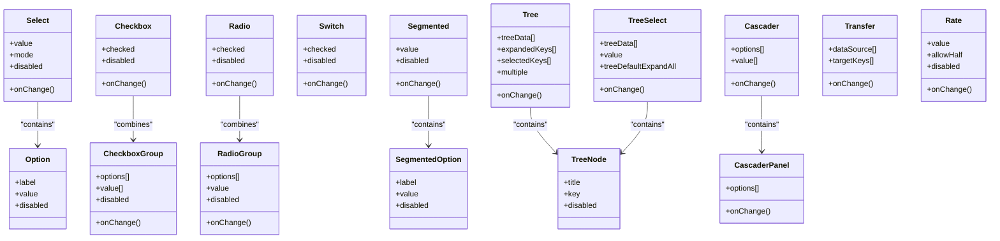

Diagram Source

- [select.tsx](file://frontend/antd/select/select.tsx)
- [option.tsx](file://frontend/antd/select/option/option.tsx)
- [checkbox.tsx](file://frontend/antd/checkbox/checkbox.tsx)
- [group.tsx](file://frontend/antd/checkbox/group/checkbox.group.tsx)
- [radio.tsx](file://frontend/antd/radio/radio.tsx)
- [radio.group.tsx](file://frontend/antd/radio/group/radio.group.tsx)
- [switch.tsx](file://frontend/antd/switch/switch.tsx)
- [segmented.tsx](file://frontend/antd/segmented/segmented.tsx)
- [option.tsx](file://frontend/antd/segmented/option/segmented.option.tsx)
- [tree.tsx](file://frontend/antd/tree/tree.tsx)
- [tree.node.tsx](file://frontend/antd/tree/tree-node/tree.node.tsx)
- [tree.select.tsx](file://frontend/antd/tree-select/tree-select.tsx)
- [tree.node.tsx](file://frontend/antd/tree-select/tree-node/tree.node.tsx)
- [cascader.tsx](file://frontend/antd/cascader/cascader.tsx)
- [panel.tsx](file://frontend/antd/cascader/panel/panel.tsx)
- [option.tsx](file://frontend/antd/cascader/option/option.tsx)
- [transfer.tsx](file://frontend/antd/transfer/transfer.tsx)
- [rate.tsx](file://frontend/antd/rate/rate.tsx)

## Detailed Component Analysis

### Select

- Data binding: supports controlled value and uncontrolled default value; onChange returns the selected value or value array (multi-select).
- Option configuration: declare label/value/disabled via Option child items; supports search filtering and tag backfilling.
- Multi-select mode: when multi-select is enabled, supports tag-style display and clearing individual tags.
- Disabled state: both container and individual items can be disabled; when disabled, cannot be expanded or toggled.
- Context: context.ts centrally handles default values, disabled states, multi-select strategies, and controlled validation.

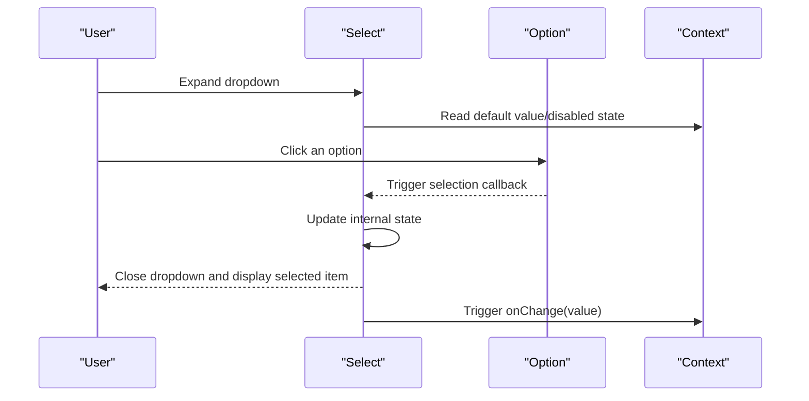

Diagram Source

- [select.tsx](file://frontend/antd/select/select.tsx)
- [option.tsx](file://frontend/antd/select/option/option.tsx)
- [context.ts](file://frontend/antd/select/context.ts)

Section Source

- [select.tsx](file://frontend/antd/select/select.tsx)
- [option.tsx](file://frontend/antd/select/option/option.tsx)
- [context.ts](file://frontend/antd/select/context.ts)

### Checkbox

- Data binding: single Checkbox is a controlled checked value; Checkbox.Group receives value[] and syncs via onChange.
- Option configuration: Group's options[] supports passing label/value/disabled directly; child Checkbox items can also be used.
- Multi-select mode: Group defaults to multi-select; supports select all/deselect all and indeterminate state.
- Disabled state: Group-level disable affects all child items; child items can also be individually disabled.
- Context: context.ts is responsible for default values, disabled states, and multi-select strategies.

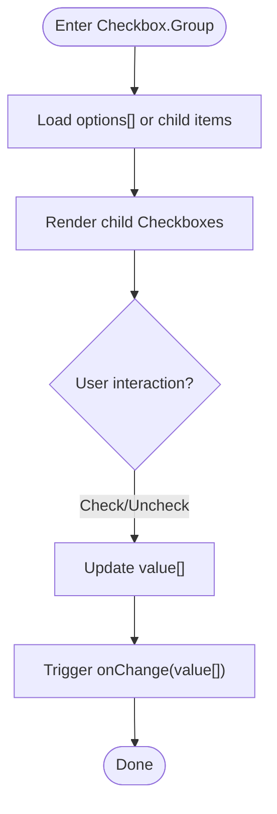

Diagram Source

- [checkbox.tsx](file://frontend/antd/checkbox/checkbox.tsx)
- [group.tsx](file://frontend/antd/checkbox/group/checkbox.group.tsx)
- [context.ts](file://frontend/antd/checkbox/context.ts)

Section Source

- [checkbox.tsx](file://frontend/antd/checkbox/checkbox.tsx)
- [group.tsx](file://frontend/antd/checkbox/group/checkbox.group.tsx)
- [context.ts](file://frontend/antd/checkbox/context.ts)

### Radio

- Data binding: single Radio is a controlled checked value; Radio.Group receives value and syncs via onChange.
- Option configuration: Group's options[] supports label/value/disabled; child Radio items can also be used.
- Multi-select mode: Group is single-select; supports clear and disable.
- Disabled state: Group-level disable affects all child items; child items can also be individually disabled.
- Context: context.ts is responsible for default values, disabled states, and single-select strategies.

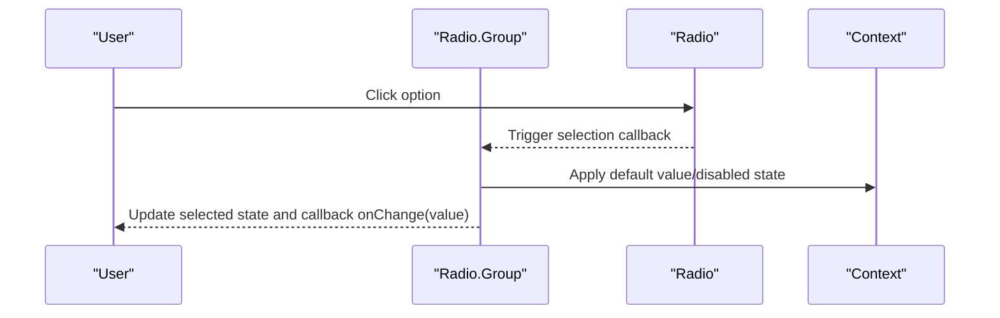

Diagram Source

- [radio.tsx](file://frontend/antd/radio/radio.tsx)
- [radio.group.tsx](file://frontend/antd/radio/group/radio.group.tsx)
- [context.ts](file://frontend/antd/radio/context.ts)

Section Source

- [radio.tsx](file://frontend/antd/radio/radio.tsx)
- [radio.group.tsx](file://frontend/antd/radio/group/radio.group.tsx)
- [context.ts](file://frontend/antd/radio/context.ts)

### Switch

- Data binding: controlled checked value; onChange returns the new boolean value.
- Disabled state: disabled disables interaction; supports loading state.
- Use case: suitable for binary selection, such as "enable/disable" or "yes/no".

Section Source

- [switch.tsx](file://frontend/antd/switch/switch.tsx)

### Segmented

- Data binding: controlled value; onChange returns the selected value.
- Option configuration: supports options[] or child Segmented.Option items; can disable individual items.
- Use case: a compact alternative to Radio.Group, suitable for a small number of discrete options.

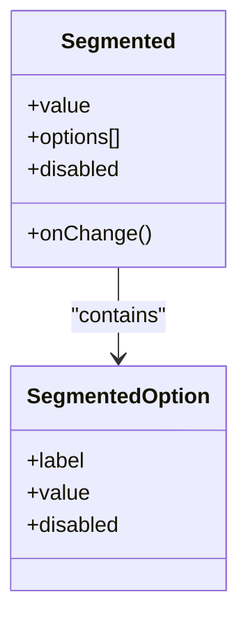

Diagram Source

- [segmented.tsx](file://frontend/antd/segmented/segmented.tsx)
- [option.tsx](file://frontend/antd/segmented/option/segmented.option.tsx)
- [context.ts](file://frontend/antd/segmented/context.ts)

Section Source

- [segmented.tsx](file://frontend/antd/segmented/segmented.tsx)
- [option.tsx](file://frontend/antd/segmented/option/segmented.option.tsx)
- [context.ts](file://frontend/antd/segmented/context.ts)

### Tree

- Data binding: controlled selectedKeys/expandedKeys; onChange returns the selected key set.
- Option configuration: treeData[] supports title/key/children/disabled; supports drag-and-drop, search, and batch selection.
- Multi-select mode: when multiple=true, multi-select is supported; supports both controlled and uncontrolled modes.
- Disabled state: node-level disabled; supports batch disable.

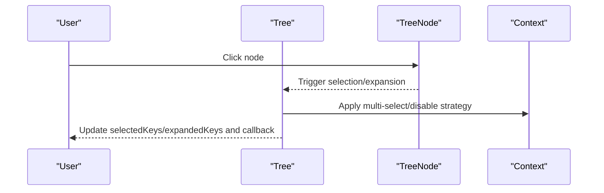

Diagram Source

- [tree.tsx](file://frontend/antd/tree/tree.tsx)
- [tree.node.tsx](file://frontend/antd/tree/tree-node/tree.node.tsx)
- [context.ts](file://frontend/antd/tree/context.ts)

Section Source

- [tree.tsx](file://frontend/antd/tree/tree.tsx)
- [tree.node.tsx](file://frontend/antd/tree/tree-node/tree.node.tsx)
- [context.ts](file://frontend/antd/tree/context.ts)

### TreeSelect

- Data binding: controlled value; onChange returns the selected key.
- Option configuration: treeData[] with option declaration similar to Select; supports search filtering and tag backfilling.
- Multi-select mode: supports multi-select and parent-child linkage strategies (e.g., leaves only).
- Disabled state: supports global and node-level disable.

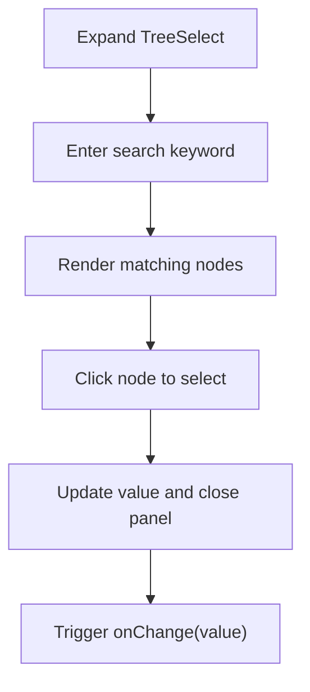

Diagram Source

- [tree.select.tsx](file://frontend/antd/tree-select/tree-select.tsx)
- [tree.node.tsx](file://frontend/antd/tree-select/tree-node/tree.node.tsx)
- [context.ts](file://frontend/antd/tree-select/context.ts)

Section Source

- [tree.select.tsx](file://frontend/antd/tree-select/tree-select.tsx)
- [tree.node.tsx](file://frontend/antd/tree-select/tree-node/tree.node.tsx)
- [context.ts](file://frontend/antd/tree-select/context.ts)

### Cascader

- Data binding: controlled value[]; onChange returns the full path value array.
- Option configuration: options[] supports label/value/children; supports async loading of child levels.
- Multi-select mode: typically single path selection; multiple path selection can be achieved through extensions.
- Disabled state: supports disabling the entire tree and node-level disable.

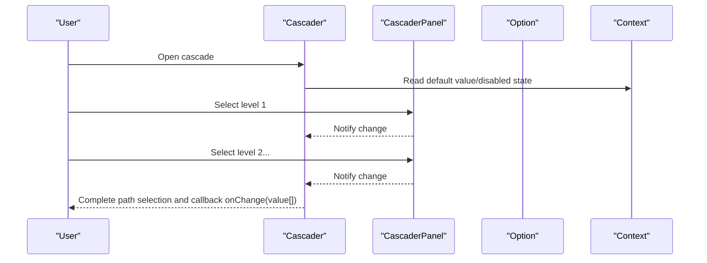

Diagram Source

- [cascader.tsx](file://frontend/antd/cascader/cascader.tsx)
- [panel.tsx](file://frontend/antd/cascader/panel/panel.tsx)
- [option.tsx](file://frontend/antd/cascader/option/option.tsx)
- [context.ts](file://frontend/antd/cascader/context.ts)

Section Source

- [cascader.tsx](file://frontend/antd/cascader/cascader.tsx)
- [panel.tsx](file://frontend/antd/cascader/panel/panel.tsx)
- [option.tsx](file://frontend/antd/cascader/option/option.tsx)
- [context.ts](file://frontend/antd/cascader/context.ts)

### Transfer

- Data binding: controlled targetKeys[]; onChange returns the target list key set.
- Option configuration: dataSource[] supports title/key; supports search filtering and batch operations.
- Multi-select mode: bidirectional movement from left to right; supports select all/deselect all.
- Disabled state: supports global disable and button disable.

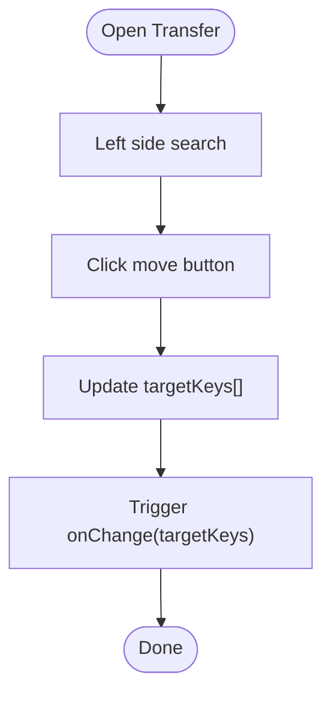

Diagram Source

- [transfer.tsx](file://frontend/antd/transfer/transfer.tsx)

Section Source

- [transfer.tsx](file://frontend/antd/transfer/transfer.tsx)

### Rate

- Data binding: controlled value; onChange returns the rating value.
- Option configuration: supports allowHalf half-star, count total, tooltips text.
- Disabled state: disabled disables interaction; supports read-only mode.
- Use case: quick expression of satisfaction or level rating.

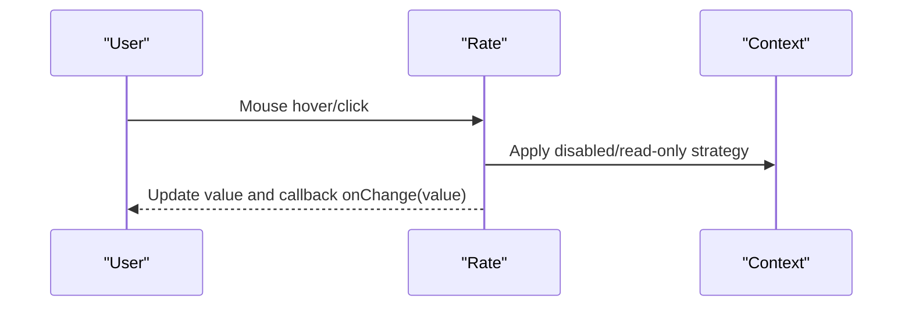

Diagram Source

- [rate.tsx](file://frontend/antd/rate/rate.tsx)
- [context.ts](file://frontend/antd/rate/context.ts)

Section Source

- [rate.tsx](file://frontend/antd/rate/rate.tsx)
- [context.ts](file://frontend/antd/rate/context.ts)

## Dependency Analysis

- Low inter-component coupling: container components combine declaratively with child item components, avoiding tight coupling.
- Centralized context: each component's context.ts aggregates default values, disabled states, and multi-select strategies, reducing duplicate logic.
- Clear event chain: from user interaction to container update to callback, forming a stable data flow.

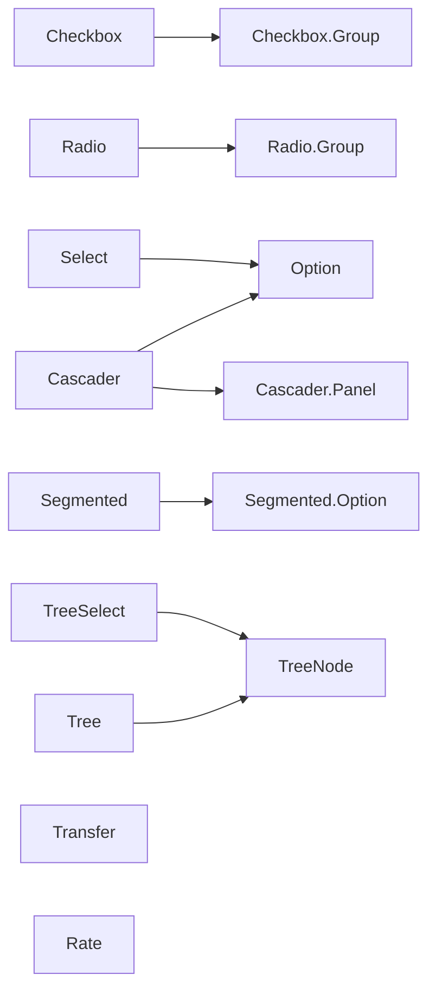

Diagram Source

- [select.tsx](file://frontend/antd/select/select.tsx)
- [checkbox.tsx](file://frontend/antd/checkbox/checkbox.tsx)
- [radio.tsx](file://frontend/antd/radio/radio.tsx)
- [segmented.tsx](file://frontend/antd/segmented/segmented.tsx)
- [tree.tsx](file://frontend/antd/tree/tree.tsx)
- [tree.select.tsx](file://frontend/antd/tree-select/tree-select.tsx)
- [cascader.tsx](file://frontend/antd/cascader/cascader.tsx)
- [transfer.tsx](file://frontend/antd/transfer/transfer.tsx)
- [rate.tsx](file://frontend/antd/rate/rate.tsx)

Section Source

- [select.tsx](file://frontend/antd/select/select.tsx)
- [checkbox.tsx](file://frontend/antd/checkbox/checkbox.tsx)
- [radio.tsx](file://frontend/antd/radio/radio.tsx)
- [segmented.tsx](file://frontend/antd/segmented/segmented.tsx)
- [tree.tsx](file://frontend/antd/tree/tree.tsx)
- [tree.select.tsx](file://frontend/antd/tree-select/tree-select.tsx)
- [cascader.tsx](file://frontend/antd/cascader/cascader.tsx)
- [transfer.tsx](file://frontend/antd/transfer/transfer.tsx)
- [rate.tsx](file://frontend/antd/rate/rate.tsx)

## Performance and Virtual Scrolling

- Recommendations for large option sets:
  - Use virtual scrolling: for long lists (such as Select/Tree/Transfer), use virtual scroll rendering to only render visible area nodes, significantly reducing DOM count and reflow cost.
  - Lazy loading and pagination: for TreeSelect/Cascader, support async loading of child nodes to reduce initial rendering pressure.
  - Caching and debounce: debounce search filtering and onChange callbacks to avoid frequent redraws.
  - Controlled update optimization: merge multiple state changes in the parent form to reduce unnecessary re-renders.
- Specific implementation points:
  - Select: enable virtual scrolling and search filtering for the Option list.
  - Tree/TreeSelect: enable virtual scrolling and lazy loading for node rendering.
  - Transfer: enable virtual scrolling and batch operation optimization for left and right lists.

[This section provides general performance guidance and does not require specific file references]

## Accessibility and Keyboard Navigation

- Keyboard support:
  - Use Tab/Shift+Tab to navigate between options;
  - Use Enter/Space to confirm selection;
  - Use arrow keys to move among multiple options (such as Tree/Select/Cascader).
- Screen reader friendly:
  - Provide semantic labels for each option;
  - Disabled and error states provide aria-\* attributes and hint text;
  - Provide value reading and tooltips for Rate.
- Recommendations:
  - Provide aria-expanded/aria-controls for container components;
  - Provide aria-disabled for disabled options;
  - Provide aria-required for required fields.

[This section provides general accessibility guidance and does not require specific file references]

## Troubleshooting Guide

- Common issues and diagnosis:
  - Selected value not updated: check whether the controlled value and onChange are correctly passed in; confirm consistency of value/checked between container and child items.
  - Multi-select not working: confirm the structure of Group's options[] and the type of value[]; check disabled state and indeterminate state.
  - Disable not working: verify the disabled attribute hierarchy (container vs. child items); check the disable strategy in context.
  - Performance stuttering: enable virtual scrolling for long lists; reduce unnecessary re-renders and deep nesting.
- Debugging recommendations:
  - Print the current value in onChange to verify data flow;
  - Use browser developer tools to observe DOM count and reflow;
  - For TreeSelect/Cascader, check whether async loading is correctly triggered.

Section Source

- [select.tsx](file://frontend/antd/select/select.tsx)
- [checkbox.tsx](file://frontend/antd/checkbox/checkbox.tsx)
- [radio.tsx](file://frontend/antd/radio/radio.tsx)
- [segmented.tsx](file://frontend/antd/segmented/segmented.tsx)
- [tree.tsx](file://frontend/antd/tree/tree.tsx)
- [tree.select.tsx](file://frontend/antd/tree-select/tree-select.tsx)
- [cascader.tsx](file://frontend/antd/cascader/cascader.tsx)
- [transfer.tsx](file://frontend/antd/transfer/transfer.tsx)
- [rate.tsx](file://frontend/antd/rate/rate.tsx)

## Conclusion

Selection components in this project implement a unified container-item-context architecture with good extensibility and maintainability. Through controlled data binding, clear option configuration, and comprehensive disable strategies, they can meet diverse needs ranging from simple binary selection to complex tree/cascading selection. Combined with virtual scrolling and accessibility design, they can maintain a good experience in large-scale data and accessible scenarios.
