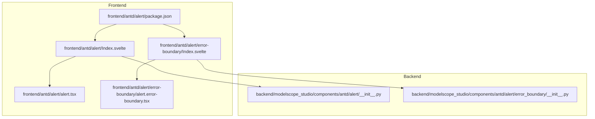
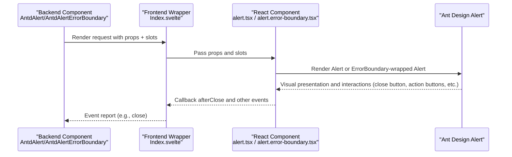
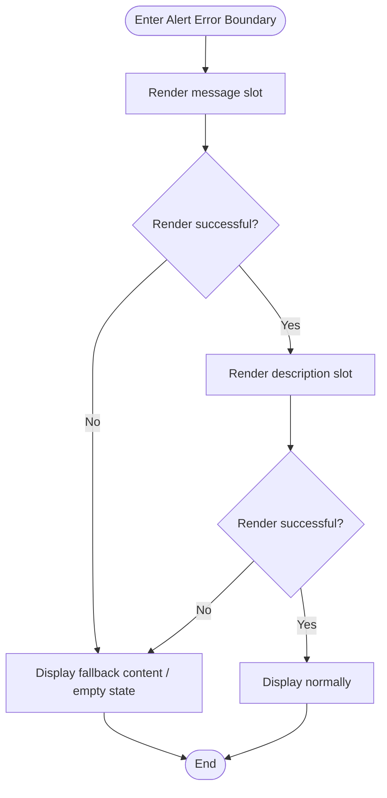
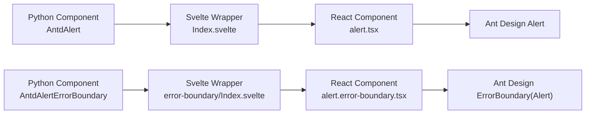

# Alert

<cite>
**Files referenced in this document**
- [frontend/antd/alert/alert.tsx](file://frontend/antd/alert/alert.tsx)
- [frontend/antd/alert/Index.svelte](file://frontend/antd/alert/Index.svelte)
- [frontend/antd/alert/error-boundary/alert.error-boundary.tsx](file://frontend/antd/alert/error-boundary/alert.error-boundary.tsx)
- [frontend/antd/alert/error-boundary/Index.svelte](file://frontend/antd/alert/error-boundary/Index.svelte)
- [backend/modelscope_studio/components/antd/alert/__init__.py](file://backend/modelscope_studio/components/antd/alert/__init__.py)
- [backend/modelscope_studio/components/antd/alert/error_boundary/__init__.py](file://backend/modelscope_studio/components/antd/alert/error_boundary/__init__.py)
- [frontend/antd/alert/package.json](file://frontend/antd/alert/package.json)
- [docs/components/antd/alert/README-zh_CN.md](file://docs/components/antd/alert/README-zh_CN.md)
- [docs/components/antd/alert/README.md](file://docs/components/antd/alert/README.md)
</cite>

## Table of Contents

1. [Introduction](#introduction)
2. [Project Structure](#project-structure)
3. [Core Components](#core-components)
4. [Architecture Overview](#architecture-overview)
5. [Detailed Component Analysis](#detailed-component-analysis)
6. [Dependency Analysis](#dependency-analysis)
7. [Performance Considerations](#performance-considerations)
8. [Troubleshooting Guide](#troubleshooting-guide)
9. [Conclusion](#conclusion)
10. [Appendix](#appendix)

## Introduction

The Alert component is used to convey information or status feedback that requires user attention, commonly used in form validation hints, operation result feedback, system notifications, and similar scenarios. This component is a wrapper around Ant Design's Alert, providing typed variants (success, info, warning, error), closability, icon and description slots, and error boundary wrapping, ensuring stable presentation even in complex rendering scenarios.

## Project Structure

The Alert component is composed of a frontend Svelte wrapper layer and a backend Gradio component layer, with a standalone error boundary version provided to enhance stability.

Diagram sources

- [frontend/antd/alert/Index.svelte:10-47](file://frontend/antd/alert/Index.svelte#L10-L47)
- [frontend/antd/alert/alert.tsx:7-43](file://frontend/antd/alert/alert.tsx#L7-L43)
- [frontend/antd/alert/error-boundary/Index.svelte:10-47](file://frontend/antd/alert/error-boundary/Index.svelte#L10-L47)
- [frontend/antd/alert/error-boundary/alert.error-boundary.tsx:6-32](file://frontend/antd/alert/error-boundary/alert.error-boundary.tsx#L6-L32)
- [backend/modelscope_studio/components/antd/alert/**init**.py:11-71](file://backend/modelscope_studio/components/antd/alert/__init__.py#L11-L71)
- [backend/modelscope_studio/components/antd/alert/error_boundary/**init**.py:10-55](file://backend/modelscope_studio/components/antd/alert/error_boundary/__init__.py#L10-L55)
- [frontend/antd/alert/package.json:1-15](file://frontend/antd/alert/package.json#L1-L15)

Section sources

- [frontend/antd/alert/Index.svelte:1-66](file://frontend/antd/alert/Index.svelte#L1-L66)
- [frontend/antd/alert/alert.tsx:1-46](file://frontend/antd/alert/alert.tsx#L1-L46)
- [frontend/antd/alert/error-boundary/Index.svelte:1-70](file://frontend/antd/alert/error-boundary/Index.svelte#L1-L70)
- [frontend/antd/alert/error-boundary/alert.error-boundary.tsx:1-35](file://frontend/antd/alert/error-boundary/alert.error-boundary.tsx#L1-L35)
- [backend/modelscope_studio/components/antd/alert/**init**.py:1-89](file://backend/modelscope_studio/components/antd/alert/__init__.py#L1-L89)
- [backend/modelscope_studio/components/antd/alert/error_boundary/**init**.py:1-73](file://backend/modelscope_studio/components/antd/alert/error_boundary/__init__.py#L1-L73)
- [frontend/antd/alert/package.json:1-15](file://frontend/antd/alert/package.json#L1-L15)

## Core Components

- Frontend main component: Responsible for wrapping Ant Design's Alert into a Svelte-consumable form, supporting slots (action, closable.closeIcon, description, icon, message), and passing through props and event callbacks.
- Error boundary component: Wraps Alert with an error boundary to ensure that exceptions in the subtree do not crash the entire interface, while retaining slot capabilities for message and description.
- Backend Gradio component: Provides typed parameters (type), slot mapping, event binding (close), and style/class injection capabilities; the error boundary version likewise provides corresponding events and slots.

Section sources

- [frontend/antd/alert/alert.tsx:7-43](file://frontend/antd/alert/alert.tsx#L7-L43)
- [frontend/antd/alert/error-boundary/alert.error-boundary.tsx:6-32](file://frontend/antd/alert/error-boundary/alert.error-boundary.tsx#L6-L32)
- [backend/modelscope_studio/components/antd/alert/**init**.py:11-71](file://backend/modelscope_studio/components/antd/alert/__init__.py#L11-L71)
- [backend/modelscope_studio/components/antd/alert/error_boundary/**init**.py:10-55](file://backend/modelscope_studio/components/antd/alert/error_boundary/__init__.py#L10-L55)

## Architecture Overview

The following sequence diagram illustrates the call chain from the backend Gradio component through the frontend Svelte wrapper layer to the Ant Design component, including the error boundary wrapping path.

Diagram sources

- [backend/modelscope_studio/components/antd/alert/**init**.py:11-71](file://backend/modelscope_studio/components/antd/alert/__init__.py#L11-L71)
- [frontend/antd/alert/Index.svelte:10-47](file://frontend/antd/alert/Index.svelte#L10-L47)
- [frontend/antd/alert/alert.tsx:12-42](file://frontend/antd/alert/alert.tsx#L12-L42)
- [frontend/antd/alert/error-boundary/alert.error-boundary.tsx:17-29](file://frontend/antd/alert/error-boundary/alert.error-boundary.tsx#L17-L29)

## Detailed Component Analysis

### Types and Semantics

- Supported types (type): success, info, warning, error. Each corresponds to a different visual emphasis and semantic meaning, helping users quickly identify the status.
- Semantic guidelines:
  - success: Positive feedback for completed operations or finished workflows
  - info: General hints or supplementary notes
  - warning: Potential issues or operations requiring attention
  - error: Failures, exceptions, or issues requiring immediate action

Section sources

- [backend/modelscope_studio/components/antd/alert/**init**.py:37-37](file://backend/modelscope_studio/components/antd/alert/__init__.py#L37-L37)

### Slots and Customization Points

- Supported slots:
  - action: Custom action area (e.g., a "View Details" button)
  - closable.closeIcon: Custom close icon
  - description: Auxiliary description text / rich content
  - icon: Custom icon
  - message: Title / main message body
- Prop passthrough: All other props are passed directly to Ant Design Alert, including closable, show_icon, banner, after_close, etc.

Section sources

- [backend/modelscope_studio/components/antd/alert/**init**.py:22-23](file://backend/modelscope_studio/components/antd/alert/__init__.py#L22-L23)
- [frontend/antd/alert/alert.tsx:11-43](file://frontend/antd/alert/alert.tsx#L11-L43)

### Events and Interactions

- close event: Fired when the user clicks the close button; the backend can bind handling logic via an event listener.
- after_close callback: Fired after the animation ends; can be used to clean up resources or switch states.
- Keyboard operation: Follows Ant Design behavior by default — typically Tab to navigate to the close button, Enter/Space to trigger closing.

Section sources

- [backend/modelscope_studio/components/antd/alert/**init**.py:16-20](file://backend/modelscope_studio/components/antd/alert/__init__.py#L16-L20)
- [frontend/antd/alert/alert.tsx:13-13](file://frontend/antd/alert/alert.tsx#L13-L13)

### Error Boundary

- Purpose: Captures errors in the Alert subtree to prevent a single slot or content rendering exception from crashing the entire page.
- Use case: When the message/description slots contain dynamic rendering or external data, it is recommended to use the error boundary version.
- Events: Also supports the close event for unified handling of close behavior.

Diagram sources

- [frontend/antd/alert/error-boundary/alert.error-boundary.tsx:17-29](file://frontend/antd/alert/error-boundary/alert.error-boundary.tsx#L17-L29)

Section sources

- [frontend/antd/alert/error-boundary/alert.error-boundary.tsx:6-32](file://frontend/antd/alert/error-boundary/alert.error-boundary.tsx#L6-L32)
- [backend/modelscope_studio/components/antd/alert/error_boundary/**init**.py:10-55](file://backend/modelscope_studio/components/antd/alert/error_boundary/__init__.py#L10-L55)

### Styles and Class Names

- Supports injecting base styles and identifiers via elem_id, elem_classes, elem_style.
- Primary class name prefixes:
  - ms-gr-antd-alert: Main Alert component
  - ms-gr-antd-alert-error-boundary: Error boundary version
- Can be combined with Ant Design's own type, show_icon, closable, and other props to control appearance.

Section sources

- [frontend/antd/alert/Index.svelte:53-53](file://frontend/antd/alert/Index.svelte#L53-L53)
- [frontend/antd/alert/error-boundary/Index.svelte:56-56](file://frontend/antd/alert/error-boundary/Index.svelte#L56-L56)

### Accessibility and Keyboard Support

- Accessibility: Follows Ant Design's default accessibility design to ensure screen readers can read the message and description.
- Keyboard: Tab to navigate to the close button, Enter/Space to close; it is recommended to provide explicit accessible names in the action slot.

Section sources

- [frontend/antd/alert/alert.tsx:17-40](file://frontend/antd/alert/alert.tsx#L17-L40)

### Typical Use Cases

- Form validation hints: Use info/warning/error types, provide specific error information in the description, and offer a "View Details" action.
- Operation feedback: After a successful operation, use the success type to show a brief message with an icon.
- System notifications: Use banner mode with closable to improve visibility and controllability.
- Dynamic content: When message/description comes from external data or async rendering, prefer the error boundary version.

Section sources

- [docs/components/antd/alert/README-zh_CN.md:1-8](file://docs/components/antd/alert/README-zh_CN.md#L1-L8)
- [docs/components/antd/alert/README.md:1-8](file://docs/components/antd/alert/README.md#L1-L8)

## Dependency Analysis

- Frontend export: package.json points both the Gradio and default entries to Index.svelte, ensuring the backend loads it as expected.
- Component coupling: The frontend wrapper is tightly coupled to the Ant Design component, but maintains high extensibility through slots and prop passthrough.
- Backend integration: The backend component resolves the frontend directory via resolve_frontend_dir; events and slots are declared in the Python layer and executed at runtime by the frontend.

Diagram sources

- [frontend/antd/alert/package.json:4-12](file://frontend/antd/alert/package.json#L4-L12)
- [backend/modelscope_studio/components/antd/alert/**init**.py:71-71](file://backend/modelscope_studio/components/antd/alert/__init__.py#L71-L71)
- [backend/modelscope_studio/components/antd/alert/error_boundary/**init**.py:55-55](file://backend/modelscope_studio/components/antd/alert/error_boundary/__init__.py#L55-L55)

Section sources

- [frontend/antd/alert/package.json:1-15](file://frontend/antd/alert/package.json#L1-L15)
- [backend/modelscope_studio/components/antd/alert/**init**.py:71-71](file://backend/modelscope_studio/components/antd/alert/__init__.py#L71-L71)
- [backend/modelscope_studio/components/antd/alert/error_boundary/**init**.py:55-55](file://backend/modelscope_studio/components/antd/alert/error_boundary/__init__.py#L55-L55)

## Performance Considerations

- Avoid frequent re-renders: Use stable values for message/description/icon and other slots; cache computed results in the parent layer when necessary.
- Control slot complexity: Split complex subtrees into components and use them inside the error boundary to reduce overall rendering pressure.
- Use banner judiciously: Banner mode takes up more space; enable it only for critical alerts.
- Event throttling: Avoid heavy synchronous operations in after_close and close event callbacks; use microtasks or debouncing when necessary.

## Troubleshooting Guide

- Slots not working
  - Check that slot names are correct (action, closable.closeIcon, description, icon, message).
  - Confirm the frontend wrapper has passed slots through to the React component.
- Close event not fired
  - Confirm the backend event listener has registered the close event.
  - When closable is an object containing a closeIcon slot, check that it is correctly passed through.
- Error boundary not catching exceptions
  - Confirm the error boundary version of the component is being used.
  - Check that exceptions in the message/description slots are properly wrapped.
- Styles not applied
  - Check that elem_id, elem_classes, elem_style are correctly passed in.
  - Confirm the class name prefix ms-gr-antd-alert or ms-gr-antd-alert-error-boundary has been applied.

Section sources

- [frontend/antd/alert/alert.tsx:11-43](file://frontend/antd/alert/alert.tsx#L11-L43)
- [frontend/antd/alert/error-boundary/alert.error-boundary.tsx:12-29](file://frontend/antd/alert/error-boundary/alert.error-boundary.tsx#L12-L29)
- [backend/modelscope_studio/components/antd/alert/**init**.py:16-23](file://backend/modelscope_studio/components/antd/alert/__init__.py#L16-L23)
- [backend/modelscope_studio/components/antd/alert/error_boundary/**init**.py:14-21](file://backend/modelscope_studio/components/antd/alert/error_boundary/__init__.py#L14-L21)

## Conclusion

The Alert component in this project provides a complete set of capabilities: typed variants, slot support, closability, and error boundary protection. Through a clear separation of responsibilities between the frontend and backend, and a stable export convention, it satisfies both standard alerting needs and maintains robustness in complex rendering scenarios. When dynamic or external content is involved, it is recommended to use the error boundary version and combine the event and style system to deliver a consistent user experience.

## Appendix

- Example entry reference: The demo provided in the documentation is named `basic`; the demonstration effect can be viewed on the corresponding documentation page.

Section sources

- [docs/components/antd/alert/README-zh_CN.md:5-7](file://docs/components/antd/alert/README-zh_CN.md#L5-L7)
- [docs/components/antd/alert/README.md:5-7](file://docs/components/antd/alert/README.md#L5-L7)
