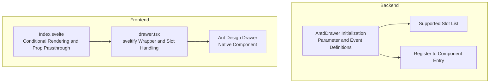
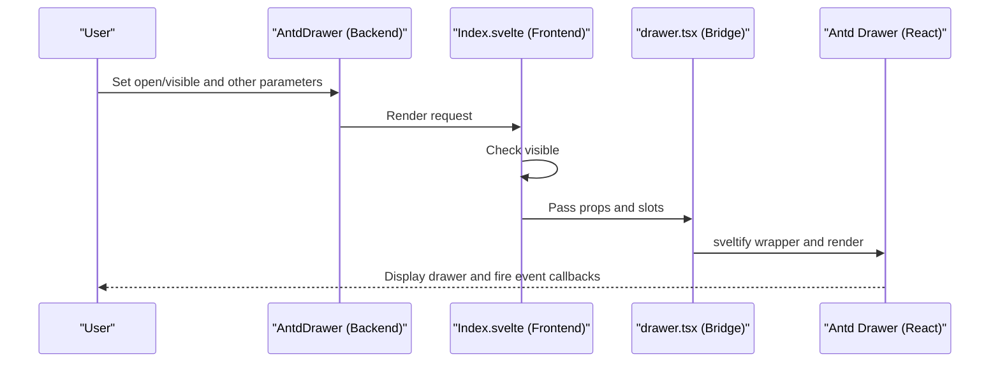
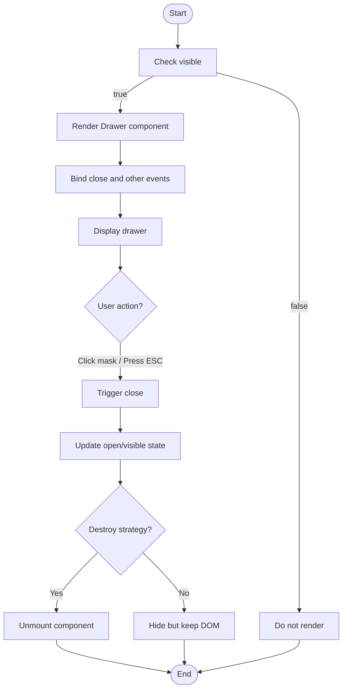
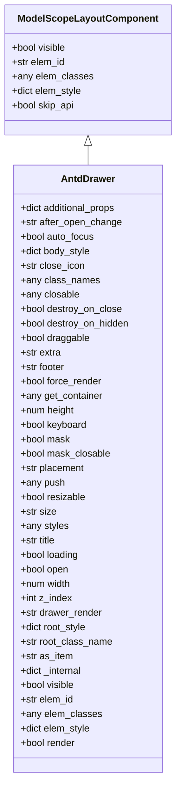

# Drawer

<cite>
**Files referenced in this document**
- [frontend/antd/drawer/drawer.tsx](file://frontend/antd/drawer/drawer.tsx)
- [frontend/antd/drawer/Index.svelte](file://frontend/antd/drawer/Index.svelte)
- [backend/modelscope_studio/components/antd/drawer/__init__.py](file://backend/modelscope_studio/components/antd/drawer/__init__.py)
- [backend/modelscope_studio/components/antd/components.py](file://backend/modelscope_studio/components/antd/components.py)
- [backend/modelscope_studio/utils/dev/component.py](file://backend/modelscope_studio/utils/dev/component.py)
- [docs/components/antd/drawer/README.md](file://docs/components/antd/drawer/README.md)
- [docs/components/antd/drawer/README-zh_CN.md](file://docs/components/antd/drawer/README-zh_CN.md)
- [docs/components/antd/watermark/demos/modal_or_drawer.py](file://docs/components/antd/watermark/demos/modal_or_drawer.py)
- [frontend/antd/layout/layout.base.tsx](file://frontend/antd/layout/layout.base.tsx)
</cite>

## Table of Contents

1. [Introduction](#introduction)
2. [Project Structure](#project-structure)
3. [Core Components](#core-components)
4. [Architecture Overview](#architecture-overview)
5. [Detailed Component Analysis](#detailed-component-analysis)
6. [Dependency Analysis](#dependency-analysis)
7. [Performance Considerations](#performance-considerations)
8. [Troubleshooting Guide](#troubleshooting-guide)
9. [Conclusion](#conclusion)
10. [Appendix](#appendix)

## Introduction

Drawer is a panel that slides out from the edge of the screen, commonly used for sidebar navigation, detail panels, settings panels, and similar scenarios. This component is implemented based on Ant Design Drawer and bridged through the Gradio ecosystem, supporting position configuration (left, right, top, bottom), size control, mask behavior, keyboard interaction, and rich slot extension capabilities. This document systematically describes its layout design, interaction patterns, use cases, and best practices, with directly referenceable example paths.

## Project Structure

The Drawer component consists of a Svelte frontend wrapper and a Python backend component, working together through Gradio's bridging mechanism. The overall structure is as follows:

Diagram sources

- [frontend/antd/drawer/Index.svelte:10-61](file://frontend/antd/drawer/Index.svelte#L10-L61)
- [frontend/antd/drawer/drawer.tsx:14-57](file://frontend/antd/drawer/drawer.tsx#L14-L57)
- [backend/modelscope_studio/components/antd/drawer/**init**.py:10-108](file://backend/modelscope_studio/components/antd/drawer/__init__.py#L10-L108)
- [backend/modelscope_studio/components/antd/components.py:38](file://backend/modelscope_studio/components/antd/components.py#L38)

Section sources

- [frontend/antd/drawer/Index.svelte:1-65](file://frontend/antd/drawer/Index.svelte#L1-L65)
- [frontend/antd/drawer/drawer.tsx:1-60](file://frontend/antd/drawer/drawer.tsx#L1-L60)
- [backend/modelscope_studio/components/antd/drawer/**init**.py:1-126](file://backend/modelscope_studio/components/antd/drawer/__init__.py#L1-L126)
- [backend/modelscope_studio/components/antd/components.py:38](file://backend/modelscope_studio/components/antd/components.py#L38)

## Core Components

- Backend component: AntdDrawer (Python)
  - Supported parameters cover key behaviors such as position, size, mask, keyboard, push, and rendering strategy
  - Defines the close event binding mechanism
  - Exposes multiple slots to support custom title, footer, extra actions, close icon, etc.
- Frontend wrapper: Index.svelte and drawer.tsx
  - Conditional rendering: Loads and mounts the Drawer only when `visible` is true
  - Prop passthrough: Merges Gradio props and additional props and passes them to the underlying component
  - Slot handling: Supports closeIcon, closable.closeIcon, extra, footer, title, drawerRender slots
- Base layout component: Base (layout.base.tsx)
  - Provides the base wrapper for Ant Design Layout, making it easy to build page layouts in conjunction with Drawer

Section sources

- [backend/modelscope_studio/components/antd/drawer/**init**.py:10-108](file://backend/modelscope_studio/components/antd/drawer/__init__.py#L10-L108)
- [frontend/antd/drawer/Index.svelte:13-42](file://frontend/antd/drawer/Index.svelte#L13-L42)
- [frontend/antd/drawer/drawer.tsx:14-57](file://frontend/antd/drawer/drawer.tsx#L14-L57)
- [frontend/antd/layout/layout.base.tsx:6-37](file://frontend/antd/layout/layout.base.tsx#L6-L37)

## Architecture Overview

The Drawer call chain starts from the backend AntdDrawer, goes through the conditional rendering in the frontend Index.svelte, then uses sveltify in drawer.tsx to bridge the React component to the Svelte environment, and finally renders as an Ant Design Drawer. This flow ensures two-way binding of props and events while preserving all capabilities of Ant Design Drawer.

Diagram sources

- [frontend/antd/drawer/Index.svelte:48-61](file://frontend/antd/drawer/Index.svelte#L48-L61)
- [frontend/antd/drawer/drawer.tsx:24-56](file://frontend/antd/drawer/drawer.tsx#L24-L56)
- [backend/modelscope_studio/components/antd/drawer/**init**.py:14-18](file://backend/modelscope_studio/components/antd/drawer/__init__.py#L14-L18)

## Detailed Component Analysis

### Parameters and Slots Overview

- Key parameters (excerpt)
  - Position and size: placement (left/right/top/bottom), width, height, size (default/large)
  - Behavior control: open, keyboard, mask, maskClosable, closable, destroyOnClose, destroyOnHidden, forceRender
  - Layout and rendering: getContainer, push, resizable, drawerRender, as_item, visible, elem_id/elem_classes/elem_style
- Slots
  - closeIcon, closable.closeIcon, extra, footer, title, drawerRender

Section sources

- [backend/modelscope_studio/components/antd/drawer/**init**.py:26-107](file://backend/modelscope_studio/components/antd/drawer/__init__.py#L26-L107)
- [backend/modelscope_studio/components/antd/drawer/**init**.py:20-24](file://backend/modelscope_studio/components/antd/drawer/__init__.py#L20-L24)
- [frontend/antd/drawer/drawer.tsx:14-57](file://frontend/antd/drawer/drawer.tsx#L14-L57)

### Open/Close Mechanism and Events

- Visibility control: Index.svelte controls whether the Drawer is rendered via `visible`
- Event binding: The backend defines the close event listener for updating state on close
- Callback functions: Callbacks such as afterOpenChange are converted into safely passable functions via useFunction

Diagram sources

- [frontend/antd/drawer/Index.svelte:48-61](file://frontend/antd/drawer/Index.svelte#L48-L61)
- [backend/modelscope_studio/components/antd/drawer/**init**.py:14-18](file://backend/modelscope_studio/components/antd/drawer/__init__.py#L14-L18)
- [frontend/antd/drawer/drawer.tsx:24-26](file://frontend/antd/drawer/drawer.tsx#L24-L26)

### Position Configuration and Size Control

- Position: placement supports left, right, top, bottom
- Size: width/height or size (default/large) controls the drawer dimensions
- Push and container: push can be used with a layout to push content; getContainer specifies the mount container

Section sources

- [backend/modelscope_studio/components/antd/drawer/**init**.py:47-50](file://backend/modelscope_studio/components/antd/drawer/__init__.py#L47-L50)
- [backend/modelscope_studio/components/antd/drawer/**init**.py:42-56](file://backend/modelscope_studio/components/antd/drawer/__init__.py#L42-L56)
- [frontend/antd/drawer/drawer.tsx:52-54](file://frontend/antd/drawer/drawer.tsx#L52-L54)

### Mask Behavior and Keyboard Interaction

- Mask: `mask` controls whether the mask is displayed; `maskClosable` controls whether clicking the mask closes the drawer
- Keyboard: `keyboard` controls whether ESC closes the drawer
- Auto focus: `autoFocus` can automatically focus the drawer on open

Section sources

- [backend/modelscope_studio/components/antd/drawer/**init**.py:44-46](file://backend/modelscope_studio/components/antd/drawer/__init__.py#L44-L46)
- [backend/modelscope_studio/components/antd/drawer/**init**.py:31-32](file://backend/modelscope_studio/components/antd/drawer/__init__.py#L31-L32)
- [backend/modelscope_studio/components/antd/drawer/**init**.py:91](file://backend/modelscope_studio/components/antd/drawer/__init__.py#L91)

### Animation and Rendering Strategy

- Animation: Driven by Ant Design Drawer's built-in animation; no additional configuration needed
- Rendering strategy: destroyOnClose, destroyOnHidden, forceRender control the destruction timing and forced rendering

Section sources

- [backend/modelscope_studio/components/antd/drawer/**init**.py:36-39](file://backend/modelscope_studio/components/antd/drawer/__init__.py#L36-L39)
- [backend/modelscope_studio/components/antd/drawer/**init**.py:87-89](file://backend/modelscope_studio/components/antd/drawer/__init__.py#L87-L89)

### Slot and Style Customization

- Slot mapping: closeIcon, closable.closeIcon, extra, footer, title, drawerRender
- Styles: elem_id, elem_classes, elem_style, styles, class_names, root_style, root_class_name
- Custom rendering: drawerRender can receive parameters and return custom rendered content

Section sources

- [backend/modelscope_studio/components/antd/drawer/**init**.py:20-24](file://backend/modelscope_studio/components/antd/drawer/__init__.py#L20-L24)
- [backend/modelscope_studio/components/antd/drawer/**init**.py:33-35](file://backend/modelscope_studio/components/antd/drawer/__init__.py#L33-L35)
- [backend/modelscope_studio/components/antd/drawer/**init**.py:57-60](file://backend/modelscope_studio/components/antd/drawer/__init__.py#L57-L60)
- [frontend/antd/drawer/drawer.tsx:41-51](file://frontend/antd/drawer/drawer.tsx#L41-L51)

### Coordination with Page Layout and Responsive Adaptation

- Layout collaboration: Can be combined with Ant Design Layout (Header/Footer/Content/Sider)
- Responsive: Combined with Flex/Grid and other layout components, adjust drawer width or switch placement based on screen size

Section sources

- [frontend/antd/layout/layout.base.tsx:6-37](file://frontend/antd/layout/layout.base.tsx#L6-L37)

### Accessibility and Mobile Optimization

- Accessibility: The keyboard and focus strategies should be combined with auto-focus and semantic labeling
- Mobile: On small-screen devices, prefer using `bottom` or a smaller `width` to avoid covering main content

Section sources

- [backend/modelscope_studio/components/antd/drawer/**init**.py:91](file://backend/modelscope_studio/components/antd/drawer/__init__.py#L91)
- [backend/modelscope_studio/components/antd/drawer/**init**.py:31-32](file://backend/modelscope_studio/components/antd/drawer/__init__.py#L31-L32)

### Common Use Cases and Example Paths

- Sidebar navigation: Place menu items in the left drawer; update routes or data when a menu item is clicked
- Detail panel: Display detailed content in the right drawer, supporting scrolling and a bottom action area
- Settings panel: Provide settings in the top or bottom drawer, supporting quick toggling and saving
- Example references:
  - Drawer basic usage and extra actions: [docs/components/antd/drawer/README.md](file://docs/components/antd/drawer/README.md)
  - Drawer vs. Modal comparison demo: [docs/components/antd/watermark/demos/modal_or_drawer.py](file://docs/components/antd/watermark/demos/modal_or_drawer.py)

Section sources

- [docs/components/antd/drawer/README.md:1-9](file://docs/components/antd/drawer/README.md#L1-L9)
- [docs/components/antd/watermark/demos/modal_or_drawer.py:19-26](file://docs/components/antd/watermark/demos/modal_or_drawer.py#L19-L26)

## Dependency Analysis

- Component inheritance and context
  - AntdDrawer inherits from ModelScopeLayoutComponent, with the general characteristics of a layout component
  - AppContext is used to ensure the application context is available
- Component registration
  - AntdDrawer is exported from the component entry for unified import and usage

Diagram sources

- [backend/modelscope_studio/utils/dev/component.py:11-50](file://backend/modelscope_studio/utils/dev/component.py#L11-L50)
- [backend/modelscope_studio/components/antd/drawer/**init**.py:10-108](file://backend/modelscope_studio/components/antd/drawer/__init__.py#L10-L108)

Section sources

- [backend/modelscope_studio/utils/dev/component.py:11-50](file://backend/modelscope_studio/utils/dev/component.py#L11-L50)
- [backend/modelscope_studio/components/antd/components.py:38](file://backend/modelscope_studio/components/antd/components.py#L38)

## Performance Considerations

- Conditional rendering: Render the Drawer only when `visible` is true to reduce unnecessary DOM overhead
- Rendering strategy: Use destroyOnClose/destroyOnHidden appropriately to balance memory usage and interaction smoothness
- Slots and custom rendering: Avoid heavy computations in drawerRender; use caching or async processing when necessary

## Troubleshooting Guide

- Drawer not showing
  - Check if visible/open is true
  - Confirm the conditional rendering logic in Index.svelte
- Slots not working
  - Confirm slot names are correct (closeIcon, closable.closeIcon, extra, footer, title, drawerRender)
  - Confirm the slot mapping logic in drawer.tsx
- Close event not fired
  - Check the backend event binding and callback function passing
- Mask not working or clicking does not close
  - Check mask and maskClosable configuration
- Keyboard close not working
  - Check keyboard configuration and auto-focus strategy

Section sources

- [frontend/antd/drawer/Index.svelte:48-61](file://frontend/antd/drawer/Index.svelte#L48-L61)
- [frontend/antd/drawer/drawer.tsx:41-51](file://frontend/antd/drawer/drawer.tsx#L41-L51)
- [backend/modelscope_studio/components/antd/drawer/**init**.py:14-18](file://backend/modelscope_studio/components/antd/drawer/__init__.py#L14-L18)

## Conclusion

The Drawer component, through its integrated frontend-backend design, preserves the native capabilities of Ant Design Drawer while providing more flexible parameter and slot extensions. With conditional rendering and event binding mechanisms, it can efficiently adapt to various interaction scenarios, including sidebar navigation, detail panels, and settings panels. At the layout level, it can work in conjunction with Ant Design Layout; for accessibility and mobile experience, it is recommended to combine keyboard and size strategies to enhance the user experience.

## Appendix

- Example references
  - Drawer basic usage and extra actions: [docs/components/antd/drawer/README.md](file://docs/components/antd/drawer/README.md)
  - Drawer vs. Modal comparison demo: [docs/components/antd/watermark/demos/modal_or_drawer.py](file://docs/components/antd/watermark/demos/modal_or_drawer.py)
- Related documentation
  - Ant Design Drawer official documentation: [Ant Design Drawer](https://ant.design/components/drawer/)
