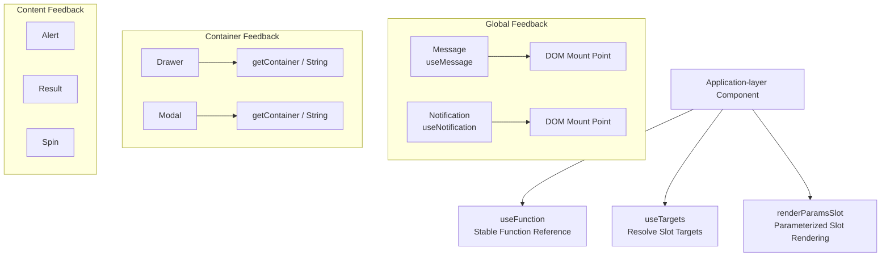
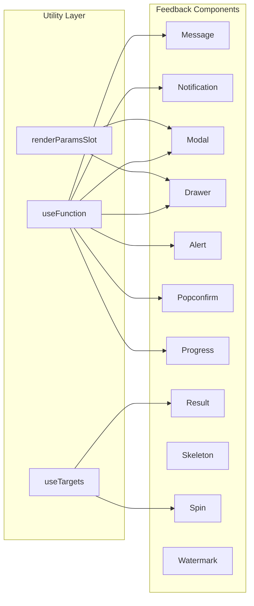

# Feedback Components

<cite>
**Files referenced in this document**
- [alert.tsx](file://frontend/antd/alert/alert.tsx)
- [drawer.tsx](file://frontend/antd/drawer/drawer.tsx)
- [message.tsx](file://frontend/antd/message/message.tsx)
- [modal.tsx](file://frontend/antd/modal/modal.tsx)
- [notification.tsx](file://frontend/antd/notification/notification.tsx)
- [popconfirm.tsx](file://frontend/antd/popconfirm/popconfirm.tsx)
- [progress.tsx](file://frontend/antd/progress/progress.tsx)
- [result.tsx](file://frontend/antd/result/result.tsx)
- [skeleton.tsx](file://frontend/antd/skeleton/skeleton.tsx)
- [spin.tsx](file://frontend/antd/spin/spin.tsx)
- [watermark.tsx](file://frontend/antd/watermark/watermark.tsx)
- [useFunction.ts](file://frontend/utils/hooks/useFunction.ts)
- [useTargets.ts](file://frontend/utils/hooks/useTargets.ts)
- [renderParamsSlot.tsx](file://frontend/utils/renderParamsSlot.tsx)
</cite>

## Table of Contents

1. [Introduction](#introduction)
2. [Project Structure](#project-structure)
3. [Core Components](#core-components)
4. [Architecture Overview](#architecture-overview)
5. [Component Details](#component-details)
6. [Dependency Analysis](#dependency-analysis)
7. [Performance Considerations](#performance-considerations)
8. [Troubleshooting Guide](#troubleshooting-guide)
9. [Conclusion](#conclusion)
10. [Appendix](#appendix)

## Introduction

This document systematically covers the frontend wrappers and usage of Ant Design feedback components, including: Alert, Drawer, Message, Modal, Notification, Popconfirm, Progress, Result, Skeleton, Spin, and Watermark. It focuses on each component's trigger mechanism, display timing, interaction logic, animation and transition state management, error and exception handling strategies, accessibility and keyboard operation support, as well as feedback design patterns for complex interaction scenarios.

## Project Structure

All feedback components reside in the frontend directory and follow a unified wrapping pattern: bridging native Ant Design components to Svelte-style components via `sveltify`; implementing slot-based rendering via ReactSlot and renderParamsSlot; and ensuring correct propagation and ordering of callbacks and slot targets through utility hooks such as useFunction and useTargets.

```mermaid
graph TB
subgraph "Ant Design Feedback Components"
A1["Alert<br/>frontend/antd/alert/alert.tsx"]
A2["Drawer<br/>frontend/antd/drawer/drawer.tsx"]
A3["Message<br/>frontend/antd/message/message.tsx"]
A4["Modal<br/>frontend/antd/modal/modal.tsx"]
A5["Notification<br/>frontend/antd/notification/notification.tsx"]
A6["Popconfirm<br/>frontend/antd/popconfirm/popconfirm.tsx"]
A7["Progress<br/>frontend/antd/progress/progress.tsx"]
A8["Result<br/>frontend/antd/result/result.tsx"]
A9["Skeleton<br/>frontend/antd/skeleton/skeleton.tsx"]
A10["Spin<br/>frontend/antd/spin/spin.tsx"]
A11["Watermark<br/>frontend/antd/watermark/watermark.tsx"]
end
subgraph "Utilities and Hooks"
U1["useFunction<br/>frontend/utils/hooks/useFunction.ts"]
U2["useTargets<br/>frontend/utils/hooks/useTargets.ts"]
U3["renderParamsSlot<br/>frontend/utils/renderParamsSlot.tsx"]
end
A1 --> U1
A2 --> U1
A3 --> U1
A4 --> U1
A5 --> U1
A6 --> U1
A7 --> U1
A8 --> U2
A9 --> U1
A10 --> U2
A11 --> U1
A2 --> U3
A4 --> U3
```

Diagram sources

- [alert.tsx:1-46](file://frontend/antd/alert/alert.tsx#L1-L46)
- [drawer.tsx:1-60](file://frontend/antd/drawer/drawer.tsx#L1-L60)
- [message.tsx:1-79](file://frontend/antd/message/message.tsx#L1-L79)
- [modal.tsx:1-107](file://frontend/antd/modal/modal.tsx#L1-L107)
- [notification.tsx:1-106](file://frontend/antd/notification/notification.tsx#L1-L106)
- [popconfirm.tsx:1-65](file://frontend/antd/popconfirm/popconfirm.tsx#L1-L65)
- [progress.tsx:1-24](file://frontend/antd/progress/progress.tsx#L1-L24)
- [result.tsx:1-33](file://frontend/antd/result/result.tsx#L1-L33)
- [skeleton.tsx:1-7](file://frontend/antd/skeleton/skeleton.tsx#L1-L7)
- [spin.tsx:1-38](file://frontend/antd/spin/spin.tsx#L1-L38)
- [watermark.tsx:1-6](file://frontend/antd/watermark/watermark.tsx#L1-L6)
- [useFunction.ts:1-13](file://frontend/utils/hooks/useFunction.ts#L1-L13)
- [useTargets.ts:1-52](file://frontend/utils/hooks/useTargets.ts#L1-L52)
- [renderParamsSlot.tsx:1-51](file://frontend/utils/renderParamsSlot.tsx#L1-L51)

Section sources

- [alert.tsx:1-46](file://frontend/antd/alert/alert.tsx#L1-L46)
- [drawer.tsx:1-60](file://frontend/antd/drawer/drawer.tsx#L1-L60)
- [message.tsx:1-79](file://frontend/antd/message/message.tsx#L1-L79)
- [modal.tsx:1-107](file://frontend/antd/modal/modal.tsx#L1-L107)
- [notification.tsx:1-106](file://frontend/antd/notification/notification.tsx#L1-L106)
- [popconfirm.tsx:1-65](file://frontend/antd/popconfirm/popconfirm.tsx#L1-L65)
- [progress.tsx:1-24](file://frontend/antd/progress/progress.tsx#L1-L24)
- [result.tsx:1-33](file://frontend/antd/result/result.tsx#L1-L33)
- [skeleton.tsx:1-7](file://frontend/antd/skeleton/skeleton.tsx#L1-L7)
- [spin.tsx:1-38](file://frontend/antd/spin/spin.tsx#L1-L38)
- [watermark.tsx:1-6](file://frontend/antd/watermark/watermark.tsx#L1-L6)
- [useFunction.ts:1-13](file://frontend/utils/hooks/useFunction.ts#L1-L13)
- [useTargets.ts:1-52](file://frontend/utils/hooks/useTargets.ts#L1-L52)
- [renderParamsSlot.tsx:1-51](file://frontend/utils/renderParamsSlot.tsx#L1-L51)

## Core Components

- Unified wrapping: All feedback components wrap native Ant Design components via `sveltify`, preserving their APIs while extending slot capabilities.
- Slot system: ReactSlot renders named slots (e.g., title, description, icon, footer), with some components supporting parameterized slot rendering (renderParamsSlot).
- Callback adaptation: useFunction wraps incoming functions as stable references, avoiding side effects or duplicate subscriptions caused by re-rendering.
- Target selection: useTargets extracts deliverable target nodes from children, supporting complex layouts and conditional rendering.
- Context holder: Message/Notification obtain context holders via useMessage/useNotification, enabling mounting and destruction of global messages and notifications.

Section sources

- [alert.tsx:7-43](file://frontend/antd/alert/alert.tsx#L7-L43)
- [drawer.tsx:14-57](file://frontend/antd/drawer/drawer.tsx#L14-L57)
- [message.tsx:9-76](file://frontend/antd/message/message.tsx#L9-L76)
- [modal.tsx:8-104](file://frontend/antd/modal/modal.tsx#L8-L104)
- [notification.tsx:8-103](file://frontend/antd/notification/notification.tsx#L8-L103)
- [popconfirm.tsx:7-62](file://frontend/antd/popconfirm/popconfirm.tsx#L7-L62)
- [progress.tsx:5-21](file://frontend/antd/progress/progress.tsx#L5-L21)
- [result.tsx:7-30](file://frontend/antd/result/result.tsx#L7-L30)
- [skeleton.tsx:1-7](file://frontend/antd/skeleton/skeleton.tsx#L1-L7)
- [spin.tsx:7-35](file://frontend/antd/spin/spin.tsx#L7-L35)
- [watermark.tsx:1-6](file://frontend/antd/watermark/watermark.tsx#L1-L6)
- [useFunction.ts:5-12](file://frontend/utils/hooks/useFunction.ts#L5-L12)
- [useTargets.ts:5-51](file://frontend/utils/hooks/useTargets.ts#L5-L51)
- [renderParamsSlot.tsx:5-50](file://frontend/utils/renderParamsSlot.tsx#L5-L50)

## Architecture Overview

The runtime architecture of feedback components revolves around "prop passthrough + slot rendering + callback adaptation". For components that need global mounting (Message/Notification), context holders are obtained via useMessage/useNotification and injected into the DOM upon component mount. For container-type components (Drawer/Modal), the mount target is determined via getContainer or a string selector. For content-type components (Alert/Result/Spin), slots control the title, description, icon, extra content, and more.

Diagram sources

- [message.tsx:30-33](file://frontend/antd/message/message.tsx#L30-L33)
- [notification.tsx:31-36](file://frontend/antd/notification/notification.tsx#L31-L36)
- [drawer.tsx:52-54](file://frontend/antd/drawer/drawer.tsx#L52-L54)
- [modal.tsx:96-98](file://frontend/antd/modal/modal.tsx#L96-L98)
- [useFunction.ts:5-12](file://frontend/utils/hooks/useFunction.ts#L5-L12)
- [useTargets.ts:5-51](file://frontend/utils/hooks/useTargets.ts#L5-L51)
- [renderParamsSlot.tsx:5-50](file://frontend/utils/renderParamsSlot.tsx#L5-L50)

## Component Details

### Alert

- Trigger mechanism: Triggered by business state changes or user actions; can be closed via `closable`, which fires the `afterClose` callback.
- Display timing: Shown or hidden based on the data source after page initialization; supports dynamic switching of message/description/icon/action slots.
- Interaction logic: Clicking the close button triggers an animated collapse; the `afterClose` callback can be used for resource cleanup or navigation.
- Animation & transitions: Built-in Ant Design animations; slots allow custom icons and action buttons.
- Error handling: Falls back to prop-provided content when slot content is empty; releases resources after closing.
- Accessibility & keyboard: Follows Ant Design default accessibility; it is recommended to provide explicit ARIA labels for the close button.

Section sources

- [alert.tsx:7-43](file://frontend/antd/alert/alert.tsx#L7-L43)

### Drawer

- Trigger mechanism: Triggered by a button click or route change via `visible`; supports `afterOpenChange` to manage state after opening/closing.
- Display timing: Animates in on first open; animates out on close.
- Interaction logic: Supports custom `closeIcon`, `extra`, `footer`, `title`; `closable.closeIcon` can replace the default close icon.
- Animation & transitions: Controlled by Ant Design's slide-in/slide-out animation; `drawerRender` supports custom rendering logic.
- Error handling: When `getContainer` is a string, it is wrapped via `useFunction`; falls back to the default container on exception.
- Accessibility & keyboard: Maintains native focus order; it is recommended to provide explicit action buttons in the footer.

Section sources

- [drawer.tsx:8-57](file://frontend/antd/drawer/drawer.tsx#L8-L57)

### Message

- Trigger mechanism: Controlled by the `visible` prop; internally uses `messageApi.open` to open the message.
- Display timing: An effect watches for `visible=true` to open the message; `onClose` is triggered when the `duration` expires or the message is manually closed.
- Interaction logic: `onVisible(false)` and `onClose` are synchronized callbacks; supports deduplication via `key` and `destroy`.
- Animation & transitions: Built-in Ant Design animations; content/icon slots can customize content and icons.
- Error handling: The effect cleanup phase calls `destroy`; ensures the message is only opened once on exception.
- Accessibility & keyboard: Automatically mounted to the context holder; it is recommended to provide readable text and concise descriptions.

Section sources

- [message.tsx:19-76](file://frontend/antd/message/message.tsx#L19-L76)

### Modal

- Trigger mechanism: `visible` controls display; `afterOpenChange`/`afterClose` manage lifecycle after opening/closing.
- Display timing: Animates in on first open; animates out on close.
- Interaction logic: ok/cancel text and icons can all be customized via slots; `footer` supports a function or a default value.
- Animation & transitions: Built-in Ant Design animations; `modalRender` supports custom rendering.
- Error handling: When `getContainer` is a string, it is wrapped as a function; when `footer` equals `DEFAULT_FOOTER`, it falls back to `undefined`.
- Accessibility & keyboard: Maintains default focus and ESC closing; it is recommended to provide clear confirm/cancel semantics.

Section sources

- [modal.tsx:22-104](file://frontend/antd/modal/modal.tsx#L22-L104)

### Notification

- Trigger mechanism: `visible` controls display; `open`/`destroy` returned by `useNotification` control the message lifecycle.
- Display timing: An effect watches for `visible=true` to open; `onClose` is triggered when `duration` expires or the notification is manually closed.
- Interaction logic: `onVisible(false)`/`onClose` are synchronized callbacks; supports `placement`, `stack`, `top`/`bottom` positioning.
- Animation & transitions: Built-in Ant Design animations; supports description/icon/actions/btn slots.
- Error handling: The effect cleanup phase calls `destroy`; ensures the notification is only opened once on exception.
- Accessibility & keyboard: It is recommended to provide readable titles and descriptions; supports hover-to-pause and progress bar.

Section sources

- [notification.tsx:18-103](file://frontend/antd/notification/notification.tsx#L18-L103)

### Popconfirm

- Trigger mechanism: A user click triggers the bubble popup; `afterOpenChange` manages the popup open state.
- Display timing: Pops up immediately after clicking the target element; closes after confirm/cancel.
- Interaction logic: ok/cancel text and icons can all be customized via slots; title/description supports clone rendering.
- Animation & transitions: Bubble animation controlled by Ant Design; `getPopupContainer` supports specifying a mount container.
- Error handling: Falls back to props when slot content is empty; keeps interaction available on exception.
- Accessibility & keyboard: Maintains default focus and ESC closing; it is recommended to provide clear confirm/cancel semantics.

Section sources

- [popconfirm.tsx:7-62](file://frontend/antd/popconfirm/popconfirm.tsx#L7-L62)

### Progress

- Trigger mechanism: Value changes drive progress updates; `format` and `rounding` support custom formatting.
- Display timing: Value changes are reflected immediately; supports both static and dynamic modes.
- Interaction logic: `format` and `rounding` are wrapped as stable references via `useFunction`.
- Animation & transitions: Built-in Ant Design animations; supports percentage, status, and custom text.
- Error handling: Out-of-bounds values are handled by Ant Design; keeps the component stable on exception.
- Accessibility & keyboard: No interactive input; it is recommended to provide readable text.

Section sources

- [progress.tsx:5-21](file://frontend/antd/progress/progress.tsx#L5-L21)

### Result

- Trigger mechanism: Displayed after a business operation completes; supports title/subTitle/icon/extra slots.
- Display timing: Rendered immediately once data is ready; children serve as additional content.
- Interaction logic: useTargets resolves slot targets; falls back to children when no slots are provided.
- Animation & transitions: Built-in Ant Design animations; supports multiple status icons and text.
- Error handling: Falls back to props when slot content is empty; keeps content visible on exception.
- Accessibility & keyboard: It is recommended to provide readable titles and descriptions.

Section sources

- [result.tsx:7-30](file://frontend/antd/result/result.tsx#L7-L30)

### Skeleton

- Trigger mechanism: Displays a skeleton before data loads; switches to real content once loading is complete.
- Display timing: Shown immediately on component mount; switches automatically when real content is ready.
- Interaction logic: No interaction; supports animation and shape configuration.
- Animation & transitions: Built-in Ant Design skeleton animation.
- Error handling: Keeps the skeleton stable on exception; it is recommended to provide a timeout fallback.
- Accessibility & keyboard: No interaction; it is recommended to provide ARIA hints for the loading state.

Section sources

- [skeleton.tsx:1-7](file://frontend/antd/skeleton/skeleton.tsx#L1-L7)

### Spin

- Trigger mechanism: Shown when an async task starts; hidden when the task ends.
- Display timing: Shown immediately on component mount; wraps real content when children are empty.
- Interaction logic: useTargets resolves slot targets; tip/indicator supports slots.
- Animation & transitions: Built-in Ant Design spinning animation; supports custom indicator and tip text.
- Error handling: Falls back to props when slot content is empty; keeps the loading state on exception.
- Accessibility & keyboard: It is recommended to provide an ARIA label and loading state hint.

Section sources

- [spin.tsx:7-35](file://frontend/antd/spin/spin.tsx#L7-L35)

### Watermark

- Trigger mechanism: Watermark is generated after page load; supports dynamic updates to text and size.
- Display timing: Takes effect immediately on component mount; suitable for full-screen or localized watermarks.
- Interaction logic: No interaction; supports multi-line text and opacity configuration.
- Animation & transitions: No animation; suitable as a background decoration.
- Error handling: Keeps the watermark stable on exception; it is recommended to provide a fallback solution.
- Accessibility & keyboard: No interaction; does not affect accessibility.

Section sources

- [watermark.tsx:1-6](file://frontend/antd/watermark/watermark.tsx#L1-L6)

## Dependency Analysis

- Inter-component coupling: Feedback components are independent of one another, sharing only utility hooks. Container-type components share getContainer and renderParamsSlot; global-type components share the context holder.
- External dependencies: Native Ant Design components and styles; React Slot rendering; Svelte Preprocess React bridge.
- Circular dependencies: No circular dependencies found; utility hooks are pure functional wrappers.
- Interface contracts: All components maintain compatibility with the Ant Design API via `sveltify`; slot key names and rendering strategies are consistent.

Diagram sources

- [useFunction.ts:5-12](file://frontend/utils/hooks/useFunction.ts#L5-L12)
- [useTargets.ts:5-51](file://frontend/utils/hooks/useTargets.ts#L5-L51)
- [renderParamsSlot.tsx:5-50](file://frontend/utils/renderParamsSlot.tsx#L5-L50)
- [message.tsx:29-33](file://frontend/antd/message/message.tsx#L29-L33)
- [notification.tsx:31-36](file://frontend/antd/notification/notification.tsx#L31-L36)
- [modal.tsx:34-35](file://frontend/antd/modal/modal.tsx#L34-L35)
- [drawer.tsx:27-28](file://frontend/antd/drawer/drawer.tsx#L27-L28)
- [alert.tsx:13-20](file://frontend/antd/alert/alert.tsx#L13-L20)
- [popconfirm.tsx:18-20](file://frontend/antd/popconfirm/popconfirm.tsx#L18-L20)
- [progress.tsx:10-12](file://frontend/antd/progress/progress.tsx#L10-L12)
- [result.tsx:11-12](file://frontend/antd/result/result.tsx#L11-L12)
- [spin.tsx:13-14](file://frontend/antd/spin/spin.tsx#L13-L14)

Section sources

- [useFunction.ts:5-12](file://frontend/utils/hooks/useFunction.ts#L5-L12)
- [useTargets.ts:5-51](file://frontend/utils/hooks/useTargets.ts#L5-L51)
- [renderParamsSlot.tsx:5-50](file://frontend/utils/renderParamsSlot.tsx#L5-L50)
- [message.tsx:29-33](file://frontend/antd/message/message.tsx#L29-L33)
- [notification.tsx:31-36](file://frontend/antd/notification/notification.tsx#L31-L36)
- [modal.tsx:34-35](file://frontend/antd/modal/modal.tsx#L34-L35)
- [drawer.tsx:27-28](file://frontend/antd/drawer/drawer.tsx#L27-L28)
- [alert.tsx:13-20](file://frontend/antd/alert/alert.tsx#L13-L20)
- [popconfirm.tsx:18-20](file://frontend/antd/popconfirm/popconfirm.tsx#L18-L20)
- [progress.tsx:10-12](file://frontend/antd/progress/progress.tsx#L10-L12)
- [result.tsx:11-12](file://frontend/antd/result/result.tsx#L11-L12)
- [spin.tsx:13-14](file://frontend/antd/spin/spin.tsx#L13-L14)

## Performance Considerations

- Stable function references: useFunction wraps callbacks as useMemo references, reducing unnecessary re-renders and side effects.
- Slot rendering optimization: ReactSlot and renderParamsSlot clone and render only when necessary, avoiding full re-layouts.
- Lifecycle management: Message/Notification proactively call `destroy` in the effect cleanup phase to prevent memory leaks.
- Container mounting: When `getContainer` for Drawer/Modal is a string, a wrapper function is used to avoid repeated bindings.
- Conditional rendering: Spin/Result use useTargets and conditional branches to render real content only when slots are present, reducing DOM overhead.

## Troubleshooting Guide

- Slots not working
  - Check that slot key names match the component declarations; confirm that ReactSlot is correctly wrapping them.
  - Reference paths: [alert.tsx:17-40](file://frontend/antd/alert/alert.tsx#L17-L40), [result.tsx:17-27](file://frontend/antd/result/result.tsx#L17-L27), [spin.tsx:20-32](file://frontend/antd/spin/spin.tsx#L20-L32)
- Callbacks not fired or firing repeatedly
  - Use useFunction to wrap callbacks to ensure stable references; check the effect dependency array.
  - Reference paths: [message.tsx:35-68](file://frontend/antd/message/message.tsx#L35-L68), [notification.tsx:38-95](file://frontend/antd/notification/notification.tsx#L38-L95)
- Global message not displayed
  - Confirm the context holder has been rendered; verify that `visible` and `key` are configured correctly; set a reasonable `duration`.
  - Reference paths: [message.tsx:30-33](file://frontend/antd/message/message.tsx#L30-L33), [notification.tsx:31-36](file://frontend/antd/notification/notification.tsx#L31-L36)
- Container mount exception
  - When `getContainer` is a string, ensure it is wrapped as a function; check selector validity.
  - Reference paths: [drawer.tsx:52-54](file://frontend/antd/drawer/drawer.tsx#L52-L54), [modal.tsx:96-98](file://frontend/antd/modal/modal.tsx#L96-L98)
- Animation stuttering or flickering
  - Check if slot content is changing frequently; avoid heavy DOM operations during animations.
  - Reference paths: [progress.tsx:10-12](file://frontend/antd/progress/progress.tsx#L10-L12), [spin.tsx:13-14](file://frontend/antd/spin/spin.tsx#L13-L14)

Section sources

- [alert.tsx:17-40](file://frontend/antd/alert/alert.tsx#L17-L40)
- [result.tsx:17-27](file://frontend/antd/result/result.tsx#L17-L27)
- [spin.tsx:20-32](file://frontend/antd/spin/spin.tsx#L20-L32)
- [message.tsx:30-33](file://frontend/antd/message/message.tsx#L30-L33)
- [notification.tsx:31-36](file://frontend/antd/notification/notification.tsx#L31-L36)
- [drawer.tsx:52-54](file://frontend/antd/drawer/drawer.tsx#L52-L54)
- [modal.tsx:96-98](file://frontend/antd/modal/modal.tsx#L96-L98)
- [progress.tsx:10-12](file://frontend/antd/progress/progress.tsx#L10-L12)

## Conclusion

This repository provides a systematic wrapper for Ant Design feedback components, unifying slot rendering, callback adaptation, and lifecycle management. Through stable function references, conditional rendering, and context holders, it achieves a highly available and maintainable feedback system. It is recommended to select the appropriate component and trigger strategy based on your business scenario in practice, and to pay attention to accessibility and performance details.

## Appendix

- Best practices
  - Use `visible` and `key` to manage the uniqueness and lifecycle of global messages.
  - Provide clear confirm/cancel semantics and keyboard support for important operations.
  - In complex layouts, prefer renderParamsSlot and useTargets to manage slot targets.
  - Provide clear text and visual cues for loading states and error states.
- Complex interaction scenarios
  - Multi-step flows: Use Result to display the final state; Progress to show progress; Spin to wrap critical areas.
  - Global notifications: Place Notification in the top-right or bottom-right corner, supporting stacking and pause-on-hover.
  - Modal confirmation: Use Modal/Popconfirm for critical deletions and dangerous operations to provide a second confirmation.
  - Drawer navigation: Use Drawer as a secondary panel for long lists or settings pages; pay attention to getContainer and z-index management.
