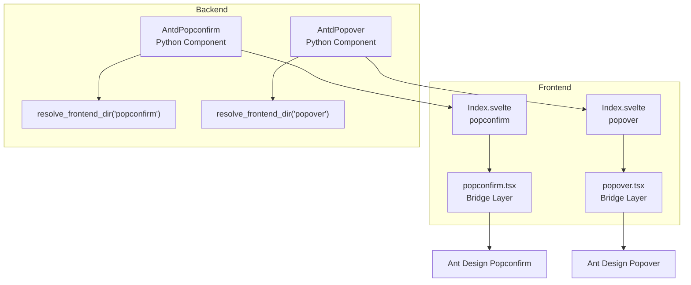
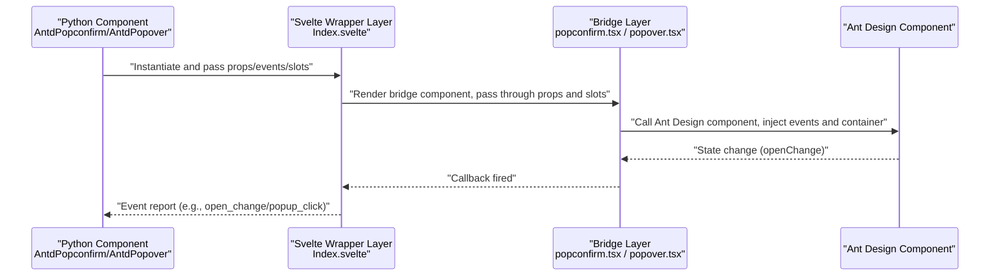
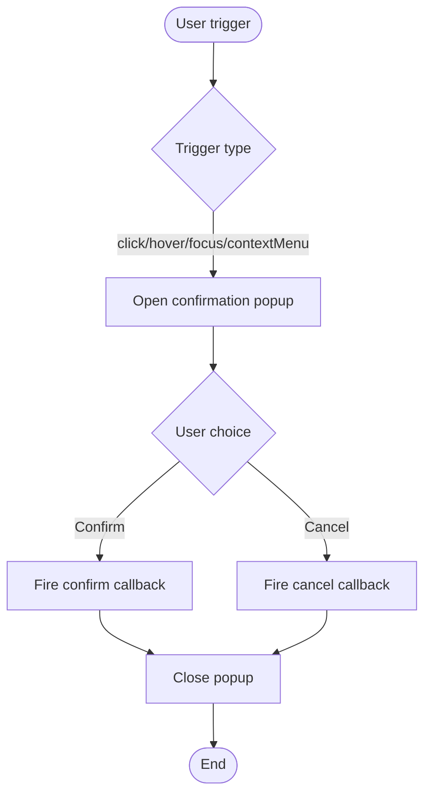
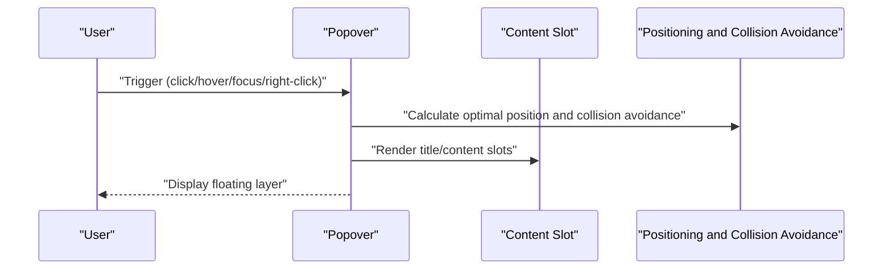
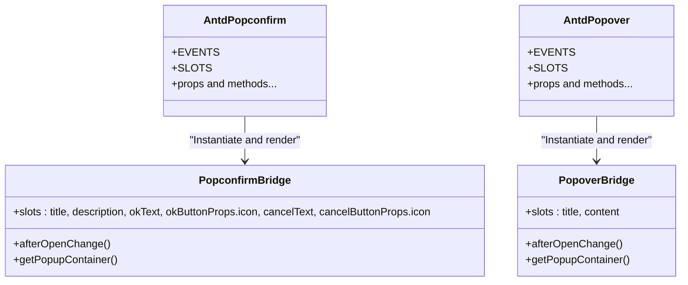
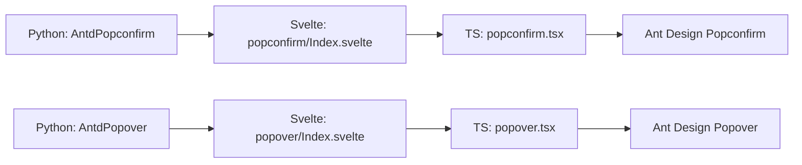

# Interactive Feedback

<cite>
**Files referenced in this document**
- [frontend/antd/popconfirm/popconfirm.tsx](file://frontend/antd/popconfirm/popconfirm.tsx)
- [frontend/antd/popover/popover.tsx](file://frontend/antd/popover/popover.tsx)
- [frontend/antd/popconfirm/Index.svelte](file://frontend/antd/popconfirm/Index.svelte)
- [frontend/antd/popover/Index.svelte](file://frontend/antd/popover/Index.svelte)
- [backend/modelscope_studio/components/antd/popconfirm/__init__.py](file://backend/modelscope_studio/components/antd/popconfirm/__init__.py)
- [backend/modelscope_studio/components/antd/popover/__init__.py](file://backend/modelscope_studio/components/antd/popover/__init__.py)
- [docs/components/antd/popconfirm/README-zh_CN.md](file://docs/components/antd/popconfirm/README-zh_CN.md)
- [docs/components/antd/popover/README-zh_CN.md](file://docs/components/antd/popover/README-zh_CN.md)
</cite>

## Table of Contents

1. [Introduction](#introduction)
2. [Project Structure](#project-structure)
3. [Core Components](#core-components)
4. [Architecture Overview](#architecture-overview)
5. [Detailed Component Analysis](#detailed-component-analysis)
6. [Dependency Analysis](#dependency-analysis)
7. [Performance Considerations](#performance-considerations)
8. [Troubleshooting Guide](#troubleshooting-guide)
9. [Conclusion](#conclusion)
10. [Appendix](#appendix)

## Introduction

This document focuses on two types of components in the interactive feedback component group: Popconfirm (Bubble Confirmation) and Popover (Bubble Card). It provides a systematic explanation from design philosophy, interaction patterns, confirmation flow, content delivery, trigger and positioning strategies, props and events, style customization, and common use cases, along with source-traceable reference paths to help developers quickly understand and correctly use these components.

## Project Structure

These two components use a "Svelte wrapper layer + React component library bridge" pattern on the frontend, with the backend exposing a Python API through Gradio component wrapping. Their organization is as follows:

- Frontend layer: Svelte components handle prop passthrough, slot rendering, and event mapping; the TypeScript bridge layer adapts Ant Design's React components for use in Svelte.
- Backend layer: Python component classes define props, events, slots, and default values, and declare frontend directory mappings so the runtime can load the corresponding frontend components.

Diagram sources

- [frontend/antd/popconfirm/Index.svelte:1-76](file://frontend/antd/popconfirm/Index.svelte#L1-L76)
- [frontend/antd/popover/Index.svelte:1-76](file://frontend/antd/popover/Index.svelte#L1-L76)
- [frontend/antd/popconfirm/popconfirm.tsx:1-65](file://frontend/antd/popconfirm/popconfirm.tsx#L1-L65)
- [frontend/antd/popover/popover.tsx:1-37](file://frontend/antd/popover/popover.tsx#L1-L37)
- [backend/modelscope_studio/components/antd/popconfirm/**init**.py:138-138](file://backend/modelscope_studio/components/antd/popconfirm/__init__.py#L138-L138)
- [backend/modelscope_studio/components/antd/popover/**init**.py:106-106](file://backend/modelscope_studio/components/antd/popover/__init__.py#L106-L106)

Section sources

- [frontend/antd/popconfirm/Index.svelte:1-76](file://frontend/antd/popconfirm/Index.svelte#L1-L76)
- [frontend/antd/popover/Index.svelte:1-76](file://frontend/antd/popover/Index.svelte#L1-L76)
- [backend/modelscope_studio/components/antd/popconfirm/**init**.py:138-138](file://backend/modelscope_studio/components/antd/popconfirm/__init__.py#L138-L138)
- [backend/modelscope_studio/components/antd/popover/**init**.py:106-106](file://backend/modelscope_studio/components/antd/popover/__init__.py#L106-L106)

## Core Components

- Popconfirm
  - Design philosophy: Provides a second confirmation for dangerous or irreversible operations to reduce accidental operation risk.
  - Key interactions: Supports hover/focus/click/contextMenu triggers; provides confirm/cancel dual buttons with text/icon slots.
  - Confirmation flow: Clicking confirm fires the callback; cancel closes the popup; supports controlled `open` state and controlled event callbacks.
- Popover
  - Design philosophy: Provides contextual information hints or lightweight action entry points for target elements without changing the page layout.
  - Key interactions: Supports hover/focus/click/contextMenu triggers; title and content can be slotted, with automatic collision avoidance and positioning.

Section sources

- [backend/modelscope_studio/components/antd/popconfirm/**init**.py:10-27](file://backend/modelscope_studio/components/antd/popconfirm/__init__.py#L10-L27)
- [backend/modelscope_studio/components/antd/popover/**init**.py:10-18](file://backend/modelscope_studio/components/antd/popover/__init__.py#L10-L18)

## Architecture Overview

The following diagram shows the call chain and data flow from the frontend Svelte to the backend Python component.

Diagram sources

- [frontend/antd/popconfirm/Index.svelte:24-55](file://frontend/antd/popconfirm/Index.svelte#L24-L55)
- [frontend/antd/popover/Index.svelte:24-52](file://frontend/antd/popover/Index.svelte#L24-L52)
- [frontend/antd/popconfirm/popconfirm.tsx:17-62](file://frontend/antd/popconfirm/popconfirm.tsx#L17-L62)
- [frontend/antd/popover/popover.tsx:10-34](file://frontend/antd/popover/popover.tsx#L10-L34)
- [backend/modelscope_studio/components/antd/popconfirm/**init**.py:14-27](file://backend/modelscope_studio/components/antd/popconfirm/__init__.py#L14-L27)
- [backend/modelscope_studio/components/antd/popover/**init**.py:14-18](file://backend/modelscope_studio/components/antd/popover/__init__.py#L14-L18)

## Detailed Component Analysis

### Popconfirm

- Design philosophy and interaction pattern
  - Targeting "high-risk operations", reduces accidental trigger cost through a second confirmation.
  - Supports multiple trigger modes; the popup provides confirm/cancel buttons with an optional icon.
- Props and events
  - Key props: title, description, confirm text/button props, cancel text/button props, trigger type, positioning and collision avoidance, container mount point, delay, z-index, etc.
  - Key events: open_change, cancel, confirm, popup_click.
  - Key slots: title, description, okText, okButtonProps.icon, cancelText, cancelButtonProps.icon.
- Callbacks and state
  - Get open/close state changes via `afterOpenChange`.
  - Customize the mount container via `getPopupContainer` for positioning and z-index control in complex layouts.
- Use cases
  - Delete confirmation, edit confirmation, batch operation confirmation, etc.

Diagram sources

- [backend/modelscope_studio/components/antd/popconfirm/**init**.py:14-27](file://backend/modelscope_studio/components/antd/popconfirm/__init__.py#L14-L27)
- [frontend/antd/popconfirm/popconfirm.tsx:17-62](file://frontend/antd/popconfirm/popconfirm.tsx#L17-L62)

Section sources

- [backend/modelscope_studio/components/antd/popconfirm/**init**.py:10-137](file://backend/modelscope_studio/components/antd/popconfirm/__init__.py#L10-L137)
- [frontend/antd/popconfirm/popconfirm.tsx:7-62](file://frontend/antd/popconfirm/popconfirm.tsx#L7-L62)
- [frontend/antd/popconfirm/Index.svelte:24-75](file://frontend/antd/popconfirm/Index.svelte#L24-L75)

### Popover

- Design philosophy and interaction pattern
  - Provides non-intrusive information display and lightweight action entry points.
  - Supports title and content slots, with automatic collision avoidance and multi-directional positioning.
- Props and events
  - Key props: title, content, trigger type, placement, arrow, color, container mount point, delay, z-index, etc.
  - Key events: open_change.
  - Key slots: title, content.
- Use cases
  - Information hints, action menus, supplementary explanations, etc.

Diagram sources

- [backend/modelscope_studio/components/antd/popover/**init**.py:14-18](file://backend/modelscope_studio/components/antd/popover/__init__.py#L14-L18)
- [frontend/antd/popover/popover.tsx:10-34](file://frontend/antd/popover/popover.tsx#L10-L34)

Section sources

- [backend/modelscope_studio/components/antd/popover/**init**.py:10-104](file://backend/modelscope_studio/components/antd/popover/__init__.py#L10-L104)
- [frontend/antd/popover/popover.tsx:7-34](file://frontend/antd/popover/popover.tsx#L7-L34)
- [frontend/antd/popover/Index.svelte:24-72](file://frontend/antd/popover/Index.svelte#L24-L72)

### Component Classes and Bridge Layer Relationships

Diagram sources

- [backend/modelscope_studio/components/antd/popconfirm/**init**.py:10-37](file://backend/modelscope_studio/components/antd/popconfirm/__init__.py#L10-L37)
- [frontend/antd/popconfirm/popconfirm.tsx:7-17](file://frontend/antd/popconfirm/popconfirm.tsx#L7-L17)
- [backend/modelscope_studio/components/antd/popover/**init**.py:10-21](file://backend/modelscope_studio/components/antd/popover/__init__.py#L10-L21)
- [frontend/antd/popover/popover.tsx:7-12](file://frontend/antd/popover/popover.tsx#L7-L12)

## Dependency Analysis

- Frontend dependencies
  - The Svelte wrapper layer depends on the bridge layer; the bridge layer depends on the Ant Design React component library.
  - Events and slots are passed across frameworks through function wrapping and ReactSlot rendering.
- Backend dependencies
  - Python component classes map the component name to the frontend directory via resolve_frontend_dir, ensuring the runtime can load it.
- Coupling and cohesion
  - Component responsibilities are clear: Python handles prop/event/slot definitions, Svelte handles prop passthrough and event mapping, and the TS bridge layer handles slot rendering and callback wrapping.

Diagram sources

- [backend/modelscope_studio/components/antd/popconfirm/**init**.py:138-138](file://backend/modelscope_studio/components/antd/popconfirm/__init__.py#L138-L138)
- [frontend/antd/popconfirm/Index.svelte:10-10](file://frontend/antd/popconfirm/Index.svelte#L10-L10)
- [frontend/antd/popconfirm/popconfirm.tsx:1-5](file://frontend/antd/popconfirm/popconfirm.tsx#L1-L5)
- [backend/modelscope_studio/components/antd/popover/**init**.py:106-106](file://backend/modelscope_studio/components/antd/popover/__init__.py#L106-L106)
- [frontend/antd/popover/Index.svelte:10-10](file://frontend/antd/popover/Index.svelte#L10-L10)
- [frontend/antd/popover/popover.tsx:1-5](file://frontend/antd/popover/popover.tsx#L1-L5)

Section sources

- [backend/modelscope_studio/components/antd/popconfirm/**init**.py:138-138](file://backend/modelscope_studio/components/antd/popconfirm/__init__.py#L138-L138)
- [backend/modelscope_studio/components/antd/popover/**init**.py:106-106](file://backend/modelscope_studio/components/antd/popover/__init__.py#L106-L106)
- [frontend/antd/popconfirm/Index.svelte:10-10](file://frontend/antd/popconfirm/Index.svelte#L10-L10)
- [frontend/antd/popover/Index.svelte:10-10](file://frontend/antd/popover/Index.svelte#L10-L10)
- [frontend/antd/popconfirm/popconfirm.tsx:1-5](file://frontend/antd/popconfirm/popconfirm.tsx#L1-L5)
- [frontend/antd/popover/popover.tsx:1-5](file://frontend/antd/popover/popover.tsx#L1-L5)

## Performance Considerations

- Lazy loading and lazy rendering
  - The Svelte wrapper layer uses dynamic component imports to avoid an oversized initial bundle.
- Slot rendering optimization
  - Slot content is rendered only when needed, reducing unnecessary virtual DOM updates.
- Container mounting and z-index management
  - Mount the popup to an appropriate container via `getPopupContainer` to avoid z-index conflicts and reflows.
- Delay and destruction strategy
  - Set appropriate mouse enter/leave delays to avoid frequent flickering; choose hide-then-destroy strategy based on the scenario to save memory.

## Troubleshooting Guide

- Cannot open/close
  - Check that the trigger type and `open` state are consistent; confirm `open_change` event is correctly bound.
  - Reference paths: [frontend/antd/popconfirm/Index.svelte:24-55](file://frontend/antd/popconfirm/Index.svelte#L24-L55), [frontend/antd/popover/Index.svelte:24-52](file://frontend/antd/popover/Index.svelte#L24-L52)
- Content not displayed or misaligned
  - Confirm slot names and rendering logic; check if getPopupContainer returns a valid container.
  - Reference paths: [frontend/antd/popconfirm/popconfirm.tsx:17-62](file://frontend/antd/popconfirm/popconfirm.tsx#L17-L62), [frontend/antd/popover/popover.tsx:10-34](file://frontend/antd/popover/popover.tsx#L10-L34)
- Events not fired
  - Confirm backend event listeners match frontend event mapping; check that callback function wrapping is effective.
  - Reference paths: [backend/modelscope_studio/components/antd/popconfirm/**init**.py:14-27](file://backend/modelscope_studio/components/antd/popconfirm/__init__.py#L14-L27), [backend/modelscope_studio/components/antd/popover/**init**.py:14-18](file://backend/modelscope_studio/components/antd/popover/__init__.py#L14-L18)

Section sources

- [frontend/antd/popconfirm/Index.svelte:24-55](file://frontend/antd/popconfirm/Index.svelte#L24-L55)
- [frontend/antd/popover/Index.svelte:24-52](file://frontend/antd/popover/Index.svelte#L24-L52)
- [frontend/antd/popconfirm/popconfirm.tsx:17-62](file://frontend/antd/popconfirm/popconfirm.tsx#L17-L62)
- [frontend/antd/popover/popover.tsx:10-34](file://frontend/antd/popover/popover.tsx#L10-L34)
- [backend/modelscope_studio/components/antd/popconfirm/**init**.py:14-27](file://backend/modelscope_studio/components/antd/popconfirm/__init__.py#L14-L27)
- [backend/modelscope_studio/components/antd/popover/**init**.py:14-18](file://backend/modelscope_studio/components/antd/popover/__init__.py#L14-L18)

## Conclusion

Popconfirm and Popover are implemented in this project through a unified architecture of "Python component + Svelte wrapper + TS bridge + Ant Design component", ensuring behavioral consistency with Ant Design while providing flexible slot and event extension capabilities. By making proper use of triggers, positioning, container mounting, and event callbacks, stable and user-friendly interaction experiences can be achieved in complex interfaces.

## Appendix

- Example entries
  - Popconfirm example entry: [docs/components/antd/popconfirm/README-zh_CN.md:5-8](file://docs/components/antd/popconfirm/README-zh_CN.md#L5-L8)
  - Popover example entry: [docs/components/antd/popover/README-zh_CN.md:5-8](file://docs/components/antd/popover/README-zh_CN.md#L5-L8)
