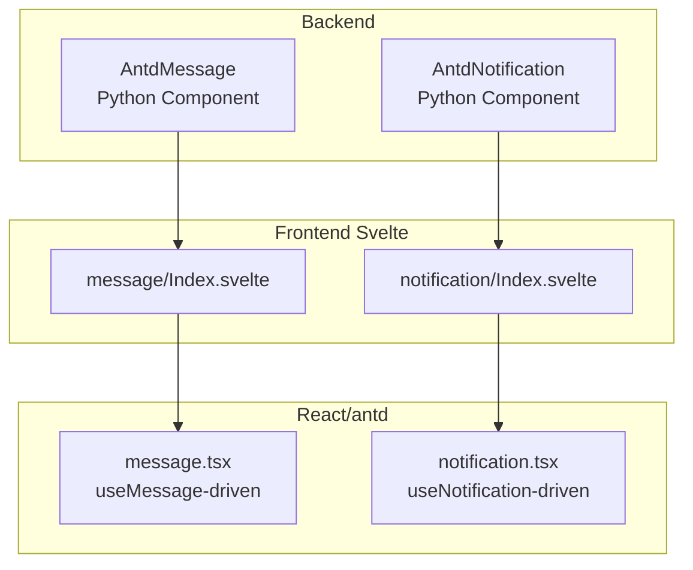
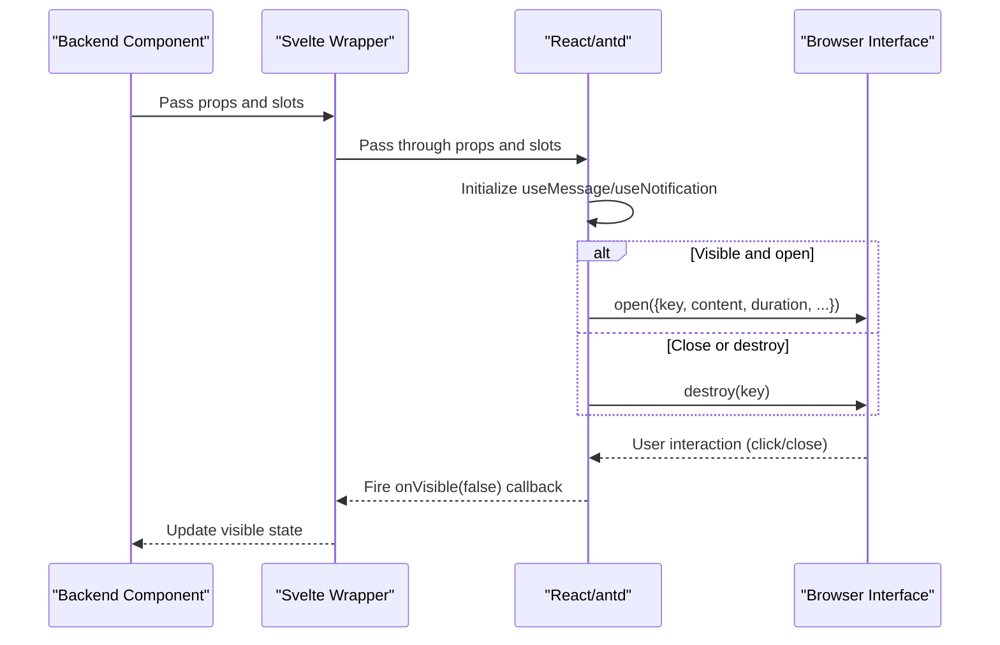
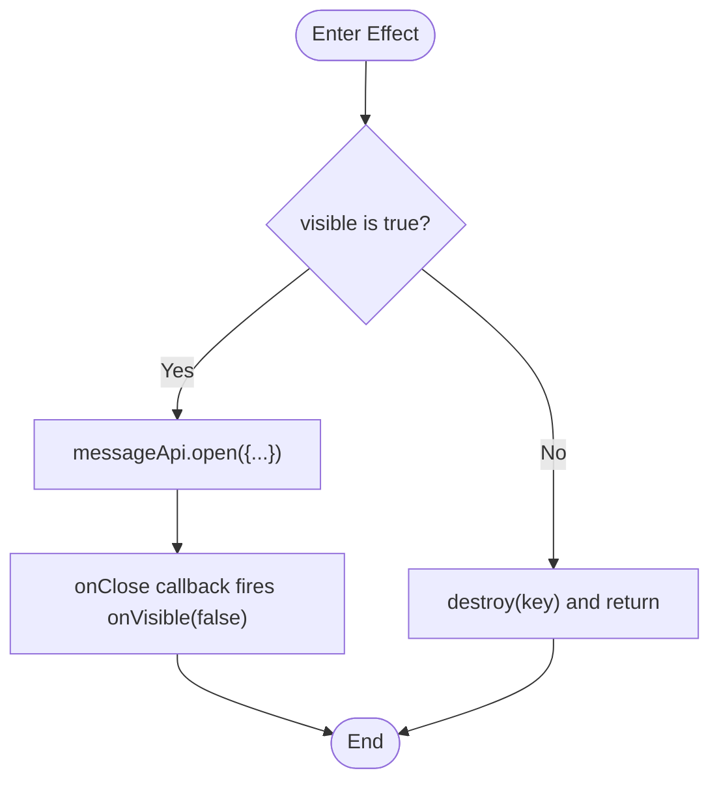
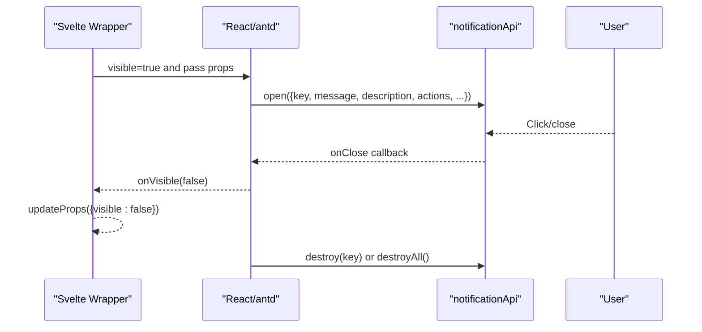
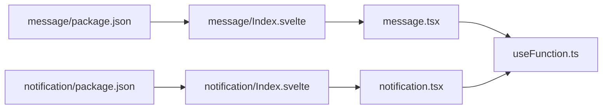

# Message and Notification

<cite>
**Files referenced in this document**
- [frontend/antd/message/message.tsx](file://frontend/antd/message/message.tsx)
- [frontend/antd/notification/notification.tsx](file://frontend/antd/notification/notification.tsx)
- [frontend/antd/message/Index.svelte](file://frontend/antd/message/Index.svelte)
- [frontend/antd/notification/Index.svelte](file://frontend/antd/notification/Index.svelte)
- [backend/modelscope_studio/components/antd/message/__init__.py](file://backend/modelscope_studio/components/antd/message/__init__.py)
- [backend/modelscope_studio/components/antd/notification/__init__.py](file://backend/modelscope_studio/components/antd/notification/__init__.py)
- [frontend/utils/hooks/useFunction.ts](file://frontend/utils/hooks/useFunction.ts)
- [frontend/antd/message/package.json](file://frontend/antd/message/package.json)
- [frontend/antd/notification/package.json](file://frontend/antd/notification/package.json)
</cite>

## Table of Contents

1. [Introduction](#introduction)
2. [Project Structure](#project-structure)
3. [Core Components](#core-components)
4. [Architecture Overview](#architecture-overview)
5. [Detailed Component Analysis](#detailed-component-analysis)
6. [Dependency Analysis](#dependency-analysis)
7. [Performance and Memory Management](#performance-and-memory-management)
8. [Troubleshooting Guide](#troubleshooting-guide)
9. [Conclusion](#conclusion)
10. [Appendix: Usage Examples and Best Practices](#appendix-usage-examples-and-best-practices)

## Introduction

This document systematically covers the message notification component group, focusing on two types of global feedback components: Message and Notification. It provides a complete explanation covering design philosophy, use cases, comparison of differences, configuration options and dynamic behavior, lifecycle and memory cleanup, accessibility and experience optimization, along with source-traceable path references to help developers get started quickly and use the components correctly.

## Project Structure

The message notification components are built from three layers: "backend Python component + frontend Svelte wrapper + React/antd implementation":

- The backend component is responsible for parameter validation, event binding, rendering control, and frontend package export declarations.
- The frontend Svelte layer is responsible for prop passthrough, slot mapping, and visibility state synchronization.
- The React layer implements the specific message popup, stacking, and destruction logic based on the antd message/notification API.

Diagram sources

- [backend/modelscope_studio/components/antd/message/**init**.py:10-91](file://backend/modelscope_studio/components/antd/message/__init__.py#L10-L91)
- [backend/modelscope_studio/components/antd/notification/**init**.py:10-109](file://backend/modelscope_studio/components/antd/notification/__init__.py#L10-L109)
- [frontend/antd/message/Index.svelte:10-78](file://frontend/antd/message/Index.svelte#L10-L78)
- [frontend/antd/notification/Index.svelte:10-80](file://frontend/antd/notification/Index.svelte#L10-L80)
- [frontend/antd/message/message.tsx:9-79](file://frontend/antd/message/message.tsx#L9-L79)
- [frontend/antd/notification/notification.tsx:8-106](file://frontend/antd/notification/notification.tsx#L8-L106)

Section sources

- [frontend/antd/message/package.json:1-15](file://frontend/antd/message/package.json#L1-L15)
- [frontend/antd/notification/package.json:1-15](file://frontend/antd/notification/package.json#L1-L15)

## Core Components

- Message
  - Design goal: Provide immediate, concise feedback for user actions, commonly used for submit success/failure, warning, or loading hints.
  - Key features: Lightweight, no mask, auto-dismiss, configurable duration, key-based uniqueness and override control.
- Notification
  - Design goal: Pop up richer content in a page corner, suitable for reminders that need to carry a title, description, buttons, actions, etc.
  - Key features: Supports multiple placement positions (top/bottom/left/right), stacking management, progress bar, hover-to-pause, customizable buttons and actions.

Section sources

- [backend/modelscope_studio/components/antd/message/**init**.py:10-91](file://backend/modelscope_studio/components/antd/message/__init__.py#L10-L91)
- [backend/modelscope_studio/components/antd/notification/**init**.py:10-109](file://backend/modelscope_studio/components/antd/notification/__init__.py#L10-L109)

## Architecture Overview

The message component call chain is: backend component instantiation → frontend Svelte rendering → React/antd executes open/destroy → lifecycle callbacks trigger state propagation back.

Diagram sources

- [frontend/antd/message/message.tsx:30-68](file://frontend/antd/message/message.tsx#L30-L68)
- [frontend/antd/notification/notification.tsx:31-95](file://frontend/antd/notification/notification.tsx#L31-L95)
- [frontend/antd/message/Index.svelte:58-77](file://frontend/antd/message/Index.svelte#L58-L77)
- [frontend/antd/notification/Index.svelte:59-79](file://frontend/antd/notification/Index.svelte#L59-L79)

## Detailed Component Analysis

### Message Component

- Responsibilities and behavior
  - Provides global message capabilities based on antd's `message.useMessage`;
  - Supports controlling visibility via `visible` and uniqueness via `messageKey`;
  - Supports `slots.content` and `slots.icon` for custom content and icons;
  - Fires `onVisible(false)` on close and destroys the corresponding key when the component unmounts.
- Key configuration options (excerpt)
  - Content and type: content, type (success/info/warning/error/loading)
  - Display duration: duration (seconds)
  - Container mount point: getContainer (function)
  - Text and styles: className, style, rootClassName
  - Key and visibility: messageKey, visible
- Dynamic updates and batch operations
  - Use messageKey to override and update the same message position;
  - Multiple messages can coexist without interfering with each other;
  - Use `destroy(key)` or `destroyAll()` for batch cleanup.
- Lifecycle and memory
  - Registered on open; destroyed on close/unmount; avoids residual DOM and event listeners.

Diagram sources

- [frontend/antd/message/message.tsx:35-68](file://frontend/antd/message/message.tsx#L35-L68)

Section sources

- [frontend/antd/message/message.tsx:9-79](file://frontend/antd/message/message.tsx#L9-L79)
- [frontend/antd/message/Index.svelte:19-77](file://frontend/antd/message/Index.svelte#L19-L77)
- [backend/modelscope_studio/components/antd/message/**init**.py:26-72](file://backend/modelscope_studio/components/antd/message/__init__.py#L26-L72)

### Notification Component

- Responsibilities and behavior
  - Provides global notification capabilities based on antd's `notification.useNotification`;
  - Supports multiple positions (top/bottom/left/right and combinations) and stacking management;
  - Supports rich slots: slots.message/description/icon/actions/btn/closeIcon;
  - Fires `onVisible(false)` on close and destroys the corresponding key on unmount.
- Key configuration options (excerpt)
  - Position and stacking: placement, stack, top, bottom, rtl
  - Content and interaction: message, description, btn, actions, closeIcon, icon
  - Behavior and experience: duration, showProgress, pauseOnHover, role (alert/status)
  - Key and visibility: notificationKey, visible
- Dynamic updates and batch operations
  - Use notificationKey to override the same notification;
  - Supports `destroyAll()` for batch cleanup;
  - In stacking mode, controls the arrangement and override strategy for new and old notifications.
- Lifecycle and memory
  - Registered on open; destroyed on close/unmount; avoids memory leaks.

Diagram sources

- [frontend/antd/notification/notification.tsx:38-95](file://frontend/antd/notification/notification.tsx#L38-L95)
- [frontend/antd/notification/Index.svelte:59-79](file://frontend/antd/notification/Index.svelte#L59-L79)

Section sources

- [frontend/antd/notification/notification.tsx:8-106](file://frontend/antd/notification/notification.tsx#L8-L106)
- [frontend/antd/notification/Index.svelte:19-79](file://frontend/antd/notification/Index.svelte#L19-L79)
- [backend/modelscope_studio/components/antd/notification/**init**.py:26-90](file://backend/modelscope_studio/components/antd/notification/__init__.py#L26-L90)

### Differences and Use Cases

- Use cases
  - Message: Lightweight feedback, short text hints, no need for complex interaction;
  - Notification: Requires a title/description/buttons/actions, multiple position display, emphasizes important information.
- Display position and stacking
  - Message: Appears at the top of the container or in a specified container by default; does not support multiple positions;
  - Notification: Supports top/bottom/left/right and combinations, with stacking management and progress bar.
- Interaction and accessibility
  - Notification: Supports `role` (alert/status) for screen reader identification;
  - Message: More oriented toward one-time hints with minimal interaction.
- Dynamic and batch operations
  - Both support key-based uniqueness and override; Notification makes it easier to implement batch cleanup and stacking strategies.

Section sources

- [backend/modelscope_studio/components/antd/message/**init**.py:26-72](file://backend/modelscope_studio/components/antd/message/__init__.py#L26-L72)
- [backend/modelscope_studio/components/antd/notification/**init**.py:26-90](file://backend/modelscope_studio/components/antd/notification/__init__.py#L26-L90)

## Dependency Analysis

- Component export and entry
  - Both message and notification expose Gradio-compatible entry points via package.json;
- Frontend bridge
  - The Svelte wrapper handles prop and slot passthrough, and writes back the `visible` state;
  - The React layer safely injects functions like getContainer into the antd API via useFunction;
- Events and slots
  - The backend declares click/close events; the Svelte side binds them via the `_internal` flag;
  - Slot mapping: Message (content/icon), Notification (actions/btn/closeIcon/description/icon/message/title).

Diagram sources

- [frontend/antd/message/package.json:1-15](file://frontend/antd/message/package.json#L1-L15)
- [frontend/antd/notification/package.json:1-15](file://frontend/antd/notification/package.json#L1-L15)
- [frontend/antd/message/Index.svelte:10](file://frontend/antd/message/Index.svelte#L10)
- [frontend/antd/notification/Index.svelte:10](file://frontend/antd/notification/Index.svelte#L10)
- [frontend/antd/message/message.tsx:29](file://frontend/antd/message/message.tsx#L29)
- [frontend/antd/notification/notification.tsx:31](file://frontend/antd/notification/notification.tsx#L31)
- [frontend/utils/hooks/useFunction.ts:5-12](file://frontend/utils/hooks/useFunction.ts#L5-L12)

Section sources

- [frontend/utils/hooks/useFunction.ts:1-13](file://frontend/utils/hooks/useFunction.ts#L1-L13)

## Performance and Memory Management

- Performance characteristics
  - Message: Lightweight, no mask, small DOM count — suitable for high-frequency hints;
  - Notification: Supports stacking and progress bar with stronger visual feedback, but DOM count may increase.
- Memory cleanup strategy
  - Uniformly call `destroy(key)`/`destroyAll()` on close and unmount;
  - Use key to precisely control resource reclamation, avoiding duplicate rendering and event accumulation;
  - Use getContainer to mount messages to the minimum necessary container, reducing reflow and repaint.
- Best practices
  - Set a unique key for each independent message;
  - Set a reasonable `duration` to avoid too many messages persisting for too long;
  - Use `destroyAll()` in batch operations to clean up expired messages;
  - For frequently triggered operations, prefer Message; introduce Notification only when necessary.

Section sources

- [frontend/antd/message/message.tsx:51-58](file://frontend/antd/message/message.tsx#L51-L58)
- [frontend/antd/notification/notification.tsx:74-77](file://frontend/antd/notification/notification.tsx#L74-L77)

## Troubleshooting Guide

- Common issues
  - Message not displayed: Check if `visible` is true and that `messageKey` is correctly passed in;
  - Cannot be closed: Confirm the `onClose` callback has not been overridden; ensure the `onVisible` callback chain is functioning correctly;
  - Duplicate messages: Set a unique key for each message to avoid being overridden by subsequent `open` calls;
  - Position is wrong: Confirm the mount node returned by `getContainer` exists and is visible.
- Debugging steps
  - Print props and visible state in the Svelte layer;
  - Confirm messageApi/notificationApi has been initialized in the React layer;
  - Use `destroyAll()` to quickly clear the slate and verify whether any DOM remains;
  - Check that the getContainer function consistently returns the same node.

Section sources

- [frontend/antd/message/message.tsx:35-68](file://frontend/antd/message/message.tsx#L35-L68)
- [frontend/antd/notification/notification.tsx:38-95](file://frontend/antd/notification/notification.tsx#L38-L95)

## Conclusion

The message notification component group implements highly available and extensible global feedback capabilities through a layered design of "backend parameters + frontend bridge + React/antd driver". Message is suitable for lightweight hints; Notification is suitable for rich notifications. By applying reasonable key strategies, duration configuration, and destruction mechanisms, excellent performance and memory health can be maintained while ensuring a great user experience.

## Appendix: Usage Examples and Best Practices

- Success hint (Message)
  - Set `type` to `success`, use an appropriate `duration`, and make `messageKey` unique;
  - Toggle display via `visible`; synchronize visible state with `onClose`.
  - Example path reference: [frontend/antd/message/message.tsx:35-50](file://frontend/antd/message/message.tsx#L35-L50)
- Error alert (Notification)
  - Set `type` to `error`, enrich content with `message`/`description`, and provide operations via `actions`;
  - Use `destroyAll()` to clean up historical error messages and prevent accumulation.
  - Example path reference: [frontend/antd/notification/notification.tsx:38-69](file://frontend/antd/notification/notification.tsx#L38-L69)
- Info notification (Notification)
  - Use `placement` to specify position (e.g., topRight); set `role` to `status`;
  - Control stacking with `stack`; improve readability with `pauseOnHover`.
  - Example path reference: [frontend/antd/notification/notification.tsx:31-36](file://frontend/antd/notification/notification.tsx#L31-L36)
- Manual close
  - Proactively close via `onVisible(false)`, or call `destroy(key)` externally;
  - Example path reference: [frontend/antd/message/message.tsx:46-50](file://frontend/antd/message/message.tsx#L46-L50), [frontend/antd/notification/notification.tsx:65-69](file://frontend/antd/notification/notification.tsx#L65-L69)
- Dynamic updates and batch operations
  - Use `messageKey` to override an existing message;
  - Use `destroyAll()` for batch cleanup to avoid memory leaks.
  - Example path reference: [frontend/antd/message/message.tsx:51-58](file://frontend/antd/message/message.tsx#L51-L58), [frontend/antd/notification/notification.tsx:74-77](file://frontend/antd/notification/notification.tsx#L74-L77)

Accessibility and experience optimization recommendations

- Set `role` (alert/status) on Notification to improve accessibility;
- Set a reasonable `duration` to avoid interrupting user tasks;
- Provide clear feedback text and action buttons for key operations;
- In dark themes or high-contrast environments, ensure message colors and icons are clearly distinguishable.

Section sources

- [backend/modelscope_studio/components/antd/notification/**init**.py:40-44](file://backend/modelscope_studio/components/antd/notification/__init__.py#L40-L44)
- [frontend/antd/notification/notification.tsx:65-69](file://frontend/antd/notification/notification.tsx#L65-L69)
