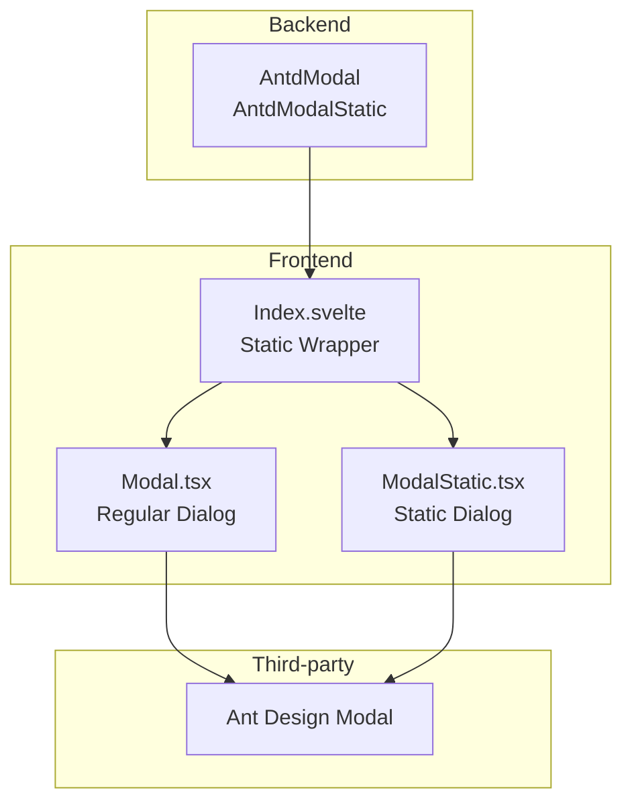
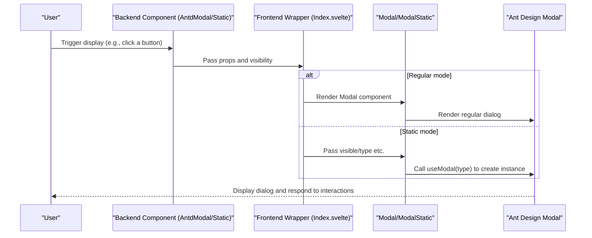
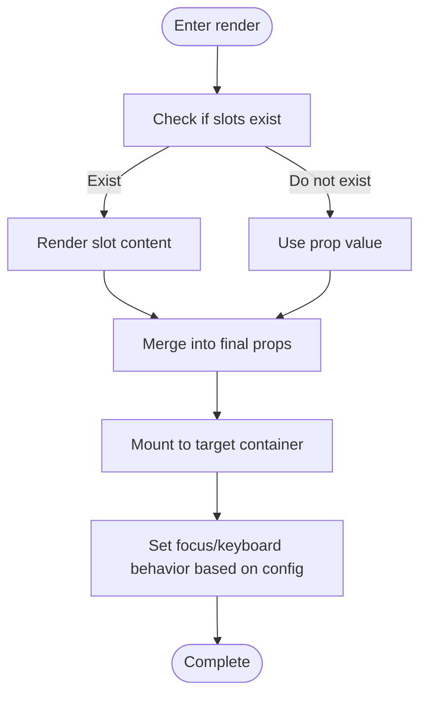
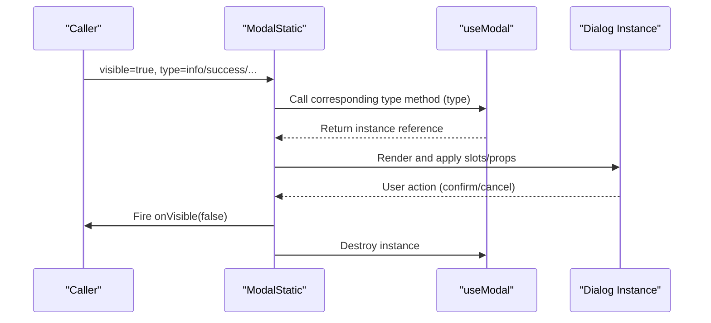
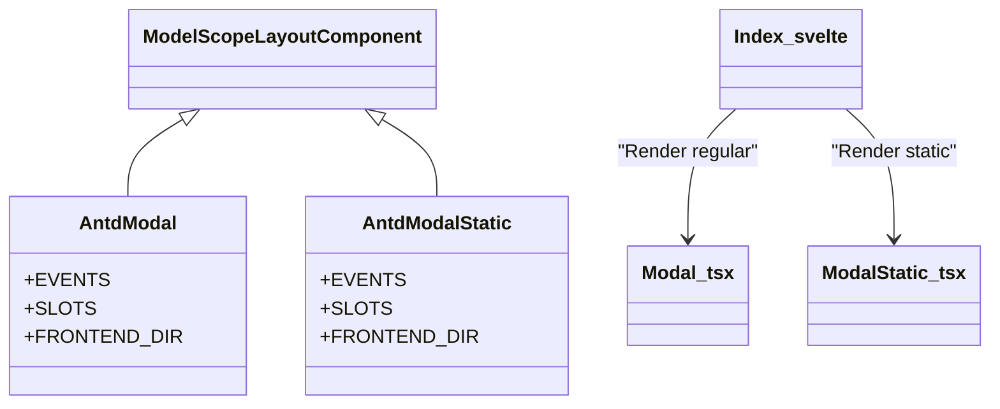
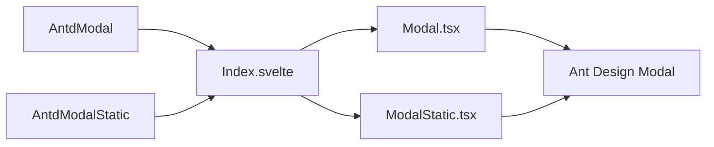

# Modal

<cite>
**Files referenced in this document**
- [frontend/antd/modal/modal.tsx](file://frontend/antd/modal/modal.tsx)
- [frontend/antd/modal/static/modal.static.tsx](file://frontend/antd/modal/static/modal.static.tsx)
- [backend/modelscope_studio/components/antd/modal/__init__.py](file://backend/modelscope_studio/components/antd/modal/__init__.py)
- [backend/modelscope_studio/components/antd/modal/static/__init__.py](file://backend/modelscope_studio/components/antd/modal/static/__init__.py)
- [frontend/antd/modal/static/Index.svelte](file://frontend/antd/modal/static/Index.svelte)
- [docs/components/antd/modal/README.md](file://docs/components/antd/modal/README.md)
- [docs/components/antd/modal/demos/basic.py](file://docs/components/antd/modal/demos/basic.py)
- [docs/components/antd/modal/demos/custom_footer.py](file://docs/components/antd/modal/demos/custom_footer.py)
- [docs/components/antd/modal/demos/static.py](file://docs/components/antd/modal/demos/static.py)
</cite>

## Table of Contents

1. [Introduction](#introduction)
2. [Project Structure](#project-structure)
3. [Core Components](#core-components)
4. [Architecture Overview](#architecture-overview)
5. [Component Details](#component-details)
6. [Dependency Analysis](#dependency-analysis)
7. [Performance and Animation](#performance-and-animation)
8. [Accessibility and Keyboard Interaction](#accessibility-and-keyboard-interaction)
9. [Troubleshooting](#troubleshooting)
10. [Conclusion](#conclusion)
11. [Appendix: Common Scenario Examples](#appendix-common-scenario-examples)

## Introduction

This document systematically covers the "Modal" component group, including the design principles, use cases, z-index management, focus control, keyboard interaction, event and style customization, animation and transitions, performance optimization, and accessibility support for both regular Modal and Static Modal. The document also provides practical guidance based on repository examples to help developers efficiently integrate and extend the components in the Gradio/ModelScope ecosystem.

## Project Structure

This component is positioned between the frontend Ant Design wrapper layer and the backend Python component bridge layer, using a layered design of "Frontend Svelte + React Slot + Backend LayoutComponent":

- Frontend layer: Wraps Ant Design's Modal as a slottable component via `sveltify`; the static modal dynamically renders via the useModal API.
- Backend layer: Python components encapsulate AntdModal/AntdModalStatic, exposing a unified property and event interface and declaring supported slots.
- Documentation and examples: Provides three types of examples — basic, custom footer, and static call — for quick onboarding.

Diagram sources

- [frontend/antd/modal/modal.tsx:1-107](file://frontend/antd/modal/modal.tsx#L1-L107)
- [frontend/antd/modal/static/modal.static.tsx:1-132](file://frontend/antd/modal/static/modal.static.tsx#L1-L132)
- [frontend/antd/modal/static/Index.svelte:1-69](file://frontend/antd/modal/static/Index.svelte#L1-L69)
- [backend/modelscope_studio/components/antd/modal/**init**.py:1-136](file://backend/modelscope_studio/components/antd/modal/__init__.py#L1-L136)
- [backend/modelscope_studio/components/antd/modal/static/**init**.py:1-133](file://backend/modelscope_studio/components/antd/modal/static/__init__.py#L1-L133)

Section sources

- [docs/components/antd/modal/README.md:1-13](file://docs/components/antd/modal/README.md#L1-L13)

## Core Components

- Regular Modal (AntdModal)
  - Design positioning: Rendered directly as a component, suitable for scenarios that need to explicitly manage the lifecycle and z-index in the layout tree.
  - Key capabilities: Supports slottable title, footer, button icons and text, close icon, custom renderer, container mount point, keyboard and mask behavior, etc.
- Static Modal (AntdModalStatic)
  - Design positioning: Dynamically triggered via useModal without needing to be declared in the layout tree, suitable for one-time dialogs such as message hints and confirmation flows.
  - Key capabilities: Supports info/success/error/warning/confirm types, auto-focus buttons, controlled visibility, onOk/onCancel callback linkage.

Section sources

- [backend/modelscope_studio/components/antd/modal/**init**.py:11-136](file://backend/modelscope_studio/components/antd/modal/__init__.py#L11-L136)
- [backend/modelscope_studio/components/antd/modal/static/**init**.py:10-133](file://backend/modelscope_studio/components/antd/modal/static/__init__.py#L10-L133)

## Architecture Overview

The following diagram shows the key call chain from user trigger to dialog presentation, including both regular and static modes:

Diagram sources

- [frontend/antd/modal/static/Index.svelte:54-68](file://frontend/antd/modal/static/Index.svelte#L54-L68)
- [frontend/antd/modal/modal.tsx:36-102](file://frontend/antd/modal/modal.tsx#L36-L102)
- [frontend/antd/modal/static/modal.static.tsx:46-128](file://frontend/antd/modal/static/modal.static.tsx#L46-L128)

## Component Details

### Regular Modal

- Slot and prop mapping
  - Supported slots: okText, okButtonProps.icon, cancelText, cancelButtonProps.icon, closable.closeIcon, closeIcon, footer, title, modalRender.
  - Prop passthrough: afterOpenChange, afterClose, getContainer, keyboard, mask, maskClosable, width, zIndex, wrapClassName, etc.
- Event binding
  - ok/cancel events are bound via event listeners to trigger callbacks or update visibility.
- Container mount and z-index
  - getContainer can specify the mount node to avoid the z-index being blocked by a local container; defaults to mounting to body.
- Focus and keyboard
  - `keyboard` controls whether Esc is allowed to close; `autoFocusButton` and similar props affect the initial focus.
- Custom rendering
  - `modalRender` can replace the entire rendering logic; `footer` supports function-based slots for complex footer layouts.

Diagram sources

- [frontend/antd/modal/modal.tsx:36-99](file://frontend/antd/modal/modal.tsx#L36-L99)

Section sources

- [frontend/antd/modal/modal.tsx:1-107](file://frontend/antd/modal/modal.tsx#L1-L107)
- [backend/modelscope_studio/components/antd/modal/**init**.py:18-32](file://backend/modelscope_studio/components/antd/modal/__init__.py#L18-L32)

### Static Modal

- Dynamic creation and destruction
  - Obtains the API via `useModal`; creates the corresponding type instance when `visible` is true, otherwise destroys the current instance.
  - Auto-focus on buttons is disabled by default unless explicitly passed in.
- Event and visibility linkage
  - onOk/onCancel internally synchronize `onVisible(false)`, implementing the consistent behavior of "confirm/cancel = close".
- Slots and props
  - Supports title, content, footer, okText, okButtonProps.icon, cancelText, cancelButtonProps.icon, closable.closeIcon, closeIcon, modalRender, etc.
- Usage restrictions
  - Not declared in the layout tree; driven only by props such as visible/type; suitable for one-time hints and confirmation flows.

Diagram sources

- [frontend/antd/modal/static/modal.static.tsx:46-128](file://frontend/antd/modal/static/modal.static.tsx#L46-L128)

Section sources

- [frontend/antd/modal/static/modal.static.tsx:1-132](file://frontend/antd/modal/static/modal.static.tsx#L1-L132)
- [backend/modelscope_studio/components/antd/modal/static/**init**.py:14-28](file://backend/modelscope_studio/components/antd/modal/static/__init__.py#L14-L28)

### Component Relationships and Inheritance

- The backend component classes AntdModal and AntdModalStatic both inherit from ModelScopeLayoutComponent, which unifies event, slot, prop, and lifecycle handling.
- The frontend Index.svelte serves as the dynamic loading entry point, responsible for passing props and slots to Modal or ModalStatic.

Diagram sources

- [backend/modelscope_studio/components/antd/modal/**init**.py:11-16](file://backend/modelscope_studio/components/antd/modal/__init__.py#L11-L16)
- [backend/modelscope_studio/components/antd/modal/static/**init**.py:10-13](file://backend/modelscope_studio/components/antd/modal/static/__init__.py#L10-L13)
- [frontend/antd/modal/static/Index.svelte:10-68](file://frontend/antd/modal/static/Index.svelte#L10-L68)

## Dependency Analysis

- Frontend dependencies
  - sveltify: Bridges React components to Svelte.
  - useFunction: Stabilizes callback functions to avoid side effects from repeated rendering.
  - renderParamsSlot: Supports slot rendering with parameters.
  - Ant Design Modal: Core UI behavior and styles.
- Backend dependencies
  - Gradio event system: Binds ok/cancel via event listeners.
  - Component base class ModelScopeLayoutComponent: Unifies lifecycle and prop handling.

Diagram sources

- [frontend/antd/modal/modal.tsx:1-107](file://frontend/antd/modal/modal.tsx#L1-L107)
- [frontend/antd/modal/static/modal.static.tsx:1-132](file://frontend/antd/modal/static/modal.static.tsx#L1-L132)
- [frontend/antd/modal/static/Index.svelte:1-69](file://frontend/antd/modal/static/Index.svelte#L1-L69)
- [backend/modelscope_studio/components/antd/modal/**init**.py:1-136](file://backend/modelscope_studio/components/antd/modal/__init__.py#L1-L136)
- [backend/modelscope_studio/components/antd/modal/static/**init**.py:1-133](file://backend/modelscope_studio/components/antd/modal/static/__init__.py#L1-L133)

## Performance and Animation

- Rendering strategy
  - Regular mode: Rendered on demand; when open=false, use destroyOnClose/destroyOnHidden to reduce memory usage.
  - Static mode: Instances are dynamically created/destroyed when visible toggles, avoiding persistent DOM.
- Animation and transitions
  - Ant Design Modal provides open/close animations and mask transitions; visual z-index and size can be adjusted via width, zIndex, wrapClassName, etc.
- Performance recommendations
  - For scenarios with many dialogs, prefer the static mode to reduce the number of nodes in the layout tree.
  - For frequently toggled dialogs, set getContainer appropriately to avoid unnecessary reflows.
  - When using modalRender for custom rendering, minimize deep nesting and expensive computations.

[This section provides general guidance and does not directly analyze specific files]

## Accessibility and Keyboard Interaction

- Keyboard interaction
  - `keyboard` controls whether Esc is allowed to close; `maskClosable` controls whether clicking the mask closes the dialog.
  - Static mode disables auto-focus on buttons by default to avoid interrupting user actions; can be explicitly specified via `autoFocusButton`.
- Focus management
  - After opening, focus should move to the first interactive element (e.g., the confirm button); after closing, focus should return to the trigger source (`focusTriggerAfterClose`).
- Screen readers
  - Provide clear title and content; supplement semantics with aria-\* attributes when necessary.
  - Avoid hints in modalRender that rely solely on color; ensure text is readable.

[This section provides general guidance and does not directly analyze specific files]

## Troubleshooting

- Issue: Dialog not displayed
  - Check that visible/open is correctly passed in; for static mode, ensure visible switches from false to true.
  - Confirm getContainer points to a valid node that is not clipped by a parent.
- Issue: Clicking the mask does not close
  - Check maskClosable and keyboard settings; confirm no external events are intercepting.
- Issue: Static dialog does not disappear
  - Ensure onOk/onCancel callbacks call `onVisible(false)`; or directly update visible to false.
- Issue: Slots not working
  - Confirm slot names match the component's supported list; regular mode uses slots, static mode is driven by visible/type.

Section sources

- [frontend/antd/modal/static/modal.static.tsx:107-114](file://frontend/antd/modal/static/modal.static.tsx#L107-L114)
- [backend/modelscope_studio/components/antd/modal/**init**.py:18-32](file://backend/modelscope_studio/components/antd/modal/__init__.py#L18-L32)

## Conclusion

- Regular Modal is suitable for scenarios requiring fine-grained lifecycle and z-index control in the layout tree; Static Modal is suitable for one-time hints and confirmation flows.
- Through flexible combination of slots and props, rich interaction and style customization can be achieved; combining useModal with the event system enables a consistent user experience.
- For performance and accessibility, it is recommended to prefer static mode for high-frequency dialogs, set focus and keyboard behavior appropriately, and ensure content is screen-reader-friendly.

[This section is a summary and does not directly analyze specific files]

## Appendix: Common Scenario Examples

The following examples come from the repository documentation and demos, showcasing different usage patterns and typical scenarios.

- Basic dialog
  - Scenario: Open/close, confirm/cancel.
  - Example path: [docs/components/antd/modal/demos/basic.py:1-19](file://docs/components/antd/modal/demos/basic.py#L1-L19)
- Custom footer
  - Scenario: Custom bottom buttons, link navigation, combined interactions.
  - Example path: [docs/components/antd/modal/demos/custom_footer.py:1-31](file://docs/components/antd/modal/demos/custom_footer.py#L1-L31)
- Static dialog (info/success/error/warning/confirm)
  - Scenario: Message hints, confirmation dialogs.
  - Example path: [docs/components/antd/modal/demos/static.py:1-74](file://docs/components/antd/modal/demos/static.py#L1-L74)

Section sources

- [docs/components/antd/modal/demos/basic.py:1-19](file://docs/components/antd/modal/demos/basic.py#L1-L19)
- [docs/components/antd/modal/demos/custom_footer.py:1-31](file://docs/components/antd/modal/demos/custom_footer.py#L1-L31)
- [docs/components/antd/modal/demos/static.py:1-74](file://docs/components/antd/modal/demos/static.py#L1-L74)
