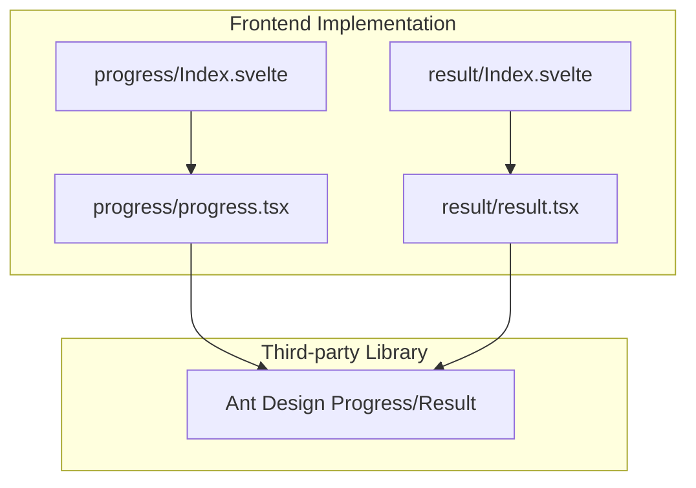
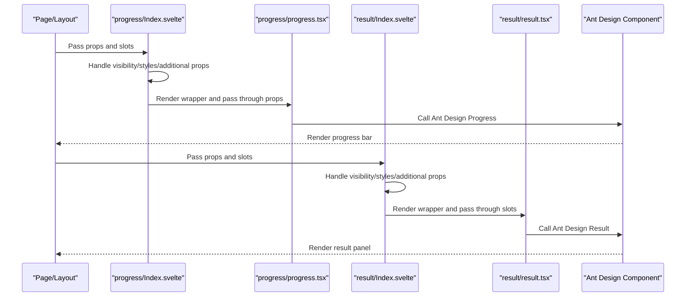
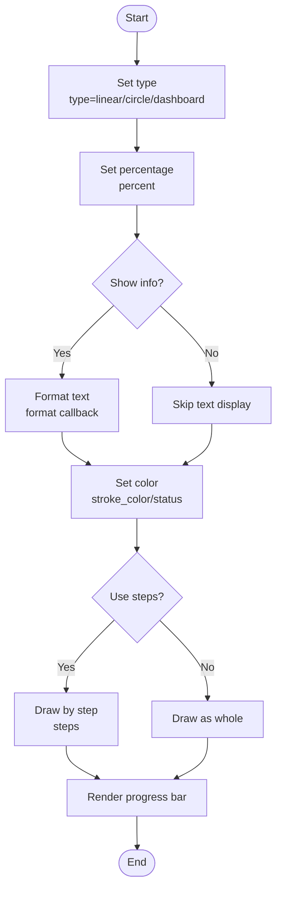
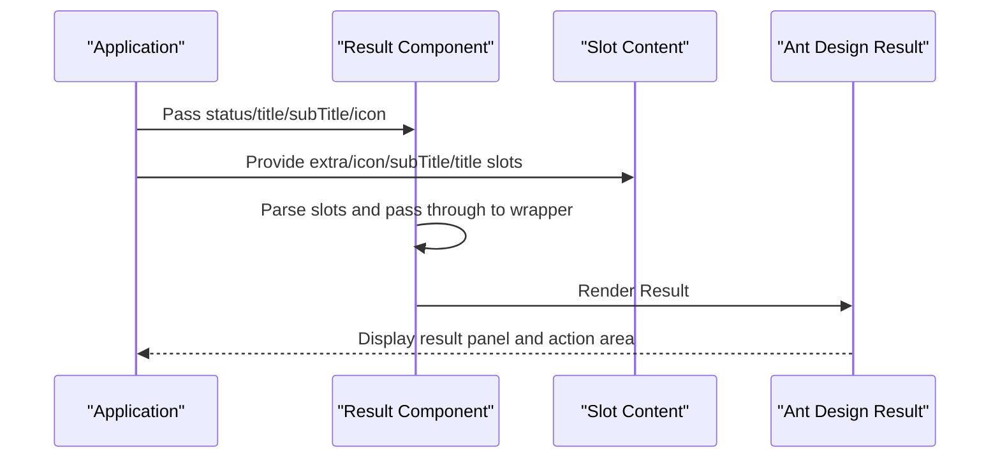
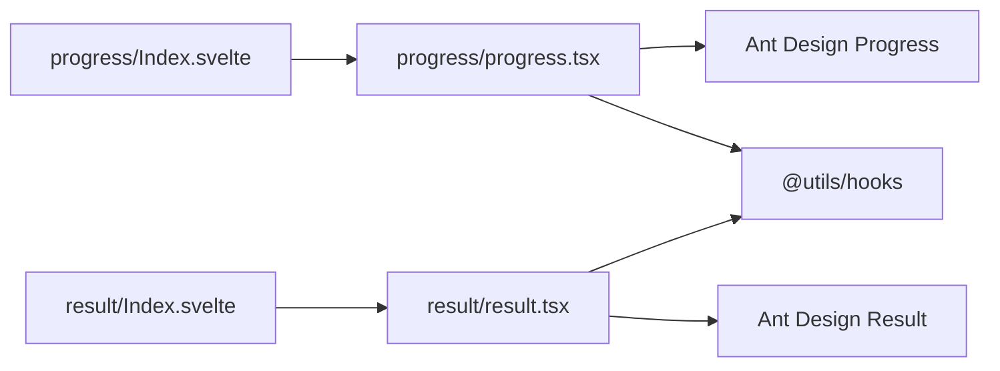

# Progress and Result

<cite>
**Files referenced in this document**
- [frontend/antd/progress/progress.tsx](file://frontend/antd/progress/progress.tsx)
- [frontend/antd/progress/Index.svelte](file://frontend/antd/progress/Index.svelte)
- [docs/components/antd/progress/README.md](file://docs/components/antd/progress/README.md)
- [docs/components/antd/progress/demos/basic.py](file://docs/components/antd/progress/demos/basic.py)
- [frontend/antd/result/result.tsx](file://frontend/antd/result/result.tsx)
- [frontend/antd/result/Index.svelte](file://frontend/antd/result/Index.svelte)
- [docs/components/antd/result/README.md](file://docs/components/antd/result/README.md)
- [docs/components/antd/result/demos/basic.py](file://docs/components/antd/result/demos/basic.py)
</cite>

## Table of Contents

1. [Introduction](#introduction)
2. [Project Structure](#project-structure)
3. [Core Components](#core-components)
4. [Architecture Overview](#architecture-overview)
5. [Detailed Component Analysis](#detailed-component-analysis)
6. [Dependency Analysis](#dependency-analysis)
7. [Performance Considerations](#performance-considerations)
8. [Troubleshooting Guide](#troubleshooting-guide)
9. [Conclusion](#conclusion)
10. [Appendix](#appendix)

## Introduction

This document focuses on the progress and result component group, systematically covering the functional characteristics, shape variants, status semantics, property configuration, animation and style customization methods for both the Progress and Result components, combined with demo examples from the repository to provide practical recommendations for typical application scenarios such as file upload progress, task execution status, and operation result feedback. It also covers key points for user experience optimization and accessibility support, helping developers use progress and result components efficiently and consistently in the Gradio ecosystem.

## Project Structure

- Component implementations reside in the frontend layer: each component has a Svelte entry file for property handling and slot rendering, and a TypeScript wrapper for interfacing with the native Ant Design component.
- Documentation and demos reside under docs/components/antd, providing component descriptions and runnable examples.
- The relationship between component entries and wrappers is shown in the following diagram:

Diagram sources

- [frontend/antd/progress/Index.svelte:1-64](file://frontend/antd/progress/Index.svelte#L1-L64)
- [frontend/antd/progress/progress.tsx:1-24](file://frontend/antd/progress/progress.tsx#L1-L24)
- [frontend/antd/result/Index.svelte:1-64](file://frontend/antd/result/Index.svelte#L1-L64)
- [frontend/antd/result/result.tsx:1-33](file://frontend/antd/result/result.tsx#L1-L33)

Section sources

- [frontend/antd/progress/Index.svelte:1-64](file://frontend/antd/progress/Index.svelte#L1-L64)
- [frontend/antd/progress/progress.tsx:1-24](file://frontend/antd/progress/progress.tsx#L1-L24)
- [frontend/antd/result/Index.svelte:1-64](file://frontend/antd/result/Index.svelte#L1-L64)
- [frontend/antd/result/result.tsx:1-33](file://frontend/antd/result/result.tsx#L1-L33)

## Core Components

- Progress
  - Supports three shapes — line, circle, and dashboard (controlled via `type`) — and can add step segments (`steps`), info display toggle (`show_info`), and status color (`stroke_color`).
  - Provides a percentage value (`percent`) and a format callback (`format`) for flexible text display control; supports a custom rounding function (`rounding`).
  - Common statuses: default, active (`status='active'`), exception (`status='exception'`), success (`status='success'`).
- Result
  - Used to display the final result of a series of operations, supporting success, info, warning, and error statuses.
  - Supports title, sub_title, icon, and extra slots for extending buttons, links, or complex content.

Section sources

- [docs/components/antd/progress/README.md:1-8](file://docs/components/antd/progress/README.md#L1-L8)
- [docs/components/antd/result/README.md:1-8](file://docs/components/antd/result/README.md#L1-L8)
- [docs/components/antd/progress/demos/basic.py:1-39](file://docs/components/antd/progress/demos/basic.py#L1-L39)
- [docs/components/antd/result/demos/basic.py:1-57](file://docs/components/antd/result/demos/basic.py#L1-L57)

## Architecture Overview

The following diagram shows the call chain and slot passing mechanism from the Svelte entry to the native Ant Design component:

Diagram sources

- [frontend/antd/progress/Index.svelte:10-61](file://frontend/antd/progress/Index.svelte#L10-L61)
- [frontend/antd/progress/progress.tsx:5-21](file://frontend/antd/progress/progress.tsx#L5-L21)
- [frontend/antd/result/Index.svelte:10-59](file://frontend/antd/result/Index.svelte#L10-L59)
- [frontend/antd/result/result.tsx:7-30](file://frontend/antd/result/result.tsx#L7-L30)

## Detailed Component Analysis

### Progress Component

- Shapes and behavior
  - Line progress bar: Default type, suitable for long-running tasks.
  - Circle progress bar: `type="circle"`, suitable for emphasizing completion rate or as a card-level metric.
  - Dashboard progress bar: `type="dashboard"`, suitable for threshold judgment and interval visualization.
  - Step segments: The `steps` parameter splits the progress into multiple stages, commonly used for multi-stage tasks.
- Value display and formatting
  - `percent` is the percentage input; `show_info` controls whether the number or status icon is displayed.
  - The `format` callback can customize text content, such as showing "Done" text on completion.
  - `rounding` allows customizing the rounding strategy for the percentage.
- Color and status
  - `stroke_color` supports a single color or gradient array, coloring by step or overall.
  - `status` controls the status color and animation: default, active, exception, success.
- Props and slots
  - Props: percent, type, steps, stroke_color, status, show_info, format, rounding, etc.
  - Slots: No built-in slots; text is mainly customized via `format`.
- Use cases
  - File upload progress: Line progress bar showing real-time percentage, switching to success status on completion.
  - Task execution status: Circle progress bar as a card-level metric; dashboard for threshold reminders.
  - Multi-step flow: `steps` breaks down complex flows into multiple stages to improve perceived progress.

Diagram sources

- [frontend/antd/progress/progress.tsx:5-21](file://frontend/antd/progress/progress.tsx#L5-L21)
- [docs/components/antd/progress/demos/basic.py:9-35](file://docs/components/antd/progress/demos/basic.py#L9-L35)

Section sources

- [frontend/antd/progress/progress.tsx:1-24](file://frontend/antd/progress/progress.tsx#L1-L24)
- [frontend/antd/progress/Index.svelte:10-61](file://frontend/antd/progress/Index.svelte#L10-L61)
- [docs/components/antd/progress/README.md:1-8](file://docs/components/antd/progress/README.md#L1-L8)
- [docs/components/antd/progress/demos/basic.py:1-39](file://docs/components/antd/progress/demos/basic.py#L1-L39)

### Result Component

- Status and semantics
  - success: The operation completed successfully; encourage the user to proceed to the next step.
  - info: Provides a neutral hint; guides the user to view details.
  - warning: A risk or issue requiring attention; recommend the user confirm.
  - error: The operation failed; the user needs to correct the issue and retry.
- Visual and content
  - A title and sub_title clearly convey the result and context.
  - The icon can be customized, combined with status colors to enhance recognition.
  - The extra slot places action buttons, links, or supplementary notes.
- Props and slots
  - Props: status, title, sub_title, icon, extra, etc.
  - Slots: extra, icon, subTitle, title.
- Use cases
  - Operation result feedback: A unified feedback interface after submitting a form or purchasing a service.
  - Error diagnosis: Displaying the specific issue and repair guidance in an error state.
  - Conversion guidance: Providing actions such as "Go to Console" or "Buy Again" after a success.

Diagram sources

- [frontend/antd/result/result.tsx:7-30](file://frontend/antd/result/result.tsx#L7-L30)
- [frontend/antd/result/Index.svelte:10-59](file://frontend/antd/result/Index.svelte#L10-L59)

Section sources

- [frontend/antd/result/result.tsx:1-33](file://frontend/antd/result/result.tsx#L1-L33)
- [frontend/antd/result/Index.svelte:1-64](file://frontend/antd/result/Index.svelte#L1-L64)
- [docs/components/antd/result/README.md:1-8](file://docs/components/antd/result/README.md#L1-L8)
- [docs/components/antd/result/demos/basic.py:1-57](file://docs/components/antd/result/demos/basic.py#L1-L57)

## Dependency Analysis

- Component coupling and responsibilities
  - The Svelte entry handles prop collection, visibility control, style concatenation, and slot parsing.
  - The TypeScript wrapper interfaces with the Ant Design component, passing through props and callbacks (format, rounding).
  - The slot system is implemented via ReactSlot and useTargets, ensuring dynamic rendering and fallback of slots.
- External dependencies
  - Ant Design Progress/Result: Provides core UI and interaction behavior.
  - @svelte-preprocess-react: Bridges React components with the Svelte context.
  - @utils/hooks: Provides utility functions such as useFunction and useTargets.

Diagram sources

- [frontend/antd/progress/Index.svelte:1-64](file://frontend/antd/progress/Index.svelte#L1-L64)
- [frontend/antd/progress/progress.tsx:1-24](file://frontend/antd/progress/progress.tsx#L1-L24)
- [frontend/antd/result/Index.svelte:1-64](file://frontend/antd/result/Index.svelte#L1-L64)
- [frontend/antd/result/result.tsx:1-33](file://frontend/antd/result/result.tsx#L1-L33)

Section sources

- [frontend/antd/progress/progress.tsx:1-24](file://frontend/antd/progress/progress.tsx#L1-L24)
- [frontend/antd/result/result.tsx:1-33](file://frontend/antd/result/result.tsx#L1-L33)

## Performance Considerations

- Rendering overhead
  - Progress bar: Line and circle rendering costs are similar; step segments (`steps`) increase path drawing times; it is recommended to reduce unnecessary re-renders in high-frequency update scenarios.
  - Result: Content is relatively static; slot rendering is only triggered when content changes.
- Animation and smoothness
  - Avoid complex computations when using the `format` callback; try to return lightweight strings.
  - Circle/dashboard progress bars may impose GPU pressure at high refresh rates; use large circular progress bars with caution on mobile.
- Styles and theming
  - When injecting styles via elem_style/elem_classes, prefer atomic classes or theme variables to reduce inline style jitter.

## Troubleshooting Guide

- Slots not working
  - Confirm slot names are correct (extra, icon, subTitle, title), and that slots are explicitly passed through in the wrapper.
  - If no slot content is provided, the wrapper will fall back to the corresponding prop field.
- Percentage not updating
  - Ensure the `percent` prop updates as data changes; avoid expensive computations in `format` that cause lag.
  - If custom rounding is needed, check the input/output types and boundary values of the `rounding` function.
- Status color anomaly
  - When `status` and `stroke_color` are used simultaneously, note the status priority and color override order.
  - When `steps` is an array, ensure its length matches the number of stages to avoid out-of-bounds errors.
- Accessibility
  - Provide semantic labels and screen-reader-friendly text for key states (success/error).
  - Provide alternative descriptions for invisible text in circle progress bars to ensure assistive technologies can understand the progress meaning.

Section sources

- [frontend/antd/result/result.tsx:10-30](file://frontend/antd/result/result.tsx#L10-L30)
- [frontend/antd/progress/progress.tsx:9-21](file://frontend/antd/progress/progress.tsx#L9-L21)

## Conclusion

The Progress and Result components in the Gradio ecosystem fulfill the dual responsibilities of "process visibility" and "result feedback". Through Ant Design's mature capabilities and this project's Svelte wrapper, developers can obtain a consistent, extensible, and customizable progress and result experience at minimal cost. It is recommended to choose the appropriate shape and status based on your business scenario in practice, and to follow accessibility and performance best practices to improve user satisfaction and maintainability.

## Appendix

- Example references
  - Progress basic demo: [docs/components/antd/progress/demos/basic.py:1-39](file://docs/components/antd/progress/demos/basic.py#L1-L39)
  - Result basic demo: [docs/components/antd/result/demos/basic.py:1-57](file://docs/components/antd/result/demos/basic.py#L1-L57)
- Component documentation
  - Progress documentation: [docs/components/antd/progress/README.md:1-8](file://docs/components/antd/progress/README.md#L1-L8)
  - Result documentation: [docs/components/antd/result/README.md:1-8](file://docs/components/antd/result/README.md#L1-L8)
