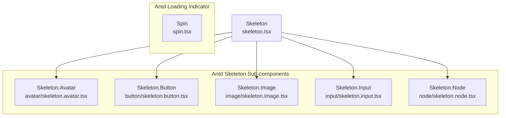
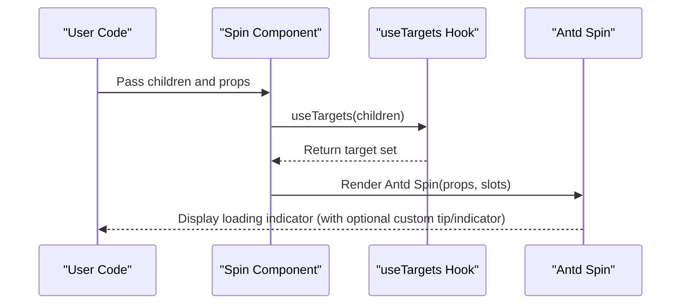
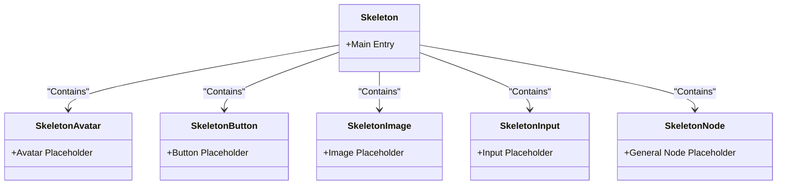
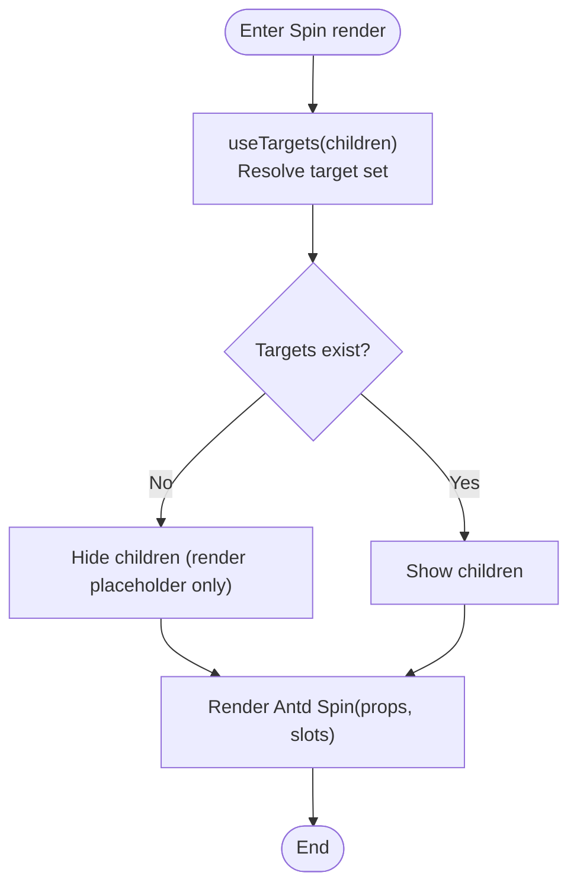
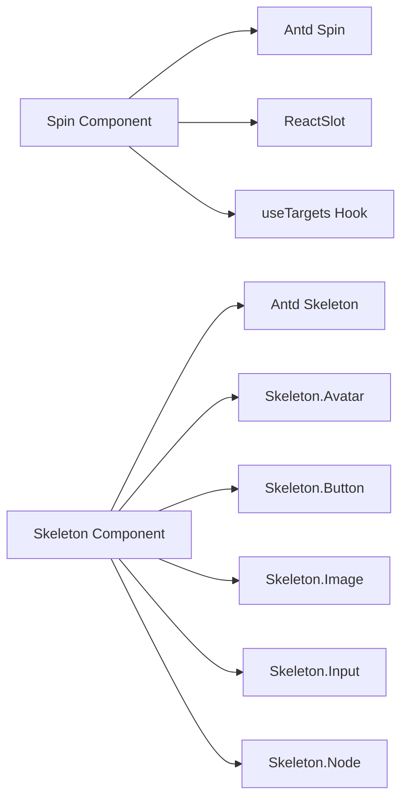

# Spin and Skeleton

<cite>
**Files referenced in this document**
- [frontend/antd/skeleton/skeleton.tsx](file://frontend/antd/skeleton/skeleton.tsx)
- [frontend/antd/skeleton/avatar/skeleton.avatar.tsx](file://frontend/antd/skeleton/avatar/skeleton.avatar.tsx)
- [frontend/antd/skeleton/button/skeleton.button.tsx](file://frontend/antd/skeleton/button/skeleton.button.tsx)
- [frontend/antd/skeleton/image/skeleton.image.tsx](file://frontend/antd/skeleton/image/skeleton.image.tsx)
- [frontend/antd/skeleton/input/skeleton.input.tsx](file://frontend/antd/skeleton/input/skeleton.input.tsx)
- [frontend/antd/skeleton/node/skeleton.node.tsx](file://frontend/antd/skeleton/node/skeleton.node.tsx)
- [frontend/antd/spin/spin.tsx](file://frontend/antd/spin/spin.tsx)
</cite>

## Table of Contents

1. [Introduction](#introduction)
2. [Project Structure](#project-structure)
3. [Core Components](#core-components)
4. [Architecture Overview](#architecture-overview)
5. [Detailed Component Analysis](#detailed-component-analysis)
6. [Dependency Analysis](#dependency-analysis)
7. [Performance Considerations](#performance-considerations)
8. [Troubleshooting Guide](#troubleshooting-guide)
9. [Conclusion](#conclusion)
10. [Appendix: Common Use Cases and Best Practices](#appendix-common-use-cases-and-best-practices)

## Introduction

This document focuses on the loading skeleton component group, systematically explaining the implementation patterns, usage strategies, and UX design considerations for Skeleton and Spin in this repository. Topics covered include:

- Skeleton placeholder types, animation effects, and content layout simulation
- Spin loading indicator size variations and state management
- Component property configuration, custom animations, and style customization
- Practical recommendations for common scenarios such as list loading, image placeholders, form loading, and page transitions
- Timing and transition effects for switching between skeleton and real content
- Performance optimization recommendations and network condition adaptation strategies

## Project Structure

The loading skeleton component group resides in the frontend Ant Design component layer, following a unified "adapter" wrapping pattern that bridges Ant Design's React components to the Svelte ecosystem via preprocessing tools, ensuring a consistent invocation experience within this project's component system.

Diagram sources

- [frontend/antd/skeleton/skeleton.tsx:1-7](file://frontend/antd/skeleton/skeleton.tsx#L1-L7)
- [frontend/antd/skeleton/avatar/skeleton.avatar.tsx:1-9](file://frontend/antd/skeleton/avatar/skeleton.avatar.tsx#L1-L9)
- [frontend/antd/skeleton/button/skeleton.button.tsx:1-9](file://frontend/antd/skeleton/button/skeleton.button.tsx#L1-L9)
- [frontend/antd/skeleton/image/skeleton.image.tsx:1-9](file://frontend/antd/skeleton/image/skeleton.image.tsx#L1-L9)
- [frontend/antd/skeleton/input/skeleton.input.tsx:1-9](file://frontend/antd/skeleton/input/skeleton.input.tsx#L1-L9)
- [frontend/antd/skeleton/node/skeleton.node.tsx:1-9](file://frontend/antd/skeleton/node/skeleton.node.tsx#L1-L9)
- [frontend/antd/spin/spin.tsx:1-38](file://frontend/antd/spin/spin.tsx#L1-L38)

Section sources

- [frontend/antd/skeleton/skeleton.tsx:1-7](file://frontend/antd/skeleton/skeleton.tsx#L1-L7)
- [frontend/antd/skeleton/avatar/skeleton.avatar.tsx:1-9](file://frontend/antd/skeleton/avatar/skeleton.avatar.tsx#L1-L9)
- [frontend/antd/skeleton/button/skeleton.button.tsx:1-9](file://frontend/antd/skeleton/button/skeleton.button.tsx#L1-L9)
- [frontend/antd/skeleton/image/skeleton.image.tsx:1-9](file://frontend/antd/skeleton/image/skeleton.image.tsx#L1-L9)
- [frontend/antd/skeleton/input/skeleton.input.tsx:1-9](file://frontend/antd/skeleton/input/skeleton.input.tsx#L1-L9)
- [frontend/antd/skeleton/node/skeleton.node.tsx:1-9](file://frontend/antd/skeleton/node/skeleton.node.tsx#L1-L9)
- [frontend/antd/spin/spin.tsx:1-38](file://frontend/antd/spin/spin.tsx#L1-L38)

## Core Components

- Skeleton
  - Main entry: Bridges Ant Design's Skeleton component to the Svelte environment in a unified way
  - Sub-components: Avatar, Button, Image, Input, Node — each corresponding to a placeholder skeleton for a different element type
- Spin
  - Main entry: Bridges Ant Design's Spin component to the Svelte environment in a unified way, with support for slottable `tip` and `indicator` customization

Section sources

- [frontend/antd/skeleton/skeleton.tsx:1-7](file://frontend/antd/skeleton/skeleton.tsx#L1-L7)
- [frontend/antd/skeleton/avatar/skeleton.avatar.tsx:1-9](file://frontend/antd/skeleton/avatar/skeleton.avatar.tsx#L1-L9)
- [frontend/antd/skeleton/button/skeleton.button.tsx:1-9](file://frontend/antd/skeleton/button/skeleton.button.tsx#L1-L9)
- [frontend/antd/skeleton/image/skeleton.image.tsx:1-9](file://frontend/antd/skeleton/image/skeleton.image.tsx#L1-L9)
- [frontend/antd/skeleton/input/skeleton.input.tsx:1-9](file://frontend/antd/skeleton/input/skeleton.input.tsx#L1-L9)
- [frontend/antd/skeleton/node/skeleton.node.tsx:1-9](file://frontend/antd/skeleton/node/skeleton.node.tsx#L1-L9)
- [frontend/antd/spin/spin.tsx:1-38](file://frontend/antd/spin/spin.tsx#L1-L38)

## Architecture Overview

The overall architecture uses a combination of "adapter + slots":

- Adapter: The unified `sveltify` tool bridges Ant Design's React components as Svelte-usable components
- Slottable: Spin supports `tip` and `indicator` slots for custom tip text and indicator styles
- Target selection: Spin internally converts children into a locatable set of targets via a target selection hook, ensuring correct wrapping logic

Diagram sources

- [frontend/antd/spin/spin.tsx:1-38](file://frontend/antd/spin/spin.tsx#L1-L38)

Section sources

- [frontend/antd/spin/spin.tsx:1-38](file://frontend/antd/spin/spin.tsx#L1-L38)

## Detailed Component Analysis

### Skeleton Component Family

- Design goals
  - Provide stable content layout placeholders before data is ready, avoiding page jumps and layout jitter
  - Improve perceived speed and usability by simulating real content with appropriate animations and shapes
- Placeholder types
  - Avatar: Avatar placeholder
  - Button: Button placeholder
  - Image: Image placeholder
  - Input: Input field placeholder
  - Node: General-purpose node placeholder
- Animation and layout
  - Based on Ant Design's Skeleton animation mechanism, typically manifests as a shimmer (gradient flash) effect
  - Simulate complex layouts such as text, cards, and lists by setting different shapes (circle/square/rectangle) and row counts
- Usage recommendations
  - List loading: Prefer Node or multiple Input rows to simulate list items
  - Image placeholders: Use Image with dimensions matching the real image
  - Form loading: Use Input/Button to simulate fields and action areas
  - Page transitions: Wrap the container with Skeleton during route transitions to reduce the perception of a white screen

Diagram sources

- [frontend/antd/skeleton/skeleton.tsx:1-7](file://frontend/antd/skeleton/skeleton.tsx#L1-L7)
- [frontend/antd/skeleton/avatar/skeleton.avatar.tsx:1-9](file://frontend/antd/skeleton/avatar/skeleton.avatar.tsx#L1-L9)
- [frontend/antd/skeleton/button/skeleton.button.tsx:1-9](file://frontend/antd/skeleton/button/skeleton.button.tsx#L1-L9)
- [frontend/antd/skeleton/image/skeleton.image.tsx:1-9](file://frontend/antd/skeleton/image/skeleton.image.tsx#L1-L9)
- [frontend/antd/skeleton/input/skeleton.input.tsx:1-9](file://frontend/antd/skeleton/input/skeleton.input.tsx#L1-L9)
- [frontend/antd/skeleton/node/skeleton.node.tsx:1-9](file://frontend/antd/skeleton/node/skeleton.node.tsx#L1-L9)

Section sources

- [frontend/antd/skeleton/skeleton.tsx:1-7](file://frontend/antd/skeleton/skeleton.tsx#L1-L7)
- [frontend/antd/skeleton/avatar/skeleton.avatar.tsx:1-9](file://frontend/antd/skeleton/avatar/skeleton.avatar.tsx#L1-L9)
- [frontend/antd/skeleton/button/skeleton.button.tsx:1-9](file://frontend/antd/skeleton/button/skeleton.button.tsx#L1-L9)
- [frontend/antd/skeleton/image/skeleton.image.tsx:1-9](file://frontend/antd/skeleton/image/skeleton.image.tsx#L1-L9)
- [frontend/antd/skeleton/input/skeleton.input.tsx:1-9](file://frontend/antd/skeleton/input/skeleton.input.tsx#L1-L9)
- [frontend/antd/skeleton/node/skeleton.node.tsx:1-9](file://frontend/antd/skeleton/node/skeleton.node.tsx#L1-L9)

### Spin Component

- Design goals
  - Provide clear feedback during async operations to prevent users from thinking the page is unresponsive
  - Supports custom tip text and indicator to meet the visual needs of different scenarios
- Key features
  - Slottable: Supports `tip` and `indicator` slots for injecting custom text and icons
  - Target selection: Internally converts children into a target set via a target selection hook, ensuring correct wrapping logic
  - Prop passthrough: All props are passed directly to Ant Design's Spin except for additional extensions
- Usage recommendations
  - List loading: Use Spin as the list container with children as list items; `tip` indicates "Loading"
  - Image placeholder: Wrap images with Spin before they finish loading; use a simple rotating icon for `indicator`
  - Form submission: Disable interactions and display Spin during submission; `tip` indicates "Submitting"
  - Page transitions: Wrap the entire page with Spin during route transitions to provide global loading feedback

Diagram sources

- [frontend/antd/spin/spin.tsx:1-38](file://frontend/antd/spin/spin.tsx#L1-L38)

Section sources

- [frontend/antd/spin/spin.tsx:1-38](file://frontend/antd/spin/spin.tsx#L1-L38)

## Dependency Analysis

- Component coupling
  - The Skeleton family all depend on Ant Design's Skeleton implementation, bridged via sveltify
  - Spin depends on Ant Design's Spin implementation, and introduces a target selection hook and ReactSlot slot mechanism
- External dependencies
  - @svelte-preprocess-react: Provides sveltify and ReactSlot capabilities
  - Ant Design: Provides the concrete implementations of Skeleton and Spin
- Potential issues
  - Slot names and prop naming must be consistent with Ant Design to avoid runtime errors
  - Target selection logic must ensure the children structure is reasonable to avoid wrapping anomalies

Diagram sources

- [frontend/antd/spin/spin.tsx:1-38](file://frontend/antd/spin/spin.tsx#L1-L38)
- [frontend/antd/skeleton/skeleton.tsx:1-7](file://frontend/antd/skeleton/skeleton.tsx#L1-L7)
- [frontend/antd/skeleton/avatar/skeleton.avatar.tsx:1-9](file://frontend/antd/skeleton/avatar/skeleton.avatar.tsx#L1-L9)
- [frontend/antd/skeleton/button/skeleton.button.tsx:1-9](file://frontend/antd/skeleton/button/skeleton.button.tsx#L1-L9)
- [frontend/antd/skeleton/image/skeleton.image.tsx:1-9](file://frontend/antd/skeleton/image/skeleton.image.tsx#L1-L9)
- [frontend/antd/skeleton/input/skeleton.input.tsx:1-9](file://frontend/antd/skeleton/input/skeleton.input.tsx#L1-L9)
- [frontend/antd/skeleton/node/skeleton.node.tsx:1-9](file://frontend/antd/skeleton/node/skeleton.node.tsx#L1-L9)

Section sources

- [frontend/antd/spin/spin.tsx:1-38](file://frontend/antd/spin/spin.tsx#L1-L38)
- [frontend/antd/skeleton/skeleton.tsx:1-7](file://frontend/antd/skeleton/skeleton.tsx#L1-L7)

## Performance Considerations

- Skeleton rendering cost
  - The number and depth of skeleton placeholder elements should approximate the real content to avoid excessive rendering causing lag
  - For long lists, use Skeleton.Node or a small number of input rows as placeholders to reduce DOM count
- Loading indicator feedback
  - Spin's `tip` and `indicator` should be as lightweight as possible to avoid additional repaints and reflows
  - In high-frequency refresh scenarios, it is recommended to use throttling or debouncing to control the frequency of loading state transitions
- Network condition adaptation
  - For poor network conditions, it is recommended to extend the Skeleton display time threshold to avoid frequent flickering
  - For high-latency scenarios, Spin's `tip` text should clearly inform the user why they are waiting (e.g., "Connecting to server")

## Troubleshooting Guide

- Issue: Spin cannot correctly wrap children
  - Debug: Confirm whether children have a recognizable target structure; check the return value of useTargets
  - Reference implementation: [frontend/antd/spin/spin.tsx:1-38](file://frontend/antd/spin/spin.tsx#L1-L38)
- Issue: tip/indicator slots not working
  - Debug: Confirm slot names are `tip` and `indicator`; ensure the slots object has the corresponding keys
  - Reference implementation: [frontend/antd/spin/spin.tsx:1-38](file://frontend/antd/spin/spin.tsx#L1-L38)
- Issue: Skeleton sub-component style anomalies
  - Debug: Confirm sub-components are correctly importing the corresponding Ant Design modules; check theme and style overrides
  - Reference implementations:
    - [frontend/antd/skeleton/skeleton.tsx:1-7](file://frontend/antd/skeleton/skeleton.tsx#L1-L7)
    - [frontend/antd/skeleton/avatar/skeleton.avatar.tsx:1-9](file://frontend/antd/skeleton/avatar/skeleton.avatar.tsx#L1-L9)
    - [frontend/antd/skeleton/button/skeleton.button.tsx:1-9](file://frontend/antd/skeleton/button/skeleton.button.tsx#L1-L9)
    - [frontend/antd/skeleton/image/skeleton.image.tsx:1-9](file://frontend/antd/skeleton/image/skeleton.image.tsx#L1-L9)
    - [frontend/antd/skeleton/input/skeleton.input.tsx:1-9](file://frontend/antd/skeleton/input/skeleton.input.tsx#L1-L9)
    - [frontend/antd/skeleton/node/skeleton.node.tsx:1-9](file://frontend/antd/skeleton/node/skeleton.node.tsx#L1-L9)

Section sources

- [frontend/antd/spin/spin.tsx:1-38](file://frontend/antd/spin/spin.tsx#L1-L38)
- [frontend/antd/skeleton/skeleton.tsx:1-7](file://frontend/antd/skeleton/skeleton.tsx#L1-L7)
- [frontend/antd/skeleton/avatar/skeleton.avatar.tsx:1-9](file://frontend/antd/skeleton/avatar/skeleton.avatar.tsx#L1-L9)
- [frontend/antd/skeleton/button/skeleton.button.tsx:1-9](file://frontend/antd/skeleton/button/skeleton.button.tsx#L1-L9)
- [frontend/antd/skeleton/image/skeleton.image.tsx:1-9](file://frontend/antd/skeleton/image/skeleton.image.tsx#L1-L9)
- [frontend/antd/skeleton/input/skeleton.input.tsx:1-9](file://frontend/antd/skeleton/input/skeleton.input.tsx#L1-L9)
- [frontend/antd/skeleton/node/skeleton.node.tsx:1-9](file://frontend/antd/skeleton/node/skeleton.node.tsx#L1-L9)

## Conclusion

The loading skeleton component group in this repository achieves seamless integration of Ant Design Skeleton and Spin through a unified adapter and slottable design. In practice, the appropriate skeleton type and loading indicator form should be chosen based on the business scenario, and props and slots should be used for customization to meet branding and interaction needs. At the same time, pay attention to rendering performance and network condition adaptation to ensure a consistent, smooth user experience across different devices and environments.

## Appendix: Common Use Cases and Best Practices

- List loading
  - Use Skeleton.Node or multiple Input rows to simulate list item placeholders
  - Wrap the list container with Spin; `tip` indicates "Loading", `indicator` uses the default spinning icon
- Image placeholder
  - Use Skeleton.Image to simulate image dimensions and placeholders
  - When an image fails to load, switch to a skeleton placeholder or error hint
- Form loading
  - Use Skeleton.Input and Skeleton.Button to simulate input fields and action areas
  - Disable interactions and display Spin during submission; `tip` indicates "Submitting"
- Page transitions
  - During route transitions, wrap the page body with Skeleton to reduce the perception of a white screen
  - For high-latency scenarios, Spin's `tip` text should clearly inform the user why they are waiting
