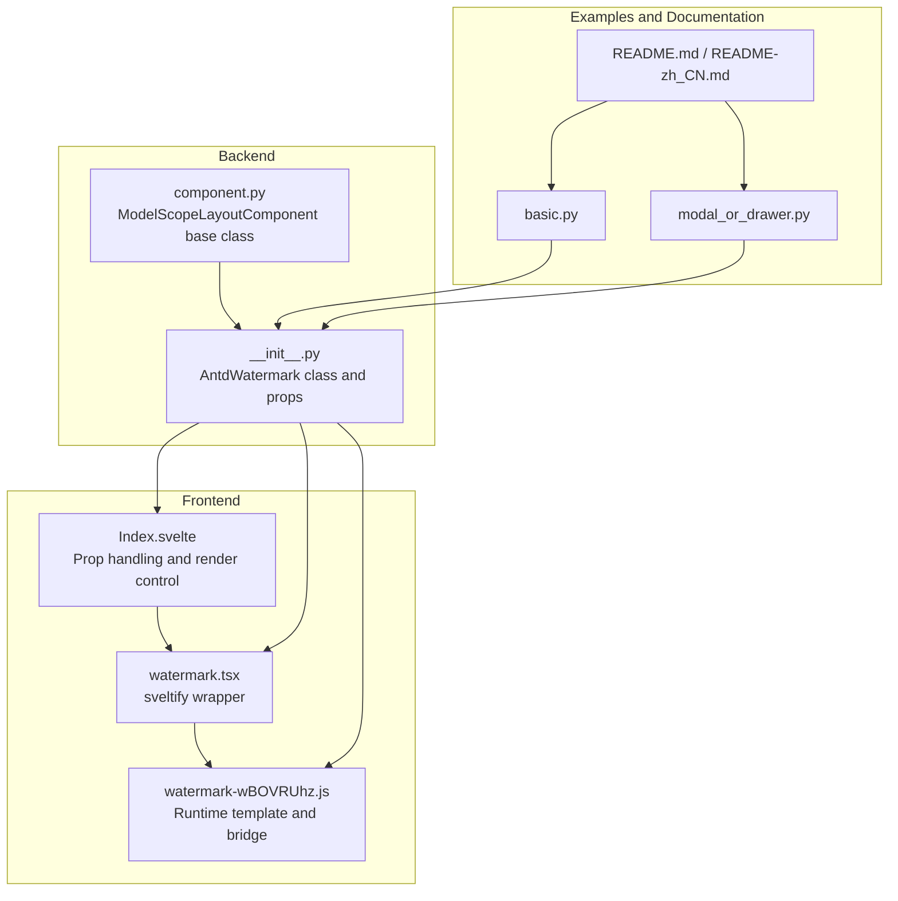
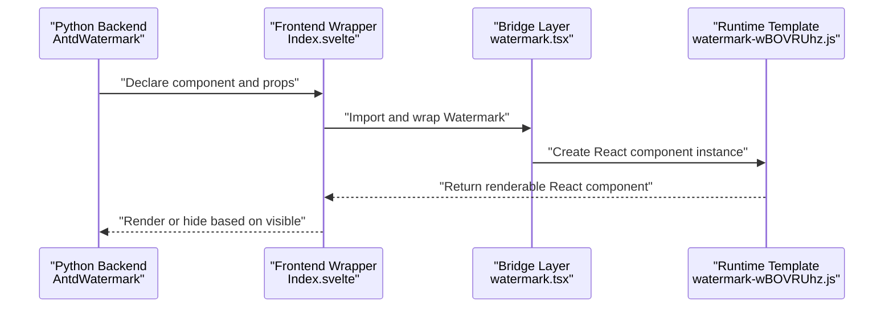
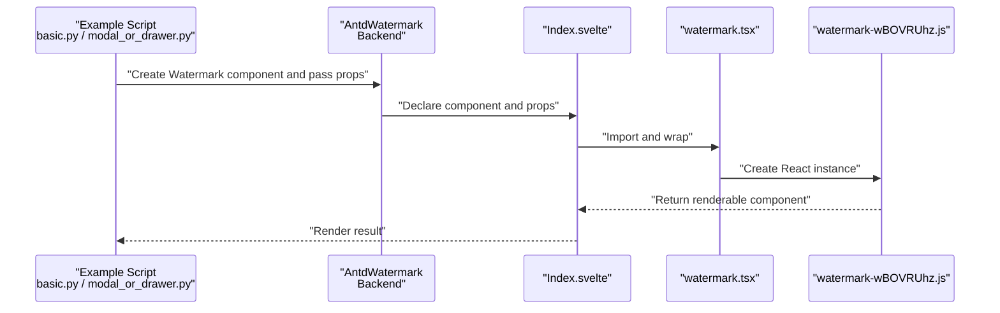
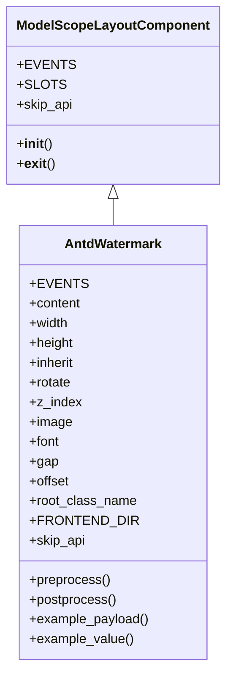
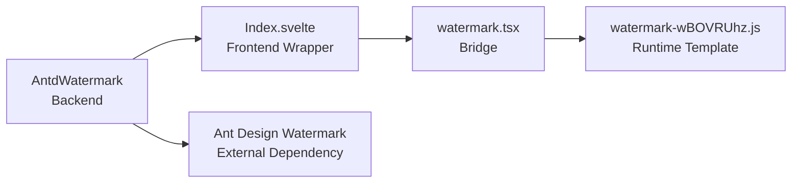

# Watermark

<cite>
**Files referenced in this document**
- [watermark.tsx](file://frontend/antd/watermark/watermark.tsx)
- [Index.svelte](file://frontend/antd/watermark/Index.svelte)
- [__init__.py](file://backend/modelscope_studio/components/antd/watermark/__init__.py)
- [watermark-wBOVRUhz.js](file://backend/modelscope_studio/components/antd/watermark/templates/component/watermark-wBOVRUhz.js)
- [basic.py](file://docs/components/antd/watermark/demos/basic.py)
- [modal_or_drawer.py](file://docs/components/antd/watermark/demos/modal_or_drawer.py)
- [README.md](file://docs/components/antd/watermark/README.md)
- [README-zh_CN.md](file://docs/components/antd/watermark/README-zh_CN.md)
- [app.py](file://docs/components/antd/watermark/app.py)
- [component.py](file://backend/modelscope_studio/utils/dev/component.py)
</cite>

## Table of Contents

1. [Introduction](#introduction)
2. [Project Structure](#project-structure)
3. [Core Components](#core-components)
4. [Architecture Overview](#architecture-overview)
5. [Detailed Component Analysis](#detailed-component-analysis)
6. [Dependency Analysis](#dependency-analysis)
7. [Performance Considerations](#performance-considerations)
8. [Troubleshooting Guide](#troubleshooting-guide)
9. [Conclusion](#conclusion)
10. [Appendix](#appendix)

## Introduction

The Watermark component is used to overlay text or image watermarks on a page or container, commonly used for copyright protection, version identification, customer differentiation, and similar scenarios. The Watermark component in this repository is based on Ant Design's Watermark implementation and is used within the Gradio ecosystem through a Svelte/React bridge layer.

- Features
  - Text watermark: Supports single-line or multi-line text watermarks.
  - Image watermark: Supports a custom image as the watermark source.
  - Position and layout: Controls repetition and arrangement through width, height, gap, and offset parameters.
  - Rotation and scaling: Supports rotation angle and scale configuration.
  - Opacity and z-index: Supports opacity and z-index control.
  - Embedded usage: Can wrap any child element and automatically takes effect as the container changes.
  - Event binding: Supports removal event binding for dynamic control.

- Application scenarios
  - Copyright protection: Add a "Copyright Protected" watermark to preview images or reports.
  - Version identification: Add a "DEVELOPMENT" or "TEST" watermark in development/test environments.
  - Customer differentiation: Add a dedicated watermark per customer or tenant for identification and auditing.
  - Sensitive data protection: Add a watermark on export or display interfaces to reduce the risk of inadvertent propagation.

- Implementation principles
  - Frontend bridge: Wraps Ant Design's Watermark component as a Svelte-usable component via `sveltify`.
  - Prop passthrough: Merges Gradio props (such as elem_id, elem_classes, elem_style, visible) with additional props and passes them to the underlying component.
  - Render control: Controls whether to render based on `visible`; supports slots and children.
  - Backend encapsulation: The Python layer provides the AntdWatermark class, carrying props and declaring the frontend directory mapping, while also declaring event listeners.

- Usage notes
  - Text and image: Set via `content` or `image` parameters; multi-line text can use array form.
  - Repeat pattern: Control repetition and offset via width, height, gap, and offset.
  - Rotation and scaling: `rotate` controls the angle; `z_index` controls the z-index.
  - Dynamic updates: Watermark content and styles can be dynamically switched via Gradio's update mechanism.
  - Style customization: Extend styles via elem_style, elem_classes, and additional props.

**Section sources**

- [README.md:1-9](file://docs/components/antd/watermark/README.md#L1-L9)
- [README-zh_CN.md:1-9](file://docs/components/antd/watermark/README-zh_CN.md#L1-L9)

## Project Structure

The organization of the Watermark component in the repository is as follows:

- Frontend
  - Svelte wrapper layer: Index.svelte handles prop processing, visibility control, and child node rendering.
  - React bridge layer: watermark.tsx wraps Ant Design's Watermark as a Svelte component using `sveltify`.
  - Runtime template: watermark-wBOVRUhz.js is the component runtime template, responsible for React component mounting and bridging logic.
- Backend
  - Python encapsulation: The AntdWatermark class carries props and events, and declares the frontend directory mapping.
- Examples and documentation
  - Basic example: basic.py demonstrates the basic usage of text and image watermarks.
  - Dialog example: modal_or_drawer.py demonstrates how to use watermarks inside Modal/Drawer.
  - Documentation pages: README/README-zh_CN.md provides example placeholders and links.

**Diagram sources**

- [Index.svelte:1-64](file://frontend/antd/watermark/Index.svelte#L1-L64)
- [watermark.tsx:1-6](file://frontend/antd/watermark/watermark.tsx#L1-L6)
- [watermark-wBOVRUhz.js:1-442](file://backend/modelscope_studio/components/antd/watermark/templates/component/watermark-wBOVRUhz.js#L1-L442)
- [**init**.py:1-83](file://backend/modelscope_studio/components/antd/watermark/__init__.py#L1-L83)
- [component.py:1-169](file://backend/modelscope_studio/utils/dev/component.py#L1-L169)
- [basic.py:1-23](file://docs/components/antd/watermark/demos/basic.py#L1-L23)
- [modal_or_drawer.py:1-30](file://docs/components/antd/watermark/demos/modal_or_drawer.py#L1-L30)
- [README.md:1-9](file://docs/components/antd/watermark/README.md#L1-L9)
- [README-zh_CN.md:1-9](file://docs/components/antd/watermark/README-zh_CN.md#L1-L9)

**Section sources**

- [Index.svelte:1-64](file://frontend/antd/watermark/Index.svelte#L1-L64)
- [watermark.tsx:1-6](file://frontend/antd/watermark/watermark.tsx#L1-L6)
- [watermark-wBOVRUhz.js:1-442](file://backend/modelscope_studio/components/antd/watermark/templates/component/watermark-wBOVRUhz.js#L1-L442)
- [**init**.py:1-83](file://backend/modelscope_studio/components/antd/watermark/__init__.py#L1-L83)
- [component.py:1-169](file://backend/modelscope_studio/utils/dev/component.py#L1-L169)
- [README.md:1-9](file://docs/components/antd/watermark/README.md#L1-L9)
- [README-zh_CN.md:1-9](file://docs/components/antd/watermark/README-zh_CN.md#L1-L9)

## Core Components

- AntdWatermark (Backend)
  - Responsibility: Carries the watermark component's props and events, declares the frontend directory mapping, and skips API calls.
  - Key props (from constructor): content, width, height, inherit, rotate, z_index, image, font, gap, offset, root_class_name, etc.
  - Events: remove (binds the removal event).
  - Other: `skip_api` returns True, indicating this component does not participate in the standard API flow.

- Watermark (Frontend Bridge)
  - Responsibility: Wraps Ant Design's Watermark component as a Svelte component via `sveltify` for use in Gradio.
  - Behavior: Directly exports Watermark as the default export.

- Index.svelte (Frontend Wrapper)
  - Responsibility: Handles Gradio props (elem_id, elem_classes, elem_style, visible), merges additional props, and controls visibility and child node rendering.
  - Behavior: When `visible` is true, asynchronously loads Watermark and renders it; supports slots and children.

- Runtime template (watermark-wBOVRUhz.js)
  - Responsibility: Provides React component bridging, context merging, Portal rendering, and effect registration to ensure the component is correctly mounted and updated in the browser environment.

**Section sources**

- [**init**.py:8-83](file://backend/modelscope_studio/components/antd/watermark/__init__.py#L8-L83)
- [watermark.tsx:1-6](file://frontend/antd/watermark/watermark.tsx#L1-L6)
- [Index.svelte:1-64](file://frontend/antd/watermark/Index.svelte#L1-L64)
- [watermark-wBOVRUhz.js:330-442](file://backend/modelscope_studio/components/antd/watermark/templates/component/watermark-wBOVRUhz.js#L330-L442)

## Architecture Overview

The following diagram shows the overall call chain and responsibilities from Python to the frontend and then to the runtime:

**Diagram sources**

- [**init**.py:66-66](file://backend/modelscope_studio/components/antd/watermark/__init__.py#L66-L66)
- [Index.svelte:10-63](file://frontend/antd/watermark/Index.svelte#L10-L63)
- [watermark.tsx:1-6](file://frontend/antd/watermark/watermark.tsx#L1-L6)
- [watermark-wBOVRUhz.js:330-442](file://backend/modelscope_studio/components/antd/watermark/templates/component/watermark-wBOVRUhz.js#L330-L442)

## Detailed Component Analysis

### Props and Configuration

- Text watermark
  - content: A string or array of strings for setting watermark text; supports multi-line text.
  - font: Font-related configuration (e.g., color, font size), supported by the underlying Ant Design.
- Image watermark
  - image: An image URL for setting the image watermark source.
- Repetition and layout
  - width, height: The width and height of the watermark unit.
  - gap: The horizontal and vertical spacing between watermarks.
  - offset: The initial offset of the watermark (typically used to control the starting position).
- Rotation and scaling
  - rotate: Watermark rotation angle.
  - inherit: Whether to inherit parent styles.
- Z-index and opacity
  - z_index: Watermark z-index.
  - Other styles: Control opacity, background, etc. via elem_style and elem_classes.
- Other
  - root_class_name: Root node class name prefix.
  - additional_props: Extra prop passthrough.

- Dynamic updates and style customization
  - visible: Controls whether the component is rendered.
  - elem_id, elem_classes, elem_style: Used for positioning and style customization.
  - slots and children: Supports slot and child node rendering.

**Section sources**

- [**init**.py:50-64](file://backend/modelscope_studio/components/antd/watermark/__init__.py#L50-L64)
- [Index.svelte:21-44](file://frontend/antd/watermark/Index.svelte#L21-L44)
- [watermark.tsx:1-6](file://frontend/antd/watermark/watermark.tsx#L1-L6)

### Usage Flow and Examples

- Basic text watermark
  - Nest Watermark inside a container and set `content` to a string or array.
  - Reference example: basic.py.
- Image watermark
  - Set `image` to an image URL; use width and height to control watermark dimensions.
  - Reference example: basic.py.
- Usage inside dialogs/drawers
  - Wrap Modal/Drawer with Watermark to achieve watermark coverage inside the dialog.
  - Reference example: modal_or_drawer.py.

**Diagram sources**

- [basic.py:1-23](file://docs/components/antd/watermark/demos/basic.py#L1-L23)
- [modal_or_drawer.py:1-30](file://docs/components/antd/watermark/demos/modal_or_drawer.py#L1-L30)
- [**init**.py:8-83](file://backend/modelscope_studio/components/antd/watermark/__init__.py#L8-L83)
- [Index.svelte:50-63](file://frontend/antd/watermark/Index.svelte#L50-L63)
- [watermark.tsx:1-6](file://frontend/antd/watermark/watermark.tsx#L1-L6)
- [watermark-wBOVRUhz.js:330-442](file://backend/modelscope_studio/components/antd/watermark/templates/component/watermark-wBOVRUhz.js#L330-L442)

**Section sources**

- [basic.py:1-23](file://docs/components/antd/watermark/demos/basic.py#L1-L23)
- [modal_or_drawer.py:1-30](file://docs/components/antd/watermark/demos/modal_or_drawer.py#L1-L30)

### Events and Lifecycle

- remove event
  - Bound via event listeners; can be used to remove the watermark when needed.
  - The event callback updates internal state to enable the removal behavior.

**Section sources**

- [**init**.py:12-16](file://backend/modelscope_studio/components/antd/watermark/__init__.py#L12-L16)

### Class Relationship Diagram

**Diagram sources**

- [component.py:11-127](file://backend/modelscope_studio/utils/dev/component.py#L11-L127)
- [**init**.py:8-83](file://backend/modelscope_studio/components/antd/watermark/__init__.py#L8-L83)

## Dependency Analysis

- Component coupling
  - AntdWatermark depends on the frontend directory mapping and runtime template to ensure correct rendering in the browser.
  - Index.svelte depends on the wrapper layer and runtime template, responsible for prop processing and visibility control.
  - watermark.tsx is responsible only for bridging, with low coupling, making it easy to maintain.
- External dependencies
  - Ant Design Watermark: Underlying implementation.
  - Svelte/React bridge tools: sveltify, @svelte-preprocess-react, etc.
- Potential issues
  - If FRONTEND_DIR is not set correctly, it may cause frontend resources to fail to load.
  - When `visible` is false, the component is not rendered; be aware of side effects when dynamically toggling.

**Diagram sources**

- [**init**.py:66-66](file://backend/modelscope_studio/components/antd/watermark/__init__.py#L66-L66)
- [Index.svelte:10-10](file://frontend/antd/watermark/Index.svelte#L10-L10)
- [watermark.tsx:1-1](file://frontend/antd/watermark/watermark.tsx#L1-L1)
- [watermark-wBOVRUhz.js:330-330](file://backend/modelscope_studio/components/antd/watermark/templates/component/watermark-wBOVRUhz.js#L330-L330)

**Section sources**

- [**init**.py:66-66](file://backend/modelscope_studio/components/antd/watermark/__init__.py#L66-L66)
- [Index.svelte:10-10](file://frontend/antd/watermark/Index.svelte#L10-L10)
- [watermark.tsx:1-1](file://frontend/antd/watermark/watermark.tsx#L1-L1)
- [watermark-wBOVRUhz.js:330-330](file://backend/modelscope_studio/components/antd/watermark/templates/component/watermark-wBOVRUhz.js#L330-L330)

## Performance Considerations

- Rendering overhead
  - Watermarks are essentially a background layer overlaid on a container, with minimal impact on the rendering of main content; however, a large number of repeating units may increase painting costs.
- Repaint and reflow
  - Frequently changing props such as content, image, rotate, and z_index may trigger repaints; it is recommended to batch updates or reduce change frequency.
- Image watermark
  - Image loading and decoding incur additional overhead; use appropriately sized and formatted images to avoid large images causing lag.
- Visibility control
  - Controlling render timing via `visible` can effectively reduce unnecessary overhead.
- Recommendations
  - Set width, height, and gap reasonably to avoid overly dense repetition.
  - For frequently toggled scenarios, prioritize caching and throttling strategies.
  - When using inside dialogs/drawers, pay attention to the rendering timing during dialog open/close.

[This section provides general performance recommendations and does not require specific file sources]

## Troubleshooting Guide

- Watermark not displayed
  - Check if `visible` is true; confirm props are correctly passed through to the component.
  - Confirm FRONTEND_DIR correctly points to the frontend directory.
- Image watermark not displayed
  - Check if the `image` URL is accessible; confirm image dimensions and format are reasonable.
  - Adjust width and height to fit the container.
- Rotation or z-index anomaly
  - Check that `rotate` and `z_index` settings match expectations; confirm no other styles are overriding them.
- Dynamic updates not working
  - Confirm the update logic is correct; use a re-render strategy if necessary.
- Events not working
  - Confirm the `remove` event has been bound; check that the event callback is executing correctly.

**Section sources**

- [Index.svelte:50-63](file://frontend/antd/watermark/Index.svelte#L50-L63)
- [**init**.py:66-66](file://backend/modelscope_studio/components/antd/watermark/__init__.py#L66-L66)

## Conclusion

The Watermark component provides flexible watermarking capabilities in the Gradio ecosystem through a concise prop system and a stable bridging mechanism. It supports text and image watermarks, repeat layouts, rotation and scaling, and z-index control, applicable to a variety of scenarios including copyright protection, version identification, and customer differentiation. Combined with visibility control and event binding, a dynamic and maintainable watermarking solution can be achieved.

[This section is a summary and does not require specific file sources]

## Appendix

### Common Use Case Example Paths

- Copyright protection: Add a "Copyright Protected" text or image watermark to preview image or report containers.
- Version identification: Add a "DEVELOPMENT" or "TEST" watermark in development/test environments.
- Customer differentiation: Add a dedicated watermark per customer or tenant for identification and auditing.
- Export protection: Add a watermark on export interfaces or print preview to reduce the risk of inadvertent propagation.

**Section sources**

- [basic.py:1-23](file://docs/components/antd/watermark/demos/basic.py#L1-L23)
- [modal_or_drawer.py:1-30](file://docs/components/antd/watermark/demos/modal_or_drawer.py#L1-L30)

### Quick Reference for Props

- Text watermark: content (string or array), font
- Image watermark: image, width, height
- Repetition and layout: gap, offset
- Rotation and z-index: rotate, z_index
- Styles and visibility: elem_style, elem_classes, elem_id, visible
- Other: root_class_name, additional_props

**Section sources**

- [**init**.py:50-64](file://backend/modelscope_studio/components/antd/watermark/__init__.py#L50-L64)
- [Index.svelte:21-44](file://frontend/antd/watermark/Index.svelte#L21-L44)

### Security and Anti-tampering Recommendations

- Trustworthy content sources: Ensure content and image come from trusted sources to avoid injecting malicious content.
- Access control: Restrict modification permissions for the watermark component to prevent it from being bypassed or removed.
- Audit logging: Record watermark change logs for tracking and auditing.
- Principle of least privilege: Grant only the necessary watermark configuration permissions to avoid over-authorization.

[This section provides general security recommendations and does not require specific file sources]

### Accessibility and Screen Reader Compatibility

- Text watermark
  - Ensure text semantics are clear; avoid using decorative text.
  - Provide alternative text or titles for key information.
- Image watermark
  - Provide descriptive alt text for image watermarks to help screen readers identify them.
- Interaction and focus
  - Watermarks should not interfere with user operations; ensure focusable elements are not obscured.
- Styles and contrast
  - Ensure the watermark has sufficient contrast with the background to avoid affecting readability.
- Accessibility testing
  - Test with screen readers and keyboard navigation to verify the accessibility experience.

[This section provides general accessibility recommendations and does not require specific file sources]
