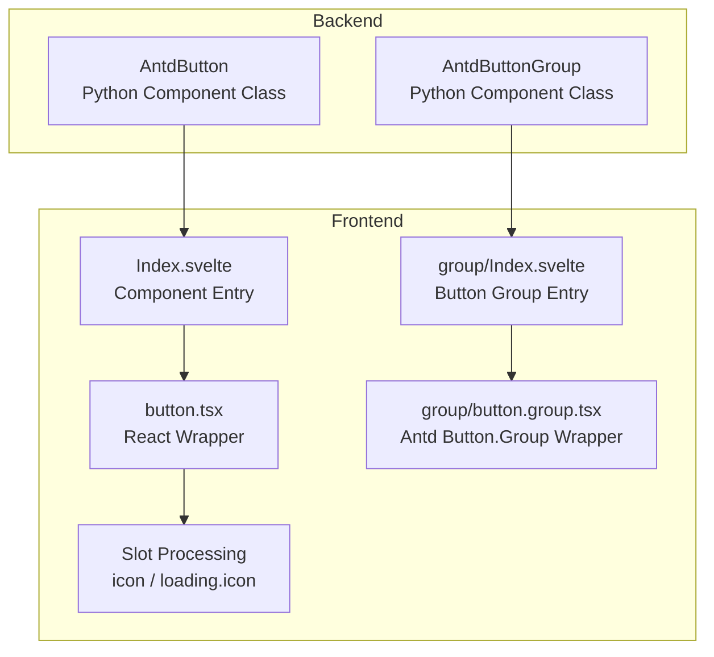
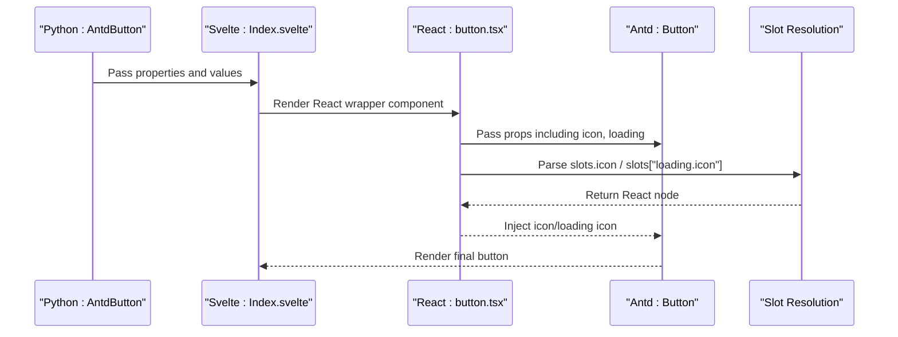
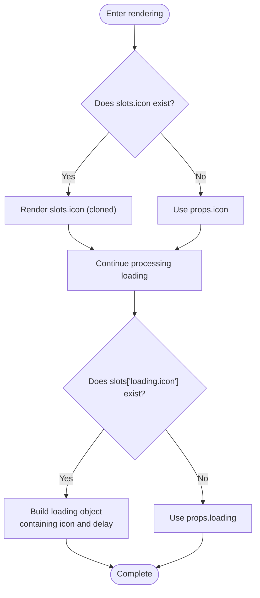
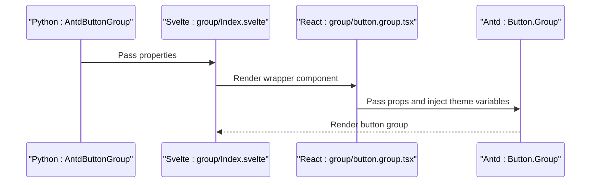
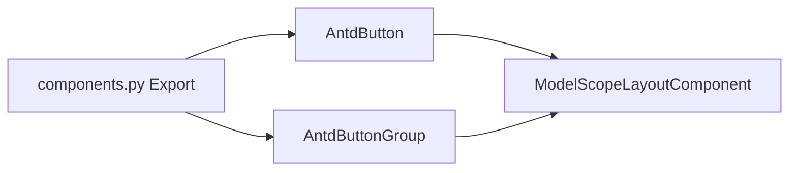

# Button

<cite>
**Files referenced in this document**
- [frontend/antd/button/button.tsx](file://frontend/antd/button/button.tsx)
- [frontend/antd/button/Index.svelte](file://frontend/antd/button/Index.svelte)
- [frontend/antd/button/group/button.group.tsx](file://frontend/antd/button/group/button.group.tsx)
- [frontend/antd/button/group/Index.svelte](file://frontend/antd/button/group/Index.svelte)
- [backend/modelscope_studio/components/antd/button/__init__.py](file://backend/modelscope_studio/components/antd/button/__init__.py)
- [backend/modelscope_studio/components/antd/components.py](file://backend/modelscope_studio/components/antd/components.py)
- [docs/components/antd/button/README-zh_CN.md](file://docs/components/antd/button/README-zh_CN.md)
- [docs/components/antd/button/demos/basic.py](file://docs/components/antd/button/demos/basic.py)
- [docs/components/antd/button/app.py](file://docs/components/antd/button/app.py)
- [backend/modelscope_studio/utils/dev/component.py](file://backend/modelscope_studio/utils/dev/component.py)
</cite>

## Table of Contents

1. [Introduction](#introduction)
2. [Project Structure](#project-structure)
3. [Core Components](#core-components)
4. [Architecture Overview](#architecture-overview)
5. [Detailed Component Analysis](#detailed-component-analysis)
6. [Dependency Analysis](#dependency-analysis)
7. [Performance Considerations](#performance-considerations)
8. [Troubleshooting Guide](#troubleshooting-guide)
9. [Conclusion](#conclusion)
10. [Appendix](#appendix)

## Introduction

This document systematically introduces the Button component, covering its core functionality, property configuration, and event handling mechanism. It focuses on explaining configuration items such as type (variant), size, and state; explains the usage and layout control of button groups; provides example paths for various scenarios (such as basic buttons, icon buttons, ghost buttons, dashed buttons, etc.); elaborates on handling special states like disabled, loading, and danger; explains style customization, theme adaptation, and responsive design points; and provides best practice recommendations for accessibility and keyboard navigation.

## Project Structure

The Button component consists of backend Python component class and frontend Svelte/React wrapper layer, following Gradio ecosystem's "component as context" pattern, supporting custom rendering of icons and loading state icons through the Slot mechanism.

Diagram Source

- [backend/modelscope_studio/components/antd/button/**init**.py:15-138](file://backend/modelscope_studio/components/antd/button/__init__.py#L15-L138)
- [frontend/antd/button/Index.svelte:10-73](file://frontend/antd/button/Index.svelte#L10-L73)
- [frontend/antd/button/button.tsx:8-36](file://frontend/antd/button/button.tsx#L8-L36)
- [frontend/antd/button/group/Index.svelte:10-61](file://frontend/antd/button/group/Index.svelte#L10-L61)
- [frontend/antd/button/group/button.group.tsx:6-24](file://frontend/antd/button/group/button.group.tsx#L6-L24)

Section Source

- [backend/modelscope_studio/components/antd/button/**init**.py:15-138](file://backend/modelscope_studio/components/antd/button/__init__.py#L15-L138)
- [frontend/antd/button/Index.svelte:10-73](file://frontend/antd/button/Index.svelte#L10-L73)
- [frontend/antd/button/button.tsx:8-36](file://frontend/antd/button/button.tsx#L8-L36)
- [frontend/antd/button/group/Index.svelte:10-61](file://frontend/antd/button/group/Index.svelte#L10-L61)
- [frontend/antd/button/group/button.group.tsx:6-24](file://frontend/antd/button/group/button.group.tsx#L6-L24)

## Core Components

- Backend Component Class: AntdButton provides all property and event definitions for buttons, supporting type, variant, size, color, shape, state, and other configurations, and declares supported slots (icon, loading.icon).
- Frontend Wrapper Layer: Index.svelte maps Python properties to React components, injecting styles and IDs; button.tsx uses sveltify to wrap Ant Design's Button, parsing and passing slots.
- Button Group: AntdButtonGroup corresponds to the frontend Button.Group wrapper, supporting group-level styles and theme variable injection.

Section Source

- [backend/modelscope_studio/components/antd/button/**init**.py:15-138](file://backend/modelscope_studio/components/antd/button/__init__.py#L15-L138)
- [frontend/antd/button/Index.svelte:10-73](file://frontend/antd/button/Index.svelte#L10-L73)
- [frontend/antd/button/button.tsx:8-36](file://frontend/antd/button/button.tsx#L8-L36)
- [frontend/antd/button/group/Index.svelte:10-61](file://frontend/antd/button/group/Index.svelte#L10-L61)
- [frontend/antd/button/group/button.group.tsx:6-24](file://frontend/antd/button/group/button.group.tsx#L6-L24)

## Architecture Overview

The diagram below shows the call chain from Python component to frontend rendering, and the processing flow of Slot in loading state and icon state.

Diagram Source

- [frontend/antd/button/button.tsx:11-36](file://frontend/antd/button/button.tsx#L11-L36)
- [frontend/antd/button/Index.svelte:59-73](file://frontend/antd/button/Index.svelte#L59-L73)
- [backend/modelscope_studio/components/antd/button/**init**.py:41-49](file://backend/modelscope_studio/components/antd/button/__init__.py#L41-L49)

## Detailed Component Analysis

### Properties and Configuration

- Type and Variant
  - type: Supports primary, dashed, link, text, default
  - variant: Supports outlined, dashed, solid, filled, text, link
  - color: Supports default, primary, danger and a set of preset color names
- Size and Shape
  - size: large, middle, small
  - shape: default, circle, round
- State and Behavior
  - disabled: Disabled state
  - danger: Danger state
  - ghost: Ghost button (transparent background)
  - loading: Boolean or loading object with delay
  - block: Block-level width
  - html_type: button, submit, reset
  - href/target: Link button and jump target
- Icon and Slots
  - icon: Icon name or node
  - loading.icon: Loading state custom icon
- Style and Identity
  - elem_id, elem_classes, elem_style
  - class_names, styles, root_class_name

Section Source

- [backend/modelscope_studio/components/antd/button/**init**.py:51-138](file://backend/modelscope_studio/components/antd/button/__init__.py#L51-L138)
- [frontend/antd/button/button.tsx:18-30](file://frontend/antd/button/button.tsx#L18-L30)

### Event Handling Mechanism

- click event: Bound through event listener, when triggered can update internal state to drive UI changes.
- Typical Usage: In the example, register click callback for button to output logs or trigger business logic.

Section Source

- [backend/modelscope_studio/components/antd/button/**init**.py:41-46](file://backend/modelscope_studio/components/antd/button/__init__.py#L41-L46)
- [docs/components/antd/button/demos/basic.py:9-10](file://docs/components/antd/button/demos/basic.py#L9-L10)

### Slots and Icon Processing

- Slot Definition: icon, loading.icon
- Rendering Strategy:
  - If slots.icon exists, render with ReactSlot and clone
  - When loading.icon exists, use that node as loading icon and preserve loading.delay value (when loading is an object)
  - If no slot, fall back to props.icon or props.loading

Diagram Source

- [frontend/antd/button/button.tsx:18-30](file://frontend/antd/button/button.tsx#L18-L30)

Section Source

- [frontend/antd/button/button.tsx:11-36](file://frontend/antd/button/button.tsx#L11-L36)

### Button Group (Button.Group)

- Component Entry: group/Index.svelte
- Wrapper Implementation: group/button.group.tsx
- Theme Adaptation: Injects CSS variables through Ant Design's theme.token.lineWidth, unifying in-group borders and spacing
- Applicable Scenarios: Multiple buttons combined arrangement, sharing the same theme style

Diagram Source

- [frontend/antd/button/group/Index.svelte:48-61](file://frontend/antd/button/group/Index.svelte#L48-L61)
- [frontend/antd/button/group/button.group.tsx:10-24](file://frontend/antd/button/group/button.group.tsx#L10-L24)

Section Source

- [frontend/antd/button/group/Index.svelte:10-61](file://frontend/antd/button/group/Index.svelte#L10-L61)
- [frontend/antd/button/group/button.group.tsx:6-24](file://frontend/antd/button/group/button.group.tsx#L6-L24)

### Examples and Usage Scenarios

The following examples are from documentation demo scripts, demonstrating button usage with different variants and states:

- Basic Buttons: Primary button, default button, dashed button, text button, link button
- Variants and Colors: Filled variant combined with default/danger color
- Loading State and Icons: Setting icon slot in loading state
- Block Buttons: block=True makes button fill container width

Example Path

- [docs/components/antd/button/demos/basic.py:9-22](file://docs/components/antd/button/demos/basic.py#L9-L22)

Section Source

- [docs/components/antd/button/demos/basic.py:5-25](file://docs/components/antd/button/demos/basic.py#L5-L25)

### Style Customization, Theme Adaptation and Responsive Design

- Style Injection: Add custom styles for individual buttons or button groups through elem_id, elem_classes, elem_style
- Theme Variables: Button groups inject CSS variables through Ant Design theme tokens, ensuring consistent in-group borders
- Responsive: Combined with Flex/Space and other layout components, buttons can automatically wrap and align under different screen sizes

Section Source

- [frontend/antd/button/group/button.group.tsx:10-24](file://frontend/antd/button/group/button.group.tsx#L10-L24)
- [docs/components/antd/button/demos/basic.py](file://docs/components/antd/button/demos/basic.py#L8)

### Accessibility and Keyboard Navigation

- Keyboard Accessibility: Buttons natively support Enter/Space triggering, recommend providing clear focus indicators in complex interactions
- Text and Icons: Provide readable text alternatives for icon buttons (aria-label), avoid relying solely on icons to convey critical information
- Disabled and Loading States: Disabled and loading states should maintain visual consistency, ensuring users perceive the current non-interactive state
- Combined Buttons: In button groups, recommend providing clear grouping semantics, adding titles or dividers when necessary

## Dependency Analysis

- Component Registration: AntdButton and AntdButtonGroup are centrally exported in backend component collection, facilitating unified import and usage
- Component Base Class: ModelScopeLayoutComponent provides common layout capabilities and event hooks
- Frontend Bridge: Bridges Ant Design's React components to Svelte environment through sveltify while preserving Slot capabilities

Diagram Source

- [backend/modelscope_studio/components/antd/components.py:14-15](file://backend/modelscope_studio/components/antd/components.py#L14-L15)
- [backend/modelscope_studio/utils/dev/component.py:11-27](file://backend/modelscope_studio/utils/dev/component.py#L11-L27)

Section Source

- [backend/modelscope_studio/components/antd/components.py:14-15](file://backend/modelscope_studio/components/antd/components.py#L14-L15)
- [backend/modelscope_studio/utils/dev/component.py:11-27](file://backend/modelscope_studio/utils/dev/component.py#L11-L27)

## Performance Considerations

- Button Group Theme Variable Injection: Token is calculated only once during group component initialization, avoiding repeated calculation overhead
- Slot Rendering: Prioritize using slots.icon and slots["loading.icon"], reducing unnecessary props passing
- Delayed Loading: loading object supports delay field, avoiding flicker caused by frequent switching

Section Source

- [frontend/antd/button/group/button.group.tsx:10-24](file://frontend/antd/button/group/button.group.tsx#L10-L24)
- [frontend/antd/button/button.tsx:21-29](file://frontend/antd/button/button.tsx#L21-L29)

## Troubleshooting Guide

- Slot Not Working
  - Check whether ms.Slot("icon") or ms.Slot("loading.icon") is correctly used to wrap icon component
  - Confirm slots are correctly passed in frontend
- Loading Icon Not Displaying
  - Ensure slots["loading.icon"] exists and is a valid node
  - When loading is an object, confirm whether delay field is set as expected
- Button Group Style Abnormal
  - Check whether theme token is available, confirm CSS variables are injected
- Event Not Triggered
  - Confirm click event listener is bound and callback function is executable

Section Source

- [frontend/antd/button/button.tsx:18-30](file://frontend/antd/button/button.tsx#L18-L30)
- [frontend/antd/button/group/button.group.tsx:10-24](file://frontend/antd/button/group/button.group.tsx#L10-L24)
- [backend/modelscope_studio/components/antd/button/**init**.py:41-46](file://backend/modelscope_studio/components/antd/button/__init__.py#L41-L46)

## Conclusion

The Button component in this project achieves complete wrapping of Ant Design, with rich type, variant, size, and state configurations, while flexibly supporting icon and loading state customization through the Slot mechanism. Button groups provide good extensibility in theme adaptation and layout control. Combined with example scripts and best practices, developers can quickly build button interactions that meet design specifications and accessibility requirements.

## Appendix

- Documentation Entry and Examples
  - [docs/components/antd/button/README-zh_CN.md:1-8](file://docs/components/antd/button/README-zh_CN.md#L1-L8)
  - [docs/components/antd/button/demos/basic.py:1-26](file://docs/components/antd/button/demos/basic.py#L1-L26)
  - [docs/components/antd/button/app.py:1-7](file://docs/components/antd/button/app.py#L1-L7)
