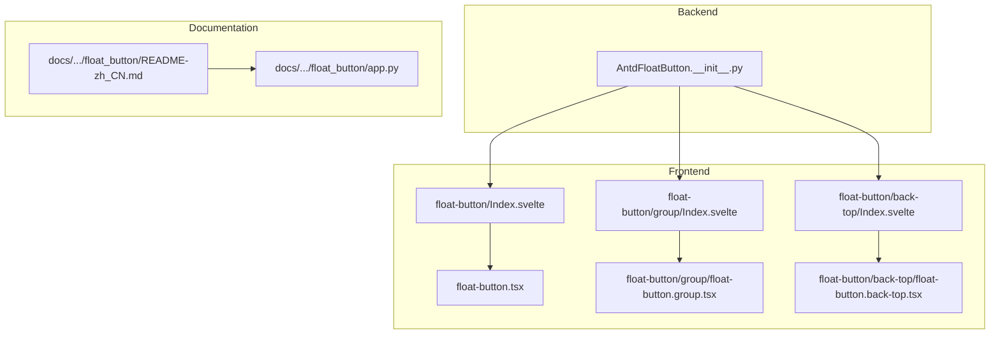
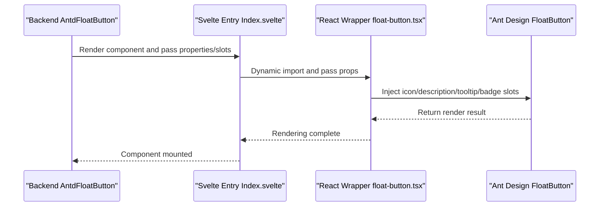
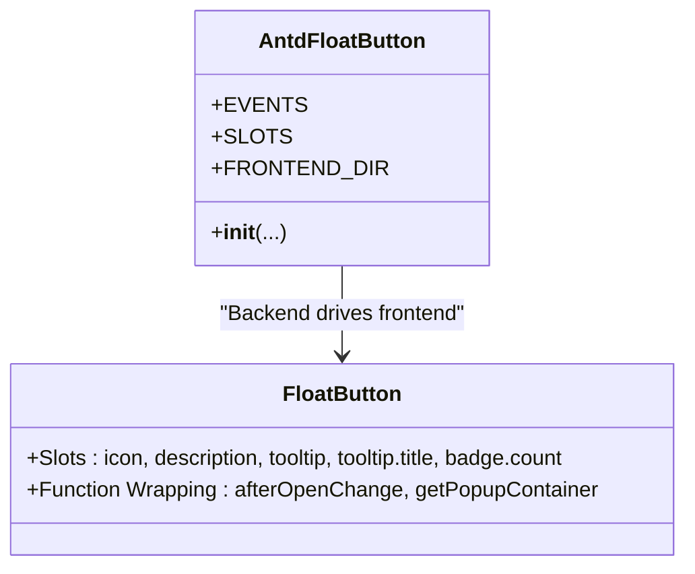
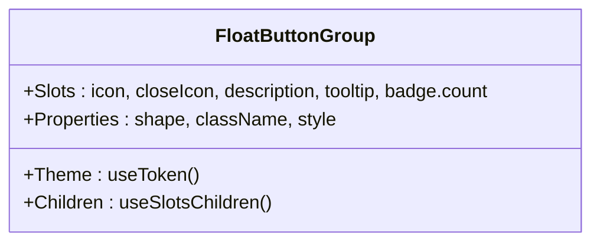
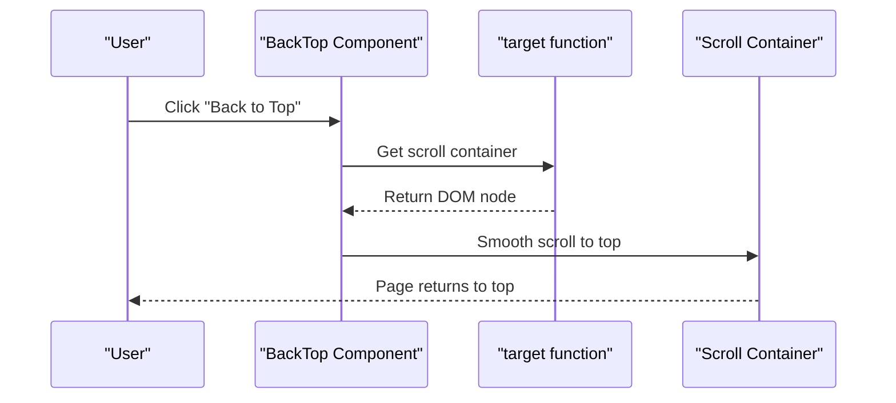
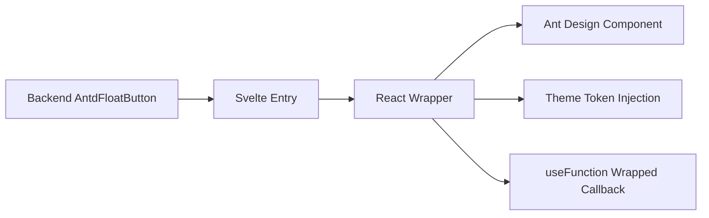

# FloatButton

<cite>
**Files referenced in this document**
- [Index.svelte](file://frontend/antd/float-button/Index.svelte)
- [float-button.tsx](file://frontend/antd/float-button/float-button.tsx)
- [group/Index.svelte](file://frontend/antd/float-button/group/Index.svelte)
- [group/float-button.group.tsx](file://frontend/antd/float-button/group/float-button.group.tsx)
- [back-top/Index.svelte](file://frontend/antd/float-button/back-top/Index.svelte)
- [back-top/float-button.back-top.tsx](file://frontend/antd/float-button/back-top/float-button.back-top.tsx)
- [__init__.py](file://backend/modelscope_studio/components/antd/float_button/__init__.py)
- [README-zh_CN.md](file://docs/components/antd/float_button/README-zh_CN.md)
- [app.py](file://docs/components/antd/float_button/app.py)
</cite>

## Table of Contents

1. [Introduction](#introduction)
2. [Project Structure](#project-structure)
3. [Core Components](#core-components)
4. [Architecture Overview](#architecture-overview)
5. [Detailed Component Analysis](#detailed-component-analysis)
6. [Dependency Analysis](#dependency-analysis)
7. [Performance Considerations](#performance-considerations)
8. [Troubleshooting Guide](#troubleshooting-guide)
9. [Conclusion](#conclusion)
10. [Appendix](#appendix)

## Introduction

FloatButton is a "floating button" component used to provide globally accessible function entries at any position on the page. It is implemented based on Ant Design's FloatButton and presented as a unified component form in the model domain through Gradio frontend bridge layer. This component supports extension capabilities such as icons, description text, tooltip popups, and badge count; meanwhile, it provides two enhanced sub-features: "FloatButton Group" and "Back to Top", used for combining multiple actions and quickly returning to the top of the page respectively.

Design Goals:

- Remain visible at any scroll state on the page, improving user accessibility
- Provide flexible layout position and size control, meeting different page styles
- Support slot-based extensions (such as custom icons, descriptions, tooltips, badges)
- Collaborate with scroll containers and content areas to avoid blocking critical information
- Cover mobile and responsive scenarios, ensuring consistent interaction experience

## Project Structure

FloatButton component consists of backend Python component class and frontend Svelte/React wrapper layer, with documentation examples demonstrated through the docs layer.

Diagram Source

- [**init**.py:12-110](file://backend/modelscope_studio/components/antd/float_button/__init__.py#L12-L110)
- [Index.svelte:1-70](file://frontend/antd/float-button/Index.svelte#L1-L70)
- [float-button.tsx:1-75](file://frontend/antd/float-button/float-button.tsx#L1-L75)
- [group/Index.svelte:1-72](file://frontend/antd/float-button/group/Index.svelte#L1-L72)
- [group/float-button.group.tsx:1-70](file://frontend/antd/float-button/group/float-button.group.tsx#L1-L70)
- [back-top/Index.svelte:1-73](file://frontend/antd/float-button/back-top/Index.svelte#L1-L73)
- [back-top/float-button.back-top.tsx:1-47](file://frontend/antd/float-button/back-top/float-button.back-top.tsx#L1-L47)
- [README-zh_CN.md:1-8](file://docs/components/antd/float_button/README-zh_CN.md#L1-L8)
- [app.py:1-7](file://docs/components/antd/float_button/app.py#L1-L7)

Section Source

- [**init**.py:12-110](file://backend/modelscope_studio/components/antd/float_button/__init__.py#L12-L110)
- [README-zh_CN.md:1-8](file://docs/components/antd/float_button/README-zh_CN.md#L1-L8)
- [app.py:1-7](file://docs/components/antd/float_button/app.py#L1-L7)

## Core Components

- AntdFloatButton: Backend component class, declares events, slots, and properties, responsible for mapping frontend components to Gradio ecosystem.
- FloatButton: Frontend wrapper, interfaces with Ant Design's FloatButton, supporting slot injection and function-type callback handling.
- FloatButton.Group: Frontend wrapper, used to combine multiple floating buttons, supporting close icon, shape, theme variables, etc.
- FloatButton.BackTop: Frontend wrapper, provides "back to top" capability, supporting custom scroll container retrieval logic.

Section Source

- [**init**.py:12-110](file://backend/modelscope_studio/components/antd/float_button/__init__.py#L12-L110)
- [float-button.tsx:14-75](file://frontend/antd/float-button/float-button.tsx#L14-L75)
- [group/float-button.group.tsx:10-70](file://frontend/antd/float-button/group/float-button.group.tsx#L10-L70)
- [back-top/float-button.back-top.tsx:7-47](file://frontend/antd/float-button/back-top/float-button.back-top.tsx#L7-L47)

## Architecture Overview

The diagram below shows the overall call chain from backend component class to frontend wrapper and then to Ant Design component.

Diagram Source

- [**init**.py:92-96](file://backend/modelscope_studio/components/antd/float_button/__init__.py#L92-L96)
- [Index.svelte:10-69](file://frontend/antd/float-button/Index.svelte#L10-L69)
- [float-button.tsx:14-72](file://frontend/antd/float-button/float-button.tsx#L14-L72)

## Detailed Component Analysis

### Component 1: FloatButton

- Design Concept
  - As a global page entry, ensuring clickable trigger at any scroll position
  - Supports extensions like icons, descriptions, tooltips, and badges through slot system
- Key Features
  - Slot Support: icon, description, tooltip, tooltip.title, badge.count
  - Callback Function Safety Handling: Wraps function-type properties like tooltip.afterOpenChange, tooltip.getPopupContainer
  - Visibility Control: Controls rendering through visible
- Usage Scenarios
  - Quick action entries (like "Back to Top", "Share", "Feedback")
  - Entry buttons for multi-state switching or conditional display
- Configuration Points
  - Icon and Shape: icon, shape
  - Type and Style: type, root_class_name, class_names, styles
  - Link and Native Properties: href, href_target, html_type
  - Badge and Tooltip: badge, tooltip
- Interaction Behavior
  - Supports click event binding
  - Tooltip supports delayed open/close callbacks and popup container selection

Diagram Source

- [**init**.py:12-32](file://backend/modelscope_studio/components/antd/float_button/__init__.py#L12-L32)
- [float-button.tsx:14-72](file://frontend/antd/float-button/float-button.tsx#L14-L72)

Section Source

- [**init**.py:12-110](file://backend/modelscope_studio/components/antd/float_button/__init__.py#L12-L110)
- [Index.svelte:13-51](file://frontend/antd/float-button/Index.svelte#L13-L51)
- [float-button.tsx:14-72](file://frontend/antd/float-button/float-button.tsx#L14-L72)

### Component 2: FloatButton.Group

- Design Concept
  - Combines multiple floating buttons into one group, forming a compound entry, reducing page element count
  - Supports close icon, shape (circle/square), and theme variable injection
- Key Features
  - Slot Support: icon, closeIcon, description, tooltip, badge.count
  - Shape and Style: shape, className, inline style overriding theme variables
  - Child Item Rendering: Separates slots from regular child nodes through useSlotsChildren
- Usage Scenarios
  - Multi-function entry aggregation (like "Edit/Favorite/Share/More")
  - Expandable/collapsible compound action areas
- Configuration Points
  - Group Shape: shape (circle/square)
  - Theme Variables: Inject border radius, etc. through CSS variables
  - Slot-based Icons and Tooltips: Supports independent configuration for each child item

Diagram Source

- [group/float-button.group.tsx:10-67](file://frontend/antd/float-button/group/float-button.group.tsx#L10-L67)

Section Source

- [group/Index.svelte:14-50](file://frontend/antd/float-button/group/Index.svelte#L14-L50)
- [group/float-button.group.tsx:10-67](file://frontend/antd/float-button/group/float-button.group.tsx#L10-L67)

### Component 3: FloatButton.BackTop

- Design Concept
  - Provides one-click back to top capability in long pages, improving navigation efficiency
  - Supports custom scroll container retrieval logic, adapting to complex layouts
- Key Features
  - Slot Support: icon, description, tooltip, badge.count
  - Custom Target Container: target function wrapping, supports dynamic selection of scroll container
- Usage Scenarios
  - Long content pages like content pages, list pages, detail pages
  - Scenarios requiring frequent up/down scrolling
- Configuration Points
  - Icon and Tooltip: icon, tooltip
  - Badge and Description: badge, description
  - Scroll Container: target (function), returns scroll container DOM node

Diagram Source

- [back-top/float-button.back-top.tsx:7-44](file://frontend/antd/float-button/back-top/float-button.back-top.tsx#L7-L44)

Section Source

- [back-top/Index.svelte:14-50](file://frontend/antd/float-button/back-top/Index.svelte#L14-L50)
- [back-top/float-button.back-top.tsx:7-44](file://frontend/antd/float-button/back-top/float-button.back-top.tsx#L7-L44)

### Component 4: Backend Bridge and Event Binding

- Backend Component Class
  - Defines events: click (binds internal event handler)
  - Defines slots: icon, description, tooltip, tooltip.title, badge.count
  - Frontend directory mapping: resolve_frontend_dir("float-button")
- Documentation and Examples
  - README contains basic example placeholder
  - app.py used to start documentation site

Section Source

- [**init**.py:22-32](file://backend/modelscope_studio/components/antd/float_button/__init__.py#L22-L32)
- [**init**.py:92-96](file://backend/modelscope_studio/components/antd/float_button/__init__.py#L92-L96)
- [README-zh_CN.md:1-8](file://docs/components/antd/float_button/README-zh_CN.md#L1-L8)
- [app.py:1-7](file://docs/components/antd/float_button/app.py#L1-L7)

## Dependency Analysis

- Component Coupling
  - Backend AntdFloatButton only handles property and event declaration, does not directly render, reducing coupling
  - Frontend achieves on-demand loading and decoupling through Svelte dynamic import wrapper
- Slots and Themes
  - Group component introduces Ant Design theme token, injecting CSS variables to adapt border radius, etc.
- Function-type Properties
  - Wraps tooltip callbacks and target through useFunction, ensuring stable operation in React/Svelte environments

Diagram Source

- [**init**.py:92-96](file://backend/modelscope_studio/components/antd/float_button/__init__.py#L92-L96)
- [Index.svelte:10-69](file://frontend/antd/float-button/Index.svelte#L10-L69)
- [float-button.tsx:20-28](file://frontend/antd/float-button/float-button.tsx#L20-L28)
- [group/float-button.group.tsx:16-31](file://frontend/antd/float-button/group/float-button.group.tsx#L16-L31)
- [back-top/float-button.back-top.tsx:11](file://frontend/antd/float-button/back-top/float-button.back-top.tsx#L11)

Section Source

- [**init**.py:92-96](file://backend/modelscope_studio/components/antd/float_button/__init__.py#L92-L96)
- [float-button.tsx:20-28](file://frontend/antd/float-button/float-button.tsx#L20-L28)
- [group/float-button.group.tsx:16-31](file://frontend/antd/float-button/group/float-button.group.tsx#L16-L31)
- [back-top/float-button.back-top.tsx:11](file://frontend/antd/float-button/back-top/float-button.back-top.tsx#L11)

## Performance Considerations

- On-demand Loading
  - Svelte avoids initial bundle bloat through dynamic import wrapper
- Rendering Overhead
  - Slot content is hidden by default, only injected into Ant Design component when needed
- Callback Functions
  - Use useFunction to wrap function-type properties, reducing unnecessary re-renders
- Theme Injection
  - Group component injects theme tokens through CSS variables, avoiding repeated style calculations

Section Source

- [Index.svelte:10-10](file://frontend/antd/float-button/Index.svelte#L10-L10)
- [float-button.tsx:30-71](file://frontend/antd/float-button/float-button.tsx#L30-L71)
- [group/float-button.group.tsx:16-31](file://frontend/antd/float-button/group/float-button.group.tsx#L16-L31)

## Troubleshooting Guide

- FloatButton Not Displaying
  - Check whether visible is true
  - Confirm FRONTEND_DIR mapping is correct
- Slot Not Working
  - Ensure slot names match the component support list (icon, description, tooltip, tooltip.title, badge.count)
  - Group component additionally supports closeIcon, badge.count
- Back to Top Not Working
  - Check whether target function returns a valid scroll container DOM node
- Tooltip Callback Not Triggered
  - Confirm tooltip.afterOpenChange, tooltip.getPopupContainer are wrapped through useFunction

Section Source

- [Index.svelte:56-69](file://frontend/antd/float-button/Index.svelte#L56-L69)
- [float-button.tsx:14-72](file://frontend/antd/float-button/float-button.tsx#L14-L72)
- [group/float-button.group.tsx:10-67](file://frontend/antd/float-button/group/float-button.group.tsx#L10-L67)
- [back-top/float-button.back-top.tsx:7-44](file://frontend/antd/float-button/back-top/float-button.back-top.tsx#L7-L44)

## Conclusion

The FloatButton component achieves seamless integration and extension with Ant Design through the collaboration of backend bridge and frontend wrapper. Its slot-based design, theme injection, and function-type property wrapping maintain good maintainability and extensibility even in complex page layouts. Combined with the enhanced capabilities of "FloatButton Group" and "Back to Top", it can cover various common interaction scenarios, improving user experience and development efficiency.

## Appendix

- Examples and Documentation
  - Documentation example entry: docs/components/antd/float_button/README-zh_CN.md
  - Documentation site startup: docs/components/antd/float_button/app.py

Section Source

- [README-zh_CN.md:1-8](file://docs/components/antd/float_button/README-zh_CN.md#L1-L8)
- [app.py:1-7](file://docs/components/antd/float_button/app.py#L1-L7)
