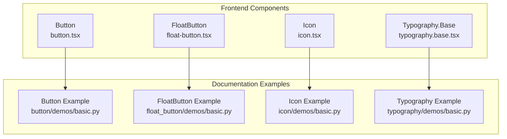
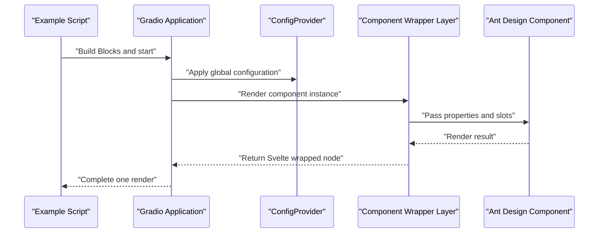
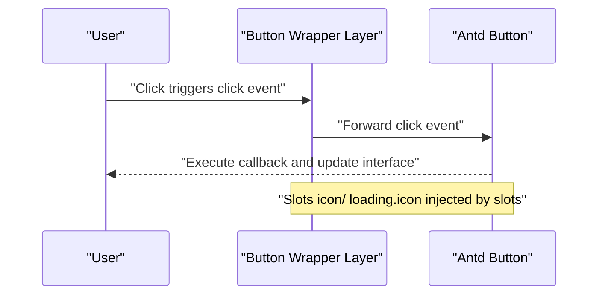
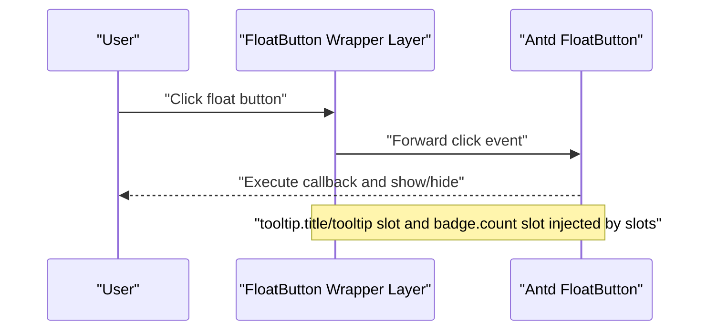
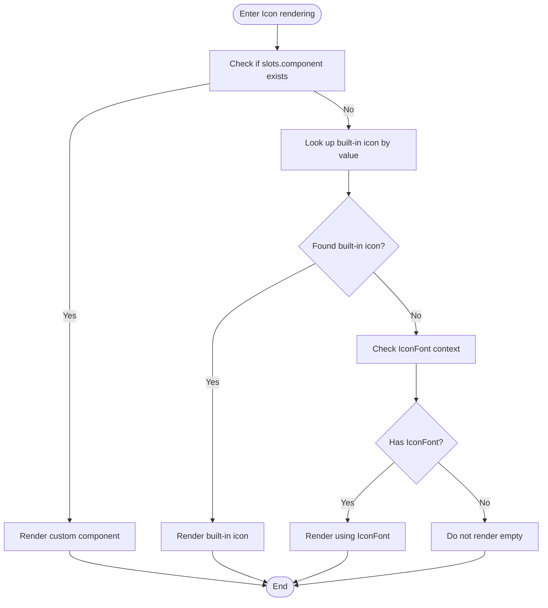
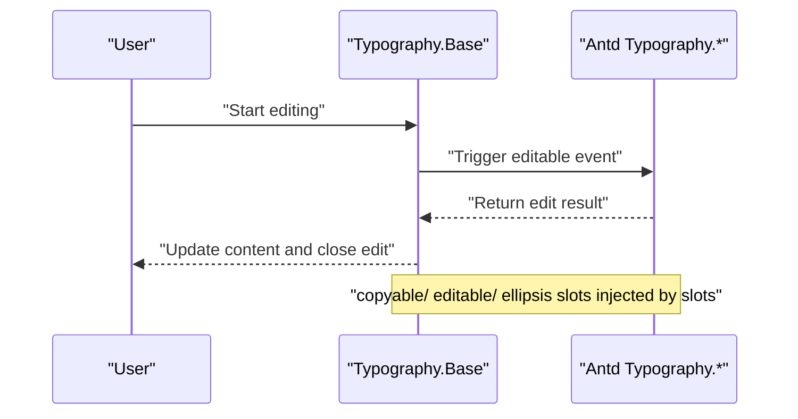
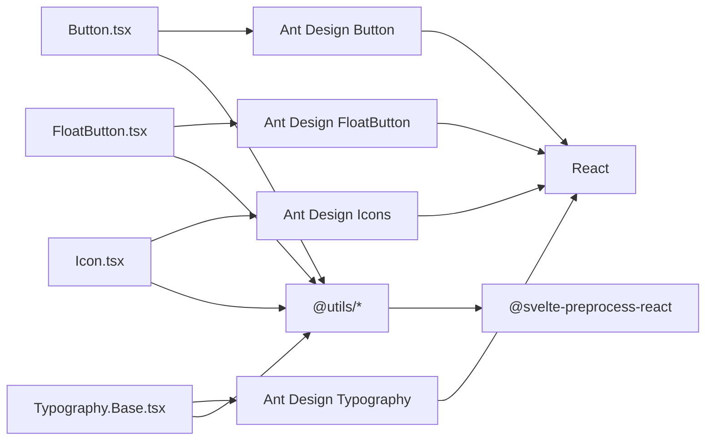

# General Components

<cite>
**Files referenced in this document**
- [button.tsx](file://frontend/antd/button/button.tsx)
- [float-button.tsx](file://frontend/antd/float-button/float-button.tsx)
- [icon.tsx](file://frontend/antd/icon/icon.tsx)
- [typography.base.tsx](file://frontend/antd/typography/typography.base.tsx)
- [basic.py (Button)](file://docs/components/antd/button/demos/basic.py)
- [basic.py (FloatButton)](file://docs/components/antd/float_button/demos/basic.py)
- [basic.py (Icon)](file://docs/components/antd/icon/demos/basic.py)
- [basic.py (Typography)](file://docs/components/antd/typography/demos/basic.py)
- [README-zh_CN.md (Button)](file://docs/components/antd/button/README-zh_CN.md)
- [README-zh_CN.md (FloatButton)](file://docs/components/antd/float_button/README-zh_CN.md)
- [README-zh_CN.md (Icon)](file://docs/components/antd/icon/README-zh_CN.md)
- [README-zh_CN.md (Typography)](file://docs/components/antd/typography/README-zh_CN.md)
</cite>

## Table of Contents

1. [Introduction](#introduction)
2. [Project Structure](#project-structure)
3. [Core Components](#core-components)
4. [Architecture Overview](#architecture-overview)
5. [Detailed Component Analysis](#detailed-component-analysis)
6. [Dependency Analysis](#dependency-analysis)
7. [Performance Considerations](#performance-considerations)
8. [Troubleshooting Guide](#troubleshooting-guide)
9. [Conclusion](#conclusion)
10. [Appendix](#appendix)

## Introduction

This chapter covers the implementation and usage of Ant Design general components in this repository, focusing on the following basic general components: Button, FloatButton, Icon, and Typography. The documentation provides in-depth analysis from aspects including system architecture, component responsibilities, data and event flow, accessibility and keyboard navigation, style and theme customization, best practices for combined usage, and performance optimization, with example paths to guide readers in getting started quickly.

## Project Structure

This project uses an organization of "frontend Svelte component wrapping + backend Gradio example demonstration":

- Frontend components are located under frontend/antd, where each component consists of a svelte file and a tsx wrapper layer. The tsx layer is responsible for bridging Ant Design's React components to the Svelte ecosystem, and extending child content like icons, tooltips, and badges through the slots mechanism.
- Documentation examples are located under docs/components/antd, where each component provides multiple demo scripts (basic.py, etc.) to demonstrate different properties and interaction scenarios.

Diagram Source

- [button.tsx:1-39](file://frontend/antd/button/button.tsx#L1-L39)
- [float-button.tsx:1-75](file://frontend/antd/float-button/float-button.tsx#L1-L75)
- [icon.tsx:1-55](file://frontend/antd/icon/icon.tsx#L1-L55)
- [typography.base.tsx:1-170](file://frontend/antd/typography/typography.base.tsx#L1-L170)
- [basic.py (Button):1-26](file://docs/components/antd/button/demos/basic.py#L1-L26)
- [basic.py (FloatButton):1-30](file://docs/components/antd/float_button/demos/basic.py#L1-L30)
- [basic.py (Icon):1-24](file://docs/components/antd/icon/demos/basic.py#L1-L24)
- [basic.py (Typography):1-23](file://docs/components/antd/typography/demos/basic.py#L1-L23)

Section Source

- [README-zh_CN.md (Button):1-8](file://docs/components/antd/button/README-zh_CN.md#L1-L8)
- [README-zh_CN.md (FloatButton):1-8](file://docs/components/antd/float_button/README-zh_CN.md#L1-L8)
- [README-zh_CN.md (Icon):1-10](file://docs/components/antd/icon/README-zh_CN.md#L1-L10)
- [README-zh_CN.md (Typography):1-8](file://docs/components/antd/typography/README-zh_CN.md#L1-L8)

## Core Components

- Button
  - Responsibility: Wraps Ant Design's Button, supports injecting icon and custom loading icon through slots; supports dual entry rendering via value and children.
  - Key Points: Uses useTargets to extract slot targets, dynamically determining render content; conditionally merges loading configuration, compatible with both objects and booleans.
- FloatButton
  - Responsibility: Wraps Ant Design's FloatButton, supports slot-based configuration for icon, description, tooltip, badge, etc.; wraps function-type configuration items with useFunction to maintain reactivity.
  - Key Points: tooltip supports title and overall configuration object; badge supports count slot; description supports slot.
- Icon
  - Responsibility: Supports Ant Design built-in icon name mapping and IconFont rendering; supports custom component slot as SVG component.
  - Key Points: slots.component has highest priority; otherwise maps to built-in icon by value; finally falls back to IconFont type.
- Typography.Base
  - Responsibility: Unifies and aggregates four typography component types: Title, Text, Paragraph, Link, supporting slot-based configuration for copyable, editable, and ellipsis.
  - Key Points: Dynamically selects specific Typography sub-component based on component; processes multiple slots with useTargets and renderParamsSlot, ensuring flexibility and extensibility.

Section Source

- [button.tsx:1-39](file://frontend/antd/button/button.tsx#L1-L39)
- [float-button.tsx:1-75](file://frontend/antd/float-button/float-button.tsx#L1-L75)
- [icon.tsx:1-55](file://frontend/antd/icon/icon.tsx#L1-L55)
- [typography.base.tsx:1-170](file://frontend/antd/typography/typography.base.tsx#L1-L170)

## Architecture Overview

The diagram below shows the call chain for general components: documentation examples start through Gradio application, internally use ConfigProvider for global theme configuration, then render each component; components internally bridge Ant Design's React components to Svelte components through sveltify, and inject icons, tooltips, badges, etc. using the slots mechanism.

Diagram Source

- [basic.py (Button):5-25](file://docs/components/antd/button/demos/basic.py#L5-L25)
- [basic.py (FloatButton):5-29](file://docs/components/antd/float_button/demos/basic.py#L5-L29)
- [basic.py (Icon):5-23](file://docs/components/antd/icon/demos/basic.py#L5-L23)
- [basic.py (Typography):10-22](file://docs/components/antd/typography/demos/basic.py#L10-L22)
- [button.tsx:8-36](file://frontend/antd/button/button.tsx#L8-L36)
- [float-button.tsx:14-72](file://frontend/antd/float-button/float-button.tsx#L14-L72)
- [icon.tsx:12-52](file://frontend/antd/icon/icon.tsx#L12-L52)
- [typography.base.tsx:19-167](file://frontend/antd/typography/typography.base.tsx#L19-L167)

## Detailed Component Analysis

### Button

- Design Points
  - Supports multiple types and variants: such as primary, dashed, text, link, filled, etc.; supports block layout and size control.
  - Slot Capabilities: Inject icons through slots.icon; inject loading state icons through slots.loading.icon, supporting delay configuration.
  - Content Entry: Supports directly passing text (children) or value field; when slots exist, slot content is rendered first.
- Events and Interaction
  - click event: The example demonstrates click callback binding.
  - Loading State: Can be configured via loading=true or passing an object to configure delay time.
- Styles and Themes
  - Global theme takes effect through ConfigProvider; supports color and variant combinations.
- Usage Examples (Reference Path)
  - Basic usage and variants: [basic.py (Button):8-22](file://docs/components/antd/button/demos/basic.py#L8-L22)
  - Slot icons and loading state: [basic.py (Button):18-22](file://docs/components/antd/button/demos/basic.py#L18-L22)

Diagram Source

- [button.tsx:11-36](file://frontend/antd/button/button.tsx#L11-L36)
- [basic.py (Button):10-10](file://docs/components/antd/button/demos/basic.py#L10-L10)

Section Source

- [button.tsx:8-36](file://frontend/antd/button/button.tsx#L8-L36)
- [basic.py (Button):8-22](file://docs/components/antd/button/demos/basic.py#L8-L22)

### FloatButton

- Design Points
  - Supports sub-components like Group and BackTop; supports slot-based configuration for icon, description, tooltip, badge, etc.
  - tooltip supports title and overall configuration object; badge supports count slot; description supports slot.
  - Uses useFunction to wrap function-type configuration items (like afterOpenChange, getPopupContainer), ensuring reactive updates.
- Events and Interaction
  - Supports click, visibility control (BackTop's visibility_height), etc.
- Styles and Themes
  - Customize position and layout through elem_style; combine with Group to implement multi-button grouping.
- Usage Examples (Reference Path)
  - Basic usage and grouping: [basic.py (FloatButton):8-13](file://docs/components/antd/float_button/demos/basic.py#L8-L13)
  - Badge and icon: [basic.py (FloatButton):10-12](file://docs/components/antd/float_button/demos/basic.py#L10-L12)
  - BackTop and Tooltip slots: [basic.py (FloatButton):13-13](file://docs/components/antd/float_button/demos/basic.py#L13-L13), [basic.py (FloatButton):23-27](file://docs/components/antd/float_button/demos/basic.py#L23-L27)

Diagram Source

- [float-button.tsx:14-72](file://frontend/antd/float-button/float-button.tsx#L14-L72)
- [basic.py (FloatButton):13-13](file://docs/components/antd/float_button/demos/basic.py#L13-L13)
- [basic.py (FloatButton):23-27](file://docs/components/antd/float_button/demos/basic.py#L23-L27)

Section Source

- [float-button.tsx:7-72](file://frontend/antd/float-button/float-button.tsx#L7-L72)
- [basic.py (FloatButton):8-27](file://docs/components/antd/float_button/demos/basic.py#L8-L27)

### Icon

- Design Points
  - Supports built-in icon name mapping (like HomeOutlined, SettingFilled, etc.); supports spin, rotate, twoTone, etc. properties.
  - Supports IconFont fallback rendering; supports slots.component to inject custom SVG components.
- Events and Interaction
  - The example demonstrates click event binding.
- Styles and Themes
  - Supports style controls like color, rotation angle, two-tone icons, etc.
- Usage Examples (Reference Path)
  - Basic icons and two-tone icons: [basic.py (Icon):9-16](file://docs/components/antd/icon/demos/basic.py#L9-L16)
  - Custom component slots: [basic.py (Icon):19-21](file://docs/components/antd/icon/demos/basic.py#L19-L21)

Diagram Source

- [icon.tsx:12-52](file://frontend/antd/icon/icon.tsx#L12-L52)
- [basic.py (Icon):9-16](file://docs/components/antd/icon/demos/basic.py#L9-L16)
- [basic.py (Icon):19-21](file://docs/components/antd/icon/demos/basic.py#L19-L21)

Section Source

- [icon.tsx:12-52](file://frontend/antd/icon/icon.tsx#L12-L52)
- [basic.py (Icon):9-21](file://docs/components/antd/icon/demos/basic.py#L9-L21)

### Typography.Base

- Design Points
  - Unifies and aggregates four component types: Title, Text, Paragraph, Link, switching via component parameter.
  - Supports slot-based configuration for copyable, editable, and ellipsis, enhancing customizability.
  - Uses useSlotsChildren and useTargets to separate slot content from regular children, avoiding duplicate rendering.
- Events and Interaction
  - editable_change event: The example demonstrates binding for edit change event and output update.
- Styles and Themes
  - Generates class names through className and component name prefix, facilitating theme override.
- Usage Examples (Reference Path)
  - Basic titles and text: [basic.py (Typography):13-15](file://docs/components/antd/typography/demos/basic.py#L13-L15)
  - Copyable paragraphs and edit events: [basic.py (Typography):16-19](file://docs/components/antd/typography/demos/basic.py#L16-L19)

Diagram Source

- [typography.base.tsx:19-167](file://frontend/antd/typography/typography.base.tsx#L19-L167)
- [basic.py (Typography):16-19](file://docs/components/antd/typography/demos/basic.py#L16-L19)

Section Source

- [typography.base.tsx:19-167](file://frontend/antd/typography/typography.base.tsx#L19-L167)
- [basic.py (Typography):13-19](file://docs/components/antd/typography/demos/basic.py#L13-L19)

## Dependency Analysis

- Inter-component Coupling
  - Button, FloatButton, Icon, and Typography.Base all bridge Ant Design's React components to Svelte through sveltify, independent of each other with low coupling.
  - The slot mechanism (slots) runs through all components, used to inject child content like icons, tooltips, badges, etc., enhancing extensibility.
- External Dependencies
  - Ant Design React component library: Provides basic UI capabilities.
  - @svelte-preprocess-react: Provides sveltify and ReactSlot, implementing Svelte and React interoperability.
  - lodash-es: Provides utility functions (like isObject).
  - @utils/\*: Provides useTargets, useFunction, renderParamsSlot, and other utilities, enhancing slot and event handling capabilities.
- Potential Circular Dependencies
  - No circular dependencies found in the current structure; components all collaborate through utility functions and contexts, maintaining one-way dependencies.

Diagram Source

- [button.tsx:1-6](file://frontend/antd/button/button.tsx#L1-L6)
- [float-button.tsx:1-5](file://frontend/antd/float-button/float-button.tsx#L1-L5)
- [icon.tsx:1-6](file://frontend/antd/icon/icon.tsx#L1-L6)
- [typography.base.tsx:1-10](file://frontend/antd/typography/typography.base.tsx#L1-L10)

Section Source

- [button.tsx:1-6](file://frontend/antd/button/button.tsx#L1-L6)
- [float-button.tsx:1-5](file://frontend/antd/float-button/float-button.tsx#L1-L5)
- [icon.tsx:1-6](file://frontend/antd/icon/icon.tsx#L1-L6)
- [typography.base.tsx:1-10](file://frontend/antd/typography/typography.base.tsx#L1-L10)

## Performance Considerations

- Slot Rendering Optimization
  - Uses useTargets and useSlotsChildren to separate slots from regular children, reducing unnecessary rendering overhead.
  - Conditionally injects loading.icon, copyable.icon, editable.icon, etc., avoiding useless node mounting.
- Function-type Configuration Wrapping
  - Uses useFunction to wrap function-type configurations for tooltip (like afterOpenChange, getPopupContainer), ensuring reactive updates without closure jitter.
- Conditional Merging
  - Merges copyable, editable, ellipsis, etc. configurations through getConfig and omitUndefinedProps, only enabling corresponding capabilities when needed, reducing runtime burden.
- Theme and Styles
  - Unifies theme through ConfigProvider, avoiding repeated calculations and style conflicts; reasonably uses className prefix for precise override.

## Troubleshooting Guide

- Slot Not Working
  - Confirm whether slot names are correct (like icon, loading.icon, copyable.icon, editable.icon, ellipsis.symbol, etc.).
  - Confirm slots.component has higher priority than built-in icon mapping; if provided, it will override default behavior.
- Tooltip Cannot Open or Callback Invalid
  - Check whether tooltip is an object configuration; ensure function-type configuration items are wrapped through useFunction.
- Icon Not Displaying
  - If slots.component is not provided, confirm whether value is a built-in icon name; otherwise, need to correctly configure IconFont context.
- Edit/Copy/Ellipsis Configuration Not Working
  - Confirm that editable, copyable, or ellipsis enable corresponding capability if any exists; if it's an object configuration, ensure fields are complete.

Section Source

- [float-button.tsx:14-72](file://frontend/antd/float-button/float-button.tsx#L14-L72)
- [icon.tsx:12-52](file://frontend/antd/icon/icon.tsx#L12-L52)
- [typography.base.tsx:19-167](file://frontend/antd/typography/typography.base.tsx#L19-L167)

## Conclusion

This repository seamlessly integrates Ant Design's React components into the Svelte/Gradio ecosystem through unified sveltify wrapping and slot mechanism, achieving high customizability and ease of use for general components like Button, FloatButton, Icon, and Typography. With ConfigProvider, slots, and utility functions, developers can flexibly implement style customization, interaction extension, and accessibility requirements. It is recommended to follow slot naming conventions, reasonably use function-type configuration wrapping and conditional rendering strategies in actual projects for better performance and maintainability.

## Appendix

- Quick Example Paths
  - Button: [basic.py (Button):8-22](file://docs/components/antd/button/demos/basic.py#L8-L22)
  - FloatButton: [basic.py (FloatButton):8-27](file://docs/components/antd/float_button/demos/basic.py#L8-L27)
  - Icon: [basic.py (Icon):9-21](file://docs/components/antd/icon/demos/basic.py#L9-L21)
  - Typography: [basic.py (Typography):13-19](file://docs/components/antd/typography/demos/basic.py#L13-L19)
- Component Documentation Entry
  - Button: [README-zh_CN.md (Button):1-8](file://docs/components/antd/button/README-zh_CN.md#L1-L8)
  - FloatButton: [README-zh_CN.md (FloatButton):1-8](file://docs/components/antd/float_button/README-zh_CN.md#L1-L8)
  - Icon: [README-zh_CN.md (Icon):1-10](file://docs/components/antd/icon/README-zh_CN.md#L1-L10)
  - Typography: [README-zh_CN.md (Typography):1-8](file://docs/components/antd/typography/README-zh_CN.md#L1-L8)
