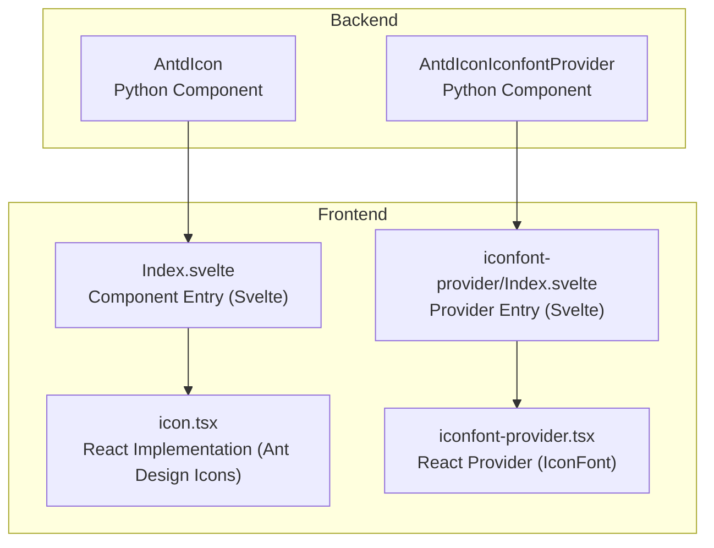
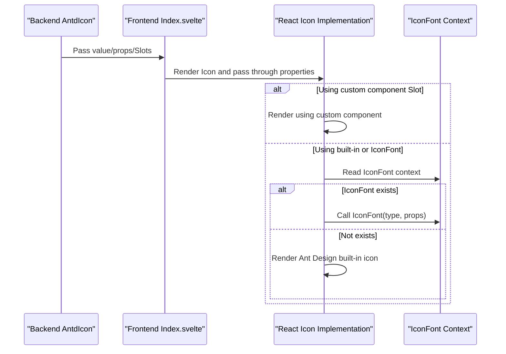
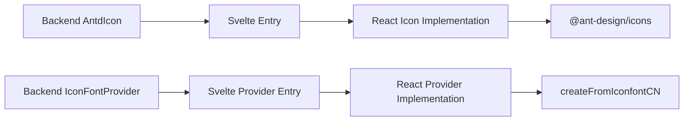

# Icon

<cite>
**Files referenced in this document**
- [frontend/antd/icon/Index.svelte](file://frontend/antd/icon/Index.svelte)
- [frontend/antd/icon/icon.tsx](file://frontend/antd/icon/icon.tsx)
- [frontend/antd/icon/iconfont-provider/Index.svelte](file://frontend/antd/icon/iconfont-provider/Index.svelte)
- [frontend/antd/icon/iconfont-provider/iconfont-provider.tsx](file://frontend/antd/icon/iconfont-provider/iconfont-provider.tsx)
- [backend/modelscope_studio/components/antd/icon/__init__.py](file://backend/modelscope_studio/components/antd/icon/__init__.py)
- [backend/modelscope_studio/components/antd/components.py](file://backend/modelscope_studio/components/antd/components.py)
- [docs/components/antd/icon/README-zh_CN.md](file://docs/components/antd/icon/README-zh_CN.md)
- [docs/components/antd/icon/demos/basic.py](file://docs/components/antd/icon/demos/basic.py)
- [docs/components/antd/icon/demos/iconfont.py](file://docs/components/antd/icon/demos/iconfont.py)
</cite>

## Table of Contents

1. [Introduction](#introduction)
2. [Project Structure](#project-structure)
3. [Core Components](#core-components)
4. [Architecture Overview](#architecture-overview)
5. [Component Details](#component-details)
6. [Dependency Analysis](#dependency-analysis)
7. [Performance and Optimization](#performance-and-optimization)
8. [Accessibility](#accessibility)
9. [Troubleshooting](#troubleshooting)
10. [Conclusion](#conclusion)
11. [Appendix: Usage Examples and Best Practices](#appendix-usage-examples-and-best-practices)

## Introduction

This document systematically introduces the Icon component in ModelScope Studio's frontend ecosystem, covering:

- Usage guidelines and common scenarios (inline icons, button icons, navigation icons)
- Supported icon libraries and icon font integration (Ant Design built-in icons, iconfont.cn)
- Size, color, style, and other configuration options
- IconFontProvider configuration and usage
- Performance optimization, lazy loading, and caching strategies
- Accessibility, semantic markup, and screen reader compatibility
- Custom icon library integration solutions and best practices

## Project Structure

The Icon component consists of "backend Gradio component layer" and "frontend Svelte/React presentation layer", and supports custom rendering through the Slot mechanism.

Diagram Source

- [backend/modelscope_studio/components/antd/icon/**init**.py:9-88](file://backend/modelscope_studio/components/antd/icon/__init__.py#L9-L88)
- [frontend/antd/icon/Index.svelte:1-67](file://frontend/antd/icon/Index.svelte#L1-L67)
- [frontend/antd/icon/icon.tsx:1-55](file://frontend/antd/icon/icon.tsx#L1-L55)
- [frontend/antd/icon/iconfont-provider/Index.svelte:1-53](file://frontend/antd/icon/iconfont-provider/Index.svelte#L1-L53)
- [frontend/antd/icon/iconfont-provider/iconfont-provider.tsx:1-44](file://frontend/antd/icon/iconfont-provider/iconfont-provider.tsx#L1-L44)

Section Source

- [backend/modelscope_studio/components/antd/icon/**init**.py:9-88](file://backend/modelscope_studio/components/antd/icon/__init__.py#L9-L88)
- [frontend/antd/icon/Index.svelte:1-67](file://frontend/antd/icon/Index.svelte#L1-L67)
- [frontend/antd/icon/icon.tsx:1-55](file://frontend/antd/icon/icon.tsx#L1-L55)
- [frontend/antd/icon/iconfont-provider/Index.svelte:1-53](file://frontend/antd/icon/iconfont-provider/Index.svelte#L1-L53)
- [frontend/antd/icon/iconfont-provider/iconfont-provider.tsx:1-44](file://frontend/antd/icon/iconfont-provider/iconfont-provider.tsx#L1-L44)

## Core Components

- AntdIcon (Backend): Provides properties such as value, spin, rotate, twoToneColor, component, etc.; supports click event binding; supports a Slot named "component" to inject custom rendering.
- AntdIconIconfontProvider (Backend): Provides IconFont context, used to render icons by type in icon font libraries like iconfont.cn.
- Frontend Svelte Entry: Responsible for forwarding backend-passed properties and Slots to React implementation.
- Frontend React Implementation: Selects built-in Ant Design icons based on value or renders custom icon types through IconFont context.

Section Source

- [backend/modelscope_studio/components/antd/icon/**init**.py:9-88](file://backend/modelscope_studio/components/antd/icon/__init__.py#L9-L88)
- [frontend/antd/icon/Index.svelte:1-67](file://frontend/antd/icon/Index.svelte#L1-L67)
- [frontend/antd/icon/icon.tsx:1-55](file://frontend/antd/icon/icon.tsx#L1-L55)
- [frontend/antd/icon/iconfont-provider/Index.svelte:1-53](file://frontend/antd/icon/iconfont-provider/Index.svelte#L1-L53)
- [frontend/antd/icon/iconfont-provider/iconfont-provider.tsx:1-44](file://frontend/antd/icon/iconfont-provider/iconfont-provider.tsx#L1-L44)

## Architecture Overview

The diagram below shows the key call chain from backend to frontend and then to icon rendering:

Diagram Source

- [frontend/antd/icon/Index.svelte:52-66](file://frontend/antd/icon/Index.svelte#L52-L66)
- [frontend/antd/icon/icon.tsx:17-52](file://frontend/antd/icon/icon.tsx#L17-L52)
- [frontend/antd/icon/iconfont-provider/iconfont-provider.tsx:36-41](file://frontend/antd/icon/iconfont-provider/iconfont-provider.tsx#L36-L41)

## Component Details

### AntdIcon (Backend)

- Supported Properties
  - value: String, specifies icon name (like built-in icon name or IconFont type name)
  - spin: Boolean, whether to rotate animation
  - rotate: Numeric angle, icon rotation angle
  - twoToneColor: Two-tone icon primary color
  - component: Root node component placeholder (used to replace default container)
  - Element-level styles and class names: elem_style, elem_classes
  - Visibility and rendering: visible, render
- Events
  - click: Bind click event
- Slot
  - component: Used to inject custom rendering (such as text emoticons, SVG components)

Section Source

- [backend/modelscope_studio/components/antd/icon/**init**.py:27-68](file://backend/modelscope_studio/components/antd/icon/__init__.py#L27-L68)
- [backend/modelscope_studio/components/antd/icon/**init**.py:18-22](file://backend/modelscope_studio/components/antd/icon/__init__.py#L18-L22)

### Frontend Svelte Entry (Index.svelte)

- Passes backend-provided value, additionalProps, elem\_\*, and other properties to React Icon
- Gets and forwards to React Icon through Slot
- Conditional rendering: Only renders when visible is true

Section Source

- [frontend/antd/icon/Index.svelte:13-66](file://frontend/antd/icon/Index.svelte#L13-L66)

### React Implementation (icon.tsx)

- Key Logic Points
  - Prioritizes custom component injected through "component" Slot for rendering
  - Otherwise, if built-in icon name exists, renders corresponding Ant Design icon
  - If no built-in icon and IconFont context exists, renders through IconFont(type, props)
- Key Context
  - useIconFontContext: Gets IconFont context instance

Section Source

- [frontend/antd/icon/icon.tsx:17-52](file://frontend/antd/icon/icon.tsx#L17-L52)

### AntdIconIconfontProvider (Backend)

- Provides IconFont context, enabling child-level Icons to render custom icon fonts by type
- Common Usage: Wraps a set of icons that need to use iconfont.cn

Section Source

- [backend/modelscope_studio/components/antd/icon/**init**.py:16-16](file://backend/modelscope_studio/components/antd/icon/__init__.py#L16-L16)

### Frontend Provider (iconfont-provider.tsx)

- Functionality
  - Creates IconFont instance based on createFromIconfontCN
  - Instance Caching: Reuses same instance when scriptUrl and extraCommonProps are unchanged
  - Exposes to subtree through IconFontContext.Provider
- Parameters
  - scriptUrl: Icon font script address (can be an array)
  - extraCommonProps: Extra common properties (like color, fontSize, etc.)

Section Source

- [frontend/antd/icon/iconfont-provider/iconfont-provider.tsx:12-41](file://frontend/antd/icon/iconfont-provider/iconfont-provider.tsx#L12-L41)

### Provider Frontend Entry (iconfont-provider/Index.svelte)

- Passes backend-provided Provider properties to React Provider component
- Acts as parent context container for Icons

Section Source

- [frontend/antd/icon/iconfont-provider/Index.svelte:42-52](file://frontend/antd/icon/iconfont-provider/Index.svelte#L42-L52)

## Dependency Analysis

- Component Coupling
  - AntdIcon and AntdIconIconfontProvider are associated through classes in backend
  - Frontend Svelte entry and React implementation are decoupled, communicating through properties and Slots
  - React Icon depends on Ant Design Icons and IconFont context
- External Dependencies
  - @ant-design/icons: Built-in icon library
  - lodash-es isEqual: Used for Provider instance cache comparison

Diagram Source

- [backend/modelscope_studio/components/antd/icon/**init**.py:5-6](file://backend/modelscope_studio/components/antd/icon/__init__.py#L5-L6)
- [frontend/antd/icon/icon.tsx:5-5](file://frontend/antd/icon/icon.tsx#L5-L5)
- [frontend/antd/icon/iconfont-provider/iconfont-provider.tsx:4-6](file://frontend/antd/icon/iconfont-provider/iconfont-provider.tsx#L4-L6)

Section Source

- [backend/modelscope_studio/components/antd/icon/**init**.py:5-6](file://backend/modelscope_studio/components/antd/icon/__init__.py#L5-L6)
- [frontend/antd/icon/icon.tsx:5-5](file://frontend/antd/icon/icon.tsx#L5-L5)
- [frontend/antd/icon/iconfont-provider/iconfont-provider.tsx:4-6](file://frontend/antd/icon/iconfont-provider/iconfont-provider.tsx#L4-L6)

## Performance and Optimization

- Lazy Loading and Async Rendering
  - Svelte entry uses async import for Icon and Provider, avoiding first-screen blocking
- Instance Caching
  - Provider internally caches IconFont instances based on scriptUrl and extraCommonProps equality, reducing repeated initialization
- Render Path Short-circuit
  - When custom Slot exists, directly renders custom component, skipping built-in icon resolution
- Recommendations
  - For pages with many icons, prioritize using IconFont and centrally managing scriptUrl
  - Reasonably set extraCommonProps to avoid frequent instance rebuilding
  - Avoid mixing too many different script sources under the same Provider, reducing context switching cost

Section Source

- [frontend/antd/icon/Index.svelte:10-10](file://frontend/antd/icon/Index.svelte#L10-L10)
- [frontend/antd/icon/iconfont-provider/Index.svelte:8-9](file://frontend/antd/icon/iconfont-provider/Index.svelte#L8-L9)
- [frontend/antd/icon/iconfont-provider/iconfont-provider.tsx:18-35](file://frontend/antd/icon/iconfont-provider/iconfont-provider.tsx#L18-L35)

## Accessibility

- Semantic Recommendations
  - If the icon carries interactive semantics (like "delete", "search"), it should be accompanied by readable text or aria-label
  - For decorative icons, use aria-hidden or add no extra semantics
- Screen Readers
  - Keep icons with alternative text (for example, through adjacent text or title attribute)
  - Avoid relying solely on color to convey information
- Styles and Focus
  - Click-type icons need to ensure focusable and keyboard accessible
  - Rotation/animation should not affect accessibility experience

[This section provides general guidance, no specific file references needed]

## Troubleshooting

- Icon Not Displaying
  - Check whether value is a valid built-in icon name or IconFont type name
  - If using Provider, confirm scriptUrl is correct and network accessible
- Custom Component Not Working
  - Confirm that custom rendering is correctly injected using "component" Slot
  - Check Slot name case and passing path
- Repeated Requests or Instance Jitter
  - Frequent changes to Provider's extraCommonProps or scriptUrl will cause instance rebuilding
  - Recommend fixing parameters or merging multiple script sources

Section Source

- [frontend/antd/icon/icon.tsx:32-51](file://frontend/antd/icon/icon.tsx#L32-L51)
- [frontend/antd/icon/iconfont-provider/iconfont-provider.tsx:18-35](file://frontend/antd/icon/iconfont-provider/iconfont-provider.tsx#L18-L35)

## Conclusion

This component uses a "backend component + frontend async rendering" pattern, balancing unified access to both Ant Design built-in icons and custom icon fonts like iconfont.cn. Through Slot mechanism and context caching, it satisfies both flexible extension and ensures performance and maintainability. It is recommended to centrally manage icon font resources and style parameters in projects, combining with accessibility guidelines to improve user experience.

[This section is a summary, no specific file references needed]

## Appendix: Usage Examples and Best Practices

### Basic Usage and Built-in Icons

- Scenarios: Inline icons, button icons, status icons
- Example Reference
  - [docs/components/antd/icon/demos/basic.py:9-17](file://docs/components/antd/icon/demos/basic.py#L9-L17)

Best Practices

- Provide click callbacks and readable text for interactive icons
- Use twoToneColor to control two-tone icon primary color, maintaining brand consistency

Section Source

- [docs/components/antd/icon/demos/basic.py:9-17](file://docs/components/antd/icon/demos/basic.py#L9-L17)

### Using iconfont.cn

- Scenarios: Enterprise icon libraries, third-party icon fonts
- Example Reference
  - [docs/components/antd/icon/demos/iconfont.py:9-18](file://docs/components/antd/icon/demos/iconfont.py#L9-L18)

Best Practices

- Merge multiple script sources into an array to reduce request count
- Set common properties like color, fontSize uniformly through extraCommonProps
- Wrap the set of icons that need to use the font outside the Provider

Section Source

- [docs/components/antd/icon/demos/iconfont.py:9-18](file://docs/components/antd/icon/demos/iconfont.py#L9-L18)
- [frontend/antd/icon/iconfont-provider/iconfont-provider.tsx:29-33](file://frontend/antd/icon/iconfont-provider/iconfont-provider.tsx#L29-L33)

### Custom Icon Library Integration

- Option 1: Use "component" Slot to inject any custom rendering (text, SVG, components)
  - Example Reference
    - [docs/components/antd/icon/demos/basic.py:19-21](file://docs/components/antd/icon/demos/basic.py#L19-L21)
- Option 2: Connect custom fonts through IconFontProvider
  - Example Reference
    - [docs/components/antd/icon/demos/iconfont.py:9-18](file://docs/components/antd/icon/demos/iconfont.py#L9-L18)

Best Practices

- Keep Slot rendering lightweight, avoid executing complex logic on icons
- Prefer localizing font resources or using stable CDN to reduce loading failure risk

Section Source

- [docs/components/antd/icon/demos/basic.py:19-21](file://docs/components/antd/icon/demos/basic.py#L19-L21)
- [docs/components/antd/icon/demos/iconfont.py:9-18](file://docs/components/antd/icon/demos/iconfont.py#L9-L18)

### Configuration Quick Reference

- AntdIcon (Backend)
  - value: Icon name
  - spin: Rotation animation
  - rotate: Rotation angle
  - twoToneColor: Two-tone primary color
  - component: Root node component placeholder
  - elem_style/elem_classes: Element styles and class names
  - visible/render: Visibility and rendering control
- AntdIconIconfontProvider (Backend)
  - script_url: Icon font script address (array)
  - extra_common_props: Common properties (like color, fontSize)

Section Source

- [backend/modelscope_studio/components/antd/icon/**init**.py:27-68](file://backend/modelscope_studio/components/antd/icon/__init__.py#L27-L68)
- [frontend/antd/icon/iconfont-provider/iconfont-provider.tsx:12-12](file://frontend/antd/icon/iconfont-provider/iconfont-provider.tsx#L12-L12)
