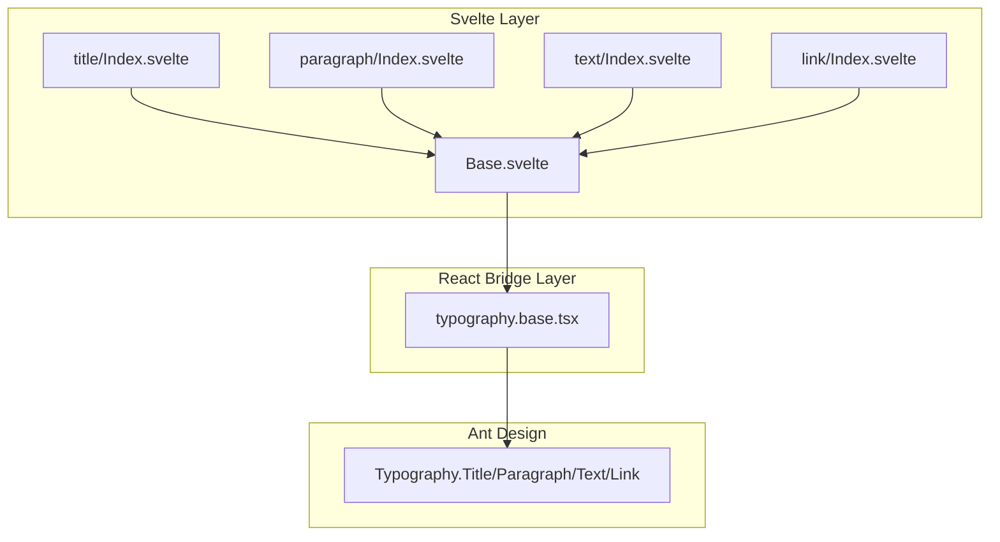
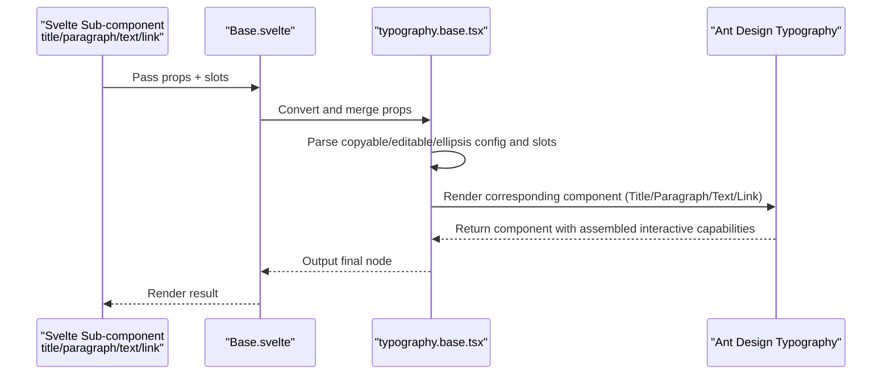
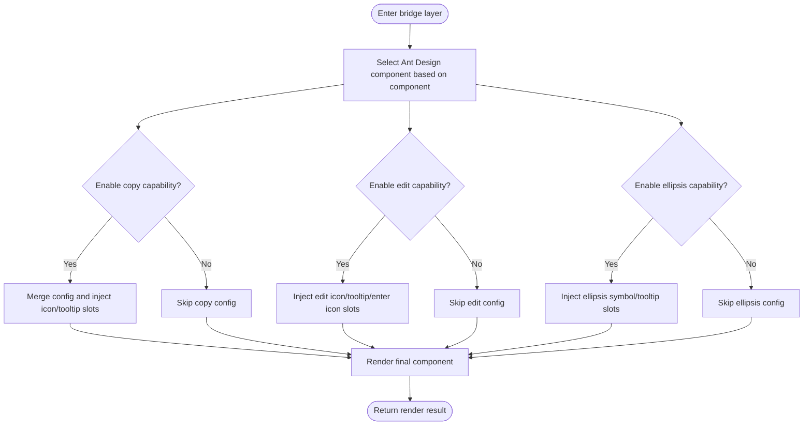
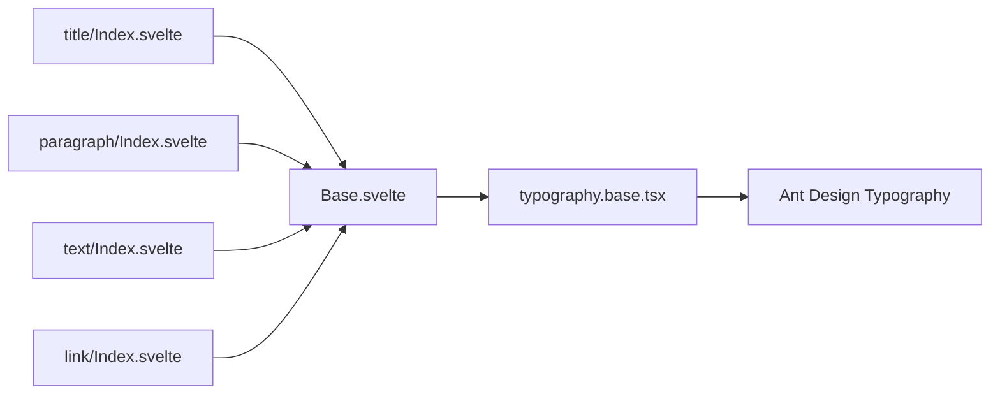

# Typography

<cite>
**Files referenced in this document**
- [frontend/antd/typography/Base.svelte](file://frontend/antd/typography/Base.svelte)
- [frontend/antd/typography/typography.base.tsx](file://frontend/antd/typography/typography.base.tsx)
- [frontend/antd/typography/title/Index.svelte](file://frontend/antd/typography/title/Index.svelte)
- [frontend/antd/typography/paragraph/Index.svelte](file://frontend/antd/typography/paragraph/Index.svelte)
- [frontend/antd/typography/text/Index.svelte](file://frontend/antd/typography/text/Index.svelte)
- [frontend/antd/typography/link/Index.svelte](file://frontend/antd/typography/link/Index.svelte)
- [docs/components/antd/typography/README.md](file://docs/components/antd/typography/README.md)
</cite>

## Table of Contents

1. [Introduction](#introduction)
2. [Project Structure](#project-structure)
3. [Core Components](#core-components)
4. [Architecture Overview](#architecture-overview)
5. [Detailed Component Analysis](#detailed-component-analysis)
6. [Dependency Analysis](#dependency-analysis)
7. [Performance Considerations](#performance-considerations)
8. [Troubleshooting Guide](#troubleshooting-guide)
9. [Conclusion](#conclusion)
10. [Appendix](#appendix)

## Introduction

The Typography component is used to present text content such as headings, paragraphs, inline text, and links in the interface, unifying text hierarchy, readability, and consistency in the design system. This component is wrapped based on Ant Design's Typography capabilities, providing interactive features such as copyable, editable, and ellipsis, and integrates with Gradio through the Svelte component system, supporting dynamic values and slot-based extensions.

## Project Structure

Typography uses an organization of "sub-components + base bridge layer" on the frontend side:

- Base.svelte: Svelte layer entry, responsible for property processing, slot pass-through, and rendering condition control
- typography.base.tsx: React bridge layer, uniformly scheduling Ant Design Typography component types, and injecting advanced capabilities like copyable/editable/ellipsis
- title/paragraph/text/link: Four specific semantic sub-components, mapping to Ant Design's Title/Paragraph/Text/Link respectively

Diagram Source

- [frontend/antd/typography/Base.svelte:11-84](file://frontend/antd/typography/Base.svelte#L11-L84)
- [frontend/antd/typography/typography.base.tsx:19-167](file://frontend/antd/typography/typography.base.tsx#L19-L167)

Section Source

- [frontend/antd/typography/Base.svelte:1-85](file://frontend/antd/typography/Base.svelte#L1-L85)
- [frontend/antd/typography/typography.base.tsx:1-170](file://frontend/antd/typography/typography.base.tsx#L1-L170)

## Core Components

- Base.svelte: Responsible for extracting from Gradio properties and converting to React-consumable props; handling visibility, DOM ID/class names, extra properties, and slots; rendering base bridge layer on demand
- typography.base.tsx: Selects corresponding Ant Design component based on component type; uniformly handles copyable, editable, and ellipsis configuration and slots; injects component instance and style class names to output
- Four semantic sub-components: title, paragraph, text, link, all using Base as carrier, only needing to specify component

Section Source

- [frontend/antd/typography/Base.svelte:15-62](file://frontend/antd/typography/Base.svelte#L15-L62)
- [frontend/antd/typography/typography.base.tsx:19-80](file://frontend/antd/typography/typography.base.tsx#L19-L80)
- [frontend/antd/typography/title/Index.svelte:1-12](file://frontend/antd/typography/title/Index.svelte#L1-L12)
- [frontend/antd/typography/paragraph/Index.svelte:1-12](file://frontend/antd/typography/paragraph/Index.svelte#L1-L12)
- [frontend/antd/typography/text/Index.svelte:1-12](file://frontend/antd/typography/text/Index.svelte#L1-L12)
- [frontend/antd/typography/link/Index.svelte:1-12](file://frontend/antd/typography/link/Index.svelte#L1-L12)

## Architecture Overview

The diagram below shows the call chain from Svelte to React and then to Ant Design Typography, as well as the assembly process of copyable/editable/ellipsis.

Diagram Source

- [frontend/antd/typography/Base.svelte:65-84](file://frontend/antd/typography/Base.svelte#L65-L84)
- [frontend/antd/typography/typography.base.tsx:69-163](file://frontend/antd/typography/typography.base.tsx#L69-L163)

## Detailed Component Analysis

### Base Bridge Layer (typography.base.tsx)

- Component Selection Logic: Switches among Title/Paragraph/Text/Link based on component value
- Capability Assembly:
  - Copy (copyable): Supports custom icons, tooltips, or injection through slots
  - Edit (editable): Supports edit icon, tooltip, and enter icon slot-based replacement
  - Ellipsis (ellipsis): Supports ellipsis symbol and tooltip slot-based replacement; has special toggle behavior for link component
- Slot and Target Resolution: Uses useTargets to identify targets with specific slot markers in children, then renders with ReactSlot
- Class Name and Style: Appends namespace class name on top of original className, facilitating theme and override

Diagram Source

- [frontend/antd/typography/typography.base.tsx:40-167](file://frontend/antd/typography/typography.base.tsx#L40-L167)

Section Source

- [frontend/antd/typography/typography.base.tsx:19-167](file://frontend/antd/typography/typography.base.tsx#L19-L167)

### Svelte Entry (Base.svelte)

- Property Processing: Gets component properties from Gradio, filters internal fields, preserves externally available props
- Slot Processing: Collects and passes through slots, while distinguishing value and children for rendering
- Conditional Rendering: Controls display based on visible; supports directly rendering children in layout mode
- DOM Properties: Injects elem_id, elem_classes, elem_style, etc.

Section Source

- [frontend/antd/typography/Base.svelte:15-62](file://frontend/antd/typography/Base.svelte#L15-L62)
- [frontend/antd/typography/Base.svelte:65-84](file://frontend/antd/typography/Base.svelte#L65-L84)

### Semantic Sub-components (title/paragraph/text/link)

- All render through Base.svelte, only needing to set component to switch semantics and hierarchy
- Support both children slot and value dynamic value as content sources
- Have independent toggle logic for link component's ellipsis behavior

Section Source

- [frontend/antd/typography/title/Index.svelte:1-12](file://frontend/antd/typography/title/Index.svelte#L1-L12)
- [frontend/antd/typography/paragraph/Index.svelte:1-12](file://frontend/antd/typography/paragraph/Index.svelte#L1-L12)
- [frontend/antd/typography/text/Index.svelte:1-12](file://frontend/antd/typography/text/Index.svelte#L1-L12)
- [frontend/antd/typography/link/Index.svelte:1-12](file://frontend/antd/typography/link/Index.svelte#L1-L12)

## Dependency Analysis

- Component Coupling
  - Sub-components only depend on Base.svelte, maintaining low coupling and high cohesion
  - Base.svelte depends on bridge layer, responsible for cross-framework (Svelte → React) adaptation
  - Bridge layer depends on Ant Design Typography, centrally handling interactive capabilities
- Slot and Target Resolution
  - Uses useTargets and ReactSlot to implement slot-based capability injection, avoiding hardcoding
- External Dependencies
  - Ant Design Typography: Provides basic capabilities for headings, paragraphs, text, and links
  - Gradio/Svelte preprocessing tools: Provide property processing, slot context, and async component loading

Diagram Source

- [frontend/antd/typography/title/Index.svelte:9](file://frontend/antd/typography/title/Index.svelte#L9)
- [frontend/antd/typography/paragraph/Index.svelte:9](file://frontend/antd/typography/paragraph/Index.svelte#L9)
- [frontend/antd/typography/text/Index.svelte:9](file://frontend/antd/typography/text/Index.svelte#L9)
- [frontend/antd/typography/link/Index.svelte:9](file://frontend/antd/typography/link/Index.svelte#L9)
- [frontend/antd/typography/Base.svelte:11-13](file://frontend/antd/typography/Base.svelte#L11-L13)
- [frontend/antd/typography/typography.base.tsx:8](file://frontend/antd/typography/typography.base.tsx#L8)

Section Source

- [frontend/antd/typography/Base.svelte:11-13](file://frontend/antd/typography/Base.svelte#L11-L13)
- [frontend/antd/typography/typography.base.tsx:8](file://frontend/antd/typography/typography.base.tsx#L8)

## Performance Considerations

- Async Component Loading: Base.svelte loads bridge layer lazily through importComponent, reducing first-screen size
- Conditional Rendering: Only renders when visible is true; assembles ellipsis tooltip on demand, reducing unnecessary overhead
- Slot Rendering: Through useTargets and ReactSlot, only renders actually matched slot content, avoiding full traversal

Section Source

- [frontend/antd/typography/Base.svelte:11-13](file://frontend/antd/typography/Base.svelte#L11-L13)
- [frontend/antd/typography/typography.base.tsx:51-64](file://frontend/antd/typography/typography.base.tsx#L51-L64)

## Troubleshooting Guide

- Text Not Displaying
  - Check whether Base.svelte's visible field is true
  - Confirm whether children or value is correctly passed in
- Copy/Edit/Ellipsis Button Not Working
  - Confirm whether copyable/editable/ellipsis configuration object or slots are correctly passed in
  - For link component, confirm ellipsis enable condition
- Slot Icon/Tooltip Not Appearing
  - Check whether slot key names match (like copyable.icon, copyable.tooltips, editable.icon, etc.)
  - Confirm useTargets can correctly identify slot markers in children
- Style Abnormal
  - Confirm whether elem_classes and elem_style are correctly injected
  - Check whether namespace class names are overridden

Section Source

- [frontend/antd/typography/Base.svelte:30-62](file://frontend/antd/typography/Base.svelte#L30-L62)
- [frontend/antd/typography/typography.base.tsx:40-167](file://frontend/antd/typography/typography.base.tsx#L40-L167)

## Conclusion

The Typography component effectively connects Svelte with Ant Design capabilities through clear layered design, ensuring both semantics and maintainability, while providing rich interactive capabilities like copy, edit, and ellipsis. Its slot-based and conditional assembly mechanism enables good extensibility and performance in different scenarios.

## Appendix

- Usage examples and instructions can be found in the documentation page's example placeholder
  - [docs/components/antd/typography/README.md:5-8](file://docs/components/antd/typography/README.md#L5-L8)
