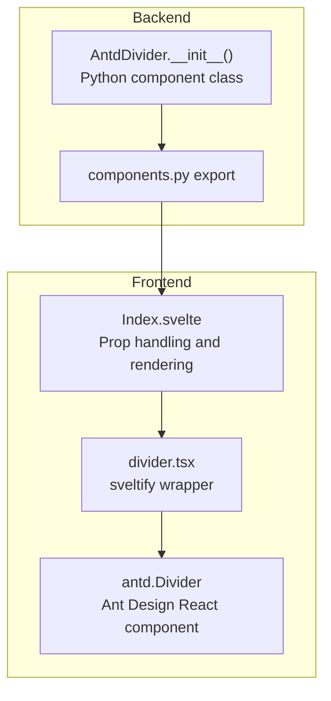
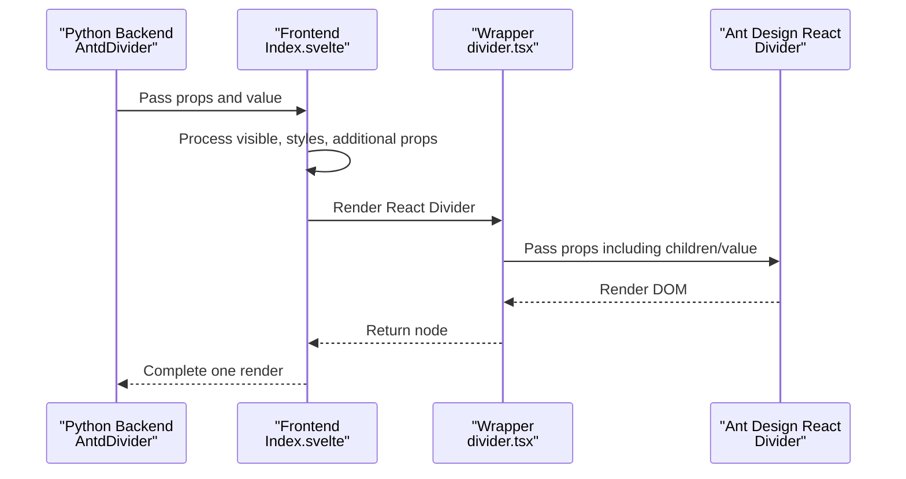
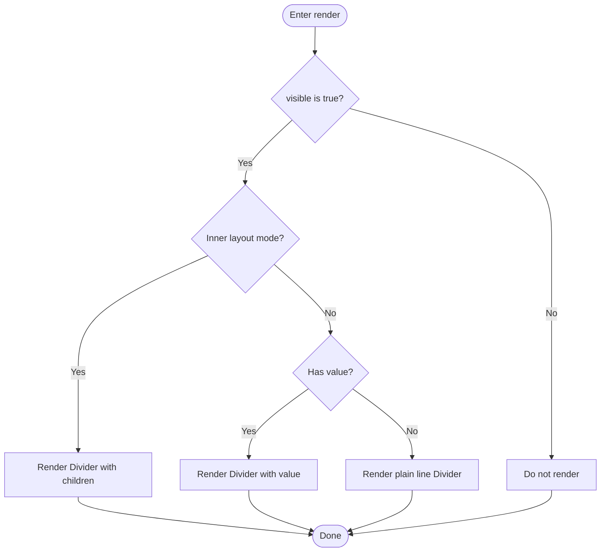
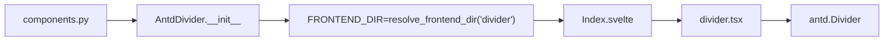

# Divider

<cite>
**Files referenced in this document**
- [divider.tsx](file://frontend/antd/divider/divider.tsx)
- [Index.svelte](file://frontend/antd/divider/Index.svelte)
- [__init__.py](file://backend/modelscope_studio/components/antd/divider/__init__.py)
- [components.py](file://backend/modelscope_studio/components/antd/components.py)
- [README.md](file://docs/components/antd/divider/README.md)
- [README-zh_CN.md](file://docs/components/antd/divider/README-zh_CN.md)
- [basic.py](file://docs/components/antd/divider/demos/basic.py)
- [basic.py (form)](file://docs/components/antd/form/demos/basic.py)
- [basic.py (layout)](file://docs/components/antd/layout/demos/basic.py)
</cite>

## Table of Contents

1. [Introduction](#introduction)
2. [Project Structure](#project-structure)
3. [Core Components](#core-components)
4. [Architecture Overview](#architecture-overview)
5. [Detailed Component Analysis](#detailed-component-analysis)
6. [Dependency Analysis](#dependency-analysis)
7. [Performance and Accessibility](#performance-and-accessibility)
8. [Usage Scenarios and Examples](#usage-scenarios-and-examples)
9. [Troubleshooting](#troubleshooting)
10. [Conclusion](#conclusion)

## Introduction

The Divider component creates visual separation between content sections, helping users quickly identify information blocks. Based on Ant Design's Divider, it supports horizontal and vertical orientations, multiple line styles (solid, dashed, dotted), centered and left/right-aligned title text, plain text style, and provides a flexible style override interface for consistent styling across different layouts and themes.

## Project Structure

The Divider component consists of a backend Python component class and a frontend Svelte wrapper. Props are passed in a Gradio-style through to the Ant Design React component, which is ultimately rendered as a visible divider in the browser.

Diagram sources

- [**init**.py:1-95](file://backend/modelscope_studio/components/antd/divider/__init__.py#L1-L95)
- [components.py:37-37](file://backend/modelscope_studio/components/antd/components.py#L37-L37)
- [Index.svelte:1-75](file://frontend/antd/divider/Index.svelte#L1-L75)
- [divider.tsx:1-15](file://frontend/antd/divider/divider.tsx#L1-L15)

Section sources

- [**init**.py:1-95](file://backend/modelscope_studio/components/antd/divider/__init__.py#L1-L95)
- [components.py:37-37](file://backend/modelscope_studio/components/antd/components.py#L37-L37)
- [Index.svelte:1-75](file://frontend/antd/divider/Index.svelte#L1-L75)
- [divider.tsx:1-15](file://frontend/antd/divider/divider.tsx#L1-L15)

## Core Components

- Backend component class: `AntdDivider`, responsible for defining props, default values, styles, and rendering strategy, and declaring frontend resource paths.
- Frontend wrapper: `Index.svelte` handles prop merging, style injection, and conditional rendering. `divider.tsx` uses `sveltify` to bridge Ant Design's React Divider as a Svelte-compatible component.

Key responsibilities

- Prop mapping: Maps Python-layer props (`dashed`, `variant`, `orientation`, `orientation_margin`, `plain`, `type`, `size`, `value`, `elem_style`, `elem_classes`, etc.) to the React Divider.
- Rendering branch: Determines whether to render a divider with text or a plain line based on whether `children` or `value` is provided.
- Style injection: Injects custom styles and class names via `elem_style` and `elem_classes`.

Section sources

- [**init**.py:21-76](file://backend/modelscope_studio/components/antd/divider/__init__.py#L21-L76)
- [Index.svelte:23-57](file://frontend/antd/divider/Index.svelte#L23-L57)
- [divider.tsx:5-12](file://frontend/antd/divider/divider.tsx#L5-L12)

## Architecture Overview

The diagram below shows the call chain and data flow from the Python component to the browser rendering.

Diagram sources

- [**init**.py:77-77](file://backend/modelscope_studio/components/antd/divider/__init__.py#L77-L77)
- [Index.svelte:60-74](file://frontend/antd/divider/Index.svelte#L60-L74)
- [divider.tsx:5-12](file://frontend/antd/divider/divider.tsx#L5-L12)

## Detailed Component Analysis

### Props and Configuration

- Type and orientation
  - `type`: horizontal | vertical — controls horizontal or vertical divider.
  - `size`: small | middle | large (horizontal only) — affects the overall visual size.
- Line style
  - `variant`: dashed | dotted | solid — controls the line style.
  - `dashed`: boolean toggle (legacy compatibility), equivalent to `variant=dashed`.
- Text and alignment
  - `value` or slot content: text displayed on the divider.
  - `orientation`: left | right | center | start | end — controls text position.
  - `orientation_margin`: number or string (parsed with unit if provided, as px otherwise) — sets the margin between text and edge.
  - `plain`: whether to display text in plain style.
- Style and appearance
  - `elem_style`: inject inline styles (e.g., `borderColor`).
  - `elem_classes`: inject additional CSS classes.
  - `root_class_name`: root element class name (passed by parent container).
  - `additional_props`: other passthrough props.
- Layout and visibility
  - `visible`: controls whether the component is rendered.
  - `as_item`, `_internal`, `render`, etc.: framework-internal props that affect rendering context.

Section sources

- [**init**.py:21-76](file://backend/modelscope_studio/components/antd/divider/__init__.py#L21-L76)
- [Index.svelte:13-57](file://frontend/antd/divider/Index.svelte#L13-L57)

### Rendering Logic and Branches

- When children or `value` is present, renders a divider with text.
- Otherwise renders a plain line divider.
- Supports direct child node rendering in inner layout mode.

Diagram sources

- [Index.svelte:60-74](file://frontend/antd/divider/Index.svelte#L60-L74)

### Text Centering and Alignment

- Use `orientation=center` (or equivalent `start`/`end`) to center text.
- Use `orientation=left`/`right` or `orientation=start`/`end` combined with `orientation_margin` to control the spacing between text and edge.
- With `plain=True`, text is rendered in a lighter style, suitable for smaller font sizes or subtle hints.

Section sources

- [**init**.py:27-32](file://backend/modelscope_studio/components/antd/divider/__init__.py#L27-L32)
- [basic.py:11-26](file://docs/components/antd/divider/demos/basic.py#L11-L26)

### Style Customization and Color Configuration

- Inject `borderColor`, `borderWidth`, and other styles via `elem_style` for color and thickness customization.
- Inject custom CSS classes via `elem_classes` for complex theming needs.
- `variant` and `dashed` provide line style switching (solid/dashed/dotted).

Section sources

- [basic.py:11-26](file://docs/components/antd/divider/demos/basic.py#L11-L26)
- [**init**.py:26-32](file://backend/modelscope_studio/components/antd/divider/__init__.py#L26-L32)

### Responsive Behavior and Screen Adaptation

- The component does not have built-in media query logic, but responsive behavior can be achieved through `elem_style` and layout containers (such as Flex and Layout).
- In horizontal layouts, `size` can subtly adjust the overall visual size; in vertical layouts, `size` has no effect.
- On narrow screens, adjust `orientation` and margin in combination with container width and text length to avoid text truncation.

Section sources

- [**init**.py:32-34](file://backend/modelscope_studio/components/antd/divider/__init__.py#L32-L34)
- [basic.py (layout):42-88](file://docs/components/antd/layout/demos/basic.py#L42-L88)

## Dependency Analysis

- Backend export: `AntdDivider` is exported in the antd component collection for modular usage.
- Frontend bridging: `Index.svelte` dynamically loads `divider.tsx` via `importComponent`. The latter uses `sveltify` to wrap Ant Design's React Divider as a Svelte component.
- Prop passthrough: All props except framework-reserved fields are passed through to the React Divider, maintaining consistency with the Ant Design API.

Diagram sources

- [components.py:37-37](file://backend/modelscope_studio/components/antd/components.py#L37-L37)
- [**init**.py:77-77](file://backend/modelscope_studio/components/antd/divider/__init__.py#L77-L77)
- [Index.svelte:10-10](file://frontend/antd/divider/Index.svelte#L10-L10)
- [divider.tsx:3-3](file://frontend/antd/divider/divider.tsx#L3-L3)

Section sources

- [components.py:37-37](file://backend/modelscope_studio/components/antd/components.py#L37-L37)
- [**init**.py:77-77](file://backend/modelscope_studio/components/antd/divider/__init__.py#L77-L77)
- [Index.svelte:10-10](file://frontend/antd/divider/Index.svelte#L10-L10)
- [divider.tsx:3-3](file://frontend/antd/divider/divider.tsx#L3-L3)

## Performance and Accessibility

- Rendering overhead: The component is a lightweight pure display element. Dynamic import and conditional rendering avoid unnecessary repaints.
- Accessibility: Text content is rendered with semantic tags. For important dividers, providing a short description (e.g., `aria-label`) is recommended to improve screen reader experience.
- Theme consistency: Unify styles via `elem_style` and `elem_classes` to reduce redundant computations and style conflicts.

[This section contains general recommendations and does not require specific file references]

## Usage Scenarios and Examples

### Form Grouping

- Use dividers to group different business domains within a form, improving readability.
- Example reference: The form demo shows dividers used between form controls.

Section sources

- [basic.py (form):16-90](file://docs/components/antd/form/demos/basic.py#L16-L90)

### Content Area Separation

- Use horizontal dividers in articles or pages to separate paragraphs. Use `orientation=center` for title-style separators.
- Example reference: The basic demo shows different variants and dividers with text.

Section sources

- [basic.py:5-29](file://docs/components/antd/divider/demos/basic.py#L5-L29)

### Navigation Menu Separation

- Use vertical or horizontal dividers to separate menu items in navigation lists. On narrow screens, adjust `orientation` and margin to avoid text overflow.
- Recommendation: Prefer vertical dividers for side navigation and horizontal dividers for top or bottom navigation.

[This subsection is conceptual; no specific file references required]

### Behavior in Responsive Layouts

- Use layout components like Flex and Layout to adjust divider orientation and text length at different screen sizes.
- Recommendation: On mobile, prefer horizontal dividers with shorter text. If necessary, hide the text and keep only the line.

Section sources

- [basic.py (layout):42-88](file://docs/components/antd/layout/demos/basic.py#L42-L88)

## Troubleshooting

- Text not displayed
  - Check whether `value` or child content has been passed. If not, the component renders a plain line.
  - Confirm that `visible` is `True`.
- Text position incorrect
  - When `orientation` is set to left/right/start/end, use `orientation_margin` to adjust spacing.
  - `plain` affects the visual weight of the text. Remove it if stronger separation is needed.
- Line style not applied
  - `dashed` and `variant=dashed` are equivalent. Ensure no conflicting props are set simultaneously.
  - `borderColor`, `borderWidth`, and other styles in `elem_style` must be compatible with the target platform.
- Vertical divider size not working
  - `size` only applies to horizontal dividers. For vertical dividers, control the visual size via container width and border properties.

Section sources

- [Index.svelte:60-74](file://frontend/antd/divider/Index.svelte#L60-L74)
- [**init**.py:26-34](file://backend/modelscope_studio/components/antd/divider/__init__.py#L26-L34)

## Conclusion

The Divider component provides rich visual expression through a clean API, capable of both basic line separation and title-style dividers with text. Through multi-dimensional configuration of type, line style, alignment, and styling, it reliably implements information hierarchy and spatial separation across different layouts and themes. In practice, it is recommended to combine layout containers with responsive strategies, choose `orientation` and `size` appropriately, and use `elem_style`/`elem_classes` for brand and theme customization.
