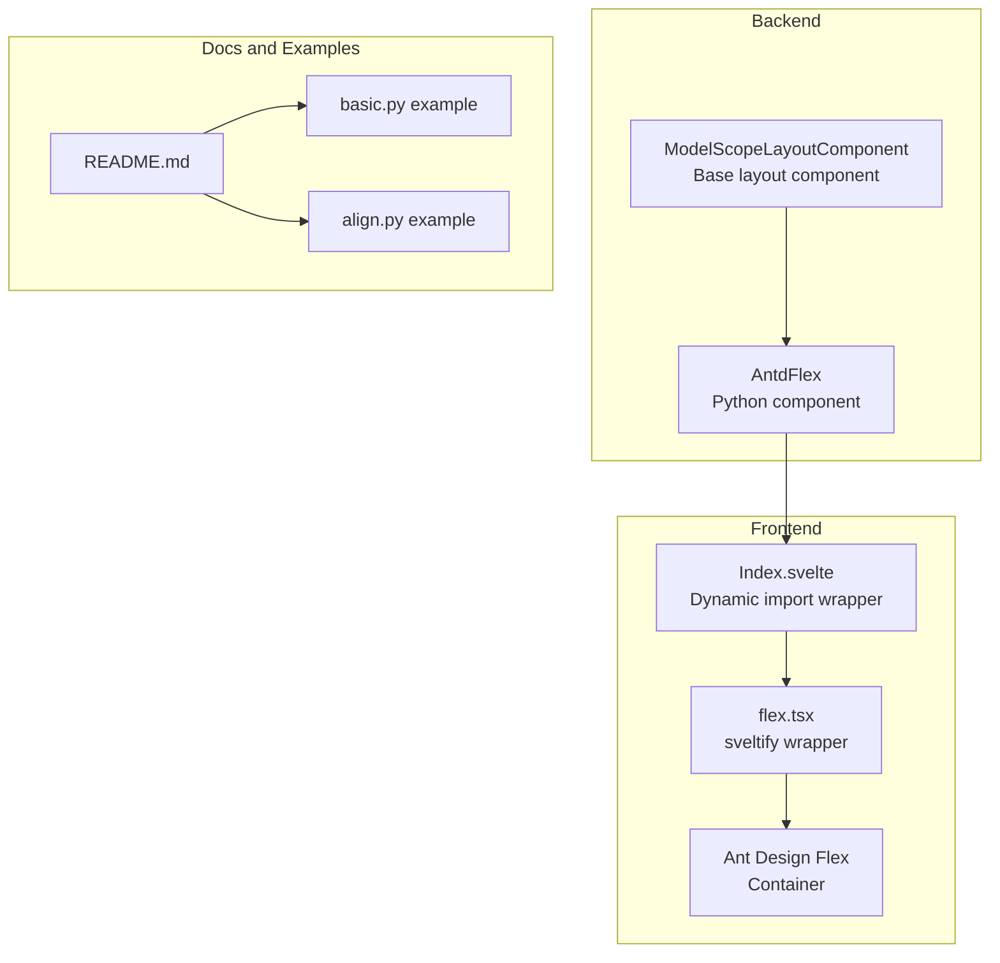
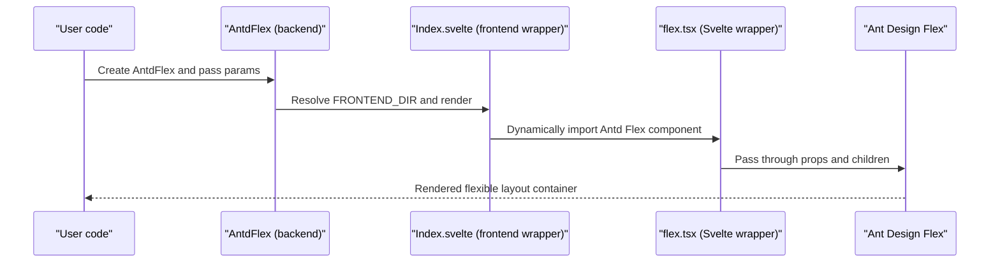
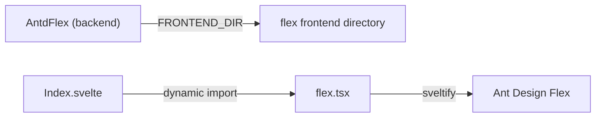

# Flex

<cite>
**Files referenced in this document**
- [frontend/antd/flex/flex.tsx](file://frontend/antd/flex/flex.tsx)
- [frontend/antd/flex/Index.svelte](file://frontend/antd/flex/Index.svelte)
- [backend/modelscope_studio/components/antd/flex/__init__.py](file://backend/modelscope_studio/components/antd/flex/__init__.py)
- [docs/components/antd/flex/README.md](file://docs/components/antd/flex/README.md)
- [docs/components/antd/flex/demos/basic.py](file://docs/components/antd/flex/demos/basic.py)
- [docs/components/antd/flex/demos/align.py](file://docs/components/antd/flex/demos/align.py)
- [backend/modelscope_studio/utils/dev/component.py](file://backend/modelscope_studio/utils/dev/component.py)
</cite>

## Table of Contents

1. [Introduction](#introduction)
2. [Project Structure](#project-structure)
3. [Core Components](#core-components)
4. [Architecture Overview](#architecture-overview)
5. [Detailed Component Analysis](#detailed-component-analysis)
6. [Dependency Analysis](#dependency-analysis)
7. [Performance Considerations](#performance-considerations)
8. [Troubleshooting Guide](#troubleshooting-guide)
9. [Conclusion](#conclusion)
10. [Appendix](#appendix)

## Introduction

This document provides a systematic description of the Flex layout component and its implementation and usage in ModelScope Studio. The Flex component is based on Ant Design's Flex container, offering main axis and cross axis alignment, layout direction, wrapping control, spacing configuration, and is bridged between frontend and backend via the Gradio ecosystem. The document covers the following topics from concept to practice:

- Core concepts: main axis/cross axis, and correspondence to justify-content, align-items, align-content
- Key props: orientation/vertical, wrap, justify, align, flex, gap
- Practical scenarios: button group alignment, content area distribution, responsive card layouts
- Complex nested layouts and best practices
- Compatibility and cross-browser considerations

## Project Structure

The Flex component in this repository uses a layered design of "backend Python component + frontend Svelte wrapper + Ant Design Flex container":

- Backend: Python class responsible for parameter validation, rendering strategy, and frontend resource location
- Frontend: Svelte component responsible for dynamic import, prop passthrough, and style concatenation
- Dependencies: React/Ant Design components are bridged to Svelte via `svelte-preprocess-react`

Diagram sources

- [backend/modelscope_studio/components/antd/flex/**init**.py:8-98](file://backend/modelscope_studio/components/antd/flex/__init__.py#L8-L98)
- [frontend/antd/flex/Index.svelte:10-61](file://frontend/antd/flex/Index.svelte#L10-L61)
- [frontend/antd/flex/flex.tsx:1-11](file://frontend/antd/flex/flex.tsx#L1-L11)
- [docs/components/antd/flex/README.md:1-9](file://docs/components/antd/flex/README.md#L1-L9)

Section sources

- [backend/modelscope_studio/components/antd/flex/**init**.py:8-98](file://backend/modelscope_studio/components/antd/flex/__init__.py#L8-L98)
- [frontend/antd/flex/Index.svelte:1-62](file://frontend/antd/flex/Index.svelte#L1-L62)
- [frontend/antd/flex/flex.tsx:1-11](file://frontend/antd/flex/flex.tsx#L1-L11)
- [docs/components/antd/flex/README.md:1-9](file://docs/components/antd/flex/README.md#L1-L9)

## Core Components

- AntdFlex (backend)
  - Receives and validates all Flex-related parameters (direction, wrapping, main axis/cross axis alignment, flex shorthand, gap, etc.) and maps them to frontend-consumable props.
  - Provides `FRONTEND_DIR` pointing to the frontend flex directory, ensuring the frontend component is loaded correctly at runtime.
  - Follows the layout semantics of `ModelScopeLayoutComponent` and participates in the application-level layout context.

- Index.svelte (frontend wrapper)
  - Dynamically imports the frontend flex component via `importComponent`, avoiding first-screen blocking.
  - Retrieves and processes component props via `getProps`/`processProps`, supporting additional prop passthrough and visibility control.
  - Injects generic props like `elem_id`, `elem_classes`, and `elem_style` into the final render node.

- flex.tsx (Svelte wrapper)
  - Uses `sveltify` to convert Ant Design's Flex container into a Svelte-compatible component, passing props and children through directly.

- Docs and examples
  - `README.md` provides basic description and example placeholders.
  - `basic.py` and `align.py` demonstrate interactive examples for vertical/horizontal direction switching and main axis/cross axis alignment.

Section sources

- [backend/modelscope_studio/components/antd/flex/**init**.py:21-79](file://backend/modelscope_studio/components/antd/flex/__init__.py#L21-L79)
- [frontend/antd/flex/Index.svelte:13-42](file://frontend/antd/flex/Index.svelte#L13-L42)
- [frontend/antd/flex/flex.tsx:4-8](file://frontend/antd/flex/flex.tsx#L4-L8)
- [docs/components/antd/flex/README.md:1-9](file://docs/components/antd/flex/README.md#L1-L9)
- [docs/components/antd/flex/demos/basic.py:8-23](file://docs/components/antd/flex/demos/basic.py#L8-L23)
- [docs/components/antd/flex/demos/align.py:8-41](file://docs/components/antd/flex/demos/align.py#L8-L41)

## Architecture Overview

The diagram below shows the call chain from user code to the final render, illustrating the collaboration between the Flex component's frontend and backend:

Diagram sources

- [backend/modelscope_studio/components/antd/flex/**init**.py:81-81](file://backend/modelscope_studio/components/antd/flex/__init__.py#L81-L81)
- [frontend/antd/flex/Index.svelte:10-10](file://frontend/antd/flex/Index.svelte#L10-L10)
- [frontend/antd/flex/flex.tsx:4-8](file://frontend/antd/flex/flex.tsx#L4-L8)

## Detailed Component Analysis

### Backend Class: AntdFlex Props and Behavior

- Key props
  - `orientation`/`vertical`: controls layout direction (horizontal/vertical)
  - `wrap`: controls single-line or multi-line display
  - `justify`: main axis alignment (start/end/center/flex-start/flex-end/space-\* etc.)
  - `align`: cross axis alignment (start/end/center/flex-start/flex-end/baseline/stretch etc.)
  - `flex`: flex shorthand property
  - `gap`: element spacing (small/middle/large or numeric value)
  - `component`/`root_class_name`/`class_names`/`styles`/`as_item`/`_internal`: generic props and style injection
  - Visibility and DOM injection: `elem_id`/`elem_classes`/`elem_style`/`visible`/`render`

- Behavioral characteristics
  - `skip_api=True`: not exposed as a standard API component; suitable for internal layout use
  - `FRONTEND_DIR` points to the frontend flex directory, ensuring component availability at runtime
  - Inherits from `ModelScopeLayoutComponent`, providing layout context capabilities

Section sources

- [backend/modelscope_studio/components/antd/flex/**init**.py:21-79](file://backend/modelscope_studio/components/antd/flex/__init__.py#L21-L79)
- [backend/modelscope_studio/utils/dev/component.py:11-52](file://backend/modelscope_studio/utils/dev/component.py#L11-L52)

### Frontend Wrapper: Index.svelte

- Dynamic import: lazy-loads `flex.tsx` via `importComponent`, reducing first-screen overhead
- Prop processing: `getProps`/`processProps` extracts and merges component props, additional props, visibility, and DOM injection
- Style concatenation: `elem_classes` combined with fixed class names; `elem_id`/`elem_style` injected into the root node
- Conditional rendering: controls rendering based on `visible`

Section sources

- [frontend/antd/flex/Index.svelte:13-42](file://frontend/antd/flex/Index.svelte#L13-L42)
- [frontend/antd/flex/Index.svelte:48-61](file://frontend/antd/flex/Index.svelte#L48-L61)

### Svelte Wrapper: flex.tsx

- Uses `sveltify` to bridge Ant Design's Flex container as a Svelte component
- Passes props and children through directly, maintaining consistent semantics with Antd Flex

Section sources

- [frontend/antd/flex/flex.tsx:4-8](file://frontend/antd/flex/flex.tsx#L4-L8)

### Examples: Basic and Alignment

- `basic.py`: demonstrates vertical/horizontal direction switching and spacing configuration
- `align.py`: demonstrates main axis/cross axis alignment options and interactive updates

Section sources

- [docs/components/antd/flex/demos/basic.py:8-23](file://docs/components/antd/flex/demos/basic.py#L8-L23)
- [docs/components/antd/flex/demos/align.py:8-41](file://docs/components/antd/flex/demos/align.py#L8-L41)

### Key Props and CSS Flex Correspondence

- Main axis and cross axis
  - Main axis: determined by layout direction (horizontal/vertical corresponds to row/column)
  - Cross axis: perpendicular to the main axis
- Alignment mapping
  - `justify-content` ↔ `justify` (main axis alignment)
  - `align-items` ↔ `align` (cross axis alignment)
  - `align-content` ↔ cross axis distribution for multi-line (effective when `wrap` is `wrap`/`wrap-reverse`)

Section sources

- [backend/modelscope_studio/components/antd/flex/**init**.py:52-58](file://backend/modelscope_studio/components/antd/flex/__init__.py#L52-L58)

### Practical Application Scenarios

- Button group alignment: use `justify`/`align` to quickly achieve horizontal or vertical centering, space-between, etc.
- Content area distribution: use `gap` and `wrap` for responsive grids with wrapping
- Responsive card layouts: combine `orientation`/`vertical` with `justify`/`align` for card flow arrangement

Section sources

- [docs/components/antd/flex/demos/basic.py:8-23](file://docs/components/antd/flex/demos/basic.py#L8-L23)
- [docs/components/antd/flex/demos/align.py:8-41](file://docs/components/antd/flex/demos/align.py#L8-L41)

### Complex Nested Layouts and Best Practices

- Nesting strategy
  - Outer containers set main axis alignment and wrapping; inner containers focus on cross axis alignment
  - Use `gap` to control spacing between levels, avoiding hard-coded margin/padding
- Best practices
  - First use `vertical`/`orientation` to control direction, then fine-tune with `justify`/`align`
  - In multi-line scenarios, choose `wrap` and `align-content` combinations carefully
  - Combine with interactive components (such as Segmented) to dynamically switch alignment, improving discoverability

Section sources

- [docs/components/antd/flex/demos/align.py:8-41](file://docs/components/antd/flex/demos/align.py#L8-L41)

## Dependency Analysis

- Component coupling
  - `AntdFlex` only depends on the frontend flex directory, resolved via `FRONTEND_DIR`, reducing coupling
  - `Index.svelte` and `flex.tsx` are loosely coupled; the former handles runtime loading, the latter handles bridging
- External dependencies
  - Ant Design Flex: provides core layout capability
  - svelte-preprocess-react: provides `sveltify` and dynamic import utilities
- Potential circular dependencies
  - No obvious circular dependencies in the current structure. Avoid inter-referencing backend components if extending in the future.

Diagram sources

- [backend/modelscope_studio/components/antd/flex/**init**.py:81-81](file://backend/modelscope_studio/components/antd/flex/__init__.py#L81-L81)
- [frontend/antd/flex/Index.svelte:10-10](file://frontend/antd/flex/Index.svelte#L10-L10)
- [frontend/antd/flex/flex.tsx:4-8](file://frontend/antd/flex/flex.tsx#L4-L8)

Section sources

- [backend/modelscope_studio/components/antd/flex/**init**.py:81-81](file://backend/modelscope_studio/components/antd/flex/__init__.py#L81-L81)
- [frontend/antd/flex/Index.svelte:10-10](file://frontend/antd/flex/Index.svelte#L10-L10)
- [frontend/antd/flex/flex.tsx:4-8](file://frontend/antd/flex/flex.tsx#L4-L8)

## Performance Considerations

- Dynamic import optimization: `Index.svelte` uses `importComponent` for lazy loading, reducing first-screen bundle size and render time
- Minimal prop passthrough: only necessary props are passed, avoiding redundant computation and reflow
- Spacing and wrapping: use `gap` and `wrap` appropriately to avoid complex layout reflows caused by excessive nesting

## Troubleshooting Guide

- Component not visible
  - Check if `visible` is `true`
  - Confirm that `elem_style`/`elem_classes` are not causing overflow or hidden behavior
- Direction and alignment issues
  - Confirm that the combination of `orientation`/`vertical` and `justify`/`align` matches expectations
  - In multi-line scenarios, check the effect of `wrap` and `align-content`
- Runtime load failure
  - Confirm that `FRONTEND_DIR` points to the correct location and the frontend package is built
  - Check for errors in the dynamic import (`{#await}` branch in `Index.svelte`)

Section sources

- [frontend/antd/flex/Index.svelte:48-61](file://frontend/antd/flex/Index.svelte#L48-L61)
- [backend/modelscope_studio/components/antd/flex/**init**.py:81-81](file://backend/modelscope_studio/components/antd/flex/__init__.py#L81-L81)

## Conclusion

The Flex layout component in ModelScope Studio is implemented as "backend params + frontend wrapper + Antd Flex container", maintaining semantic consistency with CSS Flex while providing good configurability and maintainability. Through key props such as `orientation`/`vertical`, `wrap`, `justify`, `align`, `flex`, and `gap`, it efficiently covers common scenarios including button group alignment, content area distribution, and responsive card layouts. Combined with dynamic import and prop passthrough mechanisms, it balances performance and flexibility.

## Appendix

- Example entry points
  - Basic example: [basic.py:1-26](file://docs/components/antd/flex/demos/basic.py#L1-L26)
  - Alignment example: [align.py:1-45](file://docs/components/antd/flex/demos/align.py#L1-L45)
- Documentation: [README.md:1-9](file://docs/components/antd/flex/README.md#L1-L9)
