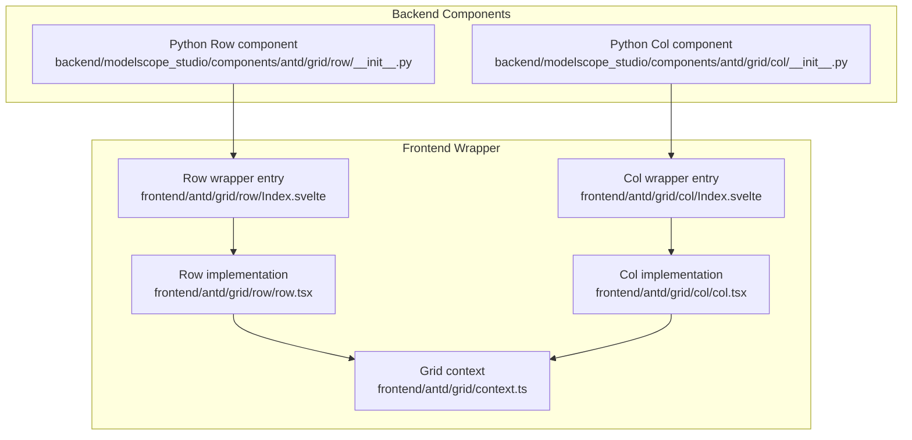
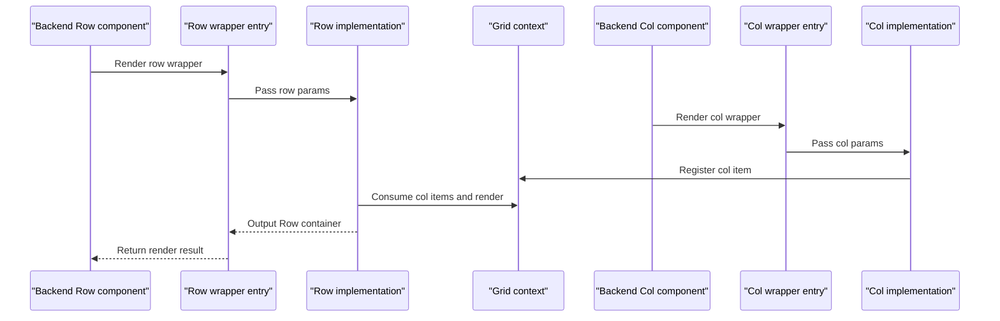
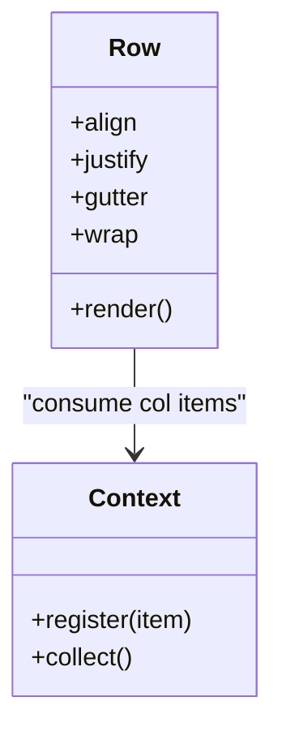
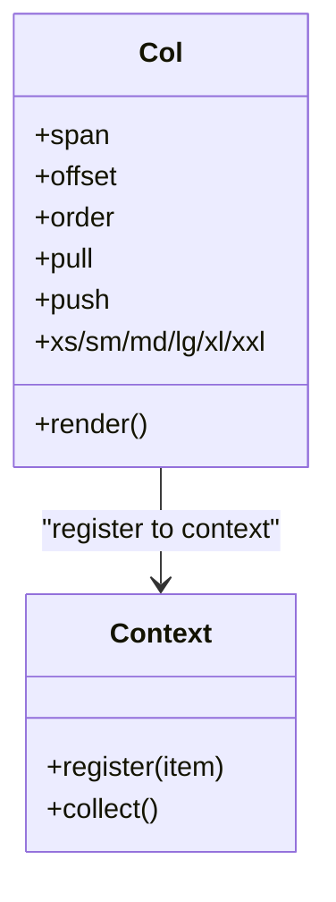
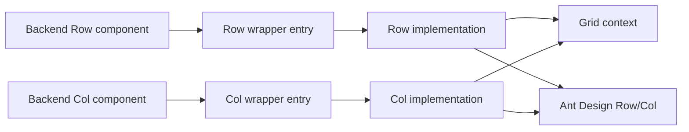

# Grid

<cite>
**Files referenced in this document**
- [frontend/antd/grid/row/Index.svelte](file://frontend/antd/grid/row/Index.svelte)
- [frontend/antd/grid/row/row.tsx](file://frontend/antd/grid/row/row.tsx)
- [frontend/antd/grid/col/Index.svelte](file://frontend/antd/grid/col/Index.svelte)
- [frontend/antd/grid/col/col.tsx](file://frontend/antd/grid/col/col.tsx)
- [frontend/antd/grid/context.ts](file://frontend/antd/grid/context.ts)
- [backend/modelscope_studio/components/antd/grid/row/__init__.py](file://backend/modelscope_studio/components/antd/grid/row/__init__.py)
- [backend/modelscope_studio/components/antd/grid/col/__init__.py](file://backend/modelscope_studio/components/antd/grid/col/__init__.py)
- [docs/components/antd/grid/README.md](file://docs/components/antd/grid/README.md)
- [docs/components/antd/grid/demos/basic.py](file://docs/components/antd/grid/demos/basic.py)
- [docs/components/antd/grid/demos/playground.py](file://docs/components/antd/grid/demos/playground.py)
</cite>

## Table of Contents

1. [Introduction](#introduction)
2. [Project Structure](#project-structure)
3. [Core Components](#core-components)
4. [Architecture Overview](#architecture-overview)
5. [Detailed Component Analysis](#detailed-component-analysis)
6. [Dependency Analysis](#dependency-analysis)
7. [Performance Considerations](#performance-considerations)
8. [Troubleshooting Guide](#troubleshooting-guide)
9. [Conclusion](#conclusion)
10. [Appendix](#appendix)

## Introduction

This document provides a systematic description of the Grid component, covering its design principles, the 24-column grid system, and responsive breakpoint configuration. It explains how to use Row and Col in depth (including grid offset, ordering, nesting rules, and alignment), provides application ideas for common scenarios such as dashboard layouts, product display pages, and form layouts, and includes responsive behavior descriptions and performance optimization recommendations.

## Project Structure

The Grid component is built through collaboration between a frontend Svelte wrapper layer and a backend Python component layer: the frontend handles rendering and context passing, while the backend handles parameter passthrough and lifecycle management. The docs side provides examples and explanations.

**Diagram sources**

- [frontend/antd/grid/row/Index.svelte:1-61](file://frontend/antd/grid/row/Index.svelte#L1-L61)
- [frontend/antd/grid/row/row.tsx:1-34](file://frontend/antd/grid/row/row.tsx#L1-L34)
- [frontend/antd/grid/col/Index.svelte:1-77](file://frontend/antd/grid/col/Index.svelte#L1-L77)
- [frontend/antd/grid/col/col.tsx:1-14](file://frontend/antd/grid/col/col.tsx#L1-L14)
- [frontend/antd/grid/context.ts:1-7](file://frontend/antd/grid/context.ts#L1-L7)
- [backend/modelscope_studio/components/antd/grid/row/**init**.py:1-94](file://backend/modelscope_studio/components/antd/grid/row/__init__.py#L1-L94)
- [backend/modelscope_studio/components/antd/grid/col/**init**.py:1-114](file://backend/modelscope_studio/components/antd/grid/col/__init__.py#L1-L114)

**Section sources**

- [frontend/antd/grid/row/Index.svelte:1-61](file://frontend/antd/grid/row/Index.svelte#L1-L61)
- [frontend/antd/grid/col/Index.svelte:1-77](file://frontend/antd/grid/col/Index.svelte#L1-L77)
- [frontend/antd/grid/row/row.tsx:1-34](file://frontend/antd/grid/row/row.tsx#L1-L34)
- [frontend/antd/grid/col/col.tsx:1-14](file://frontend/antd/grid/col/col.tsx#L1-L14)
- [frontend/antd/grid/context.ts:1-7](file://frontend/antd/grid/context.ts#L1-L7)
- [backend/modelscope_studio/components/antd/grid/row/**init**.py:1-94](file://backend/modelscope_studio/components/antd/grid/row/__init__.py#L1-L94)
- [backend/modelscope_studio/components/antd/grid/col/**init**.py:1-114](file://backend/modelscope_studio/components/antd/grid/col/__init__.py#L1-L114)

## Core Components

- Row component
  - Supports alignment, gutter, wrapping, and other props for holding multiple columns and managing layout direction and distribution.
  - Key props: `align`, `justify`, `gutter`, `wrap`, etc.
- Col component
  - Supports span, offset, ordering, left/right pushing, and responsive breakpoints for specific content blocks.
  - Key props: `span`, `offset`, `order`, `pull`, `push`, `xs`/`sm`/`md`/`lg`/`xl`/`xxl`, etc.

All of the above props are explicitly declared with default values in the backend component, making them directly usable from the Python layer.

**Section sources**

- [backend/modelscope_studio/components/antd/grid/row/**init**.py:30-76](file://backend/modelscope_studio/components/antd/grid/row/__init__.py#L30-L76)
- [backend/modelscope_studio/components/antd/grid/col/**init**.py:30-95](file://backend/modelscope_studio/components/antd/grid/col/__init__.py#L30-L95)

## Architecture Overview

The runtime flow of Grid is as follows: the backend Python component receives params and renders the frontend wrapper; the frontend wrapper then calls the Ant Design Row/Col implementation and collects Col children via context, ultimately assembling the standard grid layout.

**Diagram sources**

- [frontend/antd/grid/row/Index.svelte:10-44](file://frontend/antd/grid/row/Index.svelte#L10-L44)
- [frontend/antd/grid/row/row.tsx:7-31](file://frontend/antd/grid/row/row.tsx#L7-L31)
- [frontend/antd/grid/col/Index.svelte:10-47](file://frontend/antd/grid/col/Index.svelte#L10-L47)
- [frontend/antd/grid/col/col.tsx:7-11](file://frontend/antd/grid/col/col.tsx#L7-L11)
- [frontend/antd/grid/context.ts:3-4](file://frontend/antd/grid/context.ts#L3-L4)

## Detailed Component Analysis

### Row Component Analysis

- Design notes
  - Based on Ant Design Row, supports horizontal alignment (`justify`), vertical alignment (`align`), gutter, and auto-wrapping (`wrap`).
  - Collects Col children via context and renders them uniformly, avoiding hard-coded child elements in Row.
- Usage recommendations
  - In complex layouts, set `gutter` first to ensure consistency across breakpoints.
  - Use `wrap` appropriately to avoid horizontal scrolling from long lists.
- Key props
  - `align`: top/middle/bottom/stretch
  - `justify`: start/end/center/space-between/space-around/space-evenly
  - `gutter`: number or object (with breakpoints) or array [horizontal, vertical]
  - `wrap`: boolean

**Diagram sources**

- [frontend/antd/grid/row/row.tsx:7-31](file://frontend/antd/grid/row/row.tsx#L7-L31)
- [frontend/antd/grid/context.ts:3-4](file://frontend/antd/grid/context.ts#L3-L4)

**Section sources**

- [frontend/antd/grid/row/Index.svelte:12-42](file://frontend/antd/grid/row/Index.svelte#L12-L42)
- [frontend/antd/grid/row/row.tsx:7-31](file://frontend/antd/grid/row/row.tsx#L7-L31)
- [backend/modelscope_studio/components/antd/grid/row/**init**.py:30-76](file://backend/modelscope_studio/components/antd/grid/row/__init__.py#L30-L76)

### Col Component Analysis

- Design notes
  - Based on Ant Design Col, supports `span`, `offset`, `order`, `pull`, `push`, and other basic capabilities.
  - Supports responsive breakpoints xs/sm/md/lg/xl/xxl; each can specify a span value or a full attribute object.
  - Registers itself via context for Row to dispatch uniformly.
- Usage recommendations
  - Plan each row so total span does not exceed 24; overflowing columns will wrap automatically.
  - Use `offset`/`push`/`pull` for visual offset and reordering, but be mindful of accessibility and semantics.
  - On mobile, prioritize `xs`; use larger breakpoints on desktop for consistent device experience.
- Key props
  - `span`: number of grid cells occupied (0 means not displayed)
  - `offset`/`push`/`pull`: offset/left-shift/right-shift
  - `order`: ordering
  - `xs`/`sm`/`md`/`lg`/`xl`/`xxl`: breakpoint-level configuration

**Diagram sources**

- [frontend/antd/grid/col/col.tsx:7-11](file://frontend/antd/grid/col/col.tsx#L7-L11)
- [frontend/antd/grid/context.ts:3-4](file://frontend/antd/grid/context.ts#L3-L4)
- [backend/modelscope_studio/components/antd/grid/col/**init**.py:30-95](file://backend/modelscope_studio/components/antd/grid/col/__init__.py#L30-L95)

**Section sources**

- [frontend/antd/grid/col/Index.svelte:23-47](file://frontend/antd/grid/col/Index.svelte#L23-L47)
- [frontend/antd/grid/col/col.tsx:7-11](file://frontend/antd/grid/col/col.tsx#L7-L11)
- [backend/modelscope_studio/components/antd/grid/col/**init**.py:30-95](file://backend/modelscope_studio/components/antd/grid/col/__init__.py#L30-L95)

### Responsive Breakpoints and Behavior

- Breakpoint definitions
  - xs: screen width less than 576px, also the default breakpoint
  - sm: ≥ 576px
  - md: ≥ 768px
  - lg: ≥ 992px
  - xl: ≥ 1200px
  - xxl: ≥ 1600px
- Configuration methods
  - Can pass an integer span directly, or pass an object to configure span and other props (such as offset, order) per breakpoint.
- Behavioral notes
  - When the total span of all columns in a row exceeds 24, the overflowing columns will wrap to the next line.
  - `gutter` supports breakpoint-level configuration, enabling different spacing at different screen sizes.

**Section sources**

- [backend/modelscope_studio/components/antd/grid/col/**init**.py:58-72](file://backend/modelscope_studio/components/antd/grid/col/__init__.py#L58-L72)
- [backend/modelscope_studio/components/antd/grid/row/**init**.py:54-60](file://backend/modelscope_studio/components/antd/grid/row/__init__.py#L54-L60)

### Nesting Rules and Alignment

- Nesting rules
  - Only place Col inside Row; Col can continue to nest Row to form nested grids.
  - Avoid excessively deep nesting to prevent styling and maintainability issues.
- Alignment
  - Row provides horizontal (`justify`) and vertical (`align`) alignment. Combined with `gutter`, stable layouts are achieved.
  - Vertical alignment supports `stretch`, which allows column heights to adapt to the container height.

**Section sources**

- [backend/modelscope_studio/components/antd/grid/row/**init**.py:34-40](file://backend/modelscope_studio/components/antd/grid/row/__init__.py#L34-L40)
- [backend/modelscope_studio/components/antd/grid/row/**init**.py:56-59](file://backend/modelscope_studio/components/antd/grid/row/__init__.py#L56-L59)

### Practical Application Cases

- Dashboard layout
  - Use Row's `gutter` and `wrap` to control card spacing and wrapping. Col's `span` and responsive breakpoints adapt to multiple screen sizes.
  - Reduce columns on narrow screens and increase on wide screens to maintain information density and readability.
- Product display page
  - Hero image area uses a single full-width column; product list uses equal-width columns; sidebar uses a fixed span, main content adapts.
  - Use xs/sm/md/lg/xl/xxl to configure different column counts and spacing for each breakpoint.
- Form layout
  - Small form fields use smaller spans; composite fields use larger spans. On xs, merge into a single column to improve mobile usability.
  - Use `offset` for fine-tuning, but avoid excessive offset that affects reading order.

(The above are general layout strategy descriptions; see examples for specific implementations.)

**Section sources**

- [docs/components/antd/grid/README.md:1-9](file://docs/components/antd/grid/README.md#L1-L9)
- [docs/components/antd/grid/demos/basic.py:7-24](file://docs/components/antd/grid/demos/basic.py#L7-L24)
- [docs/components/antd/grid/demos/playground.py:17-90](file://docs/components/antd/grid/demos/playground.py#L17-L90)

## Dependency Analysis

- Component coupling
  - Col registers itself via context; Row collects and renders from context, reducing direct coupling.
  - Frontend wrapper components are only responsible for prop passthrough and rendering; logic is concentrated in the Row/Col implementations and context.
- External dependencies
  - Depends on Ant Design's Row/Col components, reusing their mature grid system.
  - Uses the Svelte Preprocess React toolchain for bridging and slot handling.

**Diagram sources**

- [frontend/antd/grid/row/Index.svelte:10-18](file://frontend/antd/grid/row/Index.svelte#L10-L18)
- [frontend/antd/grid/col/Index.svelte:10-21](file://frontend/antd/grid/col/Index.svelte#L10-L21)
- [frontend/antd/grid/row/row.tsx:3-5](file://frontend/antd/grid/row/row.tsx#L3-L5)
- [frontend/antd/grid/col/col.tsx:3-5](file://frontend/antd/grid/col/col.tsx#L3-L5)
- [frontend/antd/grid/context.ts:3-4](file://frontend/antd/grid/context.ts#L3-L4)

**Section sources**

- [frontend/antd/grid/row/Index.svelte:10-44](file://frontend/antd/grid/row/Index.svelte#L10-L44)
- [frontend/antd/grid/col/Index.svelte:10-47](file://frontend/antd/grid/col/Index.svelte#L10-L47)
- [frontend/antd/grid/row/row.tsx:3-5](file://frontend/antd/grid/row/row.tsx#L3-L5)
- [frontend/antd/grid/col/col.tsx:3-5](file://frontend/antd/grid/col/col.tsx#L3-L5)
- [frontend/antd/grid/context.ts:3-4](file://frontend/antd/grid/context.ts#L3-L4)

## Performance Considerations

- Reduce unnecessary re-renders
  - Split sub-components appropriately to avoid frequent full-row updates. Statically define Col responsive breakpoint configurations as much as possible to reduce dynamic computation.
- Limit nesting depth
  - Deeper nesting increases style computation and layout costs. It is recommended not to exceed three levels of nesting.
- Use gutter wisely
  - Many small gaps may trigger frequent reflows. Set `gutter` on the Row level rather than on individual Cols.
- Choose appropriate breakpoints
  - Enable responsive configuration only at necessary breakpoints to avoid rendering overhead from too many conditional branches.
- Use span and wrap
  - Reasonable span allocation and wrapping reduce complex computation and extra DOM structures.

(This section contains general optimization recommendations and does not involve specific file analysis.)

## Troubleshooting Guide

- Col not showing or misaligned
  - Check whether the total span per row exceeds 24; overflowing columns will wrap.
  - Check for conflicts in xs/sm/md/lg/xl/xxl breakpoint configurations.
- Offset/ordering not working
  - Confirm that Col's `offset`/`push`/`pull`/`order` are taking effect at the correct breakpoint.
  - Ensure Row's `justify`/`align` is not overriding the expected visual result.
- Responsive not working
  - Confirm that breakpoint param types are objects containing the correct attributes (e.g., span, offset).
  - Confirm that the parent Row's `gutter`/`justify`/`align` is not conflicting with the breakpoint configuration.
- Performance issues
  - Check for deep nesting and excessive dynamic computation; simplify the layout structure if needed.
  - Avoid setting the same spacing and styles on each Col repeatedly; configure at the Row level instead.

**Section sources**

- [backend/modelscope_studio/components/antd/grid/col/**init**.py:58-72](file://backend/modelscope_studio/components/antd/grid/col/__init__.py#L58-L72)
- [backend/modelscope_studio/components/antd/grid/row/**init**.py:54-60](file://backend/modelscope_studio/components/antd/grid/row/__init__.py#L54-L60)

## Conclusion

The Grid component, through collaboration between backend params and frontend wrappers, provides grid capabilities consistent with Ant Design, while enhancing responsive breakpoints and context-based collection mechanisms. Using Row/Col's alignment, gutter, nesting, and breakpoint configuration appropriately enables stable, maintainable layout solutions to be built quickly across multiple scenarios.

## Appendix

- Example entry points
  - Basic example: [docs/components/antd/grid/demos/basic.py:7-24](file://docs/components/antd/grid/demos/basic.py#L7-L24)
  - Playground example: [docs/components/antd/grid/demos/playground.py:17-90](file://docs/components/antd/grid/demos/playground.py#L17-L90)
- Documentation: [docs/components/antd/grid/README.md:1-9](file://docs/components/antd/grid/README.md#L1-L9)
