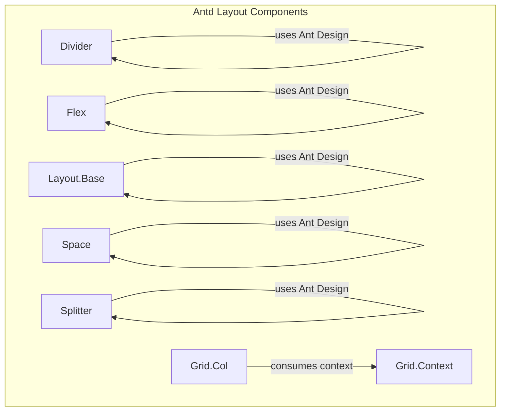
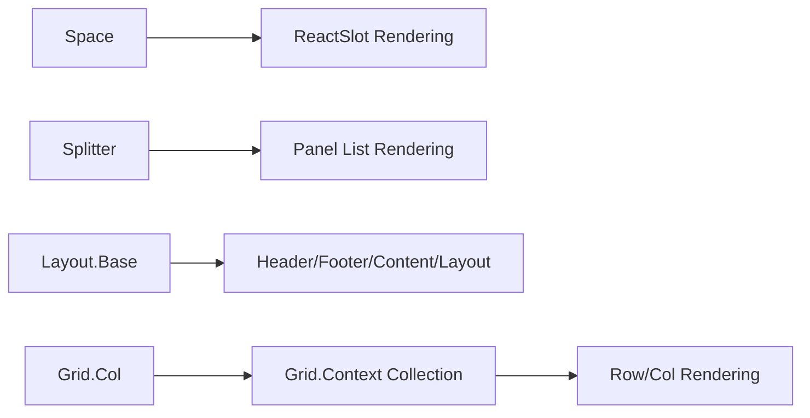
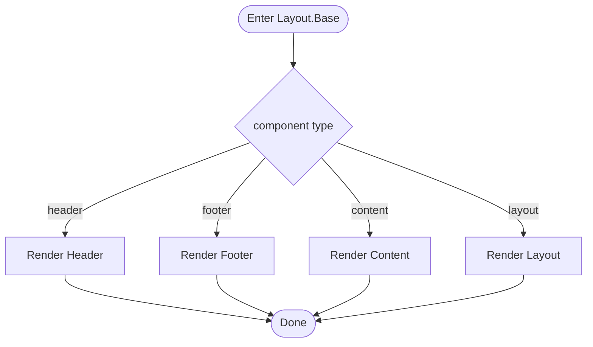
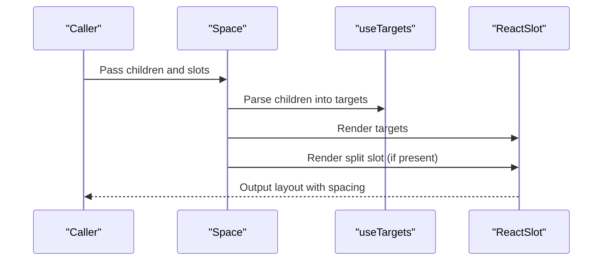
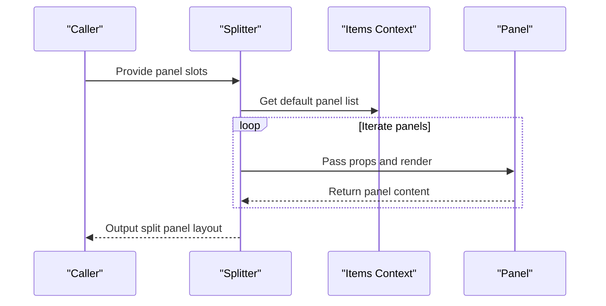
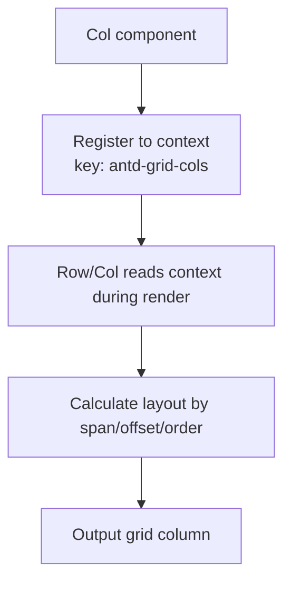
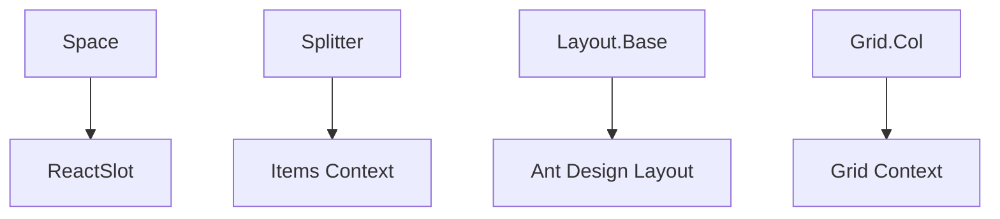

# Layout Components

<cite>
**Files referenced in this document**
- [divider.tsx](file://frontend/antd/divider/divider.tsx)
- [flex.tsx](file://frontend/antd/flex/flex.tsx)
- [layout.base.tsx](file://frontend/antd/layout/layout.base.tsx)
- [space.tsx](file://frontend/antd/space/space.tsx)
- [splitter.tsx](file://frontend/antd/splitter/splitter.tsx)
- [context.ts](file://frontend/antd/grid/context.ts)
- [col.tsx](file://frontend/antd/grid/col/col.tsx)
</cite>

## Table of Contents

1. [Introduction](#introduction)
2. [Project Structure](#project-structure)
3. [Core Components](#core-components)
4. [Architecture Overview](#architecture-overview)
5. [Component Details](#component-details)
6. [Dependency Analysis](#dependency-analysis)
7. [Performance and Responsive Behavior](#performance-and-responsive-behavior)
8. [Mobile and Screen Adaptation](#mobile-and-screen-adaptation)
9. [Troubleshooting](#troubleshooting)
10. [Conclusion](#conclusion)
11. [Appendix: Complex Page Layout Examples and Best Practices](#appendix-complex-page-layout-examples-and-best-practices)

## Introduction

This chapter is intended for developers using Ant Design layout components. It systematically covers the implementation and usage of Divider, Flex, Grid, Layout, Space, Splitter, and Masonry components in this repository. The documentation focuses on the layout algorithm concepts, responsive behavior, nesting rules, and composition patterns of each component, along with recommendations for mobile adaptation and screen size compatibility.

## Project Structure

These layout components reside in the `antd` submodule of the frontend directory. They adopt a unified "Svelte wrapping React components" strategy (bridging Ant Design React components to Svelte via `sveltify`), and in some cases introduce context and utility functions to support more complex layout capabilities (such as grid column collection and splitter panel item rendering).

Diagram sources

- [divider.tsx:1-15](file://frontend/antd/divider/divider.tsx#L1-L15)
- [flex.tsx:1-11](file://frontend/antd/flex/flex.tsx#L1-L11)
- [layout.base.tsx:1-40](file://frontend/antd/layout/layout.base.tsx#L1-L40)
- [space.tsx:1-29](file://frontend/antd/space/space.tsx#L1-L29)
- [splitter.tsx:1-38](file://frontend/antd/splitter/splitter.tsx#L1-L38)
- [context.ts:1-7](file://frontend/antd/grid/context.ts#L1-L7)
- [col.tsx:1-14](file://frontend/antd/grid/col/col.tsx#L1-L14)

Section sources

- [divider.tsx:1-15](file://frontend/antd/divider/divider.tsx#L1-L15)
- [flex.tsx:1-11](file://frontend/antd/flex/flex.tsx#L1-L11)
- [layout.base.tsx:1-40](file://frontend/antd/layout/layout.base.tsx#L1-L40)
- [space.tsx:1-29](file://frontend/antd/space/space.tsx#L1-L29)
- [splitter.tsx:1-38](file://frontend/antd/splitter/splitter.tsx#L1-L38)
- [context.ts:1-7](file://frontend/antd/grid/context.ts#L1-L7)
- [col.tsx:1-14](file://frontend/antd/grid/col/col.tsx#L1-L14)

## Core Components

- **Divider**: A lightweight wrapper around Ant Design's Divider. Renders an empty divider when no children are present, or a divider with content when children are provided.
- **Flex**: A simple wrapper around Ant Design's Flex that passes through all props and children directly.
- **Layout.Base**: Dynamically selects between Header, Footer, Content, or Layout based on the `component` prop, and injects CSS class names to distinguish layout regions.
- **Space**: Extends Ant Design's Space with slot rendering and `split` slot support. Internally uses `useTargets` to map children to a target collection.
- **Splitter**: Extends Ant Design's Splitter with context-based default panel collection, passing each panel's element and props through to `Panel`.
- **Grid**: Collects columns (Col) via context and injects them into Row/Col rendering logic. The Col component registers itself into the context via `ItemHandler`.
- **Masonry**: Based on Ant Design's Masonry component, supports responsive column count configuration and automatic item height adjustment. Ideal for image walls, card streams, and other unequal-height layout scenarios. Refer to [Masonry](file://.qoder/repowiki/en/content/Ant%20Design%20Components/Layout%20Components/Masonry.md) for details.

Section sources

- [divider.tsx:1-15](file://frontend/antd/divider/divider.tsx#L1-L15)
- [flex.tsx:1-11](file://frontend/antd/flex/flex.tsx#L1-L11)
- [layout.base.tsx:1-40](file://frontend/antd/layout/layout.base.tsx#L1-L40)
- [space.tsx:1-29](file://frontend/antd/space/space.tsx#L1-L29)
- [splitter.tsx:1-38](file://frontend/antd/splitter/splitter.tsx#L1-L38)
- [context.ts:1-7](file://frontend/antd/grid/context.ts#L1-L7)
- [col.tsx:1-14](file://frontend/antd/grid/col/col.tsx#L1-L14)

## Architecture Overview

The diagram below shows the dependency and collaboration relationships among the layout components: Space and Splitter resolve child nodes and establish target mappings before rendering; Layout.Base dynamically selects the specific layout sub-component; Grid collects Col instances via context and participates in grid layout rendering.

Diagram sources

- [space.tsx:1-29](file://frontend/antd/space/space.tsx#L1-L29)
- [splitter.tsx:1-38](file://frontend/antd/splitter/splitter.tsx#L1-L38)
- [layout.base.tsx:1-40](file://frontend/antd/layout/layout.base.tsx#L1-L40)
- [context.ts:1-7](file://frontend/antd/grid/context.ts#L1-L7)
- [col.tsx:1-14](file://frontend/antd/grid/col/col.tsx#L1-L14)

## Component Details

### Divider

- Implementation notes
  - Wraps Ant Design's Divider using `sveltify`.
  - Renders a divider with children when children are present; otherwise renders an empty divider.
- Nesting rules
  - Used as a separator; can be placed inside any container without affecting the parent's layout mode.
- Responsive behavior
  - Determined by Ant Design; no breakpoint control by default.
- Typical usage
  - Insert dividers between list items, form sections, or cards to enhance visual hierarchy.

Section sources

- [divider.tsx:1-15](file://frontend/antd/divider/divider.tsx#L1-L15)

### Flex

- Implementation notes
  - Wraps Ant Design's Flex using `sveltify`, passing all props and children through directly.
- Layout algorithm
  - Follows the Flexbox specification, supporting main axis, cross axis, wrapping, alignment, and other common properties.
- Nesting rules
  - Flex can nest other Flex, Grid, Space, and layout components to form composite layouts.
- Responsive behavior
  - Flex properties can change at breakpoints to achieve adaptive layouts using Ant Design's breakpoint configuration.
- Typical usage
  - Header navigation, card groups, button groups, and other scenarios requiring flexible alignment and distribution.

Section sources

- [flex.tsx:1-11](file://frontend/antd/flex/flex.tsx#L1-L11)

### Layout.Base

- Implementation notes
  - Dynamically selects between rendering Header, Footer, Content, or Layout based on the `component` prop.
  - Injects CSS class names for non-layout sub-components to facilitate styling and debugging.
- Layout algorithm
  - Implements page frame layout using Ant Design's Layout family of components.
- Nesting rules
  - Header/Footer/Content must be direct children of Layout; Sider and other sub-components can be nested inside.
- Responsive behavior
  - Achieves a responsive sidebar by combining Sider collapse/expand behavior with breakpoint strategies.
- Typical usage
  - Overall page framework: top navigation + side menu + main content + footer.

Diagram sources

- [layout.base.tsx:1-40](file://frontend/antd/layout/layout.base.tsx#L1-L40)

Section sources

- [layout.base.tsx:1-40](file://frontend/antd/layout/layout.base.tsx#L1-L40)

### Space

- Implementation notes
  - Uses Ant Design's Space and extends it with slot rendering and `split` slot support.
  - Internally maps children to a target collection via `useTargets`, then renders them through `ReactSlot`.
- Layout algorithm
  - Calculates spacing between elements based on direction and size, supporting wrapping and compact composition modes.
- Nesting rules
  - Can nest any component; the `split` slot is used to render separators.
- Responsive behavior
  - Spacing values can change at breakpoints to optimize spacing for different screen sizes.
- Typical usage
  - Navigation button groups, action button groups, compact arrangement between form items.

Diagram sources

- [space.tsx:1-29](file://frontend/antd/space/space.tsx#L1-L29)

Section sources

- [space.tsx:1-29](file://frontend/antd/space/space.tsx#L1-L29)

### Splitter

- Implementation notes
  - Uses Ant Design's Splitter and collects default panel list via context.
  - Passes each panel's element and props through to Panel for flexible multi-panel layout.
- Layout algorithm
  - Split layout based on drag or fixed proportions, supporting horizontal and vertical directions.
- Nesting rules
  - Sub-panels register via context; each panel independently renders its own content.
- Responsive behavior
  - Can adjust initial proportions and minimum sizes at breakpoints to ensure mobile usability.
- Typical usage
  - Code editor + preview area, left/right content comparison, multi-view side-by-side display.

Diagram sources

- [splitter.tsx:1-38](file://frontend/antd/splitter/splitter.tsx#L1-L38)

Section sources

- [splitter.tsx:1-38](file://frontend/antd/splitter/splitter.tsx#L1-L38)

### Grid (Col and Context)

- Implementation notes
  - Col registers itself into a context named `antd-grid-cols` via `ItemHandler`.
  - The context provides `withItemsContextProvider` and `useItems` for collecting and consuming column definitions.
- Layout algorithm
  - Based on a 24-column grid system. Col props such as `span`, `offset`, `order`, and `gutter` determine column width and order.
- Nesting rules
  - Col must be placed within a Row/Col context; responsive behavior can be configured via breakpoints.
- Responsive behavior
  - Supports breakpoints: xs/sm/md/lg/xl. Different `span`/`offset` values can be set per breakpoint.
- Typical usage
  - Form grids, card grids, image walls, etc.

Diagram sources

- [context.ts:1-7](file://frontend/antd/grid/context.ts#L1-L7)
- [col.tsx:1-14](file://frontend/antd/grid/col/col.tsx#L1-L14)

Section sources

- [context.ts:1-7](file://frontend/antd/grid/context.ts#L1-L7)
- [col.tsx:1-14](file://frontend/antd/grid/col/col.tsx#L1-L14)

## Dependency Analysis

- Inter-component coupling
  - Space and Splitter directly depend on ReactSlot and context for slot and child item rendering.
  - Layout.Base depends on Ant Design's Layout family components and dynamically selects sub-component types.
  - Grid uses context to collect and consume Col instances, reducing coupling between Row and Col.
- External dependencies
  - All components depend on their corresponding Ant Design components; layout algorithms and styles are provided by Ant Design.
- Potential circular dependencies
  - No direct circular dependencies found; context is only used for data passing and does not reverse-depend on components.

Diagram sources

- [space.tsx:1-29](file://frontend/antd/space/space.tsx#L1-L29)
- [splitter.tsx:1-38](file://frontend/antd/splitter/splitter.tsx#L1-L38)
- [layout.base.tsx:1-40](file://frontend/antd/layout/layout.base.tsx#L1-L40)
- [context.ts:1-7](file://frontend/antd/grid/context.ts#L1-L7)
- [col.tsx:1-14](file://frontend/antd/grid/col/col.tsx#L1-L14)

Section sources

- [space.tsx:1-29](file://frontend/antd/space/space.tsx#L1-L29)
- [splitter.tsx:1-38](file://frontend/antd/splitter/splitter.tsx#L1-L38)
- [layout.base.tsx:1-40](file://frontend/antd/layout/layout.base.tsx#L1-L40)
- [context.ts:1-7](file://frontend/antd/grid/context.ts#L1-L7)
- [col.tsx:1-14](file://frontend/antd/grid/col/col.tsx#L1-L14)

## Performance and Responsive Behavior

- Performance characteristics
  - Components use lightweight wrappers to avoid additional state management overhead. Space's `useTargets` performs mapping only once during initialization.
  - Layout.Base uses `useMemo` to cache component types, reducing unnecessary re-renders.
- Responsive behavior
  - The responsiveness of Flex, Space, Grid, and Splitter is primarily driven by Ant Design's breakpoints and props. Layout parameters for different screen sizes can be configured individually in the breakpoint configuration.
  - It is recommended to define breakpoint thresholds and column counts clearly during the design phase to avoid frequent reflows.

## Mobile and Screen Adaptation

- General strategies
  - Use breakpoint configuration (e.g., xs/sm/md/lg/xl) to adjust column widths, spacing, and layout direction for small screens.
  - Use compact mode and appropriate spacing in Space to avoid horizontal scrolling on mobile.
  - Set minimum panel sizes and initial proportions in Splitter to ensure touch usability.
- Layout containers
  - On small screens, prefer vertical layouts (Flex direction column). Hide secondary areas or use a drawer-style sidebar if necessary.
- Grid system
  - Configure `offset` and `order` appropriately to maintain readability and clickability on small screens.

## Troubleshooting

- Children not rendering correctly
  - Space hides children internally and renders targets via ReactSlot. Verify that slots are being used correctly.
- Splitter panels are empty
  - Splitter relies on the default panel list provided by context. If panels are empty, nothing is rendered. Check slot naming and context registration.
- Grid columns not taking effect
  - Confirm that Col is registered within a Row/Col context. Check breakpoint configuration and whether `span`/`offset` values are reasonable.
- Layout container type error
  - Layout.Base only supports four types: header/footer/content/layout. Passing any other value will fall back to Layout.

Section sources

- [space.tsx:1-29](file://frontend/antd/space/space.tsx#L1-L29)
- [splitter.tsx:1-38](file://frontend/antd/splitter/splitter.tsx#L1-L38)
- [layout.base.tsx:1-40](file://frontend/antd/layout/layout.base.tsx#L1-L40)
- [context.ts:1-7](file://frontend/antd/grid/context.ts#L1-L7)
- [col.tsx:1-14](file://frontend/antd/grid/col/col.tsx#L1-L14)

## Conclusion

The layout components in this repository are designed around a "lightweight wrapper + context" core philosophy. They reuse Ant Design's mature layout algorithms and styling system, while providing extensibility through slot rendering, dynamic component selection, and context collection. Through breakpoint configuration and appropriate nesting rules, high-quality page layouts that work well on both desktop and mobile can be built.

## Appendix: Complex Page Layout Examples and Best Practices

- Example 1: Dashboard page
  - Use Layout.Base to build a header + sidebar + main body. Use Flex and Space inside the main body to organize cards and action areas. Use Divider at the bottom for separation.
  - Breakpoint strategy: On small screens, collapse the action area into cards or use a drawer.
- Example 2: Content editing page
  - Use Splitter to split the left directory tree from the right editor. Use Grid for form layout inside the editor. Use Space for action buttons at the bottom.
  - Breakpoint strategy: On small screens, hide the directory tree and display the editor at full width.
- Example 3: Comparison display page
  - Use Splitter to place two content blocks side by side. Inside each block, use Flex and Space for title, description, and action alignment.
  - Breakpoint strategy: On small screens, switch to vertical stacking to preserve readability.

Best practices

- Prefer Flex and Space for simple layouts; introduce Splitter only for complex scenarios.
- Unify breakpoint configuration in the grid system to avoid multiple breakpoint strategies on the same page.
- Inject semantic class names into layout containers to facilitate style overrides and debugging.
- On mobile, prioritize touch interaction and adequate tap target sizes by increasing spacing and font size appropriately.
