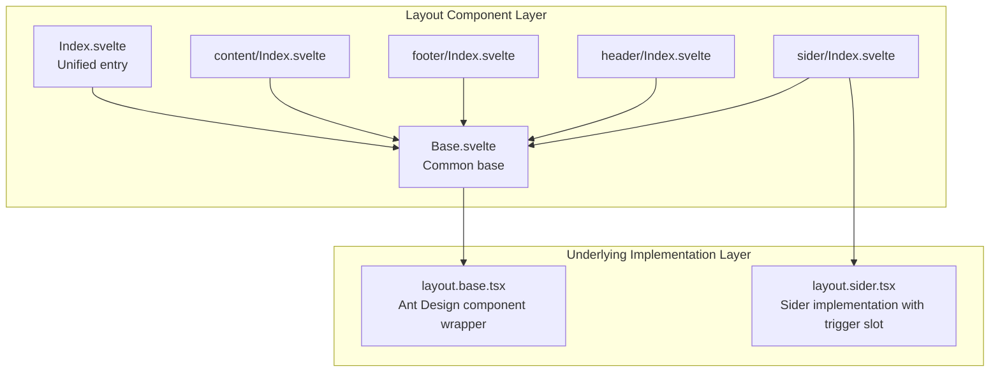
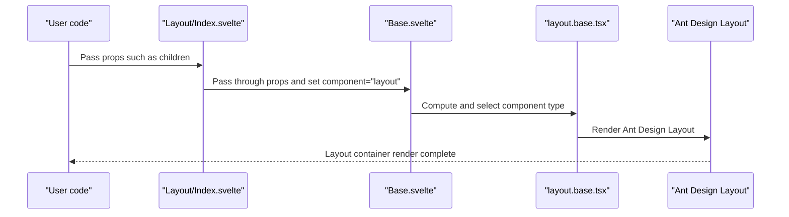
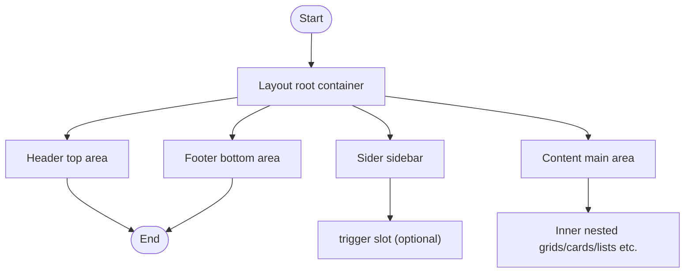
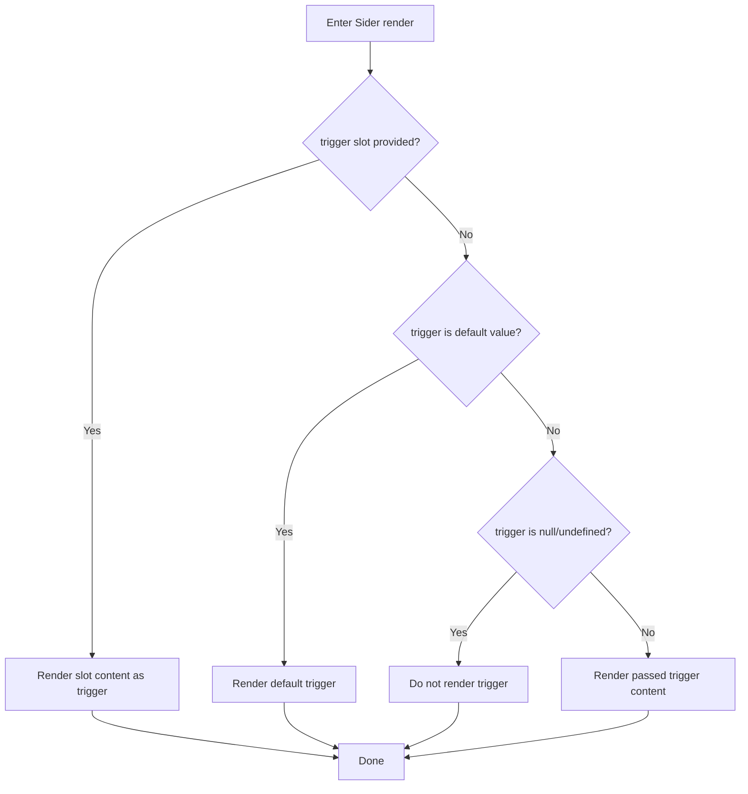
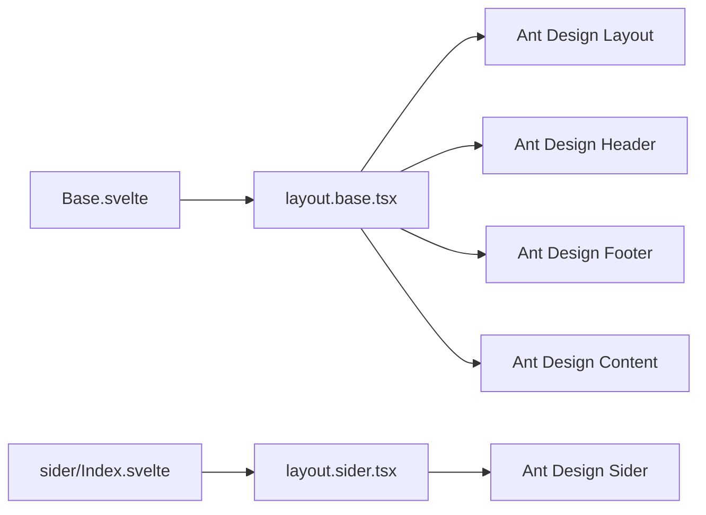

# Layout

<cite>
**Files referenced in this document**
- [frontend/antd/layout/Index.svelte](file://frontend/antd/layout/Index.svelte)
- [frontend/antd/layout/Base.svelte](file://frontend/antd/layout/Base.svelte)
- [frontend/antd/layout/layout.base.tsx](file://frontend/antd/layout/layout.base.tsx)
- [frontend/antd/layout/content/Index.svelte](file://frontend/antd/layout/content/Index.svelte)
- [frontend/antd/layout/footer/Index.svelte](file://frontend/antd/layout/footer/Index.svelte)
- [frontend/antd/layout/header/Index.svelte](file://frontend/antd/layout/header/Index.svelte)
- [frontend/antd/layout/sider/Index.svelte](file://frontend/antd/layout/sider/Index.svelte)
- [frontend/antd/layout/sider/layout.sider.tsx](file://frontend/antd/layout/sider/layout.sider.tsx)
- [docs/components/antd/layout/README.md](file://docs/components/antd/layout/README.md)
</cite>

## Table of Contents

1. [Introduction](#introduction)
2. [Project Structure](#project-structure)
3. [Core Components](#core-components)
4. [Architecture Overview](#architecture-overview)
5. [Detailed Component Analysis](#detailed-component-analysis)
6. [Dependency Analysis](#dependency-analysis)
7. [Performance Considerations](#performance-considerations)
8. [Troubleshooting Guide](#troubleshooting-guide)
9. [Conclusion](#conclusion)
10. [Appendix](#appendix)

## Introduction

This document provides a systematic introduction to the overall architecture and usage of the Layout component, covering the combination and nesting rules of layout regions including Header, Sider, Content, and Footer. It explains responsive behavior and fixed positioning strategies, provides ideas for classic page templates such as sidebar layouts, top navigation layouts, and hybrid layouts, and describes integration with the grid system and adaptive behavior at different screen sizes. It also provides practical recommendations for style customization, theme switching, and animation effects.

## Project Structure

The Layout component adopts a "unified base + regional sub-components" layered design:

- Base layer: `Index.svelte` serves as the entry point. `Base.svelte` handles prop processing and rendering. `layout.base.tsx` wraps the specific Ant Design components (Header/Footer/Content/Layout).
- Region layer: header, footer, content, and sider each specify a `component` type via their own `Index.svelte`, reusing the `Base.svelte` rendering logic.
- Special region: sider provides its own `layout.sider.tsx` to support a `trigger` slot for the collapse trigger.

Diagram sources

- [frontend/antd/layout/Index.svelte:1-18](file://frontend/antd/layout/Index.svelte#L1-L18)
- [frontend/antd/layout/Base.svelte:1-71](file://frontend/antd/layout/Base.svelte#L1-L71)
- [frontend/antd/layout/layout.base.tsx:1-40](file://frontend/antd/layout/layout.base.tsx#L1-L40)
- [frontend/antd/layout/sider/Index.svelte:1-62](file://frontend/antd/layout/sider/Index.svelte#L1-L62)
- [frontend/antd/layout/sider/layout.sider.tsx:1-26](file://frontend/antd/layout/sider/layout.sider.tsx#L1-L26)

Section sources

- [frontend/antd/layout/Index.svelte:1-18](file://frontend/antd/layout/Index.svelte#L1-L18)
- [frontend/antd/layout/Base.svelte:1-71](file://frontend/antd/layout/Base.svelte#L1-L71)
- [frontend/antd/layout/layout.base.tsx:1-40](file://frontend/antd/layout/layout.base.tsx#L1-L40)
- [frontend/antd/layout/content/Index.svelte:1-15](file://frontend/antd/layout/content/Index.svelte#L1-L15)
- [frontend/antd/layout/footer/Index.svelte:1-15](file://frontend/antd/layout/footer/Index.svelte#L1-L15)
- [frontend/antd/layout/header/Index.svelte:1-15](file://frontend/antd/layout/header/Index.svelte#L1-L15)
- [frontend/antd/layout/sider/Index.svelte:1-62](file://frontend/antd/layout/sider/Index.svelte#L1-L62)
- [frontend/antd/layout/sider/layout.sider.tsx:1-26](file://frontend/antd/layout/sider/layout.sider.tsx#L1-L26)

## Core Components

- Layout (overall container)
  - Entry: `Index.svelte` passes props to `Base.svelte` and specifies `component` as `layout`.
  - Base: `Base.svelte` reuses common prop handling logic; `layout.base.tsx` ultimately decides to render Ant Design's Layout container.
- Header (top area)
  - Entry: `header/Index.svelte` specifies `component` as `header`, reusing `Base.svelte` to render Ant Design's Header.
- Footer (bottom area)
  - Entry: `footer/Index.svelte` specifies `component` as `footer`, reusing `Base.svelte` to render Ant Design's Footer.
- Content (content area)
  - Entry: `content/Index.svelte` specifies `component` as `content`, reusing `Base.svelte` to render Ant Design's Content.
- Sider (sidebar)
  - Entry: `sider/Index.svelte` asynchronously loads `layout.sider.tsx` to implement Ant Design's Sider with `trigger` slot support.

Section sources

- [frontend/antd/layout/Index.svelte:1-18](file://frontend/antd/layout/Index.svelte#L1-L18)
- [frontend/antd/layout/Base.svelte:1-71](file://frontend/antd/layout/Base.svelte#L1-L71)
- [frontend/antd/layout/layout.base.tsx:1-40](file://frontend/antd/layout/layout.base.tsx#L1-L40)
- [frontend/antd/layout/header/Index.svelte:1-15](file://frontend/antd/layout/header/Index.svelte#L1-L15)
- [frontend/antd/layout/footer/Index.svelte:1-15](file://frontend/antd/layout/footer/Index.svelte#L1-L15)
- [frontend/antd/layout/content/Index.svelte:1-15](file://frontend/antd/layout/content/Index.svelte#L1-L15)
- [frontend/antd/layout/sider/Index.svelte:1-62](file://frontend/antd/layout/sider/Index.svelte#L1-L62)
- [frontend/antd/layout/sider/layout.sider.tsx:1-26](file://frontend/antd/layout/sider/layout.sider.tsx#L1-L26)

## Architecture Overview

The diagram below shows the render chain from Svelte to Ant Design, as well as the Sider trigger slot mechanism:

Diagram sources

- [frontend/antd/layout/Index.svelte:1-18](file://frontend/antd/layout/Index.svelte#L1-L18)
- [frontend/antd/layout/Base.svelte:1-71](file://frontend/antd/layout/Base.svelte#L1-L71)
- [frontend/antd/layout/layout.base.tsx:1-40](file://frontend/antd/layout/layout.base.tsx#L1-L40)

Section sources

- [frontend/antd/layout/Index.svelte:1-18](file://frontend/antd/layout/Index.svelte#L1-L18)
- [frontend/antd/layout/Base.svelte:1-71](file://frontend/antd/layout/Base.svelte#L1-L71)
- [frontend/antd/layout/layout.base.tsx:1-40](file://frontend/antd/layout/layout.base.tsx#L1-L40)

## Detailed Component Analysis

### Layout Nesting and Region Composition

- Nesting rules
  - Layout is the root container and can directly contain Header, Sider, Content, and Footer.
  - Sider is usually placed on the left side of Layout, Content on the right, Header at the top, and Footer at the bottom.
  - More fine-grained layouts or grid systems can be further nested inside Content.
- Responsive and fixed positioning
  - Implement mobile responsiveness by combining Sider's collapse props with breakpoint configuration.
  - When Header/Footer has a fixed height, ensure Content height calculation is not interfered with to avoid scroll conflicts.
- Trigger and interaction
  - Sider supports a custom `trigger` slot for implementing a collapse button with icon switching.

Diagram sources

- [frontend/antd/layout/header/Index.svelte:1-15](file://frontend/antd/layout/header/Index.svelte#L1-L15)
- [frontend/antd/layout/sider/Index.svelte:1-62](file://frontend/antd/layout/sider/Index.svelte#L1-L62)
- [frontend/antd/layout/content/Index.svelte:1-15](file://frontend/antd/layout/content/Index.svelte#L1-L15)
- [frontend/antd/layout/footer/Index.svelte:1-15](file://frontend/antd/layout/footer/Index.svelte#L1-L15)

Section sources

- [frontend/antd/layout/header/Index.svelte:1-15](file://frontend/antd/layout/header/Index.svelte#L1-L15)
- [frontend/antd/layout/sider/Index.svelte:1-62](file://frontend/antd/layout/sider/Index.svelte#L1-L62)
- [frontend/antd/layout/content/Index.svelte:1-15](file://frontend/antd/layout/content/Index.svelte#L1-L15)
- [frontend/antd/layout/footer/Index.svelte:1-15](file://frontend/antd/layout/footer/Index.svelte#L1-L15)

### Sider Component and Trigger Slot

- Trigger mechanism
  - If a `trigger` slot is provided, that slot content takes priority. If no slot is provided and `trigger` is the default value, the default trigger is rendered. Otherwise, the rendered state is determined by the passed `trigger` value.
- Collapse state management
  - Use Sider's `collapsed` state together with trigger behavior to implement click-toggle expand/collapse.

Diagram sources

- [frontend/antd/layout/sider/layout.sider.tsx:1-26](file://frontend/antd/layout/sider/layout.sider.tsx#L1-L26)

Section sources

- [frontend/antd/layout/sider/layout.sider.tsx:1-26](file://frontend/antd/layout/sider/layout.sider.tsx#L1-L26)

### Classic Page Layout Templates

- Sidebar layout
  - Use Layout + Header + Sider + Content + Footer. Sider has a fixed width and is collapsible on mobile.
- Top navigation layout
  - Use Layout + Header (top navigation only) + Content. Sider can be omitted or hidden.
- Hybrid layout
  - Nest a grid system inside Content to implement multi-column content with a side information panel.

Section sources

- [docs/components/antd/layout/README.md:1-8](file://docs/components/antd/layout/README.md#L1-L8)

### Integration with the Grid System

- Use Row/Col in Content for column division, combined with responsive breakpoints for adaptive layouts.
- Note: When Header/Footer has a fixed height, Content height calculation must account for the remaining visible area to avoid overflow or scroll anomalies.

## Dependency Analysis

- Component coupling
  - All region components depend on `Base.svelte`'s prop handling and rendering process, reducing duplicate code and improving consistency.
  - Sider independently implements `layout.sider.tsx` to avoid coupling with the common Base process, enhancing extensibility.
- External dependencies
  - Ant Design's Layout, Header, Footer, Content, and Sider components as render targets.
  - Svelte Slot and React Slot bridging for slot passing and cloning.

Diagram sources

- [frontend/antd/layout/Base.svelte:1-71](file://frontend/antd/layout/Base.svelte#L1-L71)
- [frontend/antd/layout/layout.base.tsx:1-40](file://frontend/antd/layout/layout.base.tsx#L1-L40)
- [frontend/antd/layout/sider/Index.svelte:1-62](file://frontend/antd/layout/sider/Index.svelte#L1-L62)
- [frontend/antd/layout/sider/layout.sider.tsx:1-26](file://frontend/antd/layout/sider/layout.sider.tsx#L1-L26)

Section sources

- [frontend/antd/layout/Base.svelte:1-71](file://frontend/antd/layout/Base.svelte#L1-L71)
- [frontend/antd/layout/layout.base.tsx:1-40](file://frontend/antd/layout/layout.base.tsx#L1-L40)
- [frontend/antd/layout/sider/Index.svelte:1-62](file://frontend/antd/layout/sider/Index.svelte#L1-L62)
- [frontend/antd/layout/sider/layout.sider.tsx:1-26](file://frontend/antd/layout/sider/layout.sider.tsx#L1-L26)

## Performance Considerations

- Async loading
  - Sider is asynchronously loaded via `importComponent`, reducing initial bundle size and first-screen blocking.
- Prop passthrough and derivation
  - `Base.svelte` handles and derives props in a unified manner, avoiding unnecessary re-renders.
- Class names
  - Class names are conditionally concatenated, avoiding excessive runtime string concatenation overhead.

Section sources

- [frontend/antd/layout/sider/Index.svelte:1-62](file://frontend/antd/layout/sider/Index.svelte#L1-L62)
- [frontend/antd/layout/Base.svelte:1-71](file://frontend/antd/layout/Base.svelte#L1-L71)

## Troubleshooting Guide

- No content rendered
  - Check if the `visible` prop has been set to `false`. Confirm the visibility check logic in `Base.svelte`.
- Sider trigger not showing
  - Confirm whether a `trigger` slot has been provided. Check if the `trigger` value is `null`/`undefined` or the default value.
- Style anomalies
  - Confirm that class names are correctly concatenated. Check if external styles are causing layout misalignment.

Section sources

- [frontend/antd/layout/Base.svelte:1-71](file://frontend/antd/layout/Base.svelte#L1-L71)
- [frontend/antd/layout/sider/layout.sider.tsx:1-26](file://frontend/antd/layout/sider/layout.sider.tsx#L1-L26)

## Conclusion

The Layout component achieves complete encapsulation of Ant Design's layout system through a unified base and regionalized decomposition. With the Sider trigger slot and async loading mechanism, it ensures both flexibility and performance. Combined with the grid system and responsive breakpoints, a variety of classic page layout templates can be quickly assembled, while style and theme customization meets the needs of complex business scenarios.

## Appendix

- Example entry reference: [docs/components/antd/layout/README.md:1-8](file://docs/components/antd/layout/README.md#L1-L8)
