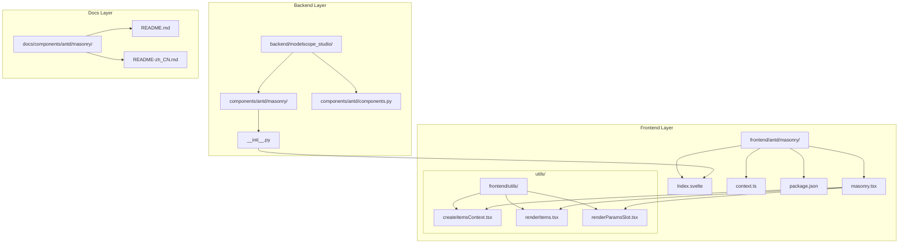
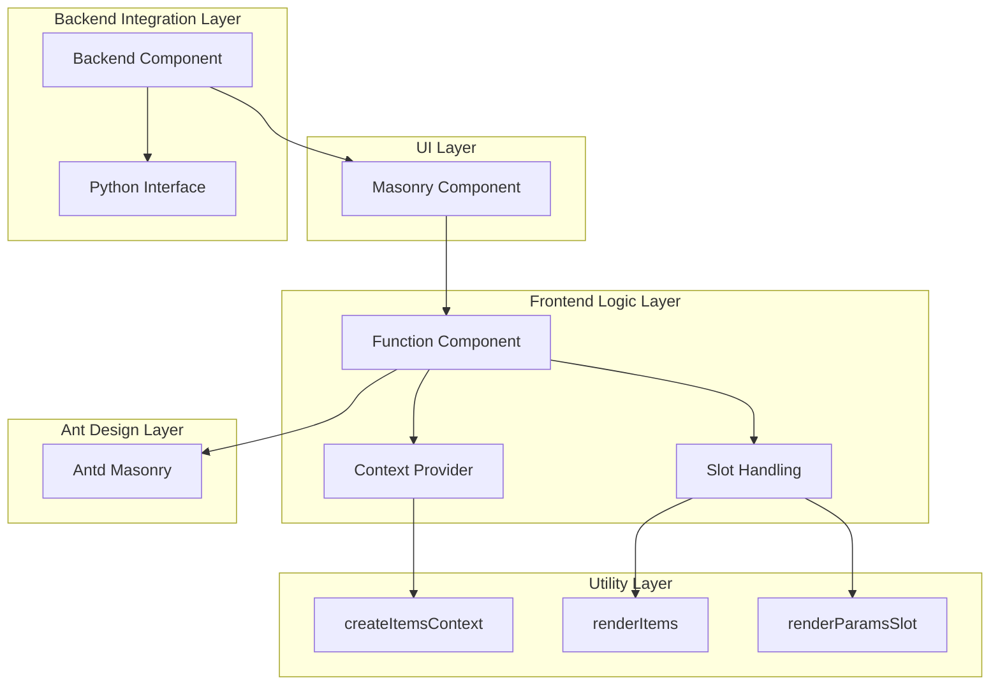
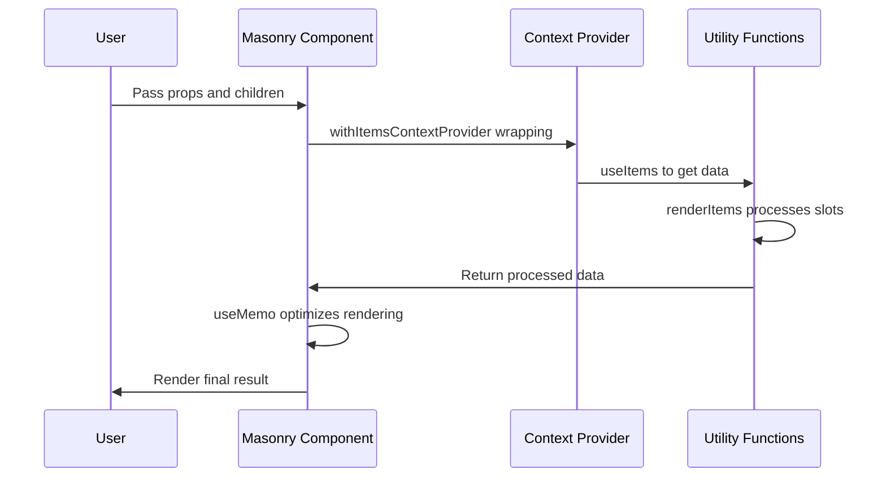
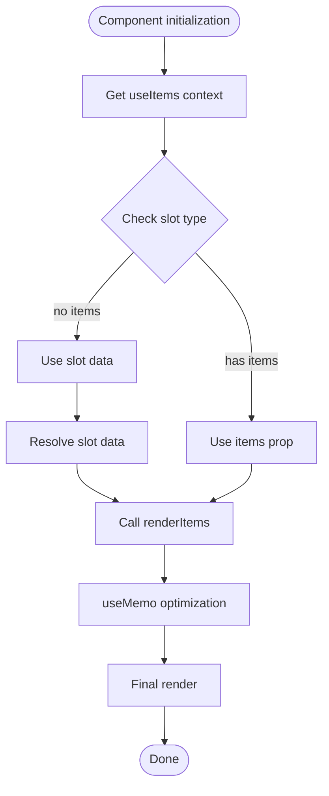
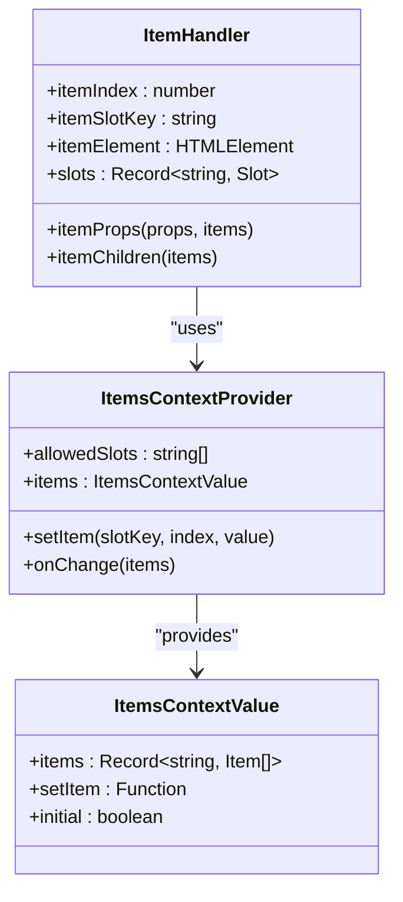
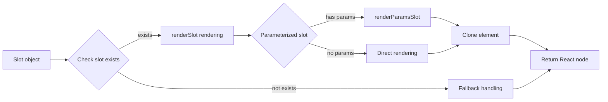
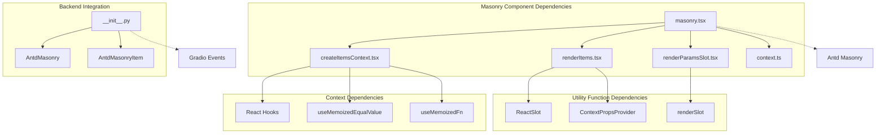

# Masonry

<cite>
**Files referenced in this document**
- [frontend/antd/masonry/masonry.tsx](file://frontend/antd/masonry/masonry.tsx)
- [frontend/antd/masonry/context.ts](file://frontend/antd/masonry/context.ts)
- [frontend/antd/masonry/Index.svelte](file://frontend/antd/masonry/Index.svelte)
- [frontend/antd/masonry/package.json](file://frontend/antd/masonry/package.json)
- [backend/modelscope_studio/components/antd/masonry/__init__.py](file://backend/modelscope_studio/components/antd/masonry/__init__.py)
- [backend/modelscope_studio/components/antd/components.py](file://backend/modelscope_studio/components/antd/components.py)
- [frontend/utils/createItemsContext.tsx](file://frontend/utils/createItemsContext.tsx)
- [frontend/utils/renderItems.tsx](file://frontend/utils/renderItems.tsx)
- [frontend/utils/renderParamsSlot.tsx](file://frontend/utils/renderParamsSlot.tsx)
- [docs/components/antd/masonry/README.md](file://docs/components/antd/masonry/README.md)
- [docs/components/antd/masonry/README-zh_CN.md](file://docs/components/antd/masonry/README-zh_CN.md)
</cite>

## Table of Contents

1. [Introduction](#introduction)
2. [Project Structure](#project-structure)
3. [Core Components](#core-components)
4. [Architecture Overview](#architecture-overview)
5. [Detailed Component Analysis](#detailed-component-analysis)
6. [Dependency Analysis](#dependency-analysis)
7. [Performance Considerations](#performance-considerations)
8. [Troubleshooting Guide](#troubleshooting-guide)
9. [Conclusion](#conclusion)

## Introduction

Masonry is an important layout component in ModelScope Studio, implemented based on Ant Design's Masonry component. This component is specifically designed to display content of varying heights, such as images and cards, and automatically creates a waterfall/masonry effect that distributes content evenly across multiple columns.

The masonry layout is particularly well-suited for the following scenarios:

- Displaying images or cards with irregular heights
- Distributing content evenly between columns
- Layout requirements that need responsive column count adjustment

## Project Structure

ModelScope Studio adopts a frontend-backend separated architecture. The Masonry component is organized as follows:



**Diagram sources**

- [frontend/antd/masonry/masonry.tsx:1-52](file://frontend/antd/masonry/masonry.tsx#L1-L52)
- [frontend/antd/masonry/Index.svelte:1-64](file://frontend/antd/masonry/Index.svelte#L1-L64)
- [backend/modelscope_studio/components/antd/masonry/**init**.py:1-83](file://backend/modelscope_studio/components/antd/masonry/__init__.py#L1-L83)

**Section sources**

- [frontend/antd/masonry/masonry.tsx:1-52](file://frontend/antd/masonry/masonry.tsx#L1-L52)
- [frontend/antd/masonry/Index.svelte:1-64](file://frontend/antd/masonry/Index.svelte#L1-L64)
- [backend/modelscope_studio/components/antd/masonry/**init**.py:1-83](file://backend/modelscope_studio/components/antd/masonry/__init__.py#L1-L83)

## Core Components

### Frontend Core Components

The core implementation of the Masonry component resides in `frontend/antd/masonry/masonry.tsx`. It uses React and Ant Design's Masonry component and integrates with ModelScope Studio's component system.

Main features include:

- **React wrapper**: uses `sveltify` to wrap Svelte components as React components
- **Context management**: integrates `createItemsContext` for data sharing between components
- **Slot rendering**: supports custom slot rendering
- **Dynamic content**: supports dynamic content updates and re-rendering

### Backend Integration Component

The backend component is located at `backend/modelscope_studio/components/antd/masonry/__init__.py` and provides a Python interface bridging to the frontend component.

Key props and methods:

- **EVENTS**: defines the `layout_change` event listener
- **SLOTS**: supports `items` and `itemRender` slots
- **PROPS**: provides configuration options such as `columns`, `gutter`, and `fresh`

**Section sources**

- [frontend/antd/masonry/masonry.tsx:10-49](file://frontend/antd/masonry/masonry.tsx#L10-L49)
- [backend/modelscope_studio/components/antd/masonry/**init**.py:10-65](file://backend/modelscope_studio/components/antd/masonry/__init__.py#L10-L65)

## Architecture Overview

The overall architecture of the Masonry component uses a layered design to ensure good maintainability and extensibility:



**Diagram sources**

- [frontend/antd/masonry/masonry.tsx:1-52](file://frontend/antd/masonry/masonry.tsx#L1-L52)
- [frontend/utils/createItemsContext.tsx:97-184](file://frontend/utils/createItemsContext.tsx#L97-L184)
- [frontend/utils/renderItems.tsx:8-113](file://frontend/utils/renderItems.tsx#L8-L113)

## Detailed Component Analysis

### Masonry Component Implementation

The core implementation of the Masonry component includes the following key parts:

#### Component Wrapping and Prop Handling

The component uses the `sveltify` function to wrap Svelte components as React components, supporting prop passing and event handling:



**Diagram sources**

- [frontend/antd/masonry/masonry.tsx:16-48](file://frontend/antd/masonry/masonry.tsx#L16-L48)
- [frontend/antd/masonry/context.ts:3-4](file://frontend/antd/masonry/context.ts#L3-L4)

#### Data Flow Handling Mechanism

The component manages data flow via `createItemsContext`:



**Diagram sources**

- [frontend/antd/masonry/masonry.tsx:18-43](file://frontend/antd/masonry/masonry.tsx#L18-L43)
- [frontend/utils/renderItems.tsx:8-113](file://frontend/utils/renderItems.tsx#L8-L113)

**Section sources**

- [frontend/antd/masonry/masonry.tsx:1-52](file://frontend/antd/masonry/masonry.tsx#L1-L52)
- [frontend/antd/masonry/context.ts:1-7](file://frontend/antd/masonry/context.ts#L1-L7)

### Context Management System

`createItemsContext` provides comprehensive context management:

#### Context Provider Pattern



**Diagram sources**

- [frontend/utils/createItemsContext.tsx:108-170](file://frontend/utils/createItemsContext.tsx#L108-L170)
- [frontend/utils/createItemsContext.tsx:190-261](file://frontend/utils/createItemsContext.tsx#L190-L261)

#### Data Processing Flow

The component's data processing follows this flow:

1. **Data collection**: collects all child elements from slots
2. **Data transformation**: converts HTML elements into internal data structures
3. **Context passing**: passes data through the React Context in the component tree
4. **State management**: manages component state using `useState` and `useEffect`

**Section sources**

- [frontend/utils/createItemsContext.tsx:97-274](file://frontend/utils/createItemsContext.tsx#L97-L274)

### Slot Rendering System

The Masonry component supports a flexible slot rendering mechanism:

#### Slot Handling Functions



**Diagram sources**

- [frontend/utils/renderParamsSlot.tsx:5-49](file://frontend/utils/renderParamsSlot.tsx#L5-L49)
- [frontend/utils/renderItems.tsx:72-94](file://frontend/utils/renderItems.tsx#L72-L94)

**Section sources**

- [frontend/utils/renderParamsSlot.tsx:1-51](file://frontend/utils/renderParamsSlot.tsx#L1-L51)
- [frontend/utils/renderItems.tsx:1-114](file://frontend/utils/renderItems.tsx#L1-L114)

## Dependency Analysis

### Component Dependency Diagram



**Diagram sources**

- [frontend/antd/masonry/masonry.tsx:1-6](file://frontend/antd/masonry/masonry.tsx#L1-L6)
- [frontend/utils/createItemsContext.tsx:1-18](file://frontend/utils/createItemsContext.tsx#L1-L18)
- [backend/modelscope_studio/components/antd/masonry/**init**.py:1-8](file://backend/modelscope_studio/components/antd/masonry/__init__.py#L1-L8)

### Key Dependency Descriptions

1. **Ant Design Masonry**: core layout component providing masonry layout functionality
2. **React Hooks**: used for state management and performance optimization
3. **Gradio integration**: supports Python backend event handling
4. **Svelte Preprocess**: implements the transformation from Svelte to React

**Section sources**

- [frontend/antd/masonry/masonry.tsx:1-6](file://frontend/antd/masonry/masonry.tsx#L1-L6)
- [backend/modelscope_studio/components/antd/masonry/**init**.py:23-27](file://backend/modelscope_studio/components/antd/masonry/__init__.py#L23-L27)

## Performance Considerations

### Rendering Optimization Strategies

The Masonry component employs multiple performance optimization techniques:

#### useMemo Optimization

The component uses `useMemo` to cache computation results, avoiding unnecessary re-renders:

```typescript
const memoizedItems = useMemo(() => {
  return items || renderItems(resolvedSlotItems);
}, [items, resolvedSlotItems]);
```

#### Event Handler Optimization

Uses `useFunction` and `useMemoizedFn` to optimize event handler performance:

```typescript
const itemRenderFunction = useFunction(props.itemRender);
```

#### Conditional Rendering

Reduces DOM operations through conditional rendering:

```html
<div style={{ display: 'none' }}>{children}</div>
```

### Memory Management

The component implements intelligent memory management:

1. **Reference caching**: uses `useRef` to cache expensive computation results
2. **State synchronization**: synchronizes state changes via `useEffect`
3. **Cleanup mechanism**: cleans up event listeners when the component unmounts

## Troubleshooting Guide

### Common Issues and Solutions

#### 1. Component shows no content

**Symptom**: Masonry component renders blank

**Possible causes**:

- Slot data not set correctly
- `items` prop not provided
- React component not wrapped correctly

**Solutions**:

1. Check if slots are passed correctly
2. Confirm that the `items` prop contains valid data
3. Verify that the component wrapping is correct

#### 2. Layout is disordered

**Symptom**: Masonry layout displays abnormally

**Possible causes**:

- Column count configuration is incorrect
- Gutter settings are improper
- Content height calculation error

**Solutions**:

1. Check the `columns` configuration
2. Adjust the `gutter` setting
3. Ensure content has correct height information

#### 3. Performance issues

**Symptom**: Component renders slowly or stutters

**Possible causes**:

- Large amounts of data causing rendering pressure
- Unnecessary re-renders
- Event handler performance issues

**Solutions**:

1. Use virtual scrolling to handle large datasets
2. Optimize `useMemo` dependencies
3. Reduce the complexity of event handlers

**Section sources**

- [frontend/antd/masonry/masonry.tsx:36-43](file://frontend/antd/masonry/masonry.tsx#L36-L43)
- [frontend/utils/createItemsContext.tsx:124-153](file://frontend/utils/createItemsContext.tsx#L124-L153)

## Conclusion

The Masonry layout component is a powerful and well-designed layout solution in ModelScope Studio. The component demonstrates excellent architectural design through the following characteristics:

### Key Advantages

1. **Modular design**: clear module division for easy maintenance and extension
2. **Performance optimization**: implements multiple performance optimization techniques to ensure a smooth user experience
3. **Flexibility**: supports various configuration options and custom rendering functionality
4. **Type safety**: complete TypeScript type definitions for a good development experience

### Technical Highlights

- **Context management pattern**: implements powerful data flow management via `createItemsContext`
- **Slot rendering system**: supports complex slot rendering and parameterized rendering
- **React integration**: seamlessly integrated into the React ecosystem
- **Backend compatibility**: provides a Python backend interface supporting Gradio event handling

### Application Scenarios

The Masonry component is particularly well-suited for:

- Image gallery display
- Card content layouts
- Dynamic content containers
- Responsive grid layouts

The component provides powerful layout capabilities for ModelScope Studio and is an important piece of infrastructure for building modern web applications.
