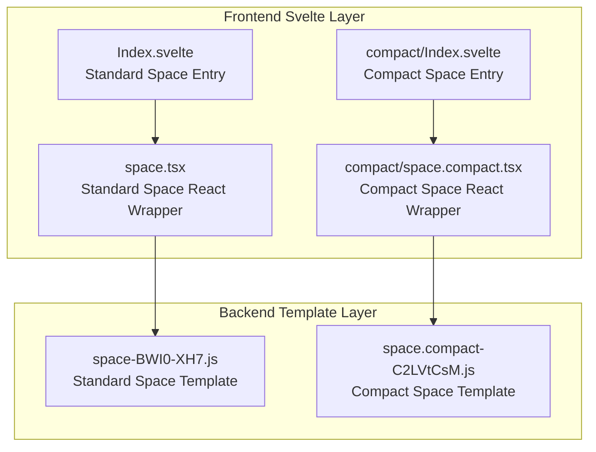
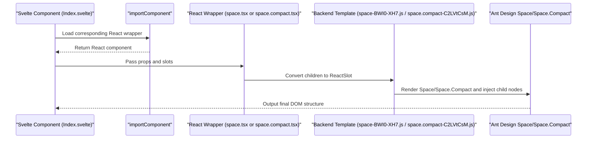
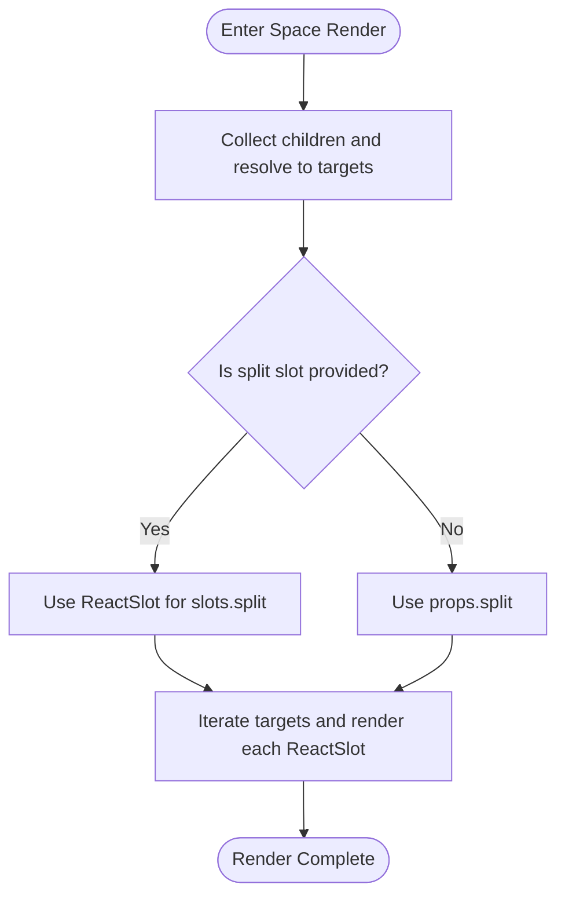
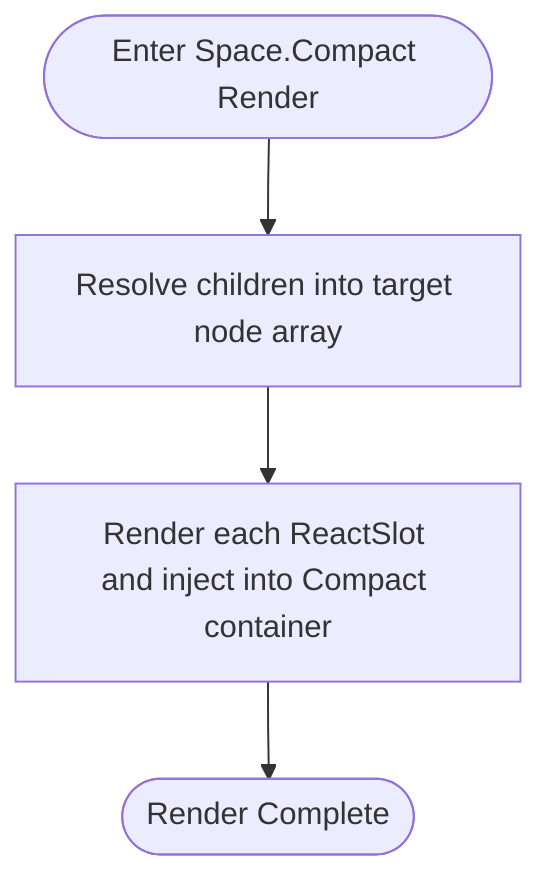
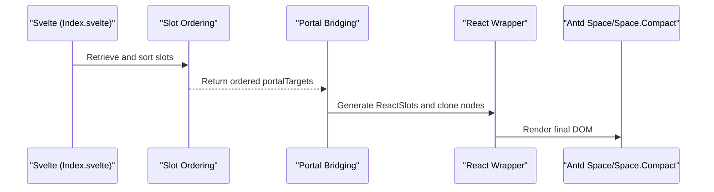
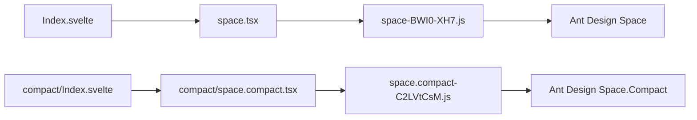

# Space

<cite>
**Files Referenced in This Document**   
- [frontend/antd/space/space.tsx](file://frontend/antd/space/space.tsx)
- [frontend/antd/space/Index.svelte](file://frontend/antd/space/Index.svelte)
- [frontend/antd/space/compact/space.compact.tsx](file://frontend/antd/space/compact/space.compact.tsx)
- [frontend/antd/space/compact/Index.svelte](file://frontend/antd/space/compact/Index.svelte)
- [backend/modelscope_studio/components/antd/space/templates/component/space-BWI0-XH7.js](file://backend/modelscope_studio/components/antd/space/templates/component/space-BWI0-XH7.js)
- [backend/modelscope_studio/components/antd/space/compact/templates/component/space.compact-C2LVtCsM.js](file://backend/modelscope_studio/components/antd/space/compact/templates/component/space.compact-C2LVtCsM.js)
- [docs/components/antd/space/README.md](file://docs/components/antd/space/README.md)
- [docs/components/antd/space/README-zh_CN.md](file://docs/components/antd/space/README-zh_CN.md)
</cite>

## Table of Contents

1. [Introduction](#introduction)
2. [Project Structure](#project-structure)
3. [Core Components](#core-components)
4. [Architecture Overview](#architecture-overview)
5. [Detailed Component Analysis](#detailed-component-analysis)
6. [Dependency Analysis](#dependency-analysis)
7. [Performance Considerations](#performance-considerations)
8. [Troubleshooting Guide](#troubleshooting-guide)
9. [Conclusion](#conclusion)
10. [Appendix](#appendix)

## Introduction

The Space component automatically inserts uniform spacing between multiple child elements, supporting direction control, spacing size configuration, and collaboration with separator slots. This repository provides two variants:

- Standard Space: A wrapper around Ant Design's Space component, responsible for automatic spacing distribution and direction control.
- Compact Space (Space.Compact): A wrapper around Ant Design's Space.Compact, emphasizing tighter layouts and compact spacing strategies.

Both variants bridge Svelte child nodes to React Space/Space.Compact children via the Svelte–React bridging mechanism, ensuring stable rendering in the Gradio ecosystem.

## Project Structure

The Space component consists of a frontend Svelte layer and a backend template layer:

- Frontend Svelte layer: Handles property pass-through, style concatenation, visibility control, and child node rendering.
- Backend template layer: Generates the final React wrapper, handling slot ordering, ReactSlot rendering, and Portal bridging.

**Diagram Sources**

- [frontend/antd/space/Index.svelte:1-61](file://frontend/antd/space/Index.svelte#L1-L61)
- [frontend/antd/space/space.tsx:1-29](file://frontend/antd/space/space.tsx#L1-L29)
- [backend/modelscope_studio/components/antd/space/templates/component/space-BWI0-XH7.js:651-679](file://backend/modelscope_studio/components/antd/space/templates/component/space-BWI0-XH7.js#L651-L679)
- [frontend/antd/space/compact/Index.svelte:1-60](file://frontend/antd/space/compact/Index.svelte#L1-L60)
- [frontend/antd/space/compact/space.compact.tsx:1-24](file://frontend/antd/space/compact/space.compact.tsx#L1-L24)
- [backend/modelscope_studio/components/antd/space/compact/templates/component/space.compact-C2LVtCsM.js:651-674](file://backend/modelscope_studio/components/antd/space/compact/templates/component/space.compact-C2LVtCsM.js#L651-L674)

**Section Sources**

- [frontend/antd/space/Index.svelte:1-61](file://frontend/antd/space/Index.svelte#L1-L61)
- [frontend/antd/space/compact/Index.svelte:1-60](file://frontend/antd/space/compact/Index.svelte#L1-L60)
- [docs/components/antd/space/README.md:1-8](file://docs/components/antd/space/README.md#L1-L8)
- [docs/components/antd/space/README-zh_CN.md:1-8](file://docs/components/antd/space/README-zh_CN.md#L1-L8)

## Core Components

- Standard Space: Responsible for automatically collecting child nodes, injecting separator slots, rendering children in order, and supporting direction, size, and alignment configuration.
- Compact Space (Space.Compact): In compact mode, reduces default spacing and emphasizes tight arrangement of adjacent elements, suitable for dense layouts such as toolbars and button groups.

Both variants dynamically load the corresponding React wrapper via Svelte's `importComponent`, and pass slots and additional props to the underlying React component.

**Section Sources**

- [frontend/antd/space/space.tsx:7-26](file://frontend/antd/space/space.tsx#L7-L26)
- [frontend/antd/space/compact/space.compact.tsx:7-21](file://frontend/antd/space/compact/space.compact.tsx#L7-L21)
- [frontend/antd/space/Index.svelte:10-60](file://frontend/antd/space/Index.svelte#L10-L60)
- [frontend/antd/space/compact/Index.svelte:10-60](file://frontend/antd/space/compact/Index.svelte#L10-L60)

## Architecture Overview

The Space call chain runs from Svelte to React and back to the DOM, involving slot resolution, child node ordering, and Portal bridging.

**Diagram Sources**

- [frontend/antd/space/Index.svelte:10-60](file://frontend/antd/space/Index.svelte#L10-L60)
- [frontend/antd/space/space.tsx:7-26](file://frontend/antd/space/space.tsx#L7-L26)
- [backend/modelscope_studio/components/antd/space/templates/component/space-BWI0-XH7.js:651-679](file://backend/modelscope_studio/components/antd/space/templates/component/space-BWI0-XH7.js#L651-L679)
- [frontend/antd/space/compact/Index.svelte:10-60](file://frontend/antd/space/compact/Index.svelte#L10-L60)
- [frontend/antd/space/compact/space.compact.tsx:7-21](file://frontend/antd/space/compact/space.compact.tsx#L7-L21)
- [backend/modelscope_studio/components/antd/space/compact/templates/component/space.compact-C2LVtCsM.js:651-674](file://backend/modelscope_studio/components/antd/space/compact/templates/component/space.compact-C2LVtCsM.js#L651-L674)

## Detailed Component Analysis

### Standard Space Component

- Automatic child node collection: Parses children via utility functions, converting them to ReactSlots with controllable ordering and cloning strategy.
- Separator slot: Supports injecting a separator via `slots.split`; falls back to `props.split` if not provided.
- Property pass-through: All props except internal ones are passed through to Ant Design Space, maintaining API compatibility with the native component.

**Diagram Sources**

- [frontend/antd/space/space.tsx:8-25](file://frontend/antd/space/space.tsx#L8-L25)
- [backend/modelscope_studio/components/antd/space/templates/component/space-BWI0-XH7.js:656-673](file://backend/modelscope_studio/components/antd/space/templates/component/space-BWI0-XH7.js#L656-L673)

**Section Sources**

- [frontend/antd/space/space.tsx:7-26](file://frontend/antd/space/space.tsx#L7-L26)
- [backend/modelscope_studio/components/antd/space/templates/component/space-BWI0-XH7.js:651-679](file://backend/modelscope_studio/components/antd/space/templates/component/space-BWI0-XH7.js#L651-L679)

### Compact Space Component

- Compact mode: Uses Ant Design's Space.Compact to reduce default spacing, suitable for button groups, toolbars, and other densely packed layouts.
- Child node handling: Similar to the standard Space — hides original children first, then renders each one as a ReactSlot, ensuring consistent slot ordering and cloning strategy.

**Diagram Sources**

- [frontend/antd/space/compact/space.compact.tsx:8-20](file://frontend/antd/space/compact/space.compact.tsx#L8-L20)
- [backend/modelspace_studio/components/antd/space/compact/templates/component/space.compact-C2LVtCsM.js:651-669](file://backend/modelspace_studio/components/antd/space/compact/templates/component/space.compact-C2LVtCsM.js#L651-L669)

**Section Sources**

- [frontend/antd/space/compact/space.compact.tsx:7-21](file://frontend/antd/space/compact/space.compact.tsx#L7-L21)
- [backend/modelspace_studio/components/antd/space/compact/templates/component/space.compact-C2LVtCsM.js:651-674](file://backend/modelspace_studio/components/antd/space/compact/templates/component/space.compact-C2LVtCsM.js#L651-L674)

### Svelte-to-React Bridging Mechanism

- Slot ordering: Performs stable sorting of child nodes by `slotIndex` and `subSlotIndex`, ensuring consistent render order.
- Portal bridging: Clones Svelte slot content and mounts it into the React environment while preserving event listeners and styles.
- Visibility and styles: The Svelte layer concatenates `className` and inline styles, which are ultimately injected into the React component.

**Diagram Sources**

- [frontend/antd/space/Index.svelte:44-60](file://frontend/antd/space/Index.svelte#L44-L60)
- [backend/modelspace_studio/components/antd/space/templates/component/space-BWI0-XH7.js:642-650](file://backend/modelspace_studio/components/antd/space/templates/component/space-BWI0-XH7.js#L642-L650)
- [frontend/antd/space/compact/Index.svelte:43-60](file://frontend/antd/space/compact/Index.svelte#L43-L60)
- [backend/modelspace_studio/components/antd/space/compact/templates/component/space.compact-C2LVtCsM.js:642-650](file://backend/modelspace_studio/components/antd/space/compact/templates/component/space.compact-C2LVtCsM.js#L642-L650)

**Section Sources**

- [frontend/antd/space/Index.svelte:10-60](file://frontend/antd/space/Index.svelte#L10-L60)
- [frontend/antd/space/compact/Index.svelte:10-60](file://frontend/antd/space/compact/Index.svelte#L10-L60)
- [backend/modelspace_studio/components/antd/space/templates/component/space-BWI0-XH7.js:642-650](file://backend/modelspace_studio/components/antd/space/templates/component/space-BWI0-XH7.js#L642-L650)
- [backend/modelspace_studio/components/antd/space/compact/templates/component/space.compact-C2LVtCsM.js:642-650](file://backend/modelspace_studio/components/antd/space/compact/templates/component/space.compact-C2LVtCsM.js#L642-L650)

## Dependency Analysis

- Component coupling: Space and Space.Compact share the same bridging logic in the frontend layer, differing only in the underlying Ant Design component used.
- External dependencies: Depends on Ant Design's Space/Space.Compact; slot and ReactSlot support is provided by `@svelte-preprocess-react`.
- Backend template: The template layer converts Svelte's slot ordering and Portal bridging logic into executable React code.

**Diagram Sources**

- [frontend/antd/space/Index.svelte:10-60](file://frontend/antd/space/Index.svelte#L10-L60)
- [frontend/antd/space/space.tsx:1-29](file://frontend/antd/space/space.tsx#L1-L29)
- [backend/modelspace_studio/components/antd/space/templates/component/space-BWI0-XH7.js:651-679](file://backend/modelspace_studio/components/antd/space/templates/component/space-BWI0-XH7.js#L651-L679)
- [frontend/antd/space/compact/Index.svelte:10-60](file://frontend/antd/space/compact/Index.svelte#L10-L60)
- [frontend/antd/space/compact/space.compact.tsx:1-24](file://frontend/antd/space/compact/space.compact.tsx#L1-L24)
- [backend/modelscope_studio/components/antd/space/compact/templates/component/space.compact-C2LVtCsM.js:651-674](file://backend/modelscope_studio/components/antd/space/compact/templates/component/space.compact-C2LVtCsM.js#L651-L674)

**Section Sources**

- [frontend/antd/space/space.tsx:1-29](file://frontend/antd/space/space.tsx#L1-L29)
- [frontend/antd/space/compact/space.compact.tsx:1-24](file://frontend/antd/space/compact/space.compact.tsx#L1-L24)
- [backend/modelscope_studio/components/antd/space/templates/component/space-BWI0-XH7.js:651-679](file://backend/modelscope_studio/components/antd/space/templates/component/space-BWI0-XH7.js#L651-L679)
- [backend/modelscope_studio/components/antd/space/compact/templates/component/space.compact-C2LVtCsM.js:651-674](file://backend/modelscope_studio/components/antd/space/compact/templates/component/space.compact-C2LVtCsM.js#L651-L674)

## Performance Considerations

- Child node cloning and Portal: Cloning and Portal mounting avoid direct DOM manipulation, but be aware of rendering costs when there are many child nodes.
- Slot ordering stability: Index-based sorting remains stable even with large datasets, but it is recommended to minimize unnecessary slot changes to reduce reflow overhead.
- SSR and Hugging Face Space: In certain deployment environments, SSR must be disabled to avoid custom component compatibility issues, which affects initial render time. Optimize resource loading at build time.

[This section contains general performance advice and does not directly analyze specific files]

## Troubleshooting Guide

- Child nodes not rendering correctly: Check whether the Svelte layer is properly passing `slots` and `children`; verify that `slotIndex` and `subSlotIndex` are set correctly.
- Separator not taking effect: Confirm whether the `split` slot is correctly passed, or whether `props.split` is provided as expected.
- SSR compatibility issues: When encountering UI anomalies in Hugging Face Space, try adding `ssr_mode=False` to `demo.launch`.

**Section Sources**

- [frontend/antd/space/space.tsx:15-17](file://frontend/antd/space/space.tsx#L15-L17)
- [docs/components/antd/space/README.md:1-8](file://docs/components/antd/space/README.md#L1-L8)
- [docs/components/antd/space/README-zh_CN.md:1-8](file://docs/components/antd/space/README-zh_CN.md#L1-L8)

## Conclusion

The Space component achieves seamless integration of Ant Design Space/Space.Compact in the Gradio ecosystem through Svelte–React bridging. Standard Space is suitable for general layouts, while Space.Compact is better suited for scenarios requiring tight element arrangement. With slot ordering and Portal bridging, the component maintains good maintainability and consistency even in complex layouts.

[This section contains summary content and does not directly analyze specific files]

## Appendix

- Usage examples: See the example tabs in the documentation directory for basic usage demonstrations.
- Documentation entry: Documentation for both Standard Space and Compact Space is located under `docs/components/antd/space`.

**Section Sources**

- [docs/components/antd/space/README.md:5-8](file://docs/components/antd/space/README.md#L5-L8)
- [docs/components/antd/space/README-zh_CN.md:5-8](file://docs/components/antd/space/README-zh_CN.md#L5-L8)
