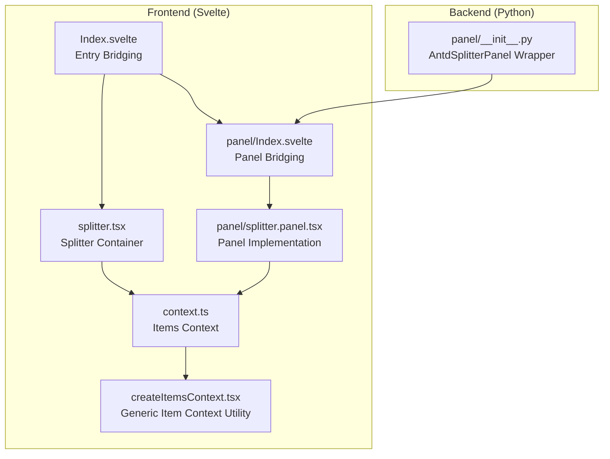
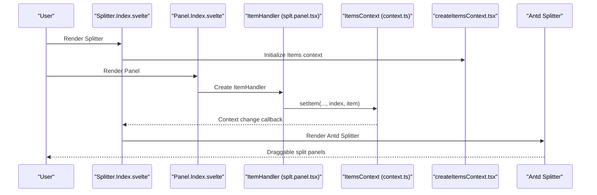
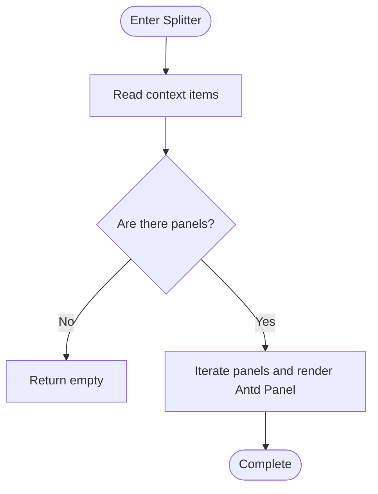
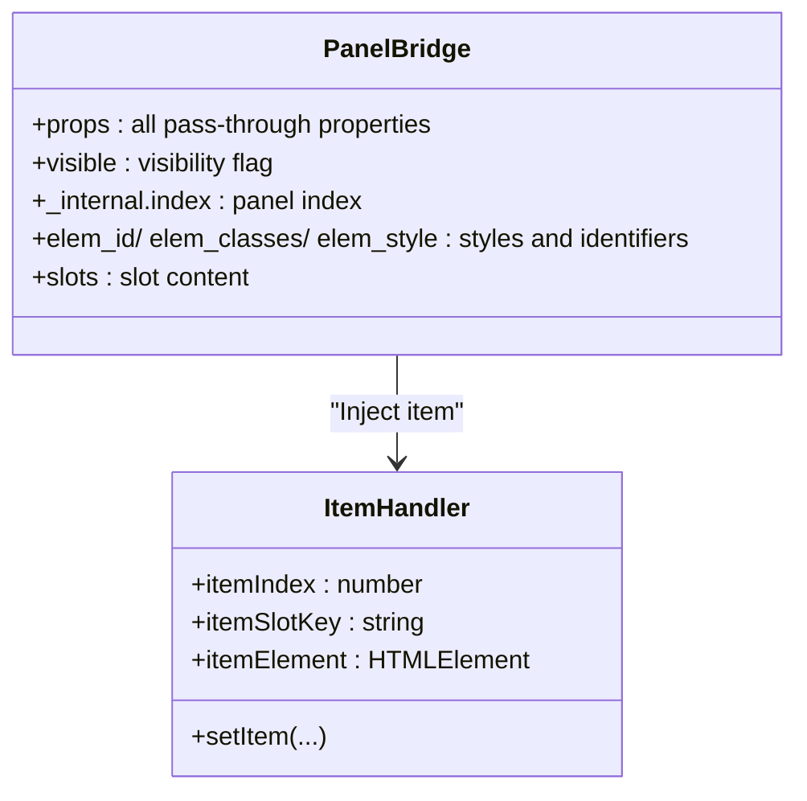
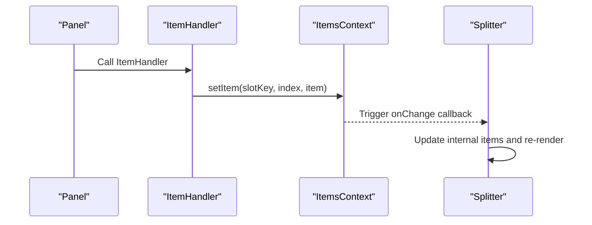
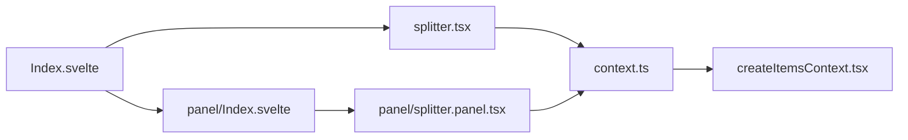

# Splitter

<cite>
**Files Referenced in This Document**
- [frontend/antd/splitter/Index.svelte](file://frontend/antd/splitter/Index.svelte)
- [frontend/antd/splitter/splitter.tsx](file://frontend/antd/splitter/splitter.tsx)
- [frontend/antd/splitter/panel/Index.svelte](file://frontend/antd/splitter/panel/Index.svelte)
- [frontend/antd/splitter/panel/splitter.panel.tsx](file://frontend/antd/splitter/panel/splitter.panel.tsx)
- [frontend/antd/splitter/context.ts](file://frontend/antd/splitter/context.ts)
- [frontend/utils/createItemsContext.tsx](file://frontend/utils/createItemsContext.tsx)
- [backend/modelscope_studio/components/antd/splitter/panel/__init__.py](file://backend/modelscope_studio/components/antd/splitter/panel/__init__.py)
- [docs/components/antd/splitter/README.md](file://docs/components/antd/splitter/README.md)
</cite>

## Table of Contents

1. [Introduction](#introduction)
2. [Project Structure](#project-structure)
3. [Core Components](#core-components)
4. [Architecture Overview](#architecture-overview)
5. [Detailed Component Analysis](#detailed-component-analysis)
6. [Dependency Analysis](#dependency-analysis)
7. [Performance Considerations](#performance-considerations)
8. [Troubleshooting Guide](#troubleshooting-guide)
9. [Conclusion](#conclusion)
10. [Appendix](#appendix)

## Introduction

Splitter is a panel-splitting component based on Ant Design that divides the interface into multiple resizable areas via drag handles. It supports both horizontal and vertical orientations and uses the Panel sub-component for declarative panel organization. The component is widely applicable to scenarios such as code editors (left-right layout), image comparison (left-right or top-bottom), and multi-view side-by-side displays.

This document provides a systematic explanation of the component's architecture design, data flow, drag-and-resize controls, responsive behavior, interaction experience, styling, and accessibility, along with typical usage examples and best practice recommendations.

## Project Structure

Splitter adopts a Svelte + React Slot bridging approach on the frontend, while the backend encapsulates properties and rendering logic via Python components. Key files are distributed as follows:

- Frontend entry and bridging: `frontend/antd/splitter/Index.svelte`
- Splitter container implementation: `frontend/antd/splitter/splitter.tsx`
- Panel sub-component bridging: `frontend/antd/splitter/panel/Index.svelte`
- Panel sub-component implementation: `frontend/antd/splitter/panel/splitter.panel.tsx`
- Context and item management: `frontend/antd/splitter/context.ts`, `frontend/utils/createItemsContext.tsx`
- Backend Panel component wrapper: `backend/modelscope_studio/components/antd/splitter/panel/__init__.py`
- Documentation and examples entry: `docs/components/antd/splitter/README.md`

Diagram Sources

- [frontend/antd/splitter/Index.svelte:1-71](file://frontend/antd/splitter/Index.svelte#L1-L71)
- [frontend/antd/splitter/splitter.tsx:1-38](file://frontend/antd/splitter/splitter.tsx#L1-L38)
- [frontend/antd/splitter/panel/Index.svelte:1-77](file://frontend/antd/splitter/panel/Index.svelte#L1-L77)
- [frontend/antd/splitter/panel/splitter.panel.tsx:1-14](file://frontend/antd/splitter/panel/splitter.panel.tsx#L1-L14)
- [frontend/antd/splitter/context.ts:1-7](file://frontend/antd/splitter/context.ts#L1-L7)
- [frontend/utils/createItemsContext.tsx:1-274](file://frontend/utils/createItemsContext.tsx#L1-L274)
- [backend/modelscope_studio/components/antd/splitter/panel/**init**.py:1-85](file://backend/modelscope_studio/components/antd/splitter/panel/__init__.py#L1-L85)

Section Sources

- [frontend/antd/splitter/Index.svelte:1-71](file://frontend/antd/splitter/Index.svelte#L1-L71)
- [frontend/antd/splitter/splitter.tsx:1-38](file://frontend/antd/splitter/splitter.tsx#L1-L38)
- [frontend/antd/splitter/panel/Index.svelte:1-77](file://frontend/antd/splitter/panel/Index.svelte#L1-L77)
- [frontend/antd/splitter/panel/splitter.panel.tsx:1-14](file://frontend/antd/splitter/panel/splitter.panel.tsx#L1-L14)
- [frontend/antd/splitter/context.ts:1-7](file://frontend/antd/splitter/context.ts#L1-L7)
- [frontend/utils/createItemsContext.tsx:1-274](file://frontend/utils/createItemsContext.tsx#L1-L274)
- [backend/modelscope_studio/components/antd/splitter/panel/**init**.py:1-85](file://backend/modelscope_studio/components/antd/splitter/panel/__init__.py#L1-L85)
- [docs/components/antd/splitter/README.md:1-8](file://docs/components/antd/splitter/README.md#L1-L8)

## Core Components

- Splitter Container: Receives the collection of child panels, renders the Ant Design split container, and maps each Panel to an Antd Panel child item.
- Panel Sub-component: Serves as the placeholder and rendering unit for each panel, collecting panel properties and slot content via the Items context and injecting them into Splitter.
- Items Context: Provides "item collection" capability, allowing Panel to inject its own properties and DOM content into Splitter during rendering.
- Backend Wrapper: Python-layer `AntdSplitterPanel` declares and passes properties such as default size, min/max size, collapsibility, and resizability.

Section Sources

- [frontend/antd/splitter/splitter.tsx:7-35](file://frontend/antd/splitter/splitter.tsx#L7-L35)
- [frontend/antd/splitter/panel/splitter.panel.tsx:7-11](file://frontend/antd/splitter/panel/splitter.panel.tsx#L7-L11)
- [frontend/antd/splitter/context.ts:3-4](file://frontend/antd/splitter/context.ts#L3-L4)
- [frontend/utils/createItemsContext.tsx:97-184](file://frontend/utils/createItemsContext.tsx#L97-L184)
- [backend/modelscope_studio/components/antd/splitter/panel/**init**.py:8-68](file://backend/modelscope_studio/components/antd/splitter/panel/__init__.py#L8-L68)

## Architecture Overview

The Splitter runtime flow is as follows:

- The Svelte entry bridging component loads the Splitter and Panel components;
- Panel writes its own properties and slot content to the Items context via ItemHandler;
- Splitter is wrapped with `withItemsContextProvider` and reads the collected panel list from the context;
- Finally, Ant Design's Splitter and Panel are rendered.

Diagram Sources

- [frontend/antd/splitter/Index.svelte:10-52](file://frontend/antd/splitter/Index.svelte#L10-L52)
- [frontend/antd/splitter/panel/Index.svelte:10-69](file://frontend/antd/splitter/panel/Index.svelte#L10-L69)
- [frontend/antd/splitter/panel/splitter.panel.tsx:7-11](file://frontend/antd/splitter/panel/splitter.panel.tsx#L7-L11)
- [frontend/antd/splitter/context.ts:3-4](file://frontend/antd/splitter/context.ts#L3-L4)
- [frontend/utils/createItemsContext.tsx:108-170](file://frontend/utils/createItemsContext.tsx#L108-L170)
- [frontend/antd/splitter/splitter.tsx:7-35](file://frontend/antd/splitter/splitter.tsx#L7-L35)

## Detailed Component Analysis

### Splitter Container Component

- Responsibility boundary: Maps collected panel items to Ant Design Panel elements and renders the split container.
- Key points:
  - Wrapped with `withItemsContextProvider` to ensure it can read `items` injected by Panels.
  - Renders slot content to the corresponding Panel via ReactSlot.
  - When no panels are present, nothing is rendered, avoiding layout issues caused by empty containers.

Diagram Sources

- [frontend/antd/splitter/splitter.tsx:8-35](file://frontend/antd/splitter/splitter.tsx#L8-L35)

Section Sources

- [frontend/antd/splitter/splitter.tsx:7-35](file://frontend/antd/splitter/splitter.tsx#L7-L35)

### Panel Sub-component

- Responsibility boundary: Serves as the placeholder and rendering unit for a single panel, responsible for injecting its own properties and slot content into the Items context.
- Key points:
  - Writes `itemIndex`, `itemSlotKey`, `itemElement`, and other information to the context via `ItemHandler`.
  - Supports `visible` for display control; supports additional property pass-through and style class binding.
  - Slot content is collected via the Svelte slot mechanism and rendered in Splitter as ReactSlot.

Diagram Sources

- [frontend/antd/splitter/panel/Index.svelte:25-69](file://frontend/antd/splitter/panel/Index.svelte#L25-L69)
- [frontend/antd/splitter/panel/splitter.panel.tsx:7-11](file://frontend/antd/splitter/panel/splitter.panel.tsx#L7-L11)
- [frontend/antd/splitter/context.ts:3-4](file://frontend/antd/splitter/context.ts#L3-L4)

Section Sources

- [frontend/antd/splitter/panel/Index.svelte:14-69](file://frontend/antd/splitter/panel/Index.svelte#L14-L69)
- [frontend/antd/splitter/panel/splitter.panel.tsx:7-11](file://frontend/antd/splitter/panel/splitter.panel.tsx#L7-L11)
- [frontend/antd/splitter/context.ts:3-4](file://frontend/antd/splitter/context.ts#L3-L4)

### Items Context and Item Collection Mechanism

- Purpose: Establishes an "item collection" channel in the component tree, enabling Panel to write its own properties and DOM content into Splitter.
- Key points:
  - `withItemsContextProvider`: Provides an `ItemsContextProvider` for the component tree, maintaining an `items` map and a `setItem` method.
  - `useItems`: Reads the `items` list within Splitter.
  - `ItemHandler`: Writes items during Panel rendering, supporting `itemProps`, `itemChildren`, and other extended capabilities.

Diagram Sources

- [frontend/utils/createItemsContext.tsx:108-170](file://frontend/utils/createItemsContext.tsx#L108-L170)
- [frontend/utils/createItemsContext.tsx:186-261](file://frontend/utils/createItemsContext.tsx#L186-L261)
- [frontend/antd/splitter/splitter.tsx:8-11](file://frontend/antd/splitter/splitter.tsx#L8-L11)

Section Sources

- [frontend/utils/createItemsContext.tsx:97-184](file://frontend/utils/createItemsContext.tsx#L97-L184)
- [frontend/utils/createItemsContext.tsx:186-261](file://frontend/utils/createItemsContext.tsx#L186-L261)
- [frontend/antd/splitter/context.ts:3-4](file://frontend/antd/splitter/context.ts#L3-L4)

### Backend Wrapper and Property Passing

- `AntdSplitterPanel` provides the following key properties (from the Python wrapper):
  - `default_size`: Default panel size
  - `min` / `max`: Minimum/maximum size
  - `size`: Current size
  - `collapsible`: Whether the panel is collapsible
  - `resizable`: Whether the panel is resizable
  - `elem_id` / `elem_classes` / `elem_style`: Styles and identifiers
- These properties are passed through the Svelte bridging layer to frontend components, ultimately affecting the behavior and appearance of Ant Design Splitter.

Section Sources

- [backend/modelscope_studio/components/antd/splitter/panel/**init**.py:8-68](file://backend/modelscope_studio/components/antd/splitter/panel/__init__.py#L8-L68)

## Dependency Analysis

- Component coupling:
  - Splitter depends on the Items context to obtain the panel collection.
  - Panel depends on the Items context via ItemHandler to write its own item.
  - The frontend bridging layer (Index.svelte) is responsible for passing properties and slots to React components.
- External dependencies:
  - Ant Design's Splitter/Panel interface.
  - Svelte Preprocess React toolchain (`sveltify`, `ReactSlot`, `processProps`, etc.).
- Potential circular dependencies:
  - Decoupled through context and callbacks to avoid circular references caused by direct mutual referencing.

Diagram Sources

- [frontend/antd/splitter/Index.svelte:10-52](file://frontend/antd/splitter/Index.svelte#L10-L52)
- [frontend/antd/splitter/splitter.tsx:5-6](file://frontend/antd/splitter/splitter.tsx#L5-L6)
- [frontend/antd/splitter/panel/Index.svelte:10-11](file://frontend/antd/splitter/panel/Index.svelte#L10-L11)
- [frontend/antd/splitter/panel/splitter.panel.tsx:5-5](file://frontend/antd/splitter/panel/splitter.panel.tsx#L5-L5)
- [frontend/antd/splitter/context.ts:3-4](file://frontend/antd/splitter/context.ts#L3-L4)
- [frontend/utils/createItemsContext.tsx:1-274](file://frontend/utils/createItemsContext.tsx#L1-L274)

Section Sources

- [frontend/antd/splitter/Index.svelte:1-71](file://frontend/antd/splitter/Index.svelte#L1-L71)
- [frontend/antd/splitter/splitter.tsx:1-38](file://frontend/antd/splitter/splitter.tsx#L1-L38)
- [frontend/antd/splitter/panel/Index.svelte:1-77](file://frontend/antd/splitter/panel/Index.svelte#L1-L77)
- [frontend/antd/splitter/panel/splitter.panel.tsx:1-14](file://frontend/antd/splitter/panel/splitter.panel.tsx#L1-L14)
- [frontend/antd/splitter/context.ts:1-7](file://frontend/antd/splitter/context.ts#L1-L7)
- [frontend/utils/createItemsContext.tsx:1-274](file://frontend/utils/createItemsContext.tsx#L1-L274)

## Performance Considerations

- Rendering strategy
  - Splitter only renders the container when panels are present, avoiding the overhead of empty renders.
  - `useMemoizedEqualValue` and `useMemoizedFn` reduce context update frequency and repeated renders.
- Events and state
  - `setItem` and `onChange` are triggered only when values change, reducing unnecessary re-renders.
- Recommendations
  - For scenarios with many panels or frequent size adjustments, limit the number of panels and update frequency.
  - Set reasonable min/max sizes to avoid reflow jitter caused by extreme sizes.

Section Sources

- [frontend/antd/splitter/splitter.tsx:15-31](file://frontend/antd/splitter/splitter.tsx#L15-L31)
- [frontend/utils/createItemsContext.tsx:113-153](file://frontend/utils/createItemsContext.tsx#L113-L153)
- [frontend/utils/createItemsContext.tsx:234-254](file://frontend/utils/createItemsContext.tsx#L234-L254)

## Troubleshooting Guide

- Panel not displaying
  - Check whether Panel's `visible` is true; confirm that the bridging layer has correctly passed `visible`.
  - Confirm whether Panel has successfully written to the Items context (check `setItem` calls and indices).
- Drag not working
  - Confirm that `resizable` and resizable direction settings are correct; check Ant Design version and whether styles are complete.
- Size anomalies
  - Check whether `min`/`max` and `default_size` settings are reasonable; avoid setting them to 0 or negative values.
- Slot content not rendering
  - Confirm that Panel's slot bindings are consistent with ReactSlot usage; avoid premature slot destruction.

Section Sources

- [frontend/antd/splitter/panel/Index.svelte:52-69](file://frontend/antd/splitter/panel/Index.svelte#L52-L69)
- [frontend/antd/splitter/splitter.tsx:14-31](file://frontend/antd/splitter/splitter.tsx#L14-L31)
- [backend/modelscope_studio/components/antd/splitter/panel/**init**.py:62-66](file://backend/modelscope_studio/components/antd/splitter/panel/__init__.py#L62-L66)

## Conclusion

Splitter achieves flexible panel organization and rendering through the Items context and Svelte/React bridging. Its core strengths are:

- User-facing declarative API (Panel sub-component)
- Deep integration with Ant Design (drag, direction, size control)
- Extensible item collection mechanism (supports dynamic add/remove/update)

In practice, it is recommended to set reasonable size constraints and interaction behaviors based on business scenarios, with attention to performance and maintainability.

## Appendix

### Configuration and Property Reference

- Splitter Container
  - Direction: Controlled by Ant Design's direction property (horizontal/vertical)
  - Drag: Provided by Ant Design's drag capability
  - Events: `resizeStart`/`resizeEnd` (mapped via bridging layer)
- Panel Sub-component
  - `default_size` / `size`: Default/current size
  - `min` / `max`: Minimum/maximum size
  - `collapsible` / `resizable`: Collapsible/resizable
  - `elem_id` / `elem_classes` / `elem_style`: Styles and identifiers
  - `visible`: Visibility flag

Section Sources

- [frontend/antd/splitter/Index.svelte:25-52](file://frontend/antd/splitter/Index.svelte#L25-L52)
- [frontend/antd/splitter/splitter.tsx:16-30](file://frontend/antd/splitter/splitter.tsx#L16-L30)
- [backend/modelscope_studio/components/antd/splitter/panel/**init**.py:61-66](file://backend/modelscope_studio/components/antd/splitter/panel/__init__.py#L61-L66)

### Application Scenario Examples

- Code editor: File tree/outline on the left, code editing area on the right, with left-right drag to adjust width.
- Image comparison: Two images arranged left-right or top-bottom, with drag to adjust the ratio.
- Multi-view display: Three-column layout (left/center/right), center as main view, sides as tool/preview panels.

Section Sources

- [docs/components/antd/splitter/README.md:1-8](file://docs/components/antd/splitter/README.md#L1-L8)

### Responsive Behavior and Interaction Experience

- Responsive behavior: Adapts panel ratios based on container width/height; it is recommended to enable collapsibility on small-screen devices.
- Interaction experience: Provides visual feedback during dragging; set reasonable minimum sizes to avoid accidental triggers.

Section Sources

- [backend/modelscope_studio/components/antd/splitter/panel/**init**.py:14-16](file://backend/modelscope_studio/components/antd/splitter/panel/__init__.py#L14-L16)

### Style Customization and Accessibility

- Style customization: Inject custom styles via `elem_classes` and `elem_style`; note compatibility with Ant Design default styles.
- Animation effects: Combine CSS transitions or third-party animation libraries for smooth size switching.
- Accessibility: Provide accessible labels and keyboard operation hints for drag handles; ensure collapsible states have clear ARIA attributes.

Section Sources

- [frontend/antd/splitter/panel/Index.svelte:54-55](file://frontend/antd/splitter/panel/Index.svelte#L54-L55)
- [frontend/antd/splitter/splitter.tsx:16-30](file://frontend/antd/splitter/splitter.tsx#L16-L30)
