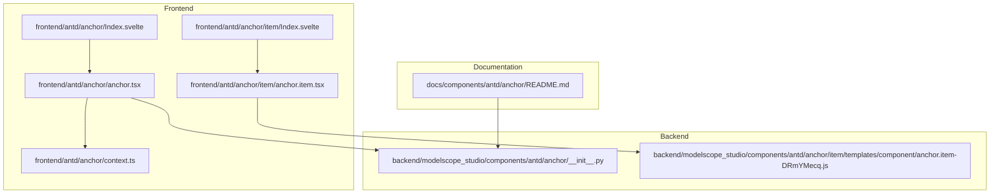
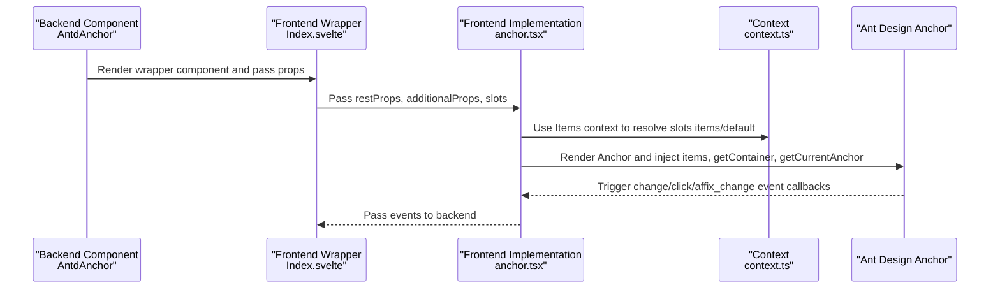
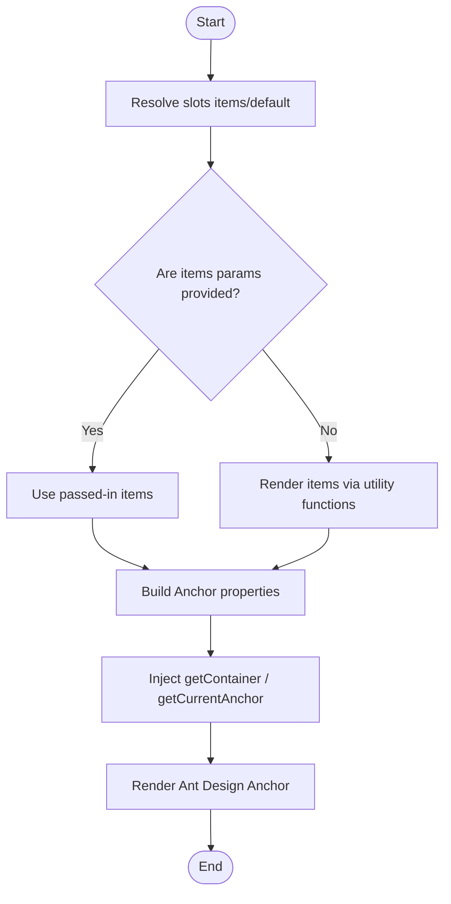
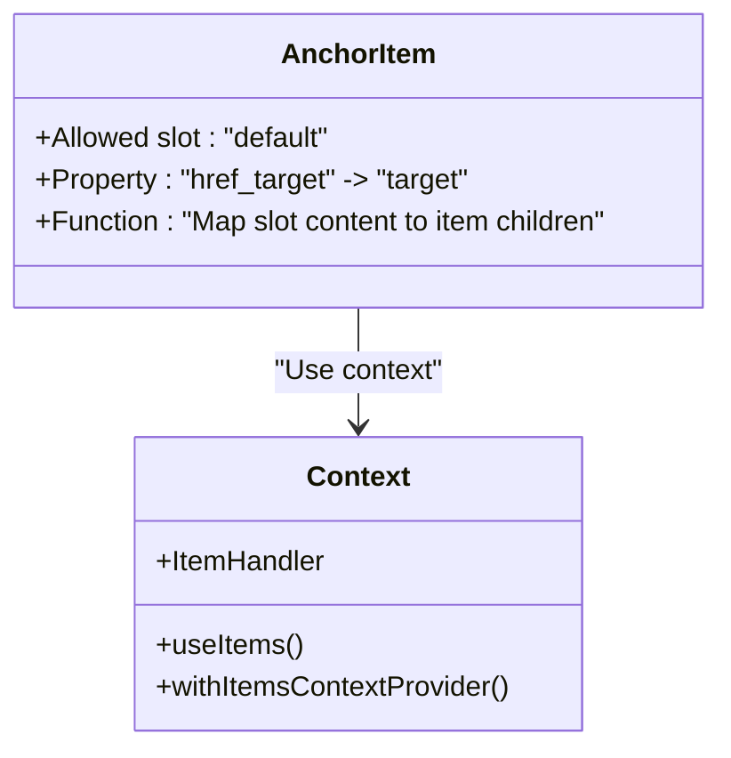
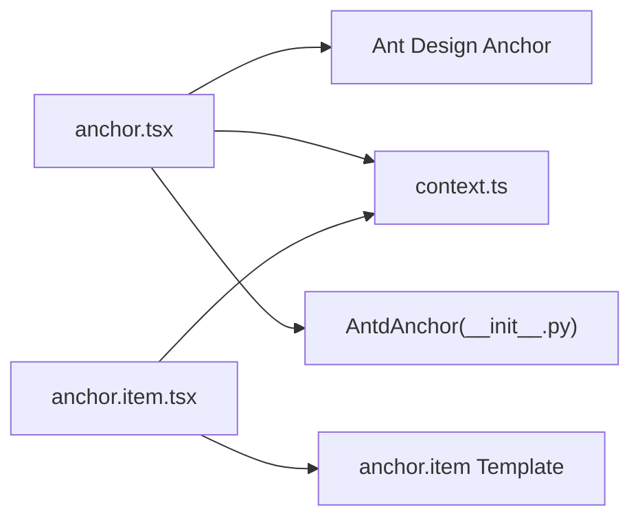

# Anchor

<cite>
**Files Referenced in This Document**
- [frontend/antd/anchor/Index.svelte](file://frontend/antd/anchor/Index.svelte)
- [frontend/antd/anchor/anchor.tsx](file://frontend/antd/anchor/anchor.tsx)
- [frontend/antd/anchor/context.ts](file://frontend/antd/anchor/context.ts)
- [frontend/antd/anchor/item/Index.svelte](file://frontend/antd/anchor/item/Index.svelte)
- [frontend/antd/anchor/item/anchor.item.tsx](file://frontend/antd/anchor/item/anchor.item.tsx)
- [backend/modelscope_studio/components/antd/anchor/__init__.py](file://backend/modelscope_studio/components/antd/anchor/__init__.py)
- [backend/modelscope_studio/components/antd/anchor/item/templates/component/anchor.item-DRmYMecq.js](file://backend/modelscope_studio/components/antd/anchor/item/templates/component/anchor.item-DRmYMecq.js)
- [docs/components/antd/anchor/README.md](file://docs/components/antd/anchor/README.md)
- [backend/modelscope_studio/utils/dev/component.py](file://backend/modelscope_studio/utils/dev/component.py)
</cite>

## Table of Contents

1. [Introduction](#introduction)
2. [Project Structure](#project-structure)
3. [Core Components](#core-components)
4. [Architecture Overview](#architecture-overview)
5. [Detailed Component Analysis](#detailed-component-analysis)
6. [Dependency Analysis](#dependency-analysis)
7. [Performance Considerations](#performance-considerations)
8. [Troubleshooting Guide](#troubleshooting-guide)
9. [Conclusion](#conclusion)
10. [Appendix](#appendix)

## Introduction

The Anchor component provides clickable navigation links within a single page, supporting scroll-based positioning to corresponding headings or sections, and can be combined with fixed mode (Affix) to remain visible while the page scrolls. This component is a wrapper around Ant Design's Anchor component and provides the following capabilities:

- Scroll positioning: Smooth or direct scrolling to target positions of anchor items
- Link generation: Supports dynamically generating anchor items via an `items` list or slots
- Active state management: Automatically highlights anchor items currently in the viewport
- Nested structure: Anchor items support nesting to form hierarchical navigation
- Events and extensions: Supports `change`, `click`, and `affix_change` event bindings, as well as Affix fixed mode

## Project Structure

The Anchor component consists of a frontend Svelte wrapper layer and a backend Gradio component layer, along with an anchor item sub-component to support nesting and slot rendering.

Diagram Sources

- [frontend/antd/anchor/Index.svelte:1-66](file://frontend/antd/anchor/Index.svelte#L1-L66)
- [frontend/antd/anchor/anchor.tsx:1-46](file://frontend/antd/anchor/anchor.tsx#L1-L46)
- [frontend/antd/anchor/context.ts:1-7](file://frontend/antd/anchor/context.ts#L1-L7)
- [frontend/antd/anchor/item/Index.svelte:1-75](file://frontend/antd/anchor/item/Index.svelte#L1-L75)
- [frontend/antd/anchor/item/anchor.item.tsx:1-22](file://frontend/antd/anchor/item/anchor.item.tsx#L1-L22)
- [backend/modelscope_studio/components/antd/anchor/**init**.py:1-117](file://backend/modelscope_studio/components/antd/anchor/__init__.py#L1-L117)
- [backend/modelscope_studio/components/antd/anchor/item/templates/component/anchor.item-DRmYMecq.js:1-450](file://backend/modelscope_studio/components/antd/anchor/item/templates/component/anchor.item-DRmYMecq.js#L1-L450)
- [docs/components/antd/anchor/README.md:1-8](file://docs/components/antd/anchor/README.md#L1-L8)

Section Sources

- [frontend/antd/anchor/Index.svelte:1-66](file://frontend/antd/anchor/Index.svelte#L1-L66)
- [frontend/antd/anchor/anchor.tsx:1-46](file://frontend/antd/anchor/anchor.tsx#L1-L46)
- [frontend/antd/anchor/context.ts:1-7](file://frontend/antd/anchor/context.ts#L1-L7)
- [frontend/antd/anchor/item/Index.svelte:1-75](file://frontend/antd/anchor/item/Index.svelte#L1-L75)
- [frontend/antd/anchor/item/anchor.item.tsx:1-22](file://frontend/antd/anchor/item/anchor.item.tsx#L1-L22)
- [backend/modelscope_studio/components/antd/anchor/**init**.py:1-117](file://backend/modelscope_studio/components/antd/anchor/__init__.py#L1-L117)
- [backend/modelscope_studio/components/antd/anchor/item/templates/component/anchor.item-DRmYMecq.js:1-450](file://backend/modelscope_studio/components/antd/anchor/item/templates/component/anchor.item-DRmYMecq.js#L1-L450)
- [docs/components/antd/anchor/README.md:1-8](file://docs/components/antd/anchor/README.md#L1-L8)

## Core Components

- Top-level Anchor component (AntdAnchor)
  - Receives an `items` list or slot children, converting them to the items structure required by Ant Design Anchor
  - Supports `affix`, `bounds`, `offsetTop`, `direction`, `replace`, `rootClassName`, and other properties
  - Provides `change`, `click`, and `affix_change` event binding entry points
- Anchor item component (AntdAnchorItem)
  - Acts as the container for anchor items, supporting default slot content rendering
  - Collaborates with the parent anchor component via the context system to achieve nesting and hierarchical display

Section Sources

- [backend/modelscope_studio/components/antd/anchor/**init**.py:11-117](file://backend/modelscope_studio/components/antd/anchor/__init__.py#L11-L117)
- [frontend/antd/anchor/anchor.tsx:1-46](file://frontend/antd/anchor/anchor.tsx#L1-L46)
- [frontend/antd/anchor/context.ts:1-7](file://frontend/antd/anchor/context.ts#L1-L7)
- [frontend/antd/anchor/item/Index.svelte:1-75](file://frontend/antd/anchor/item/Index.svelte#L1-L75)
- [frontend/antd/anchor/item/anchor.item.tsx:1-22](file://frontend/antd/anchor/item/anchor.item.tsx#L1-L22)

## Architecture Overview

The following diagram shows the call chain from the backend Gradio component to the frontend Svelte/React wrapper layer and on to Ant Design Anchor, as well as the event and slot passing process.

Diagram Sources

- [frontend/antd/anchor/Index.svelte:1-66](file://frontend/antd/anchor/Index.svelte#L1-L66)
- [frontend/antd/anchor/anchor.tsx:1-46](file://frontend/antd/anchor/anchor.tsx#L1-L46)
- [frontend/antd/anchor/context.ts:1-7](file://frontend/antd/anchor/context.ts#L1-L7)
- [backend/modelscope_studio/components/antd/anchor/**init**.py:11-33](file://backend/modelscope_studio/components/antd/anchor/__init__.py#L11-L33)

## Detailed Component Analysis

### Top-level Anchor Component (AntdAnchor)

- Feature highlights
  - Receives an `items` list or slot children; internally converts slots to items via utility functions
  - Supports `getContainer` and `getCurrentAnchor` for custom container and current anchor determination logic
  - Provides Affix fixed mode, `bounds` boundary distance, `offsetTop` top offset, `direction`, `replace` history replacement, and other configurations
  - Events: `change` (anchor changed), `click` (clicked), `affix_change` (fixed state changed)
- Data flow
  - Slots `items/default` → context resolution → Ant Design Anchor items
  - `getContainer`/`getCurrentAnchor` are passed to Ant Design Anchor after being wrapped with `useFunction`
- Applicable scenarios
  - Document tables of contents, long-list navigation, help centers, product introduction pages, and other scenarios requiring quick jumping

Diagram Sources

- [frontend/antd/anchor/anchor.tsx:13-42](file://frontend/antd/anchor/anchor.tsx#L13-L42)

Section Sources

- [frontend/antd/anchor/anchor.tsx:1-46](file://frontend/antd/anchor/anchor.tsx#L1-L46)
- [backend/modelscope_studio/components/antd/anchor/**init**.py:38-98](file://backend/modelscope_studio/components/antd/anchor/__init__.py#L38-L98)

### Anchor Item Component (AntdAnchorItem)

- Feature highlights
  - Acts as the container for anchor items, supporting default slot content rendering
  - Maps slot content to AntdAnchor item children via `ItemHandler`
  - Supports `href_target` property mapped to `target` attribute, for controlling link opening behavior
- Nested structure
  - Cooperates with the parent via `createItemsContext` to support multi-level nested anchor items
- Applicable scenarios
  - Grouping and hierarchically displaying sections in complex documents

Diagram Sources

- [frontend/antd/anchor/item/anchor.item.tsx:1-22](file://frontend/antd/anchor/item/anchor.item.tsx#L1-L22)
- [frontend/antd/anchor/context.ts:1-7](file://frontend/antd/anchor/context.ts#L1-L7)

Section Sources

- [frontend/antd/anchor/item/Index.svelte:1-75](file://frontend/antd/anchor/item/Index.svelte#L1-L75)
- [frontend/antd/anchor/item/anchor.item.tsx:1-22](file://frontend/antd/anchor/item/anchor.item.tsx#L1-L22)
- [backend/modelscope_studio/components/antd/anchor/item/templates/component/anchor.item-DRmYMecq.js:437-449](file://backend/modelscope_studio/components/antd/anchor/item/templates/component/anchor.item-DRmYMecq.js#L437-L449)

### Events and Lifecycle

- `change`: Triggered when the currently active anchor changes
- `click`: Triggered when an anchor link is clicked
- `affix_change`: Triggered when the Affix fixed mode state changes
- Lifecycle: The component updates the layout marker when it exits scope, ensuring correct render ordering

Section Sources

- [backend/modelscope_studio/components/antd/anchor/**init**.py:20-33](file://backend/modelscope_studio/components/antd/anchor/__init__.py#L20-L33)
- [backend/modelscope_studio/utils/dev/component.py:24-26](file://backend/modelscope_studio/utils/dev/component.py#L24-L26)

## Dependency Analysis

- The frontend wrapper layer depends on Ant Design Anchor, bridged via `sveltify` and `withItemsContextProvider`
- The slot system implements parent-child component communication via `createItemsContext`, supporting both `items` and `default` slots
- The backend component inherits from `ModelScopeLayoutComponent`, providing unified layout and event binding capabilities

Diagram Sources

- [frontend/antd/anchor/anchor.tsx:1-46](file://frontend/antd/anchor/anchor.tsx#L1-L46)
- [frontend/antd/anchor/context.ts:1-7](file://frontend/antd/anchor/context.ts#L1-L7)
- [frontend/antd/anchor/item/anchor.item.tsx:1-22](file://frontend/antd/anchor/item/anchor.item.tsx#L1-L22)
- [backend/modelscope_studio/components/antd/anchor/**init**.py:1-117](file://backend/modelscope_studio/components/antd/anchor/__init__.py#L1-L117)
- [backend/modelscope_studio/components/antd/anchor/item/templates/component/anchor.item-DRmYMecq.js:1-450](file://backend/modelscope_studio/components/antd/anchor/item/templates/component/anchor.item-DRmYMecq.js#L1-L450)

Section Sources

- [frontend/antd/anchor/anchor.tsx:1-46](file://frontend/antd/anchor/anchor.tsx#L1-L46)
- [frontend/antd/anchor/context.ts:1-7](file://frontend/antd/anchor/context.ts#L1-L7)
- [frontend/antd/anchor/item/anchor.item.tsx:1-22](file://frontend/antd/anchor/item/anchor.item.tsx#L1-L22)
- [backend/modelscope_studio/components/antd/anchor/**init**.py:1-117](file://backend/modelscope_studio/components/antd/anchor/__init__.py#L1-L117)
- [backend/modelscope_studio/components/antd/anchor/item/templates/component/anchor.item-DRmYMecq.js:1-450](file://backend/modelscope_studio/components/antd/anchor/item/templates/component/anchor.item-DRmYMecq.js#L1-L450)

## Performance Considerations

- items rendering optimization
  - Use `useMemo` to cache items computation results, avoiding unnecessary re-renders
  - Prefer passing the `items` parameter rather than relying on slots to reduce slot resolution costs
- Function wrapping
  - Wrap `getContainer`/`getCurrentAnchor` with `useFunction` to ensure callbacks are stable and reusable
- Scroll monitoring
  - Set `bounds` and `offsetTop` reasonably to avoid frequent `change` event triggers
  - For large documents, consider using `replace` to replace history records, reducing memory usage
- Fixed mode (Affix)
  - Affix mode keeps the component visible during scrolling; pay attention to container selection and z-index relationships to avoid occlusion

## Troubleshooting Guide

- Anchor not working
  - Check whether `getContainer` points to the correct scroll container; if not set, the viewport may not be calculated correctly
  - Confirm the target element exists and has the corresponding anchor identifier
- Active state not updating
  - Check whether `bounds` and `offsetTop` settings are reasonable; too small a boundary may cause delayed switching
  - Confirm the `getCurrentAnchor` return value matches the `key` or `href` in `items`
- Link opening behavior abnormal
  - `href_target` maps to `target`; confirm whether it needs to open in a new window or the current window
- Events not triggering
  - Confirm event bindings are enabled (`bind_change_event`, `bind_click_event`, `bind_affix_change_event`)
  - Check whether state changes in Affix mode behave as expected

Section Sources

- [frontend/antd/anchor/anchor.tsx:13-42](file://frontend/antd/anchor/anchor.tsx#L13-L42)
- [backend/modelscope_studio/components/antd/anchor/**init**.py:20-33](file://backend/modelscope_studio/components/antd/anchor/__init__.py#L20-L33)

## Conclusion

The Anchor component provides flexible anchor navigation capabilities through frontend-backend collaboration. Its core strengths are:

- Dual-channel anchor item generation via `items` and slots, meeting different scenario needs
- Deep integration with Ant Design Anchor, with comprehensive scroll positioning and active state management
- A complete event system that facilitates extended interactions and analytics tracking
- Support for nested structure and fixed mode, suitable for complex documents and long-page navigation

## Appendix

- Usage examples and documentation
  - Refer to basic examples in the documentation for fundamental usage and parameter descriptions
- Common issues
  - If the page has multiple scroll containers, explicitly specify `getContainer`
  - For large documents, consider enabling `replace` to optimize history management
  - To customize highlight strategy, use `getCurrentAnchor` for customization

Section Sources

- [docs/components/antd/anchor/README.md:1-8](file://docs/components/antd/anchor/README.md#L1-L8)
