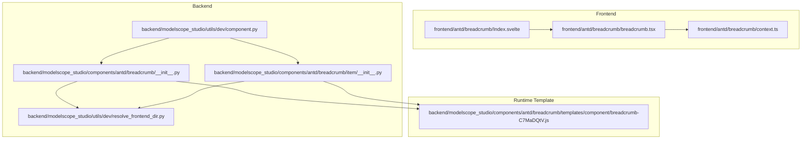
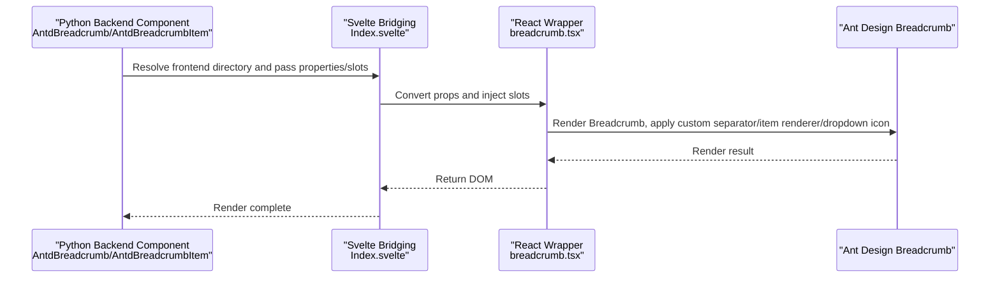
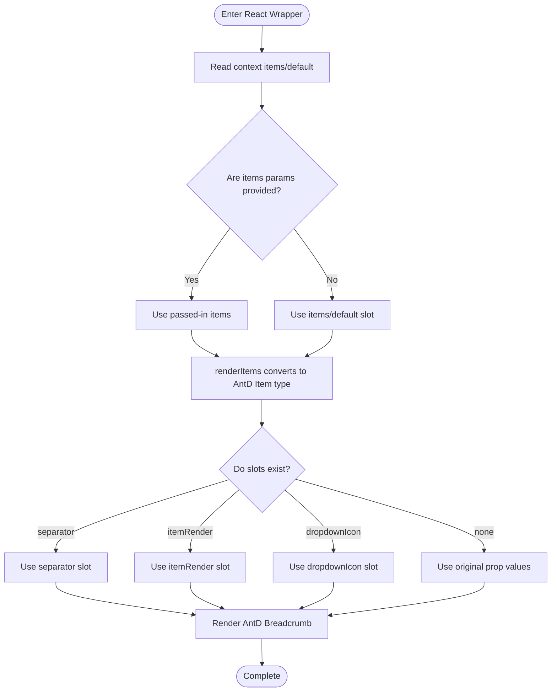
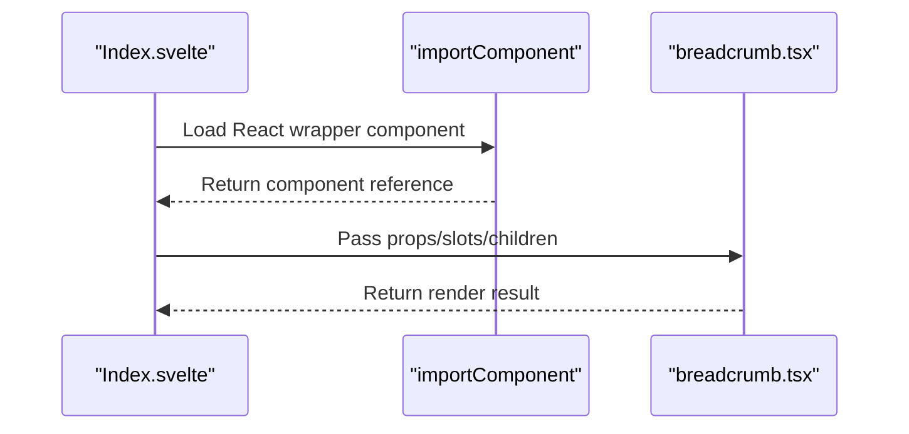
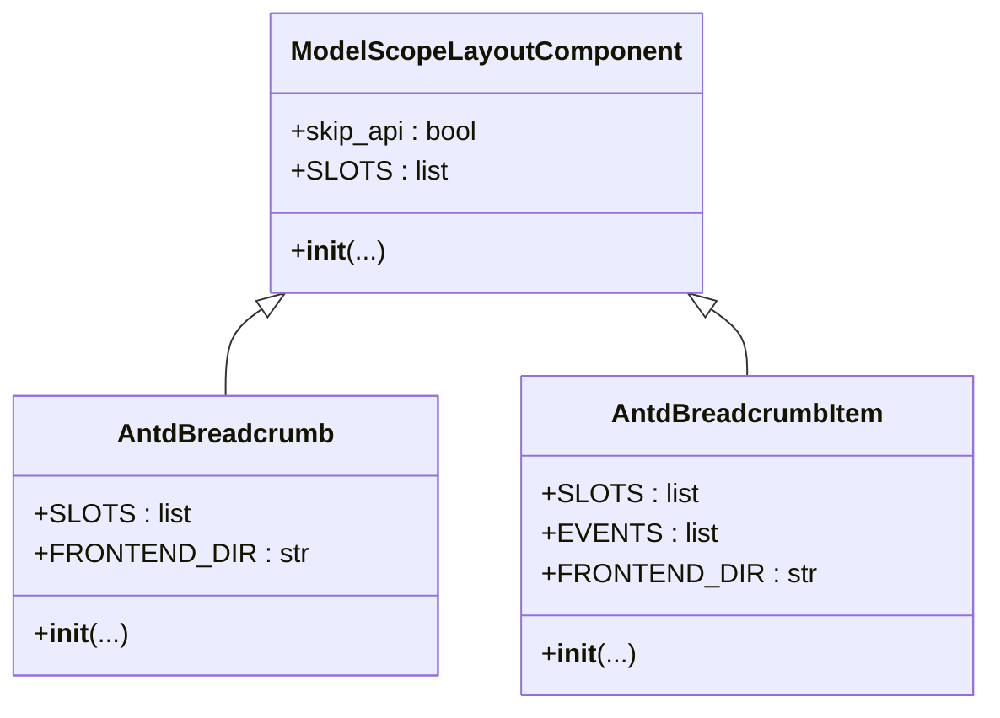
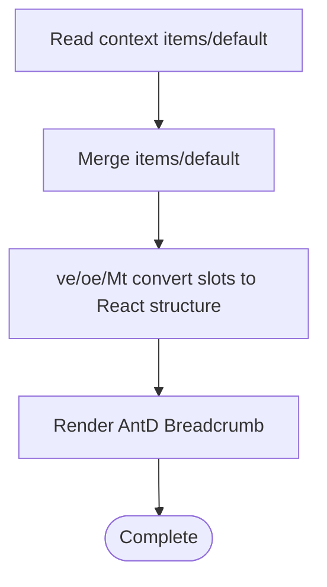
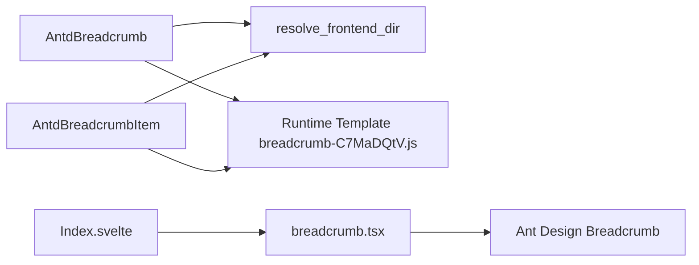

# Breadcrumb

<cite>
**Files Referenced in This Document**
- [frontend/antd/breadcrumb/breadcrumb.tsx](file://frontend/antd/breadcrumb/breadcrumb.tsx)
- [frontend/antd/breadcrumb/context.ts](file://frontend/antd/breadcrumb/context.ts)
- [frontend/antd/breadcrumb/Index.svelte](file://frontend/antd/breadcrumb/Index.svelte)
- [backend/modelscope_studio/components/antd/breadcrumb/__init__.py](file://backend/modelscope_studio/components/antd/breadcrumb/__init__.py)
- [backend/modelscope_studio/components/antd/breadcrumb/item/__init__.py](file://backend/modelscope_studio/components/antd/breadcrumb/item/__init__.py)
- [backend/modelscope_studio/utils/dev/component.py](file://backend/modelscope_studio/utils/dev/component.py)
- [backend/modelscope_studio/utils/dev/resolve_frontend_dir.py](file://backend/modelscope_studio/utils/dev/resolve_frontend_dir.py)
- [docs/components/antd/breadcrumb/README.md](file://docs/components/antd/breadcrumb/README.md)
- [docs/components/antd/breadcrumb/README-zh_CN.md](file://docs/components/antd/breadcrumb/README-zh_CN.md)
- [backend/modelscope_studio/components/antd/breadcrumb/templates/component/breadcrumb-C7MaDQtV.js](file://backend/modelscope_studio/components/antd/breadcrumb/templates/component/breadcrumb-C7MaDQtV.js)
</cite>

## Table of Contents

1. [Introduction](#introduction)
2. [Project Structure](#project-structure)
3. [Core Components](#core-components)
4. [Architecture Overview](#architecture-overview)
5. [Detailed Component Analysis](#detailed-component-analysis)
6. [Dependency Analysis](#dependency-analysis)
7. [Performance Considerations](#performance-considerations)
8. [Troubleshooting Guide](#troubleshooting-guide)
9. [Conclusion](#conclusion)
10. [Appendix: Usage Examples and Best Practices](#appendix-usage-examples-and-best-practices)

## Introduction

The Breadcrumb component displays the current location within a hierarchical structure and allows users to return to previous states. The breadcrumb component in this repository is based on Ant Design's Breadcrumb implementation, wrapped via React and bridged to the Svelte frontend, while also providing a Python backend component to support layout and event binding in the Gradio ecosystem. The component supports:

- Navigation path display and click-to-navigate
- Custom separators and rendering of each breadcrumb item
- Advanced interactions such as dropdown menus and overflow indicators
- Dynamic path generation and permission control when integrating with routing systems
- Multi-language and theme style customization

## Project Structure

The Breadcrumb component consists of a frontend React wrapper layer, a Svelte bridging layer, a backend Gradio component layer, and a runtime template, organized as follows:

Diagram Sources

- [frontend/antd/breadcrumb/Index.svelte:1-78](file://frontend/antd/breadcrumb/Index.svelte#L1-L78)
- [frontend/antd/breadcrumb/breadcrumb.tsx:1-67](file://frontend/antd/breadcrumb/breadcrumb.tsx#L1-L67)
- [frontend/antd/breadcrumb/context.ts:1-7](file://frontend/antd/breadcrumb/context.ts#L1-L7)
- [backend/modelscope_studio/components/antd/breadcrumb/**init**.py:1-73](file://backend/modelscope_studio/components/antd/breadcrumb/__init__.py#L1-L73)
- [backend/modelscope_studio/components/antd/breadcrumb/item/**init**.py:1-114](file://backend/modelscope_studio/components/antd/breadcrumb/item/__init__.py#L1-L114)
- [backend/modelscope_studio/utils/dev/component.py:1-169](file://backend/modelscope_studio/utils/dev/component.py#L1-L169)
- [backend/modelscope_studio/utils/dev/resolve_frontend_dir.py:1-17](file://backend/modelscope_studio/utils/dev/resolve_frontend_dir.py#L1-L17)
- [backend/modelscope_studio/components/antd/breadcrumb/templates/component/breadcrumb-C7MaDQtV.js:1-766](file://backend/modelscope_studio/components/antd/breadcrumb/templates/component/breadcrumb-C7MaDQtV.js#L1-L766)

Section Sources

- [frontend/antd/breadcrumb/Index.svelte:1-78](file://frontend/antd/breadcrumb/Index.svelte#L1-L78)
- [frontend/antd/breadcrumb/breadcrumb.tsx:1-67](file://frontend/antd/breadcrumb/breadcrumb.tsx#L1-L67)
- [frontend/antd/breadcrumb/context.ts:1-7](file://frontend/antd/breadcrumb/context.ts#L1-L7)
- [backend/modelscope_studio/components/antd/breadcrumb/**init**.py:1-73](file://backend/modelscope_studio/components/antd/breadcrumb/__init__.py#L1-L73)
- [backend/modelscope_studio/components/antd/breadcrumb/item/**init**.py:1-114](file://backend/modelscope_studio/components/antd/breadcrumb/item/__init__.py#L1-L114)
- [backend/modelscope_studio/utils/dev/component.py:1-169](file://backend/modelscope_studio/utils/dev/component.py#L1-L169)
- [backend/modelscope_studio/utils/dev/resolve_frontend_dir.py:1-17](file://backend/modelscope_studio/utils/dev/resolve_frontend_dir.py#L1-L17)
- [backend/modelscope_studio/components/antd/breadcrumb/templates/component/breadcrumb-C7MaDQtV.js:1-766](file://backend/modelscope_studio/components/antd/breadcrumb/templates/component/breadcrumb-C7MaDQtV.js#L1-L766)

## Core Components

- Frontend React wrapper: Connects Ant Design's Breadcrumb with the Slots rendering system, supporting custom separators, item renderer functions, and dropdown icons.
- Svelte bridging: Converts backend-provided properties and slots into frontend-consumable props, and imports React components as needed.
- Backend components: Provides `AntdBreadcrumb` and `AntdBreadcrumbItem`, supporting event bindings, slots, and frontend directory resolution.
- Runtime template: Contains the actual React component implementation and slot handling logic.

Section Sources

- [frontend/antd/breadcrumb/breadcrumb.tsx:1-67](file://frontend/antd/breadcrumb/breadcrumb.tsx#L1-L67)
- [frontend/antd/breadcrumb/Index.svelte:1-78](file://frontend/antd/breadcrumb/Index.svelte#L1-L78)
- [backend/modelscope_studio/components/antd/breadcrumb/**init**.py:1-73](file://backend/modelscope_studio/components/antd/breadcrumb/__init__.py#L1-L73)
- [backend/modelscope_studio/components/antd/breadcrumb/item/**init**.py:1-114](file://backend/modelscope_studio/components/antd/breadcrumb/item/__init__.py#L1-L114)
- [backend/modelscope_studio/components/antd/breadcrumb/templates/component/breadcrumb-C7MaDQtV.js:1-766](file://backend/modelscope_studio/components/antd/breadcrumb/templates/component/breadcrumb-C7MaDQtV.js#L1-L766)

## Architecture Overview

The Breadcrumb component call chain from backend to frontend is as follows:

Diagram Sources

- [frontend/antd/breadcrumb/Index.svelte:1-78](file://frontend/antd/breadcrumb/Index.svelte#L1-L78)
- [frontend/antd/breadcrumb/breadcrumb.tsx:1-67](file://frontend/antd/breadcrumb/breadcrumb.tsx#L1-L67)
- [backend/modelscope_studio/components/antd/breadcrumb/**init**.py:1-73](file://backend/modelscope_studio/components/antd/breadcrumb/__init__.py#L1-L73)
- [backend/modelscope_studio/components/antd/breadcrumb/item/**init**.py:1-114](file://backend/modelscope_studio/components/antd/breadcrumb/item/__init__.py#L1-L114)
- [backend/modelscope_studio/components/antd/breadcrumb/templates/component/breadcrumb-C7MaDQtV.js:1-766](file://backend/modelscope_studio/components/antd/breadcrumb/templates/component/breadcrumb-C7MaDQtV.js#L1-L766)

## Detailed Component Analysis

### Frontend React Wrapper (breadcrumb.tsx)

- Key points
  - Uses `sveltify` to bridge the Svelte component to React.
  - Provides breadcrumb item context via `withItemsContextProvider`.
  - Supports slots: `separator`, `itemRender`, `dropdownIcon`; prefers slots, falls back to props.
  - Uses `renderItems` to convert slot items into the `ItemType` list required by Ant Design.
  - Uses `renderParamsSlot` to render the parameterized `itemRender` slot.
- Key flow
  - Reads `items/default` from context.
  - Computes the final items list (items takes priority over slots).
  - Renders Ant Design Breadcrumb with injected custom separator and item renderer.

Diagram Sources

- [frontend/antd/breadcrumb/breadcrumb.tsx:1-67](file://frontend/antd/breadcrumb/breadcrumb.tsx#L1-L67)
- [frontend/antd/breadcrumb/context.ts:1-7](file://frontend/antd/breadcrumb/context.ts#L1-L7)
- [backend/modelscope_studio/components/antd/breadcrumb/templates/component/breadcrumb-C7MaDQtV.js:727-761](file://backend/modelscope_studio/components/antd/breadcrumb/templates/component/breadcrumb-C7MaDQtV.js#L727-L761)

Section Sources

- [frontend/antd/breadcrumb/breadcrumb.tsx:1-67](file://frontend/antd/breadcrumb/breadcrumb.tsx#L1-L67)
- [frontend/antd/breadcrumb/context.ts:1-7](file://frontend/antd/breadcrumb/context.ts#L1-L7)
- [backend/modelscope_studio/components/antd/breadcrumb/templates/component/breadcrumb-C7MaDQtV.js:727-761](file://backend/modelscope_studio/components/antd/breadcrumb/templates/component/breadcrumb-C7MaDQtV.js#L727-L761)

### Svelte Bridging (Index.svelte)

- Key points
  - Retrieves backend-provided props and additional properties.
  - Maps event names to camelCase as required by Ant Design.
  - Renders `children` as child nodes of the React component.
  - Asynchronously loads the React-wrapped Breadcrumb via `importComponent`.
- Key flow
  - `processProps` normalizes properties and handles event aliases.
  - `getSlots` retrieves the set of slots.
  - Renders Breadcrumb and passes in slots and children.

Diagram Sources

- [frontend/antd/breadcrumb/Index.svelte:1-78](file://frontend/antd/breadcrumb/Index.svelte#L1-L78)
- [frontend/antd/breadcrumb/breadcrumb.tsx:1-67](file://frontend/antd/breadcrumb/breadcrumb.tsx#L1-L67)

Section Sources

- [frontend/antd/breadcrumb/Index.svelte:1-78](file://frontend/antd/breadcrumb/Index.svelte#L1-L78)

### Backend Components (AntdBreadcrumb / AntdBreadcrumbItem)

- AntdBreadcrumb
  - Supported slots: `separator`, `itemRender`, `items`, `dropdownIcon`.
  - Points to the frontend breadcrumb directory via `resolve_frontend_dir`.
  - Inherits `ModelScopeLayoutComponent` with general layout component capabilities.
- AntdBreadcrumbItem
  - Supported slots: `title`, `menu.*`, `dropdownProps.*`, `dropdownProps.menu.*`.
  - Supports events: `click`, `menu_*`, `dropdownProps_*`, etc., for interacting with routes or menus.
  - Points to the frontend breadcrumb/item sub-component directory via `resolve_frontend_dir`.

Diagram Sources

- [backend/modelscope_studio/utils/dev/component.py:11-169](file://backend/modelscope_studio/utils/dev/component.py#L11-L169)
- [backend/modelscope_studio/components/antd/breadcrumb/**init**.py:1-73](file://backend/modelscope_studio/components/antd/breadcrumb/__init__.py#L1-L73)
- [backend/modelscope_studio/components/antd/breadcrumb/item/**init**.py:1-114](file://backend/modelscope_studio/components/antd/breadcrumb/item/__init__.py#L1-L114)

Section Sources

- [backend/modelscope_studio/components/antd/breadcrumb/**init**.py:1-73](file://backend/modelscope_studio/components/antd/breadcrumb/__init__.py#L1-L73)
- [backend/modelscope_studio/components/antd/breadcrumb/item/**init**.py:1-114](file://backend/modelscope_studio/components/antd/breadcrumb/item/__init__.py#L1-L114)
- [backend/modelscope_studio/utils/dev/component.py:1-169](file://backend/modelscope_studio/utils/dev/component.py#L1-L169)
- [backend/modelscope_studio/utils/dev/resolve_frontend_dir.py:1-17](file://backend/modelscope_studio/utils/dev/resolve_frontend_dir.py#L1-L17)

### Runtime Template (breadcrumb-C7MaDQtV.js)

- Key points
  - Provides `createItemsContext` context for sharing breadcrumb items in the React layer.
  - Provides runtime implementations of `renderItems` and `renderParamsSlot`, supporting slot cloning and parameterized rendering.
  - Converts Svelte slots into React-consumable structures, supporting nested slots and menu items.
- Key flow
  - Reads `items/default` from context.
  - Uses utility functions `ve/oe/Mt` to convert slots into props required by AntD.
  - Renders AntD Breadcrumb with custom separator and item renderer applied.

Diagram Sources

- [backend/modelscope_studio/components/antd/breadcrumb/templates/component/breadcrumb-C7MaDQtV.js:727-761](file://backend/modelscope_studio/components/antd/breadcrumb/templates/component/breadcrumb-C7MaDQtV.js#L727-L761)
- [backend/modelscope_studio/components/antd/breadcrumb/templates/component/breadcrumb-C7MaDQtV.js:649-726](file://backend/modelscope_studio/components/antd/breadcrumb/templates/component/breadcrumb-C7MaDQtV.js#L649-L726)

Section Sources

- [backend/modelscope_studio/components/antd/breadcrumb/templates/component/breadcrumb-C7MaDQtV.js:1-766](file://backend/modelscope_studio/components/antd/breadcrumb/templates/component/breadcrumb-C7MaDQtV.js#L1-L766)

## Dependency Analysis

- Frontend dependencies
  - React wrapper depends on Ant Design Breadcrumb types and rendering utilities.
  - Svelte bridging depends on `@svelte-preprocess-react` component import and slot system.
- Backend dependencies
  - `AntdBreadcrumb`/`AntdBreadcrumbItem` depend on `resolve_frontend_dir` for frontend directory resolution.
  - Inherits `ModelScopeLayoutComponent`, reusing general layout component capabilities.
- Runtime dependencies
  - The template file provides slot and context handling logic, ensuring consistent rendering behavior between frontend and backend.

Diagram Sources

- [backend/modelscope_studio/components/antd/breadcrumb/**init**.py:56-56](file://backend/modelscope_studio/components/antd/breadcrumb/__init__.py#L56-L56)
- [backend/modelscope_studio/components/antd/breadcrumb/item/**init**.py:97-97](file://backend/modelscope_studio/components/antd/breadcrumb/item/__init__.py#L97-L97)
- [backend/modelscope_studio/utils/dev/resolve_frontend_dir.py:4-16](file://backend/modelscope_studio/utils/dev/resolve_frontend_dir.py#L4-L16)
- [backend/modelscope_studio/components/antd/breadcrumb/templates/component/breadcrumb-C7MaDQtV.js:1-766](file://backend/modelscope_studio/components/antd/breadcrumb/templates/component/breadcrumb-C7MaDQtV.js#L1-L766)
- [frontend/antd/breadcrumb/Index.svelte:1-78](file://frontend/antd/breadcrumb/Index.svelte#L1-L78)
- [frontend/antd/breadcrumb/breadcrumb.tsx:1-67](file://frontend/antd/breadcrumb/breadcrumb.tsx#L1-L67)

Section Sources

- [backend/modelscope_studio/components/antd/breadcrumb/**init**.py:1-73](file://backend/modelscope_studio/components/antd/breadcrumb/__init__.py#L1-L73)
- [backend/modelscope_studio/components/antd/breadcrumb/item/**init**.py:1-114](file://backend/modelscope_studio/components/antd/breadcrumb/item/__init__.py#L1-L114)
- [backend/modelscope_studio/utils/dev/resolve_frontend_dir.py:1-17](file://backend/modelscope_studio/utils/dev/resolve_frontend_dir.py#L1-L17)
- [frontend/antd/breadcrumb/Index.svelte:1-78](file://frontend/antd/breadcrumb/Index.svelte#L1-L78)
- [frontend/antd/breadcrumb/breadcrumb.tsx:1-67](file://frontend/antd/breadcrumb/breadcrumb.tsx#L1-L67)
- [backend/modelscope_studio/components/antd/breadcrumb/templates/component/breadcrumb-C7MaDQtV.js:1-766](file://backend/modelscope_studio/components/antd/breadcrumb/templates/component/breadcrumb-C7MaDQtV.js#L1-L766)

## Performance Considerations

- Slot cloning strategy
  - Slot rendering defaults to a cloning strategy to avoid duplicate rendering overhead, but can be controlled via `forceClone`.
- Computation caching
  - Uses `useMemo` to cache the final items list, reducing unnecessary re-renders.
- Event mapping
  - CamelCase event name mapping is performed uniformly in the Svelte layer, reducing runtime conversion costs.
- Template optimization
  - The runtime template provides stable slot conversion and context merging logic, reducing branching logic and object copying.

Section Sources

- [frontend/antd/breadcrumb/breadcrumb.tsx:44-51](file://frontend/antd/breadcrumb/breadcrumb.tsx#L44-L51)
- [frontend/antd/breadcrumb/Index.svelte:27-58](file://frontend/antd/breadcrumb/Index.svelte#L27-L58)
- [backend/modelscope_studio/components/antd/breadcrumb/templates/component/breadcrumb-C7MaDQtV.js:190-206](file://backend/modelscope_studio/components/antd/breadcrumb/templates/component/breadcrumb-C7MaDQtV.js#L190-L206)

## Troubleshooting Guide

- Slots not taking effect
  - Confirm slot names are correct (e.g., `separator`, `itemRender`), and that they are declared as supported in the React wrapper layer.
  - Check whether slot elements exist in children and have not been hidden or removed.
- Events not triggering
  - Confirm event names are registered in the backend component (e.g., `click`, `menu_*`, `dropdownProps_*`).
  - Check whether the Svelte layer correctly maps to camelCase names required by AntD.
- Routing integration issues
  - If using dropdown menus or overflow indicators, confirm that menu item `href`/`path` matches the route.
  - For permission control, it is recommended to dynamically decide whether to render an item or disable clicks in `itemRender` based on user permissions.
- Style anomalies
  - Use `elem_classes`/`elem_style` or `classNames`/`styles` to apply styles; ensure compatibility with AntD themes.
  - To override default styles, use CSS Modules or theme variables for customization.

Section Sources

- [backend/modelscope_studio/components/antd/breadcrumb/item/**init**.py:15-46](file://backend/modelscope_studio/components/antd/breadcrumb/item/__init__.py#L15-L46)
- [frontend/antd/breadcrumb/Index.svelte:51-57](file://frontend/antd/breadcrumb/Index.svelte#L51-L57)
- [backend/modelscope_studio/components/antd/breadcrumb/templates/component/breadcrumb-C7MaDQtV.js:370-391](file://backend/modelscope_studio/components/antd/breadcrumb/templates/component/breadcrumb-C7MaDQtV.js#L370-L391)

## Conclusion

The Breadcrumb component achieves flexible path display and user guidance through a collaborative frontend-backend design. Its core strengths are:

- Slot-based extensibility: Supports custom separators, item renderers, and dropdown icons.
- Event-driven: Built-in rich event listeners, making it easy to integrate with routing systems.
- Theme adaptability: Easily adapts to different themes via style properties and runtime context.
- Performance-friendly: Reduces rendering costs via caching and cloning strategies.

## Appendix: Usage Examples and Best Practices

- Basic usage
  - Refer to documentation examples to quickly build breadcrumb paths.
- Dynamic path generation
  - Use the `items` parameter or slot `items` to dynamically build a path array, generating titles and links combined with route parameters.
- Permission control
  - In `itemRender`, decide whether to render an item or disable clicks based on user roles.
- Multi-language support
  - Pass title and separator text via slots, or switch language-specific content in `itemRender`.
- Style customization
  - Use `elem_classes`/`elem_style` or `classNames`/`styles` for custom styles; override default styles via theme variables as needed.
- Performance optimization
  - Use `forceClone` and `useMemo` judiciously to avoid unnecessary cloning and re-renders.
  - Enable dropdown menus and overflow indicators for long lists to reduce the number of rendered nodes.

Section Sources

- [docs/components/antd/breadcrumb/README.md:1-8](file://docs/components/antd/breadcrumb/README.md#L1-L8)
- [docs/components/antd/breadcrumb/README-zh_CN.md:1-8](file://docs/components/antd/breadcrumb/README-zh_CN.md#L1-L8)
- [frontend/antd/breadcrumb/breadcrumb.tsx:44-51](file://frontend/antd/breadcrumb/breadcrumb.tsx#L44-L51)
- [backend/modelscope_studio/components/antd/breadcrumb/templates/component/breadcrumb-C7MaDQtV.js:727-761](file://backend/modelscope_studio/components/antd/breadcrumb/templates/component/breadcrumb-C7MaDQtV.js#L727-L761)
