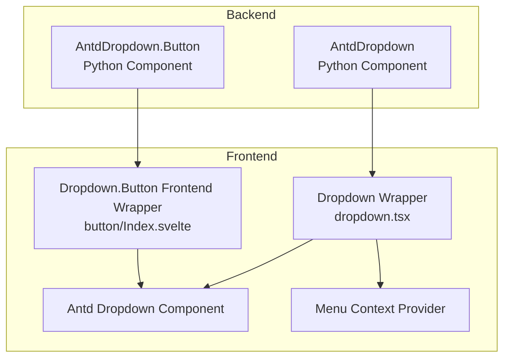
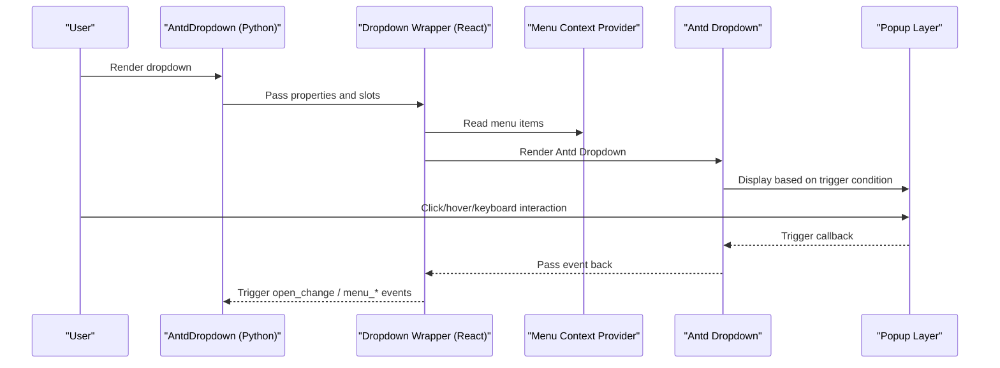
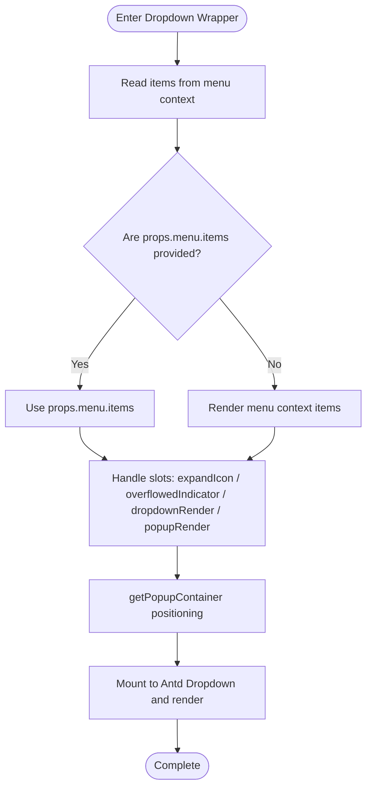
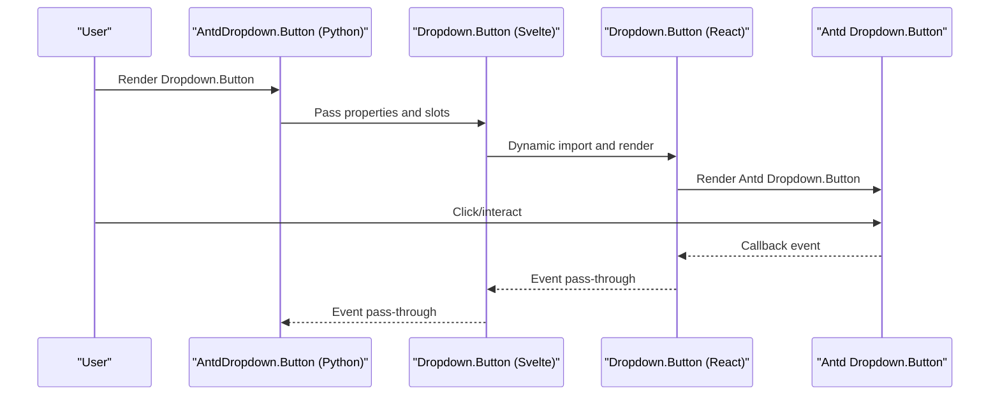
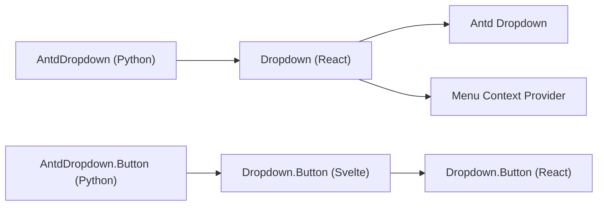

# Dropdown

<cite>
**Files Referenced in This Document**
- [frontend/antd/dropdown/dropdown.tsx](file://frontend/antd/dropdown/dropdown.tsx)
- [frontend/antd/dropdown/button/Index.svelte](file://frontend/antd/dropdown/button/Index.svelte)
- [backend/modelscope_studio/components/antd/dropdown/__init__.py](file://backend/modelscope_studio/components/antd/dropdown/__init__.py)
- [backend/modelscope_studio/components/antd/components.py](file://backend/modelscope_studio/components/antd/components.py)
- [docs/components/antd/dropdown/README.md](file://docs/components/antd/dropdown/README.md)
- [docs/components/antd/dropdown/demos/basic.py](file://docs/components/antd/dropdown/demos/basic.py)
</cite>

## Table of Contents

1. [Introduction](#introduction)
2. [Project Structure](#project-structure)
3. [Core Components](#core-components)
4. [Architecture Overview](#architecture-overview)
5. [Detailed Component Analysis](#detailed-component-analysis)
6. [Dependency Analysis](#dependency-analysis)
7. [Performance Considerations](#performance-considerations)
8. [Troubleshooting Guide](#troubleshooting-guide)
9. [Conclusion](#conclusion)
10. [Appendix](#appendix)

## Introduction

This document systematically introduces the implementation and usage of the Dropdown component in the ModelScope Studio frontend, covering the following topics:

- Trigger mechanisms and popup containers
- Menu item configuration and rendering
- Popup positioning and placement strategies
- Interaction behaviors and event handling
- Keyboard navigation and accessibility support
- Integration with forms, icon buttons, and text links
- Advanced usage: multi-level menus, dynamic menus, remote loading
- Performance optimization recommendations and common issues

## Project Structure

The Dropdown component consists of backend Python components and a frontend Svelte/React wrapper layer, bridged through the Gradio ecosystem.

Diagram Sources

- [backend/modelscope_studio/components/antd/dropdown/**init**.py:11-38](file://backend/modelscope_studio/components/antd/dropdown/__init__.py#L11-L38)
- [frontend/antd/dropdown/dropdown.tsx:15-108](file://frontend/antd/dropdown/dropdown.tsx#L15-L108)
- [frontend/antd/dropdown/button/Index.svelte:10-70](file://frontend/antd/dropdown/button/Index.svelte#L10-L70)

Section Sources

- [backend/modelscope_studio/components/antd/dropdown/**init**.py:11-38](file://backend/modelscope_studio/components/antd/dropdown/__init__.py#L11-L38)
- [frontend/antd/dropdown/dropdown.tsx:15-108](file://frontend/antd/dropdown/dropdown.tsx#L15-L108)
- [frontend/antd/dropdown/button/Index.svelte:10-70](file://frontend/antd/dropdown/button/Index.svelte#L10-L70)

## Core Components

- Backend Python components: `AntdDropdown` and `AntdDropdown.Button`
- Frontend wrapper layer: Dropdown (React wrapper + Antd Dropdown), Dropdown.Button (Svelte wrapper)
- Menu context: Injects "menu items" into the dropdown via the Menu Context Provider

Key features

- Supports injecting menu items, expand icons, overflow indicators, and custom popup rendering via slots
- Supports `getPopupContainer` for custom popup containers
- Supports `open_change`, `menu_*` series of event bindings
- Provides inline style pass-through (`innerStyle`) and container style (`overlayStyle`)

Section Sources

- [backend/modelscope_studio/components/antd/dropdown/**init**.py:34-38](file://backend/modelscope_studio/components/antd/dropdown/__init__.py#L34-L38)
- [backend/modelscope_studio/components/antd/dropdown/**init**.py:40-100](file://backend/modelscope_studio/components/antd/dropdown/__init__.py#L40-L100)
- [frontend/antd/dropdown/dropdown.tsx:15-25](file://frontend/antd/dropdown/dropdown.tsx#L15-L25)
- [frontend/antd/dropdown/dropdown.tsx:44-92](file://frontend/antd/dropdown/dropdown.tsx#L44-L92)

## Architecture Overview

The Dropdown call chain is as follows:

Diagram Sources

- [backend/modelscope_studio/components/antd/dropdown/**init**.py:16-32](file://backend/modelscope_studio/components/antd/dropdown/__init__.py#L16-L32)
- [frontend/antd/dropdown/dropdown.tsx:26-107](file://frontend/antd/dropdown/dropdown.tsx#L26-L107)

## Detailed Component Analysis

### Component 1: Dropdown

- Role: Combines Ant Design's Dropdown with the internal menu context, supporting slot-based menu item injection and custom rendering
- Key points
  - Menu item source: Uses `props.menu.items` first; otherwise renders "menu.items" from menu context
  - Expand icon and overflow indicator: Can inject ReactSlot via slots or fall back to native properties
  - Popup container: Supports `getPopupContainer` for custom containers
  - Custom rendering: `dropdownRender` and `popupRender` can be injected via slots or passed as functions
  - Inline styles: `innerStyle` is passed through to the content container

Diagram Sources

- [frontend/antd/dropdown/dropdown.tsx:26-107](file://frontend/antd/dropdown/dropdown.tsx#L26-L107)

Section Sources

- [frontend/antd/dropdown/dropdown.tsx:15-108](file://frontend/antd/dropdown/dropdown.tsx#L15-L108)

### Component 2: Dropdown.Button

- Role: Wraps Antd Dropdown.Button in a Svelte manner, supporting slots and event mapping
- Key points
  - Dynamically imports the React version of Dropdown.Button via `importComponent`
  - Property mapping: `open_change` → `openChange`, `menu_open_change` → `menu_OpenChange`
  - Visibility control: Controls rendering via `visible`
  - Styles and IDs: Supports `elem_style`, `elem_id`, `elem_classes` pass-through

Diagram Sources

- [frontend/antd/dropdown/button/Index.svelte:10-70](file://frontend/antd/dropdown/button/Index.svelte#L10-L70)
- [backend/modelscope_studio/components/antd/dropdown/**init**.py:8-8](file://backend/modelscope_studio/components/antd/dropdown/__init__.py#L8-L8)

Section Sources

- [frontend/antd/dropdown/button/Index.svelte:10-70](file://frontend/antd/dropdown/button/Index.svelte#L10-L70)
- [backend/modelscope_studio/components/antd/dropdown/**init**.py:15-15](file://backend/modelscope_studio/components/antd/dropdown/__init__.py#L15-L15)

### Event Handling and Keyboard Navigation

- Event bindings
  - `open_change`: Dropdown panel visibility state change
  - `menu_click` / `menu_select` / `menu_deselect` / `menu_open_change`: Menu item click, selection, deselection, menu panel visibility change
- Keyboard navigation
  - Uses Antd Dropdown's default keyboard behavior (up/down to move, Enter/Space to select, Esc to close)
- Accessibility support
  - Preserves native semantic tags and accessibility attributes (provided by Antd Dropdown)
  - Recommendation: Set `aria-controls`, `aria-expanded`, and other attributes on trigger elements to enhance accessibility

Section Sources

- [backend/modelscope_studio/components/antd/dropdown/**init**.py:16-32](file://backend/modelscope_studio/components/antd/dropdown/__init__.py#L16-L32)

### Popup Positioning and Container

- Positioning strategy
  - `placement`: Supports `topLeft`/`top`/`topRight`/`bottomLeft`/`bottom`/`bottomRight`
  - `auto_adjust_overflow`: Automatically adjusts overflow
- Container selection
  - `get_popup_container`: Custom popup container, commonly used for fixing to specific areas or inside scroll containers

Section Sources

- [backend/modelscope_studio/components/antd/dropdown/**init**.py:56-59](file://backend/modelscope_studio/components/antd/dropdown/__init__.py#L56-L59)
- [backend/modelscope_studio/components/antd/dropdown/**init**.py:52-52](file://backend/modelscope_studio/components/antd/dropdown/__init__.py#L52-L52)

### Integration with Forms, Icon Buttons, and Text Links

- Form components
  - When embedding input-type components in menu items, be aware of form linkage and validation timing
- Icon buttons
  - Combine `antd.Icon` with `antd.Button` (type="text" or "primary"/"default")
- Text links
  - Use `antd.Button` (type="link") as menu item labels, supporting `href` and new window opening

Section Sources

- [docs/components/antd/dropdown/demos/basic.py:6-31](file://docs/components/antd/dropdown/demos/basic.py#L6-L31)
- [docs/components/antd/dropdown/demos/basic.py:37-47](file://docs/components/antd/dropdown/demos/basic.py#L37-L47)

### Advanced Usage

- Multi-level menus
  - Nest sub-menu items within menu items to achieve two-level or multi-level dropdown menus
- Dynamic menus
  - Inject "menu.items" via slots and update dynamically based on state at runtime
- Remote loading
  - Add loading and error states in `dropdownRender`/`popupRender`, update menu items after async requests

Section Sources

- [frontend/antd/dropdown/dropdown.tsx:20-24](file://frontend/antd/dropdown/dropdown.tsx#L20-L24)
- [frontend/antd/dropdown/dropdown.tsx:71-92](file://frontend/antd/dropdown/dropdown.tsx#L71-L92)

## Dependency Analysis

- Python layer
  - `AntdDropdown` exports the Button sub-component and declares supported slots and events
  - Component is registered in `components.py` for unified export
- Frontend layer
  - Dropdown wrapper depends on Antd Dropdown, Menu Context Provider, and slot rendering utilities
  - Dropdown.Button wraps the React component via Svelte

Diagram Sources

- [backend/modelscope_studio/components/antd/dropdown/**init**.py:39-40](file://backend/modelscope_studio/components/antd/dropdown/__init__.py#L39-L40)
- [backend/modelscope_studio/components/antd/components.py:39-40](file://backend/modelscope_studio/components/antd/components.py#L39-L40)
- [frontend/antd/dropdown/dropdown.tsx:10-13](file://frontend/antd/dropdown/dropdown.tsx#L10-L13)
- [frontend/antd/dropdown/button/Index.svelte:10-12](file://frontend/antd/dropdown/button/Index.svelte#L10-L12)

Section Sources

- [backend/modelscope_studio/components/antd/components.py:39-40](file://backend/modelscope_studio/components/antd/components.py#L39-L40)
- [frontend/antd/dropdown/dropdown.tsx:10-13](file://frontend/antd/dropdown/dropdown.tsx#L10-L13)

## Performance Considerations

- Menu item rendering
  - Use `useMemo` to cache the menu item list, avoiding unnecessary re-renders
- Slot rendering
  - Render slots only when needed, reducing unused nodes
- Popup container
  - Set `getPopupContainer` reasonably to avoid frequent popup layer reflows
- Event binding
  - Bind `open_change` and `menu_*` events only when necessary, avoiding excessive listeners

Section Sources

- [frontend/antd/dropdown/dropdown.tsx:49-57](file://frontend/antd/dropdown/dropdown.tsx#L49-L57)
- [frontend/antd/dropdown/dropdown.tsx:37-39](file://frontend/antd/dropdown/dropdown.tsx#L37-L39)

## Troubleshooting Guide

- Unable to display menu items
  - Check whether "menu.items" is injected via slots, or whether `props.menu.items` is correctly passed
- Popup layer position abnormal
  - Check whether `getPopupContainer` returns the correct container element
  - Adjust `placement` and `auto_adjust_overflow`
- Events not triggering
  - Confirm the corresponding events (`open_change`, `menu_*`) are enabled and correctly bound in the Python layer
- Styles not taking effect
  - `innerStyle` only applies to the content container; `overlayStyle` should be passed via backend properties

Section Sources

- [frontend/antd/dropdown/dropdown.tsx:44-92](file://frontend/antd/dropdown/dropdown.tsx#L44-L92)
- [backend/modelscope_studio/components/antd/dropdown/**init**.py:52-59](file://backend/modelscope_studio/components/antd/dropdown/__init__.py#L52-L59)
- [backend/modelscope_studio/components/antd/dropdown/**init**.py:16-32](file://backend/modelscope_studio/components/antd/dropdown/__init__.py#L16-L32)

## Conclusion

The Dropdown component implements flexible menu item injection, popup layer customization, and event binding through a "Python component + frontend wrapper + menu context" design. Combined with Antd Dropdown's mature capabilities, it can handle scenarios ranging from basic dropdowns to complex multi-level menus, dynamic and remote loading. In real projects, it is recommended to focus on performance and accessibility, using slots and events reasonably to ensure a good user experience.

## Appendix

- Example references
  - Basic examples: Contains normal dropdown and dropdown button, as well as embedded buttons and links in menu items
- Documentation entry
  - Component documentation home and example entry

Section Sources

- [docs/components/antd/dropdown/README.md:1-8](file://docs/components/antd/dropdown/README.md#L1-L8)
- [docs/components/antd/dropdown/demos/basic.py:33-47](file://docs/components/antd/dropdown/demos/basic.py#L33-L47)
