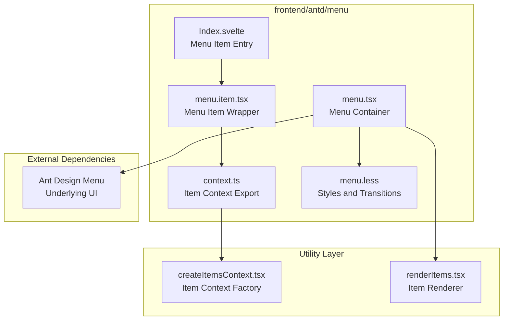
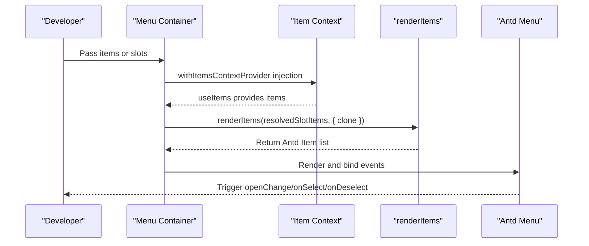
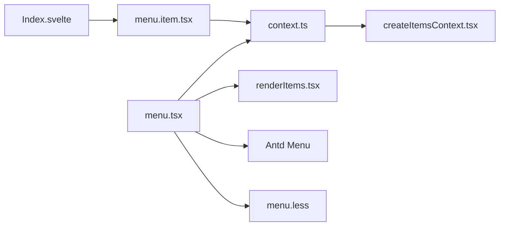

# Menu

<cite>
**Files Referenced in This Document**
- [menu.tsx](file://frontend/antd/menu/menu.tsx)
- [menu.item.tsx](file://frontend/antd/menu/item/menu.item.tsx)
- [Index.svelte](file://frontend/antd/menu/item/Index.svelte)
- [context.ts](file://frontend/antd/menu/context.ts)
- [menu.less](file://frontend/antd/menu/menu.less)
- [createItemsContext.tsx](file://frontend/utils/createItemsContext.tsx)
- [renderItems.tsx](file://frontend/utils/renderItems.tsx)
- [README.md](file://docs/components/antd/menu/README.md)
</cite>

## Table of Contents

1. [Introduction](#introduction)
2. [Project Structure](#project-structure)
3. [Core Components](#core-components)
4. [Architecture Overview](#architecture-overview)
5. [Detailed Component Analysis](#detailed-component-analysis)
6. [Dependency Analysis](#dependency-analysis)
7. [Performance Considerations](#performance-considerations)
8. [Troubleshooting Guide](#troubleshooting-guide)
9. [Conclusion](#conclusion)
10. [Appendix](#appendix)

## Introduction

This document systematically introduces the design and implementation of the navigation Menu component, covering layout modes, menu item configuration, state management, interaction behaviors, icons and disabled states, sub-menu nesting, horizontal/vertical layout switching, collapse/expand mechanisms, responsive adaptation, integration with routing systems (dynamic menus, permission control, breadcrumb linkage), accordion and multi-select modes, searchable menus, and other advanced capabilities, along with usage examples, style customization, and performance optimization recommendations.

## Project Structure

The Menu component consists of three parts: "container component + menu item component + context and rendering utilities". It uses Ant Design's Menu component as the underlying implementation, bridged to React via Svelte preprocessing, combined with an in-house "item context" system for flexible menu item collection and rendering.

Diagram Sources

- [menu.tsx:14-93](file://frontend/antd/menu/menu.tsx#L14-L93)
- [menu.item.tsx:9-33](file://frontend/antd/menu/item/menu.item.tsx#L9-L33)
- [Index.svelte:13-83](file://frontend/antd/menu/item/Index.svelte#L13-L83)
- [context.ts:1-7](file://frontend/antd/menu/context.ts#L1-L7)
- [createItemsContext.tsx:97-273](file://frontend/utils/createItemsContext.tsx#L97-L273)
- [renderItems.tsx:8-113](file://frontend/utils/renderItems.tsx#L8-L113)

Section Sources

- [menu.tsx:1-96](file://frontend/antd/menu/menu.tsx#L1-L96)
- [menu.item.tsx:1-36](file://frontend/antd/menu/item/menu.item.tsx#L1-L36)
- [Index.svelte:1-84](file://frontend/antd/menu/item/Index.svelte#L1-L84)
- [context.ts:1-7](file://frontend/antd/menu/context.ts#L1-L7)
- [menu.less:1-45](file://frontend/antd/menu/menu.less#L1-L45)
- [createItemsContext.tsx:1-274](file://frontend/utils/createItemsContext.tsx#L1-L274)
- [renderItems.tsx:1-114](file://frontend/utils/renderItems.tsx#L1-L114)

## Core Components

- Menu Container (Menu)
  - Purpose: Wraps Ant Design Menu, unifying event pass-through, slot rendering, custom rendering of icons and overflow indicators, and item context injection.
  - Key points: Supports slot extensions (e.g., `expandIcon`, `overflowedIndicator`, `popupRender`); supports `items` or slots as data sources; internally uses `renderItems` to convert the "item context" into the `ItemType` array required by Antd.
- Menu Item (MenuItem)
  - Purpose: Wraps menu items from the "item context" as Antd MenuItem/SubMenu, auto-detects type (regular item/sub-menu), and injects style class names.
- Item Context (createItemsContext)
  - Purpose: Provides "item collection + child item collection" context, supporting multiple slots, index positioning, property and child item transformation, change callbacks, etc.
- Renderer (renderItems)
  - Purpose: Renders the "item context" tree structure into the props structure required by Antd, supporting slot injection, cloning, parameterized slots, etc.

Section Sources

- [menu.tsx:14-93](file://frontend/antd/menu/menu.tsx#L14-L93)
- [menu.item.tsx:9-33](file://frontend/antd/menu/item/menu.item.tsx#L9-L33)
- [createItemsContext.tsx:97-273](file://frontend/utils/createItemsContext.tsx#L97-L273)
- [renderItems.tsx:8-113](file://frontend/utils/renderItems.tsx#L8-L113)

## Architecture Overview

The Menu component uses a layered design of "container + item wrapper + context", bridged to React via Svelte preprocessing, then React calls Antd Menu. The item context is responsible for collecting menu items and their slots at runtime, and the renderer ultimately outputs a data structure recognizable by Antd.

Diagram Sources

- [menu.tsx:18-54](file://frontend/antd/menu/menu.tsx#L18-L54)
- [createItemsContext.tsx:171-184](file://frontend/utils/createItemsContext.tsx#L171-L184)
- [renderItems.tsx:8-113](file://frontend/utils/renderItems.tsx#L8-L113)

## Detailed Component Analysis

### Menu Container (Menu)

- Data source selection
  - Supports directly passing `items` (Antd Item type array) or collecting via slots (default/items slots).
  - If slots exist, items from slots are preferred; otherwise falls back to the default slot.
- Slot extensions
  - `expandIcon`: Custom expand icon, supports parameterized rendering.
  - `overflowedIndicator`: Overflow indicator (e.g., "More" button).
  - `popupRender`: Custom rendering for dropdown popup layers.
- Event pass-through
  - `onOpenChange`, `onSelect`, `onDeselect` are passed through as-is to Antd Menu.
- Performance optimization
  - Uses `useMemo` to cache items computation results, avoiding duplicate rendering.
  - Only recomputes when `items` or `resolvedSlotItems` changes.

Section Sources

- [menu.tsx:14-93](file://frontend/antd/menu/menu.tsx#L14-L93)

### Menu Item (MenuItem)

- Type detection
  - When default slot children exist, auto-detects as sub-menu (SubMenu); otherwise as a regular menu item (MenuItem).
- Style class names
  - Automatically injects `ms-gr-antd-menu-item` or `ms-gr-antd-menu-item-{type}` for theme and style customization.
- Slot handling
  - Injects the `icon` slot into Antd's `icon` field via cloning, ensuring consistent spacing between icon and text.

Section Sources

- [menu.item.tsx:9-33](file://frontend/antd/menu/item/menu.item.tsx#L9-L33)

### Item Context (createItemsContext)

- Multi-slot support
  - Allows defining multiple slots (e.g., `default`, `items`) and writing by index via `setItem`.
- Child item collection
  - `ItemHandler` internally wraps `ItemsContextProvider` again, forming a "parent collection + child collection" tree structure.
- Property and child item transformation
  - `itemProps` and `itemChildren` support transforming props and children of the current item for dynamic generation.
- Change notification
  - The `onChange` callback returns the complete items under the current slot, making it easy for upper layers to listen for changes.

Section Sources

- [createItemsContext.tsx:97-273](file://frontend/utils/createItemsContext.tsx#L97-L273)

### Renderer (renderItems)

- Slot injection
  - Injects slot elements recorded in the item context into corresponding fields (supports nested paths), with support for `withParams` parameterized slots.
- Cloning and force cloning
  - `clone` controls whether to clone nodes; `forceClone` is enabled by default with `withParams` to ensure correct parameter passing.
- Child item recursion
  - Recursively renders the `children` field to form a complete menu tree.
- Key generation
  - Generates stable keys for each item to avoid React diff anomalies.

Section Sources

- [renderItems.tsx:8-113](file://frontend/utils/renderItems.tsx#L8-L113)

### Styles and Responsive (menu.less)

- Icon and text spacing
  - When an icon is present, automatically sets `margin-inline-start` for adjacent text and adds transition animations.
- Collapsed mode
  - In the `inline-collapsed` state, text is hidden and only icons are shown to improve space utilization.
- Animations and transitions
  - Controls transition duration and easing via CSS variables, ensuring visual consistency.

Section Sources

- [menu.less:1-45](file://frontend/antd/menu/menu.less#L1-L45)

### Svelte Entry (Index.svelte)

- Property and slot handling
  - Retrieves component properties and additional properties via `getProps`/`processProps`, supports `visible` for visibility control.
  - Injects the `icon` slot into Antd's `icon` field via cloning.
- Theme and styles
  - Supports `elem_id`, `elem_classes`, `elem_style` injection for theme and style customization.
- Conditional rendering
  - Renders `children` only when `visible` is true.

Section Sources

- [Index.svelte:1-84](file://frontend/antd/menu/item/Index.svelte#L1-L84)

## Dependency Analysis

- Component coupling
  - Menu depends on `createItemsContext` and `renderItems`; MenuItem depends on `ItemHandler` and context; Svelte entry handles property and slot preprocessing.
- External dependencies
  - Ant Design Menu as the underlying UI; `ReactSlot` for slot rendering; `classnames` for class name concatenation.
- Circular dependencies
  - Avoided through "exported factory + context injection"; Menu and MenuItem are decoupled via context.

Diagram Sources

- [menu.tsx:1-96](file://frontend/antd/menu/menu.tsx#L1-L96)
- [context.ts:1-7](file://frontend/antd/menu/context.ts#L1-L7)
- [createItemsContext.tsx:1-274](file://frontend/utils/createItemsContext.tsx#L1-L274)
- [renderItems.tsx:1-114](file://frontend/utils/renderItems.tsx#L1-L114)
- [menu.item.tsx:1-36](file://frontend/antd/menu/item/menu.item.tsx#L1-L36)
- [Index.svelte:1-84](file://frontend/antd/menu/item/Index.svelte#L1-L84)
- [menu.less:1-45](file://frontend/antd/menu/menu.less#L1-L45)

Section Sources

- [menu.tsx:1-96](file://frontend/antd/menu/menu.tsx#L1-L96)
- [menu.item.tsx:1-36](file://frontend/antd/menu/item/menu.item.tsx#L1-L36)
- [Index.svelte:1-84](file://frontend/antd/menu/item/Index.svelte#L1-L84)
- [context.ts:1-7](file://frontend/antd/menu/context.ts#L1-L7)
- [createItemsContext.tsx:1-274](file://frontend/utils/createItemsContext.tsx#L1-L274)
- [renderItems.tsx:1-114](file://frontend/utils/renderItems.tsx#L1-L114)
- [menu.less:1-45](file://frontend/antd/menu/menu.less#L1-L45)

## Performance Considerations

- Render caching
  - Menu uses `useMemo` for items computation, avoiding unnecessary re-renders.
- Event function memoization
  - `createItemsContext` internally uses `useMemoizedFn`, reducing side effects caused by callback function rebuilds.
- Slot cloning strategy
  - Default slot element cloning avoids state confusion caused by DOM reuse; forced cloning in `withParams` scenarios.
- Recursive rendering optimization
  - `renderItems` only filters and maps valid items, avoiding empty items participating in rendering.

Section Sources

- [menu.tsx:46-54](file://frontend/antd/menu/menu.tsx#L46-L54)
- [createItemsContext.tsx:203-254](file://frontend/utils/createItemsContext.tsx#L203-L254)
- [renderItems.tsx:19-22](file://frontend/utils/renderItems.tsx#L19-L22)

## Troubleshooting Guide

- Slots not taking effect
  - Check whether slot names are declared in `allowedSlots`; confirm slot elements are correctly injected into `ItemHandler`'s slots.
- Icons not showing or text not appearing
  - Confirm the icon slot has been injected into the `icon` field via the Svelte entry; check behavior when the menu is in collapsed mode.
- Events not triggering
  - Confirm Menu correctly passes through `onOpenChange`/`onSelect`/`onDeselect`; check Antd version compatibility.
- Sub-menus not expanding
  - Check whether sub-item `children` are correctly recursed via `renderItems`; confirm the `itemChildren` callback returns the correct child item list.
- Style anomalies
  - Check whether `menu.less` is imported; confirm theme variables (e.g., `--ms-gr-ant-menu-icon-margin-inline-end`) are set correctly.

Section Sources

- [menu.tsx:35-88](file://frontend/antd/menu/menu.tsx#L35-L88)
- [menu.item.tsx:16-30](file://frontend/antd/menu/item/menu.item.tsx#L16-L30)
- [Index.svelte:69-78](file://frontend/antd/menu/item/Index.svelte#L69-L78)
- [menu.less:1-45](file://frontend/antd/menu/menu.less#L1-L45)

## Conclusion

This Menu component enhances and extends Ant Design Menu through a "container + item wrapper + context" architecture, featuring a flexible slot system, powerful sub-menu and icon support, and good performance and maintainability. Combined with routing systems and permission control, complex navigation scenarios can be quickly built.

## Appendix

### Usage Examples (Path Guide)

- Basic examples
  - Refer to documentation example tabs: `<demo name="basic"></demo>`
  - Example file location: `docs/components/antd/menu/README.md`
- Dynamic menus and permission control
  - Dynamically pass menu items via the `items` property; filter items based on user permissions in `onChange`.
- Breadcrumb linkage
  - Update the breadcrumb data source in `onSelect`; generate titles and paths combined with route parameters.
- Accordion and multi-select
  - Control expand state and selected items using `onOpenChange`/`onSelect`; Antd Menu natively supports accordion and multi-select modes.
- Searchable menus
  - Implement a search input externally, filter `items` and pass them to Menu; or inject a search component in a slot.

Section Sources

- [README.md:1-8](file://docs/components/antd/menu/README.md#L1-L8)

### Style Customization Guide

- Custom icon and text spacing
  - Modify the `--ms-gr-ant-menu-icon-margin-inline-end` variable to adjust icon-text spacing.
- Collapsed mode text hiding
  - Control text visibility and transitions in collapsed mode via rules in `menu.less`.
- Theme class names
  - Use `ms-gr-antd-menu-item-*` class names for themed style overrides.

Section Sources

- [menu.less:1-45](file://frontend/antd/menu/menu.less#L1-L45)

### Advanced Feature Implementation Key Points

- Sub-menu nesting
  - Return the sub-item array via the `itemChildren` callback in `ItemHandler`; `renderItems` will recursively render them.
- Icon setup
  - Inject the `icon` slot into Antd's `icon` field in the Svelte entry.
- Disabled state
  - Control disabled via Antd MenuItem's `disabled` property; set dynamically in the item context.
- Responsive adaptation
  - Antd Menu itself supports responsiveness; combine CSS variables and layout containers for the best experience.

Section Sources

- [menu.item.tsx:16-30](file://frontend/antd/menu/item/menu.item.tsx#L16-L30)
- [Index.svelte:69-78](file://frontend/antd/menu/item/Index.svelte#L69-L78)
- [renderItems.tsx:99-112](file://frontend/utils/renderItems.tsx#L99-L112)
