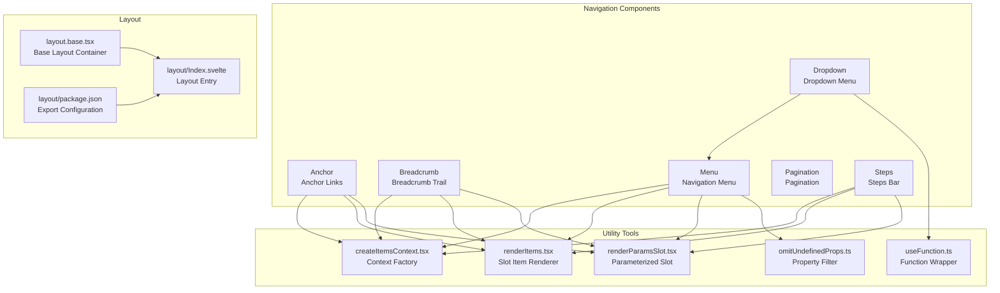
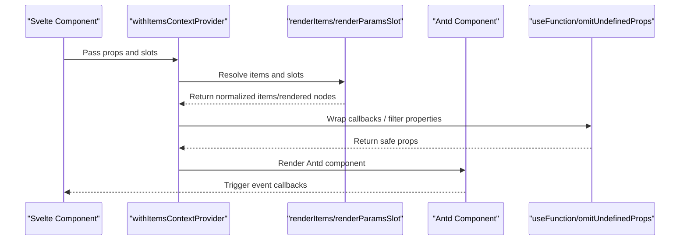
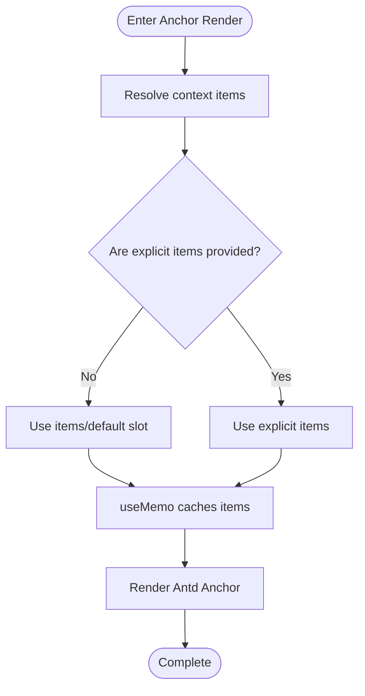
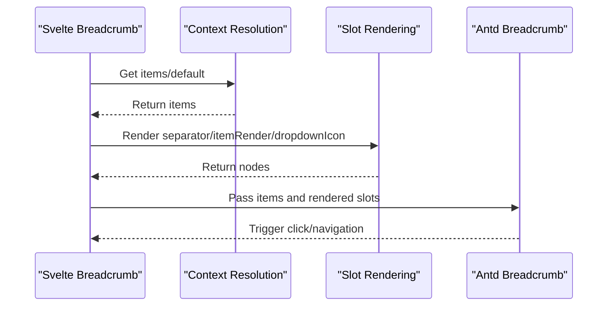
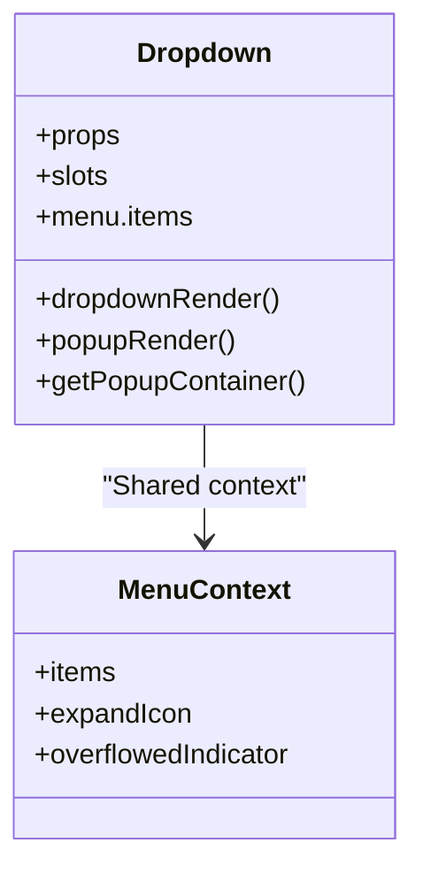
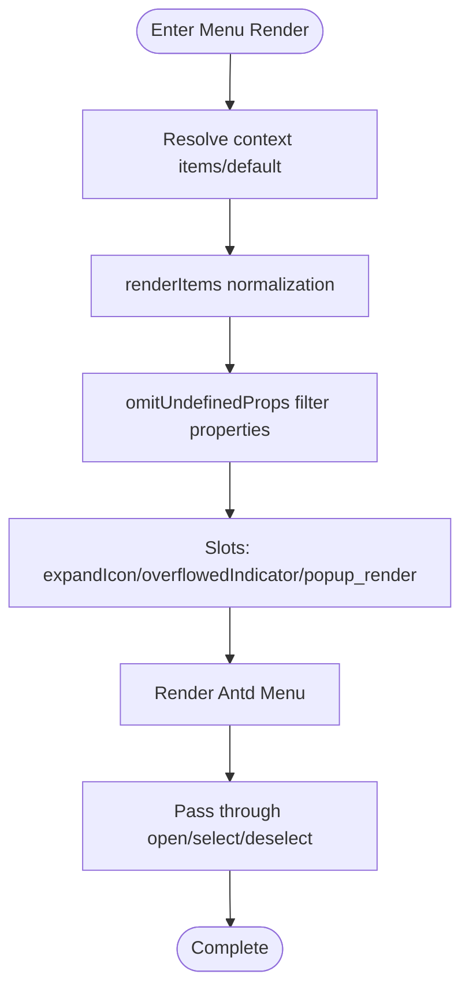
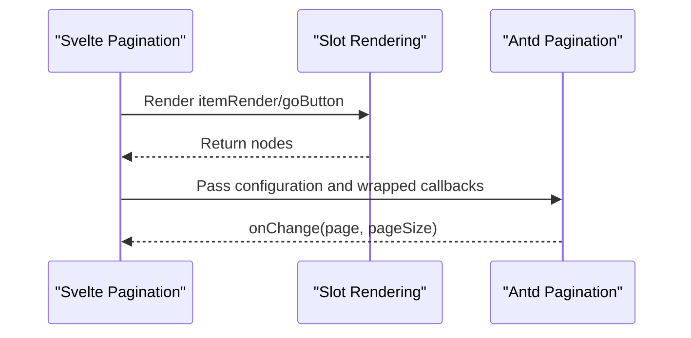
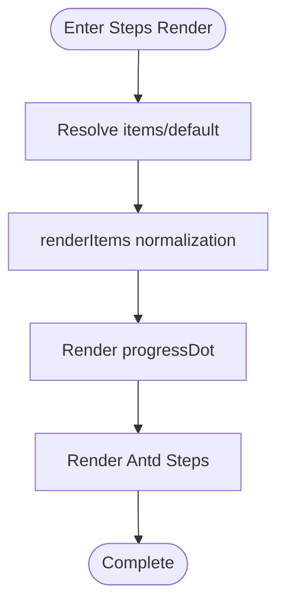
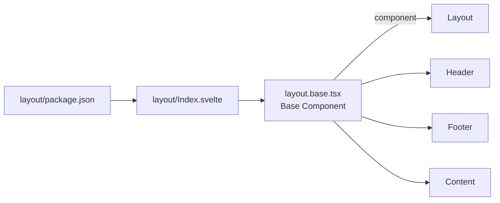
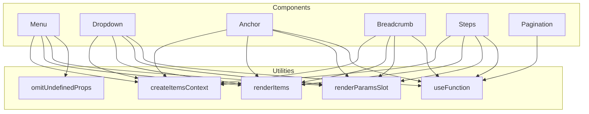

# Navigation Components

<cite>
**Files Referenced in This Document**
- [frontend/antd/anchor/anchor.tsx](file://frontend/antd/anchor/anchor.tsx)
- [frontend/antd/anchor/context.ts](file://frontend/antd/anchor/context.ts)
- [frontend/antd/breadcrumb/breadcrumb.tsx](file://frontend/antd/breadcrumb/breadcrumb.tsx)
- [frontend/antd/breadcrumb/context.ts](file://frontend/antd/breadcrumb/context.ts)
- [frontend/antd/dropdown/dropdown.tsx](file://frontend/antd/dropdown/dropdown.tsx)
- [frontend/antd/menu/menu.tsx](file://frontend/antd/menu/menu.tsx)
- [frontend/antd/menu/context.ts](file://frontend/antd/menu/context.ts)
- [frontend/antd/pagination/pagination.tsx](file://frontend/antd/pagination/pagination.tsx)
- [frontend/antd/steps/steps.tsx](file://frontend/antd/steps/steps.tsx)
- [frontend/antd/steps/context.ts](file://frontend/antd/steps/context.ts)
- [frontend/antd/layout/layout.base.tsx](file://frontend/antd/layout/layout.base.tsx)
- [frontend/antd/layout/Index.svelte](file://frontend/antd/layout/Index.svelte)
- [frontend/antd/layout/package.json](file://frontend/antd/layout/package.json)
- [frontend/utils/createItemsContext.tsx](file://frontend/utils/createItemsContext.tsx)
- [frontend/utils/renderItems.tsx](file://frontend/utils/renderItems.tsx)
- [frontend/utils/renderParamsSlot.tsx](file://frontend/utils/renderParamsSlot.tsx)
- [frontend/utils/hooks/useFunction.ts](file://frontend/utils/hooks/useFunction.ts)
- [frontend/utils/omitUndefinedProps.ts](file://frontend/utils/omitUndefinedProps.ts)
</cite>

## Table of Contents

1. [Introduction](#introduction)
2. [Project Structure](#project-structure)
3. [Core Components](#core-components)
4. [Architecture Overview](#architecture-overview)
5. [Detailed Component Analysis](#detailed-component-analysis)
6. [Dependency Analysis](#dependency-analysis)
7. [Performance Considerations](#performance-considerations)
8. [Troubleshooting Guide](#troubleshooting-guide)
9. [Conclusion](#conclusion)
10. [Appendix](#appendix)

## Introduction

This document systematically organizes and explains the implementation and usage of Ant Design navigation-related components in this repository, covering the following components: Anchor, Breadcrumb, Dropdown, Menu, Pagination, and Steps. The document focuses on:

- Component state management and event handling mechanisms
- Integration approaches and best practices with routing systems
- Implementation of permission control in navigation
- Navigation pattern design guide: top navigation, sidebar navigation, hybrid navigation
- Implementation methods for multi-level navigation and performance optimization suggestions
- Interaction design and user experience optimization key points

## Project Structure

Navigation-related components are primarily located in the `antd` sub-module of the frontend directory, organized using a common pattern of "on-demand rendering + context injection", working with utility functions for slot rendering and property adaptation.

Diagram Sources

- [frontend/antd/anchor/anchor.tsx:1-46](file://frontend/antd/anchor/anchor.tsx#L1-L46)
- [frontend/antd/breadcrumb/breadcrumb.tsx:1-67](file://frontend/antd/breadcrumb/breadcrumb.tsx#L1-L67)
- [frontend/antd/dropdown/dropdown.tsx:1-111](file://frontend/antd/dropdown/dropdown.tsx#L1-L111)
- [frontend/antd/menu/menu.tsx:1-96](file://frontend/antd/menu/menu.tsx#L1-L96)
- [frontend/antd/steps/steps.tsx:1-52](file://frontend/antd/steps/steps.tsx#L1-L52)
- [frontend/antd/layout/layout.base.tsx:1-40](file://frontend/antd/layout/layout.base.tsx#L1-L40)
- [frontend/antd/layout/Index.svelte:1-18](file://frontend/antd/layout/Index.svelte#L1-L18)
- [frontend/antd/layout/package.json:1-15](file://frontend/antd/layout/package.json#L1-L15)
- [frontend/utils/createItemsContext.tsx](file://frontend/utils/createItemsContext.tsx)
- [frontend/utils/renderItems.tsx](file://frontend/utils/renderItems.tsx)
- [frontend/utils/renderParamsSlot.tsx](file://frontend/utils/renderParamsSlot.tsx)
- [frontend/utils/hooks/useFunction.ts](file://frontend/utils/hooks/useFunction.ts)
- [frontend/utils/omitUndefinedProps.ts](file://frontend/utils/omitUndefinedProps.ts)

Section Sources

- [frontend/antd/anchor/anchor.tsx:1-46](file://frontend/antd/anchor/anchor.tsx#L1-L46)
- [frontend/antd/breadcrumb/breadcrumb.tsx:1-67](file://frontend/antd/breadcrumb/breadcrumb.tsx#L1-L67)
- [frontend/antd/dropdown/dropdown.tsx:1-111](file://frontend/antd/dropdown/dropdown.tsx#L1-L111)
- [frontend/antd/menu/menu.tsx:1-96](file://frontend/antd/menu/menu.tsx#L1-L96)
- [frontend/antd/pagination/pagination.tsx:1-55](file://frontend/antd/pagination/pagination.tsx#L1-L55)
- [frontend/antd/steps/steps.tsx:1-52](file://frontend/antd/steps/steps.tsx#L1-L52)
- [frontend/antd/layout/layout.base.tsx:1-40](file://frontend/antd/layout/layout.base.tsx#L1-L40)
- [frontend/antd/layout/Index.svelte:1-18](file://frontend/antd/layout/Index.svelte#L1-L18)
- [frontend/antd/layout/package.json:1-15](file://frontend/antd/layout/package.json#L1-L15)

## Core Components

This section provides an overall capability and behavioral description of each navigation component for quick orientation.

- Anchor
  - Responsible for in-page positioning and highlighting, supporting container selectors and current anchor callbacks
  - Injects items via context, supporting slot-based child item rendering
- Breadcrumb
  - Displays the current page path, supporting custom separators, item renderers, and dropdown icons
  - Supports replacing default rendering logic via slots
- Dropdown
  - Based on Ant Design Dropdown, supports nested menu items, popup layer rendering, and overflow indicators
  - Shares items rendering strategy with the menu context
- Menu
  - Supports expand icons, overflow indicators, and popup rendering
  - Provides open/select/deselect event pass-through
- Pagination
  - Supports total count rendering, quick jumper, and custom page number rendering
  - Event callbacks are uniformly handled by function wrappers
- Steps
  - Supports custom progress dot rendering
  - Injects items via context, supporting slot-based child items

Section Sources

- [frontend/antd/anchor/anchor.tsx:1-46](file://frontend/antd/anchor/anchor.tsx#L1-L46)
- [frontend/antd/breadcrumb/breadcrumb.tsx:1-67](file://frontend/antd/breadcrumb/breadcrumb.tsx#L1-L67)
- [frontend/antd/dropdown/dropdown.tsx:1-111](file://frontend/antd/dropdown/dropdown.tsx#L1-L111)
- [frontend/antd/menu/menu.tsx:1-96](file://frontend/antd/menu/menu.tsx#L1-L96)
- [frontend/antd/pagination/pagination.tsx:1-55](file://frontend/antd/pagination/pagination.tsx#L1-L55)
- [frontend/antd/steps/steps.tsx:1-52](file://frontend/antd/steps/steps.tsx#L1-L52)

## Architecture Overview

Navigation components universally adopt a unified architecture of "Svelte wrapper + React component + slot rendering + context injection". Key characteristics are:

- Use `sveltify` to bridge React components as Svelte components
- Inject items context via `withItemsContextProvider` to uniformly handle combinations of children and slots
- Use `renderItems` and `renderParamsSlot` to render slot items and parameterized slots
- Use `useFunction` to wrap callbacks, ensuring stable execution in the Svelte environment
- Use `omitUndefinedProps` to filter undefined properties, avoiding passing invalid values to underlying components

Diagram Sources

- [frontend/antd/menu/menu.tsx:1-96](file://frontend/antd/menu/menu.tsx#L1-L96)
- [frontend/antd/breadcrumb/breadcrumb.tsx:1-67](file://frontend/antd/breadcrumb/breadcrumb.tsx#L1-L67)
- [frontend/antd/steps/steps.tsx:1-52](file://frontend/antd/steps/steps.tsx#L1-L52)
- [frontend/antd/dropdown/dropdown.tsx:1-111](file://frontend/antd/dropdown/dropdown.tsx#L1-L111)
- [frontend/utils/renderItems.tsx](file://frontend/utils/renderItems.tsx)
- [frontend/utils/renderParamsSlot.tsx](file://frontend/utils/renderParamsSlot.tsx)
- [frontend/utils/hooks/useFunction.ts](file://frontend/utils/hooks/useFunction.ts)
- [frontend/utils/omitUndefinedProps.ts](file://frontend/utils/omitUndefinedProps.ts)

## Detailed Component Analysis

### Anchor Analysis

- Data flow and state
  - Injects items via context, supporting combinations of children and slots
  - Uses `useMemo` to cache items computation results, avoiding redundant renders
- Events and callbacks
  - `getContainer` and `getCurrentAnchor` are wrapped with `useFunction` for stable invocation in Svelte
- Slots and rendering
  - Uses explicit items first; otherwise resolves from `default` or `items` slot in context
- Performance and usability
  - Recomputes items only when necessary, reducing rendering overhead
  - Hides the children container to avoid duplicate rendering

Diagram Sources

- [frontend/antd/anchor/anchor.tsx:1-46](file://frontend/antd/anchor/anchor.tsx#L1-L46)
- [frontend/antd/anchor/context.ts:1-7](file://frontend/antd/anchor/context.ts#L1-L7)

Section Sources

- [frontend/antd/anchor/anchor.tsx:1-46](file://frontend/antd/anchor/anchor.tsx#L1-L46)
- [frontend/antd/anchor/context.ts:1-7](file://frontend/antd/anchor/context.ts#L1-L7)

### Breadcrumb Analysis

- Data flow and state
  - Merges items and slots, supporting custom separators and item renderers
  - `dropdownIcon` and `separator` can be replaced via slots
- Slots and rendering
  - `itemRender`, `dropdown_icon`, and `separator` are rendered via `renderParamsSlot` and ReactSlot
- Callbacks and events
  - Maintains interface compatibility with Antd Breadcrumb, with no additional wrapping

Diagram Sources

- [frontend/antd/breadcrumb/breadcrumb.tsx:1-67](file://frontend/antd/breadcrumb/breadcrumb.tsx#L1-L67)
- [frontend/antd/breadcrumb/context.ts:1-7](file://frontend/antd/breadcrumb/context.ts#L1-L7)

Section Sources

- [frontend/antd/breadcrumb/breadcrumb.tsx:1-67](file://frontend/antd/breadcrumb/breadcrumb.tsx#L1-L67)
- [frontend/antd/breadcrumb/context.ts:1-7](file://frontend/antd/breadcrumb/context.ts#L1-L7)

### Dropdown Analysis

- Data flow and state
  - Internal menu items are injected via menu context, supporting `expandIcon` and overflow indicator slots
  - `dropdownRender` and `popupRender` support parameterized slots
- Events and callbacks
  - `getPopupContainer` is wrapped with `useFunction`
- Relationship with Menu
  - Shares menu context and reuses the items rendering strategy

Diagram Sources

- [frontend/antd/dropdown/dropdown.tsx:1-111](file://frontend/antd/dropdown/dropdown.tsx#L1-L111)
- [frontend/antd/menu/context.ts:1-7](file://frontend/antd/menu/context.ts#L1-L7)

Section Sources

- [frontend/antd/dropdown/dropdown.tsx:1-111](file://frontend/antd/dropdown/dropdown.tsx#L1-L111)
- [frontend/antd/menu/context.ts:1-7](file://frontend/antd/menu/context.ts#L1-L7)

### Menu Analysis

- Data flow and state
  - Injects items via context, supporting `expandIcon`, overflow indicator, and popup render slot
  - open/select/deselect events are passed through
- Property handling
  - Uses `omitUndefinedProps` to filter undefined properties, avoiding passing invalid values to underlying components
- Slots and rendering
  - `expandIcon`, `overflowedIndicator`, `popup_render` are rendered via `renderParamsSlot` and ReactSlot

Diagram Sources

- [frontend/antd/menu/menu.tsx:1-96](file://frontend/antd/menu/menu.tsx#L1-L96)
- [frontend/antd/menu/context.ts:1-7](file://frontend/antd/menu/context.ts#L1-L7)
- [frontend/utils/omitUndefinedProps.ts](file://frontend/utils/omitUndefinedProps.ts)

Section Sources

- [frontend/antd/menu/menu.tsx:1-96](file://frontend/antd/menu/menu.tsx#L1-L96)
- [frontend/antd/menu/context.ts:1-7](file://frontend/antd/menu/context.ts#L1-L7)

### Pagination Analysis

- Data flow and state
  - Supports slot-based configuration for `showTotal`, `itemRender`, and `showQuickJumper.goButton`
  - `onChange` callback is wrapped with `useFunction`
- Slots and rendering
  - `itemRender` and `goButton` are rendered via `renderParamsSlot` and ReactSlot

Diagram Sources

- [frontend/antd/pagination/pagination.tsx:1-55](file://frontend/antd/pagination/pagination.tsx#L1-L55)

Section Sources

- [frontend/antd/pagination/pagination.tsx:1-55](file://frontend/antd/pagination/pagination.tsx#L1-L55)

### Steps Analysis

- Data flow and state
  - Injects items via context, supporting `progressDot` slotting
  - Wraps `progressDot` callback via `useFunction`
- Slots and rendering
  - `progressDot` is rendered via `renderParamsSlot`

Diagram Sources

- [frontend/antd/steps/steps.tsx:1-52](file://frontend/antd/steps/steps.tsx#L1-L52)
- [frontend/antd/steps/context.ts:1-7](file://frontend/antd/steps/context.ts#L1-L7)

Section Sources

- [frontend/antd/steps/steps.tsx:1-52](file://frontend/antd/steps/steps.tsx#L1-L52)
- [frontend/antd/steps/context.ts:1-7](file://frontend/antd/steps/context.ts#L1-L7)

### Layout and Navigation Patterns

- Base layout container
  - The Base component dynamically selects Layout, Header, Footer, or Content based on the `component` parameter
  - Class names differentiate style scopes
- Layout entry and exports
  - `Index.svelte` serves as the entry point; `layout/package.json` provides Gradio export configuration

Diagram Sources

- [frontend/antd/layout/layout.base.tsx:1-40](file://frontend/antd/layout/layout.base.tsx#L1-L40)
- [frontend/antd/layout/Index.svelte:1-18](file://frontend/antd/layout/Index.svelte#L1-L18)
- [frontend/antd/layout/package.json:1-15](file://frontend/antd/layout/package.json#L1-L15)

Section Sources

- [frontend/antd/layout/layout.base.tsx:1-40](file://frontend/antd/layout/layout.base.tsx#L1-L40)
- [frontend/antd/layout/Index.svelte:1-18](file://frontend/antd/layout/Index.svelte#L1-L18)
- [frontend/antd/layout/package.json:1-15](file://frontend/antd/layout/package.json#L1-L15)

## Dependency Analysis

- Inter-component coupling
  - Dropdown and Menu share menu context, forming a weakly-coupled reuse relationship
  - Anchor, Breadcrumb, Steps, and Menu all depend on the `createItemsContext` factory and `renderItems`
- External dependencies
  - Ant Design React component library
  - Svelte Preprocess React (`sveltify`, `ReactSlot`)
  - Utility functions (`useFunction`, `renderItems`, `renderParamsSlot`, `omitUndefinedProps`)

Diagram Sources

- [frontend/antd/menu/menu.tsx:1-96](file://frontend/antd/menu/menu.tsx#L1-L96)
- [frontend/antd/dropdown/dropdown.tsx:1-111](file://frontend/antd/dropdown/dropdown.tsx#L1-L111)
- [frontend/antd/anchor/anchor.tsx:1-46](file://frontend/antd/anchor/anchor.tsx#L1-L46)
- [frontend/antd/breadcrumb/breadcrumb.tsx:1-67](file://frontend/antd/breadcrumb/breadcrumb.tsx#L1-L67)
- [frontend/antd/steps/steps.tsx:1-52](file://frontend/antd/steps/steps.tsx#L1-L52)
- [frontend/antd/pagination/pagination.tsx:1-55](file://frontend/antd/pagination/pagination.tsx#L1-L55)
- [frontend/utils/createItemsContext.tsx](file://frontend/utils/createItemsContext.tsx)
- [frontend/utils/renderItems.tsx](file://frontend/utils/renderItems.tsx)
- [frontend/utils/renderParamsSlot.tsx](file://frontend/utils/renderParamsSlot.tsx)
- [frontend/utils/hooks/useFunction.ts](file://frontend/utils/hooks/useFunction.ts)
- [frontend/utils/omitUndefinedProps.ts](file://frontend/utils/omitUndefinedProps.ts)

Section Sources

- [frontend/antd/menu/menu.tsx:1-96](file://frontend/antd/menu/menu.tsx#L1-L96)
- [frontend/antd/dropdown/dropdown.tsx:1-111](file://frontend/antd/dropdown/dropdown.tsx#L1-L111)
- [frontend/antd/anchor/anchor.tsx:1-46](file://frontend/antd/anchor/anchor.tsx#L1-L46)
- [frontend/antd/breadcrumb/breadcrumb.tsx:1-67](file://frontend/antd/breadcrumb/breadcrumb.tsx#L1-L67)
- [frontend/antd/steps/steps.tsx:1-52](file://frontend/antd/steps/steps.tsx#L1-L52)
- [frontend/antd/pagination/pagination.tsx:1-55](file://frontend/antd/pagination/pagination.tsx#L1-L55)

## Performance Considerations

- Rendering optimization
  - Many components use `useMemo` to cache items computation results, avoiding unnecessary re-renders
  - Using `renderItems` and `renderParamsSlot` for unified slot rendering reduces branching logic
- Callbacks and properties
  - Using `useFunction` to wrap callbacks ensures stable execution within the Svelte lifecycle
  - Using `omitUndefinedProps` to filter undefined properties reduces the processing burden on underlying components
- Complexity and extensibility
  - The `createItemsContext` factory provides a consistent items injection strategy for multiple components, improving extensibility
  - Slot-based design gives components stronger customizability while keeping default behavior stable

## Troubleshooting Guide

- Slots not taking effect
  - Check whether slot key names match the component conventions (e.g., `menu.items`, `itemRender`, `progressDot`)
  - Confirm slot nodes have been correctly passed to the component (ReactSlot and renderParamsSlot)
- items not displaying
  - Confirm context is correctly injected (`withItemsContextProvider`)
  - Check whether the combination of children and slots is being correctly resolved
- Callbacks not triggering
  - Confirm callbacks are wrapped with `useFunction`
  - Check the event pass-through chain (`onOpenChange`/`onSelect`/`onDeselect`, etc.)
- Layout anomalies
  - Check the `component` parameter and class name mapping of `layout.base`
  - Confirm style scopes have not been overridden by external styles

Section Sources

- [frontend/antd/menu/menu.tsx:1-96](file://frontend/antd/menu/menu.tsx#L1-L96)
- [frontend/antd/dropdown/dropdown.tsx:1-111](file://frontend/antd/dropdown/dropdown.tsx#L1-L111)
- [frontend/antd/anchor/anchor.tsx:1-46](file://frontend/antd/anchor/anchor.tsx#L1-L46)
- [frontend/antd/breadcrumb/breadcrumb.tsx:1-67](file://frontend/antd/breadcrumb/breadcrumb.tsx#L1-L67)
- [frontend/antd/steps/steps.tsx:1-52](file://frontend/antd/steps/steps.tsx#L1-L52)
- [frontend/antd/pagination/pagination.tsx:1-55](file://frontend/antd/pagination/pagination.tsx#L1-L55)
- [frontend/antd/layout/layout.base.tsx:1-40](file://frontend/antd/layout/layout.base.tsx#L1-L40)

## Conclusion

The navigation components in this repository use a unified context and slot rendering strategy as their core, achieving a high-cohesion, low-coupling component system. Through collaboration among tools like `useMemo`, `useFunction`, and `renderItems`, they ensure both performance and powerful customizability. Combined with layout components, they can flexibly construct multiple navigation patterns such as top navigation, sidebar navigation, and hybrid navigation, with good extensibility for routing integration and permission control.

## Appendix

- Navigation Pattern Design Guide (conceptual recommendations)
  - Top navigation: Suitable for scenarios with clear entry points and shallow hierarchy; pair with Breadcrumb for improved path awareness
  - Sidebar navigation: Suitable for content-rich admin systems requiring quick switching; pair with Anchor for fast positioning
  - Hybrid navigation: Top main navigation + sidebar secondary navigation, balancing global and local operations
- Routing Integration and Permission Control (conceptual recommendations)
  - Routing integration: Inject route metadata into the `items` of Menu/Breadcrumb/Steps to achieve navigation-route linkage
  - Permission control: Filter `items` before rendering to show only nodes the user has permission to access
- Multi-level Navigation Implementation and Performance Considerations (conceptual recommendations)
  - Use virtual scrolling and lazy loading to reduce large list rendering pressure
  - Enable folding and caching for deep-level menus to avoid frequent re-renders
  - Preserve necessary navigation state during route transitions to improve user experience
