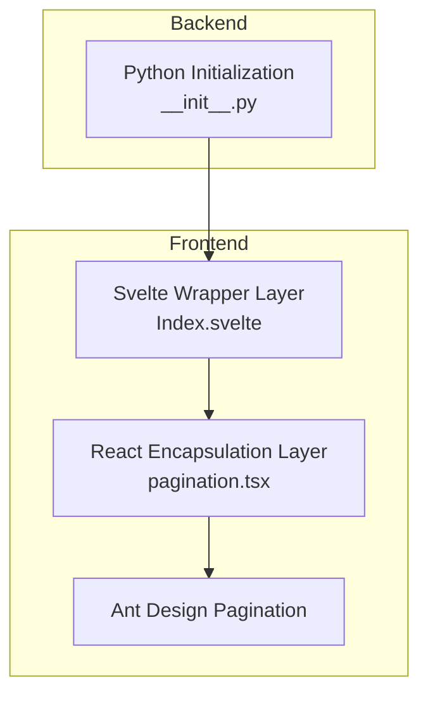
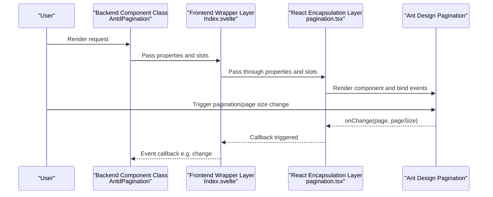
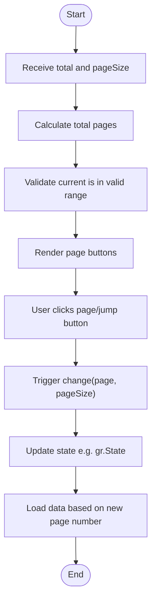
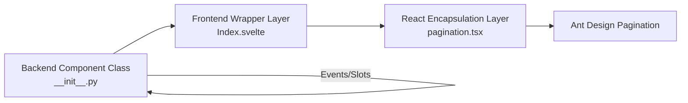

# Pagination

<cite>
**Files Referenced in This Document**
- [pagination.tsx](file://frontend/antd/pagination/pagination.tsx)
- [Index.svelte](file://frontend/antd/pagination/Index.svelte)
- [__init__.py](file://backend/modelscope_studio/components/antd/pagination/__init__.py)
- [basic.py](file://docs/components/antd/pagination/demos/basic.py)
- [data_changes.py](file://docs/components/antd/pagination/demos/data_changes.py)
- [README.md](file://docs/components/antd/pagination/README.md)
- [app.py](file://docs/components/antd/pagination/app.py)
- [table/__init__.py](file://backend/modelscope_studio/components/antd/table/__init__.py)
- [list/__init__.py](file://backend/modelscope_studio/components/antd/list/__init__.py)
</cite>

## Table of Contents

1. [Introduction](#introduction)
2. [Project Structure](#project-structure)
3. [Core Components](#core-components)
4. [Architecture Overview](#architecture-overview)
5. [Detailed Component Analysis](#detailed-component-analysis)
6. [Dependency Analysis](#dependency-analysis)
7. [Performance Considerations](#performance-considerations)
8. [Troubleshooting Guide](#troubleshooting-guide)
9. [Conclusion](#conclusion)
10. [Appendix](#appendix)

## Introduction

This document systematically introduces the implementation and usage of the Pagination component in the ModelScope Studio frontend and backend, covering the following topics:

- Data pagination mechanism: How to calculate page ranges and boundaries based on total item count and page size
- Page navigation logic: Clicking page numbers, quick jumper, previous/next page, first/last page
- Total count display: Displaying current range and total via the "show total" callback or property
- Configuration details: Page size settings, default page number, page size selector, quick jumper, simple mode, size, disabled state, single-page hiding, etc.
- Integration with data tables and list views: How to link pagination with tables/lists for data loading, state synchronization, and error handling
- Internationalization support, style customization, responsive adaptation
- Advanced usage: large data pagination, virtual scrolling, server-side pagination
- Complete examples and performance optimization recommendations

## Project Structure

The Pagination component consists of three parts:

- Frontend Svelte wrapper layer: Handles property pass-through, slot rendering, and visibility control
- Frontend React encapsulation layer: Connects to Ant Design's Pagination and supports slots and function-based rendering
- Backend Gradio component: Defines events, slots, property mappings, and render entry points

Diagram Sources

- [Index.svelte:1-68](file://frontend/antd/pagination/Index.svelte#L1-L68)
- [pagination.tsx:1-55](file://frontend/antd/pagination/pagination.tsx#L1-L55)
- [**init**.py:1-107](file://backend/modelscope_studio/components/antd/pagination/__init__.py#L1-L107)

Section Sources

- [Index.svelte:1-68](file://frontend/antd/pagination/Index.svelte#L1-L68)
- [pagination.tsx:1-55](file://frontend/antd/pagination/pagination.tsx#L1-L55)
- [**init**.py:1-107](file://backend/modelscope_studio/components/antd/pagination/__init__.py#L1-L107)

## Core Components

- Backend component class: Defines events, slots, property mappings, and render directory
- Frontend wrapper layer: Uniformly handles properties, class names, styles, visibility, and slots
- React encapsulation layer: Connects to Ant Design's Pagination, supporting custom rendering and slot injection

Key points

- Events: `change`, `showSizeChange`
- Slots: `showQuickJumper.goButton`, `itemRender`
- Property mapping: e.g., `show_size_change` → `showSizeChange`

Section Sources

- [**init**.py:14-25](file://backend/modelscope_studio/components/antd/pagination/__init__.py#L14-L25)
- [Index.svelte:22-48](file://frontend/antd/pagination/Index.svelte#L22-L48)
- [pagination.tsx:8-52](file://frontend/antd/pagination/pagination.tsx#L8-L52)

## Architecture Overview

The Pagination component call chain is as follows:

Diagram Sources

- [**init**.py:14-21](file://backend/modelscope_studio/components/antd/pagination/__init__.py#L14-L21)
- [Index.svelte:54-66](file://frontend/antd/pagination/Index.svelte#L54-L66)
- [pagination.tsx:36-38](file://frontend/antd/pagination/pagination.tsx#L36-L38)

## Detailed Component Analysis

### Configuration Options and Behavior

- Basic parameters
  - Total items: `total`
  - Default page number: `default_current`
  - Current page: `current`
  - Items per page: `default_page_size` / `page_size`
  - Page size options: `page_size_options`
  - Disabled: `disabled`
  - Hide on single page: `hide_on_single_page`
  - Size: `size` (small/default)
  - Alignment: `align` (start/center/end)
  - Simple mode: `simple`
  - Show title: `show_title`
  - Show fewer items: `show_less_items`
  - Responsive: `responsive`
  - Custom rendering: `item_render`
  - Show total: `show_total`
  - Quick jumper: `show_quick_jumper` (with optional `goButton` slot)
  - Show page size selector: `show_size_changer`
- Slots
  - `showQuickJumper.goButton`: Quick jump button
  - `itemRender`: Custom page number item rendering

Section Sources

- [**init**.py:26-88](file://backend/modelscope_studio/components/antd/pagination/__init__.py#L26-L88)
- [Index.svelte:46-47](file://frontend/antd/pagination/Index.svelte#L46-L47)
- [pagination.tsx:12-47](file://frontend/antd/pagination/pagination.tsx#L12-L47)

### Events and State Synchronization

- `change`: Triggered when page number or page size changes, returns (page, pageSize)
- `showSizeChange`: Triggered when page size changes
- Gradio state linkage: Write page number and page size to `gr.State` via event callbacks to drive data loading

Section Sources

- [**init**.py:14-21](file://backend/modelscope_studio/components/antd/pagination/__init__.py#L14-L21)
- [data_changes.py:6-11](file://docs/components/antd/pagination/demos/data_changes.py#L6-L11)

### Data Pagination Mechanism and Page Navigation Logic

- Calculation rules
  - Total pages: `Math.ceil(total / pageSize)`
  - Current page range: 1 to total pages
  - Boundary handling: `current` falls back to a valid value when out of range
- Navigation flow
  - Click page number: Triggers `change`
  - Previous/next/first/last page: Handled internally by Ant Design and triggers `change`
  - Quick jump: When `show_quick_jumper` is enabled and a `goButton` slot is provided, the slot button executes the jump
- Custom rendering
  - Use `itemRender` to customize page button content
  - Use `show_total` to display range/total on the left side of pagination

Diagram Sources

- [pagination.tsx:36-38](file://frontend/antd/pagination/pagination.tsx#L36-L38)
- [data_changes.py:6-11](file://docs/components/antd/pagination/demos/data_changes.py#L6-L11)

### Integration with Data Tables and List Views

- Table integration
  - Enable `pagination` in the table component and bind the pagination `change` event with the table data loading logic
  - Use `show_size_changer` to dynamically switch items per page, linked with table column width and row height
- List integration
  - List components support a `pagination` parameter that can directly accept a pagination instance
  - List's load-more (`load_more`) and pagination can be used separately or in combination
- State synchronization
  - Write pagination state to `gr.State` as input for subsequent data requests
  - Table/list `loading` state and pagination `disabled` state can be linked to avoid concurrent requests

Section Sources

- [table/**init**.py:114-133](file://backend/modelscope_studio/components/antd/table/__init__.py#L114-L133)
- [list/**init**.py:59-82](file://backend/modelscope_studio/components/antd/list/__init__.py#L59-L82)
- [data_changes.py:24-28](file://docs/components/antd/pagination/demos/data_changes.py#L24-L28)

### Internationalization, Style Customization, and Responsive Adaptation

- Internationalization
  - Provide locale via `ConfigProvider`; pagination text follows global configuration
- Style customization
  - Supports `elem_id`, `elem_classes`, `elem_style`, and `additional_props`
  - Theme-level customization via `root_class_name` and `class_names`/`styles`
- Responsive
  - When `responsive` is enabled, the component automatically adjusts layout and font size on small-screen devices

Section Sources

- [README.md:1-14](file://docs/components/antd/pagination/README.md#L1-L14)
- [Index.svelte:56-58](file://frontend/antd/pagination/Index.svelte#L56-L58)
- [**init**.py:49-50](file://backend/modelscope_studio/components/antd/pagination/__init__.py#L49-L50)

### Advanced Usage: Large Data Pagination, Virtual Scrolling, Server-side Pagination

- Large data pagination
  - Use a large `total` combined with a smaller `page_size` and reasonable `page_size_options`
  - Load data on demand via the `change` event to avoid rendering all data at once
- Virtual scrolling
  - Table components support a `virtual` parameter that can significantly improve rendering performance for large datasets
- Server-side pagination
  - Pagination only handles UI interaction; actual data is provided by backend APIs, with the frontend making requests in `change` and updating tables/lists
  - Combine `loading` state and disabled state to prevent duplicate requests

Section Sources

- [table/**init**.py:129-130](file://backend/modelscope_studio/components/antd/table/__init__.py#L129-L130)
- [data_changes.py:6-11](file://docs/components/antd/pagination/demos/data_changes.py#L6-L11)

### Examples and Best Practices

- Basic example
  - Demonstrates `total`, quick jumper, page size selector, and total count display
- Data change example
  - Write page number and page size to `gr.State` via `change` event, and show a notification on button click
- Best practices
  - Decouple pagination state from data requests using event-driven approach
  - Disable pagination during data loading to avoid concurrency
  - Set `page_size_options` reasonably to balance loading speed and user experience

Section Sources

- [basic.py:7-11](file://docs/components/antd/pagination/demos/basic.py#L7-L11)
- [data_changes.py:6-11](file://docs/components/antd/pagination/demos/data_changes.py#L6-L11)

## Dependency Analysis

- Component coupling
  - Backend component class and frontend wrapper layer are loosely coupled, communicating via properties and slots as contracts
  - React encapsulation layer's dependency on Ant Design is explicit, making it easy to upgrade and replace
- Events and slots
  - Events: `change`, `showSizeChange`
  - Slots: `showQuickJumper.goButton`, `itemRender`
- External dependencies
  - Ant Design Pagination
  - Gradio event system and state management

Diagram Sources

- [**init**.py:14-25](file://backend/modelscope_studio/components/antd/pagination/__init__.py#L14-L25)
- [Index.svelte:54-66](file://frontend/antd/pagination/Index.svelte#L54-L66)
- [pagination.tsx:28-48](file://frontend/antd/pagination/pagination.tsx#L28-L48)

Section Sources

- [**init**.py:14-25](file://backend/modelscope_studio/components/antd/pagination/__init__.py#L14-L25)
- [Index.svelte:54-66](file://frontend/antd/pagination/Index.svelte#L54-L66)
- [pagination.tsx:28-48](file://frontend/antd/pagination/pagination.tsx#L28-L48)

## Performance Considerations

- Rendering optimization
  - Use virtual scrolling (tables) to reduce DOM count
  - Control `page_size` to avoid excessive single-page rendering pressure
- Request optimization
  - Only make data requests on `change` to avoid frequent refreshes
  - Disable pagination during requests to prevent duplicate requests
- Styles and resources
  - Use `elem_classes` and style caching reasonably to reduce repaints
  - Avoid heavy computations in `itemRender`

## Troubleshooting Guide

- Issue: Pagination not triggering `change`
  - Check whether the `change` event is correctly bound
  - Confirm `total` and `page_size` settings are reasonable
- Issue: Page size switching not working
  - Check whether `show_size_changer` is enabled
  - Confirm `show_size_change` property mapping is correct
- Issue: Quick jump button not displaying
  - Check whether the `showQuickJumper.goButton` slot is provided
- Issue: Styles not taking effect
  - Check usage of `elem_id`, `elem_classes`, `elem_style`, and `root_class_name`
- Issue: Internationalization text anomalies
  - Confirm `ConfigProvider` is correctly configured with the locale

Section Sources

- [Index.svelte:46-47](file://frontend/antd/pagination/Index.svelte#L46-L47)
- [pagination.tsx:39-47](file://frontend/antd/pagination/pagination.tsx#L39-L47)
- [README.md:1-14](file://docs/components/antd/pagination/README.md#L1-L14)

## Conclusion

The Pagination component achieves a flexible pagination experience through clear frontend-backend separation and event/slot contracts. Combined with table and list components, high-performance, extensible data browsing interfaces can be easily built. For large dataset scenarios, combining virtual scrolling and server-side pagination strategies is recommended to ensure smooth interactions and efficient resource usage.

## Appendix

- Example entry
  - Documentation app entry: [app.py:1-7](file://docs/components/antd/pagination/app.py#L1-L7)
- Example scripts
  - Basic example: [basic.py:1-15](file://docs/components/antd/pagination/demos/basic.py#L1-L15)
  - Data change example: [data_changes.py:1-36](file://docs/components/antd/pagination/demos/data_changes.py#L1-L36)
- Component source code
  - Backend component class: [**init**.py:1-107](file://backend/modelscope_studio/components/antd/pagination/__init__.py#L1-L107)
  - Frontend wrapper layer: [Index.svelte:1-68](file://frontend/antd/pagination/Index.svelte#L1-L68)
  - React encapsulation layer: [pagination.tsx:1-55](file://frontend/antd/pagination/pagination.tsx#L1-L55)
