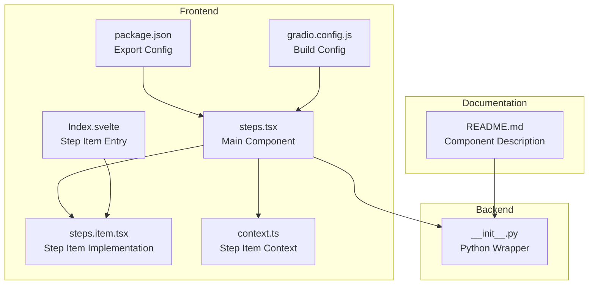
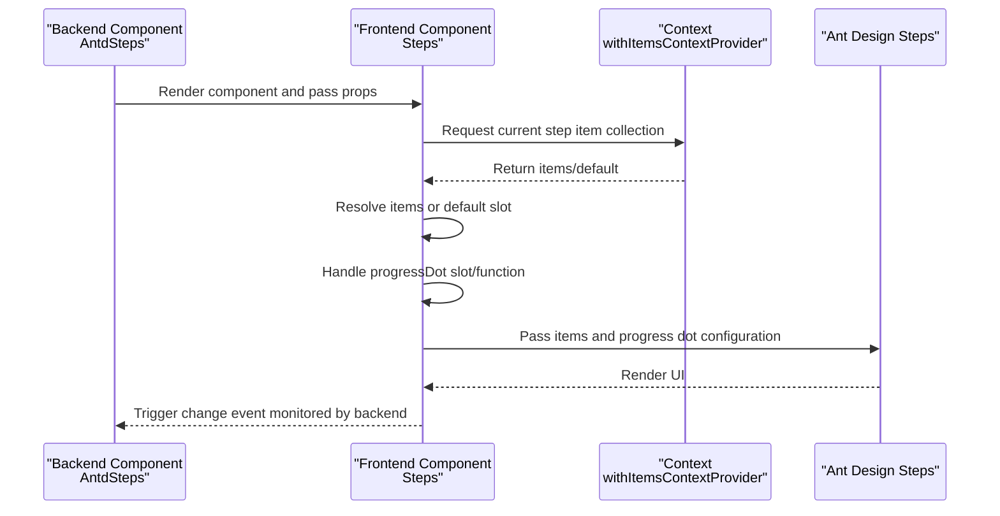
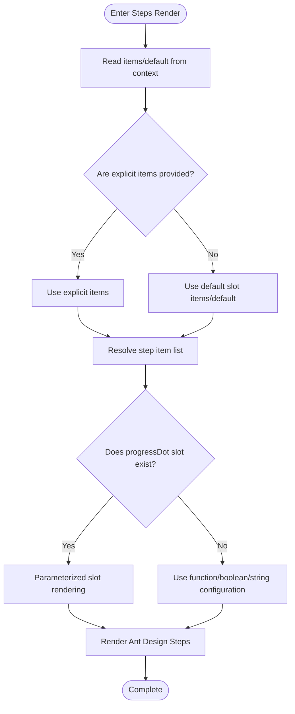
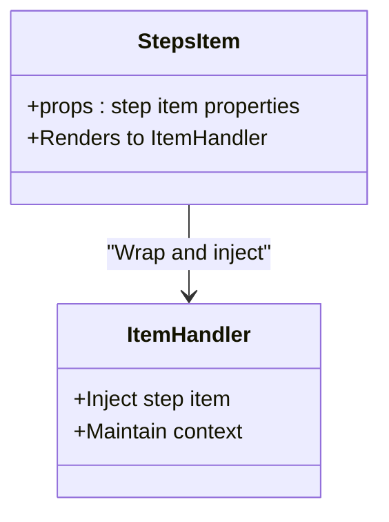
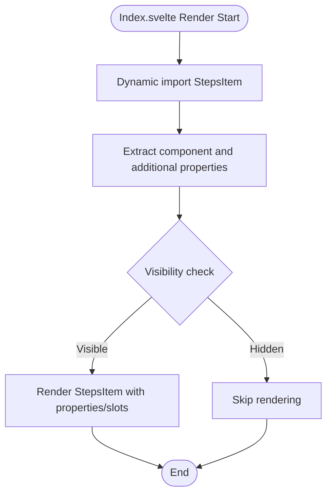
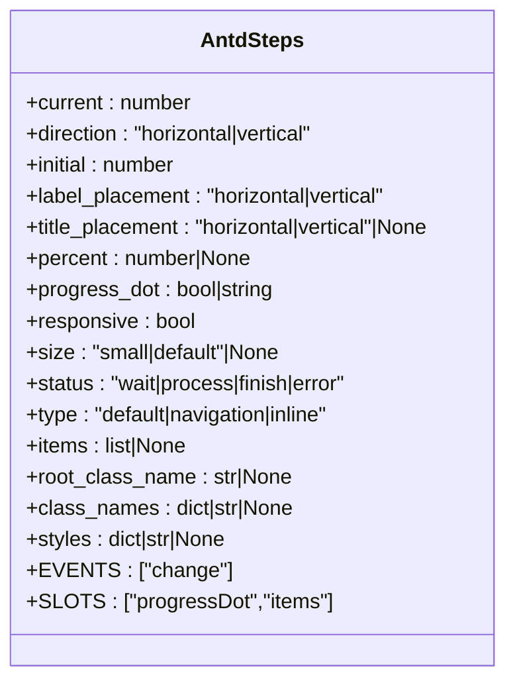
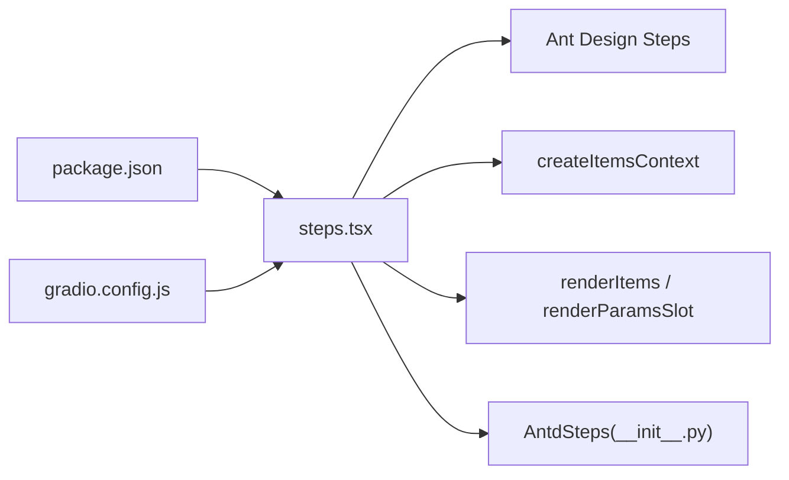

# Steps

<cite>
**Files Referenced in This Document**   
- [steps.tsx](file://frontend/antd/steps/steps.tsx)
- [steps.item.tsx](file://frontend/antd/steps/item/steps.item.tsx)
- [Index.svelte](file://frontend/antd/steps/item/Index.svelte)
- [context.ts](file://frontend/antd/steps/context.ts)
- [package.json](file://frontend/antd/steps/package.json)
- [gradio.config.js](file://frontend/antd/steps/gradio.config.js)
- [__init__.py](file://backend/modelscope_studio/components/antd/steps/__init__.py)
- [README.md](file://docs/components/antd/steps/README.md)
</cite>

## Table of Contents

1. [Introduction](#introduction)
2. [Project Structure](#project-structure)
3. [Core Components](#core-components)
4. [Architecture Overview](#architecture-overview)
5. [Detailed Component Analysis](#detailed-component-analysis)
6. [Dependency Analysis](#dependency-analysis)
7. [Performance Considerations](#performance-considerations)
8. [Troubleshooting Guide](#troubleshooting-guide)
9. [Conclusion](#conclusion)
10. [Appendix](#appendix)

## Introduction

The Steps component guides users through multiple stages in sequence within a task flow, serving as a typical process indicator component. This component is based on Ant Design's Steps implementation, provided in a form directly usable from the Python backend via Gradio/Svelte frontend bridging. It supports multiple layout modes (horizontal/vertical), size specifications (default/small), state management (wait/process/finish/error), and custom progress dot rendering (progressDot slot). The component also provides integration capabilities for form wizards, business processes, user registration, and other scenarios, with support for style customization and responsive adaptation.

## Project Structure

The Steps component consists of frontend Svelte components and backend ModelScope component wrappers, with frontend-backend interaction following Gradio component conventions. Key files are distributed as follows:

- Frontend: `steps.tsx` (main component), `steps.item.tsx` (step item wrapper), `Index.svelte` (step item entry), `context.ts` (step item context), `package.json` (export config), `gradio.config.js` (build config)
- Backend: `__init__.py` (Python wrapper, exposing properties and events)
- Documentation: `README.md` (component description and example placeholders)

**Diagram Sources**

- [steps.tsx:1-52](file://frontend/antd/steps/steps.tsx#L1-L52)
- [steps.item.tsx:1-14](file://frontend/antd/steps/item/steps.item.tsx#L1-L14)
- [Index.svelte:1-65](file://frontend/antd/steps/item/Index.svelte#L1-L65)
- [context.ts:1-7](file://frontend/antd/steps/context.ts#L1-L7)
- [package.json:1-15](file://frontend/antd/steps/package.json#L1-L15)
- [gradio.config.js:1-4](file://frontend/antd/steps/gradio.config.js#L1-L4)
- [**init**.py:1-95](file://backend/modelscope_studio/components/antd/steps/__init__.py#L1-L95)
- [README.md:1-8](file://docs/components/antd/steps/README.md#L1-L8)

**Section Sources**

- [steps.tsx:1-52](file://frontend/antd/steps/steps.tsx#L1-L52)
- [steps.item.tsx:1-14](file://frontend/antd/steps/item/steps.item.tsx#L1-L14)
- [Index.svelte:1-65](file://frontend/antd/steps/item/Index.svelte#L1-L65)
- [context.ts:1-7](file://frontend/antd/steps/context.ts#L1-L7)
- [package.json:1-15](file://frontend/antd/steps/package.json#L1-L15)
- [gradio.config.js:1-4](file://frontend/antd/steps/gradio.config.js#L1-L4)
- [**init**.py:1-95](file://backend/modelscope_studio/components/antd/steps/__init__.py#L1-L95)
- [README.md:1-8](file://docs/components/antd/steps/README.md#L1-L8)

## Core Components

- Main Component Steps (frontend): Responsible for receiving props, parsing slots (e.g., `progressDot`), merging items data sources (explicit items or slot items/default), and passing the final data to Ant Design's Steps.
- Step Item StepsItem (frontend): Serves as the React wrapper for step items, injecting step items into the Steps container through the ItemHandler context.
- Step Item Entry Index.svelte: Renders StepsItem in Svelte and handles properties such as visibility, class names, IDs, inline styles, and slots.
- Context: Provides `createItemsContext` capabilities to establish a stable parent-child relationship and data channel between Steps and StepsItem.
- Backend wrapper AntdSteps: Provides rich properties (`current`, `direction`, `size`, `status`, `type`, `responsive`, etc.) and declares supported slots (`progressDot`, `items`).

**Section Sources**

- [steps.tsx:10-49](file://frontend/antd/steps/steps.tsx#L10-L49)
- [steps.item.tsx:7-11](file://frontend/antd/steps/item/steps.item.tsx#L7-L11)
- [Index.svelte:16-64](file://frontend/antd/steps/item/Index.svelte#L16-L64)
- [context.ts:3-4](file://frontend/antd/steps/context.ts#L3-L4)
- [**init**.py:11-77](file://backend/modelscope_studio/components/antd/steps/__init__.py#L11-L77)

## Architecture Overview

The runtime control flow of the Steps component: the frontend Steps component reads the step item collection from context and resolves `items` or the default slot; if a `progressDot` slot exists, it renders via parameterized slot; otherwise falls back to function or boolean value form. Ant Design's Steps receives the final items and progress dot configuration, renders the UI, and triggers the `change` event (monitored by the backend).

**Diagram Sources**

- [steps.tsx:16-44](file://frontend/antd/steps/steps.tsx#L16-L44)
- [context.ts:3-4](file://frontend/antd/steps/context.ts#L3-L4)
- [**init**.py:16-20](file://backend/modelscope_studio/components/antd/steps/__init__.py#L16-L20)

**Section Sources**

- [steps.tsx:16-44](file://frontend/antd/steps/steps.tsx#L16-L44)
- [context.ts:3-4](file://frontend/antd/steps/context.ts#L3-L4)
- [**init**.py:16-20](file://backend/modelscope_studio/components/antd/steps/__init__.py#L16-L20)

## Detailed Component Analysis

### Steps Main Component (Steps)

- Functional responsibilities
  - Receives all available props for Ant Design Steps and extends children support.
  - Reads step item collection from context; prefers explicit items, then uses default slot items/default.
  - Progress dot configuration supports two forms: slot `progressDot` (parameterized rendering) or function/boolean value.
  - Uses `useMemo` to stabilize items, avoiding unnecessary re-renders.
- Key behaviors
  - Hides children (`display: none`) to avoid duplicate rendering; actual content is injected via slots.
  - `progressDot` priority: uses slot rendering if a slot exists; otherwise uses function or native boolean/string configuration.
- Typical usage
  - Directly pass a steps array in `items`, or inject step items via slots.
  - Use the `progressDot` slot to customize the rendering logic of each step indicator.

**Diagram Sources**

- [steps.tsx:18-44](file://frontend/antd/steps/steps.tsx#L18-L44)

**Section Sources**

- [steps.tsx:10-49](file://frontend/antd/steps/steps.tsx#L10-L49)

### Step Item (StepsItem)

- Functional responsibilities
  - Serves as the React wrapper for step items, combining step item properties with context, handed to `ItemHandler`.
  - Bridges TypeScript/React components to the Svelte ecosystem via `sveltify`.
- Integration key points
  - Works with Steps context to ensure step items are correctly injected into the container.
  - Supports additional property pass-through and internal index (`itemIndex`) passing.

**Diagram Sources**

- [steps.item.tsx:7-11](file://frontend/antd/steps/item/steps.item.tsx#L7-L11)
- [context.ts:3-4](file://frontend/antd/steps/context.ts#L3-L4)

**Section Sources**

- [steps.item.tsx:7-11](file://frontend/antd/steps/item/steps.item.tsx#L7-L11)
- [context.ts:3-4](file://frontend/antd/steps/context.ts#L3-L4)

### Step Item Entry (Index.svelte)

- Functional responsibilities
  - Dynamically imports StepsItem in Svelte and renders it.
  - Handles visibility, class names, IDs, inline styles, slots, and other properties.
  - Injects child nodes into StepsItem via `{@render children()}`.
- Design key points
  - Uses `getProps`/`processProps` to retrieve and filter internal properties that don't need pass-through.
  - Gets the slot key via `getSlotKey` and passes it to StepsItem for slot identification.

**Diagram Sources**

- [Index.svelte:16-64](file://frontend/antd/steps/item/Index.svelte#L16-L64)

**Section Sources**

- [Index.svelte:1-65](file://frontend/antd/steps/item/Index.svelte#L1-L65)

### Backend Wrapper (AntdSteps)

- Property overview (selected)
  - Current step `current`, direction `direction` (horizontal/vertical), initial value `initial`, label position `label_placement`, title position `title_placement`, percentage `percent`, progress dot `progress_dot`, responsive `responsive`, size `size` (small/default), status `status` (wait/process/finish/error), type `type` (default/navigation/inline), root class name `root_class_name`, class names `class_names`, styles `styles`, slots `items`/`progressDot`, etc.
- Events
  - `change`: Listens for step change events (bound by the backend).
- Others
  - `FRONTEND_DIR` points to the frontend steps component directory.
  - `skip_api` is `True`, indicating the component does not participate in the standard API flow.

**Diagram Sources**

- [**init**.py:25-77](file://backend/modelscope_studio/components/antd/steps/__init__.py#L25-L77)

**Section Sources**

- [**init**.py:11-77](file://backend/modelscope_studio/components/antd/steps/__init__.py#L11-L77)

## Dependency Analysis

- Frontend dependencies
  - Uses Ant Design's Steps as the underlying UI component.
  - Bridges React components to Svelte via `sveltify`.
  - Provides step item context via `createItemsContext`.
  - Renders step items and slots using `renderItems`/`renderParamsSlot`.
- Backend dependencies
  - Interacts with Gradio via `ModelScopeLayoutComponent`.
  - Specifies the frontend component directory via `resolve_frontend_dir`.
- Exports and build
  - `package.json` specifies Gradio and default export paths.
  - `gradio.config.js` performs build configuration based on global `defineConfig`.

**Diagram Sources**

- [package.json:4-12](file://frontend/antd/steps/package.json#L4-L12)
- [gradio.config.js:1-4](file://frontend/antd/steps/gradio.config.js#L1-L4)
- [steps.tsx:1-8](file://frontend/antd/steps/steps.tsx#L1-L8)
- [**init**.py:77-77](file://backend/modelscope_studio/components/antd/steps/__init__.py#L77-L77)

**Section Sources**

- [package.json:1-15](file://frontend/antd/steps/package.json#L1-L15)
- [gradio.config.js:1-4](file://frontend/antd/steps/gradio.config.js#L1-L4)
- [steps.tsx:1-8](file://frontend/antd/steps/steps.tsx#L1-L8)
- [**init**.py:77-77](file://backend/modelscope_studio/components/antd/steps/__init__.py#L77-L77)

## Performance Considerations

- Data stabilization: Uses `useMemo` to stabilize items, reducing unnecessary re-renders.
- Slot rendering: The `progressDot` slot uses parameterized rendering to avoid repeatedly creating complex structures in each render.
- Visibility control: The step item entry checks `visible` to hide invisible items, reducing DOM overhead.
- Event binding: Binds the `change` event only when needed, avoiding unnecessary callback triggers.

[This section contains general performance advice and does not require specific file references]

## Troubleshooting Guide

- Issue: Step items not displaying
  - Check whether Steps has correctly injected `items` or slot `items/default`.
  - Confirm the step item's `visible` property is true.
- Issue: Progress dots not rendering as expected
  - If using the `progressDot` slot, confirm the slot key matches the component conventions.
  - If using function/boolean value, confirm the passed configuration matches Ant Design's expectations.
- Issue: Styles or class names not taking effect
  - Check whether `root_class_name`, `class_names`, `styles` are correctly passed.
  - Confirm CSS scope and override rules.
- Issue: Responsive layout anomalies
  - Check whether the combination of `responsive` and `direction` is as expected.
  - Confirm parent container width and breakpoint settings.

**Section Sources**

- [steps.tsx:20-44](file://frontend/antd/steps/steps.tsx#L20-L44)
- [Index.svelte:49-64](file://frontend/antd/steps/item/Index.svelte#L49-L64)
- [**init**.py:25-77](file://backend/modelscope_studio/components/antd/steps/__init__.py#L25-L77)

## Conclusion

The Steps component achieves complete wrapping and extension of Ant Design Steps through a clear frontend-backend layered design. It supports multiple layouts, multiple states, customizable progress dots, and responsive adaptation, suitable for form wizards, business processes, user registration, and other scenarios. Through context and slot mechanisms, the component has good composability and maintainability.

[This section contains summary content and does not require specific file references]

## Appendix

### Step Item (Item) Configuration Options

- Basic properties
  - Title: Text for the step item title.
  - Description: Description text for the step item.
  - Icon: Icon element for the step item.
- State and behavior
  - Status: `wait`, `process`, `finish`, `error`, indicating the current state of the step.
  - Visibility: `visible` controls whether the step item is rendered.
  - Internal index: `itemIndex` identifies the step item's position in the list.
- Slots and styles
  - Slots: Support injecting custom content via slots.
  - Class names and IDs: `elem_classes`, `elem_id` for styling and positioning.
  - Inline styles: `elem_style` for local style overrides.

**Section Sources**

- [Index.svelte:16-64](file://frontend/antd/steps/item/Index.svelte#L16-L64)
- [steps.item.tsx:7-11](file://frontend/antd/steps/item/steps.item.tsx#L7-L11)

### Layout Modes and Application Scenarios

- Horizontal steps bar (horizontal)
  - Suitable for linear processes such as form wizards and payment flows.
- Vertical steps bar (vertical)
  - Suitable for long processes or scenarios emphasizing chronological order.
- Small steps bar (small)
  - Suitable for space-constrained or simplified interfaces.

**Section Sources**

- [**init**.py:30-39](file://backend/modelscope_studio/components/antd/steps/__init__.py#L30-L39)

### Integration with Form Wizards, Business Processes, and User Registration

- Form wizards
  - Use `current` and `status` to control the current step and state; synchronize backend state via `change` events.
- Business processes
  - Use `direction` and `responsive` for process visualization; use `progress_dot` to customize process nodes.
- User registration
  - Use `size` and `type` to switch between different styles; use `items` and slots to organize registration steps.

**Section Sources**

- [**init**.py:25-77](file://backend/modelscope_studio/components/antd/steps/__init__.py#L25-L77)
- [steps.tsx:16-44](file://frontend/antd/steps/steps.tsx#L16-L44)

### Style Customization and Responsive Adaptation

- Style customization
  - Use `root_class_name`, `class_names`, `styles` for overall and local style control.
  - Granularly control step item appearance via `elem_classes`, `elem_id`, `elem_style`.
- Responsive adaptation
  - Use the combination of `responsive` and `direction` to adapt for mobile and desktop layouts.

**Section Sources**

- [**init**.py:40-77](file://backend/modelscope_studio/components/antd/steps/__init__.py#L40-L77)
- [Index.svelte:52-58](file://frontend/antd/steps/item/Index.svelte#L52-L58)

### Usage Examples and Best Practices

- Example references
  - The documentation provides basic example placeholders; combine with `AntdSteps` properties and slots for demonstrations.
- Best practices
  - Clearly define step states and navigation logic to avoid state confusion.
  - Use the `progress_dot` slot judiciously to maintain visual consistency.
  - Break down steps for complex processes to improve user experience.

**Section Sources**

- [README.md:1-8](file://docs/components/antd/steps/README.md#L1-L8)
- [**init**.py:25-77](file://backend/modelscope_studio/components/antd/steps/__init__.py#L25-L77)
