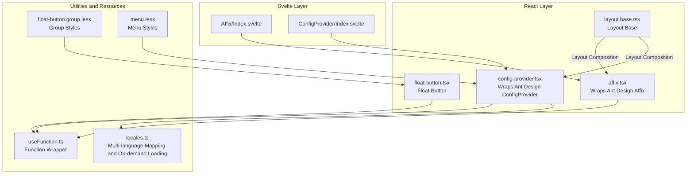
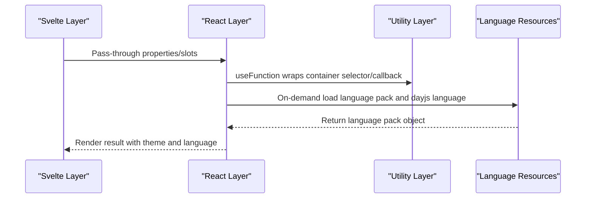
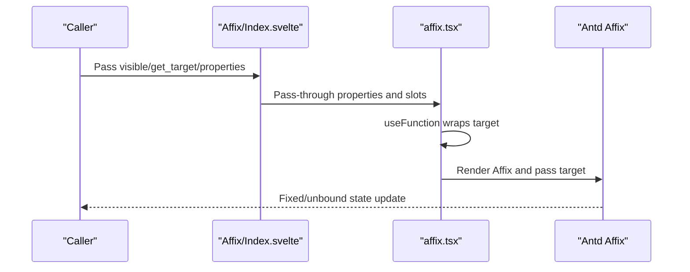
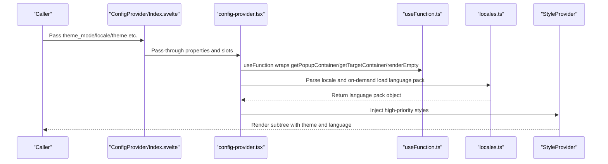
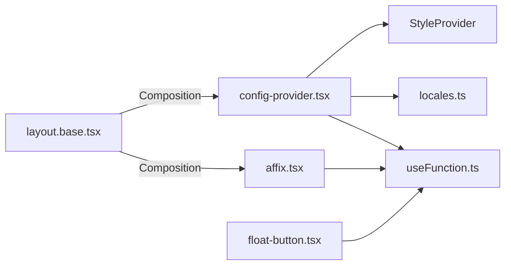

# Other Components

<cite>
**Files referenced in this document**
- [frontend/antd/affix/affix.tsx](file://frontend/antd/affix/affix.tsx)
- [frontend/antd/affix/Index.svelte](file://frontend/antd/affix/Index.svelte)
- [frontend/antd/config-provider/config-provider.tsx](file://frontend/antd/config-provider/config-provider.tsx)
- [frontend/antd/config-provider/locales.ts](file://frontend/antd/config-provider/locales.ts)
- [frontend/antd/config-provider/Index.svelte](file://frontend/antd/config-provider/Index.svelte)
- [frontend/antd/float-button/float-button.tsx](file://frontend/antd/float-button/float-button.tsx)
- [frontend/antd/layout/layout.base.tsx](file://frontend/antd/layout/layout.base.tsx)
- [frontend/antd/float-button/group/float-button.group.less](file://frontend/antd/float-button/group/float-button.group.less)
- [frontend/antd/menu/menu.less](file://frontend/antd/menu/menu.less)
- [frontend/utils/hooks/useFunction.ts](file://frontend/utils/hooks/useFunction.ts)
</cite>

## Table of Contents

1. [Introduction](#introduction)
2. [Project Structure](#project-structure)
3. [Core Components](#core-components)
4. [Architecture Overview](#architecture-overview)
5. [Detailed Component Analysis](#detailed-component-analysis)
6. [Dependency Analysis](#dependency-analysis)
7. [Performance Considerations](#performance-considerations)
8. [Troubleshooting Guide](#troubleshooting-guide)
9. [Conclusion](#conclusion)
10. [Appendix](#appendix)

## Introduction

This chapter focuses on the "Other Components" scenario of Ant Design Studio, covering two types of auxiliary components: Affix and ConfigProvider. We will systematically explain positioning mechanisms, scroll monitoring and boundary handling, as well as theme customization, language switching, and component default configuration, combining real implementations from the repository to provide actionable application scenarios, performance optimization and memory management suggestions, and best practices for component collaboration.

## Project Structure

- Frontend uses Svelte + React hybrid encapsulation mode: Svelte layer handles property/slot pass-through and conditional rendering, React layer handles specific UI behaviors (such as Affix, ConfigProvider, etc.).
- Utility layer provides common capabilities, such as converting external functions into function wrappers that can be safely used in React.
- Style layer ensures theme and prefix isolation through CSS-in-JS StyleProvider, avoiding global pollution.

Diagram Source

- [frontend/antd/affix/Index.svelte:1-72](file://frontend/antd/affix/Index.svelte#L1-L72)
- [frontend/antd/affix/affix.tsx:1-14](file://frontend/antd/affix/affix.tsx#L1-L14)
- [frontend/antd/config-provider/Index.svelte:1-72](file://frontend/antd/config-provider/Index.svelte#L1-L72)
- [frontend/antd/config-provider/config-provider.tsx:1-154](file://frontend/antd/config-provider/config-provider.tsx#L1-L154)
- [frontend/antd/float-button/float-button.tsx:1-75](file://frontend/antd/float-button/float-button.tsx#L1-L75)
- [frontend/antd/layout/layout.base.tsx:1-40](file://frontend/antd/layout/layout.base.tsx#L1-L40)
- [frontend/utils/hooks/useFunction.ts:1-13](file://frontend/utils/hooks/useFunction.ts#L1-L13)
- [frontend/antd/config-provider/locales.ts:1-863](file://frontend/antd/config-provider/locales.ts#L1-L863)
- [frontend/antd/float-button/group/float-button.group.less:1-31](file://frontend/antd/float-button/group/float-button.group.less#L1-L31)
- [frontend/antd/menu/menu.less:1-45](file://frontend/antd/menu/menu.less#L1-L45)

Section Source

- [frontend/antd/affix/Index.svelte:1-72](file://frontend/antd/affix/Index.svelte#L1-L72)
- [frontend/antd/config-provider/Index.svelte:1-72](file://frontend/antd/config-provider/Index.svelte#L1-L72)
- [frontend/antd/affix/affix.tsx:1-14](file://frontend/antd/affix/affix.tsx#L1-L14)
- [frontend/antd/config-provider/config-provider.tsx:1-154](file://frontend/antd/config-provider/config-provider.tsx#L1-L154)
- [frontend/antd/float-button/float-button.tsx:1-75](file://frontend/antd/float-button/float-button.tsx#L1-L75)
- [frontend/antd/layout/layout.base.tsx:1-40](file://frontend/antd/layout/layout.base.tsx#L1-L40)
- [frontend/utils/hooks/useFunction.ts:1-13](file://frontend/utils/hooks/useFunction.ts#L1-L13)
- [frontend/antd/config-provider/locales.ts:1-863](file://frontend/antd/config-provider/locales.ts#L1-L863)
- [frontend/antd/float-button/group/float-button.group.less:1-31](file://frontend/antd/float-button/group/float-button.group.less#L1-L31)
- [frontend/antd/menu/menu.less:1-45](file://frontend/antd/menu/menu.less#L1-L45)

## Core Components

- Affix
  - Positioning Mechanism: Calculates element fixed state based on target container scroll position; supports custom target containers (such as page or a scroll area).
  - Boundary Handling: Controls fixed/unbind timing through threshold to avoid elements being incorrectly fixed or prematurely unbound.
  - Scroll Monitoring: Converts externally passed container selectors into React-usable callbacks through function wrappers.
- ConfigProvider
  - Theme Customization: Supports light/dark mode and compact algorithm switch, dynamically combining algorithm lists to achieve theme switching.
  - Language Switching: According to browser or specified language, asynchronously loads Antd language pack and dayjs language pack on demand.
  - Component Default Configuration: Uniformly encapsulates global behaviors like getPopupContainer, getTargetContainer, renderEmpty, etc.
  - Style Isolation: Injects high-priority styles through CSS-in-JS StyleProvider to avoid style conflicts.

Section Source

- [frontend/antd/affix/affix.tsx:1-14](file://frontend/antd/affix/affix.tsx#L1-L14)
- [frontend/antd/config-provider/config-provider.tsx:1-154](file://frontend/antd/config-provider/config-provider.tsx#L1-L154)
- [frontend/antd/config-provider/locales.ts:1-863](file://frontend/antd/config-provider/locales.ts#L1-L863)

## Architecture Overview

The diagram below shows the interaction relationship between Svelte and React layers, as well as ConfigProvider's extension points in theme and language aspects.

Diagram Source

- [frontend/antd/affix/Index.svelte:1-72](file://frontend/antd/affix/Index.svelte#L1-L72)
- [frontend/antd/affix/affix.tsx:1-14](file://frontend/antd/affix/affix.tsx#L1-L14)
- [frontend/antd/config-provider/Index.svelte:1-72](file://frontend/antd/config-provider/Index.svelte#L1-L72)
- [frontend/antd/config-provider/config-provider.tsx:1-154](file://frontend/antd/config-provider/config-provider.tsx#L1-L154)
- [frontend/antd/config-provider/locales.ts:1-863](file://frontend/antd/config-provider/locales.ts#L1-L863)
- [frontend/utils/hooks/useFunction.ts:1-13](file://frontend/utils/hooks/useFunction.ts#L1-L13)

## Detailed Component Analysis

### Affix Component

- Design Points
  - Svelte layer handles conditional rendering and property pass-through, supports visible for display control.
  - React layer converts externally passed container selectors into React-executable functions through useFunction, ensuring stable and reliable scroll monitoring.
  - Supports slots and child node rendering for carrying complex content in fixed state.
- Key Flow
  - Property Processing: Maps get_target to target, handled internally by the Affix component.
  - Rendering: Only renders when visible is true, reducing unnecessary DOM overhead.
- Usage Suggestions
  - For non-window scroll containers, be sure to explicitly pass the target function to point to the correct container.
  - Set thresholds reasonably to avoid jitter caused by frequent switching between fixed/unbound states.

Diagram Source

- [frontend/antd/affix/Index.svelte:1-72](file://frontend/antd/affix/Index.svelte#L1-L72)
- [frontend/antd/affix/affix.tsx:1-14](file://frontend/antd/affix/affix.tsx#L1-L14)

Section Source

- [frontend/antd/affix/Index.svelte:1-72](file://frontend/antd/affix/Index.svelte#L1-L72)
- [frontend/antd/affix/affix.tsx:1-14](file://frontend/antd/affix/affix.tsx#L1-L14)
- [frontend/utils/hooks/useFunction.ts:1-13](file://frontend/utils/hooks/useFunction.ts#L1-L13)

### ConfigProvider Component

- Design Points
  - Theme: Dynamically combines algorithms through themeMode and theme.algorithm, supporting dark and compact modes.
  - Language: Automatically maps to available language sets based on locale, asynchronously loads Antd language pack and dayjs language pack on demand.
  - Container: Uniformly provides function wrappers for getPopupContainer and getTargetContainer, ensuring popups and overlays render to the correct container.
  - Slots: Supports slot parameters like renderEmpty, implemented through renderParamsSlot for flexible extension.
  - Styles: Injects high-priority styles through StyleProvider to avoid style conflicts.
- Key Flow
  - Language Initialization: Parses browser language or passed locale into standard format and loads corresponding language pack.
  - Theme Initialization: Generates algorithm array based on themeMode and user configuration, passes to Ant Design.
  - Container Callback: Uses useFunction to wrap callbacks, ensuring stable operation within React lifecycle.
  - Slot Rendering: Wraps slot content as ReactSlot or renderParamsSlot, maintaining type safety.

Diagram Source

- [frontend/antd/config-provider/Index.svelte:1-72](file://frontend/antd/config-provider/Index.svelte#L1-L72)
- [frontend/antd/config-provider/config-provider.tsx:1-154](file://frontend/antd/config-provider/config-provider.tsx#L1-L154)
- [frontend/antd/config-provider/locales.ts:1-863](file://frontend/antd/config-provider/locales.ts#L1-L863)
- [frontend/utils/hooks/useFunction.ts:1-13](file://frontend/utils/hooks/useFunction.ts#L1-L13)

Section Source

- [frontend/antd/config-provider/Index.svelte:1-72](file://frontend/antd/config-provider/Index.svelte#L1-L72)
- [frontend/antd/config-provider/config-provider.tsx:1-154](file://frontend/antd/config-provider/config-provider.tsx#L1-L154)
- [frontend/antd/config-provider/locales.ts:1-863](file://frontend/antd/config-provider/locales.ts#L1-L863)
- [frontend/utils/hooks/useFunction.ts:1-13](file://frontend/utils/hooks/useFunction.ts#L1-L13)

### FloatButton and Layout.Base

- FloatButton
  - Supports slots like icon/description/tooltip/badge, implemented through ReactSlot for flexible rendering.
  - tooltip supports object configuration and callback wrapping, ensuring popup container and callback stability.
- Layout.Base
  - Dynamically selects Header/Footer/Content/Layout through component type selector, unifies class name prefix for easy style control.

Section Source

- [frontend/antd/float-button/float-button.tsx:1-75](file://frontend/antd/float-button/float-button.tsx#L1-L75)
- [frontend/antd/layout/layout.base.tsx:1-40](file://frontend/antd/layout/layout.base.tsx#L1-L40)

## Dependency Analysis

- Component Coupling
  - Both Affix and ConfigProvider depend on useFunction for function wrapping, reducing cross-layer call risks.
  - ConfigProvider depends on language mapping and on-demand loading capabilities provided by locales.ts.
- External Dependencies
  - Ant Design component library and dayjs language packs.
  - CSS-in-JS StyleProvider for style isolation and priority control.
- Potential Circular Dependencies
  - No direct circular dependencies in current implementation; if business side re-introduces ConfigProvider/Affix in slots, carefully control rendering levels.

Diagram Source

- [frontend/antd/affix/affix.tsx:1-14](file://frontend/antd/affix/affix.tsx#L1-L14)
- [frontend/antd/config-provider/config-provider.tsx:1-154](file://frontend/antd/config-provider/config-provider.tsx#L1-L154)
- [frontend/antd/config-provider/locales.ts:1-863](file://frontend/antd/config-provider/locales.ts#L1-L863)
- [frontend/antd/float-button/float-button.tsx:1-75](file://frontend/antd/float-button/float-button.tsx#L1-L75)
- [frontend/antd/layout/layout.base.tsx:1-40](file://frontend/antd/layout/layout.base.tsx#L1-L40)
- [frontend/utils/hooks/useFunction.ts:1-13](file://frontend/utils/hooks/useFunction.ts#L1-L13)

Section Source

- [frontend/antd/affix/affix.tsx:1-14](file://frontend/antd/affix/affix.tsx#L1-L14)
- [frontend/antd/config-provider/config-provider.tsx:1-154](file://frontend/antd/config-provider/config-provider.tsx#L1-L154)
- [frontend/antd/config-provider/locales.ts:1-863](file://frontend/antd/config-provider/locales.ts#L1-L863)
- [frontend/antd/float-button/float-button.tsx:1-75](file://frontend/antd/float-button/float-button.tsx#L1-L75)
- [frontend/antd/layout/layout.base.tsx:1-40](file://frontend/antd/layout/layout.base.tsx#L1-L40)
- [frontend/utils/hooks/useFunction.ts:1-13](file://frontend/utils/hooks/useFunction.ts#L1-L13)

## Performance Considerations

- Scroll Monitoring and Repaint
  - Affix's target should point to minimized scroll containers as much as possible to avoid pressure on full-page scrolling.
  - Set thresholds and fixed heights reasonably to reduce reflow and repaint caused by frequent switching.
- Language Pack On-demand Loading
  - ConfigProvider only triggers language pack loading when locale changes, avoiding repeated requests.
  - dayjs language pack and Antd language pack are loaded asynchronously, note network and caching strategies.
- Function Wrapping and Stability
  - Use useFunction to wrap callbacks to avoid new functions being generated on each render causing unnecessary child component updates.
- Style Injection
  - StyleProvider high-priority injection reduces style override costs; avoid frequent theme switching in hot paths.

## Troubleshooting Guide

- Affix not working
  - Check whether the target function is correctly passed, or whether updates are not triggered when container scrolls.
  - Confirm visible condition is satisfied and container has scrollbar.
- Language switching ineffective
  - Check whether locale has a mapping in locales.ts; confirm asynchronous loading succeeded.
  - Ensure dayjs.locale switching succeeded.
- Theme switching abnormal
  - Check whether themeMode and theme.algorithm combination is as expected.
  - Note algorithm array concatenation order and null value filtering.
- Slot rendering issues
  - Confirm slot key and renderParamsSlot mapping consistency.
  - ReactSlot's clone parameter should be enabled as needed to avoid duplicate mounting.

Section Source

- [frontend/antd/affix/affix.tsx:1-14](file://frontend/antd/affix/affix.tsx#L1-L14)
- [frontend/antd/config-provider/config-provider.tsx:1-154](file://frontend/antd/config-provider/config-provider.tsx#L1-L154)
- [frontend/antd/config-provider/locales.ts:1-863](file://frontend/antd/config-provider/locales.ts#L1-L863)

## Conclusion

- Affix and ConfigProvider, as auxiliary components, undertake the key responsibilities of "positioning and scrolling" and "theme and language" in Ant Design Studio.
- Through layered encapsulation of Svelte and React, both usability and powerful extensibility are guaranteed.
- In actual projects, it is recommended to prioritize using ConfigProvider for global unified configuration at the application root, then use Affix locally on pages that need fixed layouts or toolbars.

## Appendix

- Best Practices for Component Collaboration
  - Place ConfigProvider at the application root to centrally manage theme and language; use Affix locally on pages that need fixed elements.
  - Use Layout.Base to unify layout structure, combined with FloatButton to improve interaction efficiency.
  - For complex slot scenarios, prefer using ReactSlot and renderParamsSlot to ensure type safety and controllable rendering.
- Styles and Themes
  - Avoid style conflicts through StyleProvider and prefix class names (like ms-gr-ant).
  - Menu and float button style files can be used as references, adjust border-radius, spacing, and transition effects as needed.
