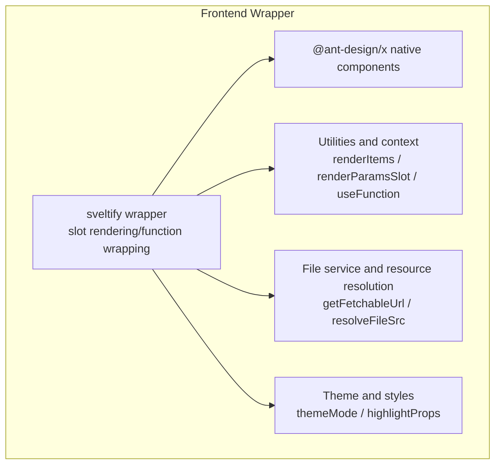
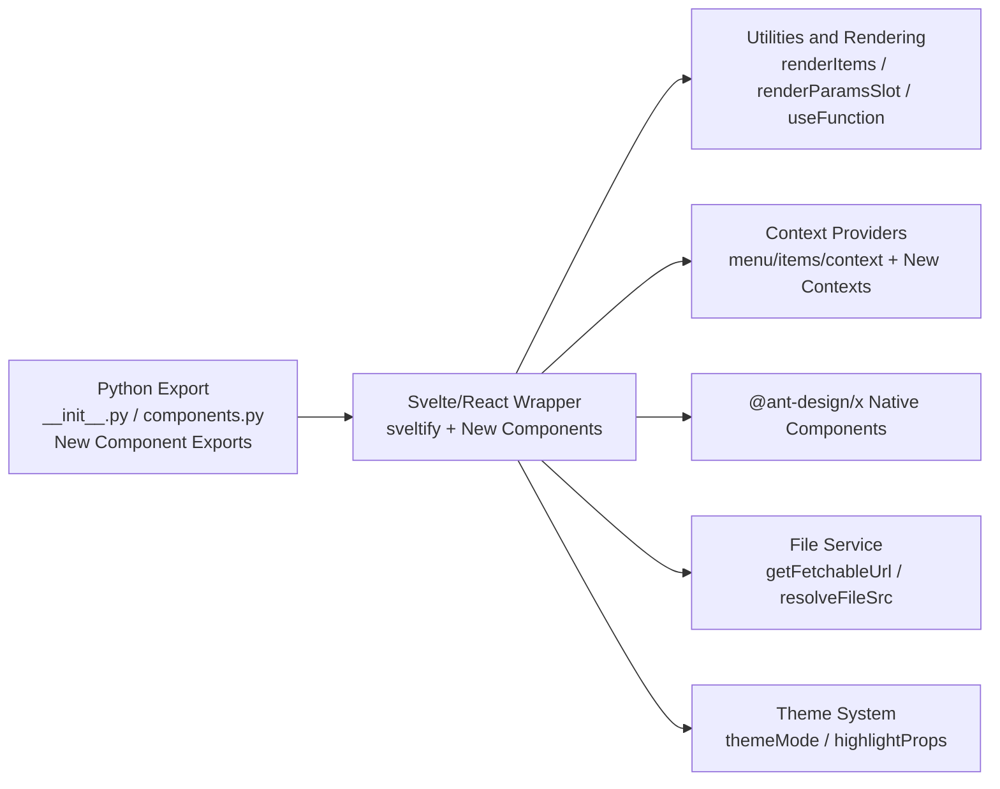
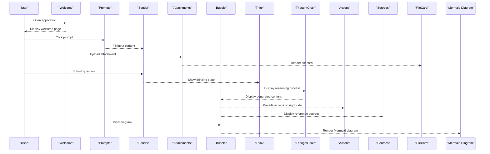

# Ant Design X Components

<cite>
**Files referenced in this document**
- [backend/modelscope_studio/components/antdx/__init__.py](file://backend/modelscope_studio/components/antdx/__init__.py)
- [backend/modelscope_studio/components/antdx/components.py](file://backend/modelscope_studio/components/antdx/components.py)
- [backend/modelscope_studio/components/antdx/file_card/__init__.py](file://backend/modelscope_studio/components/antdx/file_card/__init__.py)
- [backend/modelscope_studio/components/antdx/file_card/list/__init__.py](file://backend/modelscope_studio/components/antdx/file_card/list/__init__.py)
- [backend/modelscope_studio/components/antdx/file_card/list/item/__init__.py](file://backend/modelscope_studio/components/antdx/file_card/list/item/__init__.py)
- [backend/modelscope_studio/components/antdx/mermaid/__init__.py](file://backend/modelscope_studio/components/antdx/mermaid/__init__.py)
- [backend/modelscope_studio/components/antdx/folder/directory_icon/__init__.py](file://backend/modelscope_studio/components/antdx/folder/directory_icon/__init__.py)
- [backend/modelscope_studio/components/antdx/folder/tree_node/__init__.py](file://backend/modelscope_studio/components/antdx/folder/tree_node/__init__.py)
- [frontend/antdx/file-card/file-card.tsx](file://frontend/antdx/file-card/file-card.tsx)
- [frontend/antdx/file-card/base.tsx](file://frontend/antdx/file-card/base.tsx)
- [frontend/antdx/mermaid/mermaid.tsx](file://frontend/antdx/mermaid/mermaid.tsx)
- [frontend/antdx/folder/folder.tsx](file://frontend/antdx/folder/folder.tsx)
- [frontend/antdx/thought-chain/thought-chain.tsx](file://frontend/antdx/thought-chain/thought-chain.tsx)
- [frontend/antdx/bubble/bubble.tsx](file://frontend/antdx/bubble/bubble.tsx)
- [frontend/antdx/conversations/conversations.tsx](file://frontend/antdx/conversations/conversations.tsx)
- [frontend/antdx/welcome/welcome.tsx](file://frontend/antdx/welcome/welcome.tsx)
- [frontend/antdx/prompts/prompts.tsx](file://frontend/antdx/prompts/prompts.tsx)
- [frontend/antdx/attachments/attachments.tsx](file://frontend/antdx/attachments/attachments.tsx)
- [frontend/antdx/sender/sender.tsx](file://frontend/antdx/sender/sender.tsx)
- [frontend/antdx/suggestion/suggestion.tsx](file://frontend/antdx/suggestion/suggestion.tsx)
- [frontend/antdx/actions/actions.tsx](file://frontend/antdx/actions/actions.tsx)
- [frontend/antdx/think/think.tsx](file://frontend/antdx/think/think.tsx)
- [frontend/antdx/notification/notification.tsx](file://frontend/antdx/notification/notification.tsx)
- [frontend/antdx/sources/sources.tsx](file://frontend/antdx/sources/sources.tsx)
</cite>

## Update Summary

**Changes Made**

- Added file card component system (FileCard, FileCardList, FileCardListItem)
- Added Mermaid diagram component
- Added folder component (Folder) and its subcomponents (DirectoryIcon, TreeNode)
- Added thought chain component (ThoughtChain) and its subcomponents
- Updated component export structure to sync with Ant Design X version
- Enhanced component collaboration capabilities, supporting richer slot-based rendering

## Table of Contents

1. [Introduction](#introduction)
2. [Project Structure](#project-structure)
3. [Core Components](#core-components)
4. [Architecture Overview](#architecture-overview)
5. [Component Details](#component-details)
6. [Dependency Analysis](#dependency-analysis)
7. [Performance and Usability Recommendations](#performance-and-usability-recommendations)
8. [Troubleshooting Guide](#troubleshooting-guide)
9. [Conclusion](#conclusion)
10. [Appendix](#appendix)

## Introduction

This document focuses on the Ant Design X component library for ModelScope Studio, designed for machine learning and AI application scenarios. It systematically covers general components (such as bubbles, conversation lists), wake components (welcome pages, prompts), expression components (attachments, sender, suggestions), confirmation components (thought chain), feedback components (actions), and newly added advanced components like file cards, Mermaid diagrams, and folders. It provides end-to-end examples and best practices to help developers build consistent, scalable, and user-friendly interfaces for conversational AI, multimodal input, knowledge retrieval augmentation, and chart visualization scenarios.

## Project Structure

The Ant Design X component library exports through Python packages on the backend and encapsulates @ant-design/x capabilities using Svelte/React bidirectional bridging on the frontend, exposing composable components uniformly. The overall structure is as follows:

```mermaid
graph TB
subgraph "Backend Export Layer"
A["backend/modelscope_studio/components/antdx/__init__.py"]
B["backend/modelscope_studio/components/antdx/components.py"]
end
subgraph "Frontend Wrapper Layer"
C["frontend/antdx/bubble/bubble.tsx"]
D["frontend/antdx/conversations/conversations.tsx"]
E["frontend/antdx/welcome/welcome.tsx"]
F["frontend/antdx/prompts/prompts.tsx"]
G["frontend/antdx/attachments/attachments.tsx"]
H["frontend/antdx/sender/sender.tsx"]
I["frontend/antdx/suggestion/suggestion.tsx"]
J["frontend/antdx/actions/actions.tsx"]
K["frontend/antdx/think/think.tsx"]
L["frontend/antdx/notification/notification.tsx"]
M["frontend/antdx/sources/sources.tsx"]
N["frontend/antdx/file-card/file-card.tsx"]
O["frontend/antdx/mermaid/mermaid.tsx"]
P["frontend/antdx/folder/folder.tsx"]
Q["frontend/antdx/thought-chain/thought-chain.tsx"]
end
A --> C
A --> D
A --> E
A --> F
A --> G
A --> H
A --> I
A --> J
A --> K
A --> L
A --> M
A --> N
A --> O
A --> P
A --> Q
B --> C
B --> D
B --> E
B --> F
B --> G
B --> H
B --> I
B --> J
B --> K
B --> L
B --> M
B --> N
B --> O
B --> P
B --> Q
```

**Diagram Source**

- [backend/modelscope_studio/components/antdx/**init**.py:1-42](file://backend/modelscope_studio/components/antdx/__init__.py#L1-L42)
- [backend/modelscope_studio/components/antdx/components.py:1-40](file://backend/modelscope_studio/components/antdx/components.py#L1-L40)
- [frontend/antdx/file-card/file-card.tsx:1-127](file://frontend/antdx/file-card/file-card.tsx#L1-L127)
- [frontend/antdx/mermaid/mermaid.tsx:1-87](file://frontend/antdx/mermaid/mermaid.tsx#L1-L87)
- [frontend/antdx/folder/folder.tsx:1-124](file://frontend/antdx/folder/folder.tsx#L1-L124)
- [frontend/antdx/thought-chain/thought-chain.tsx:1-43](file://frontend/antdx/thought-chain/thought-chain.tsx#L1-L43)

**Section Source**

- [backend/modelscope_studio/components/antdx/**init**.py:1-42](file://backend/modelscope_studio/components/antdx/__init__.py#L1-L42)
- [backend/modelscope_studio/components/antdx/components.py:1-40](file://backend/modelscope_studio/components/antdx/components.py#L1-L40)

## Core Components

This section provides a categorized functional overview of key AI scenario components, including newly added advanced components, for quick identification and combined use.

- General Components
  - Bubble: Used to display message content, avatars, additional information, and footers, supporting slot-based rendering and editable configurations.
  - Conversations: Used to display and manage historical conversations, supporting menus, grouping, and expand controls.
- Wake Components
  - Welcome: Used as a guide page after application startup or reset, supporting titles, descriptions, icons, and additional areas.
  - Prompts: Used to display a set of clickable prompt templates, helping users quickly start conversations.
- Expression Components
  - Attachments: Used to upload and manage files, supporting placeholders, previews, image properties, and upload hooks.
  - Sender: Used for text input and paste file upload, supporting skill hints, prefix/suffix, and submit interception.
  - Suggestion: Used for autocomplete/suggestion panels in input context, supporting trigger strategies and slot-based item rendering.
- Confirmation Components
  - Think: Used to display loading state, icons, and titles during reasoning, enhancing perceptibility.
  - ThoughtChain: Used to display multi-step reasoning processes, supporting sub-item components and slot-based rendering.
- Feedback Components
  - Actions: Used to provide action entries (such as copy, download, feedback) on the right side of content area, supporting dropdown menus and popup rendering.
- Advanced Components
  - FileCard: Used to display file information, supporting multiple types, previews, masks, and loading states.
  - Mermaid Diagram: Used to render Mermaid flowcharts, sequence diagrams, etc., supporting theme switching and custom actions.
  - Folder: Used for file system browsing, supporting directory icon mapping, file content services, and preview rendering.
- Tool Components
  - XProvider: Global configuration and context provider, extending antd's ConfigProvider, providing theme, language, popup container, and other global capabilities for @ant-design/x components.
  - CodeHighlighter: Code highlighting display component, supporting theme customization, header slots, and syntax highlighting style overrides.
  - Mermaid: Flowchart/mind map component, integrating highlighting and action item rendering, supporting light/dark theme switching and custom actions.
  - Notification: Browser notification wrapper, providing permission requests, open/close, visibility control, and callbacks.
- Data Components
  - FileCard: Used to display a single file card, supporting image placeholder, preview configuration, mask, and loading indicator slot customization.
  - Folder: Used to display folder tree structure, supporting treeData, directoryIcons, empty state rendering, directory title, preview rendering slots.
  - Sources: Used to display data source list, supporting items and title slots.
  - Think: Used to display "thinking" records and status, supporting loading, icon, title slots for different visual feedback in different states.

**Section Source**

- [frontend/antdx/bubble/bubble.tsx:1-119](file://frontend/antdx/bubble/bubble.tsx#L1-L119)
- [frontend/antdx/conversations/conversations.tsx:1-178](file://frontend/antdx/conversations/conversations.tsx#L1-L178)
- [frontend/antdx/welcome/welcome.tsx:1-44](file://frontend/antdx/welcome/welcome.tsx#L1-L44)
- [frontend/antdx/prompts/prompts.tsx:1-43](file://frontend/antdx/prompts/prompts.tsx#L1-L43)
- [frontend/antdx/attachments/attachments.tsx:1-413](file://frontend/antdx/attachments/attachments.tsx#L1-L413)
- [frontend/antdx/sender/sender.tsx:1-174](file://frontend/antdx/sender/sender.tsx#L1-L174)
- [frontend/antdx/suggestion/suggestion.tsx:1-165](file://frontend/antdx/suggestion/suggestion.tsx#L1-L165)
- [frontend/antdx/think/think.tsx:1-24](file://frontend/antdx/think/think.tsx#L1-L24)
- [frontend/antdx/thought-chain/thought-chain.tsx:1-43](file://frontend/antdx/thought-chain/thought-chain.tsx#L1-L43)
- [frontend/antdx/actions/actions.tsx:1-123](file://frontend/antdx/actions/actions.tsx#L1-L123)
- [frontend/antdx/file-card/file-card.tsx:1-127](file://frontend/antdx/file-card/file-card.tsx#L1-L127)
- [frontend/antdx/mermaid/mermaid.tsx:1-87](file://frontend/antdx/mermaid/mermaid.tsx#L1-L87)
- [frontend/antdx/folder/folder.tsx:1-124](file://frontend/antdx/folder/folder.tsx#L1-L124)

## Architecture Overview

The diagram below shows how frontend components bridge to @ant-design/x and achieve flexible rendering and event handling through slots and function wrapping, including the architecture of newly added components.

**Diagram Source**

- [frontend/antdx/file-card/file-card.tsx:1-127](file://frontend/antdx/file-card/file-card.tsx#L1-L127)
- [frontend/antdx/mermaid/mermaid.tsx:1-87](file://frontend/antdx/mermaid/mermaid.tsx#L1-L87)
- [frontend/antdx/folder/folder.tsx:1-124](file://frontend/antdx/folder/folder.tsx#L1-L124)
- [frontend/antdx/thought-chain/thought-chain.tsx:1-43](file://frontend/antdx/thought-chain/thought-chain.tsx#L1-L43)

## Component Details

### General Components

#### Bubble

- Key Capabilities
  - Supports slot-based rendering for avatars, titles, content, footers, and extra areas.
  - Supports editable configuration (including "OK/Cancel" text slots).
  - Supports loading state and content rendering function wrapping.
- Usage Recommendations
  - Use as a message carrier in conversation flows, combined with Sender input and Attachments.
  - For long content, enable editable and content rendering functions to improve interaction efficiency.
- Key Paths
  - [frontend/antdx/bubble/bubble.tsx:14-116](file://frontend/antdx/bubble/bubble.tsx#L14-L116)

**Section Source**

- [frontend/antdx/bubble/bubble.tsx:1-119](file://frontend/antdx/bubble/bubble.tsx#L1-L119)

#### Conversations

- Key Capabilities
  - Supports slot-based configuration for menu items, overflow indicators, and expand icons.
  - Supports functional configuration for grouping and collapse behavior.
  - Internally reuses menu context for unified event propagation and DOM blocking.
- Usage Recommendations
  - Combine with Sender/Attachments to form a closed loop of "input-generate-review".
  - Implement "delete, rename, export" operations through menu items.
- Key Paths
  - [frontend/antdx/conversations/conversations.tsx:59-175](file://frontend/antdx/conversations/conversations.tsx#L59-L175)

**Section Source**

- [frontend/antdx/conversations/conversations.tsx:1-178](file://frontend/antdx/conversations/conversations.tsx#L1-L178)

### Wake Components

#### Welcome

- Key Capabilities
  - Supports slot-based title, description, icon, and additional areas.
  - Icon supports passing file data and automatically resolves to accessible URL.
- Usage Recommendations
  - Use as the first screen guide after application initialization or conversation reset.
- Key Paths
  - [frontend/antdx/welcome/welcome.tsx:8-41](file://frontend/antdx/welcome/welcome.tsx#L8-L41)

**Section Source**

- [frontend/antdx/welcome/welcome.tsx:1-44](file://frontend/antdx/welcome/welcome.tsx#L1-L44)

#### Prompts

- Key Capabilities
  - Supports title slot and item collection slot-based rendering.
  - Provides item collection through context, simplifying external parameter passing.
- Usage Recommendations
  - Place above welcome page or input box to help users quickly select intent templates.
- Key Paths
  - [frontend/antdx/prompts/prompts.tsx:13-40](file://frontend/antdx/prompts/prompts.tsx#L13-L40)

**Section Source**

- [frontend/antdx/prompts/prompts.tsx:1-43](file://frontend/antdx/prompts/prompts.tsx#L1-L43)

### Expression Components

#### Attachments

- Key Capabilities
  - Supports placeholders, previews, image properties, upload hooks, and maximum count limits.
  - Supports custom beforeUpload, customRequest, isImageUrl, previewFile, and other functions.
  - Slot-based extension for "extra icons, download/remove/preview icons, placeholder content".
- Usage Recommendations
  - Combine with Sender's paste upload for drag/paste-to-upload functionality.
  - Note the interaction between maxCount and upload status to avoid concurrency conflicts.
- Key Paths
  - [frontend/antdx/attachments/attachments.tsx:36-410](file://frontend/antdx/attachments/attachments.tsx#L36-L410)

**Section Source**

- [frontend/antdx/attachments/attachments.tsx:1-413](file://frontend/antdx/attachments/attachments.tsx#L1-L413)

#### Sender

- Key Capabilities
  - Supports prefix/suffix/header/footer slots; supports "skill hint" configuration.
  - Supports paste file upload callback, uniformly outputting file path array.
  - Through value change hooks and submit interception, avoids mistaken submission when suggestion panel is open.
- Usage Recommendations
  - Collaborate with Suggestion to ensure submission only after suggestion panel closes.
  - Connect with backend streaming output via onValueChange.
- Key Paths
  - [frontend/antdx/sender/sender.tsx:18-171](file://frontend/antdx/sender/sender.tsx#L18-L171)

**Section Source**

- [frontend/antdx/sender/sender.tsx:1-174](file://frontend/antdx/sender/sender.tsx#L1-L174)

#### Suggestion

- Key Capabilities
  - Supports items slot and children slot-based rendering.
  - Passes keyboard events and trigger logic through context, supporting custom shouldTrigger.
  - Supports getPopupContainer functional configuration.
- Usage Recommendations
  - Combine with Sender/Textarea to implement @mentions, /commands, keyword completion.
  - Control open state and shouldTrigger to avoid triggering during IME composition.
- Key Paths
  - [frontend/antdx/suggestion/suggestion.tsx:64-162](file://frontend/antdx/suggestion/suggestion.tsx#L64-L162)

**Section Source**

- [frontend/antdx/suggestion/suggestion.tsx:1-165](file://frontend/antdx/suggestion/suggestion.tsx#L1-L165)

### Confirmation Components

#### Think

- Key Capabilities
  - Displays loading state, icon, and title during reasoning, enhancing perceptibility.
  - Supports slot-based override of default rendering.
- Usage Recommendations
  - Insert before streaming output to clearly inform users that the model is thinking.
- Key Paths
  - [frontend/antdx/think/think.tsx:6-21](file://frontend/antdx/think/think.tsx#L6-L21)

**Section Source**

- [frontend/antdx/think/think.tsx:1-24](file://frontend/antdx/think/think.tsx#L1-L24)

#### ThoughtChain

- Key Capabilities
  - Supports multi-step reasoning process display, with built-in default and sub-item rendering logic.
  - Provides item collection through context, supporting slot-based and default item fallback.
  - Reuses common rendering utilities to maintain consistency with other components.
- Usage Recommendations
  - Display step-by-step thinking process in complex reasoning scenarios.
  - Combine with Bubble component to form a complete reasoning display chain.
- Key Paths
  - [frontend/antdx/thought-chain/thought-chain.tsx:11-40](file://frontend/antdx/thought-chain/thought-chain.tsx#L11-L40)

**Section Source**

- [frontend/antdx/thought-chain/thought-chain.tsx:1-43](file://frontend/antdx/thought-chain/thought-chain.tsx#L1-L43)

### Feedback Components

#### Actions

- Key Capabilities
  - Supports dropdown menus, popup rendering, and menu item slot-based configuration.
  - Reuses menu context for unified event propagation.
- Usage Recommendations
  - Provide "copy, download, feedback" operations on the right side of Bubble or content card.
- Key Paths
  - [frontend/antdx/actions/actions.tsx:17-120](file://frontend/antdx/actions/actions.tsx#L17-L120)

**Section Source**

- [frontend/antdx/actions/actions.tsx:1-123](file://frontend/antdx/actions/actions.tsx#L1-L123)

### Advanced Components

#### FileCard

- Key Capabilities
  - Supports multiple file types (image, file, audio, video) display.
  - Supports slot-based configuration for icons, descriptions, masks, loading states.
  - Built-in image preview functionality, supporting custom preview container and toolbar.
  - Automatically resolves file sources, supporting local files and remote URLs.
- Usage Recommendations
  - Display file information after upload completion.
  - Combine with file list component to form a complete file management interface.
- Key Paths
  - [frontend/antdx/file-card/file-card.tsx:17-124](file://frontend/antdx/file-card/file-card.tsx#L17-L124)
  - [frontend/antdx/file-card/base.tsx:15-41](file://frontend/antdx/file-card/base.tsx#L15-L41)

**Section Source**

- [frontend/antdx/file-card/file-card.tsx:1-127](file://frontend/antdx/file-card/file-card.tsx#L1-L127)
- [frontend/antdx/file-card/base.tsx:1-44](file://frontend/antdx/file-card/base.tsx#L1-L44)

#### Mermaid Diagram

- Key Capabilities
  - Supports Mermaid syntax diagram rendering, including flowcharts, sequence diagrams, etc.
  - Built-in syntax highlighting, supporting light/dark theme switching.
  - Supports custom action buttons and header slots.
  - Reuses action component context for consistent interaction experience.
- Usage Recommendations
  - Use in document generation or process display scenarios.
  - Combine with thought chain component to display complex algorithm flows.
- Key Paths
  - [frontend/antdx/mermaid/mermaid.tsx:33-82](file://frontend/antdx/mermaid/mermaid.tsx#L33-L82)

**Section Source**

- [frontend/antdx/mermaid/mermaid.tsx:1-87](file://frontend/antdx/mermaid/mermaid.tsx#L1-L87)

#### Folder

- Key Capabilities
  - Supports file system browsing and directory structure display.
  - Supports custom directory icon mapping and node rendering.
  - Built-in file content service, supporting dynamic loading of file content.
  - Supports empty state rendering, preview rendering, and title slot-based configuration.
- Usage Recommendations
  - Use in knowledge base or project file management scenarios.
  - Combine with file card component to provide complete file browsing experience.
- Key Paths
  - [frontend/antdx/folder/folder.tsx:16-121](file://frontend/antdx/folder/folder.tsx#L16-L121)

**Section Source**

- [frontend/antdx/folder/folder.tsx:1-124](file://frontend/antdx/folder/folder.tsx#L1-L124)

### Other Utility Components

#### Notification

- Key Capabilities
  - Lightweight notification based on browser notification permission, supporting visibility control and permission callbacks.
- Usage Recommendations
  - Push desktop notifications when background tasks complete or important events occur.
- Key Paths
  - [frontend/antdx/notification/notification.tsx:6-50](file://frontend/antdx/notification/notification.tsx#L6-L50)

**Section Source**

- [frontend/antdx/notification/notification.tsx:1-51](file://frontend/antdx/notification/notification.tsx#L1-L51)

#### Sources

- Key Capabilities
  - Supports title slot and item collection slot-based rendering.
- Usage Recommendations
  - Display reference sources at the end of answers to enhance credibility.
- Key Paths
  - [frontend/antdx/sources/sources.tsx:9-41](file://frontend/antdx/sources/sources.tsx#L9-L41)

**Section Source**

- [frontend/antdx/sources/sources.tsx:1-42](file://frontend/antdx/sources/sources.tsx#L1-L42)

## Dependency Analysis

- Backend Export Layer
  - Unifies Ant Design X component exports through **init**.py and components.py, including newly added file cards, Mermaid, folders, and other components.
- Frontend Wrapper Layer
  - All components use sveltify wrapping, uniformly handling slots, function wrapping, and event propagation.
  - Extensively uses renderItems, renderParamsSlot, useFunction, and other utilities to ensure rendering consistency and flexibility.
  - Most components reuse menu and item collection contexts to reduce duplicate configuration costs.
  - Newly added components introduce file service resolution and theme switching mechanisms.

**Diagram Source**

- [backend/modelscope_studio/components/antdx/**init**.py:1-42](file://backend/modelscope_studio/components/antdx/__init__.py#L1-L42)
- [backend/modelscope_studio/components/antdx/components.py:1-40](file://backend/modelscope_studio/components/antdx/components.py#L1-L40)
- [frontend/antdx/file-card/file-card.tsx:1-127](file://frontend/antdx/file-card/file-card.tsx#L1-L127)
- [frontend/antdx/mermaid/mermaid.tsx:1-87](file://frontend/antdx/mermaid/mermaid.tsx#L1-L87)
- [frontend/antdx/folder/folder.tsx:1-124](file://frontend/antdx/folder/folder.tsx#L1-L124)

**Section Source**

- [backend/modelscope_studio/components/antdx/**init**.py:1-42](file://backend/modelscope_studio/components/antdx/__init__.py#L1-L42)
- [backend/modelscope_studio/components/antdx/components.py:1-40](file://backend/modelscope_studio/components/antdx/components.py#L1-L40)

## Performance and Usability Recommendations

- Rendering Optimization
  - Use useMemo to wrap complex calculation results (such as menu items, suggestion items, tree data, file lists) to reduce unnecessary re-rendering.
  - Reasonably split slot rendering to avoid repeated slot mounting when parent level changes frequently.
  - Use virtual scrolling for large file lists to improve rendering performance.
- Events and State
  - Intercept submission during suggestion panel open to avoid mistaken triggering.
  - Disable interaction or show progress during upload to prevent duplicate uploads.
  - File card component supports lazy loading to avoid rendering too many images at once.
- Accessibility
  - Provide alternative text for icons and buttons to ensure screen reader friendliness.
  - Provide keyboard accessibility and focus management for notifications and prompts.
  - Mermaid diagrams provide accessibility labels for screen reader narration.
- Data Consistency
  - Uniformly update file list after successful upload to avoid state drift.
  - In streaming output scenarios, maintain clear transitions between "thinking state - content state - action state".
  - File service uses caching mechanism to avoid repeated loading of the same file.
- Theme Adaptation
  - Mermaid component automatically adapts to theme mode to ensure diagram readability.
  - File card supports dark mode to enhance visual experience.

## Troubleshooting Guide

- Slots Not Working
  - Check if slots object and corresponding key names are passed correctly.
  - Confirm if slot rendering function is correctly wrapped as executable function.
- Upload Failed or Stuck
  - Verify beforeUpload/customRequest/isImageUrl function return values and exception handling.
  - Check maxCount and current file list length to avoid exceeding limits.
- Suggestion Panel Not Appearing
  - Confirm shouldTrigger trigger conditions and input focus state.
  - Check open state and whether getPopupContainer container exists.
- Notification Not Showing
  - Confirm browser notification permission is granted, request permission flow if necessary.
- Menu Event Abnormal
  - Check if onClick is correctly stopped from bubbling to avoid affecting outer interactions.
- File Card Display Abnormal
  - Check if file source resolution is correct, confirm getFetchableUrl function works properly.
  - Confirm file type and icon mapping match.
- Mermaid Diagram Rendering Failed
  - Check if Mermaid syntax is correct, confirm chart type support.
  - Confirm theme mode configuration is correct.
- Folder Component Not Responding
  - Check if file content service is correctly implemented, confirm async loading function works properly.
  - Confirm directory icon mapping and node data format are correct.

**Section Source**

- [frontend/antdx/attachments/attachments.tsx:275-354](file://frontend/antdx/attachments/attachments.tsx#L275-L354)
- [frontend/antdx/sender/sender.tsx:126-130](file://frontend/antdx/sender/sender.tsx#L126-L130)
- [frontend/antdx/suggestion/suggestion.tsx:135-140](file://frontend/antdx/suggestion/suggestion.tsx#L135-L140)
- [frontend/antdx/notification/notification.tsx:20-46](file://frontend/antdx/notification/notification.tsx#L20-L46)
- [frontend/antdx/file-card/file-card.tsx:17-124](file://frontend/antdx/file-card/file-card.tsx#L17-L124)
- [frontend/antdx/mermaid/mermaid.tsx:33-82](file://frontend/antdx/mermaid/mermaid.tsx#L33-L82)
- [frontend/antdx/folder/folder.tsx:16-121](file://frontend/antdx/folder/folder.tsx#L16-L121)

## Conclusion

The Ant Design X component library provides a complete closed loop from "input-generate-feedback-confirm-display" for AI applications in ModelScope Studio. Through unified slot-based and function wrapping mechanisms, components maintain strong consistency with @ant-design/x while enhancing customizability and maintainability in multimodal, conversational, and chart visualization scenarios. The newly added file cards, Mermaid diagrams, folders, and other components further enrich the display capabilities of AI applications. It is recommended to follow the interaction rhythm of "template first, then generate; think first, then display; confirm first, then submit" in actual projects, and continuously optimize performance and accessibility combining with best practices.

## Appendix

### Component Collaboration and Integration Example (Conceptual Flow)

The following is an end-to-end flow diagram of a typical "Q&A + attachments + charts + file management" scenario to help understand the collaboration between newly added components.

**Diagram Source**

- [frontend/antdx/welcome/welcome.tsx:8-41](file://frontend/antdx/welcome/welcome.tsx#L8-L41)
- [frontend/antdx/prompts/prompts.tsx:13-40](file://frontend/antdx/prompts/prompts.tsx#L13-L40)
- [frontend/antdx/sender/sender.tsx:18-171](file://frontend/antdx/sender/sender.tsx#L18-L171)
- [frontend/antdx/attachments/attachments.tsx:36-410](file://frontend/antdx/attachments/attachments.tsx#L36-L410)
- [frontend/antdx/bubble/bubble.tsx:14-116](file://frontend/antdx/bubble/bubble.tsx#L14-L116)
- [frontend/antdx/think/think.tsx:6-21](file://frontend/antdx/think/think.tsx#L6-L21)
- [frontend/antdx/thought-chain/thought-chain.tsx:11-40](file://frontend/antdx/thought-chain/thought-chain.tsx#L11-L40)
- [frontend/antdx/actions/actions.tsx:17-120](file://frontend/antdx/actions/actions.tsx#L17-L120)
- [frontend/antdx/sources/sources.tsx:9-41](file://frontend/antdx/sources/sources.tsx#L9-L41)
- [frontend/antdx/file-card/file-card.tsx:17-124](file://frontend/antdx/file-card/file-card.tsx#L17-L124)
- [frontend/antdx/mermaid/mermaid.tsx:33-82](file://frontend/antdx/mermaid/mermaid.tsx#L33-L82)

### New Component Feature Comparison Table

| Component Category      | Component Name  | Main Function                                           | Applicable Scenarios                                       |
| ----------------------- | --------------- | ------------------------------------------------------- | ---------------------------------------------------------- |
| General Components      | Bubble          | Message content display, avatar, additional information | Conversation interface, message display                    |
| General Components      | Conversations   | Historical conversation management, menu operations     | Conversation management, history records                   |
| Wake Components         | Welcome         | Application guide, initialization interface             | First visit, reset interface                               |
| Wake Components         | Prompts         | Template prompts, quick start                           | Guide users, improve efficiency                            |
| Expression Components   | Attachments     | File upload management, preview                         | Multimodal input, file processing                          |
| Expression Components   | Sender          | Text input, paste upload                                | User input, real-time interaction                          |
| Expression Components   | Suggestion      | Autocomplete, suggestion panel                          | Improve input efficiency, smart hints                      |
| Confirmation Components | Think           | Reasoning process indication, loading state             | Streaming output, status feedback                          |
| Confirmation Components | ThoughtChain    | Multi-step reasoning display                            | Complex algorithms, process display                        |
| Feedback Components     | Actions         | Action entries, menu rendering                          | Content operations, quick functions                        |
| Advanced Components     | FileCard        | File information display, preview                       | File management, content display                           |
| Advanced Components     | Mermaid Diagram | Flowchart, sequence diagram rendering                   | Document generation, algorithm display                     |
| Advanced Components     | Folder          | File system browsing, content service                   | Knowledge base, project management                         |
| Tool Components         | XProvider       | Global configuration, theme/language provider           | Application root node, global configuration                |
| Tool Components         | CodeHighlighter | Code highlighting, theme customization                  | Code display, document generation                          |
| Data Components         | Sources         | Data source list display, title slot                    | Reference source display, knowledge retrieval augmentation |
| Data Components         | Think           | Thinking state display, slot-based                      | AI thinking process visualization                          |

**Section Source**

- [frontend/antdx/file-card/file-card.tsx:1-127](file://frontend/antdx/file-card/file-card.tsx#L1-L127)
- [frontend/antdx/mermaid/mermaid.tsx:1-87](file://frontend/antdx/mermaid/mermaid.tsx#L1-L87)
- [frontend/antdx/folder/folder.tsx:1-124](file://frontend/antdx/folder/folder.tsx#L1-L124)
- [frontend/antdx/thought-chain/thought-chain.tsx:1-43](file://frontend/antdx/thought-chain/thought-chain.tsx#L1-L43)
