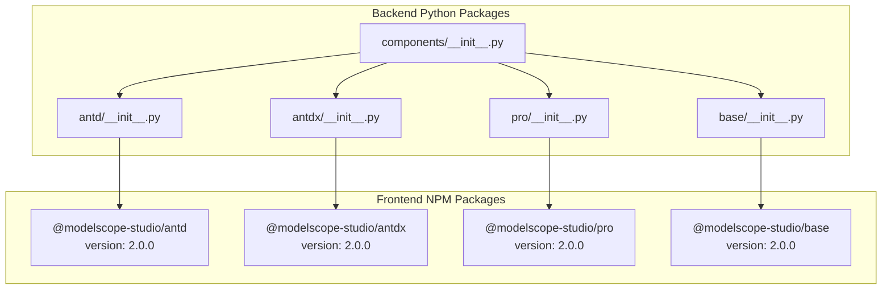
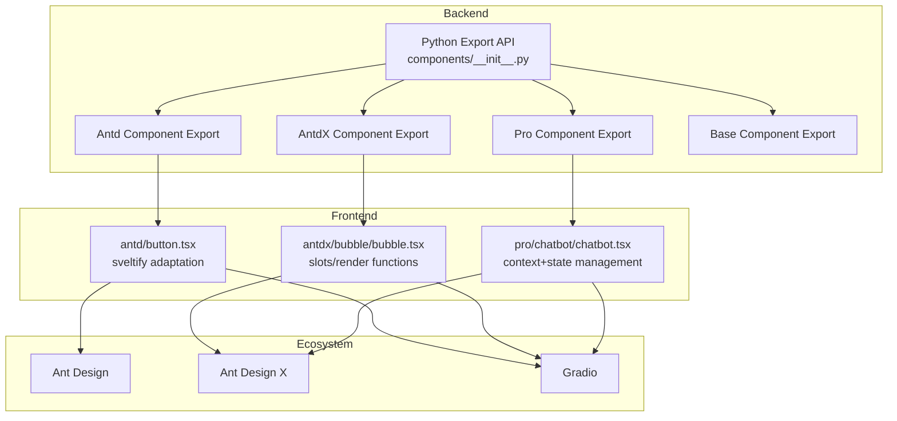
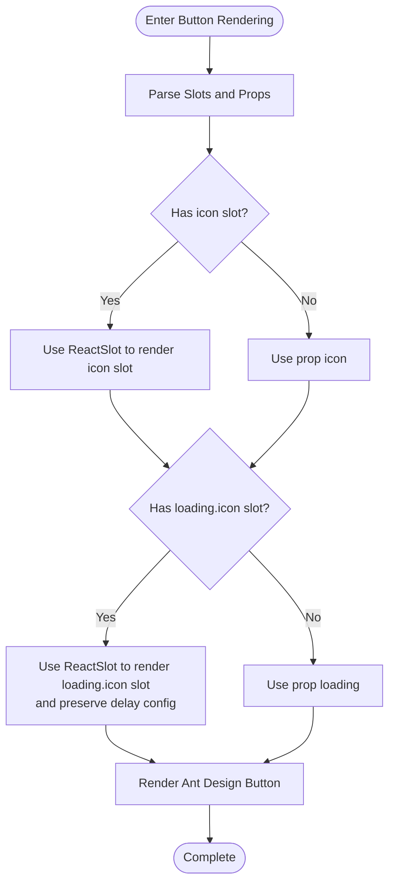
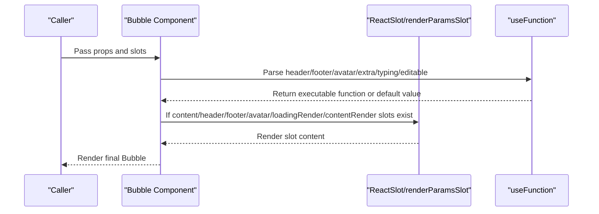
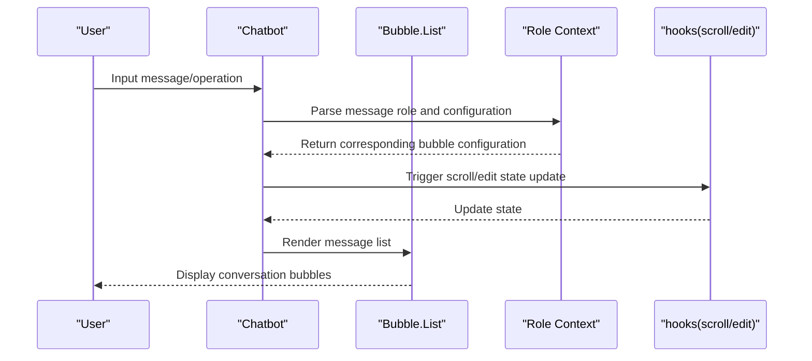
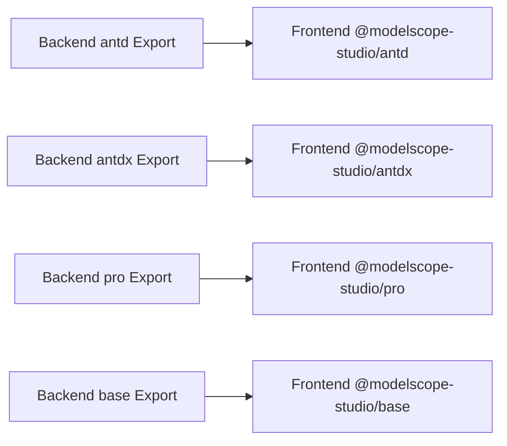

# Components Overview

<cite>
**Files referenced in this document**
- [README-zh_CN.md](file://README-zh_CN.md)
- [backend/modelscope_studio/version.py](file://backend/modelscope_studio/version.py)
- [backend/modelscope_studio/components/__init__.py](file://backend/modelscope_studio/components/__init__.py)
- [backend/modelscope_studio/components/antd/__init__.py](file://backend/modelscope_studio/components/antd/__init__.py)
- [backend/modelscope_studio/components/antdx/__init__.py](file://backend/modelscope_studio/components/antdx/__init__.py)
- [backend/modelscope_studio/components/pro/__init__.py](file://backend/modelscope_studio/components/pro/__init__.py)
- [backend/modelscope_studio/components/antd/components.py](file://backend/modelscope_studio/components/antd/components.py)
- [backend/modelscope_studio/components/antdx/components.py](file://backend/modelscope_studio/components/antdx/components.py)
- [backend/modelscope_studio/components/base/__init__.py](file://backend/modelscope_studio/components/base/__init__.py)
- [backend/modelscope_studio/components/pro/components.py](file://backend/modelscope_studio/components/pro/components.py)
- [frontend/antd/package.json](file://frontend/antd/package.json)
- [frontend/antdx/package.json](file://frontend/antdx/package.json)
- [frontend/base/package.json](file://frontend/base/package.json)
- [frontend/pro/package.json](file://frontend/pro/package.json)
- [frontend/antd/button/button.tsx](file://frontend/antd/button/button.tsx)
- [frontend/antdx/bubble/bubble.tsx](file://frontend/antdx/bubble/bubble.tsx)
- [frontend/pro/chatbot/chatbot.tsx](file://frontend/pro/chatbot/chatbot.tsx)
</cite>

## Table of Contents

1. [Introduction](#introduction)
2. [Project Structure](#project-structure)
3. [Core Components](#core-components)
4. [Architecture Overview](#architecture-overview)
5. [Detailed Component Analysis](#detailed-component-analysis)
6. [Dependency Analysis](#dependency-analysis)
7. [Performance Considerations](#performance-considerations)
8. [Troubleshooting Guide](#troubleshooting-guide)
9. [Conclusion](#conclusion)
10. [Appendix](#appendix)

## Introduction

Ant Design X component library is an enhanced UI component system designed for machine learning and large model application scenarios, built on Gradio. It provides more flexible layout capabilities, richer interaction patterns, and specialized components for AI scenarios such as conversations, visualization, and multimodal input. Its core goal is to significantly improve the user experience and development efficiency of AI applications while maintaining ease of use.

- Design Philosophy
  - Centered on "composable, extensible, customizable", covering full-stack capabilities from basic controls to professional scenario components.
  - Deeply optimized for AI application interaction paradigms (such as conversation bubbles, thought chains, prompt engineering, file cards, mind maps, etc.).
  - Seamlessly integrates with Ant Design and Ant Design X ecosystems, reusing mature design languages and interaction specifications.

- Value Proposition
  - Improves professionalism and consistency of AI application interfaces, reducing costs from prototype to production.
  - Directly addresses typical business pain points through specialized components (such as chat bubbles, thought chains, code highlighting, Mermaid diagrams, etc.).
  - Compatible with Gradio ecosystem, can be used independently or mixed with traditional components.

**Section Source**

- [README-zh_CN.md:17-32](file://README-zh_CN.md#L17-L32)

## Project Structure

The project adopts a multi-package organization with frontend-backend separation. The backend Python packages handle component export and ecosystem bridging, while the frontend uses Svelte/React hybrid approach to wrap Ant Design/Ant Design X components and adapts them to Gradio-usable components through the unified sveltify tool.

**Diagram Source**

- [backend/modelscope_studio/components/**init**.py:1-5](file://backend/modelscope_studio/components/__init__.py#L1-L5)
- [backend/modelscope_studio/components/antd/**init**.py:1-150](file://backend/modelscope_studio/components/antd/__init__.py#L1-L150)
- [backend/modelscope_studio/components/antdx/**init**.py:1-42](file://backend/modelscope_studio/components/antdx/__init__.py#L1-L42)
- [backend/modelscope_studio/components/pro/**init**.py:1-7](file://backend/modelscope_studio/components/pro/__init__.py#L1-L7)
- [backend/modelscope_studio/components/base/**init**.py:1-11](file://backend/modelscope_studio/components/base/__init__.py#L1-L11)
- [frontend/antd/package.json:1-6](file://frontend/antd/package.json#L1-L6)
- [frontend/antdx/package.json:1-6](file://frontend/antdx/package.json#L1-L6)
- [frontend/pro/package.json:1-6](file://frontend/pro/package.json#L1-L6)
- [frontend/base/package.json:1-6](file://frontend/base/package.json#L1-L6)

**Section Source**

- [backend/modelscope_studio/components/**init**.py:1-5](file://backend/modelscope_studio/components/__init__.py#L1-L5)
- [backend/modelscope_studio/version.py:1-2](file://backend/modelscope_studio/version.py#L1-L2)
- [frontend/antd/package.json:1-6](file://frontend/antd/package.json#L1-L6)
- [frontend/antdx/package.json:1-6](file://frontend/antdx/package.json#L1-L6)
- [frontend/pro/package.json:1-6](file://frontend/pro/package.json#L1-L6)
- [frontend/base/package.json:1-6](file://frontend/base/package.json#L1-L6)

## Core Components

- Base Layer (Base)
  - Provides basic capabilities such as common containers, text, slots, loops, filtering, etc., supporting complex layouts and conditional rendering.
  - Typical components: Application, AutoLoading, Div, Each, Filter, Fragment, Markdown, Slot, Span, Text.

- Ant Design (Antd)
  - Covers the complete Ant Design component family, including buttons, forms, layouts, navigation, feedback, display, editors, etc.
  - Supports nested sub-components (such as Button.Group, Form.Item, Tree.TreeNode, etc.) for building complex forms and tree structures.

- Ant Design X (AntdX)
  - Advanced components specifically designed for AI scenarios, such as conversation bubbles, thought chains, prompts, file cards, Mermaid diagrams, etc.
  - Emphasizes content editability, renderability, and interactivity, suitable for dynamic content presentation and editing in LLM applications.

- Pro (Pro)
  - Integrated component collection for professional scenarios, such as Chatbot, Monaco Editor, Multimodal Input, Web Sandbox.
  - Integrates multiple sub-components with contexts to provide out-of-the-box AI application scaffolds.

**Section Source**

- [backend/modelscope_studio/components/base/**init**.py:1-11](file://backend/modelscope_studio/components/base/__init__.py#L1-L11)
- [backend/modelscope_studio/components/antd/**init**.py:1-150](file://backend/modelscope_studio/components/antd/__init__.py#L1-L150)
- [backend/modelscope_studio/components/antdx/**init**.py:1-42](file://backend/modelscope_studio/components/antdx/__init__.py#L1-L42)
- [backend/modelscope_studio/components/pro/**init**.py:1-7](file://backend/modelscope_studio/components/pro/__init__.py#L1-L7)

## Architecture Overview

The overall architecture consists of three parts: "backend component export + frontend adaptation layer + ecosystem integration". The backend aggregates and exports sub-modules through Python packages; the frontend wraps native components using Svelte/React hybrid approach and bridges React components to Svelte/Gradio environment through sveltify; meanwhile providing utility functions and contexts for advanced capabilities like slots, render functions, and event callbacks.

**Diagram Source**

- [backend/modelscope_studio/components/**init**.py:1-5](file://backend/modelscope_studio/components/__init__.py#L1-L5)
- [backend/modelscope_studio/components/antd/components.py:1-144](file://backend/modelscope_studio/components/antd/components.py#L1-L144)
- [backend/modelscope_studio/components/antdx/components.py:1-40](file://backend/modelscope_studio/components/antdx/components.py#L1-L40)
- [backend/modelscope_studio/components/pro/components.py:1-8](file://backend/modelscope_studio/components/pro/components.py#L1-L8)
- [frontend/antd/button/button.tsx:1-39](file://frontend/antd/button/button.tsx#L1-L39)
- [frontend/antdx/bubble/bubble.tsx:1-119](file://frontend/antdx/bubble/bubble.tsx#L1-L119)
- [frontend/pro/chatbot/chatbot.tsx:1-475](file://frontend/pro/chatbot/chatbot.tsx#L1-L475)

## Detailed Component Analysis

### Antd Button Component (Basic Control)

- Design Points
  - Uses sveltify to adapt Ant Design's Button to Svelte/Gradio component.
  - Supports slots (such as icon, loading.icon) and value binding, automatically handling priority between children and controlled value.
  - Compatible handling of loading's delay configuration to ensure combination with slots.

**Diagram Source**

- [frontend/antd/button/button.tsx:8-36](file://frontend/antd/button/button.tsx#L8-L36)

**Section Source**

- [frontend/antd/button/button.tsx:1-39](file://frontend/antd/button/button.tsx#L1-L39)

### AntdX Bubble Component (AI Scenario)

- Design Points
  - Based on Ant Design X's Bubble, provides multi-slots for avatar, content, footer, extra area, loading render, content render, etc.
  - Supports editable okText/cancelText slots and boolean switches, typing, header/footer/avatar/extra functional configurations.
  - Converts slots to executable functions through useFunction and renderParamsSlot, enhancing programmability.

**Diagram Source**

- [frontend/antdx/bubble/bubble.tsx:14-116](file://frontend/antdx/bubble/bubble.tsx#L14-L116)

**Section Source**

- [frontend/antdx/bubble/bubble.tsx:1-119](file://frontend/antdx/bubble/bubble.tsx#L1-L119)

### Pro Chatbot Component (Conversation Scenario)

- Design Points
  - Based on Ant Design X's Bubble.List, combines custom context and hooks to implement scrolling, editing, copying, liking, retrying, welcome message, etc.
  - Maps different roles (user, assistant, internal welcome) to corresponding bubble styles and behaviors through useRole.
  - Built-in Markdown rendering, theme mode, root path passing, and other configurations to meet multimodal content display needs.

**Diagram Source**

- [frontend/pro/chatbot/chatbot.tsx:76-472](file://frontend/pro/chatbot/chatbot.tsx#L76-L472)

**Section Source**

- [frontend/pro/chatbot/chatbot.tsx:1-475](file://frontend/pro/chatbot/chatbot.tsx#L1-L475)

## Dependency Analysis

- Version and Namespace
  - All frontend packages use unified version number (2.0.0), namespace is @modelscope-studio, convenient for publishing and management.
- Component Export and Grouping
  - Backend exports by functional domains: antd, antdx, pro, base, corresponding to Ant Design component family, AI specialized components, professional scenario components, and basic capabilities.
- Frontend-Backend Mapping
  - Each backend export module corresponds to a frontend package, forming stable mapping relationships, ensuring component names and ecosystem consistency.

**Diagram Source**

- [backend/modelscope_studio/components/antd/**init**.py:1-150](file://backend/modelscope_studio/components/antd/__init__.py#L1-L150)
- [backend/modelscope_studio/components/antdx/**init**.py:1-42](file://backend/modelscope_studio/components/antdx/__init__.py#L1-L42)
- [backend/modelscope_studio/components/pro/**init**.py:1-7](file://backend/modelscope_studio/components/pro/__init__.py#L1-L7)
- [backend/modelscope_studio/components/base/**init**.py:1-11](file://backend/modelscope_studio/components/base/__init__.py#L1-L11)
- [frontend/antd/package.json:1-6](file://frontend/antd/package.json#L1-L6)
- [frontend/antdx/package.json:1-6](file://frontend/antdx/package.json#L1-L6)
- [frontend/pro/package.json:1-6](file://frontend/pro/package.json#L1-L6)
- [frontend/base/package.json:1-6](file://frontend/base/package.json#L1-L6)

**Section Source**

- [backend/modelscope_studio/components/**init**.py:1-5](file://backend/modelscope_studio/components/__init__.py#L1-L5)
- [backend/modelscope_studio/version.py:1-2](file://backend/modelscope_studio/version.py#L1-L2)

## Performance Considerations

- Rendering and Slots
  - Avoid unnecessary re-rendering through combination of slots and render functions; only perform parameterized rendering when slots exist.
- State and Computation
  - Use useMemo and useMemoizedFn to cache configurations and callbacks, reducing invalid re-renders and object creation.
- Scrolling and Interaction
  - Use local state and throttling strategies for high-frequency interactions like scrolling, editing, liking, ensuring smooth experience.

[This section is general guidance, no specific file references required]

## Troubleshooting Guide

- Page Not Displaying Correctly (Hugging Face Space)
  - Add ssr_mode=False parameter in demo.launch() to avoid display issues caused by server-side rendering.
- Component Import Failed
  - Confirm modelscope_studio is installed and correctly import modelscope_studio.components.\* namespace.
- Version Mismatch
  - Check if backend and frontend package versions are consistent to avoid runtime errors due to version differences.

**Section Source**

- [README-zh_CN.md:32-32](file://README-zh_CN.md#L32-L32)
- [README-zh_CN.md:38-42](file://README-zh_CN.md#L38-L42)
- [backend/modelscope_studio/version.py:1-2](file://backend/modelscope_studio/version.py#L1-L2)

## Conclusion

Ant Design X component library systematically improves the interface expressiveness and interaction efficiency of machine learning and large model applications through a three-layer architecture of "basic controls + AI specialized components + professional scenario components". With Gradio as the entry point, Ant Design/Ant Design X as the foundation, and frontend adaptation layer as the bridge, it forms a stable, scalable, and maintainable component system. Developers can use this library to quickly build high-quality AI application interfaces and gain consistent and professional user experience in conversation, visualization, multimodal input, and other scenarios.

[This section is summary content, no specific file references required]

## Appendix

### Quick Start

- Installation
  - Use pip to install modelscope_studio.
- Example
  - Import Application, ConfigProvider, AutoLoading from modelscope_studio in Blocks, and use antd components for layout and interaction.

**Section Source**

- [README-zh_CN.md:38-57](file://README-zh_CN.md#L38-L57)

### Component Classification and Usage Scenarios

- Base Layer (Base)
  - Scenarios: General layout, conditional rendering, text and slot management.
  - Typical: Application, AutoLoading, Markdown, Slot, Text, Span, Div, Each, Filter, Fragment.
- Ant Design (Antd)
  - Scenarios: Forms, navigation, feedback, display, layout, and other general UI.
  - Typical: Button, Form, Layout, Menu, Modal, Table, Tabs, Tree, Upload, etc.
- Ant Design X (AntdX)
  - Scenarios: Conversation bubbles, thought chains, prompts, file cards, Mermaid diagrams, and other AI-specific interactions.
  - Typical: Bubble, Conversations, Sender, ThoughtChain, Prompts, Attachments, Mermaid, Notification, Welcome, XProvider.
- Pro (Pro)
  - Scenarios: Integrated AI application scaffolds, such as chatbots, code editors, multimodal input, Web sandbox.
  - Typical: Chatbot, MonacoEditor, MultimodalInput, WebSandbox.

**Section Source**

- [backend/modelscope_studio/components/base/**init**.py:1-11](file://backend/modelscope_studio/components/base/__init__.py#L1-L11)
- [backend/modelscope_studio/components/antd/**init**.py:1-150](file://backend/modelscope_studio/components/antd/__init__.py#L1-L150)
- [backend/modelscope_studio/components/antdx/**init**.py:1-42](file://backend/modelscope_studio/components/antdx/__init__.py#L1-L42)
- [backend/modelscope_studio/components/pro/**init**.py:1-7](file://backend/modelscope_studio/components/pro/__init__.py#L1-L7)
