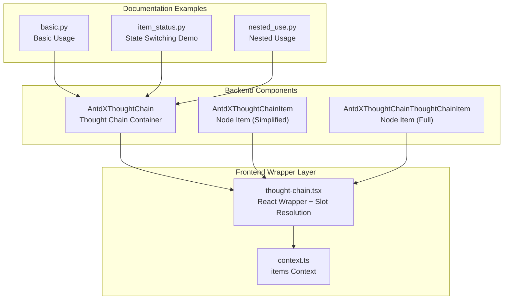
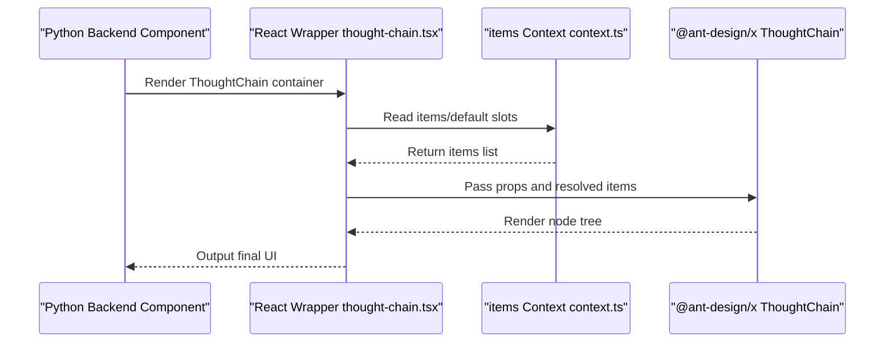
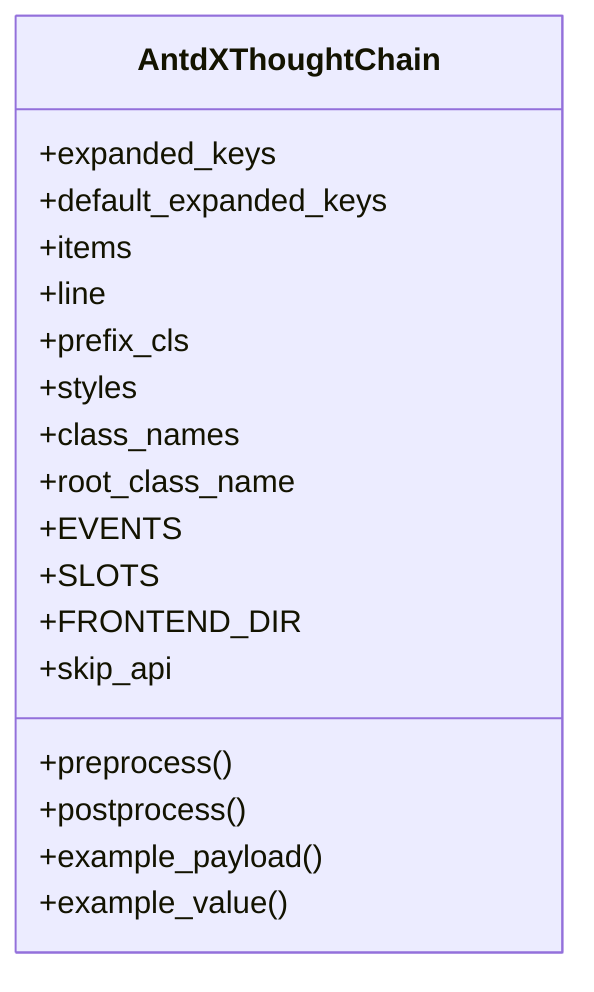
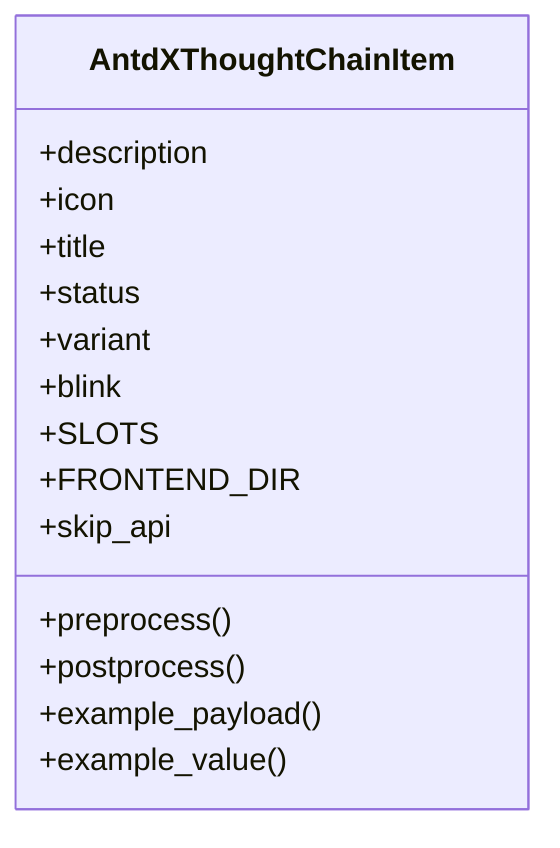
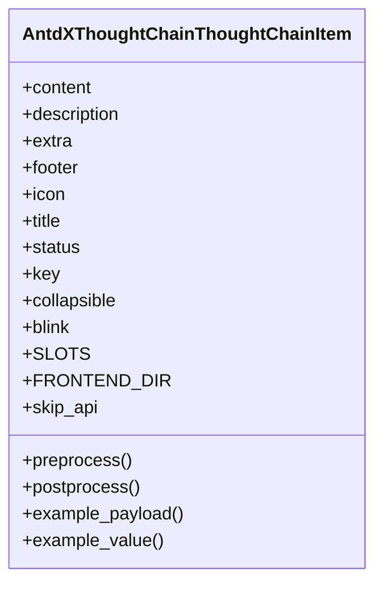
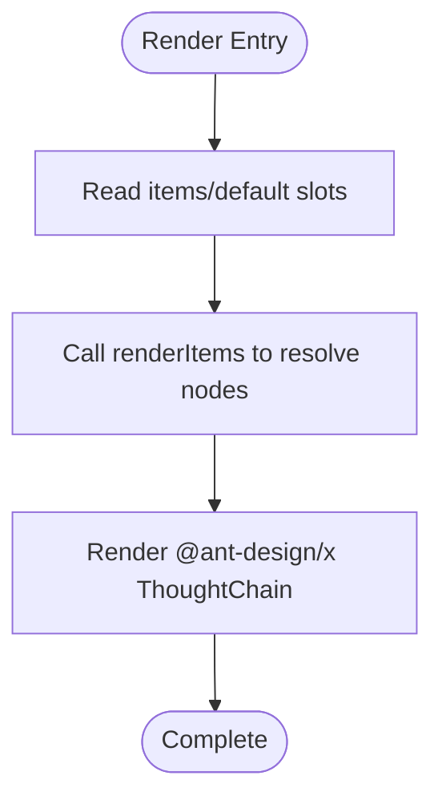
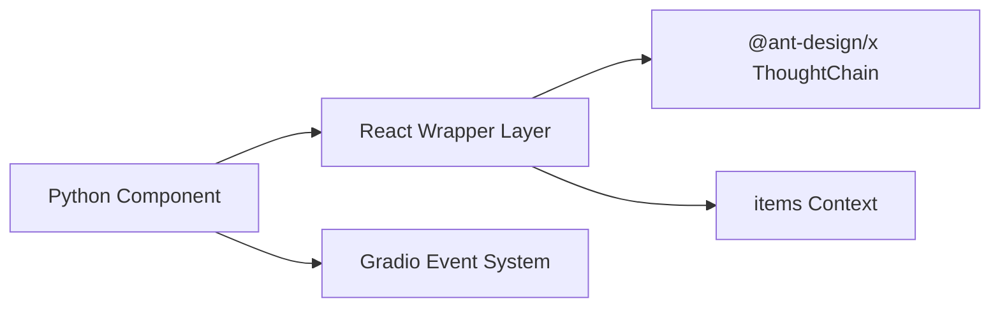

# Confirmation Components

<cite>
**Files Referenced in This Document**
- [AntdXThoughtChain/__init__.py](file://backend/modelscope_studio/components/antdx/thought_chain/__init__.py)
- [AntdXThoughtChainItem/__init__.py](file://backend/modelscope_studio/components/antdx/thought_chain/item/__init__.py)
- [AntdXThoughtChainThoughtChainItem/__init__.py](file://backend/modelscope_studio/components/antdx/thought_chain/thought_chain_item/__init__.py)
- [thought-chain.tsx](file://frontend/antdx/thought-chain/thought-chain.tsx)
- [context.ts](file://frontend/antdx/thought-chain/context.ts)
- [basic.py](file://docs/components/antdx/thought_chain/demos/basic.py)
- [item_status.py](file://docs/components/antdx/thought_chain/demos/item_status.py)
- [nested_use.py](file://docs/components/antdx/thought_chain/demos/nested_use.py)
</cite>

## Table of Contents

1. [Introduction](#introduction)
2. [Project Structure](#project-structure)
3. [Core Components](#core-components)
4. [Architecture Overview](#architecture-overview)
5. [Detailed Component Analysis](#detailed-component-analysis)
6. [Dependency Analysis](#dependency-analysis)
7. [Performance Considerations](#performance-considerations)
8. [Troubleshooting Guide](#troubleshooting-guide)
9. [Conclusion](#conclusion)
10. [Appendix](#appendix)

## Introduction

This document provides systematic technical documentation for the Ant Design X Confirmation Components (ThoughtChain), covering the following aspects:

- Thought chain construction and state management: How to configure states, collapsible behavior, and nested structures through node item configuration
- Visual presentation: How to combine node content, icons, titles, descriptions, extra action areas, and footers
- Configuration options and events: Supported properties, slots, and event callbacks
- Style and class name customization: How to control appearance via prefix class names, style objects, and root class names
- Usage examples: From basic usage to state switching, nested usage, and user interaction
- Value statement: The significance of this component in improving AI transparency and trustworthiness

## Project Structure

The Ant Design X ThoughtChain component is composed of a backend Python component and a frontend React/Svelte wrapper layer, with documentation examples located in the docs directory.

**Diagram Sources**

- [AntdXThoughtChain/**init**.py:12-86](file://backend/modelscope_studio/components/antdx/thought_chain/__init__.py#L12-L86)
- [AntdXThoughtChainItem/**init**.py:8-78](file://backend/modelscope_studio/components/antdx/thought_chain/item/__init__.py#L8-L78)
- [AntdXThoughtChainThoughtChainItem/**init**.py:8-81](file://backend/modelscope_studio/components/antdx/thought_chain/thought_chain_item/__init__.py#L8-L81)
- [thought-chain.tsx:1-43](file://frontend/antdx/thought-chain/thought-chain.tsx#L1-L43)
- [context.ts:1-7](file://frontend/antdx/thought-chain/context.ts#L1-L7)
- [basic.py:24-77](file://docs/components/antdx/thought_chain/demos/basic.py#L24-L77)
- [item_status.py:36-71](file://docs/components/antdx/thought_chain/demos/item_status.py#L36-L71)
- [nested_use.py:6-68](file://docs/components/antdx/thought_chain/demos/nested_use.py#L6-L68)

**Section Sources**

- [AntdXThoughtChain/**init**.py:12-86](file://backend/modelscope_studio/components/antdx/thought_chain/__init__.py#L12-L86)
- [thought-chain.tsx:1-43](file://frontend/antdx/thought-chain/thought-chain.tsx#L1-L43)

## Core Components

- Container Component: AntdXThoughtChain
  - Responsibility: Acts as the root container of the thought chain, responsible for receiving node lists, expanded keys, line styles, prefix class names, and other configurations; notifies expanded state changes via event binding
  - Key Capabilities: Supports items slot; expand event; configurable default expanded keys and current expanded keys
- Node Item Component (Simplified): AntdXThoughtChainItem
  - Responsibility: Carries the basic information and appearance of a single node, supporting title, description, icon, status, variant, and blink effect
  - Key Capabilities: Supports description, icon, title slots; status enum (pending/success/error/abort)
- Node Item Component (Full): AntdXThoughtChainThoughtChainItem
  - Responsibility: Carries richer node content, supporting content, description, footer, icon, title slots, as well as key, collapsible, status, and other properties
  - Key Capabilities: Supports collapse/expand, state switching, and extra action areas

**Section Sources**

- [AntdXThoughtChain/**init**.py:12-86](file://backend/modelscope_studio/components/antdx/thought_chain/__init__.py#L12-L86)
- [AntdXThoughtChainItem/**init**.py:8-78](file://backend/modelscope_studio/components/antdx/thought_chain/item/__init__.py#L8-L78)
- [AntdXThoughtChainThoughtChainItem/**init**.py:8-81](file://backend/modelscope_studio/components/antdx/thought_chain/thought_chain_item/__init__.py#L8-L81)

## Architecture Overview

The frontend wrapper layer maps backend components to React components, uniformly resolves slots, and passes them to @ant-design/x's ThoughtChain implementation, while collecting items slot content via the context mechanism.

**Diagram Sources**

- [thought-chain.tsx:11-40](file://frontend/antdx/thought-chain/thought-chain.tsx#L11-L40)
- [context.ts:1-7](file://frontend/antdx/thought-chain/context.ts#L1-L7)

## Detailed Component Analysis

### Container Component: AntdXThoughtChain

- Main Responsibilities
  - Receives items list and expanded key configuration, determining the initial expanded state
  - Supports the expand event to monitor expanded key changes
  - Provides the items slot for declarative node organization
- Key Properties
  - expanded_keys / default_expanded_keys: Current expanded keys and default expanded keys
  - items: Array of node data
  - line: Line style (boolean or line type enum)
  - prefix_cls: Prefix class name
  - styles / class_names / root_class_name: Style and class name customization
- Events
  - expand: Triggered when expanded keys change
- Lifecycle
  - preprocess/postprocess/example\_\* all return empty values, indicating this component does not participate in data serialization

**Diagram Sources**

- [AntdXThoughtChain/**init**.py:30-86](file://backend/modelscope_studio/components/antdx/thought_chain/__init__.py#L30-L86)

**Section Sources**

- [AntdXThoughtChain/**init**.py:12-86](file://backend/modelscope_studio/components/antdx/thought_chain/__init__.py#L12-L86)

### Node Item Component (Simplified): AntdXThoughtChainItem

- Main Responsibilities
  - Represents a single thought node's title, description, icon, and status
  - Supports multiple appearance variants and blink effects
- Key Properties
  - description / icon / title: Node basic information
  - status: Node status (pending/success/error/abort)
  - variant: Appearance variant (solid/outlined/text)
  - blink: Whether to blink
  - Slots: description, icon, title
- Lifecycle
  - Same as the container component; does not participate in data serialization

**Diagram Sources**

- [AntdXThoughtChainItem/**init**.py:18-78](file://backend/modelscope_studio/components/antdx/thought_chain/item/__init__.py#L18-L78)

**Section Sources**

- [AntdXThoughtChainItem/**init**.py:8-78](file://backend/modelscope_studio/components/antdx/thought_chain/item/__init__.py#L8-L78)

### Node Item Component (Full): AntdXThoughtChainThoughtChainItem

- Main Responsibilities
  - Carries richer node content, supporting content, footer, extra, and other slots
  - Supports key, collapsible, status, and other properties for complex interactions and state management
- Key Properties
  - content / description / footer / icon / title: Content and decoration
  - key: Node unique identifier
  - collapsible: Whether it is collapsible
  - status: Node status
  - Slots: content, description, footer, icon, title
- Lifecycle
  - Same as the container component; does not participate in data serialization

**Diagram Sources**

- [AntdXThoughtChainThoughtChainItem/**init**.py:18-81](file://backend/modelscope_studio/components/antdx/thought_chain/thought_chain_item/__init__.py#L18-L81)

**Section Sources**

- [AntdXThoughtChainThoughtChainItem/**init**.py:8-81](file://backend/modelscope_studio/components/antdx/thought_chain/thought_chain_item/__init__.py#L8-L81)

### Frontend Wrapper and Slot Resolution

- thought-chain.tsx
  - Wraps @ant-design/x's ThoughtChain via sveltify
  - Uses withItemsContextProvider and useItems to resolve items/default slots
  - Converts slot content into props.items via renderItems
- context.ts
  - Provides items context, supporting slot collection in nested scenarios

**Diagram Sources**

- [thought-chain.tsx:11-40](file://frontend/antdx/thought-chain/thought-chain.tsx#L11-L40)
- [context.ts:1-7](file://frontend/antdx/thought-chain/context.ts#L1-L7)

**Section Sources**

- [thought-chain.tsx:1-43](file://frontend/antdx/thought-chain/thought-chain.tsx#L1-L43)
- [context.ts:1-7](file://frontend/antdx/thought-chain/context.ts#L1-L7)

### Usage Examples and Scenarios

#### Basic Usage and Collapsible Behavior

- Key Points
  - Create a ThoughtChain container under XProvider
  - Use a Switch to control the collapsible property, dynamically toggling node collapsibility
  - Inject extra/content/footer via Slot for rich node content
- Applicable Scenarios
  - Display the execution flow and current status of multi-step tasks
  - Provide node-level action buttons and supplementary information

**Section Sources**

- [basic.py:24-77](file://docs/components/antdx/thought_chain/demos/basic.py#L24-L77)

#### Node State Switching (Success/Error/In Progress)

- Key Points
  - Use Each to dynamically generate node lists
  - Step-by-step update node status and icons via button clicks to simulate real runtime status
  - Supports visual feedback for pending/error/success three states
- Applicable Scenarios
  - Display stage-by-stage results during AI inference
  - Increase user confidence in execution progress and results

**Section Sources**

- [item_status.py:36-71](file://docs/components/antdx/thought_chain/demos/item_status.py#L36-L71)

#### Nested Usage (Sub-Thought Chains)

- Key Points
  - Nest another ThoughtChain inside the node content of a parent ThoughtChain
  - Child nodes also support slots like extra/content/footer
- Applicable Scenarios
  - Complex tasks broken down into multiple sub-tasks, refined layer by layer
  - Display hierarchical decision or reasoning chains

**Section Sources**

- [nested_use.py:6-68](file://docs/components/antdx/thought_chain/demos/nested_use.py#L6-L68)

## Dependency Analysis

- Component Coupling
  - Both the container and node items inherit from ModelScopeLayoutComponent, sharing a unified lifecycle and property system
  - The frontend wrapper layer is only responsible for slot resolution and property forwarding, without introducing business logic
- External Dependencies
  - @ant-design/x's ThoughtChain provides actual rendering capabilities
  - Gradio event system is used for expand event binding
- Potential Risks
  - Slot names and order must strictly match; otherwise rendering may fail
  - When the items list is empty, ensure fallback to the default slot

**Diagram Sources**

- [AntdXThoughtChain/**init**.py:20-25](file://backend/modelscope_studio/components/antdx/thought_chain/__init__.py#L20-L25)
- [thought-chain.tsx:11-40](file://frontend/antdx/thought-chain/thought-chain.tsx#L11-L40)

**Section Sources**

- [AntdXThoughtChain/**init**.py:20-25](file://backend/modelscope_studio/components/antdx/thought_chain/__init__.py#L20-L25)
- [thought-chain.tsx:11-40](file://frontend/antdx/thought-chain/thought-chain.tsx#L11-L40)

## Performance Considerations

- Render Optimization
  - Uses useMemo to cache items computation results, avoiding unnecessary re-renders
  - Reduces DOM count via lazy slot loading and conditional rendering
- Data Flow
  - The items list should maintain stable references; use the key field to improve diff efficiency
- Interaction Experience
  - For scenarios with many nodes, prioritize collapsible and step-by-step loading strategies

## Troubleshooting Guide

- Symptom: Nodes not showing or showing as empty
  - Check whether items are correctly passed or the default slot is populated
  - Confirm slot name casing matches the documentation
- Symptom: expand event not working
  - Confirm event binding is enabled (bind_expand_event)
  - Check whether the container is in an interactive state
- Symptom: Nested ThoughtChain not working
  - Ensure the child ThoughtChain is correctly nested in the content slot of the parent node
  - Check whether the child ThoughtChain's slots are correctly declared

## Conclusion

The Ant Design X ThoughtChain component, through its layered design of "container + node items" combined with frontend slot resolution and @ant-design/x's rendering capabilities, achieves structured recording and visual presentation of the AI thinking process. Its state-driven node appearance, flexible slot extension, and collapsible interaction can effectively improve users' understanding and trust in complex reasoning processes. With documentation examples, developers can quickly build various application scenarios from basic flows to nested sub-chains.

## Appendix

### API Quick Reference

- Container Component AntdXThoughtChain
  - Properties: expanded_keys, default_expanded_keys, items, line, prefix_cls, styles, class_names, root_class_name
  - Events: expand
  - Slots: items
- Node Item Component (Simplified) AntdXThoughtChainItem
  - Properties: description, icon, title, status, variant, blink
  - Slots: description, icon, title
- Node Item Component (Full) AntdXThoughtChainThoughtChainItem
  - Properties: content, description, extra, footer, icon, title, status, key, collapsible, blink
  - Slots: content, description, footer, icon, title

### Usage Recommendations

- Transparency and Trustworthiness
  - Provide clear status and icon hints to help users understand the execution result of each step
  - Offer additional explanations and actionable entry points for key decision nodes to enhance user control
- Accessibility
  - Provide readable alternative text for icons and statuses
  - Ensure keyboard accessibility and screen reader friendliness
