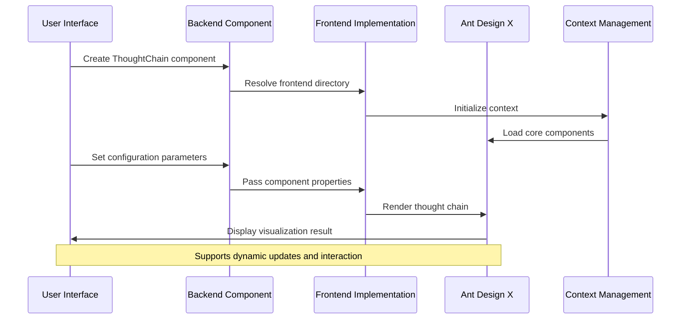
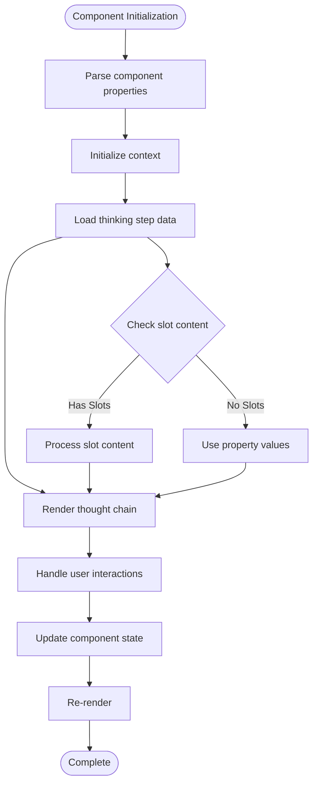
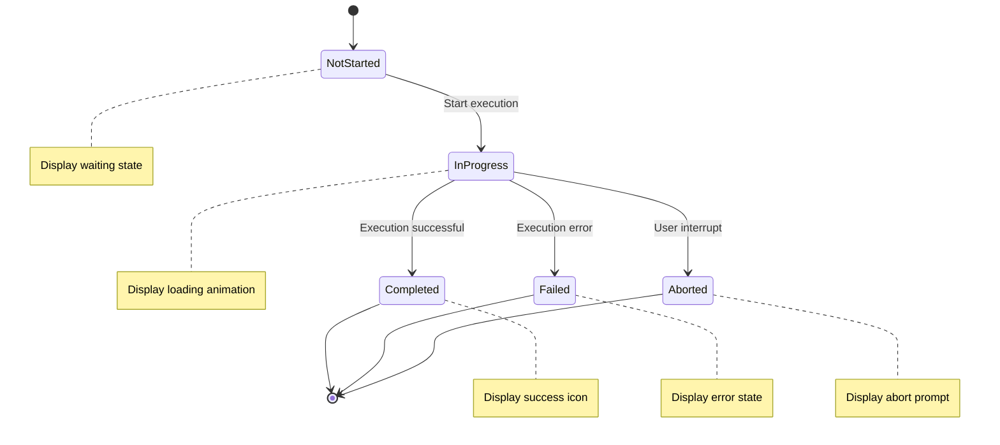
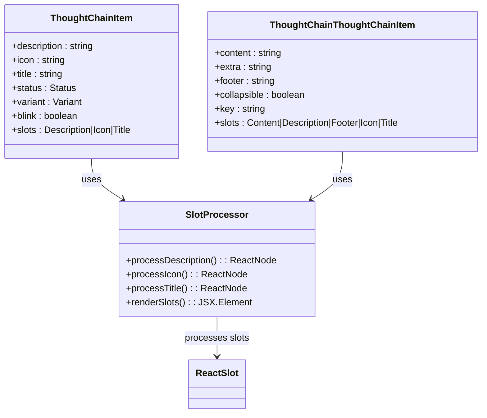

# ThoughtChain Component

<cite>
**Files Referenced in This Document**
- [backend module exports](file://backend/modelscope_studio/components/antdx/__init__.py)
- [ThoughtChain main component definition](file://backend/modelscope_studio/components/antdx/thought_chain/__init__.py)
- [ThoughtChain item component definition](file://backend/modelscope_studio/components/antdx/thought_chain/item/__init__.py)
- [ThoughtChain advanced item component definition](file://backend/modelscope_studio/components/antdx/thought_chain/thought_chain_item/__init__.py)
- [Frontend ThoughtChain implementation](file://frontend/antdx/thought-chain/thought-chain.tsx)
- [Frontend ThoughtChain item implementation](file://frontend/antdx/thought-chain/item/thought-chain.item.tsx)
- [Frontend ThoughtChain advanced item implementation](file://frontend/antdx/thought-chain/thought-chain-item/thought-chain.thought-chain-item.tsx)
- [Frontend ThoughtChain context utility](file://frontend/antdx/thought-chain/context.ts)
</cite>

## Table of Contents

1. [Introduction](#introduction)
2. [Project Structure](#project-structure)
3. [Core Components](#core-components)
4. [Architecture Overview](#architecture-overview)
5. [Detailed Component Analysis](#detailed-component-analysis)
6. [Dependency Analysis](#dependency-analysis)
7. [Performance Considerations](#performance-considerations)
8. [Troubleshooting Guide](#troubleshooting-guide)
9. [Conclusion](#conclusion)

## Introduction

The ThoughtChain component is a powerful visualization tool provided by ModelScope Studio, specifically designed to record and display the AI's thinking process. This component clearly presents complex reasoning paths through a tree structure, helping users understand the logical flow of AI decision-making.

The core value of this component lies in:

- **Enhanced Transparency**: Enables users to see the complete thinking process of AI
- **Improved Explainability**: Improves the understandability of AI behavior through step-by-step visual presentation
- **Debugging Support**: Enables developers and users to track and analyze AI decision paths
- **User Experience Optimization**: Provides intuitive visual feedback to enhance human-machine interaction

## Project Structure

ModelScope Studio adopts a layered architecture design; the ThoughtChain component is located in the antdx component library and is deeply integrated with the Gradio ecosystem.

```mermaid
graph TB
subgraph "Backend Python Layer"
A[Antdx Component Exports] --> B[ThoughtChain Main Component]
A --> C[ThoughtChain Item Component]
A --> D[ThoughtChain Advanced Item Component]
end
subgraph "Frontend React Layer"
E[ThoughtChain Frontend Implementation]
F[ThoughtChain Item Frontend Implementation]
G[ThoughtChain Advanced Item Frontend Implementation]
H[Context Utility]
end
subgraph "Third-party Libraries"
I[@ant-design/x]
J[Gradio Ecosystem]
end
B --> E
C --> F
D --> G
E --> I
F --> I
G --> I
H --> E
H --> G
E --> J
F --> J
G --> J
```

**Diagram Sources**

- [backend module exports:35-41](file://backend/modelscope_studio/components/antdx/__init__.py#L35-L41)
- [ThoughtChain main component definition:12-18](file://backend/modelscope_studio/components/antdx/thought_chain/__init__.py#L12-L18)
- [ThoughtChain item component definition:8-11](file://backend/modelscope_studio/components/antdx/thought_chain/item/__init__.py#L8-L11)
- [ThoughtChain advanced item component definition:8-11](file://backend/modelscope_studio/components/antdx/thought_chain/thought_chain_item/__init__.py#L8-L11)

**Section Sources**

- [backend module exports:35-41](file://backend/modelscope_studio/components/antdx/__init__.py#L35-L41)
- [ThoughtChain main component definition:12-18](file://backend/modelscope_studio/components/antdx/thought_chain/__init__.py#L12-L18)

## Core Components

### ThoughtChain Main Component

The main component is responsible for overall layout and state management, supporting multiple configuration options:

**Core Configuration Options:**

- `expanded_keys`: List of node key values to expand by default
- `default_expanded_keys`: Initial default expanded node key values
- `items`: Array of thinking step data
- `line`: Connector line style (solid, dashed, dotted)
- `prefix_cls`: Custom prefix class name
- `styles`: Inline style object or string
- `class_names`: Class name mapping object

**Event Handling:**

- `expand`: Callback function for when expand/collapse key values change

### ThoughtChainItem Sub-item Component

Used to represent a single thinking step, supporting rich customization options:

**Core Properties:**

- `description`: Step description text
- `icon`: Custom icon name
- `title`: Step title
- `status`: Status value (pending, success, error, abort)
- `variant`: Appearance variant (solid, outlined, text)
- `blink`: Whether to enable blink effect

**Slot Support:**

- `description`: Custom description content
- `icon`: Custom icon content
- `title`: Custom title content

### ThoughtChainThoughtChainItem Advanced Sub-item Component

Provides more complex functionality, supporting nested structures:

**Extended Properties:**

- `content`: Main content text
- `extra`: Extra information
- `footer`: Footer content
- `collapsible`: Whether it is collapsible
- `key`: Unique key identifier

**Advanced Slots:**

- `content`: Main content area
- `description`: Description content
- `footer`: Footer content
- `icon`: Icon content
- `title`: Title content

**Section Sources**

- [ThoughtChain main component definition:30-67](file://backend/modelscope_studio/components/antdx/thought_chain/__init__.py#L30-L67)
- [ThoughtChain item component definition:18-58](file://backend/modelscope_studio/components/antdx/thought_chain/item/__init__.py#L18-L58)
- [ThoughtChain advanced item component definition:18-59](file://backend/modelscope_studio/components/antdx/thought_chain/thought_chain_item/__init__.py#L18-L59)

## Architecture Overview

The ThoughtChain component adopts a frontend-backend separation architecture design, achieving seamless integration through the Gradio ecosystem.



**Diagram Sources**

- [ThoughtChain main component definition:68-68](file://backend/modelscope_studio/components/antdx/thought_chain/__init__.py#L68-L68)
- [Frontend ThoughtChain implementation:11-40](file://frontend/antdx/thought-chain/thought-chain.tsx#L11-L40)
- [Frontend ThoughtChain context utility:1-4](file://frontend/antdx/thought-chain/context.ts#L1-L4)

## Detailed Component Analysis

### Data Flow Processing



**Diagram Sources**

- [Frontend ThoughtChain implementation:14-35](file://frontend/antdx/thought-chain/thought-chain.tsx#L14-L35)
- [Frontend ThoughtChain item implementation:12-27](file://frontend/antdx/thought-chain/item/thought-chain.item.tsx#L12-L27)

### State Management System

The component supports four core states, each with specific visual representations:



**Diagram Sources**

- [ThoughtChain item component definition:24-25](file://backend/modelscope_studio/components/antdx/thought_chain/item/__init__.py#L24-L25)
- [ThoughtChain advanced item component definition:29-30](file://backend/modelscope_studio/components/antdx/thought_chain/thought_chain_item/__init__.py#L29-L30)

### Slot System Architecture



**Diagram Sources**

- [ThoughtChain item component definition:15-16](file://backend/modelscope_studio/components/antdx/thought_chain/item/__init__.py#L15-L16)
- [ThoughtChain advanced item component definition:15-16](file://backend/modelscope_studio/components/antdx/thought_chain/thought_chain_item/__init__.py#L15-L16)
- [Frontend ThoughtChain item implementation:18-26](file://frontend/antdx/thought-chain/item/thought-chain.item.tsx#L18-L26)

**Section Sources**

- [Frontend ThoughtChain implementation:11-40](file://frontend/antdx/thought-chain/thought-chain.tsx#L11-L40)
- [Frontend ThoughtChain item implementation:9-30](file://frontend/antdx/thought-chain/item/thought-chain.item.tsx#L9-L30)
- [Frontend ThoughtChain advanced item implementation:7-11](file://frontend/antdx/thought-chain/thought-chain-item/thought-chain.thought-chain-item.tsx#L7-L11)

## Dependency Analysis

### Component Dependency Diagram

```mermaid
graph TB
subgraph "Core Dependencies"
A[@ant-design/x] --> B[ThoughtChain Core]
A --> C[ThoughtChain.Item]
A --> D[ThoughtChain.ThoughtChainItem]
end
subgraph "Utility Dependencies"
E[@svelte-preprocess-react] --> F[sveltify Conversion]
E --> G[ReactSlot Processing]
H[@utils/renderItems] --> I[Item Rendering]
J[@utils/createItemsContext] --> K[Context Management]
end
subgraph "Gradio Integration"
L[Gradio Event System] --> M[EventListener]
N[Gradio Component System] --> O[ModelScopeLayoutComponent]
end
B --> E
C --> E
D --> E
B --> L
C --> N
D --> N
E --> H
E --> J
```

**Diagram Sources**

- [Frontend ThoughtChain implementation:1-7](file://frontend/antdx/thought-chain/thought-chain.tsx#L1-L7)
- [Frontend ThoughtChain item implementation:1-7](file://frontend/antdx/thought-chain/item/thought-chain.item.tsx#L1-L7)
- [Frontend ThoughtChain advanced item implementation:1-3](file://frontend/antdx/thought-chain/thought-chain-item/thought-chain.thought-chain-item.tsx#L1-L3)
- [ThoughtChain main component definition:5-8](file://backend/modelscope_studio/components/antdx/thought_chain/__init__.py#L5-L8)

### Version Compatibility

The component design follows these compatibility principles:

- Supports the latest version features of Gradio
- Compatible with TypeScript 4.0+ type system
- Adapts to React 17+ and Svelte 3+ ecosystems
- Backward compatible with Ant Design X 0.x versions

**Section Sources**

- [ThoughtChain main component definition:1-8](file://backend/modelscope_studio/components/antdx/thought_chain/__init__.py#L1-L8)
- [Frontend ThoughtChain implementation:1-7](file://frontend/antdx/thought-chain/thought-chain.tsx#L1-L7)

## Performance Considerations

### Rendering Optimization Strategies

1. **Lazy Loading Mechanism**: Use `sveltify` for on-demand loading
2. **Memory Management**: Use `useMemo` appropriately to cache computation results
3. **Event Handling**: Optimize event binding via `EventListener`
4. **Slot Rendering**: Delay rendering slot content to reduce initial load

### Best Practice Recommendations

- **Data Preprocessing**: Format data before passing it to the component
- **State Minimization**: Avoid frequent state updates that trigger unnecessary re-renders
- **Resource Management**: Clean up unused component instances in a timely manner
- **Error Boundaries**: Use Gradio's error boundary mechanism to handle exceptions

## Troubleshooting Guide

### Common Issues and Solutions

**Issue 1: Component Not Displaying**

- Check the `visible` property setting
- Confirm the `render` property is `true`
- Verify the CSS styles of the parent container

**Issue 2: Status Display Anomalies**

- Confirm the status value is within the allowed range
- Check whether the `blink` property is correctly configured
- Verify the correctness of style class names

**Issue 3: Slot Content Not Taking Effect**

- Confirm the slot name is spelled correctly
- Check the type matching of slot content
- Verify the rendering timing of the slot

**Section Sources**

- [ThoughtChain main component definition:74-85](file://backend/modelscope_studio/components/antdx/thought_chain/__init__.py#L74-L85)
- [Frontend ThoughtChain item implementation:12-27](file://frontend/antdx/thought-chain/item/thought-chain.item.tsx#L12-L27)

## Conclusion

The ThoughtChain component provides powerful visualization capabilities for displaying the AI thinking process in AI applications. Through its carefully designed architecture and rich configuration options, this component not only improves AI transparency and trustworthiness but also provides users with an intuitive interactive experience.

**Summary of Core Advantages:**

- **Complete Thought Process Visualization**: Multi-level presentation from simple to complex
- **Flexible Configuration Options**: Meets usage needs in different scenarios
- **Good Performance**: Optimized rendering mechanism ensures a smooth experience
- **Comprehensive Error Handling**: Robust exception handling mechanism ensures stability
- **Excellent Extensibility**: Modular architecture facilitates feature extension and customization

This component is particularly suitable for application scenarios that need to display AI decision-making processes, such as intelligent customer service, data analysis, and content creation, and can significantly improve user understanding and trust in AI behavior.
