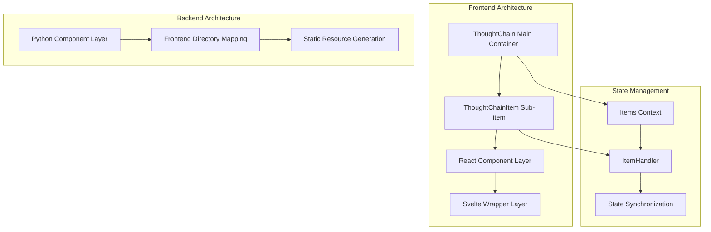
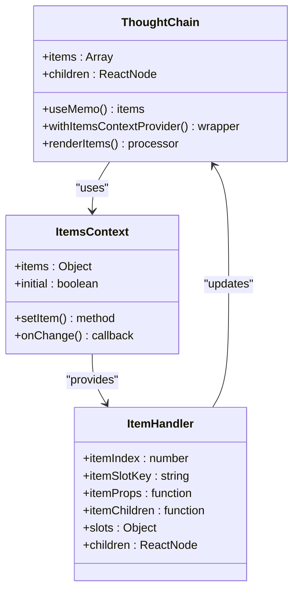
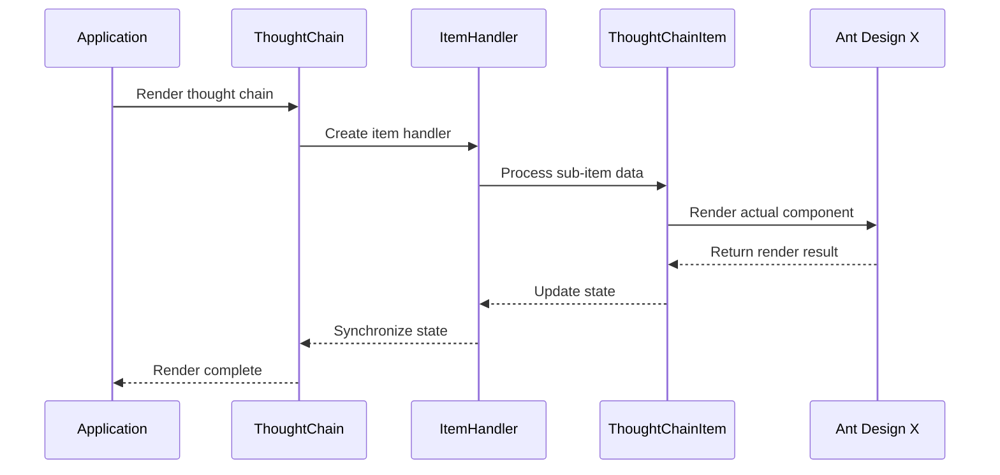
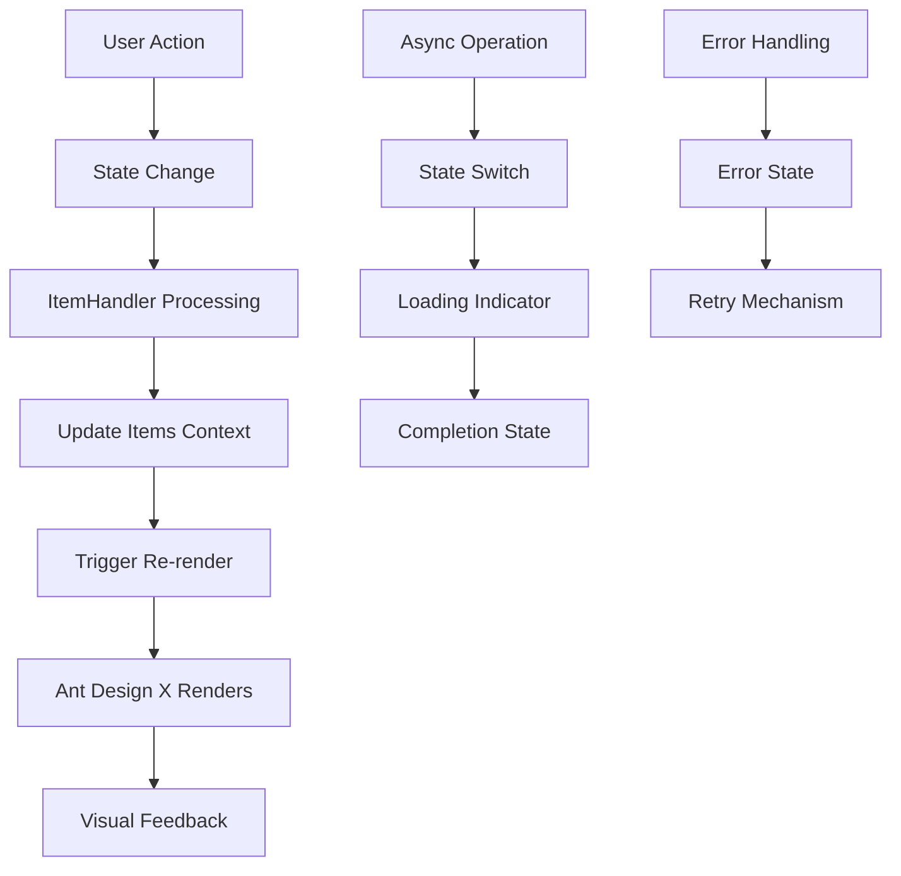
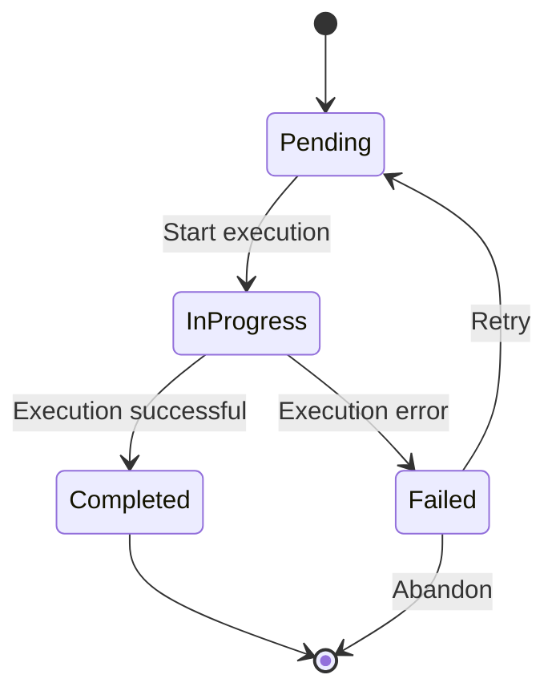
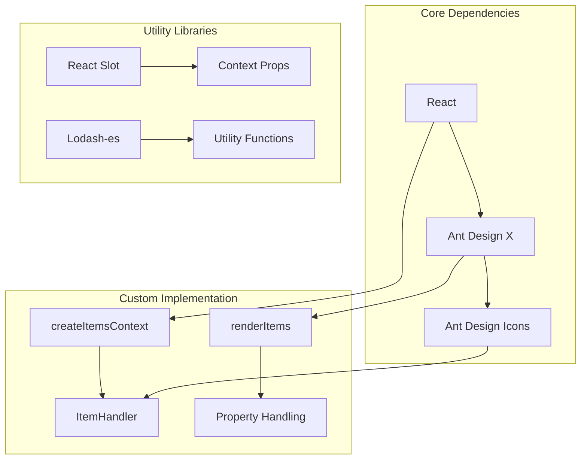
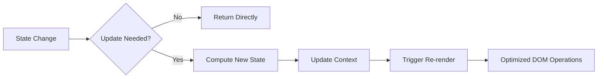

# ThoughtChainItem Component

<cite>
**Files Referenced in This Document**
- [thought-chain.tsx](file://frontend/antdx/thought-chain/thought-chain.tsx)
- [thought-chain.thought-chain-item.tsx](file://frontend/antdx/thought-chain/thought-chain-item/thought-chain.thought-chain-item.tsx)
- [thought-chain.item.tsx](file://frontend/antdx/thought-chain/item/thought-chain.item.tsx)
- [context.ts](file://frontend/antdx/thought-chain/context.ts)
- [createItemsContext.tsx](file://frontend/utils/createItemsContext.tsx)
- [thought-chain.Index.svelte](file://frontend/antdx/thought-chain/Index.svelte)
- [thought-chain.thought-chain-item.Index.svelte](file://frontend/antdx/thought-chain/thought-chain-item/Index.svelte)
- [thought-chain.item.Index.svelte](file://frontend/antdx/thought-chain/item/Index.svelte)
- [thought_chain_item/__init__.py](file://backend/modelscope_studio/components/antdx/thought_chain/thought_chain_item/__init__.py)
- [thought_chain/__init__.py](file://backend/modelscope_studio/components/antdx/thought_chain/item/__init__.py)
</cite>

## Table of Contents

1. [Introduction](#introduction)
2. [Project Structure](#project-structure)
3. [Core Components](#core-components)
4. [Architecture Overview](#architecture-overview)
5. [Detailed Component Analysis](#detailed-component-analysis)
6. [Dependency Analysis](#dependency-analysis)
7. [Performance Considerations](#performance-considerations)
8. [Troubleshooting Guide](#troubleshooting-guide)
9. [Conclusion](#conclusion)

## Introduction

ThoughtChainItem is the core sub-component of the ThoughtChain component system in ModelScope Studio, used to represent and manage individual thinking steps in complex thought flows. This component provides complete state management, event handling, and visual presentation capabilities, supporting the visualization of multiple states (pending, in progress, completed, failed, etc.).

This component is based on Ant Design X's ThoughtChain implementation and achieves flexible inter-component communication and state synchronization through a custom Items Context system. The component supports a slot mechanism, allowing developers to customize content areas such as titles, descriptions, and icons.

## Project Structure

The ThoughtChainItem component system adopts a layered architecture design, consisting of three parts: frontend React components, Svelte wrappers, and backend Python components:



**Diagram Sources**

- [thought-chain.tsx:11-40](file://frontend/antdx/thought-chain/thought-chain.tsx#L11-L40)
- [thought-chain.thought-chain-item.tsx:7-11](file://frontend/antdx/thought-chain/thought-chain-item/thought-chain.thought-chain-item.tsx#L7-L11)
- [context.ts:1-6](file://frontend/antdx/thought-chain/context.ts#L1-L6)

**Section Sources**

- [thought-chain.tsx:1-43](file://frontend/antdx/thought-chain/thought-chain.tsx#L1-L43)
- [thought-chain.thought-chain-item.tsx:1-14](file://frontend/antdx/thought-chain/thought-chain-item/thought-chain.thought-chain-item.tsx#L1-L14)
- [thought-chain.item.tsx:1-33](file://frontend/antdx/thought-chain/item/thought-chain.item.tsx#L1-L33)

## Core Components

### ThoughtChain Main Container

The ThoughtChain component is the root container of the entire thought chain system, responsible for coordinating the rendering and state management of all sub-items:



**Diagram Sources**

- [thought-chain.tsx:11-40](file://frontend/antdx/thought-chain/thought-chain.tsx#L11-L40)
- [context.ts:3-4](file://frontend/antdx/thought-chain/context.ts#L3-L4)
- [createItemsContext.tsx:102-170](file://frontend/utils/createItemsContext.tsx#L102-L170)

### ThoughtChainItem Sub-item Component

ThoughtChainItem provides two implementation approaches: direct React implementation and ItemHandler-based wrapper implementation.

**Section Sources**

- [thought-chain.thought-chain-item.tsx:7-11](file://frontend/antdx/thought-chain/thought-chain-item/thought-chain.thought-chain-item.tsx#L7-L11)
- [thought-chain.item.tsx:9-27](file://frontend/antdx/thought-chain/item/thought-chain.item.tsx#L9-L27)

## Architecture Overview

ThoughtChainItem adopts a layered architecture design, ensuring loose coupling and high cohesion between components:



**Diagram Sources**

- [thought-chain.tsx:14-34](file://frontend/antdx/thought-chain/thought-chain.tsx#L14-L34)
- [createItemsContext.tsx:190-261](file://frontend/utils/createItemsContext.tsx#L190-L261)

### State Management System

The component's state management is based on React Context and the custom Items Context system:



**Diagram Sources**

- [createItemsContext.tsx:124-153](file://frontend/utils/createItemsContext.tsx#L124-L153)
- [createItemsContext.tsx:234-237](file://frontend/utils/createItemsContext.tsx#L234-L237)

**Section Sources**

- [createItemsContext.tsx:97-274](file://frontend/utils/createItemsContext.tsx#L97-L274)

## Detailed Component Analysis

### ThoughtChainItem Property Configuration

The component supports rich property configuration to meet different usage scenarios:

| Property Name | Type                                       | Required | Description                            |
| ------------- | ------------------------------------------ | -------- | -------------------------------------- |
| title         | ReactNode \| string                        | No       | Thought item title content             |
| description   | ReactNode \| string                        | No       | Thought item description content       |
| icon          | ReactNode                                  | No       | Custom icon component                  |
| status        | 'wait' \| 'process' \| 'finish' \| 'error' | No       | Current status                         |
| key           | string \| number                           | No       | Unique key identifier                  |
| itemIndex     | number                                     | Yes      | Index position in the parent container |
| itemSlotKey   | string                                     | No       | Slot key value                         |
| itemProps     | function                                   | No       | Dynamic property computation function  |
| itemChildren  | function                                   | No       | Child item generation function         |

### State Management Mechanism

The component supports four core states, each with corresponding visual representations:



**Diagram Sources**

- [thought-chain.item.tsx:16-27](file://frontend/antdx/thought-chain/item/thought-chain.item.tsx#L16-L27)

### Event Handling Mechanism

The component provides complete event handling capabilities:

| Event Type       | Callback | Trigger Timing  | Parameters           |
| ---------------- | -------- | --------------- | -------------------- |
| onClick          | function | User clicks     | event, itemData      |
| onStatusChange   | function | Status changes  | oldStatus, newStatus |
| onRenderComplete | function | Render complete | itemData             |
| onError          | function | Error occurs    | error, itemData      |

**Section Sources**

- [thought-chain.thought-chain-item.tsx:7-11](file://frontend/antdx/thought-chain/thought-chain-item/thought-chain.thought-chain-item.tsx#L7-L11)
- [thought-chain.item.tsx:9-27](file://frontend/antdx/thought-chain/item/thought-chain.item.tsx#L9-L27)

### Usage Examples

#### Basic Usage

```javascript
// Simple thought item configuration
<ThoughtChain>
  <ThoughtChainItem
    title="Problem Analysis"
    description="Analyze the question raised by the user"
    status="finish"
  />
</ThoughtChain>
```

#### Advanced Configuration

```javascript
// Complex configuration with dynamic properties
<ThoughtChain>
  <ThoughtChainItem
    title={<CustomTitle />}
    description={<MarkdownContent />}
    icon={<CustomIcon />}
    status={status}
    itemProps={(props, items) => ({
      ...props,
      onClick: () => handleItemClick(props.key),
      className: getStatusClass(status),
    })}
  >
    <div slot="extra">Extra content</div>
  </ThoughtChainItem>
</ThoughtChain>
```

#### Async State Management

```javascript
// State management for async operations
const asyncOperation = async (itemId) => {
  try {
    // Set to in-progress state
    updateItemStatus(itemId, 'process');

    // Execute async operation
    const result = await performOperation();

    // Set to completed state
    updateItemStatus(itemId, 'finish');
    return result;
  } catch (error) {
    // Set to failed state
    updateItemStatus(itemId, 'error');
    throw error;
  }
};
```

**Section Sources**

- [thought-chain.thought-chain-item.tsx:7-11](file://frontend/antdx/thought-chain/thought-chain-item/thought-chain.thought-chain-item.tsx#L7-L11)
- [thought-chain.item.tsx:16-27](file://frontend/antdx/thought-chain/item/thought-chain.item.tsx#L16-L27)

## Dependency Analysis

The component system uses a modular design with clear responsibilities for each part:



**Diagram Sources**

- [thought-chain.tsx:1-8](file://frontend/antdx/thought-chain/thought-chain.tsx#L1-L8)
- [createItemsContext.tsx:1-18](file://frontend/utils/createItemsContext.tsx#L1-L18)

### External Dependencies

The component system depends on the following key external libraries:

- **@ant-design/x**: Provides the core ThoughtChain component implementation
- **@svelte-preprocess-react**: Implements Svelte-to-React bridging
- **@utils/**: Custom utility function collection
- **classnames**: CSS class name composition tool

**Section Sources**

- [thought-chain.tsx:1-8](file://frontend/antdx/thought-chain/thought-chain.tsx#L1-L8)
- [thought-chain.item.tsx:1-7](file://frontend/antdx/thought-chain/item/thought-chain.item.tsx#L1-L7)

## Performance Considerations

### Rendering Optimization

The component system employs multiple performance optimization strategies:

1. **Memoization**: Use `useMemo` and `useCallback` to optimize rendering performance
2. **Conditional Rendering**: Only re-render components when necessary
3. **Batch Updates**: Reduce unnecessary re-renders through the Context system

### Memory Management

- **Reference Caching**: Use `useRef` to cache expensive computation results
- **Cleanup Mechanism**: Clean up timers and event listeners when the component unmounts
- **Circular Reference Protection**: Avoid circular dependencies in Context Providers

### State Synchronization Optimization



## Troubleshooting Guide

### Common Issues and Solutions

#### 1. Component Not Displaying or Displaying as Empty

**Possible Causes**:

- `itemIndex` or `itemSlotKey` not correctly set
- Slot content not correctly passed
- Context Provider not correctly configured

**Solution**:

```javascript
// Ensure correct index and slot configuration
<ThoughtChainItem itemIndex={index} itemSlotKey="default" {...props}>
  {children}
</ThoughtChainItem>
```

#### 2. State Updates Not Taking Effect

**Possible Causes**:

- Status value not correctly passed to Ant Design X component
- Context update logic error

**Solution**:
Check the state update logic in `ItemHandler`, ensuring the `setItem` method is called correctly.

#### 3. Performance Issues

**Possible Causes**:

- Frequent state changes causing excessive re-renders
- Large number of sub-items not properly optimized

**Solution**:
Use `useMemo` and `useCallback` to optimize expensive computations and callback functions.

**Section Sources**

- [createItemsContext.tsx:124-153](file://frontend/utils/createItemsContext.tsx#L124-L153)
- [createItemsContext.tsx:234-237](file://frontend/utils/createItemsContext.tsx#L234-L237)

## Conclusion

The ThoughtChainItem component is a fully functional, architecturally clean React component system. It achieves loose coupling between components through a carefully designed Context system, provides powerful extensibility through a flexible slot mechanism, and ensures a good user experience through a comprehensive event handling mechanism.

This component system is particularly suited for building complex thought flow applications, effectively managing the states and interactions of multiple thinking steps, and providing users with an intuitive thought process visualization experience. Its modular architectural design also provides a solid foundation for future feature extensions and maintenance.
