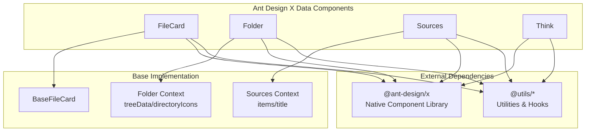
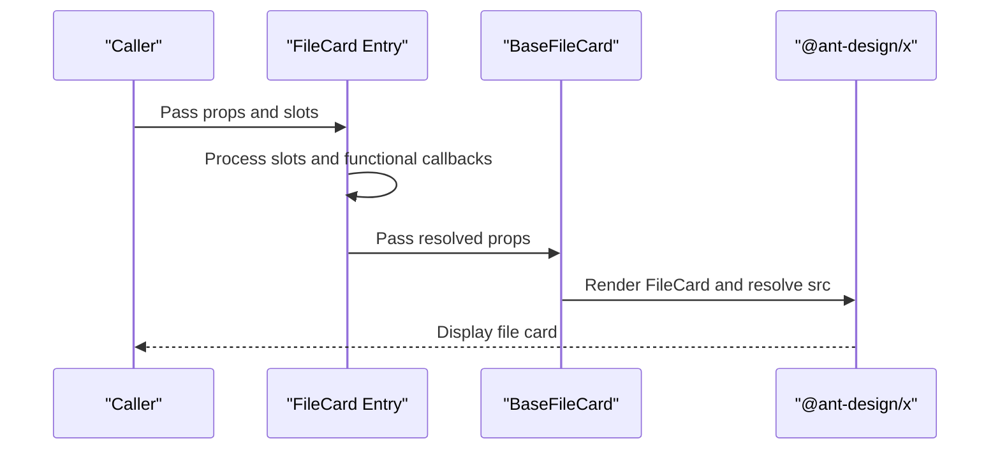
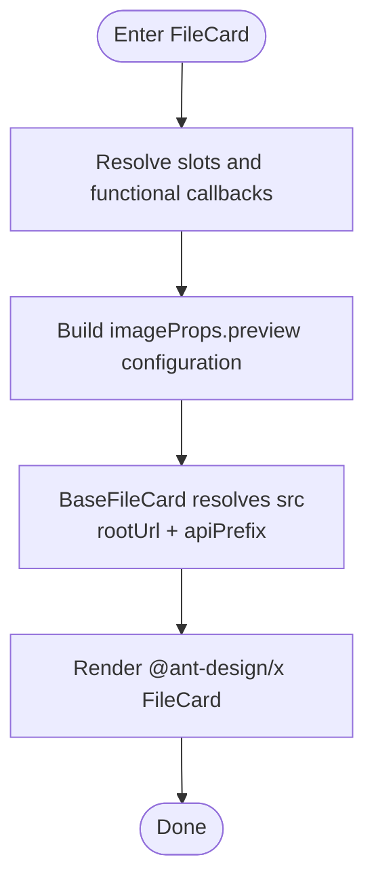
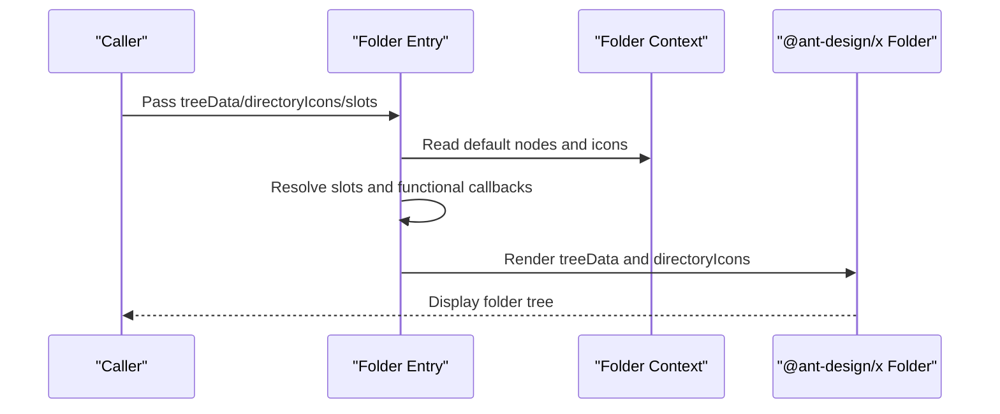
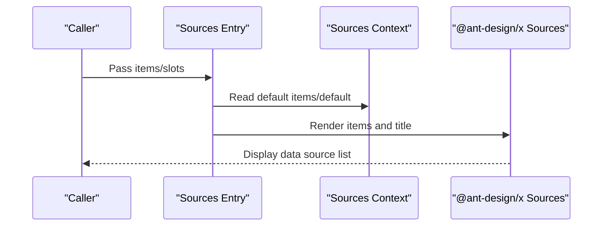
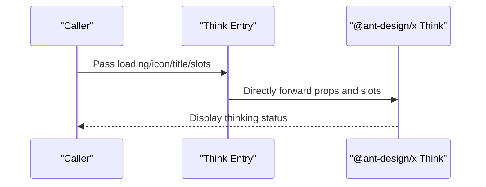
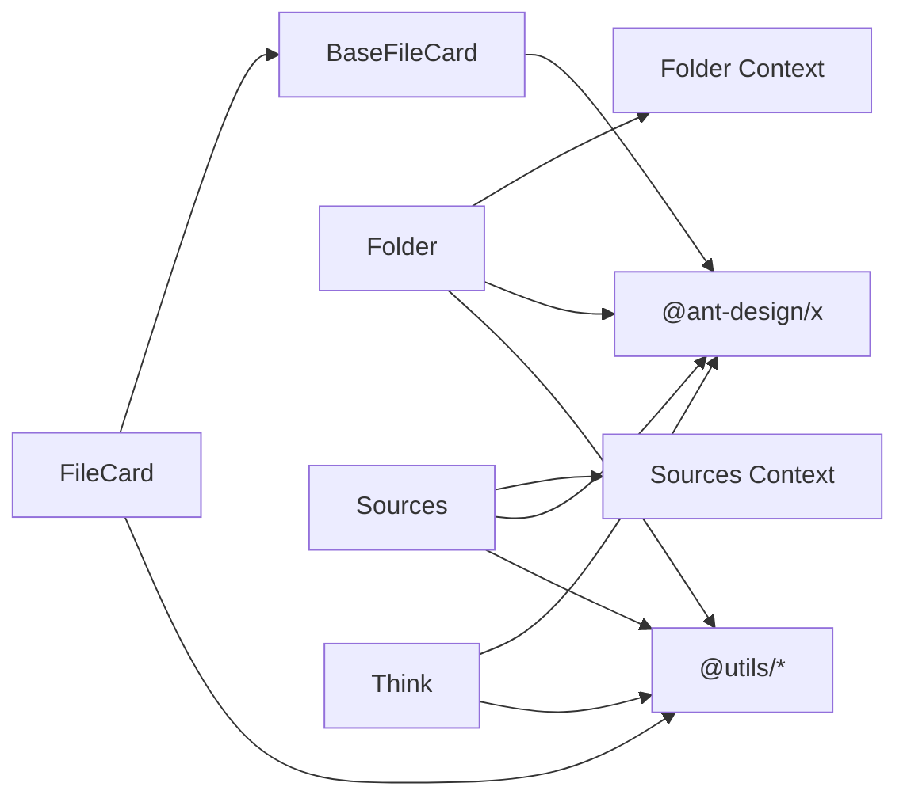

# Data Components

<cite>
**Files Referenced in This Document**
- [frontend/antdx/file-card/file-card.tsx](file://frontend/antdx/file-card/file-card.tsx)
- [frontend/antdx/file-card/base.tsx](file://frontend/antdx/file-card/base.tsx)
- [frontend/antdx/folder/folder.tsx](file://frontend/antdx/folder/folder.tsx)
- [frontend/antdx/folder/context.ts](file://frontend/antdx/folder/context.ts)
- [frontend/antdx/sources/sources.tsx](file://frontend/antdx/sources/sources.tsx)
- [frontend/antdx/sources/context.ts](file://frontend/antdx/sources/context.ts)
- [frontend/antdx/think/think.tsx](file://frontend/antdx/think/think.tsx)
</cite>

## Table of Contents

1. [Introduction](#introduction)
2. [Project Structure](#project-structure)
3. [Core Components](#core-components)
4. [Architecture Overview](#architecture-overview)
5. [Detailed Component Analysis](#detailed-component-analysis)
6. [Dependency Analysis](#dependency-analysis)
7. [Performance Considerations](#performance-considerations)
8. [Troubleshooting Guide](#troubleshooting-guide)
9. [Conclusion](#conclusion)
10. [Appendix](#appendix)

## Introduction

This document covers the data components of Ant Design X, focusing on four components: FileCard, Folder, Sources, and Think. It provides an in-depth analysis of system architecture, component responsibilities, data flow and processing logic, integration points, and error handling, along with ready-to-use examples and best practices to help developers quickly understand and correctly use these components.

## Project Structure

The frontend components of Ant Design X are located in the `frontend/antdx` directory. Each component typically consists of three parts:

- Component entry file: Responsible for bridging Svelte and React ecosystems, injecting slots and functional callbacks.
- Base implementation file: Encapsulates actual component interactions with @ant-design/x, handles data parsing and default behavior.
- Context and utilities: Provides context capabilities for slot items via createItemsContext, supporting dynamic rendering and extension.

Diagram sources

- [frontend/antdx/file-card/file-card.tsx:1-127](file://frontend/antdx/file-card/file-card.tsx#L1-L127)
- [frontend/antdx/file-card/base.tsx:1-44](file://frontend/antdx/file-card/base.tsx#L1-L44)
- [frontend/antdx/folder/folder.tsx:1-123](file://frontend/antdx/folder/folder.tsx#L1-L123)
- [frontend/antdx/folder/context.ts:1-16](file://frontend/antdx/folder/context.ts#L1-L16)
- [frontend/antdx/sources/sources.tsx:1-42](file://frontend/antdx/sources/sources.tsx#L1-L42)
- [frontend/antdx/sources/context.ts:1-7](file://frontend/antdx/sources/context.ts#L1-L7)
- [frontend/antdx/think/think.tsx:1-24](file://frontend/antdx/think/think.tsx#L1-L24)

Section sources

- [frontend/antdx/file-card/file-card.tsx:1-127](file://frontend/antdx/file-card/file-card.tsx#L1-L127)
- [frontend/antdx/file-card/base.tsx:1-44](file://frontend/antdx/file-card/base.tsx#L1-L44)
- [frontend/antdx/folder/folder.tsx:1-123](file://frontend/antdx/folder/folder.tsx#L1-L123)
- [frontend/antdx/folder/context.ts:1-16](file://frontend/antdx/folder/context.ts#L1-L16)
- [frontend/antdx/sources/sources.tsx:1-42](file://frontend/antdx/sources/sources.tsx#L1-L42)
- [frontend/antdx/sources/context.ts:1-7](file://frontend/antdx/sources/context.ts#L1-L7)
- [frontend/antdx/think/think.tsx:1-24](file://frontend/antdx/think/think.tsx#L1-L24)

## Core Components

- FileCard: Displays a single file card, supporting image placeholders, preview configuration, and slot-based customization of masks and loading indicators. Internally parses file resource URLs via BaseFileCard to ensure accessibility.
  - **Sub-component hierarchy**: FileCard is the top-level single card component; `FileCardList` (list layer) arranges multiple file cards; `FileCardListItem` (list item layer) encapsulates the rendering logic of a single list item. The hierarchy is: FileCardList → FileCardListItem → FileCard.
  - **Backend exports**: `FileCard`, `FileCardList`, and `FileCardListItem` are all exported via [backend/modelscope_studio/components/antdx/**init**.py](file://backend/modelscope_studio/components/antdx/__init__.py).
- Folder: Displays a folder tree structure, supporting treeData, directoryIcons, empty state rendering, directory title, preview title, and preview rendering slots. Provides dynamic node and icon injection via context.
- Sources: Displays a list of data sources, supporting items and title slots. Provides a default item collection via context for unified injection in parent containers.
- Think: Displays "thinking" records and status, supporting loading, icon, and title slots for different visual feedback in various states.
  - **Difference between Think and ThoughtChain**: Think (`antdx.Think`) is a lightweight single-step "thinking status" display component, typically embedded in bubble streams to indicate a single "thinking" state (belongs to data components). ThoughtChain (`antdx.ThoughtChain`) is a multi-step reasoning chain component used to display a complete reasoning sequence with inner child item support (belongs to confirmation components). Their use cases differ: Think is suitable for single-state indication; ThoughtChain is suitable for multi-step reasoning display.

Section sources

- [frontend/antdx/file-card/file-card.tsx:17-124](file://frontend/antdx/file-card/file-card.tsx#L17-L124)
- [frontend/antdx/file-card/base.tsx:9-41](file://frontend/antdx/file-card/base.tsx#L9-L41)
- [frontend/antdx/folder/folder.tsx:16-120](file://frontend/antdx/folder/folder.tsx#L16-L120)
- [frontend/antdx/folder/context.ts:3-13](file://frontend/antdx/folder/context.ts#L3-L13)
- [frontend/antdx/sources/sources.tsx:9-39](file://frontend/antdx/sources/sources.tsx#L9-L39)
- [frontend/antdx/sources/context.ts:3-4](file://frontend/antdx/sources/context.ts#L3-L4)
- [frontend/antdx/think/think.tsx:6-21](file://frontend/antdx/think/think.tsx#L6-L21)

## Architecture Overview

All four components adopt a layered design of "entry layer + base implementation/context":

- Entry layer: Uses sveltify to bridge Svelte components to the React ecosystem, uniformly handling slots and functional callbacks, and ensuring property alignment with @ant-design/x.
- Base implementation/context: Builds on the entry layer to further encapsulate data parsing, default value handling, slot rendering, and context injection, reducing duplicate logic and improving maintainability.

Diagram sources

- [frontend/antdx/file-card/file-card.tsx:34-124](file://frontend/antdx/file-card/file-card.tsx#L34-L124)
- [frontend/antdx/file-card/base.tsx:31-41](file://frontend/antdx/file-card/base.tsx#L31-L41)

Section sources

- [frontend/antdx/file-card/file-card.tsx:17-124](file://frontend/antdx/file-card/file-card.tsx#L17-L124)
- [frontend/antdx/file-card/base.tsx:9-41](file://frontend/antdx/file-card/base.tsx#L9-L41)

## Detailed Component Analysis

### FileCard Component Analysis

- Responsibilities and Capabilities
  - File information display: Supports file name, description, icon, placeholder image, loading indicator, etc.
  - Actions and preview: Supports image preview configuration (container, mask, close icon, toolbar, custom image rendering).
  - Slot-based extension: Flexibly replaces icon, description, mask, spinProps._, and imageProps._ via slots.
  - Resource resolution: Converts relative paths or FileData to accessible URLs via BaseFileCard's src resolution logic.
- Key Flow
  - Entry layer resolves slots and functional callbacks and constructs preview configuration.
  - Passes resolved imageProps and spinProps to BaseFileCard.
  - BaseFileCard uses rootUrl and apiPrefix to compute the accessible file URL.
- Usage Recommendations
  - When customizing preview toolbars or masks, prefer slot injection over directly overriding complex objects.
  - For large files or unstable network environments, configure placeholder images and loading indicators appropriately to improve user experience.

Diagram sources

- [frontend/antdx/file-card/file-card.tsx:34-124](file://frontend/antdx/file-card/file-card.tsx#L34-L124)
- [frontend/antdx/file-card/base.tsx:15-41](file://frontend/antdx/file-card/base.tsx#L15-L41)

Section sources

- [frontend/antdx/file-card/file-card.tsx:9-124](file://frontend/antdx/file-card/file-card.tsx#L9-L124)
- [frontend/antdx/file-card/base.tsx:9-41](file://frontend/antdx/file-card/base.tsx#L9-L41)

### Folder Component Analysis

- Responsibilities and Capabilities
  - Tree structure display: Supports treeData and directory icon mapping via directoryIcons.
  - Dynamic content service: Loads file content via fileContentService.onLoadFileContent.
  - Slot-based extension: Supports emptyRender, previewRender, directoryTitle, and previewTitle.
  - Context injection: Obtains default nodes and icon collections via useTreeNodeItems and useDirectoryIconItems.
- Key Flow
  - Resolves treeData or default from context, prioritizing explicitly passed treeData.
  - Converts directoryIcons into an icon dictionary keyed by file extension.
  - Converts slots and functional callbacks to render functions required by @ant-design/x.
- Usage Recommendations
  - For complex directory structures, prefer context injection of default nodes to reduce repetitive configuration.
  - Preview render functions should be kept lightweight to avoid heavy computation during rendering.

Diagram sources

- [frontend/antdx/folder/folder.tsx:25-119](file://frontend/antdx/folder/folder.tsx#L25-L119)
- [frontend/antdx/folder/context.ts:3-13](file://frontend/antdx/folder/context.ts#L3-L13)

Section sources

- [frontend/antdx/folder/folder.tsx:16-120](file://frontend/antdx/folder/folder.tsx#L16-L120)
- [frontend/antdx/folder/context.ts:1-16](file://frontend/antdx/folder/context.ts#L1-L16)

### Sources Component Analysis

- Responsibilities and Capabilities
  - Data source list display: Supports items list and title slot.
  - Context injection: Obtains default items and default via useItems, prioritizing explicitly passed items.
  - Render enhancement: Uses renderItems to clone and render item collections from context into the format required by @ant-design/x.
- Key Flow
  - Resolves items or default from context and merges into the final list.
  - Passes title and items to @ant-design/x Sources.
- Usage Recommendations
  - Inject default items centrally in a parent container for reuse across multiple locations.
  - For large lists, apply pagination or lazy loading optimization upstream.

Diagram sources

- [frontend/antdx/sources/sources.tsx:9-39](file://frontend/antdx/sources/sources.tsx#L9-L39)
- [frontend/antdx/sources/context.ts:3-4](file://frontend/antdx/sources/context.ts#L3-L4)

Section sources

- [frontend/antdx/sources/sources.tsx:9-39](file://frontend/antdx/sources/sources.tsx#L9-L39)
- [frontend/antdx/sources/context.ts:1-7](file://frontend/antdx/sources/context.ts#L1-L7)

### Think Component Analysis

- Responsibilities and Capabilities
  - Thinking record and status display: Supports loading, icon, and title slots, enabling different content to be shown in various states (e.g., loading, complete, failed).
  - Thin wrapper: Acts as a thin wrapper that directly forwards to the @ant-design/x Think component.
- Usage Recommendations
  - In async thinking workflows, combine with the loading slot to provide friendlier user feedback.
  - Use icon and title slots to differentiate thinking phases or result types.

Diagram sources

- [frontend/antdx/think/think.tsx:6-21](file://frontend/antdx/think/think.tsx#L6-L21)

Section sources

- [frontend/antdx/think/think.tsx:6-21](file://frontend/antdx/think/think.tsx#L6-L21)

## Dependency Analysis

- Inter-component Coupling
  - FileCard and BaseFileCard: Low coupling, decoupled via props passing and resolution.
  - Folder and Sources: Each depends on its own context module, independent from each other, rendered via @ant-design/x components.
  - Think: No context dependency, directly bridges @ant-design/x.
- External Dependencies
  - @ant-design/x: The foundational library for all component rendering.
  - @utils/\*: Provides common capabilities such as slot rendering, functional callback wrapping, and context creation.

Diagram sources

- [frontend/antdx/file-card/file-card.tsx:1-7](file://frontend/antdx/file-card/file-card.tsx#L1-L7)
- [frontend/antdx/file-card/base.tsx:1-7](file://frontend/antdx/file-card/base.tsx#L1-L7)
- [frontend/antdx/folder/folder.tsx:1-7](file://frontend/antdx/folder/folder.tsx#L1-L7)
- [frontend/antdx/sources/sources.tsx:1-5](file://frontend/antdx/sources/sources.tsx#L1-L5)
- [frontend/antdx/think/think.tsx:1-4](file://frontend/antdx/think/think.tsx#L1-L4)

Section sources

- [frontend/antdx/file-card/file-card.tsx:1-7](file://frontend/antdx/file-card/file-card.tsx#L1-L7)
- [frontend/antdx/file-card/base.tsx:1-7](file://frontend/antdx/file-card/base.tsx#L1-L7)
- [frontend/antdx/folder/folder.tsx:1-7](file://frontend/antdx/folder/folder.tsx#L1-L7)
- [frontend/antdx/sources/sources.tsx:1-5](file://frontend/antdx/sources/sources.tsx#L1-L5)
- [frontend/antdx/think/think.tsx:1-4](file://frontend/antdx/think/think.tsx#L1-L4)

## Performance Considerations

- Slot rendering cost control
  - Place heavy content in slots, but avoid repeated computation in render functions; use useMemo for caching when necessary.
- Data parsing and transfer
  - FileCard's src resolution is only triggered when dependencies change, avoiding unnecessary URL computation.
- List rendering optimization
  - Sources and Folder use clone and memo strategies when resolving items to reduce repeated rendering.
- Preview and images
  - Configure placeholder images and loading indicators appropriately to prevent large images from blocking the initial render.

## Troubleshooting Guide

- Image not displaying
  - Check whether src is a relative path; confirm rootUrl and apiPrefix are configured correctly.
  - Reference: [frontend/antdx/file-card/base.tsx:15-29](file://frontend/antdx/file-card/base.tsx#L15-L29)
- Preview function abnormal
  - Confirm that imageProps.preview slots are correctly injected and functional callbacks are properly wrapped.
  - Reference: [frontend/antdx/file-card/file-card.tsx:34-124](file://frontend/antdx/file-card/file-card.tsx#L34-L124)
- Directory icons not working
  - Confirm directoryIcons are mapped by file extension and injected via context.
  - Reference: [frontend/antdx/folder/folder.tsx:71-87](file://frontend/antdx/folder/folder.tsx#L71-L87)
- Data source list empty
  - Check whether items and default are correctly injected or explicitly overridden.
  - Reference: [frontend/antdx/sources/sources.tsx:13-33](file://frontend/antdx/sources/sources.tsx#L13-L33)
- Thinking status not updating
  - Confirm loading/icon/title slots are correctly injected and functional callbacks are properly wrapped.
  - Reference: [frontend/antdx/think/think.tsx:6-21](file://frontend/antdx/think/think.tsx#L6-L21)

Section sources

- [frontend/antdx/file-card/base.tsx:15-29](file://frontend/antdx/file-card/base.tsx#L15-L29)
- [frontend/antdx/file-card/file-card.tsx:34-124](file://frontend/antdx/file-card/file-card.tsx#L34-L124)
- [frontend/antdx/folder/folder.tsx:71-87](file://frontend/antdx/folder/folder.tsx#L71-L87)
- [frontend/antdx/sources/sources.tsx:13-33](file://frontend/antdx/sources/sources.tsx#L13-L33)
- [frontend/antdx/think/think.tsx:6-21](file://frontend/antdx/think/think.tsx#L6-L21)

## Conclusion

This document systematically covers the frontend implementation and usage of Ant Design X data components, focusing on FileCard, Folder, Sources, and Think. Through slot and functional callback bridging in the entry layer, data parsing and default value handling in the base implementation, and context-driven dynamic injection mechanisms, these components maintain API semantics consistent with @ant-design/x while providing stronger extensibility and maintainability. It is recommended to follow the usage guidelines and best practices in this document in actual projects for a more stable and efficient experience.

## Appendix

- Usage Examples (Based on Component Responsibilities and Interfaces)
  - File card display and preview
    - Key steps: Prepare file data src, configure imageProps.preview slots (e.g., mask, toolbar), and optionally set placeholder image and loading indicator.
    - Reference: [frontend/antdx/file-card/file-card.tsx:34-124](file://frontend/antdx/file-card/file-card.tsx#L34-L124), [frontend/antdx/file-card/base.tsx:15-41](file://frontend/antdx/file-card/base.tsx#L15-L41)
  - Folder tree structure and directory management
    - Key steps: Prepare treeData or inject default nodes via context; configure extension-based mapping for directoryIcons; inject emptyRender, previewRender, directoryTitle, and previewTitle as needed.
    - Reference: [frontend/antdx/folder/folder.tsx:25-119](file://frontend/antdx/folder/folder.tsx#L25-L119), [frontend/antdx/folder/context.ts:3-13](file://frontend/antdx/folder/context.ts#L3-L13)
  - Data source management and metadata display
    - Key steps: Inject default items or default in the parent container; override items when needed; customize title via the title slot.
    - Reference: [frontend/antdx/sources/sources.tsx:9-39](file://frontend/antdx/sources/sources.tsx#L9-L39), [frontend/antdx/sources/context.ts:3-4](file://frontend/antdx/sources/context.ts#L3-L4)
  - Thinking record and status management
    - Key steps: Inject loading/icon/title slots at different stages; switch displayed content based on status in async workflows.
    - Reference: [frontend/antdx/think/think.tsx:6-21](file://frontend/antdx/think/think.tsx#L6-L21)
