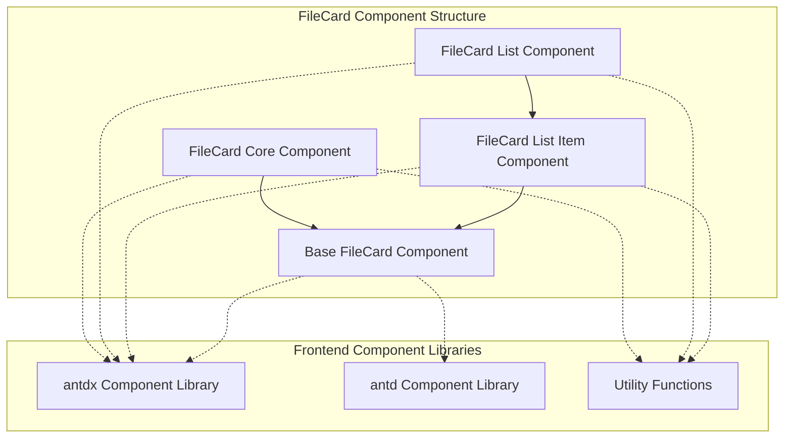
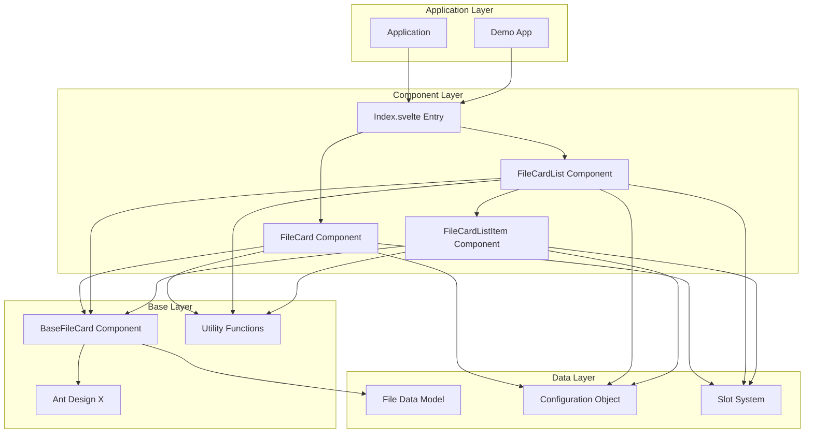
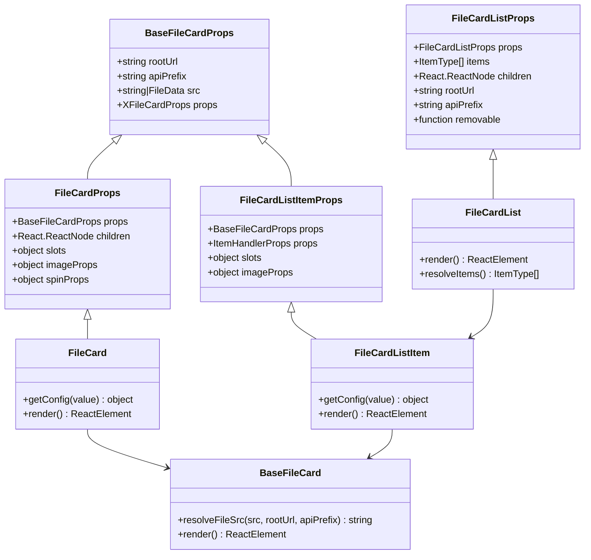
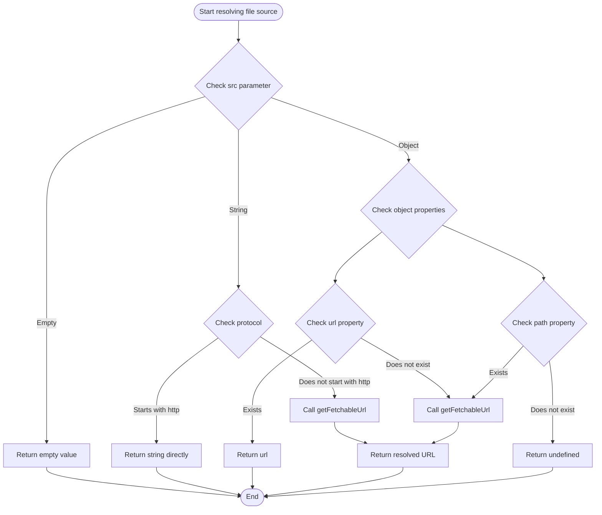
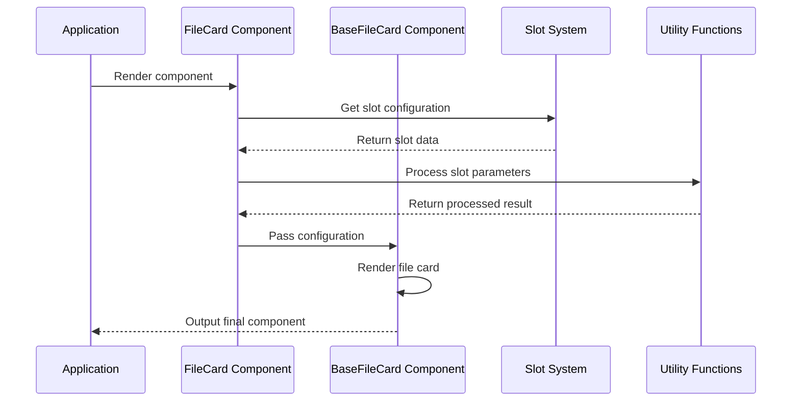
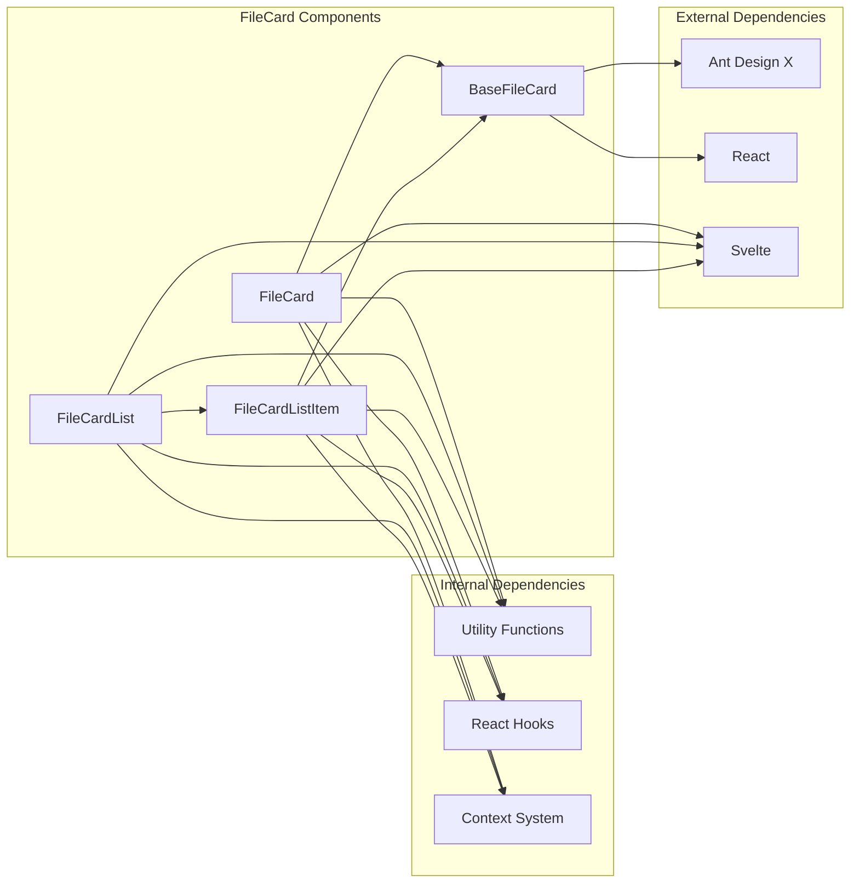

# FileCard Component

<cite>
**Files Referenced in This Document**
- [frontend/antdx/file-card/file-card.tsx](file://frontend/antdx/file-card/file-card.tsx)
- [frontend/antdx/file-card/base.tsx](file://frontend/antdx/file-card/base.tsx)
- [frontend/antdx/file-card/Index.svelte](file://frontend/antdx/file-card/Index.svelte)
- [frontend/antdx/file-card/list/file-card.list.tsx](file://frontend/antdx/file-card/list/file-card.list.tsx)
- [frontend/antdx/file-card/list/context.ts](file://frontend/antdx/file-card/list/context.ts)
- [frontend/antdx/file-card/list/item/file-card.list.item.tsx](file://frontend/antdx/file-card/list/item/file-card.list.item.tsx)
</cite>

## Table of Contents

1. [Introduction](#introduction)
2. [Project Structure](#project-structure)
3. [Core Components](#core-components)
4. [Architecture Overview](#architecture-overview)
5. [Detailed Component Analysis](#detailed-component-analysis)
6. [Dependency Analysis](#dependency-analysis)
7. [Performance Considerations](#performance-considerations)
8. [Troubleshooting Guide](#troubleshooting-guide)
9. [Conclusion](#conclusion)

## Introduction

The FileCard component is an important component in the ModelScope Studio frontend framework, extended and encapsulated based on the Ant Design X FileCard component. It provides file display, preview, and upload capabilities, supporting multiple file types and custom configuration options.

The component consists of three core parts:

- **Base FileCard component**: Provides core file display functionality
- **FileCard List component**: Used to display a list view of multiple file cards
- **FileCard List Item component**: The concrete implementation of a single file card in a list

## Project Structure

The FileCard component is located in the antdx component library of the frontend project, organized in a modular manner:

**Diagram sources**

- [frontend/antdx/file-card/file-card.tsx:1-127](file://frontend/antdx/file-card/file-card.tsx#L1-L127)
- [frontend/antdx/file-card/list/file-card.list.tsx:1-68](file://frontend/antdx/file-card/list/file-card.list.tsx#L1-L68)

**Section sources**

- [frontend/antdx/file-card/file-card.tsx:1-127](file://frontend/antdx/file-card/file-card.tsx#L1-L127)
- [frontend/antdx/file-card/list/file-card.list.tsx:1-68](file://frontend/antdx/file-card/list/file-card.list.tsx#L1-L68)

## Core Components

### Base FileCard Component (BaseFileCard)

The BaseFileCard component is the foundation of the entire FileCard system, responsible for handling file source resolution and basic file display logic.

**Key Features:**

- Supports both string and FileData type file sources
- Automatically resolves accessible file URLs
- Integrates Ant Design X's FileCard component
- Provides root URL and API prefix configuration

**Key Methods:**

- `resolveFileSrc()`: Resolves the file source, supporting both local and remote files
- `BaseFileCard`: Main component rendering logic

**Section sources**

- [frontend/antdx/file-card/base.tsx:1-44](file://frontend/antdx/file-card/base.tsx#L1-L44)

### FileCard Component

The FileCard component is a further encapsulation of the base component, adding React Slot support and richer configuration options.

**Main Features:**

- Supports the React Slot system
- Enhanced image preview functionality
- Loading state indicator configuration
- Custom icon and description content

**Core Configuration:**

- `imageProps.placeholder`: Placeholder configuration
- `imageProps.preview`: Preview function configuration
- `spinProps`: Loading state configuration
- `slots`: Slot system support

**Section sources**

- [frontend/antdx/file-card/file-card.tsx:1-127](file://frontend/antdx/file-card/file-card.tsx#L1-L127)

### FileCard List Component (FileCardList)

The FileCardList component is used to display multiple file cards, supporting bulk operations and unified configuration.

**Key Features:**

- Bulk file management
- Removable functionality
- Slot system integration
- Item context management

**Section sources**

- [frontend/antdx/file-card/list/file-card.list.tsx:1-68](file://frontend/antdx/file-card/list/file-card.list.tsx#L1-L68)

### FileCard List Item Component (FileCardListItem)

The concrete implementation of a single file card in a list, inheriting all functionality of the base file card.

**Key Features:**

- List item handling mechanism
- Slot parameter passing
- Preview configuration
- Item context integration

**Section sources**

- [frontend/antdx/file-card/list/item/file-card.list.item.tsx:1-83](file://frontend/antdx/file-card/list/item/file-card.list.item.tsx#L1-L83)

## Architecture Overview

The FileCard component adopts a layered architecture design, forming a clear hierarchy from the underlying base component to the upper-level application components:

**Diagram sources**

- [frontend/antdx/file-card/Index.svelte:1-66](file://frontend/antdx/file-card/Index.svelte#L1-L66)
- [frontend/antdx/file-card/file-card.tsx:1-127](file://frontend/antdx/file-card/file-card.tsx#L1-L127)
- [frontend/antdx/file-card/list/file-card.list.tsx:1-68](file://frontend/antdx/file-card/list/file-card.list.tsx#L1-L68)

## Detailed Component Analysis

### Base FileCard Component Class Diagram

**Diagram sources**

- [frontend/antdx/file-card/base.tsx:9-13](file://frontend/antdx/file-card/base.tsx#L9-L13)
- [frontend/antdx/file-card/file-card.tsx:17-34](file://frontend/antdx/file-card/file-card.tsx#L17-L34)
- [frontend/antdx/file-card/list/file-card.list.tsx:14-21](file://frontend/antdx/file-card/list/file-card.list.tsx#L14-L21)
- [frontend/antdx/file-card/list/item/file-card.list.item.tsx:16-31](file://frontend/antdx/file-card/list/item/file-card.list.item.tsx#L16-L31)

### File Source Resolution Flow

**Diagram sources**

- [frontend/antdx/file-card/base.tsx:15-29](file://frontend/antdx/file-card/base.tsx#L15-L29)

### Slot System Workflow

**Diagram sources**

- [frontend/antdx/file-card/file-card.tsx:34-124](file://frontend/antdx/file-card/file-card.tsx#L34-L124)
- [frontend/antdx/file-card/base.tsx:31-41](file://frontend/antdx/file-card/base.tsx#L31-L41)

**Section sources**

- [frontend/antdx/file-card/base.tsx:1-44](file://frontend/antdx/file-card/base.tsx#L1-L44)
- [frontend/antdx/file-card/file-card.tsx:1-127](file://frontend/antdx/file-card/file-card.tsx#L1-L127)
- [frontend/antdx/file-card/list/file-card.list.tsx:1-68](file://frontend/antdx/file-card/list/file-card.list.tsx#L1-L68)
- [frontend/antdx/file-card/list/item/file-card.list.item.tsx:1-83](file://frontend/antdx/file-card/list/item/file-card.list.item.tsx#L1-L83)

## Dependency Analysis

The dependency relationship of the FileCard component is relatively clear, primarily depending on the Ant Design X component library and internal utility functions:

**Diagram sources**

- [frontend/antdx/file-card/file-card.tsx:1-7](file://frontend/antdx/file-card/file-card.tsx#L1-L7)
- [frontend/antdx/file-card/base.tsx:1-7](file://frontend/antdx/file-card/base.tsx#L1-L7)
- [frontend/antdx/file-card/list/file-card.list.tsx:1-8](file://frontend/antdx/file-card/list/file-card.list.tsx#L1-L8)

**Section sources**

- [frontend/antdx/file-card/file-card.tsx:1-127](file://frontend/antdx/file-card/file-card.tsx#L1-L127)
- [frontend/antdx/file-card/base.tsx:1-44](file://frontend/antdx/file-card/base.tsx#L1-L44)
- [frontend/antdx/file-card/list/file-card.list.tsx:1-68](file://frontend/antdx/file-card/list/file-card.list.tsx#L1-L68)

## Performance Considerations

The FileCard component was designed with performance optimization in mind:

### Memory Management

- Uses `useMemo` to cache file source resolution results
- Avoids unnecessary component re-renders
- Proper use of React Slots to reduce DOM operations

### Render Optimization

- Conditional rendering of slot content
- Lazy loading components to avoid initial render pressure
- Optimized performance for the image preview feature

### Data Flow Optimization

- Unidirectional data flow design
- Avoids passing deeply nested objects
- Reasonable event handling mechanisms

## Troubleshooting Guide

### Common Issues and Solutions

**File not displaying**

- Check whether the file source URL is correct
- Confirm network connectivity and permission settings
- Verify that the file format is supported

**Preview function abnormal**

- Check the image preview configuration
- Confirm the slot system is working correctly
- Verify that the container element exists

**Component rendering error**

- Check the usage of React Slots
- Confirm that required dependencies are installed correctly
- Verify the import path of the component

**Section sources**

- [frontend/antdx/file-card/base.tsx:15-29](file://frontend/antdx/file-card/base.tsx#L15-L29)
- [frontend/antdx/file-card/file-card.tsx:34-124](file://frontend/antdx/file-card/file-card.tsx#L34-L124)

## Conclusion

The FileCard component is a fully functional and well-designed frontend component system. Through its clear layered architecture, flexible slot system, and comprehensive configuration options, it provides users with powerful file management and display capabilities.

The main advantages of the component include:

- **Modular design**: Clear component hierarchy structure
- **Flexible configuration**: Rich configuration options and slot system
- **Performance optimization**: Reasonable memory management and render optimization
- **Easy to extend**: Standardized interface design facilitates feature extension

This component system provides ModelScope Studio with reliable file processing capabilities to meet the needs of various file display and management scenarios.
