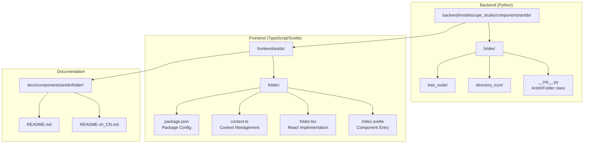
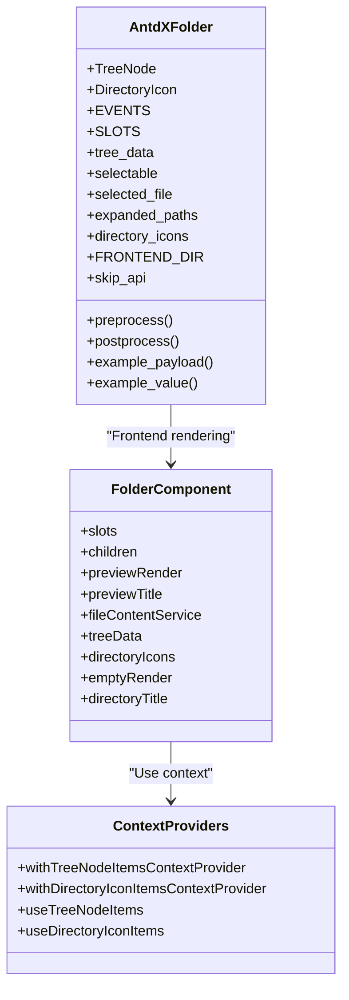
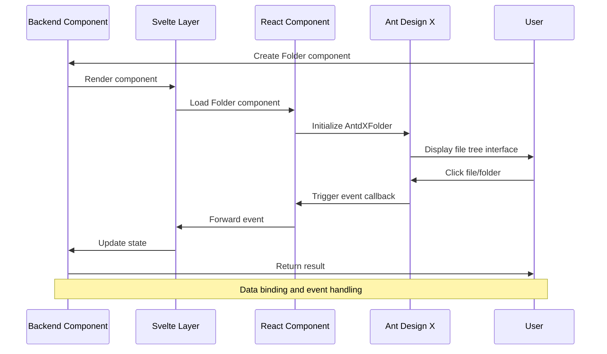
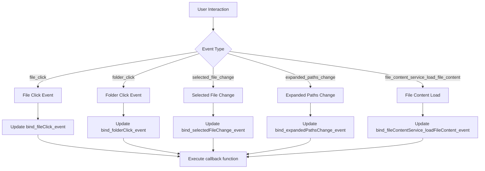
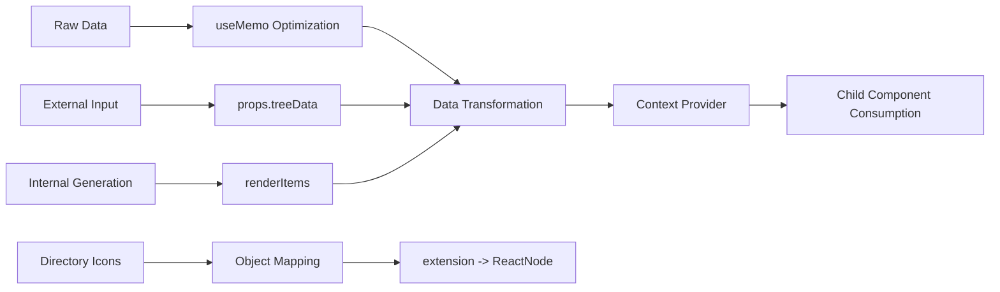

# Folder Component

<cite>
**Files Referenced in This Document**
- [backend/modelscope_studio/components/antdx/folder/__init__.py](file://backend/modelscope_studio/components/antdx/folder/__init__.py)
- [frontend/antdx/folder/Index.svelte](file://frontend/antdx/folder/Index.svelte)
- [frontend/antdx/folder/folder.tsx](file://frontend/antdx/folder/folder.tsx)
- [frontend/antdx/folder/context.ts](file://frontend/antdx/folder/context.ts)
- [frontend/antdx/folder/package.json](file://frontend/antdx/folder/package.json)
- [backend/modelscope_studio/components/antd/__init__.py](file://backend/modelscope_studio/components/antd/__init__.py)
- [backend/modelscope_studio/components/antd/components.py](file://backend/modelscope_studio/components/antd/components.py)
- [docs/components/antdx/folder/README-zh_CN.md](file://docs/components/antdx/folder/README-zh_CN.md)
- [docs/components/antdx/folder/README.md](file://docs/components/antdx/folder/README.md)
</cite>

## Table of Contents

1. [Introduction](#introduction)
2. [Project Structure](#project-structure)
3. [Core Components](#core-components)
4. [Architecture Overview](#architecture-overview)
5. [Detailed Component Analysis](#detailed-component-analysis)
6. [Dependency Analysis](#dependency-analysis)
7. [Performance Considerations](#performance-considerations)
8. [Troubleshooting Guide](#troubleshooting-guide)
9. [Conclusion](#conclusion)

## Introduction

The Folder component is an important file tree component in ModelScope Studio, built on top of Ant Design X's Folder component. It is primarily used to display file system structures, providing hierarchical browsing of files and folders. It supports event handling for file clicks, folder clicks, selected file changes, and expanded path changes, along with rich customization options.

The component is implemented on the frontend using the Svelte framework, bridged to Ant Design X's native component through a React preprocessing mechanism, achieving a complete data flow and event flow from the Python backend to the React frontend.

## Project Structure

The location and organizational structure of the Folder component within the project:



**Diagram sources**

- [backend/modelscope_studio/components/antdx/folder/**init**.py:1-114](file://backend/modelscope_studio/components/antdx/folder/__init__.py#L1-L114)
- [frontend/antdx/folder/Index.svelte:1-81](file://frontend/antdx/folder/Index.svelte#L1-L81)
- [frontend/antdx/folder/folder.tsx:1-124](file://frontend/antdx/folder/folder.tsx#L1-L124)

**Section sources**

- [backend/modelscope_studio/components/antdx/folder/**init**.py:1-114](file://backend/modelscope_studio/components/antdx/folder/__init__.py#L1-L114)
- [frontend/antdx/folder/Index.svelte:1-81](file://frontend/antdx/folder/Index.svelte#L1-L81)
- [frontend/antdx/folder/folder.tsx:1-124](file://frontend/antdx/folder/folder.tsx#L1-L124)

## Core Components

### AntdXFolder Class

AntdXFolder is the core backend component class, inheriting from ModelScopeLayoutComponent. It defines the complete component interface and behavioral specification.

**Key Features:**

- Supports multiple event listeners (file_click, folder_click, selected_file_change, expanded_paths_change)
- Provides rich configuration properties (tree_data, selectable, selected_file, expanded_paths, etc.)
- Supports a slot system (emptyRender, previewRender, directoryTitle, etc.)
- Integrates component lifecycle management in the Gradio ecosystem

**Key Property Descriptions:**

- `tree_data`: File tree data structure defining the hierarchy of files and folders
- `selectable`: Whether file selection is allowed
- `selected_file`: Currently selected file path list
- `expanded_paths`: Default expanded path list
- `directory_icons`: Custom directory icon mapping

**Section sources**

- [backend/modelscope_studio/components/antdx/folder/**init**.py:12-114](file://backend/modelscope_studio/components/antdx/folder/__init__.py#L12-L114)

### Frontend Component Architecture

The frontend component adopts a layered architecture design, implemented through bridging Svelte and React:



**Diagram sources**

- [backend/modelscope_studio/components/antdx/folder/**init**.py:12-114](file://backend/modelscope_studio/components/antdx/folder/__init__.py#L12-L114)
- [frontend/antdx/folder/folder.tsx:16-124](file://frontend/antdx/folder/folder.tsx#L16-L124)
- [frontend/antdx/folder/context.ts:1-16](file://frontend/antdx/folder/context.ts#L1-L16)

**Section sources**

- [frontend/antdx/folder/folder.tsx:16-124](file://frontend/antdx/folder/folder.tsx#L16-L124)
- [frontend/antdx/folder/context.ts:1-16](file://frontend/antdx/folder/context.ts#L1-L16)

## Architecture Overview

The overall architecture of the Folder component adopts a layered design, achieving a complete data flow from the Python backend to the React frontend:



**Diagram sources**

- [backend/modelscope_studio/components/antdx/folder/**init**.py:19-35](file://backend/modelscope_studio/components/antdx/folder/__init__.py#L19-L35)
- [frontend/antdx/folder/Index.svelte:10-81](file://frontend/antdx/folder/Index.svelte#L10-L81)
- [frontend/antdx/folder/folder.tsx:25-121](file://frontend/antdx/folder/folder.tsx#L25-L121)

## Detailed Component Analysis

### Event Handling Mechanism

The Folder component supports multiple event listeners, each with its specific functionality and trigger conditions:



**Diagram sources**

- [backend/modelscope_studio/components/antdx/folder/**init**.py:19-35](file://backend/modelscope_studio/components/antdx/folder/__init__.py#L19-L35)

### Slot System

The component provides a flexible slot system, allowing developers to customize various display content:

| Slot Name      | Description           | Use Case                                           |
| -------------- | --------------------- | -------------------------------------------------- |
| emptyRender    | Empty state rendering | Display custom content when the file tree is empty |
| previewRender  | Preview rendering     | Customize file preview content                     |
| directoryTitle | Directory title       | Customize directory display title                  |
| previewTitle   | Preview title         | Customize preview title display                    |
| treeData       | Tree data             | Customize tree data structure                      |
| directoryIcons | Directory icons       | Customize file type icons                          |

**Section sources**

- [backend/modelscope_studio/components/antdx/folder/**init**.py:37-41](file://backend/modelscope_studio/components/antdx/folder/__init__.py#L37-L41)

### Data Flow Processing

The component's data flow processing uses React's useMemo optimization mechanism:



**Diagram sources**

- [frontend/antdx/folder/folder.tsx:60-88](file://frontend/antdx/folder/folder.tsx#L60-L88)

**Section sources**

- [frontend/antdx/folder/folder.tsx:60-88](file://frontend/antdx/folder/folder.tsx#L60-L88)

## Dependency Analysis

The dependency relationships of the Folder component reflect a clear layered architecture:

```mermaid
graph TB
subgraph "External Dependencies"
A[@ant-design/x] --> B[AntdXFolder]
C[classnames] --> D[Svelte Style Processing]
E[react] --> F[React Slot]
end
subgraph "Internal Dependencies"
G[createItemsContext] --> H[Context Provider]
I[renderItems] --> J[Item Rendering]
K[renderParamsSlot] --> L[Parameterized Slots]
M[useFunction] --> N[Function Wrapping]
end
subgraph "Component Hierarchy"
O[AntdXFolder] --> P[Index.svelte]
P --> Q[folder.tsx]
Q --> R[React Component]
R --> S[Ant Design X]
end
A --> R
G --> Q
I --> Q
K --> Q
M --> Q
```

**Diagram sources**

- [frontend/antdx/folder/folder.tsx:1-15](file://frontend/antdx/folder/folder.tsx#L1-L15)
- [frontend/antdx/folder/Index.svelte:1-10](file://frontend/antdx/folder/Index.svelte#L1-L10)
- [frontend/antdx/folder/context.ts:1-16](file://frontend/antdx/folder/context.ts#L1-L16)

**Section sources**

- [frontend/antdx/folder/package.json:1-15](file://frontend/antdx/folder/package.json#L1-L15)
- [frontend/antdx/folder/folder.tsx:1-15](file://frontend/antdx/folder/folder.tsx#L1-L15)

## Performance Considerations

### Render Optimization

The component adopts several performance optimization strategies:

1. **useMemo optimization**: Memoizes treeData and directoryIcons to avoid unnecessary recomputation
2. **Conditional rendering**: Only renders children content when needed, reducing the number of DOM nodes
3. **Lazy loading**: Implements dynamic import and lazy loading of components via importComponent

### Memory Management

- Context providers use appropriate cleanup mechanisms
- Event handlers are wrapped with useFunction to ensure correct `this` binding
- Slot content is rendered on demand to avoid memory leaks

## Troubleshooting Guide

### Common Issues and Solutions

**Issue 1: Component not displaying**

- Check whether tree_data is correctly set
- Confirm that the FRONTEND_DIR path is correctly resolved
- Verify the component's visible property

**Issue 2: Events not triggering**

- Confirm that event listeners are correctly registered
- Check whether bind\_\*\_event properties are set
- Verify that the callback function signature is correct

**Issue 3: Icons not displaying**

- Check the directory_icons configuration
- Confirm that the extension mapping is correct
- Verify the import path of icon components

**Section sources**

- [backend/modelscope_studio/components/antdx/folder/**init**.py:97-101](file://backend/modelscope_studio/components/antdx/folder/__init__.py#L97-L101)

## Conclusion

The Folder component is a fully functional file tree component with a clear architecture. It successfully combines the powerful capabilities of Ant Design X with the ModelScope Studio ecosystem, providing users with an excellent file browsing experience.

**Main Advantages:**

- Complete event handling mechanism
- Flexible slot system
- Excellent performance
- Clear code structure
- Good extensibility

**Applicable Scenarios:**

- File management systems
- Code editors
- Asset management tools
- Document browsing applications

This component provides ModelScope Studio with powerful file tree display capabilities and serves as an important foundational component for building complex frontend applications.
