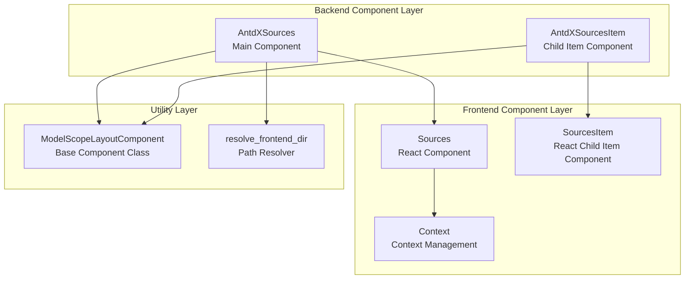
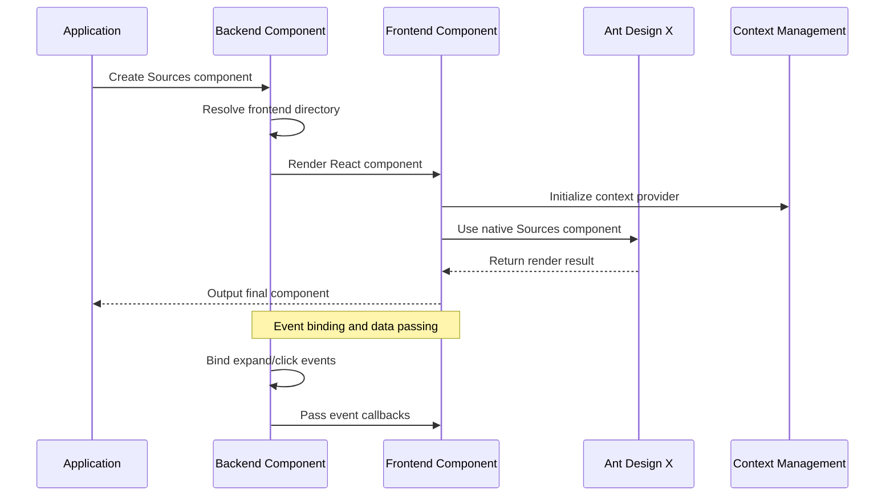
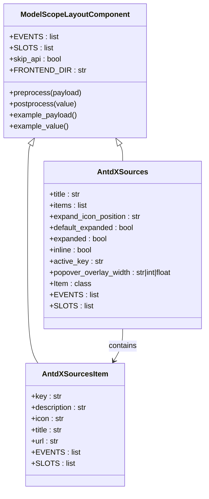
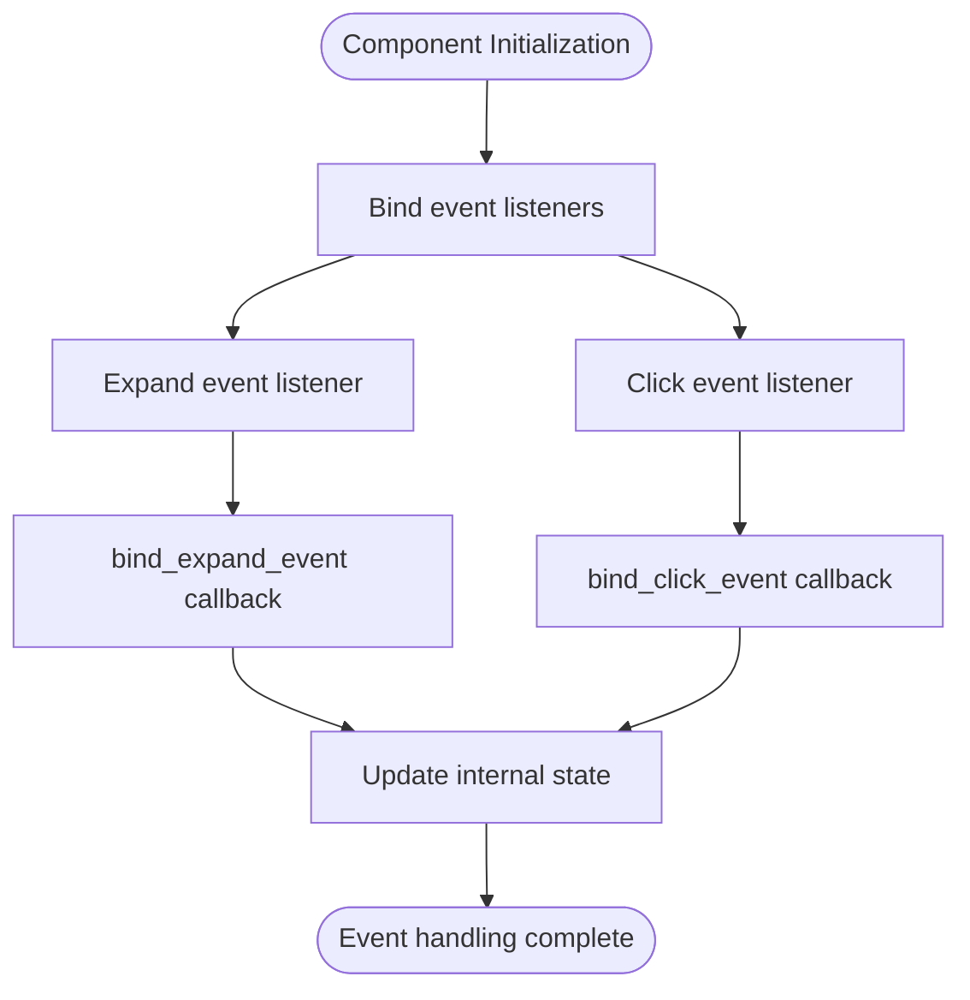
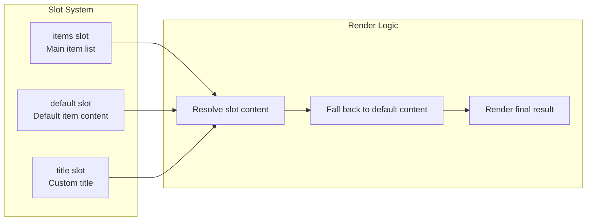

# Sources Component

<cite>
**Files Referenced in This Document**
- [backend/modelscope_studio/components/antdx/sources/__init__.py](file://backend/modelscope_studio/components/antdx/sources/__init__.py)
- [backend/modelscope_studio/components/antdx/sources/item/__init__.py](file://backend/modelscope_studio/components/antdx/sources/item/__init__.py)
- [frontend/antdx/sources/sources.tsx](file://frontend/antdx/sources/sources.tsx)
- [frontend/antdx/sources/item/sources.item.tsx](file://frontend/antdx/sources/item/sources.item.tsx)
- [frontend/antdx/sources/context.ts](file://frontend/antdx/sources/context.ts)
- [backend/modelscope_studio/utils/dev/component.py](file://backend/modelscope_studio/utils/dev/component.py)
- [backend/modelscope_studio/utils/dev/resolve_frontend_dir.py](file://backend/modelscope_studio/utils/dev/resolve_frontend_dir.py)
- [backend/modelscope_studio/components/antdx/components.py](file://backend/modelscope_studio/components/antdx/components.py)
- [docs/components/antdx/sources/README-zh_CN.md](file://docs/components/antdx/sources/README-zh_CN.md)
- [docs/components/antdx/sources/demos/basic.py](file://docs/components/antdx/sources/demos/basic.py)
</cite>

## Table of Contents

1. [Introduction](#introduction)
2. [Project Structure](#project-structure)
3. [Core Components](#core-components)
4. [Architecture Overview](#architecture-overview)
5. [Detailed Component Analysis](#detailed-component-analysis)
6. [Dependency Analysis](#dependency-analysis)
7. [Performance Considerations](#performance-considerations)
8. [Troubleshooting Guide](#troubleshooting-guide)
9. [Conclusion](#conclusion)

## Introduction

The Sources component is a core component in ModelScope Studio for displaying a list of information sources in AI chat scenarios. Built on top of Ant Design X's Sources component, it is specifically designed to display references, link sources, and other related information.

The component supports multiple configuration options, including title settings, expanded state control, inline display mode, and provides complete event handling mechanisms including click events and expand events.

## Project Structure

The Sources component adopts a frontend/backend separated architecture design, mainly consisting of the following structure:



**Diagram sources**

- [backend/modelscope_studio/components/antdx/sources/**init**.py:11-92](file://backend/modelscope_studio/components/antdx/sources/__init__.py#L11-L92)
- [frontend/antdx/sources/sources.tsx:1-41](file://frontend/antdx/sources/sources.tsx#L1-L41)

**Section sources**

- [backend/modelscope_studio/components/antdx/sources/**init**.py:1-92](file://backend/modelscope_studio/components/antdx/sources/__init__.py#L1-L92)
- [backend/modelscope_studio/components/antdx/sources/item/**init**.py:1-68](file://backend/modelscope_studio/components/antdx/sources/item/__init__.py#L1-L68)

## Core Components

### AntdXSources Main Component

AntdXSources is the main container of the Sources component, responsible for managing the display and interaction of the entire data source list.

**Key Features:**

- Supports title display and customization
- Configurable expand icon position (start/end)
- Default expanded and controlled expanded states
- Inline display mode support
- Active key management
- Popover overlay width setting

**Key Properties:**

- `title`: Title text displayed at the top of the component
- `items`: Array configuration of data source items
- `expand_icon_position`: Display position of the expand icon
- `default_expanded`: Default expanded state
- `expanded`: Controlled expanded state
- `inline`: Whether to enable inline display mode
- `active_key`: Currently active item key
- `popover_overlay_width`: Popover overlay width

### AntdXSourcesItem Child Item Component

AntdXSourcesItem represents a single data source entry, used to display specific source information.

**Key Features:**

- Supports customization of title, icon, and description
- Link address configuration
- Unique key identifier
- Slot system support

**Key Properties:**

- `key`: Unique identifier of the item
- `title`: Item title
- `description`: Item description information
- `icon`: Custom icon
- `url`: Navigation link address

**Section sources**

- [backend/modelscope_studio/components/antdx/sources/**init**.py:30-73](file://backend/modelscope_studio/components/antdx/sources/__init__.py#L30-L73)
- [backend/modelscope_studio/components/antdx/sources/item/**init**.py:18-48](file://backend/modelscope_studio/components/antdx/sources/item/__init__.py#L18-L48)

## Architecture Overview

The Sources component adopts a layered architecture design, achieving clear separation of concerns:



**Diagram sources**

- [backend/modelscope_studio/utils/dev/resolve_frontend_dir.py:4-16](file://backend/modelscope_studio/utils/dev/resolve_frontend_dir.py#L4-L16)
- [frontend/antdx/sources/sources.tsx:9-38](file://frontend/antdx/sources/sources.tsx#L9-L38)

**Section sources**

- [frontend/antdx/sources/sources.tsx:1-41](file://frontend/antdx/sources/sources.tsx#L1-L41)
- [frontend/antdx/sources/item/sources.item.tsx:1-14](file://frontend/antdx/sources/item/sources.item.tsx#L1-L14)

## Detailed Component Analysis

### Backend Component Implementation

#### ModelScopeLayoutComponent Base Class

All Sources components inherit from ModelScopeLayoutComponent, a layout component base class specifically designed for ModelScope Studio.

**Core Functions:**

- Provides the basic framework for Gradio components
- Handles component lifecycle management
- Supports slot system integration
- Manages internal component state

#### AntdXSources Component Implementation



**Diagram sources**

- [backend/modelscope_studio/utils/dev/component.py:11-169](file://backend/modelscope_studio/utils/dev/component.py#L11-L169)
- [backend/modelscope_studio/components/antdx/sources/**init**.py:11-92](file://backend/modelscope_studio/components/antdx/sources/__init__.py#L11-L92)
- [backend/modelscope_studio/components/antdx/sources/item/**init**.py:8-68](file://backend/modelscope_studio/components/antdx/sources/item/__init__.py#L8-L68)

**Frontend Component Implementation**

#### Sources React Component

The Sources component is implemented using React, integrated with the Svelte ecosystem through the sveltify wrapper.

**Core Features:**

- Uses Ant Design X's native Sources component
- Supports a slot system, allowing custom title content
- Dynamically processes item lists
- Event handling mechanism

#### SourcesItem React Child Component

SourcesItem is the React implementation of a single data source item, processing item logic through ItemHandler.

**Key Features:**

- Accepts partial SourcesProps type
- Uses ItemHandler for item processing
- Supports additional item handler properties

**Section sources**

- [frontend/antdx/sources/sources.tsx:1-41](file://frontend/antdx/sources/sources.tsx#L1-L41)
- [frontend/antdx/sources/item/sources.item.tsx:1-14](file://frontend/antdx/sources/item/sources.item.tsx#L1-L14)

### Event Handling Mechanism

The Sources component supports two main events:



**Diagram sources**

- [backend/modelscope_studio/components/antdx/sources/**init**.py:18-25](file://backend/modelscope_studio/components/antdx/sources/__init__.py#L18-L25)

**Event Types:**

- `expand`: Triggered when the user expands or collapses a data source
- `click`: Triggered when the user clicks a data source item

**Section sources**

- [backend/modelscope_studio/components/antdx/sources/**init**.py:18-25](file://backend/modelscope_studio/components/antdx/sources/__init__.py#L18-L25)

### Slot System

The Sources component supports a flexible slot system, allowing developers to customize different parts of the component:



**Diagram sources**

- [frontend/antdx/sources/sources.tsx:12-36](file://frontend/antdx/sources/sources.tsx#L12-L36)

**Supported Slots:**

- `items`: Main data source item list
- `default`: Default item content
- `title`: Custom title content

**Section sources**

- [frontend/antdx/sources/sources.tsx:12-36](file://frontend/antdx/sources/sources.tsx#L12-L36)

## Dependency Analysis

The dependency relationship of the Sources component is relatively straightforward, primarily depending on Ant Design X and related utility libraries:

```mermaid
graph TB
subgraph "External Dependencies"
AntDX[@ant-design/x<br/>Ant Design X Core Components]
SveltePreprocess[@svelte-preprocess-react<br/>Svelte-React Bridge]
Utils[@utils/*<br/>Utility Function Library]
end
subgraph "Internal Dependencies"
Component[ModelScopeLayoutComponent<br/>Base Component Class]
Context[createItemsContext<br/>Context Management]
ResolveDir[resolve_frontend_dir<br/>Path Resolution]
end
subgraph "Sources Components"
Sources[AntdXSources]
SourcesItem[AntdXSourcesItem]
end
Sources --> AntDX
Sources --> SveltePreprocess
Sources --> Utils
Sources --> Component
Sources --> Context
Sources --> ResolveDir
SourcesItem --> AntDX
SourcesItem --> SveltePreprocess
SourcesItem --> Context
```

**Diagram sources**

- [frontend/antdx/sources/sources.tsx:1-5](file://frontend/antdx/sources/sources.tsx#L1-L5)
- [backend/modelscope_studio/utils/dev/component.py:11-169](file://backend/modelscope_studio/utils/dev/component.py#L11-L169)
- [backend/modelscope_studio/utils/dev/resolve_frontend_dir.py:4-16](file://backend/modelscope_studio/utils/dev/resolve_frontend_dir.py#L4-L16)

**Main Dependency Notes:**

- `@ant-design/x`: Provides the core Sources component implementation
- `@svelte-preprocess-react`: Implements the bridge between Svelte and React
- `@utils/*`: Provides common utility functions such as renderItems, createItemsContext, etc.

**Section sources**

- [frontend/antdx/sources/sources.tsx:1-5](file://frontend/antdx/sources/sources.tsx#L1-L5)
- [backend/modelscope_studio/components/antdx/components.py:30-31](file://backend/modelscope_studio/components/antdx/components.py#L30-L31)

## Performance Considerations

The Sources component was designed with performance optimization in mind:

### Render Optimization

1. **Memoization**: Uses React's useMemo to cache computation results and avoid unnecessary re-renders
2. **Conditional rendering**: Only renders component content when needed
3. **Lazy loading**: Delays content loading through an event-driven approach

### Memory Management

1. **Component unmounting**: Properly handles the mounting and unmounting process
2. **Event cleanup**: Cleans up event listeners when the component is destroyed
3. **State management**: Uses a minimal state update strategy

### Data Processing Optimization

1. **Batch updates**: Supports batch data source updates
2. **Incremental rendering**: Only updates the parts that have changed
3. **Virtualization support**: Provides virtualized rendering capability for large data source sets

## Troubleshooting Guide

### Common Issues and Solutions

**Issue 1: Component not displaying**

- Check whether the Ant Design X dependency is correctly installed
- Confirm that the frontend directory path resolution is correct
- Verify the component's visibility property setting

**Issue 2: Events not responding**

- Confirm that event listeners are correctly bound
- Check parameter passing in event callback functions
- Verify the component's event handling logic

**Issue 3: Slot content not displaying**

- Check whether the slot name is correct
- Confirm the method of passing slot content
- Verify the rendering priority of slots

**Issue 4: Performance issues**

- Check the number and complexity of data sources
- Optimize the rendering logic of data sources
- Consider using virtualized rendering

**Section sources**

- [docs/components/antdx/sources/demos/basic.py:1-46](file://docs/components/antdx/sources/demos/basic.py#L1-L46)

## Conclusion

The Sources component is a well-designed, fully functional component that successfully combines the powerful capabilities of Ant Design X with the ModelScope Studio ecosystem. The component has the following advantages:

1. **Clear architecture**: Layered design with clear responsibilities
2. **Strong extensibility**: Supports rich configuration options and slot system
3. **Excellent performance**: Ensures good performance through multiple optimization techniques
4. **Easy to use**: Provides an intuitive API and complete documentation support

This component is particularly suitable for displaying references, managing link sources, and similar scenarios in AI chat applications, providing developers with powerful data source display capabilities. Through reasonable event handling and the slot system, developers can easily customize the behavior and appearance of the component to meet various complex business requirements.
