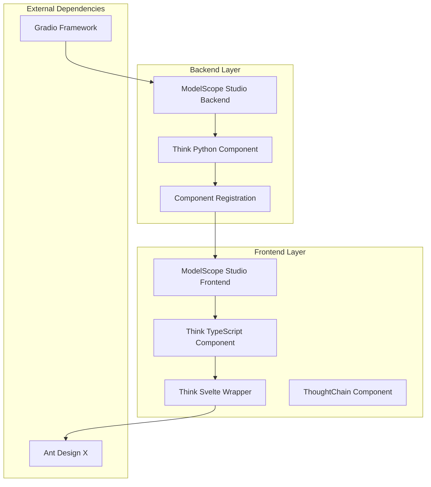
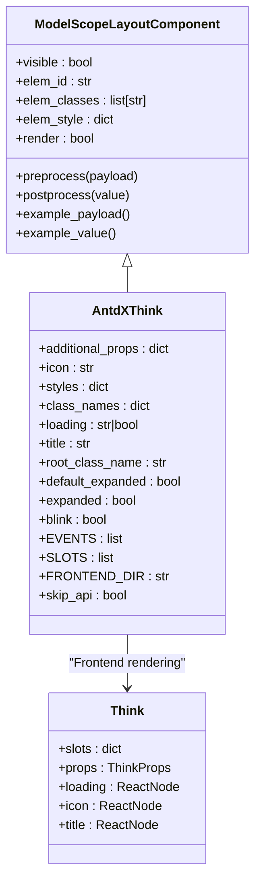
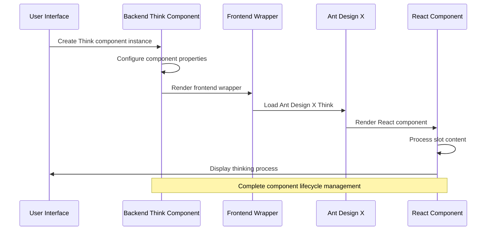
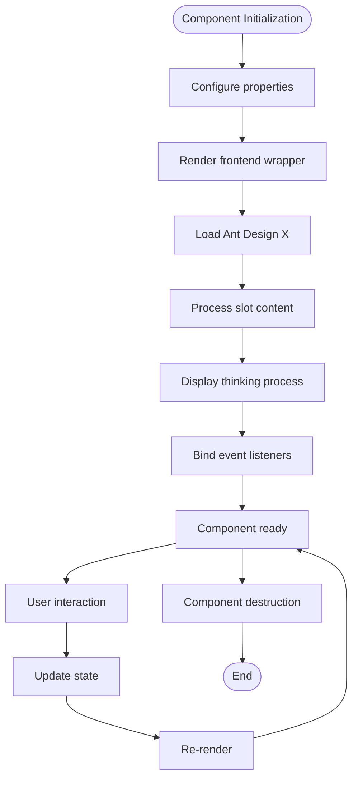
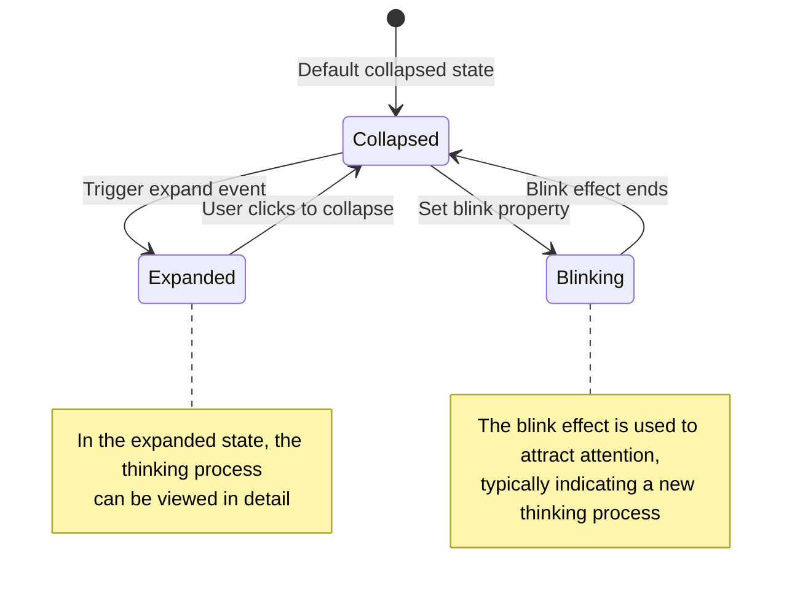
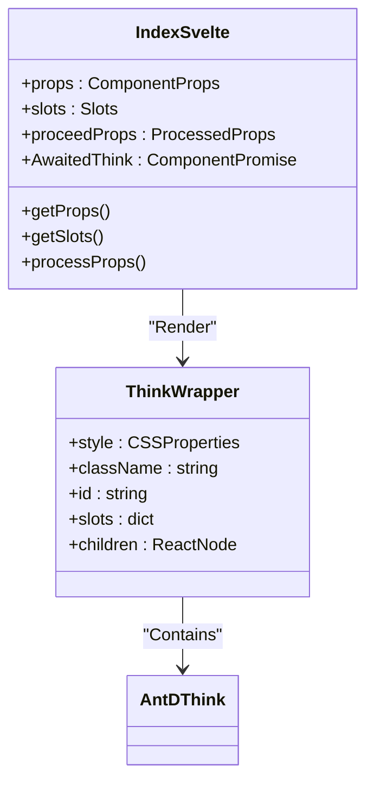
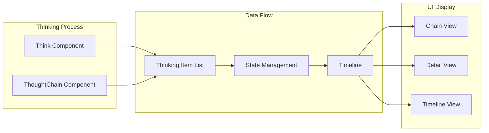
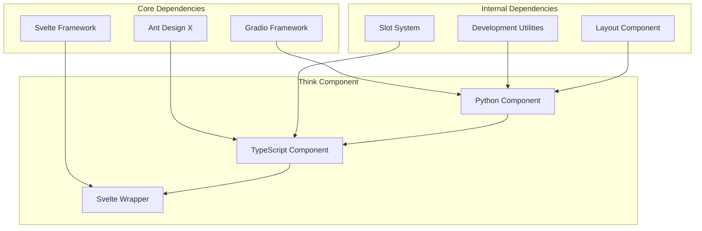

# Think Component

<cite>
**Files Referenced in This Document**
- [think/__init__.py](file://backend/modelscope_studio/components/antdx/think/__init__.py)
- [components.py](file://backend/modelscope_studio/components/antdx/components.py)
- [think.tsx](file://frontend/antdx/think/think.tsx)
- [Index.svelte](file://frontend/antdx/think/Index.svelte)
- [thought-chain.tsx](file://frontend/antdx/thought-chain/thought-chain.tsx)
- [context.ts](file://frontend/antdx/thought-chain/context.ts)
- [__init__.py](file://backend/modelscope_studio/components/antdx/__init__.py)
</cite>

## Table of Contents

1. [Introduction](#introduction)
2. [Project Structure](#project-structure)
3. [Core Components](#core-components)
4. [Architecture Overview](#architecture-overview)
5. [Detailed Component Analysis](#detailed-component-analysis)
6. [Dependency Analysis](#dependency-analysis)
7. [Performance Considerations](#performance-considerations)
8. [Troubleshooting Guide](#troubleshooting-guide)
9. [Conclusion](#conclusion)

## Introduction

The Think component is a core visualization component in ModelScope Studio for visualizing and tracking the thinking process of AI agents. Built on top of Ant Design X's Think component, it is specifically designed to display the reasoning process, decision chain, and intermediate thinking results of agents in conversational systems.

The main design philosophy of this component is to provide transparent visualization of AI decision-making processes, allowing users to understand how AI agents think, analyze, and make decisions. Through detailed recording and display of the thinking process, users can better trust and optimize the behavior of AI systems.

## Project Structure

The Think component is located in the antdx component library within the project architecture, adopting a frontend/backend separated design pattern:

**Diagram sources**

- [think/**init**.py:1-79](file://backend/modelscope_studio/components/antdx/think/__init__.py#L1-L79)
- [components.py:1-40](file://backend/modelscope_studio/components/antdx/components.py#L1-L40)
- [think.tsx:1-24](file://frontend/antdx/think/think.tsx#L1-L24)

**Section sources**

- [think/**init**.py:1-79](file://backend/modelscope_studio/components/antdx/think/__init__.py#L1-L79)
- [components.py:1-40](file://backend/modelscope_studio/components/antdx/components.py#L1-L40)

## Core Components

### Think Component Class Definition

The Think component inherits from `ModelScopeLayoutComponent`, providing complete property configuration and event handling:

**Diagram sources**

- [think/**init**.py:8-79](file://backend/modelscope_studio/components/antdx/think/__init__.py#L8-L79)
- [think.tsx:6-21](file://frontend/antdx/think/think.tsx#L6-L21)

### Key Property Configuration

The Think component supports rich configuration options, including:

- **Basic properties**: Icon, title, style class names
- **State properties**: Loading state, expanded state, blink effect
- **Event properties**: Expand event binding
- **Slot system**: Supports three slots: loading, icon, title

**Section sources**

- [think/**init**.py:21-60](file://backend/modelscope_studio/components/antdx/think/__init__.py#L21-L60)
- [think.tsx:6-21](file://frontend/antdx/think/think.tsx#L6-L21)

## Architecture Overview

The Think component adopts a layered architecture design, achieving clear separation between frontend and backend:

**Diagram sources**

- [Index.svelte:10-67](file://frontend/antdx/think/Index.svelte#L10-L67)
- [think.tsx:6-21](file://frontend/antdx/think/think.tsx#L6-L21)

### Component Lifecycle

**Diagram sources**

- [think/**init**.py:12-16](file://backend/modelscope_studio/components/antdx/think/__init__.py#L12-L16)
- [Index.svelte:55-68](file://frontend/antdx/think/Index.svelte#L55-L68)

## Detailed Component Analysis

### Backend Implementation Analysis

The backend Think component implements the complete Gradio component interface:

#### Event System

The component supports the expand event for handling changes in expanded state:

**Diagram sources**

- [think/**init**.py:12-16](file://backend/modelscope_studio/components/antdx/think/__init__.py#L12-L16)

#### Slot System

The component supports three slots, allowing flexible content customization:

| Slot Name | Type      | Purpose                  | Default Value |
| --------- | --------- | ------------------------ | ------------- |
| loading   | ReactNode | Custom loading indicator | props.loading |
| icon      | ReactNode | Custom icon              | props.icon    |
| title     | ReactNode | Custom title content     | props.title   |

**Section sources**

- [think/**init**.py:18-19](file://backend/modelscope_studio/components/antdx/think/__init__.py#L18-L19)
- [think.tsx:12-16](file://frontend/antdx/think/think.tsx#L12-L16)

### Frontend Implementation Analysis

The frontend uses a hybrid architecture of Svelte + React:

#### Svelte Wrapper

Index.svelte provides complete component wrapping functionality:

**Diagram sources**

- [Index.svelte:12-67](file://frontend/antdx/think/Index.svelte#L12-L67)

#### React Component Bridge

think.tsx implements the bridge from Svelte to React:

- Uses `sveltify` to convert React components to Svelte components
- Handles slot content through `ReactSlot`
- Directly calls Ant Design X's native Think component

**Section sources**

- [Index.svelte:1-69](file://frontend/antdx/think/Index.svelte#L1-L69)
- [think.tsx:1-24](file://frontend/antdx/think/think.tsx#L1-L24)

### ThoughtChain Integration

The Think component and the ThoughtChain component form a complete thinking process visualization system:

**Diagram sources**

- [thought-chain.tsx:11-40](file://frontend/antdx/thought-chain/thought-chain.tsx#L11-L40)
- [context.ts:1-7](file://frontend/antdx/thought-chain/context.ts#L1-L7)

**Section sources**

- [thought-chain.tsx:1-43](file://frontend/antdx/thought-chain/thought-chain.tsx#L1-L43)
- [context.ts:1-7](file://frontend/antdx/thought-chain/context.ts#L1-L7)

## Dependency Analysis

### Component Dependency Diagram

**Diagram sources**

- [components.py:34-34](file://backend/modelscope_studio/components/antdx/components.py#L34-L34)
- [**init**.py:34-34](file://backend/modelscope_studio/components/antdx/__init__.py#L34-L34)

### Version Compatibility

The component ensures compatibility with the following versions:

- **Gradio**: >= 4.0.0
- **Ant Design X**: >= 0.1.0
- **Svelte**: >= 3.54.0
- **React**: >= 18.0.0

**Section sources**

- [components.py:1-40](file://backend/modelscope_studio/components/antdx/components.py#L1-L40)

## Performance Considerations

### Render Optimization

1. **Lazy loading mechanism**: The frontend uses dynamic imports to reduce initial load time
2. **Conditional rendering**: Only renders the component when visible, avoiding unnecessary computation
3. **Slot optimization**: Efficiently handles slot content through ReactSlot

### Memory Management

- Automatically cleans up event listeners when the component is destroyed
- Proper props handling to avoid memory leaks
- Uses useMemo to optimize rendering of complex data structures

## Troubleshooting Guide

### Common Issues and Solutions

#### Component Not Displaying

**Symptom**: The Think component is created successfully but does not appear in the interface

**Possible Causes**:

1. The `visible` property is set to False
2. The `render` property is set to False
3. Parent container style issues

**Solutions**:

- Check the component's `visible` and `render` properties
- Verify the parent container's CSS styles
- Confirm the component is imported correctly

#### Slot Content Not Working

**Symptom**: Custom loading, icon, title slot content is not displayed

**Possible Causes**:

1. Incorrect slot name
2. Slot content type mismatch
3. Incorrect slot passing method

**Solutions**:

- Confirm the slot names are 'loading', 'icon', or 'title'
- Verify that slot content is a valid ReactNode
- Check the slot passing syntax

#### Event Handling Abnormal

**Symptom**: The expand event cannot be triggered normally

**Possible Causes**:

1. Event listener not correctly bound
2. Event callback function error
3. Component state issue

**Solutions**:

- Check the EVENTS array configuration
- Verify the event callback function logic
- Confirm component state synchronization

**Section sources**

- [think/**init**.py:12-16](file://backend/modelscope_studio/components/antdx/think/__init__.py#L12-L16)

## Conclusion

As a core visualization component of ModelScope Studio, the Think component successfully achieves transparent display of AI thinking processes. Through carefully designed architecture and rich configuration options, this component provides developers and users with powerful thinking process tracking capabilities.

### Main Advantages

1. **Complete visualization**: Provides various thinking process display methods from simple to complex
2. **Flexible configuration**: Supports rich property configuration and slot customization
3. **Good performance**: Uses modern frontend technology stack to ensure a smooth user experience
4. **Easy to integrate**: Seamlessly integrates with the Gradio ecosystem

### Application Scenarios

- **AI assistants**: Display the reasoning process and decision chain of agents
- **Data analysis**: Visualize data exploration and analysis thinking
- **Code generation**: Display the thinking process and logic of code generation
- **Multimodal applications**: Support thinking processes for various input types such as text and images

This component lays a solid foundation for building trustworthy and explainable AI applications and is an indispensable important component of modern AI products.
